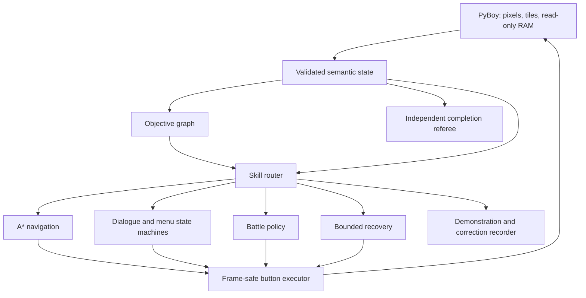

# Pokémon Red Completion Agent

[](https://github.com/PeteAndrews1289/pokemon-red-completion-agent/actions/workflows/ci.yml)
[](LICENSE)
[](docs/roadmap.md)

**A completion-first autonomous system for Pokémon Red: verified quest planning, deterministic
control, and progressively trained specialists.**

> **Current status:** the deterministic teacher completes Pokémon Red from clean power-on through
> the Hall of Fame in one uninterrupted, no-save-restore emulator session. Three independent runs
> produced the same **299/299 checkpoints**, **36/36 objectives**, **4,796,436 frames**, and
> **41,316 actions**, with human input disabled and the controller released at termination. The
> terminal gate requires the Champion-defeated event and Hall-of-Fame map concurrently. This is a
> verified deterministic-teacher completion—not a learned-policy or unseen-seed generalization
> claim. See the
> [sanitized three-run completion receipt](docs/evidence/qualified-play-hall-of-fame-2026-07-29.json).
> The first private, integrity-audited trajectory reproduced the same terminal in 4,796,436 frames
> while recording **41,330 executor actions**, **300 events**, and **14,760 deduplicated semantic
> snapshots**. The 14-action difference closes a previously uncounted menu-control path; it is not
> a route change. See the
> [sanitized trajectory-foundation receipt](docs/evidence/private-trajectory-foundation-2026-07-30.json).
> The subsequent robustness lineage has now also completed two clean-power rehearsals with the
> same **299/299 checkpoints**, **36/36 objectives**, **5,163,657 frames**, and **43,005 actions**.
> Those different totals reflect the deliberately changed route, recovery, economy, and battle
> policy documented in the [Project Narrative](docs/project-narrative.md); they do not rewrite the
> historical receipt. Broad validation passed and the source-bound collection registry was
> published at commit `58c3dbd`. Its first uncounted 63-battle schedule rehearsal exposed a
> held-out Route 25 failure at checkpoint 49/299; the campaign remains unopened and all twelve
> declared collection slots remain pending. Uncommitted diagnostic hardening now carries the same
> declared offsets through Route 25, the S.S. Anne, Vermilion, and Route 9 before stopping in Rock
> Tunnel. This is progress evidence, not a replacement qualification; see the living narrative for
> the exact distinction.
> The current robustness branch now adds a bounded, semantic Pokémon Mansion training skill. Two
> clean-power replays reproduced **301/301 checkpoints**, **36/36 objectives**, **6,581,531
> frames**, and **54,261 actions**, ending with the Champion event and Hall-of-Fame map together.
> In each run the lead trained from level 46 to 55 through 115 wild wins, 1,862 bounded encounter
> steps, five healing trips, and zero faints; it reached Indigo at level 58 and the Hall of Fame at
> level 61. This is still deterministic-teacher evidence, not a learned-policy claim.
> The balanced-team curriculum now catches Route 12 Snorlax, obtains and evolves Jolteon, clears
> all five Fighting Dojo trainers, and chooses Hitmonlee to complete its declared six-member
> roster. Its newest uninterrupted clean-power run completes **312/312 checkpoints** and **36/36
> objectives**. The zero-faint training block stops after 5,445 wins and 529 healing trips with
> every member at level 82–87, satisfying the strict five-level spread before the same lineage
> clears Giovanni, Victory Road, the Elite Four, the Champion, and Hall of Fame in **516,338
> actions**. This qualifies the deterministic six-member teacher; collection and learned-policy
> evaluation remain open. See the
> [sanitized six-member receipt](docs/evidence/qualified-play-balanced-six-2026-08-01.json).
> The completionist foundation now defines an auditable **124-registration** Red-only target and names
> all **27** exclusions imposed by a one-save, no-link-cable Squirtle/Helix/Hitmonlee/Jolteon run.
> It reads the cartridge's seen/owned Pokédex flags and performs a checksum-verified census of the
> party and all twelve PC boxes through a bounded read-only port. Registration, living retention,
> and level 100 remain separate gates. Because unique Squirtle, Eevee, and Helix Fossil evolutions
> consume four earlier forms, the honest maximum is **120 simultaneously living level-100
> species**, not 124. Exact deposit, withdraw, and verified switch-box execution now exist;
> a source-pinned catalog now covers all **124 registrations** through **102 direct methods** and
> **22 transformations**, derives the necessary duplicate precursors and evolution-item budget,
> and drives a bounded semantic area-survey loop. Map-specific live execution beyond the already
> qualified gifts, trades, captures, evolution, and storage actions remains future work. The first
> uninterrupted Hall-of-Fame census measured
> **12 owned, 85 seen, 7 living, and 0 at level 100**, with all twelve boxes verified; see the
> [sanitized collection-census receipt](docs/evidence/qualified-play-collection-census-2026-08-01.json).
> The corrected perfect-save foundation has now passed a newer uninterrupted clean-power replay:
> **312/312 checkpoints**, **36/36 objectives**, and a zero-faint six-member gate after **6,493
> wins**, with levels **88–93**. The route initialized PC storage, completed and reversed a box
> switch without losing Zubat, verified all twelve boxes, and entered the Hall of Fame. Its honest
> terminal census is **12/124 registered, 7/120 living, and 0/120 at level 100**. This qualifies
> the storage and contract foundation—not the still-unbuilt acquisition or learned-policy claims.
> See the [sanitized perfect-save foundation receipt](docs/evidence/qualified-play-perfect-save-foundation-2026-08-01.json).
> The first live acquisition slice is now qualified as well. The teacher crosses Diglett's Cave
> and Route 2, catches Route 1 Pidgey and Rattata through ordinary encounters, verifies their
> Pokédex flags, deposits both exact specimens, returns to the Lt. Surge route, and completes the
> same **312/312 checkpoints** and Hall-of-Fame gate. The uninterrupted run used **758,430
> actions**, passed the zero-faint six-member gate at levels **77–82**, and finished with
> **14/124 registered, 9/120 living, and 0/120 at level 100**. This is one complete acquisition
> slice, not a claim that the remaining collection or learned agent is finished. See the
> [sanitized Route 1 receipt](docs/evidence/qualified-play-route1-acquisition-2026-08-02.json).
> Route 1 now runs through the same reusable semantic source-survey controller as the game-neutral
> planner rather than a chapter-local target loop. The live adapter reads the Pokédex, full party,
> and all twelve verified boxes; preserves a declared capture order when deterministic downstream
> storage requires one; and proves bounded seek, capture, flee, progress, and endpoint-normalization
> behavior. A new route-agnostic priority view counts duplicate root specimens required by later
> evolutions. The refactored lineage reproduced the exact **83,835,201 frames** and **758,430
> actions** and passed the complete private integration contract. See the
> [sanitized reusable-source receipt](docs/evidence/qualified-play-reusable-wild-source-2026-08-02.json).
> The same reusable controller now also surveys Viridian Forest, retaining Caterpie, two Metapod,
> two Kakuna, and Pikachu before returning to the story route. Two independent clean-power replays
> reproduced **312/312 checkpoints**, **36/36 objectives**, **83,619,428 frames**, and **765,088
> actions** through the Hall of Fame. The terminal census is **18/124 registered, 13/120 distinct
> living species, and 0/120 at level 100**, with nine specimens in Box 1 and the six-member story
> party intact. Fifteen specimens are physically retained; the duplicate Metapod and Kakuna roots
> intentionally do not inflate the distinct-species count. This qualifies the Forest source, not
> the remaining collection or a learned completion agent. See the
> [sanitized Viridian Forest receipt](docs/evidence/qualified-play-viridian-forest-2026-08-02.json).
> A first slot-equivariant battle ranker now reaches **72.5% teacher-choice agreement** versus a
> **50.5% fold-local majority baseline** across 422 decisions; its hard legality and PP mask keeps
> every output valid by construction. This is a grouped diagnostic from one lineage, not a learned
> gameplay rollout or held-out result. See the
> [sanitized battle-imitation receipt](docs/evidence/private-battle-imitation-diagnostic-2026-07-30.json).
> The formal v3 teacher rehearsal subsequently completed **312/312 checkpoints**, **36/36
> objectives**, and **68/68 scheduled battles**, with a balanced level **75–81** party and Hall of
> Fame verification. Its first immutable training root then failed honestly at Route 24 trainer 2:
> accuracy loss produced repeated Water Gun misses while poison and enemy attacks fainted
> Wartortle with 4 enemy HP remaining. V3 is retired rather than rerun. V4 subsequently qualified
> its full 312-checkpoint/68-battle rehearsal, but its immutable first training root fainted at the
> final Route 24 bridge trainer. V4 is preserved and retired. The current v5 teacher adds a verified
> Center recovery before that fight and preregisters a fresh dry run plus twelve disjoint counted
> seeds. V5 must qualify before its first training root; no learned model has yet completed the game.

## The goal

Reach the Hall of Fame from clean power-on with:

- a fingerprinted Pokémon Red ROM supplied privately by the user;
- frozen source, configuration, objective graph, and model weights;
- no human controller input;
- no save-state restoration during evaluation;
- no online code or prompt modification; and
- concurrent Champion-event and Hall-of-Fame verification.

Training may use walkthrough knowledge, read-only game state, demonstrations, private snapshots,
teacher corrections, and local reinforcement learning. Those resources are disclosed rather than
presented as learning from nothing.

The ambition beyond this first contract is deliberately larger: finish each supported Pokémon
title, satisfy its published perfect-save contract, and train every specimen that can coexist in
that save to level 100. A separate multi-lineage portfolio combines versions, starters, fossils,
branches, and supported trades toward the broader all-species goal. Unsupported online services,
expired events, and unavailable distributions stay visible as exclusions instead of being hidden
behind the phrase “100%."

## Why this project exists

The predecessor, [Pokémon Red AI](https://github.com/PeteAndrews1289/pokemon-red-ai), processed
8.24 million self-generated actions and discovered seven milestones, but finished frozen
evaluation with zero durable skills. Its result was that discovery and training activity did not
become cumulative competence.

This successor changes the objective and architecture:

1. make reliable game completion the primary target;
2. represent the known long-horizon route explicitly;
3. use deterministic solutions for pathfinding, menus, and verification;
4. train bounded specialists where learned decisions are valuable; and
5. replace teacher components only after learned alternatives pass frozen reliability gates.

For the full engineering story—including what the completed run established, which assumptions
failed under changed lineages, how those failures became reusable capabilities, and what remains
unproven—see the [Project Narrative](docs/project-narrative.md).

## Architecture



The learned policy will choose goal-conditioned **macro-actions**, not rediscover controller timing
one frame at a time. The objective graph carries long-term progress; specialists solve bounded
navigation, dialogue, battle, inventory, puzzle, and recovery tasks.

See [Architecture](docs/architecture.md), the
[Completion Contract](docs/completion-contract.md), and the
[Assistance Policy](docs/assistance-policy.md).

## Planned training ladder

1. A deterministic teacher completes three clean runs.
2. Teacher trajectories train goal-conditioned specialists with behavioral cloning.
3. DAgger adds corrections from states caused by the learner's own mistakes.
4. Snapshot curriculum RL is used only for skills that remain below their reliability gates.
5. Teacher fallback is removed one specialist at a time.
6. A distilled local macro-policy attempts the full game.

Each stage retains its complete success and failure denominator. Hybrid completion, learned-module
completion, learned-stack completion, and distilled-model completion are separate claims.

## Does it need a completed run?

Not to begin. The deterministic teacher is built chapter-by-chapter from disclosed route knowledge,
verified maps and state, and closed-loop objective checks. This project requires a full teacher
completion before training or evaluating full-game composition.

A single completed video or button trace would help with route review, but it would not teach
recovery from mistakes. Behavioral cloning needs action-aligned demonstrations; DAgger needs a
queryable teacher that can correct states the learner actually reaches. See the
[Teaching and Data Plan](docs/teaching-plan.md).

## Public verification

The default checks require no ROM:

```bash
python3 -m venv .venv
source .venv/bin/activate
python -m pip install -e ".[dev]"

python scripts/check_public_artifacts.py
python scripts/check_docs.py
ruff check .
pytest -m "not integration"
```

Battle-learning development additionally uses the optional NumPy dependency:

```bash
python -m pip install -e ".[dev,learning]"
```

## Private emulator setup

PyBoy integration is optional so public tests remain redistribution-safe:

```bash
python -m pip install -e ".[dev,emulator]"
export POKEMON_RED_ROM="/absolute/path/to/Pokemon Red.gb"

pokemon-red-completion doctor
pokemon-red-completion bootstrap
pokemon-red-completion opening
pokemon-red-completion opening --watch --speed 4
pokemon-red-completion play
pokemon-red-completion play --watch --speed 4

# One-time setup for an existing directory on a separate private volume:
pokemon-red-completion private-data init --private-root /absolute/private/trajectory-directory

# Record one full teacher episode there:
pokemon-red-completion record --private-root /absolute/private/trajectory-directory

# After the exact source/config commit is committed and pushed, run the required
# unassigned, non-counted 68-battle schedule rehearsal before slot 01:
pokemon-red-completion record \
  --private-root /absolute/private/trajectory-directory \
  --schedule-dry-run

# Only after that rehearsal succeeds, consume one declared training slot:
pokemon-red-completion record \
  --private-root /absolute/private/trajectory-directory \
  --collection-run red-battle-v5-01-train

# After all five train and two validation roots complete, fit without opening test:
pokemon-red-completion learn battle fit \
  --private-root /absolute/private/trajectory-directory

# Inspect all twelve slots and reconcile a power-loss partial without starting a run:
pokemon-red-completion collection status \
  --private-root /absolute/private/trajectory-directory
```

`bootstrap` starts PyBoy headlessly from immutable verified ROM bytes, disables human window input,
loads no adjacent save data, reaches the bedroom with the built-in RED/BLUE names, verifies one
movement action, and exits without saving. Its JSON report contains hashes and semantic evidence,
not the ROM path or game assets.

`opening` runs the bounded teacher through six closed-loop checkpoints: bedroom input, downstairs,
outside, Oak's trigger, starter-selection readiness, and verified Squirtle. It is headless and
uncapped by default. `--watch --speed 4` instead opens a local PyBoy window at 4× speed and prints
checkpoint progress before the final JSON report. Watch mode changes presentation only: keyboard
input remains disabled, while the window itself stays responsive and can be closed with Escape or
its red close button. The same semantic gates choose every action, and the emulator still exits
without saving.

`play` is the recommended continuous command. It uses one clean emulator session for the opening,
the verified rival win, both Route 1 crossings, the parcel handoff, Viridian Forest, Brock, Route
3, Mt. Moon, Cerulean City, Nugget Bridge, Bill, Misty, Route 5, the Underground Path, Route 6,
Vermilion City, the S.S. Anne through HM01, Vermilion Gym through the Thunder Badge, Route 9,
Rock Tunnel, Lavender Town, Route 8, the west-east Underground Path, Route 7, and Celadon City.
It then reveals and clears the Rocket Hideout, defeats Giovanni, obtains the Silph Scope, crosses
Pokémon Tower, calms Marowak, rescues Mr. Fuji, receives the Poké Flute, and heals in Lavender
Center. It then wakes and catches the level-30 Route 12 Snorlax with a bounded Great Ball/Poké Ball
policy, clears the four mandatory Route 12/13 trainers, bypasses every other Route 12–15 trainer
and progression pickup, and heals the complete party in Fuchsia Center.
It then returns to Celadon, defeats Erika, buys exactly one Fresh Water on the Department Store
roof, proves the guard consumes it before the global Saffron-access flag is set, crosses the
Route 7 gate without battle, and heals in Saffron Center.
It then buys a bounded recovery reserve, obtains and teaches TM13 Ice Beam, enters Silph Co.,
obtains the Card Key, clears the required warp route and trainers, defeats the rival and Giovanni,
receives the Master Ball, leaves optional Lapras untouched, and returns to a healed Saffron
Center boundary.
It then follows a live-qualified trainer-free Saffron Gym warp route, defeats Sabrina with a
physical Strength and Ice Beam policy, verifies TM46 plus both Marsh Badge lanes, and heals.
It then obtains HM02 Fly, reaches Cinnabar by way of Pallet and Route 21, traverses Pokémon
Mansion with one Max Repel and no trainer battles, recovers the Secret Key, clears all six Gym
quizzes without a regular-trainer battle, defeats Blaine with Surf, receives TM38 plus both
Volcano Badge lanes, and returns to a healed Cinnabar Center.
It then flies to Viridian, frees one bag slot by selling TM46, solves the spinner floor, clears
the six route-gating trainers with Strength and Ice Beam, heals before the leader, defeats
Giovanni with Surf, verifies TM27, both Earth Badge lanes, and both Route 22 rival events, then
returns to a healed Viridian Center with all eight badges.
It then teaches Toxic, prepares a bounded Saffron recovery and repel reserve, defeats the final
Route 22 rival with state-aware healing, verifies all seven remaining Route 23 badge checks,
solves every Strength boulder and switch in Victory Road, reaches Indigo Plateau, heals, and buys
the declared Full Restore, Full Heal, Hyper Potion, X Special, and Max Repel reserve.
It then defeats Lorelei, Bruno, Agatha, Lance, and the Champion, enters the Hall of Fame, and
reports completion only when the Champion event and Hall-of-Fame map are simultaneously true.
The forest
segment deliberately trains against three verified Kakuna encounters and one mandatory Bug
Catcher. Later gates require the declared trainer identities and event order, Bill's complete
transformation and S.S. Ticket sequence, the mandatory Cerulean Gym trainer, Misty's live trainer
identity, the Cerulean Rocket thief and TM28, and both required lower Route 6 trainers. A bounded
heal-and-replay recovery explicitly records and flees three exact Route 6 Pidgey encounters while
proving unchanged PP and trainer events. The S.S. Anne chapter verifies the required RIVAL2
identity, a live win, the Captain's rub event, the separate HM01 event, HM01 inventory presence,
and the derived Cut fact. The Surge chapter buys bounded capture and recovery supplies, captures
Spearow and a source-valid Diglett, trades for DUX, teaches Cut and Dig when needed, adapts to the
live Gym switch pair, and verifies a Dig-only Surge win plus TM24 and mirrored badge evidence.
The Lavender chapter teaches BubbleBeam, purchases an exact recovery reserve, proves all 11
required Route 9/Rock Tunnel trainer identities and PP decrements, retries a movement step only
after a qualified wild flee, bypasses the optional south Route 10 trainer, and heals the complete
three-Pokémon party in Lavender Center.
The Celadon chapter bypasses eight optional Route 8 trainers, proves the single required Lass
identity and event transition with selected-move PP evidence, preserves the exact recovery
inventory, and heals the complete party in Celadon Center. After the later qualified Tower
evolution, the exact route ends with a full-health, status-free Blastoise restored as party lead.
The Hideout chapter proves five exact trainer identities, bypasses all eight optional basement
trainers, verifies the poster switch, Lift Key, elevator floor, boss-door, Giovanni, and Silph
Scope gates, and explicitly records the pinned source's known `EVENT_ENTERED_ROCKET_HIDEOUT`
callback bug without weakening any required event.
The Tower chapter proves the exact scripted rival, five required Channelers, level-30 Marowak,
and three Rocket identities; bypasses eight optional Channelers; verifies all three purified-zone
heals, both blocking item pickups, the mirrored and world Fuji rescue events, and the Poké Flute;
and qualifies the natural Wartortle-to-Blastoise evolution without changing party order or moves.
Its adaptive battle and navigation selection reacts to bounded state, but the
three-run result evaluates one frozen teacher route and does not yet show held-out timing or RNG
generalization.
The Fuchsia chapter verifies the Poké Flute wake transition, exact Snorlax species and level,
capture, party growth, event transition, removed-object tile, and retained Flute; records five
exact battle PP receipts;
performs a disclosed resource-neutral Lavender Center recovery; flees four bounded wild
encounters; and proves 35 optional events plus five optional items remain untouched.

The ROM, saves, snapshots, recordings, datasets, and model checkpoints are ignored and must remain
outside Git. The visible window is not recorded or uploaded by the project. The supported revision
is identified by public hashes in the source; reports omit the private ROM path, and no game data
is distributed.

`private-data init` deliberately requires an existing directory on a separately mounted volume.
It places a tamper-evident sentinel there but never creates a missing mount point. `record` refuses
uninitialized, same-device, symlinked, Git-controlled, or overlapping destinations. It also
requires an identified, clean Git checkout so every accepted episode names the exact source
commit. Output contains only a path-free episode identifier and aggregate summary. The first
recorder is an executor-aligned teacher trace. The next layer records zero-based battle move
decisions from the shared adaptive runtime and links their full execution spans. The first
single-lineage battle-imitation diagnostic groups 422 decisions into 63 encounter proxies and
reaches 72.5% teacher-choice agreement versus a 50.5% fold-local majority-slot baseline. A hard
legality and PP mask makes all outputs valid by construction; that safety invariant is not a
learned success metric. This is not battle win rate or a learned gameplay rollout.

New recordings bind each adaptive decision to an explicit physical battle instance, one of 68
stable public battle-plan identities, planner objective, win goal, and required-move policy. The
current `pokemon.core.battle.move-ranker.v2` schema adds
`constraint.matches_required_move`; receipts report free-choice and forced-choice accuracy
separately so constraint-following cannot be mistaken for autonomous move selection. The recorded
teacher recovery marker is descriptive only, is not a model feature, and does not yet encode a
typed recovery budget.

The committed collection protocol preregisters twelve immutable one-attempt root-lineage
slots—five train, two validation, and five test—with partition-local ordinals and a different
68-battle timing schedule for each. The exact source/configuration commit must be committed and
pushed before collection. A registry-declared, unassigned, non-counted dry run must then attest all
68 schedule applications before slot `01`. Counted runs emit per-battle and terminal schedule
attestations; a private campaign seal and outcome ledger preserve every success, failure,
interruption, and invalid result. An interruption consumes its slot rather than authorizing a
rerun. The successful rehearsal produces an immutable private qualification that every counted
run reopens and audits before it can seal the campaign or create an episode. That episode start is
synchronously persisted before play, so a shutdown cannot erase a one-shot attempt claim.
Policy-visible semantic overlap across partitions is disclosed but is not hard leakage by
itself; copied identities, manifests, assignments, schedules, or lineages are.

The first Forest-lineage rehearsal exposed a moving-NPC collision at the Route 24 entrance at
checkpoint 38/312. The repaired crossing then passed clean-power qualification and cleared the
former failure under the same rehearsal schedule. That second rehearsal reached checkpoint
109/312 before a final Rock Tunnel trapping sequence crossed the battle policy's 40-HP recovery
gate and fainted the lead. Neither rehearsal qualified or consumed a declared slot. Subsequent
clean diagnostics hardened the tunnel with type-aware attacks and a prepared DUX sleep pivot,
removed a wasteful Tower top-off, broke an Alakazam healing loop, and excluded two-turn Fly from
the one-turn Mansion grinding policy. The combined source then passed an uninterrupted clean-power
replay at **312/312 checkpoints**, entering the Hall of Fame after **84,632,189 frames**. It was
then committed, pushed, and bound to a regenerated registry before the rehearsal was retried.
All twelve slots remain pending and the test partition remains unopened, so there is still no
held-out or promoted-policy result.

The first rehearsal of that published source cleared the former Route 24 and Route 25 failures,
then stopped at checkpoint 109/312 when Bellsprout began Wrap with 20/57 HP and trapped Wartortle
until it fainted. A later published candidate cleared that matchup but its uncounted rehearsal
stopped when an unsafe low-HP DUX finisher fainted in the tunnel; neither failure consumed a
campaign slot. The current teacher removes that finisher, budgets the tunnel's healing reserve,
uses type-aware Bite after required Slowpoke evidence, escapes a status-locked DUX to the healthy
story lead, accepts natural evolution without falsely requiring candy consumption, and uses any
surplus Rare Candy at the level-41 lesson boundary. It also releases movement input around moving
Celadon NPCs and uses Ice Beam plus bounded recovery against the Silph rival. The next uncounted
rehearsal proved the DUX escape but then put replacement Blastoise to sleep and fainted it because
battle healing targeted only party slot one. The current teacher buys one additional Awakening in
Vermilion, preserves one for Tower, cures the actual active party member, and targets Super Potions
to that same live party index under a two-use cap. This exact source passed a new uninterrupted
**312/312-checkpoint**, **36/36-objective** clean-power replay through the Hall of Fame in
**771,022 actions**. Its Mansion curriculum exceeded **4,000 battles** with a six-member minimum
level of **77** and a five-level spread. The regenerated source identity is the next uncounted
rehearsal candidate. That rehearsal cleared all nine tunnel trainers, then exposed a $200
schedule-specific recovery shortfall during the Lavender restock. The current teacher legally
liquidates the already-proven, unused TM28 for $1,000 before restoring the full downstream safety
reserve. That correction carried the rehearsal to checkpoint 202/312, where Juggler 4 exposed a
low-HP lead assumption. The current policy protects the story lead by handing the finish to the
healthiest living reserve and choosing from that reserve's own legal moves. All twelve counted
slots remain pending. That repair reached checkpoint 261/312, where an attempted Sabrina Hyper
Potion outlasted the shared routine's 24-frame menu-settling window. Battle-item recovery now uses
a bounded 720-frame, cancel-safe observation window that cannot accidentally re-enter ITEM. That
repair passed Sabrina and reached the balanced-team curriculum, where a member eventually lost
every usable preferred attack to PP exhaustion or Disable. The trainer now pivots through the safe
escort, flees, and lets the game-neutral planner schedule restoration instead of forcing a move.
That repair completed the entire scheduled rehearsal at **312/312 checkpoints**, defeated the
Champion, and entered the Hall of Fame. Promotion then failed closed because the 4,000-battle wild
curriculum had no explicit training intent and repeated progress reports reused one event identity.
The recorder retained roughly **848,000 records / 506 MB**, the failed run consumed no slot, and
the current source gives every wild-training decision a portable objective, assigns each physical
battle its own lifecycle, and keys repeated progress events to their execution step.
The next exact-source rehearsal again completed **312/312 checkpoints** and Hall of Fame. It
accepted 4,789 move labels and every lifecycle/progress event, reducing the remaining rejection to
209 early switch-training decisions. Those decisions selected Blastoise's move after a weak field
lead switched out, while the semantic snapshot still described the field lead. Battle snapshots
now describe the currently controlled battler during combat and the field lead outside combat,
which makes switch training truthful and portable. The second failed rehearsal also consumed no
slot. The corrected source then passed the complete scheduled rehearsal at **312/312 checkpoints**,
**36/36 objectives**, and Hall of Fame, promoting **4,998 decisions** and **870,460 total records**
with all 68 scheduled-battle attestations intact. The first genuinely held-out v1 training run then
failed honestly at checkpoint 41 when a poisoned 17/54-HP Wartortle was trapped by Ekans's Wrap;
that one-shot outcome remains sealed and v1 cannot be used for fitting. Moving the already-planned
Route 24 Center recovery before that trainer cleared the exact exposed schedule through the next
checkpoint. A separately identified v2 campaign now preregisters fresh train, validation, test,
and rehearsal seeds; it must pass its own uncounted full rehearsal before any v2 slot is consumed.
The first v2 rehearsal reached checkpoint 70 before a walking Cerulean NPC occupied the Route 6
healing-replay corridor. That uncounted artifact is retained. A bounded yield-and-retry maneuver
then cleared the exact exposed schedule through checkpoint 71; v2 remains unopened with all twelve
counted roots untouched pending a new full rehearsal. That replay then reached checkpoint 91 and
exposed a second uncounted stress case: the six-capture Viridian Forest curriculum exhausted its
25-ball budget on Pikachu. The legal early-game reserve is now 30, with the later bounded cleanup
gate updated to match; the larger purchase must prove both capture and downstream economy in the
next full rehearsal. Its added purchase timing shifted the Route 11 encounter stream and exposed
the old 72-encounter Spearow search cap. A source-specific 96-encounter cap now retains the exact
level-17 Spearow requirement without loosening any other encounter bound.
That rehearsal then cleared the Forest and Route 11 curricula and reached Lt. Surge. Diglett
finished the first opponent at 10/30 HP but was knocked out before its next Dig. The teacher now
uses its reserved Super Potion from a strictly proven low-HP battle-menu state, verifies the heal
and inventory change, and resumes the Dig-only plan. The counted v2 campaign remains pristine while
the repaired teacher awaits another complete rehearsal.
The next exact replay proved the recovery and Dig-only win through the complete Surge chapter. It
then exposed a stale Lavender entrance assumption that required the reserved potion to remain in
the bag. The handoff now accepts the proven zero-or-one outcome and retains the later exact
money-and-inventory proof when topping up to the fixed twelve-potion reserve.
The following replay reached checkpoint 102 and exposed the associated ₽700 replacement cost. Its
intermediate repair retained the planned allocation while the evidence
report records the observed starting reserve and proves exact potion conservation. The later TM28
sale funds any required Lavender top-up, preserving the fixed downstream reserve.
The 30-ball curriculum also displaced the ₽1,400 required for four Rock Tunnel Repels. The tunnel
allocation is now ten Super Potions—twice the proven five-potion Route 9 floor—plus all four Repels,
with the unchanged Lavender top-up restoring twelve for downstream chapters.
The next rehearsal proved that repair through Rock Tunnel and reached Celadon Gym at checkpoint
220. It also revealed that Koga's terminal mutual-KO recovery completed the game battle outside the
adaptive loop without closing its schedule entry. Externally settled trainer exits now close the
matching applied schedule entry exactly once before the next planned battle.
That repair then passed Erika and reached checkpoint 230, where a moving department-store customer
blocked the evolution-stone clerk aisle. The route now uses a bounded eastward yield maneuver and
proves it returns to the exact approach coordinate before continuing.
The repaired route then reached Silph Co. checkpoint 243, where the rival knocked out Blastoise
with 17 HP left on its active Pokémon. The teacher now selects the healthiest living reserve from
the forced-switch menu and continues from that battler's real move PP, adding a concrete full-team
recovery lesson instead of relying exclusively on the lead.
The first replay reached that branch and exposed Gen I's faint dialogue before the party cursor.
The selector now periodically advances only that bounded dialogue while continuing to verify the
living reserve cursor and the eventual return to the battle's main menu.
The following replay exposed the terminal variant where the rival's final Pokémon also reached zero
HP. The teacher now accepts a proven post-selection battle exit for that mutual knockout and closes
the exact Silph schedule entry, while ordinary knockouts still require a restored main menu.
That repair proved checkpoint 244, then exposed lingering post-rival text before the elevator route.
Terminal recovery now requires two consecutive field-control observations before issuing movement,
the same completion gate used by ordinary adaptive battles.

## Evidence and project status

- [Roadmap](docs/roadmap.md) — milestone gates and current implementation status
- [Completion contract](docs/completion-contract.md) — what qualifies as completion
- [Architecture](docs/architecture.md) — authority and subsystem boundaries
- [Assistance policy](docs/assistance-policy.md) — permitted training and evaluation resources
- [Teaching and data plan](docs/teaching-plan.md) — references, demonstrations, and DAgger order
- [Cross-game transfer plan](docs/transfer-learning.md) — shared ontology and promotion gates
- [Battle-learning design](docs/battle-learning.md) — private data boundary, feature schema, model,
  and split rules
- [Preregistered battle collection](docs/collection-protocol.md) — frozen route identities,
  train/validation/test assignments, and timing derivation
- [First trajectory receipt](docs/evidence/private-trajectory-foundation-2026-07-30.json) —
  sanitized integrity, privacy, and scope evidence
- [First battle-decision receipt](docs/evidence/private-battle-decisions-2026-07-30.json) —
  422 privacy-safe adaptive move labels with exact execution linkage
- [First battle-imitation diagnostic](docs/evidence/private-battle-imitation-diagnostic-2026-07-30.json) —
  aggregate same-lineage teacher-choice agreement with explicit non-promotion limits
- [Optional upstream baseline](docs/upstream-baseline.md) — pinned, isolated comparison boundary
- [Contributing](CONTRIBUTING.md) — safety and evidence requirements

## Attribution

The design is informed by the author's concluded Pokémon Red AI study, the MIT-licensed
[Continual Harness/PokéAgent](https://github.com/sethkarten/continual-harness), the
[PyBoy](https://github.com/Baekalfen/PyBoy) emulator, and the
[pret Pokémon Red disassembly](https://github.com/pret/pokered). The qualified opening corridors,
warps, events, and starter layout are pinned to pret/pokered commit
`1e96034092686d006e863cace09e87273051a3d8`; the route was independently exercised against the
supported private ROM. Any other imported or adapted code will be pinned and attributed before
use.

Pokémon is owned by Nintendo, Game Freak, and The Pokémon Company. This independent educational
project is not affiliated with or endorsed by them.
