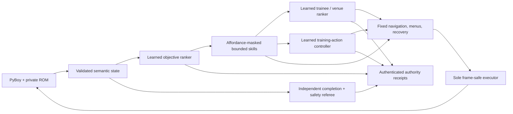

# Pokémon Red Completion Agent

> **Working on this repository?** Read [MISSION.md](MISSION.md),
> [NORTH_STAR.md](NORTH_STAR.md), the generated
> [active product state](ACTIVE_PRODUCT_STATE.md), the
> [model-first roadmap](docs/model-first-roadmap.md), and then [HANDOFF.md](HANDOFF.md).

> **Current product focus (August 20, 2026): eight rootless outcomes are admitted; fit once.**
> Exact executable source `048bea66d205b0e784b3321763e2725d2ccfff32` passed CI
> `32336487689/1`. The
> [campaign result receipt](docs/evidence/rootless-living-dex-dependency-campaign-result-v1-2026-08-20.json)
> (SHA-256 `415af97d2414fb2da0083c45df30154ac70c05bbd4c83c852006120c953cf3c4`)
> records **8/8 settled · 4 positive · 4 negative · 0 interrupted · 12/12 one-shot identities
> consumed · 4 development openings still sealed**. It adds exactly **8 synthetic rootless train
> outcomes** and **8 synthetic atomic episodes**; fits, comparisons, gameplay, ROM/controller,
> teacher, authority, and transfer all remain unchanged.
>
> Active `rootless-living-dex-dependency-fit-v1` is the first parameter-update step in this
> abstract lane: run exactly one fixed train-only fit and stop at its durable terminal. Scoped
> rootless fits are **0/1** and held-out comparisons **0/1**; global boards remain **30/15
> outcomes · 4 fits · 3 comparisons**. Antigravity returned GO with no P0/P1 blocker. Claude is
> unavailable for the current usage window and is not a dependency. Development disclosure,
> comparison, Red/Crystal gameplay, promotion, completion, and transfer remain closed.

> **Previous product focus (August 20, 2026): the rootless campaign was training-ready.** Exact
> source `048bea66d205b0e784b3321763e2725d2ccfff32` passed CI `32336487689/1`. The
> [campaign preflight receipt](docs/evidence/rootless-living-dex-dependency-campaign-preflight-v1-2026-08-20.json)
> (SHA-256 `6d650fc903493b490d6b990b5df6166b99425977e0931830329d84c24b1e1ba2`)
> records frozen campaign `404e3a02…0bc9b92`, **8 train scenarios**, **4 opaque development
> commitments**, **12/12 global identities unused**, and **10/10 local output namespaces empty**.
> The freeze and preflight made zero predictions or transitions, disclosed zero development
> payloads, and moved no learning counter.
>
> Active `rootless-living-dex-dependency-curriculum-v1` may execute and strictly admit only those
> eight fixed synthetic train rows. The board is **0/8 outcomes · 0/8 atomic episodes**. Claimed
> cells never retry; missing or censored rows receive no replacement. Stop before fit, development
> disclosure, comparison, ROM/gameplay, authority, or Crystal. “Training-ready” here means the
> bounded synthetic curriculum can begin—not that the agent can yet play or complete a game.

> **Current product focus (August 20, 2026): the rootless dependency design is qualified;
> freeze and preflight exactly one campaign.** Published source
> `9569afa681eb4d9806230b6d4c5caa79845a7fb8` passed CI `32335706089/1` with 4,410
> ROM-free tests. The
> [design qualification](docs/evidence/rootless-living-dex-dependency-design-qualification-v1-2026-08-20.json)
> (SHA-256 `f115731b24f1b3343ef88af7bdef619d93ca6c11b914eb7e19d6e4253424ccd8`)
> binds eight deterministic train scenarios, four opaque development commitments, a dedicated
> state-by-action interaction ranker, and separate one-shot campaign, fit, and comparison stages.
> Four sealed opening records and one provision record exist privately; no opening payload reached
> training. Counters remain **30/15/4/3/0/0**, **14/4/0/1/1**, synthetic rootless **0/0**, causal
> zero, and atomic zero.
>
> Active `rootless-living-dex-dependency-campaign-qualification-v1` may write only one immutable
> campaign plan and run one read-only preflight. It must find all **12 global identities** and **10
> local output namespaces** unused, with predictions, transitions, outcomes, fits, comparisons,
> ROM, controller actions, and authority deltas all zero. Stop before execute, admit, fit, or compare.

> **Current product focus (August 18, 2026): bootstrap origin is qualified; design the rootless
> living-Dex dependency curriculum.** Published source
> `aa65504899f51cf73aa28bfdb725abffeeec7d0a` passed CI `32179177930/1`. The
> [bootstrap qualification](docs/evidence/causal-bootstrap-origin-qualification-v1-2026-08-18.json)
> (SHA-256 `67e1bc664156f23c07c076aeace5624cf2417aad4902462703349f94260d536b`)
> proves an isolated clean bootstrap with zero preloaded project modules and zero private-input,
> ROM, claim, prediction, or learning-counter effects. Retire
> `causal-bootstrap-origin-qualification-v1` without retry. Boards remain **30/15/4/3/0/0** and
> **14/4/0/1/1**, with causal and atomic counts zero.
>
> Active `rootless-living-dex-dependency-curriculum-design-v1` is public pure design only. Its proposed
> existing model aliases precursor-scarce and duplicate-ready states, so V1 must add a transferable
> multiplicity/dependency signal. Freeze exactly six abstract family-disjoint pairs: four train and
> two unopened development, yielding eight train and four development scenarios. Preassign and
> counterbalance `ACQUIRE` versus `EVOLVE` independently of shadow prediction; exclude storage.
> Derive outcomes only from exact pre/post specimen multisets and dependency potential, with no
> identity, reward, assigned-action, normative-action, or post-state leakage into predecision
> features. No prediction, fit, development decode, private input, or gameplay exists yet.

> **Previous product focus (August 18, 2026): the DEVELOP_TEAM freeze failed closed; qualify the
> reusable bootstrap before a rootless living-Dex curriculum.** Published source
> `6077173618bf9fce9fb57804a6a1ce82249c9cee` passed CI `32177113545/1`; its sole authorized
> action-free freeze, bound by manifest `d77d9f9d…cdea1`, returned `failed_closed` at
> `readiness_authentication`, with effects not attested and no campaign plan. The
> [failure receipt](docs/evidence/first-develop-team-causal-goal-outcome-freeze-failure-v1-2026-08-18.json)
> (SHA-256 `171a1032c173999993b3170fbb403c8087db2287852cdd311118b0541de313d2`)
> preserves that boundary. A later static public-source audit found an import-order bootstrap
> defect, but it does not upgrade the historical effect attestation. Retire the exact lane without
> retry or replacement. Counters remain **30/15/4/3/0/0**, **14/4/0/1/1**, causal zero, and atomic
> zero.
>
> Active maintenance lane `causal-bootstrap-origin-qualification-v1` is public/synthetic only. It
> must prove a clean-process project-origin bootstrap and sanitized readiness substages without a
> ROM, private input, root, claim, prediction, action, or fit, then stop for reorientation. Its
> successor is a separately designed rootless, species-neutral living-Dex dependency curriculum,
> not a rescue of the consumed Red lane and not gameplay, competence, authority, or transfer.

> **Previous product focus (August 18, 2026): public readiness manifests were qualified; design one
> distinct `DEVELOP_TEAM` causal outcome.** Exact source
> `ece32d81a1bd7ad3de037ba14361ef2f00849e35` passed CI `32174872005/1`. The
> [maintenance qualification](docs/evidence/causal-readiness-manifest-qualification-v1-2026-08-18.json)
> (SHA-256 `c1ea4eb0249d92e95ac46b5c7674f4a7cd6d02f516483f2d86b9fdb1ab84507d`)
> records a canonical public-only manifest validator, 24 focused tests, mismatch-sensitive exact
> source/invocation/transitive-runner bindings, and zero ROM, private-input, claim, prediction, or
> action effects. No future-lane manifest or learning output was created. Counters remain
> **30/15/4/3/0/0**, **14/4/0/1/1**, causal **0/1**, and logically atomic **0/1**.
>
> Active learning lane `first-develop-team-causal-goal-outcome-v1` is scientifically distinct from
> the retired acquisition lane. Design and implement its runner, publish green, and require the
> canonical manifest before any private read. Then use only the deterministic first unused train
> root focused on `DEVELOP_TEAM`, with no substitution, one model choice from the full menu, and one
> strict settled `+1` or `-1` terminal. No retry, teacher, fallback, fit, development label,
> authority, Crystal, transfer, completion, or living-Pokédex claim is allowed.

> **Previous product focus (August 18, 2026): the first-causal acquisition lane was closed; qualify
> public readiness bindings only.** Published source `61f9b44b7dadcbe8e70bcd641f8d532ed2c8337a`
> passed CI `32171116652/1`. Its sole action-free freeze returned `failed_closed` at
> `readiness_authentication`, with effects not attested and no campaign plan. The
> [failure receipt](docs/evidence/first-causal-goal-outcome-freeze-failure-v1-2026-08-18.json)
> (SHA-256 `43e6be471482c7513d06406af9543a5022250c8581b1e92a97020fc8d82a7101`)
> also records a separate public invocation mismatch between the supplied paired-runner binding and
> published bytes; that fact does not identify the historical cause or effects. The exact lane is
> retired without retry or replacement. Counters stay **30/15/4/3/0/0** and **14/4/0/1/1**;
> atomic goal episodes and causal train examples remain zero.
>
> Active maintenance lane `causal-readiness-manifest-qualification-v1` builds one canonical,
> ROM/private-free validator for exact public source and transitive runner bindings. It opens no
> root, ROM, private model, claim ledger, prediction, or controller action. Publish it under green
> CI and stop for reorientation. Only then may a separate, scientifically distinct one-decision
> train lane—preferably `DEVELOP_TEAM`—be designed. This infrastructure grants no gameplay,
> competence, authority, Crystal, transfer, completion, or living-Pokédex claim.

> **Previous product focus (August 18, 2026): the six-root curriculum failed closed; collect one
> causal train example next.** Exact source `13fa0b6de423115b506361a1d4c0491395d74421`
> passed CI `32166168758/1`. Its sole actual action-free freeze returned `failed_closed` at
> `unexpected_failure`, with effects not attested and no campaign plan. The
> [failure receipt](docs/evidence/resettable-goal-manager-multiroot-freeze-failure-v1-2026-08-18.json)
> preserves that boundary: the stage identifies no cause or runtime effect. The exact multiroot
> lane is retired without retry, diagnosis, or root-specific rescue. All counters add zero and
> remain **30/15/4/3/0/0** and **14/4/0/1/1**.
>
> Active lane `first-causal-goal-outcome-v1` deterministically takes the first unused train root
> whose full menu includes `ACQUIRE_SPECIES`, lets the model choose from that full menu once, and
> consumes one lane-wide no-replacement identity plus exactly one root/trial before retaining one
> durable positive or negative outcome. The root is not replaced if its action-free inspection
> fails.
> `causal_train_example` is **0/1**. This permits no fit, development label, evaluation, authority,
> Crystal access, or competence claim; it is intermediate causal training data. Finish and publish
> the stage-observable runner under green CI, then allow one action-free freeze and preflight and at
> most one execute/admit, stopping at the first durable terminal.

> **Previous product focus (August 18, 2026): bounded context rollover qualified; the actual freeze
> is still unstarted.** Exact source `2cb18bf2e72362dd405a2198414ce946790e1f5f` passed CI
> `32165489924/1`. The
> [rollover receipt](docs/evidence/resettable-goal-manager-multiroot-context-rollover-qualification-v1-2026-08-18.json)
> (SHA-256 `8b81daf0e0f37657705a4df1ee2ac0a9c25d11593fdc6e09c85a5f2aab7f86dc`)
> records engineering and mission GO. Two invocations stopped in readiness before `_freeze` or
> `_inspect_root`: first on an obsolete catalog operator binding, then on over-strict equality with
> the historical context plan. Plan creation, root inventory/inspection, identity, claims,
> predictions, actions, outcomes, fits, and comparisons were all zero.
>
> The repair admits only exact-hash V1/V2 historical plans as lineage plus state/envelope exclusion
> ledgers across the intentional context extension. It consumes no historical outcomes, labels, or
> menus and proves no compatibility, root qualification, or current readiness; the public paired
> runner remains strict. Counters stay **30/15/4/3/0/0** and **14/4/0/1/1**. In
> `resettable-goal-manager-multiroot-learning-v1`, the sole next operation remains one actual
> action-free six-root freeze and, if successful, one exact-plan zero-prediction preflight before a
> gameplay stop. The separately frozen two-decision rail and fixed 8/4 one-decision denominator do
> not change.

> **Previous product focus (August 18, 2026): multiroot implementation qualified; action-free
> freeze next.** Exact source `113aa605a298337fb362f2e0b7d56e5c755b7380` passed CI
> `32163666327/1`. The
> [implementation receipt](docs/evidence/resettable-goal-manager-multiroot-implementation-qualification-v1-2026-08-18.json)
> (SHA-256 `53676c698bc6890abb1838312569a0c87d06f21ca46b5d66e2d7320b30561f2a`)
> records engineering and mission GO, Claude approval after its two requested ROM-free tests were
> completed, and Antigravity GO.
>
> This is implementation only. It created no campaign plan, frozen root, preflight, gameplay,
> outcome, fit, comparison, authority, Crystal access, or transfer result. Counters remain
> **30/15/4/3/0/0** and **14/4/0/1/1**. In active lane
> `resettable-goal-manager-multiroot-learning-v1`, run one action-free six-root freeze; only if it
> succeeds, run one exact-plan zero-prediction preflight and stop before gameplay. A favorable later
> 8-train/4-development one-decision result permits only a separately frozen two-decision
> composition pilot. Do not expand the one-decision denominator or claim completion or transfer.

> **Previous product focus (August 18, 2026): the one-target fit failed closed; start the
> root-diverse Red curriculum.** Published source `5beb7fa3512ca8ef294524484fccbf13607050e8`
> passed CI `32152766490/1`. Its zero-outcome preflight passed, then exact fit identity
> `83556d3e…5ca70e` was consumed once. The sole attempt reached `fit_attempted` and failed closed as
> `unexpected_failure`. The
> [failure receipt](docs/evidence/goal-manager-acquisition-successor-fit-failure-v1-2026-08-18.json)
> (SHA-256 `02c2994f…20bbb`) records no candidate bundle or model and no accepted fit. Because the
> cause was not durably retained, do not infer whether a prespecified gate rejected the update or an
> implementation exception occurred. There is no retry; authority and transfer remain zero.
>
> The active lane is `resettable-goal-manager-multiroot-learning-v1`: eight train episodes across
> four roots, then four untouched development episodes across two root-disjoint roots, with one
> model-led decision per reset across acquisition, storage, team, and recovery strata. Teacher and
> fallback use are zero. Fit only with at least six admitted train targets from at least three roots
> and three goal kinds including collection; allow exactly one fit and one comparison. A favorable
> comparison opens a separately frozen two-decision composition pilot. Counters remain
> **30/15/4/3/0/0** and **14/4/0/1/1**. This is Red curriculum only: no completion, promotion,
> Crystal, transfer, or living-Pokédex claim.

> **Current product focus (August 18, 2026): acquisition campaign closed; assimilate one retained
> acquisition outcome.** Published source `458d47eace849d55712ff12e7a93f7ca5439579c` passed CI
> `32147795552/1`. Its one authorized action-free freeze failed at the sanitized
> `action_free_root_inventory` stage. The
> [path-free failure receipt](docs/evidence/acquisition-replanning-campaign-freeze-failure-v1-2026-08-18.json)
> records campaign plan 0, preflight 0, predictions 0, controller actions 0, episode outcomes 0,
> model fits 0, and no gameplay. The exact campaign is closed: no retry, replacement root, menu
> patch, or skill patch, and no private cause is inferred from the stage.
>
> The active learning lane is `goal-manager-acquisition-successor-learning-v1`. Its
> [frozen fit plan](docs/evidence/goal-manager-acquisition-successor-fit-plan-v1-2026-08-18.json)
> permits one fixed offline update from candidate-arm acquisition manifest `ca107bc2…cdf5`, starting
> from shadow model `eb5c6515…d2ce`. The two prior storage/restoration targets are evaluation-only
> no-regression anchors; the duplicate base arm and 19 failed prefixes are excluded. There is no
> tuning, evaluation, promotion, or authority change. Counters stay **30/15/4/3/0/0** and
> **14/4/0/1/1**; the active scorecard is **30/30 · 4/5 · 3/3**. A passing fit remains shadow-only
> and leads directly to a resettable, root-disjoint **8-train/4-development one-decision** curriculum,
> not another qualification carousel.

> **Current product focus (August 18, 2026): private context plan built; execution qualification
> continues.** Exact source `343cadf921af2b82e79c352163c18d54b3d72d78` passed CI
> `32141939995/1`. The
> [path-free build receipt](docs/evidence/acquisition-replanning-context-plan-build-v1-2026-08-18.json)
> records a purely mechanical transformation of the authenticated private plan: **81 contexts**, two
> previously used acquisition roots excluded, and exactly four eligible unused acquisition profiles
> extended with the qualified four-battle source-local development binding. Output plan
> `09af29ba008ea24e16be75b64a8ff91e69ee4b32abc767bf01a90f937d45ff51` is bound to source bundle
> `d323ec89e92c34de160294e848aae08b5771c0d74701f9d189240dba4c693076` and builder
> `918b6ea7aa0dff5fafe937cc2b0271a95316858c3ae3c03cc22e6b26301c08db`.
>
> This does not preflight menus, freeze a campaign, create trial identities, execute gameplay, or
> establish training, outcomes, authority, completion, or transfer. Predictions, controller actions,
> frames, teacher queries, outcomes, fits, comparisons, authority, and transfer were all zero. The
> board remains **30/15/4/3/0/0** and product-focus-v2 remains **14/4/0/1/1**. The active lane stays
> `fresh-red-acquisition-replanning-execution-qualification-v1`: implement and publish strict
> execution/admission, then freeze the four-root/sixteen-episode campaign and run one zero-action
> preflight before any gameplay.

> **Current product focus (August 18, 2026): Red source-local execution qualified; campaign
> preflight next.** Source `944fdc5b79aa240fb42084e47913f9446883e739` passed CI
> `32135801933/1` (4,191 passed, 3 deselected, 1 xfailed). The
> [path-free execution receipt](docs/evidence/red-encounter-development-execution-qualification-v1-2026-08-18.json)
> binds a fixed four-battle `DEVELOP_TEAM` dose to the Mansion encounter source with hard
> action/frame limits, zero healing/travel, safe-party admission, and return to the same decision
> boundary after successful capture or development. Claude returned GO. Antigravity found the
> unsafe-start edge case that the final source closes; its other objections were contradicted by
> outer accounting, terminal failure semantics, and the intentional exact-wrapper gate. No game ran
> and counters remain **30/15/4/3/0/0** and **14/4/0/1/1**. The active lane now builds and runs only
> a zero-action preflight for the four-root, sixteen-episode acquisition-replanning campaign.

> **Current product focus (August 18, 2026): portable post-capture choice qualified; bind the
> real Red executor next.** Source `6d028ea2003a4520b93a47d0607f5af01f8969e4` passed CI
> `32132328658/1` (4,182 passed, 1 skipped, 3 deselected, 1 xfailed). The
> [path-free capability receipt](docs/evidence/title-neutral-encounter-development-capability-v1-2026-08-18.json)
> records an action-free, title-neutral `DEVELOP_TEAM` offer and a verifier that requires team
> readiness to rise without losing living specimens, collection progress, or party safety. Claude
> returned GO; its missing negative-path tests were added before publication. No emulator ran and
> all counters remain **30/15/4/3/0/0** and **14/4/0/1/1**. The active lane now binds one existing,
> hard-limited Red encounter-local executor—without travel, healing, a teacher, or route policy—
> before any acquisition-replanning gameplay is authorized.

> **Current product focus (August 18, 2026): curriculum frozen; build the reusable post-capture
> choice seam.** Source `96379e8074373c5a9ba981f171ee75aa7080ff4a` passed CI
> `32129847455/1` (4,163 passed, 1 skipped, 3 deselected, 1 xfailed). The
> [path-free design receipt](docs/evidence/acquisition-replanning-curriculum-design-v1-2026-08-18.json)
> freezes 16 prospective Red episodes across four unused roots: one assigned intervention, then
> one learned conditional replan, with a provisional feasibility gate of four verified replans
> across at least three roots. The inventory found four roots with three initial choices, but zero
> authenticated post-acquisition captures; the prior successful acquisition left one durable next
> choice. No gameplay or learning counter advanced. The active lane builds a title-neutral
> encounter-source capability—never a fixed Red route—before any curriculum execution.

> **Current product focus (August 18, 2026): paired screen tied; design acquisition plus
> replanning next.** The [strict result](docs/evidence/paired-red-goal-manager-outcome-screen-result-v1-2026-08-18.json)
> (SHA-256 `79c4e171c5833c17e0ab328267a09c0ab538119559347447123d5699702fde38`)
> admits both exact arms. Base and candidate each made one decision, safely retained one
> acquisition, and used 244 actions / 16,296 frames. The primary endpoint is a tie. Neither arm
> reached a second decision, so composition and changed-state replanning remain unproved; the
> candidate gains no authority. The board is still **30/15/4/3/0/0**; product-focus-v2 is now
> **14 development attempts / 4 verified outcomes / 0 atomic / 1 composition attempt / 1 verified
> composition**. The consumed pair cannot retry. The active lane is action-free design of a
> repeatable acquisition-then-replan curriculum using existing unused contexts first.

> **Current product focus (August 18, 2026): paired execution qualified; one gameplay screen is
> next.** Successor source `e77bbe12d70f25b66f068778e0c9bcd3d7b34fb8` passed green CI run
> `32126183561`. The [zero-action preflight](docs/evidence/paired-red-goal-manager-execution-preflight-v1-2026-08-18.json)
> (SHA-256 `f7fea1b17b113f7cb9e1d3996d6c3be4a485ef227a99de2c924a47ff030a742c`)
> authenticated pair identity `d5fdcdc5...`, both arm identities, identical resets, base-then-candidate
> order, three-decision hard stops, durable claims and terminals, and strict endpoint-only admission.
> The pair remains unclaimed; predictions, actions, gameplay, outcomes, fits, comparisons, authority,
> transfer, and all counters remain unchanged. The active lane is now
> `paired-red-goal-manager-outcome-screen-v1`: run and admit this pair exactly once, using safe
> retained acquisition as the sole primary endpoint. No retry, replacement, adaptation, promotion,
> sealed Red, Crystal, or full-game claim is allowed.

> **Current product focus (August 18, 2026): one-root paired design frozen; qualify execution
> without gameplay.** Exact source `952e0ed9166dd5eb12b5235fcf3a7ebb50112251` passed green CI run
> `32122694671`. One model-blind, development-outcome-unused acquisition train root was formally
> selected with a three-goal initial menu. Supervised-train and guard-only exposure are allowed and
> disclosed; this is not an unseen root. The
> [path-free design receipt](docs/evidence/paired-red-goal-manager-outcome-screen-design-v1-2026-08-18.json)
> has SHA-256 `c8cea9a42bf5b0dc673195b7898258562ace3fe92211f1f8d08ec3e3db460391`.
>
> Two independent-reset arms are frozen at a maximum of three decisions each. Their sole primary
> endpoint is safe retained acquisition; episode completion, verified outcomes, and changed-state
> replanning remain secondary future reports, not proven results or tie-breakers. The first
> action-free freeze failed only because its artifact ID exceeded the store-length contract; it
> wrote no plan or claim and made no prediction or action. The repaired freeze then succeeded.
>
> Freeze produced zero predictions, controller actions, advanced frames, executions, outcomes, or
> counter deltas. The board remains **30/15/4/3/0/0**, and product-focus-v2 remains **12/2/0/1/1**.
> The active lane is `paired-red-goal-manager-outcome-screen-execution-qualification-v1`: implement
> execute/admit, publish it, require exact-head green CI, and run one zero-action preflight. No
> gameplay belongs to this lane; later execution requires a separate reorientation.
>
> **Previous product focus (August 18, 2026): the outcome fit passed; design one paired feasibility
> screen.** Exact source `cde9f488ca2bb4c9bfbea086fae1e6407406d661` passed CI run
> `32115274511`, attempt 1. The one allowed update consumed its identity with no retry and produced
> shadow candidate `eb5c6515…`. Training loss fell **1.2667→1.1496**, mean selected probability rose
> **0.5975→0.6136**, both successful choices gained probability, maximum train-menu KL was
> **0.000486**, and all 18 protected acquisition/evolution/story winners were preserved. See the
> [path-free fit result](docs/evidence/repeatable-goal-manager-outcome-fit-result-v1-2026-08-18.json)
> (SHA-256 `f1613b27…`). The candidate remains shadow-only; evaluation is null.
>
> The board is now **30 train · 15 development · 4 fits · 3 comparisons · authority 0 ·
> transfer 0**. Product-focus-v2 remains **12 attempts · 2 verified outcomes · 0 atomic · 1
> composition attempt · 1 verified composition**. The fit added no outcome, comparison,
> evaluation, authority, or transfer result.
>
> The active lane is `paired-red-goal-manager-outcome-screen-design-v1`. Freeze one still-open,
> development-outcome-unused acquisition train root selected model-blind, excluding prior
> teacher-free campaign, validation, test, sealed, and closed lineages; supervised-train and
> guard-only exposure are allowed and disclosed. Base and candidate must share the initial state,
> menu, seed, policy, skills, budgets, and verifiers; post-choice trajectories may diverge. After
> one combined action-free preflight, run exactly two arms, one per model, with at most three
> decisions per arm, no dropped or replacement arm, and a hard stop after the pair. This is
> feasibility/falsification only—not an unseen comparison or promotion.
>
> **Previous product focus (August 18, 2026): V2 produced two admitted outcomes; fit one diagnostic
> candidate.** The fixed campaign consumed all **12 attempts** exactly once: **1 complete / 11
> failed**. Strict admission retained **2 verified outcomes** in one composition episode—
> specimen-preserving storage followed by restoration—with **0 atomic episodes, 0 acquisitions,
> and 0 teacher queries**. Across all terminals 21 choices were recorded, but the 19 choices from
> failed prefixes remain diagnostic-only and are excluded from fitting. See the
> [path-free V2 result receipt](docs/evidence/repeatable-goal-manager-development-result-v2-2026-08-18.json)
> (SHA-256 `c7dde170…`).
>
> The active lane is `repeatable-goal-manager-outcome-fit-v1`. Its
> [frozen fit plan](docs/evidence/repeatable-goal-manager-outcome-fit-plan-v1-2026-08-18.json)
> (SHA-256 `a950e749…`) permits exactly one full-batch capped inverse-propensity update from the two
> admitted targets. It is diagnostic only: no second fit, failed-prefix decode, model selection,
> unseen evaluation, promotion, authority gain, Crystal access, or transfer claim.
>
> The legacy board remains **30/15/3/3/0/0**. Product-focus-v2 now reads **development attempts 12
> · verified outcomes 2 · atomic episodes 0 · composition attempts 1 · verified
> compositions 1**. No fit has yet been added. This is one teacher-free same-context Red
> development result, not reliable gameplay, competence, completion, living-Pokédex ability,
> generalization, or transfer.
>
> **Previous product focus (August 18, 2026): replacement V2 was training-ready; execute directly.**
> Exact executable source `1c978fb7f60b41d46a2f74800b28652778d8b8a0` passed GitHub CI run
> `32111661277`, attempt 1. Replacement campaign `452cff2a…` froze successfully, excluded the failed
> V1 root, and returned **12/12 available trials** across `DEVELOP_TEAM`, `RESTORE_TEAM`,
> `MANAGE_STORAGE`, and `ACQUIRE_SPECIES`. Freeze/preflight made zero predictions, controller
> actions, advanced frames, teacher queries, or claims. See the
> [path-free V2 preflight receipt](docs/evidence/repeatable-goal-manager-development-preflight-v2-2026-08-18.json)
> (SHA-256 `018115af…`).
>
> The active lane is `repeatable-goal-manager-development-learning-v2`. Execute the fixed V2
> campaign directly under the existing once-only, no-replacement contract; there is no further
> qualification. A second predecision protocol failure closes the architecture.
>
> The legacy board remains **30/15/3/3/0/0**, and all development/composition counters remain zero.
> This is readiness for the first teacher-free same-context Red development data—not gameplay, an
> outcome, competence, completion, a living Pokédex, Crystal transfer, a fit, authority, or transfer.
>
> **Previous product focus (August 18, 2026): trial 0 was infrastructure-invalid; publish one
> prospective restart amendment.** Campaign `e99075d9…` produced one durable
> `development_runtime` terminal before any prediction, controller action, or outcome. It now has
> one `infrastructure_invalid` claim and eleven `retired_unexecuted` markers. The failed root is
> closed account-wide, and the old campaign never resumes. See the
> [path-free invalidation receipt](docs/evidence/repeatable-goal-manager-development-infrastructure-invalid-v1-2026-08-18.json)
> (SHA-256 `9a646550…`).
>
> Repair source `2c50cde0b248d17c7e2e25d34057908a4f126308` passed GitHub CI run
> `32110273126`, attempt 1, plus 4,111 local tests. Claude and the internal audit are **GO**.
> Antigravity agreed with the fix but dissented from replacement; that dissent was overruled because
> the old `cfa07f8c…` executable deterministically burns the remaining cells. The active lane is
> `repeatable-goal-manager-development-restart-v1`.
>
> Next, publish the prospective amendment. Under its amended green head, freeze one new
> same-contract four-root/twelve-trial campaign excluding the failed root, run one zero-action
> preflight, then execute directly. A second predecision protocol failure closes this architecture;
> there is no further restart. The legacy board remains **30/15/3/3/0/0**, and all development and
> composition counters remain zero.
>
> This restart is only an intermediary toward the first teacher-free within-Red data. It makes no
> competence, completion, living-Pokédex, Crystal, fit, authority, or transfer claim.
>
> **Previous product focus (August 18, 2026): repeatable-development training readiness achieved.**
> Exact published source `cfa07f8c29635e759efd7f80b3055518a3ec08a6` passed GitHub CI run
> `32101788892`, attempt 1. Private campaign plan
> `e99075d98cd9f3cd390b290fa336c6fe0ecbeccc6b50a643208a89b12d254d14` froze successfully with
> four roots and twelve trials across `DEVELOP_TEAM`, `RESTORE_TEAM`, `MANAGE_STORAGE`, and
> `ACQUIRE_SPECIES`. Freeze and preflight made zero predictions, sent zero controller actions,
> advanced zero frames, and queried no teacher. The zero-action preflight returned
> `status=training_ready` with **12/12 available trials**. See the
> [path-free preflight receipt](docs/evidence/repeatable-goal-manager-development-preflight-v1-2026-08-18.json).
>
> The active lane is `repeatable-goal-manager-development-learning-v1`. In the next session, execute
> trial indices **0–11 exactly once and unchanged**, retain ordinary independently verified
> successes and failures, then perform strict admission once. Do not add another qualification loop,
> retry or replace a trial, or fit or promote a model during collection.
>
> The legacy board remains **train 30 · development 15 · fits 3 · comparisons 3 · authority 0 ·
> transfer 0**, and all five product-focus-v2 counters remain zero until controller-started durable
> terminals exist. This checkpoint proves readiness only—not gameplay, an outcome, a fit, authority,
> or transfer.
>
> **Previous product focus (August 18, 2026): the first repeatable-development inventory stopped
> safely; correct the focus strata before one final preflight.** Exact published source
> `18bba56d13e32a453c173cbc17d98bef3b1b4030` passed GitHub CI run `32100873786`, attempt 1. Its
> zero-action freeze/preflight reached the action-free inventory but created no campaign or global
> claim, made no prediction or controller action, advanced no frame, produced no outcome, and
> changed no counter. See the
> [path-free inventory receipt](docs/evidence/repeatable-goal-manager-development-focus-inventory-v1-2026-08-18.json)
> and [frozen design](docs/evidence/repeatable-goal-manager-development-design-v1-2026-08-17.json).
>
> The inventory found `ADVANCE_STORY` multi-choice in **0/6** focus checks. `DEVELOP_TEAM` was
> multi-choice in **6/6**, with story present as a candidate in every eligible menu; `RESTORE_TEAM`,
> `MANAGE_STORAGE`, and `ACQUIRE_SPECIES` were each multi-choice in **6/6**. The uncommitted
> correction therefore uses those four viable focus strata while retaining four roots and twelve
> trials, forbidding model-guided campaign selection, and excluding evolution pending lineage
> evidence. Mission review is **GO**: story remains a candidate, not a focus stratum or outcome unless
> the learned policy selects it and the result settles.
>
> The legacy board remains **train 30 · development 15 · fits 3 · comparisons 3 · authority 0 ·
> transfer 0**, and all five product-focus-v2 counters remain zero. Next, publish the corrected
> runner, require green CI on its exact head, then run one freeze/preflight. If and only if it reports
> `training_ready` for **12/12**, proceed directly to the fixed pilot; do not add another
> qualification loop. No campaign, claim, gameplay, fit, authority, or transfer exists yet.
>
> **Previous product focus (August 17, 2026): the repeatable-development candidate passed its
> independent exact-byte audit; publish before qualification.** The implementation for
> `repeatable-goal-manager-development-qualification-v1` is byte-frozen and the independent audit
> verdict is **GO**. Before any protected read it attests the exact external source, runtime, model,
> context plan, NumPy, and PyBoy. The contract remains exactly four authenticated nonsealed train
> roots and twelve trials—three per root—with a zero-action campaign freeze/preflight. Any later
> prediction must follow a durable global claim. Hard action and frame limits and strict propensity,
> identity, and living-collection admission fail closed. Evolution is excluded until lineage
> evidence can authenticate it.
>
> The candidate is still unpublished and unqualified. Campaign roots frozen, global claims,
> predictions, controller actions, frames, gameplay, outcomes, episodes, and fits are all zero. The
> legacy board remains **train 30 · development 15 · fits 3 · comparisons 3 · authority 0 · transfer
> 0**; all five product-focus-v2 counters remain zero. Publish the candidate, require green CI on
> that exact published head, then freeze the exact campaign and run one zero-action preflight. This
> checkpoint is not training readiness, gameplay evidence, a fit, or new authority.
>
> **Previous product focus (August 17, 2026): V4 failed safely; qualify repeatable model-led
> development.** Exact published source `20d4b1532ee78a3ffc5b762b2f90ae536dfa2022`
> passed GitHub CI run `32092299544`, attempt 1. Its single V4 preflight emitted the sanitized
> `readiness_authentication` stage. That stage is not a cause. The invocation wrote no execution
> claim, authorized no execution identity, made no goal-manager decision or prediction, sent no
> controller input, advanced no frame, and produced no gameplay, outcome, or episode. Project
> policy durably closed the exact root account-wide; it may never retry. See the
> [path-free V4 failure receipt](docs/evidence/fresh-goal-manager-composition-execution-preflight-v4-failure-2026-08-17.json).
>
> The legacy board remains **train 30 · development 15 · fits 3 · comparisons 3 · authority 0 ·
> transfer 0**. Product-focus-v2 counters also remain **development attempts 0 · verified outcome
> examples 0 · atomic episodes 0 · composition attempts 0 · verified compositions 0**. The active
> lane is `repeatable-goal-manager-development-qualification-v1`. Its candidate implementation is
> under independent review, unpublished, and unqualified; campaign roots frozen, trial claims,
> model predictions, controller actions, frames, and gameplay are all zero.
>
> The [frozen design](docs/evidence/repeatable-goal-manager-development-design-v1-2026-08-17.json)
> proposes four authenticated nonsealed train root lineages with three trials each. Their focus
> kinds are story advancement, team recovery, storage management, and species acquisition. The
> model samples with 15% declared exploration and records the exact behavior propensity. Verified
> success scores +1, verified failure scores -1, and an interrupted choice is retained without an
> update target. Decisions and terminals are durable, action and frame limits are hard, and
> teacher queries and fallbacks are zero. Review and publication come before any campaign freeze
> or zero-action preflight; no gameplay is authorized at this checkpoint.
>
> **Previous product focus (August 17, 2026): V3 failed at action-free admission; qualify one
> operational-composition V4 root.** Exact published source
> `1bbc4f34a339db1f861247990a4944053eb5fb3a` passed GitHub CI run `32090038721`, attempt 1.
> Its single V3 preflight emitted a sanitized failure at `action_free_admission`. That stage is not
> a diagnosis and no cause may be inferred. The invocation wrote no execution claim, authorized no
> execution identity, made no model prediction or controller action, advanced no frame, and
> produced no gameplay, outcome, or composition episode. Project policy durably closed the exact
> root account-wide; it may never be retried. See the
> [path-free V3 failure receipt](docs/evidence/fresh-goal-manager-composition-execution-preflight-v3-failure-2026-08-17.json).
>
> The board remains **train 30 · development 15 · fits 3 · comparisons 3 · authority 0 · transfer
> 0**. V3 is retired. The active lane,
> `fresh-goal-manager-operational-composition-execution-qualification-v4`, is limited to one
> different unused preexisting nonsealed Red root. Its initial menu and exact three learned
> selections must have the kinds `advance_story`, `restore_team`, and `manage_storage`, with no
> fixed dispatch, teacher, or fallback. The storage result must preserve the exact specimen
> multiset and increase immediate capture headroom. Historical preflight evidence authenticates
> origin and lineage only; the exact current published source must freeze the current executable
> binding before prediction. Publish and bind that successor under green exact-head CI, perform
> one action-free preflight, and stop. Failure closes the root and V4; there is no retry or V5 root
> carousel. See the [frozen V4 design](docs/evidence/fresh-goal-manager-composition-design-v4-2026-08-17.json).
>
> **Previous product focus (August 17, 2026): generic preclaim observability was green; qualify one
> different V3 root next.** Exact source `af04830fa51cc624a3047822d9fa582163444bea` passed GitHub
> CI run `32089092868`, attempt 1. Four caught in-process preclaim stages now emit one canonical,
> sanitized, nonzero JSON envelope without exception text, private identity, claim, prediction,
> controller input, or learning-counter change. The ROM-free lane opened no root. See the
> [path-free observability qualification](docs/evidence/generic-fresh-root-preflight-observability-v1-2026-08-17.json).
>
> The board remains **train 30 · development 15 · fits 3 · comparisons 3 · authority 0 · transfer
> 0**. The frozen [V3 design](docs/evidence/fresh-goal-manager-composition-design-v3-2026-08-17.json)
> retains the model-led **capture + explore + restore** episode and forbids the closed V2 root.
> The active lane, `fresh-goal-manager-field-composition-execution-qualification-v3`, may add only
> the V3 successor identity, reject a closed root before private input reads, publish under green
> CI, and perform one action-free preflight on one different fresh nonsealed Red root. It stops
> before prediction or controller input. A pass freezes one unclaimed identity for a separate
> development episode; it is not itself training evidence.
>
> **Previous product focus (August 17, 2026): the exact V2 preflight failed closed; diagnose the
> runner generically before considering another root.** Published source
> `3c9ea92562163e41e5045b0ac837dd1b6ca959fb` passed GitHub CI run `32086166416`, attempt 1. Its
> one authorized V2 preflight returned nonzero before emitting a successful preflight receipt. The
> internal stage is **not attested**, so this result does not identify a root cause and says nothing
> against the capture + explore + restore composition design. It was not retried; no execution
> identity was authorized; and model predictions, controller actions, advanced frames, gameplay,
> outcomes, and composition episodes all remain zero. Under project policy, the attempted root was
> permanently closed in the fixed-account ledger. See the
> [path-free failure receipt](docs/evidence/fresh-goal-manager-composition-execution-preflight-v2-failure-2026-08-17.json).
>
> The board remains **train 30 · development 15 · fits 3 · comparisons 3 · authority 0 · transfer
> 0**. V2 is retired. The active one-hour maintenance lane,
> `generic-fresh-root-preflight-observability-v1`, is ROM-free and root-agnostic: injected public
> failures must produce one canonical, sanitized, allowlisted-stage envelope with no private data
> and no counter change. It opens no root. Only after publication and green CI may the project
> separately freeze a V3 qualification around a different fresh root.
>
> **Previous product focus (August 17, 2026): V1 closed as statically impossible; both independent
> V2 reviews are GO, but the gate is not published or qualified.** The V1 menu required capture and
> storage or resupply together even though the existing verified skills made those choices
> self-excluding and spatially incompatible. It therefore closed before root inspection, prediction,
> emulator, or gameplay with zero effects. See the
> [path-free V1 closure](docs/evidence/fresh-goal-manager-composition-execution-qualification-v1-static-failure-2026-08-17.json).
>
> V2 replaces that menu with the co-located field contract **capture + explore + restore**. Its
> implementation is frozen and both independent reviews are GO: mission review, plus exact-byte
> engineering review of runner `8947aeba…`, qualification `6679634c…`, and design `0ffc848e…`.
> The gate is still unpublished and unqualified. No root has been
> inspected or admitted, no model prediction loaded, no controller action or emulator frame run,
> and no outcome created. The active maintenance lane is
> `fresh-goal-manager-field-composition-execution-qualification-v2`; the board remains **train 30 ·
> development 15 · fits 3 · comparisons 3 · authority 0 · transfer 0**. See the
> [path-free V2 contract](docs/evidence/fresh-goal-manager-composition-design-v2-2026-08-17.json).
> Next, commit and push exactly those reviewed bytes, require exact-head green CI, and only then
> perform one action-free, zero-prediction preflight. No episode executes in this lane.
>
> **Previous checkpoint (August 17, 2026): the fresh composition design and ROM-free core were
> published; V1 execution qualification was next.** Exact source
> `c4d8c7294a4c68ce0b9c506cf978a389c88a222f` passed GitHub CI run `32076494276`, attempt 1.
> The reviewed core froze the three-decision contract and fail-closed orchestration, but it was not
> a root-safe cartridge runner. No fresh root was admitted, no model prediction was loaded, no
> controller input occurred, and no outcome was created. See the
> [path-free core qualification](docs/evidence/fresh-goal-manager-composition-core-qualification-v1-2026-08-17.json).
> At that checkpoint the next lane was `fresh-goal-manager-composition-execution-qualification-v1`,
> with five execution gates still open. The cumulative board remained **train 30 · development 15 ·
> fits 3 · comparisons 3 · authority 0 · transfer 0**.
>
> **Historical checkpoint (August 17, 2026): the collision postmortem is complete, party v2 is
> closed, and the next lane is design only.** Exact source `1395e446` passed GitHub CI run
> `32072706947`, attempt 1. The read-only diagnostic reused the consumed gate's 22 train questions
> and 48 pairwise rows: 39 trainee and 9 venue. Its 28 contradictory relationships—25 trainee and
> 3 venue—collapsed into six exact clusters, all classified
> `raw_semantics_aliased_or_outcome_instability`. There were zero frozen-projection-compression
> clusters and zero tolerance-only near-collision clusters. Venue cost had range zero in all nine
> menus while quality and safety retained ranges of 0.133333 and 0.222222. The evidence therefore
> cannot distinguish aliased raw semantics from unstable outcomes, and it identifies no isolated
> projection defect to repair. See the
> [path-free postmortem](docs/evidence/protocol-party-collision-postmortem-v1-2026-08-17.json).
>
> The report fit no model, opened no development outcome, committed no prediction, executed no
> game action, and changed no authority or transfer result. The honest cumulative board remains
> **train 30 · development 15 · fits 3 · comparisons 3 · authority 0 · transfer 0**.
>
> The active maintenance lane, `fresh-goal-manager-composition-design-v1`, freezes—but does not
> execute—a thin exactly-three-decision contract. Its initial fresh nonsealed Red root must be
> selected action-free and before predictions. Every step must offer at least two executable
> choices; the three selected goals must have three distinct kinds; `ACQUIRE_SPECIES` is required
> and must end in a retained capture; every step is reobserved and verified so the next choice is
> rebuilt from changed state; confidence must be at least 0.80; and the episode may use only
> existing skills with zero teacher or fallback. No game execution occurs in this design session.
>
> **Previous checkpoint (August 17, 2026): the train-only v2 representation failed before fit
> and is retired.** Source `19f53e1` passed GitHub CI run `32070285183`, attempt 1. The one-shot
> screen found **28 conflicting pairwise-row comparisons** and no within-menu venue-cost variation
> in the collection, evolution, or role-coverage slices. It stopped before optimization:
> evaluation and model identity are null, development outcomes decoded are zero, model fits added
> are zero, and gate identity `7a148a5d…` is consumed. See the
> [path-free result](docs/evidence/protocol-consistent-party-train-gate-v2-result-2026-08-17.json).
>
> This negative result did not show that party learning was impossible. At that checkpoint it
> justified a bounded diagnostic, not a projection-only explanation. The completed postmortem
> above found that the conflicting rows were already identical in the allowed raw semantics or
> reflected outcome instability; it did not isolate projection compression. The conditional
> 12-question slice, any v2 rescue, and any same-evidence fit/tolerance/feature sweep are closed.
>
> The then-next step was the bounded no-optimizer postmortem now recorded above. It redirected the
> project to the design of one fresh, repeatable Red goal-manager micro-episode. The cumulative
> board at this checkpoint was **train outcomes 30 · development outcomes 15 · fits 3 ·
> comparisons 3 · authority 0 · transfer 0**.
>
> **Previous measured result (August 17, 2026): the recovered-evidence fit failed; redesign the
> learner without reusing development or collecting more Red outcomes.** The third fit trained
> once on the 22 complete scale-train questions. Training loss fell **1.667 → 0.594**, but the
> base and update both scored **3/5** on the five newly completed development labels.
> Cross-entropy worsened **0.633 → 1.116**, mean winner probability fell **0.657 → 0.441**, and
> all five winner-probability comparisons regressed. The candidate is rejected and has no shadow
> or live authority.
>
> Honest board: **train 30/32 · development 15/16 · fits 3/2 · unseen comparisons 3/2 · live
> authority 0 · transfer 0**. The immutable scale lineage remains **88 measured + 5 invalid = 93
> trials** and **33/36 joined questions = 22/24 scale-train + 11/12 scale-development**. Both the
> 26-question and 30-question candidates are negative evidence, not authority.
>
> Next, use only those 22 scale-train questions to build a low-capacity residual ranker with
> separate trainee and venue heads, title-neutral feature groups, fixed strong ridge
> regularization, a menu-normalized pairwise loss, and deterministic leave-one-root-out checks.
> Do not reuse any consumed development label or collect new outcomes. See the
> [path-free negative-fit result](docs/evidence/repeatable-party-outcome-recovery-fit-result-v1-2026-08-17.json).
> Run `.venv/bin/python scripts/run_product_focus_dashboard.py` for the view-only scorecard on port
> 8768. The [current audit](docs/current-audit-2026-08-17.md) records the rejection boundary and
> next train-only falsifier.

> **V1 retained one pre-input failure; V2 successor publication is next (August 16, 2026).** The
> exact authorized campaign durably claimed its first development trial, then full-box semantic
> observation failed before the controller was constructed because the frame-budget proxy hid the
> cartridge-RAM read capability. The runner wrote one immutable invalid terminal and stopped. No
> later trial was claimed, no controller input occurred, and the consumed identity cannot retry.
>
> The local repair separates complete read-only observation from frame-bounded control and makes
> the official preflight use the same port constructor. A generic successor binds every inherited
> claim/terminal digest, keeps all 55 assignments visible and exposes only the 54 untouched trials
> under a new exact authorization. All 32 train trials remain untouched; 22 of 23 development
> trials remain. See the [path-free failure receipt](docs/evidence/red-party-development-outcome-campaign-v1-failure-2026-08-16.json).
> Honest board: **measured 0 · invalid 1 · remaining 54 · complete examples 0/14 · fits 0 ·
> authority zero**.

> **The catalog-wide Red outcome collector was qualified before V1 execution (August 16, 2026).**
> The new campaign expands the 14 frozen questions into their real execution denominator: **55
> independent candidate trials**. Every candidate reloads the same frozen start, keeps its selected
> trainee lineage and venue fixed, and receives the same four-completed-battle dose. Hard limits
> independently cap encounter steps, controller actions, frames, healing trips, rotations and
> faints.
>
> A trial identity is durably claimed before input. A runtime failure remains invalid, an
> interrupted claim becomes censored, and neither can be retried into success. Terminal evidence
> binds the exact plan, assignment, claim, counters and completion-aware objective values. The
> view-only dashboard can now follow claimed, measured, invalid, censored and complete-menu counts
> during a future authorized campaign while the emulator's watch window shows the game.
>
> The focused integration slice passes **221 tests**, lint and type checking. A development-only
> read-only reconstruction against the real retained cartridge inputs rebuilt **14/14 questions
> and 55/55 private trainee/venue bindings** with all protected files unchanged. It ticked no game,
> sent no input and opened no answer. This is implementation qualification, not official execution
> evidence: publication, exact-head green CI, a frozen private campaign plan and official read-only
> preflight still preceded owner authorization. Honest board at qualification: **trials 0/55 · complete examples
> 0/14 · fits 0 · teacher 0 · model 0 · authority zero**.

> **The frozen Red inputs now pass an independent reconstruction gate (August 16, 2026).** A
> separate verifier was published at `e849e43`, passed exact GitHub CI run `31973374921` attempt 1,
> and then reopened the frozen catalog read-only. It reconstructed all **14 reservation, capture,
> profile, authenticated-root and 66-feature menu joins** from the original cartridge states. The
> result remains 8 train / 6 untouched development, 55 candidate rows, 49 varying feature columns
> and 12 distinct menus. Two fully re-hashed catalog forgeries and 19 focused boundary mutations
> were rejected at their intended gates.
>
> The [path-free audit receipt](docs/evidence/red-party-development-frozen-input-catalog-v1-audit-2026-08-16.json)
> records the exact source, CI and reconstruction counts. Every protected byte and ROM-adjacent
> artifact remained unchanged; answers, outcomes, controller actions, teacher calls, predictions,
> updates, sealed Red cases and Crystal cases all remained zero. Honest board: **priors 2 · roots
> 14 · PP states 2/2 · menus 14 · verified inputs 14/14 · trials 0/55 · complete examples
> 0/14 · fits 0 · authority zero**. The readiness review found that the old executable is only a
> historical two-choice probe. The next gate is therefore a bounded collector for all 55 cloned
> candidate trials, followed by exact-head CI, read-only preflight and only then a new owner
> authorization. The model may fit only on train and development remains untouched evaluation.

> **The first completion-aware input catalog is frozen (August 16, 2026).** Published source
> `065c68a` passed exact GitHub CI run `31969641298` attempt 1. From that source, a read-only
> re-inventory reproduced all 81 historical captures and added exactly the two accepted natural-PP
> states. The official catalog contains **14 unanswered questions: 8 train / 6 untouched
> development**, with teammate and venue choices in both partitions and 2–6 available candidates.
>
> The [path-free catalog receipt](docs/evidence/red-party-development-frozen-input-catalog-v1-result-2026-08-16.json)
> binds the catalog, prospective projection, inventories, preparation journals, reservation,
> cartridge context and two-prior registry. A typed reload and independent path/target scan pass.
> Honest board: **priors 2 · roots 14 · PP states 2/2 · menus 14 · outcomes 0/14 · fits 0 ·
> authority zero**. Next is independent input-integrity review. Opening answers, collecting
> outcomes and fitting the first small model remain a later, separately authorized gate.

> **Both natural-PP preparations are complete; the input catalog is next (August 16, 2026).** The
> separately authorized development identity succeeded exactly once from the same frozen v4 source,
> plan and CI attempt as train. It stopped at middle PP after 27 battles, 286 encounter steps, 1,339
> controller actions and 114,241 frames. PP moved from 80/80 to 53/80. There were zero faints,
> heals, switches, captures, teacher queries, learner outcomes, predictions or model updates, and
> the output passed an independent reload.
>
> The [path-free development result](docs/evidence/red-party-development-pp-materialization-v4-development-result-2026-08-16.json)
> binds the immutable artifact without exposing a private path or game identity. Both train and
> development are consumed and cannot retry. Honest board: **priors 2 · roots 14 · PP states 2/2 ·
> menus 0 · outcomes 0/14 · fits 0 · authority zero**. The catalog freezer has passed its focused
> tests and a read-only private rehearsal; it was subsequently published, passed exact-head CI and
> froze the official catalog recorded above. No answer, teacher call or model fit occurred.

> **The train middle-PP preparation succeeded exactly once (August 16, 2026).** The owner authorized
> train only from executable source `27e966b9230f254619d735cb3721eff202314089`, exact green CI run
> `31962598106` attempt 1 and private v4 plan file SHA `b9d1eeef…`. The run stopped at the first
> accepted middle-PP state after 27 battles, 285 encounter steps, 1,301 controller actions and
> 109,525 frames. PP moved naturally from 80/80 to 53/80. There were zero faints, heals, switches,
> captures, teacher queries, learner outcomes, predictions or model updates.
>
> The [path-free result](docs/evidence/red-party-development-pp-materialization-v4-train-result-2026-08-16.json)
> binds the immutable execution and retained stream hashes without exposing a private path or game
> identity. Honest board: **priors 2 · roots 14 · PP states 1/2 · menus 0 · outcomes 0/14 · fits 0 ·
> authority zero** at that historical checkpoint. Train was consumed and could not retry;
> development subsequently received its own authorization and succeeded as recorded above.

> **Two venue priors are now frozen (August 16, 2026).** After Cave V2 succeeded once, a distinct
> clean published head (`107e034`) passed exact GitHub CI run `31947146884`. A source-only bridge
> proved all execution-bearing Cave files byte-identical to measured head `755fe53` and composed
> exactly one Cave prior beside Route 11. The resulting two-entry registry is bound by SHA
> `4379309d…`; its
> [path-free receipt](docs/evidence/red-cave-venue-prior-composition-v2-2026-08-16.json) is SHA
> `015d2d25…`.
>
> Composition used no ROM, emulator, controller, teacher, model, learner outcome, sealed case or
> Crystal context. Honest board: **priors 2 · reserved roots 14 · frozen menus 0 · outcomes 0/14 ·
> fit false · authority zero**. V1 and V2 are permanently consumed. Next, prepare and independently
> audit the two natural middle-PP state materializations; they need separate owner authorization
> before controller input. Then freeze the exact 8-train/6-development input catalog before any
> answer or fit is opened.

> **Cave V2 succeeded exactly once (August 16, 2026).** The owner authorized one execution from
> published `755fe53d127c764f4213c2335cdbd5c9cb136dda` under green CI run `31926299036`. A
> zero-action preflight passed first. The consumed live run then reached 4/4 progress in 67 battles,
> 4,319 steps, 1,853,750 frames and 58,829 controller actions, with zero faints, zero optional
> recoveries and zero candidate decisions. The private artifact contains one plan, one terminal
> attempt and one accepted measurement. It will not be retried.
>
> The [path-free result](docs/evidence/red-cave-venue-measurement-result-v2-2026-08-16.json) binds
> the exact source, CI, plan, manifest and stream digests without publishing private path, party,
> species or venue identity. This is operating evidence, not model training: priors remain 1 until
> the source-only two-prior composition is written; roots 14, menus 0, outcomes 0/14, fit false and
> authority zero. The active next step is to publish the distinct composition source, pass exact
> CI, prove the measured runtime byte-identical and add exactly one Cave prior without opening a ROM
> or emulator.

> **V2 conditional-audit repairs are frozen in source, not executed (August 15, 2026).** Claude's
> audit of exact `346b2e5` approved readiness only conditionally. It found that the trainer counted
> supplied venues instead of learner-eligible choices, that targeted evolution lacked a behavioral
> multi-venue oracle, and that sparse one-shot records were not individually synchronized.
> Executable source `ff2ccfb` resolves all three: a venue menu exists only for more than one
> projected eligible candidate; an authority test proves an alternate evolution venue executes;
> and the V2 plan, returned terminal attempt, execution failure and accepted measurement use
> durable appends. The contract explicitly admits that a hard power loss during controller
> execution can leave the durable plan without a terminal attempt.
>
> Focused gates pass 92/92 and 55/55; the complete local gate passes 3,576 tests plus every
> static/privacy/registry check; source bundle `5d6ad452…`. Publication and exact-head CI are
> complete at source `ff2ccfb` / run `31925553137`. Claude's narrow delta recheck returned
> **APPROVE** for asking the user to authorize one attempt. Its environment was read-only, so
> Codex's executed mutation probes and CI supply the runtime evidence. Fresh explicit user
> authorization is the only remaining gate before V2. The
> [path-free adjudication](docs/evidence/red-cave-v2-conditional-audit-adjudication-2026-08-15.json)
> advances no model counter. Honest board: **priors 1 · roots 14 · frozen menus 0 · outcomes 0/14 ·
> accepted Cave measurements 0 · failed consumed attempts 1 · fit false · authority zero**.
> Antigravity is reserved for a bounded three-claim Red-to-Crystal challenge after the real catalog
> exists; it does not implement or approve this evidence gate.

> **Cave V1 is retired; V2 is repaired but not executed (August 15, 2026).** The one authorized V1
> attempt failed closed after the live trainer represented its single fixed venue as a one-item
> candidate menu and the runner rejected that contradiction. It retained no measurement, outcome,
> model call, fit, prior or authority. The
> [path-free failure receipt](docs/evidence/red-cave-venue-measurement-failed-v1-2026-08-15.json)
> makes the consumed attempt explicit. V1 will never be retried.
>
> The shared trainer now emits venue decisions only when at least two destinations are viable;
> real trainee and multi-venue choices remain intact. Future failures retain terminal counters and
> a path-redacted reason before aborting. A
> [prospective V2 plan](docs/evidence/red-cave-venue-measurement-plan-v2-2026-08-15.json) binds a
> distinct open train root to its frozen 81-state inventory semantics and an unused artifact ID.
> Executable source `c024660` / bundle `7720728f…` passes the complete local qualification;
> publication, exact-head CI, Claude review and fresh one-shot authorization remain. Honest board:
> **priors 1 · roots 14 · frozen menus 0 · outcomes 0/14 ·
> accepted Cave measurements 0 · consumed failed attempts 1 · fit false · authority zero**.

> **Historical pre-V1 qualification checkpoint (August 15, 2026).** Claude's corrected
> audit killed every lineage and artifact-identity mutation but found four live-run guards that
> existing tests never exercised: execution authorization, positive CI identity, protected-input
> immutability and ROM-sidecar exclusion. Direct behavioral tests now distinguish all four. Codex
> also found and fixed a deeper power-loss defect: typed artifacts now durably sync their exclusive
> partial claim before returning to emulator code, retain that claim on sync failure, and run final
> isolation checks before a result can publish as complete. Execution is additionally bound to the
> initialized private root that contains every authenticated input. At this checkpoint the Cave
> measurement had not run. V1 later ran and failed as recorded above. Exact source `41dd817` passed
> GitHub CI run `31919075770`; no learning counter advanced.

> **Reservation identity correction (August 15, 2026):** Claude found that the original planner's
> “root” check compared checkpoint IDs with canonical root-lineage IDs. A new read-only audit
> resolved all 81 checkpoints through the frozen historical catalog and its source-matched
> registry: canonical-root matches were zero;
> the legacy alias and the independent state-digest filter both found the same one train prior.
> None of the reserved 8+6 canonical roots or states overlaps prior evidence, so the current plan
> remains independent. The Red adapter now resolves and binds each capture-time canonical lineage
> for every prospective menu; neither checkpoint aliases nor regenerated current lineages are
> treated as authoritative evidence.

> **Historical pre-V1 bridge (August 15, 2026): the real menus preflighted, but no
> training example exists yet.** A read-only Red adapter derives title-neutral completion,
> evolution, living-retention, role, survival, health and PP features directly from each coherent
> cartridge state. On the twelve reservations that need no preparation, it produced twelve genuine
> menus: seven trainee questions already have at least two evidence-backed choices, while all five
> venue questions are genuine two-way Route 11/Cave choices blocked only by the deliberately absent
> Cave prior. The two preregistered middle-PP reservations remain pending. No menu was durably
> frozen, no answer was selected and no outcome was opened.
>
> The missing venue evidence now has a separate
> [V1 prospective one-shot plan](docs/evidence/red-cave-venue-measurement-plan-2026-08-15.json).
> It uses an unused open train root, one fixed Cave venue and the same bounded evolution
> measurement contract as the existing Route 11 prior. It cannot construct a candidate menu,
> query a teacher/model, fit, open a learner outcome, touch sealed Red/Crystal data or retry after
> controller input. It had passed a real read-only preflight but had not yet executed at this
> historical checkpoint. Honest board then:
> **priors 1 · roots 14 · in-memory bindings 7 · frozen menus 0 · outcomes 0/14 · fit false ·
> authority zero**. Next: publish this source, obtain exact-head CI and Claude review, then measure
> Cave once, compose its prior, materialize two natural PP states and freeze the 8+6 catalog.
> The local candidate passes 3,550 non-integration tests, Ruff, mypy over 227 source files,
> privacy/documentation checks and all four generated registries; source bundle `d4c7953a…`.
> Exact commit `9476b97` passed GitHub CI run `31916187077`; its
> [lineage audit](docs/evidence/party-development-exclusion-effectiveness-2026-08-15.json) and
> [Cave preflight](docs/evidence/red-cave-venue-measurement-preflight-2026-08-15.json) were then
> reproduced cleanly with zero actions.

> **Current model-training gate (August 15, 2026): 14 source roots reserved; zero menus and zero
> outcomes.** Exact head `3ee15fd` passed GitHub CI run `31900603291`, and Claude's final source
> recheck killed 28/28 targeted mutations. A repeated read-only inventory authenticated 81
> non-sealed Red states but again found high PP only. The new private reservation plan selects
> exactly 8 independent train and 6 development roots, split across trainee/venue questions and
> covering balance, evolution, living collection, party roles, three health bins and two evolution
> routes. One root per partition is reserved for a future natural middle-PP context under a protocol
> that forbids labels, teacher/model consultation, memory edits, sealed access and replacement.
> The [path-free receipt](docs/evidence/party-development-question-reservation-2026-08-15.json)
> exposes no private identities. This is not training data: a concrete Red binding, those two PP
> states and a second compatible venue prior still precede the exact 8+6 menu freeze. Honest board:
> **prior 1 · roots reserved 14 · menus 0 · outcomes 0/14 · fit false · authority zero**. The local
> checkpoint passes 3,523 non-integration tests, Ruff, mypy over 224 source files and every
> generated-registry check.

> **The Route 11 proof now closes over its live candidate seam (August 15, 2026); training remains
> 0/14.** Claude's first audit of the portable proof killed 34 of 43 mutations but correctly rejected
> it: two on-path candidate projectors were outside the attestation, helper closure was not proved,
> and two supplied attestation digests were trusted at the operational boundary. Exact source
> `41f6fff` binds 43 semantic elements, replaces partial venue-method coverage with the complete
> `TrainingVenue` and `GrindingArea` contracts, permits exactly seven reviewed deltas, checks the
> recursively reachable candidate helpers, and independently reconstructs all three attestation
> projections. Python 3.11 and 3.14 reproduce identical element and waiver digests. The complete
> local gate passes 3,503 tests, Ruff, mypy over 223 files and every generated registry. Exact-head
> GitHub CI and Claude's delta mutation audit remain required before one private Route 11 prior may
> be composed. No ROM, outcome, fit, controller, teacher, sealed Red, Crystal or authority advanced.
> Source bundle: `4db4c1eefb97eaf0b740857aa81e2fd3292b82693af54877f6e9711b3e5913aa`.

> **Prospective party questions and outcomes are now one authenticated object (August 15, 2026);
> training remains 0/14.** Exact source `85ae878` passed 3,432 non-integration tests, Ruff, mypy
> over 222 source files, privacy/documentation checks and every generated-registry gate. A party
> outcome now carries the digest of the exact prospectively frozen question. That question commits
> the ordered feature schema, completion objective, candidate features and availability, source,
> semantic snapshot, and shared/per-venue evidence. A typed mismatch fails at the adapter boundary,
> including unavailable candidates. Claude's mutation audit of the first join found four semantic
> oracle gaps; `85ae878` closes all four, and a 3,433rd publication-tree test pins its frozen
> feature vocabulary. Antigravity approved the binding but found the portable completion context
> still lacks storage, capture-resource/currency, version/external-block, item-feasibility and typed
> mask-cause semantics. Concrete Red menus, frozen priors, outcomes, model fit and authority are
> still zero. Those portable constraint contracts now precede the reviewed 8+6 catalog—not
> execution or another replay.
> See the [path-free join-hardening receipt](docs/evidence/party-development-prospective-outcome-join-hardening-2026-08-15.json).

> **Title-neutral party input boundary qualified (August 15, 2026); concrete training remains
> 0/14.** Exact source `4b4e267` passed 3,415 tests and every local quality/privacy gate. A semantic
> snapshot now binds the complete private party/collection/evolution/role context, one shared venue
> for trainee choices, compatible frozen evidence for venue choices, source identity and prior
> independence before a result can join. Title, map, species, move, slot and button identity stay
> outside the learner. This is construction, not model training: concrete Red menus 0, frozen
> venue-prior entries 0, outcomes 0/14, fit 0 and authority 0. The next gate is independent review,
> one honest compatible venue prior, depleted-PP context discovery and the exact 8+6 catalog—not a
> full replay. See the [path-free source qualification](docs/evidence/party-development-title-neutral-input-contract-2026-08-15.json).

> **Party-learning prior bound and open curriculum inventoried (August 15, 2026); real outcome
> training is 0/14.** Exact source `7190be6` passed 3,394 local tests plus lint, typing, privacy,
> documentation and generated-registry gates. The exact historical scorer and all three lineages
> that established/evaluated it are now authenticated inside the completion-aware v2 model, so
> prior overlap and outcome reuse fail closed. A read-only pass found 81 open Red checkpoints—54
> train and 27 development—with health, evolution and goal variety. Claude caught that PP had been
> divided by a theoretical byte ceiling; commit `f1cb3a4` now uses each moveset's actual Gen I
> capacity and reveals that all 81 states are high-PP. None was executed, and this pool alone cannot
> pass the two-PP-bin gate. The corrected tree passes 3,398 local tests plus all quality/privacy
> gates. Catalog rows must now freeze every root/state, menu, availability mask
> and venue prior before any outcome can join. The separate [readiness dashboard](docs/progress-dashboard.md)
> honestly shows prior-only status, 0/14 outcomes, no fit and no authority. See the
> [prior](docs/evidence/party-development-v2-prior-initialization-2026-08-15.json),
> [inventory](docs/evidence/party-development-v2-checkpoint-inventory-2026-08-15.json) and
> [readiness](docs/evidence/party-development-v2-readiness-2026-08-15.json) receipts.

> **Completion-aware party learner source qualified (August 15, 2026); outcome collection has not
> started.** Exact source `42196d4` passed 3,373 local tests and GitHub CI run `31863588955`. The
> historical v1 teacher ranker remains frozen; a separate v2 head now represents balance,
> evolution, living-Pokédex retention, party roles, survivability, PP/health and prospectively
> frozen venue cost/reliability. It supports soft outcome ties, rejects censored evidence, embeds
> the v1 scorer without changing its initial scores and evaluates updates against the same untouched
> development decisions. A path-free gate blocks fitting until a diverse 8-train/6-development
> catalog exists. No new emulator run, teacher label, model fit, sealed access, Crystal context or
> authority change occurred. See the
> [source qualification](docs/evidence/party-development-completion-v2-source-qualification-2026-08-15.json).

> **Independent Cave traversal qualification passed live (August 14, 2026).** Exact commit
> `66ed6ee` passed 3,351 local tests and GitHub CI run `31861829598`; read-only preflight then
> authenticated independent non-sealed train slot 030. Its two damaged and two statused members
> recovered fully, the controller entered on the declared Cave transition and completed the frozen
> 12-step ceiling in 14 movement attempts with two blocks, one excluded-transition skip, zero
> no-progress cycles and zero map departures. It sent zero battle commands in 29,098 frames. This
> qualifies one execution seam, not a party label or model: V2 stayed untouched, no target was
> added, and authority remains zero. See the
> [path-free result](docs/evidence/red-cave-traversal-live-qualification-result-2026-08-14.json).

> **Cave traversal defect repaired in source; independent live qualification remains (August 14,
> 2026).** The accepted V2 result's 39 higher-band venue transitions are now causally explained:
> the old pacing helper stepped away from an automatic Cave exit, hit a wall, then reversed across
> that exit. Commit `51f0912` replaces the global helper with a fresh per-run walker that excludes
> adapter-owned transition tiles, fails closed on map drift and publishes identity-free reliability
> counters. The negative control reproduces the old departure; the repaired corridor completes 12
> steps with zero departures; 3,344 tests and GitHub CI run `31860628652` pass. This is a qualified
> implementation, not a new cartridge outcome. V2 was not rerun, no target or model was added, and
> authority remains zero. The subsequent qualification recorded above bound independent train slot
> 030, required exact CI and preflight, and passed without becoming a learner example. See the
> [path-free repair evidence](docs/evidence/red-cave-traversal-reliability-repair-2026-08-14.json)
> and [live plan](docs/evidence/red-cave-traversal-live-qualification-plan-2026-08-14.json).

> **Corrected party-development outcome (August 14, 2026): one target accepted, no model fit.**
> Exact source `00499bc` passed GitHub CI run `31858937755` before two fresh identical-state clones
> evolved the same level-22 trainee at level 26 with zero faints. The lower 9–15 band used 108
> battles and 1,050,047 frames; the higher 15–21 band used 69 and 1,158,371. Phase accounting
> reconciled exactly: lower used 10 required recoveries + 1 cleanup; higher used 39 venue
> transitions + 1 required recovery + 1 cleanup, all inside the frozen 50-call in-loop bound. The
> outcome accepted candidate 0 at **6.664 vs 5.977 target XP per 1,000 frames**. This is one
> source-bound learner example, not proof that lower bands are intrinsically better: the 39 Cave
> transitions exposed executor cost. The source repair is documented above, but independent live
> qualification and broader party contexts still precede party-model fitting. Model,
> generalization and authority remain zero. See the
> [V2 result](docs/evidence/red-party-development-outcome-result-v2-2026-08-14.json) and
> [dashboard guide](docs/progress-dashboard.md).

> **First real party-development outcome (August 14, 2026): executed, training target rejected.** Exact
> source `71f36bf` passed GitHub CI before two identical-state clones evolved the same trainee from
> level 22 to 26 with zero faints. The higher 15–21 encounter band needed 68 battles, 1,046 steps,
> 20,658 controller actions and 1,185,669 frames; the lower 9–15 band needed 103, 2,819, 33,565 and
> 1,338,952. The runner preferred the higher band's **5.857 vs 5.169 target XP per 1,000 frames**,
> but it also reported 42 aggregate Center routes against a configured 40-trip policy. Because the
> journal did not separate recovery, venue-positioning and cleanup calls—and one transition branch
> lacked a bound—that preference is descriptive only and cannot enter training. See the
> [path-free result](docs/evidence/red-party-development-outcome-result-2026-08-14.json) and
> [dashboard guide](docs/progress-dashboard.md).
> The corrective [V2 plan](docs/evidence/red-party-development-outcome-plan-v2-2026-08-14.json)
> uses the next preassigned train context, records venue-transition, required-recovery,
> optional-recovery and cleanup calls separately, bounds every in-loop call to a shared maximum of
> 50, and requires exactly one separately counted cleanup. That plan was consumed exactly once by
> the accepted V2 result above; this V1 result remains rejected.

> **First real navigation outcome (August 14, 2026): complete, no authority claim.** Exact source
> `c37504d` passed GitHub CI before a frozen same-destination pair ran once from identical Red
> bytes. Both routes reached the Cerulean Gym entrance without a replan or interruption. The
> prospectively shorter candidate needed 14 movement requests and 516 frames; the strict detour
> needed 16 and 564. The shared outcome contract therefore produced one valid, teacher-free
> preference example while hiding coordinates and arrow sequences from the learner. This validates
> real navigation measurement—not navigation generalization or a playable model. See the
> [path-free result](docs/evidence/red-local-navigation-outcome-result-2026-08-14.json). Party
> development later produced the corrected source-bound V2 outcome above.

> **First Red learning curve (August 14, 2026): training works; improvement remains unproven.**
> Exact source `e6fae7f` passed 3,310 local tests and GitHub CI before the frozen 4-train/4-
> development catalog ran once. It retained 32 selected-turn outcomes and trained three distinct
> 1/2/4-root last-layer candidates with zero teacher labels. All three lowered their fit loss, but
> the frozen prior was already **4/4** on development and every update remained **4/4**, with zero
> discordant choices and no utility change. Three of four development contexts made all four moves
> equally best, and 26/32 branches were one-turn knockouts. This validates the real training and
> evidence pipeline, not battle generalization or authority. See the
> [path-free curve result](docs/evidence/red-battle-learning-curve-v2-result-2026-08-14.json) and
> [dashboard guide](docs/progress-dashboard.md). Navigation crossed the same real-outcome boundary;
> party development exposed an accounting defect before its preference could become training data.
> The corrected V2 party result above closed that seam; next comes a deliberately harder,
> independent short-scenario curriculum—not another full Red replay.

> **First real outcome-learning cycle (August 14, 2026): complete, candidate rejected.** Two
> authenticated non-sealed Red lineages produced eight controller-proven move outcomes with exactly
> 2,048 pre-attack frames per counterfactual, zero teacher queries and no full replay. A
> prior-preserving MLP update lowered its training objective from 5.5581 to 3.0173, but the frozen
> prior was correct on the untouched development state and the update was not: **1/1 → 0/1**. The
> new model remains shadow-only and gains no authority. This is the first real proof that the
> teacher-free outcome/update plumbing works—and the first empirical warning that a one-state
> update overfits. See the
> [path-free evidence](docs/evidence/red-battle-outcome-learning-cycle-2026-08-14.json), the
> [dashboard guide](docs/progress-dashboard.md), and the updated
> [model-first roadmap](docs/model-first-roadmap.md). Red sealed test access, Crystal context access,
> teacher queries and full-game replays all remained zero.

> **Current research direction (August 14, 2026): model first, full runs last.** The first complete
> Red player-v1 shadow evaluation stopped safely after 1,250 balanced-team battles and retained 600
> battle corrections. It exposed fixed-route wall retries, excessively conservative healing, a
> concentrated live battle disagreement, and missing exact failure diagnostics. No result was
> promoted. The project will not replay the full route again until short randomized navigation,
> battle, training, hierarchy, and collection scenarios pass frozen unseen gates. See the
> [path-free failure evidence](docs/evidence/red-player-v1-shadow-failure-2026-08-14.json) and
> [new roadmap](docs/model-first-roadmap.md). Exact accounting is 1,647 model executions, 600
> teacher fallbacks and 13 explicitly unclassified historical exits over 2,260 battle decisions.
> Red's sealed destination set remains 0/12.

> **Crystal transfer preregistration (August 14, 2026):** V1 and V2 are preserved as retired
> zero-access designs. The active prospective plan is
> [`configs/crystal-goal-manager-transfer-v3.json`](configs/crystal-goal-manager-transfer-v3.json),
> SHA-256 `1df5dcff58723e75788aa1f61a86d058fd2c2fd738618f072f470f28fb5bdd6a`.
> Frozen Red and all-zero weights are compared zero-shot on 54 sealed contexts by a one-sided exact
> paired test. At the declared 0.50/0.20/0.30 win/loss/tie effect, power is 82.3%. Significance
> against that deliberately empty control is not enough: the Red model must also score at least
> 27/54 and match or beat the frozen title-neutral highest-pressure heuristic. Every one of the nine
> answer positions now occurs exactly three times in adaptation and six times in sealed test. A
> teacher-label mismatch retires the experiment without replacement, resampling, scoring or a
> transfer claim. A mandatory secondary analysis uses nine prior-preserving three-label folds. The plan authorizes no
> private context access pending publication and fresh Claude/Antigravity review. See the
> [Crystal transfer benchmark](docs/crystal-transfer-benchmark.md).

> **Live dashboard:** the loopback-only **Pokémon Learning Observatory** now has a Red training
> mode as well as the Crystal preview. It shows the live game, current verified checkpoint,
> emulation speed, collection progress, every learned head's train/validation evidence and
> authority, plus exact numerators/denominators, independent units, candidate-count coverage,
> correction count, unclassified exits and team-ranker accuracy. The browser remains view-only:
> GET requests only and zero controller endpoints. The old full-run Red harness is historical and
> is not authorized for another replay. See the
> [dashboard guide](docs/progress-dashboard.md).

> **Goal-manager promotion result (August 14, 2026):** the model scored 54/54 on train and 27/27 on
> development validation. Fixed priority scored 15/27 and lowest effort 16/27; paired exact tests
> were 12–0 (p = 0.00048828125) and 11–0 (p = 0.0009765625). Highest pressure scored 25/27, so the
> model's two-win edge over that stronger heuristic is promising but not statistically decisive.
> Published source `20b77ca` authenticated the historical training registry, catalog, model and fit
> summary, then ran all 27 open validation contexts twice. Shadow retained frozen-reference
> authority; causal execution gave the model real binding authority. Both completed 80,613 actions /
> 8,077,586 frames with 27/27 agreements and 27/27 independent successes. The twelve sealed
> captures stayed closed. See the
> [path-free evidence](docs/evidence/red-goal-manager-promotion-2026-08-14.json).

> **Historical goal-manager collection build-up (August 14, 2026):** the 81-context curriculum passed one clean
> exact-commit preflight and froze successfully. Its first counted pilot then stopped honestly:
> slots 001–005 produced authenticated successful story episodes; slot 006 completed the mandatory
> Route 12 Fisher leg, returned to Lavender Center and failed inside the selected long Fuchsia
> binding. Diagnosis found that setup had discarded the last Poké Ball while availability checked
> only for the Poké Flute; the observable executor prerequisite is now enforced before selection.
> The failed episode is immutable, excluded from imitation targets and retained beside the five
> successes; no model was fitted. The replacement protocol adds a full uncounted execution
> rehearsal between freeze and collection. It proves the exact frozen choice, binding, action count,
> outcome verifier and protected inputs without a trajectory writer or episode root. A new
> cartridge-derived story context sells obsolete TM34 at the real Lavender Mart while retaining the
> required Poké Ball. Collection restarts under a fresh source identity only after **81/81** exact
> rehearsals succeed. Historical pilot: **5 success / 1 failed / 0 models**; sealed test: **0/12**.
> The first funded replacement passed all 81 read-only preflights but the freezer correctly rejected
> it: its physical money/TM change was invisible to the manager, making slots 005 and 006 the same
> semantic policy context. The replacement now earns a distinct team-readiness state by consuming a
> real Rare Candy on the fully evolved lead, with exact cartridge checks over the one-level and
> one-item delta. The uniqueness gate remains unchanged.
> That replacement froze successfully and its first six story bindings rehearsed successfully.
> Slot 007 then stopped safely: verified movement repaired a Celadon Mart shopper collision, after
> which the level-39 three-member party proved too weak for a Silph Rocket. A cartridge-derived
> level-40 variant completed the entire Silph chapter in 6,209 actions and 1,922,436 frames. The two
> affected Saffron validation captures now receive that exact one-candy setup before the catalog is
> rebuilt; collection remains closed.

> **Earlier goal-manager rehearsal milestone (August 14, 2026):** all nine goal families were
> live-qualified from authenticated, nonsealed Red states: story progress, acquisition, one-level
> team development, evolution, restoration, resupply, storage, control recovery and exploration.
> The last three qualifications deliberately found and repaired errors that green unit tests had
> not exposed. Acquisition now proves a capture by growth in the living collection instead of
> treating any battle exit—including Roar—as success. Storage setup derives real pressure through
> catches, respects Gen I's prepend box order and rotates a box with 18 occupied slots without
> losing a specimen. Exploration follows a cartridge-checked Route 24 corridor and proves a new
> sighting rather than merely counting movement. Every execution was explicitly uncounted and
> returned stable control. At that checkpoint the honest training count was **0/54 train and 0/27
> development validation**. The next gate was to curate all 81 unique source-bound contexts, including 24
> genuine three-way train menus and three state-dependent repeated menus, then freeze the complete
> catalog before the first counted action. The freezer now proves those curriculum properties
> prospectively: it preserves order-independent policy-context and available-menu digests, binds
> the exact candidate order and selected position, rejects repeated semantic contexts, and refuses
> a catalog lacking multiway coverage, three menu reversals or answer-position diversity.

> **Latest verified result (August 13, 2026):** the context-diverse strategic campaign is complete:
> 36 authenticated counted choices (24 train / 12 development validation), 36 unique policy
> contexts, no partition overlap, and zero sealed-test scenarios opened. Independent audit stopped
> the first 753-parameter MLP before test. Its replacement is a five-coefficient linear ranker
> selected entirely by training-only leave-one-out evaluation. It scores 10/12 on development
> validation versus 4/12 for cheapest route, with six paired wins, zero losses and exact p =
> 0.03125. This is still development evidence—not a generalization claim or live autonomous player.
> A ROM-free audit also found that the current sealed registry preregisters zero test challenges,
> so the original test design remains blocked. A replacement one-shot plan is now frozen around
> the exact model and source with ten public challenge hypotheses, explicit failure/tie/no-rerun
> rules and zero private inputs opened. A second independent audit approved the model and protocol,
> then caught a power defect before authorization: two non-challenge cases could hurt the paired
> test without testing its intended hypothesis. The amended plan makes the ten challenge cases the
> primary endpoint, reports accuracy over all twelve, and keeps the other two as a separate safety
> check. Claude approved that endpoint and corrected its realistic power estimate to roughly
> 42–68%, not the earlier 58–84% estimate. The public one-shot executor/scorer core is now
> implemented: it fixes case order, durably claims a case before access, commits model and baseline
> predictions before the teacher acts, consumes crashes without reopening a case, and cannot
> calculate an intermediate p-value. The path-free catalog boundary, exact-linear prediction
> adapter and PyBoy case session are now implemented and ROM-free qualified. Self-audit caught that
> ten challenge origins differ from their source snapshots; the adapter now authenticates each source
> frontier after claim, relocates without a label or objective change, and only then plans model
> candidates. A second hardening pass made external-audit and non-test qualification evidence
> mandatory in owner authorization and runtime preflight, closed dataclass-cloning and root-symlink
> loopholes, and requires cleanup capability before the execution ledger can start. Claude's next
> audit killed 18/18 semantic mutations and approved live non-test qualification, but found that a
> bare receipt digest could not distinguish approval from “changes required.” Schema v7 added typed
> verdicts and passed a published Celadon-to-Saffron non-test qualification. The authorization-level
> audit then found that two sealed cases require the harder Saffron-to-Cinnabar Surf relocation. A
> public train capture exposed a real pre-Surf doorway mismatch: the cartridge settled one square
> beyond the ordinary warp's decoded destination. The failed attempt changed no capture, ran no
> teacher and opened 0/12 test cases; its negative receipt is preserved. Published schema v8 then
> failed safely on the same hard route and exposed two deeper alignment assumptions: whether the
> destination warp itself is automatic, and whether a broad map connection lands on an executable
> target tile in the current movement mode. Schema v9 now derives both sides of each passage from
> cartridge data. An unpublished-source rehearsal completed the full Surf relocation with 550
> acknowledged steps from 551 movement requests, nine bounded interruptions, zero replans and both
> candidates available. The
> exact v9 plan digest is
> `40b7daff70127f8df53ad73db79eea97ad7408a6152647418a0105c4ea1a6138`. Exact-commit CI, a typed
> published-source Saffron-to-Cinnabar qualification, final authorization-level audit, custodian-
> supplied path-free catalog and owner authorization remain gates. Test remains 0/12 and no
> authorization receipt exists. See the [August 13 audit](docs/current-audit-2026-08-13.md).

> **Latest verified results (August 11, 2026):** the six-role learned stack completed one uncounted
> derived-timing clean start through Hall of Fame. A second root legitimately lost the lab rival,
> recovered without a reroll, and later completed under the objective model plus authored skills.
> The newest navigation layer composes routes from Red and Blue cartridge geometry and executes
> them as a live acknowledge/retry/replan loop. Two source-bound routes reached the Viridian Center
> and Mart; together they handled four wild encounters, a disclosed injected blocker, and Route 1's
> moving youngster without a typed corridor fallback. A third source-bound probe now exited
> Cinnabar Center, selected a water target from cartridge terrain, boarded through a living Surf
> holder, traveled in observed water mode, and returned to the exact shore origin in land mode.
> A fourth source-bound probe deliberately left ROM object positions unblocked, observed a live
> Cinnabar NPC at `(6,14)`, and replanned before sending the input that would enter its square.
> A fifth source-bound probe staged Cut honestly: it walked only to a Celadon tree, observed live
> block `0x35 → 0x4C` and tile `0x3D → 0x2C`, rebuilt terrain from RAM, then crossed the former tree
> and returned to the exact Center boundary.
> The Strength proof now spans all of Victory Road's puzzle phases. Five bounded searches explored
> 44,525 player-and-boulder states and executed 247/247 derived transitions: 189 walks, 57 ordinary
> pushes, and one cross-floor drop. Toggle flags distinguish a merely off-screen boulder from one
> removed on 3F and shown on 2F; all four switch/hole events settled from the authenticated
> post-Giovanni checkpoint. A sixth source-bound probe now derives Victory Road trainer facing,
> view range and defeated state from cartridge data. Its deliberately unsafe 50-step candidate
> entered the male trainer's sight line; the live executor sent no input toward `(4,3)`, replanned
> once to a five-step safe suffix, and reached `(1,2)` after 50/50 acknowledged movements with no
> engagement or battle. A seventh proof now binds Route 7's Saffron corridor to an observed story
> predicate: closed and unknown states rejected the statically walkable floor without input; after
> the guard handoff, generated plans crossed both directions and entered Saffron after 11/11
> acknowledged movements. The next proof removes Victory Road's two authored room routes and
> Repel-expiry setup: 107/107 composed route movements crossed both exact warps, one trainer-sight
> replan stayed battle-free, and a Max Repel renewed from observed zero inside the third Strength
> search. All five puzzles still settled, now from the natural 3F arrival rather than a staged walk.
> Repeated Cut now closes the other named traversal gap: one clean Celadon run selected, verified,
> rebuilt and crossed both distinct trees from successive live RAM grids. The two different block
> replacements completed 110/110 route movements and returned to the Center; no predicted Cut
> continuation became execution authority and no durable Cut edge was added.
> The composer now prices map choices and exact local approaches in one search. On both Red and
> Blue, topology alone proposed an impossible Route 2 shortcut from Pallet to Pewter; joint pricing
> rejected it and derived the nine-map Viridian Forest route with cost 317 and 314 acknowledgement
> steps. Batched local targets reduced a representative Pallet→Celadon planning query from roughly
> 12.3 seconds to 0.17 seconds on the audit machine. This remains static planning evidence.
> Cartridge acquisition knowledge is now complete for ordinary retail Red and Blue. Wild, fishing,
> evolution, ten in-game trades and 30 scripted opportunities per title derive exact existential
> reach: 135 species on one cartridge, or 139 with a trade partner. The remaining gaps are the other
> title's eleven exclusives, four trade evolutions without a partner, and Mew.
> The strategic-navigation collection seam now records three real destination choices per full
> game while a deterministic planner owns exact movement: Pokémon Tower versus Eevee, Koga's Gym
> versus the Warden, and Fighting Dojo/Hitmonlee versus Sabrina. Candidate order is deterministically
> permuted from the preregistered root and decision number, so a model cannot learn that the teacher
> answer always occupies one slot; destination identity never enters policy input.
> Published source `0640743` completed the first qualified three-choice clean-power rehearsal:
> **312/312 checkpoints**, **36/36 objectives**, Champion and Hall of Fame, with three joined
> decisions/outcomes, three successes, one handled trainer interruption and zero censored examples.
> Its authenticated episode contains 711,601 records. The pre-featurization audit found selected
> indexes 0/1 in a 2:1 mix and a route-cost-only baseline of only 2/3 because the Tower choice
> correctly rejects the cost-60 minimum for the cost-178 story route. This remains unassigned,
> explicitly uncounted qualification evidence—not training data or a learned model.
> The first campaign then ran attempts 1–6 once under frozen source `5a8617e`. Three train roots
> completed and authenticated 2,304,025 records with nine successful strategic choices; two train
> roots failed, and validation attempt 6 completed Hall of Fame but failed closed during promotion
> after three battle-instrumentation records were lost. Answer positions were balanced 5:4 and the
> route-cost baseline matched only 6/9, but zero validation examples were promoted. Honest status is
> therefore **historical train 3/5, validation 0/2, test sealed**—not admitted for model training.
> The shared failure boundaries are now repaired: Diglett is weakened once by Ground-immune
> Spearow before the ball loop, and a fresh battle-runtime entry can roll forward stale observer
> state left by an external capture/training exit. Those source changes create a new registry and
> campaign. Published repair `5ba39cf` passed CI and its fresh uncounted rehearsal completed 312/312,
> 36/36 and Hall of Fame, then promoted 703,275 records with a strict manifest reload. All three
> strategic outcomes succeeded, answer positions were 2:1 and the cost baseline was 2/3. The next
> audit then found that nine historical train rows represented only three candidate-order-invariant
> contexts. Counted collection is paused: repeating those same contexts in validation cannot test
> strategic generalization or reliably beat the baseline. The next gate is a preregistered,
> context-diverse scenario benchmark with paired evaluation—not another five 47-million-frame
> reruns. No numeric feature schema is frozen and no navigation model is claimed. See the
> [experiment-design audit](docs/strategic-experiment-design-audit-2026-08-11.md).
> The short-scenario harness is now implemented: exact capture/source assignment, read-only
> all-candidate preflight, record-before-movement execution and strict one-decision reload.
> Published repair `318a1c3` then qualified the first live context. An initial unsafe Cerulean fork
> failed and was preserved; after shared rival/Bridge prerequisites, the exact same seven-objective
> frontier selected Bill at cost 144 over Misty at 15, acknowledged 143/143 movements, handled five
> trainer engagements and strictly reloaded one unassigned successful example. A post-Hideout
> scenario-007 preflight next exposed the missing route composition for Cut. Published repair
> `926587e` passed CI, planned Erika through one explicit `cut:down`, and made all three candidates
> executable. Its one-shot episode then chose Fuji at cost 178 over Erika's 104 and Saffron's 33,
> acknowledged 174/174 movements and strictly reloaded one three-way success. Scenario 002 then
> exposed a movable-story-object gap: the post-Bill police officer at Cerulean `(12,27)` had been
> treated as permanent geometry. Published repair `a546d79` bound that displacement to the observed
> Bill event, passed CI and made both Misty (cost 15) and Vermilion (cost 205) available. Its one-shot
> episode selected Misty, acknowledged 14/14 movements and reloaded one success with no interruption
> or replan. The bounded materializer then derived scenario 003 by completing only
> `reach_vermilion`. Four fail-closed iterations exposed top-return trigger timing, arrival geometry,
> Cerulean Rocket's custom dialogue preamble, a bottom-edge return and a non-portable checkpoint ID.
> Published source `a3598a2` passed CI and completed the admitted transition with 199/199 movements,
> four handled interruptions and zero replans. Scenario 003 then chose Misty at cost 152 over Cut at
> 58, acknowledged 148/148 movements and strictly reloaded one 315-record success. That milestone
> reached **4 authenticated contexts / 0 counted rows**—none was training data—and produced the first measured
> validation disagreement with the cost-only baseline.
> A complementary construction lane is now implemented for midgame frontiers created by bounded
> chapter skills rather than map entry. It may consume an authenticated pre-registry teacher
> capture without opening that source as a policy context, executes one declared skill, and writes
> only an exact non-test target frontier with no episode or label. Its first live targets are
> validation scenarios 043 and 047 through the qualified Saffron and Silph skills; measured coverage
> is now **5 authenticated contexts / 0 counted rows** after scenario 043 passed. Scenario 047 has
> also passed after its Saffron Gym story gate was bound to the observed Silph-victory flag, bringing
> measured coverage to **6 authenticated contexts / 0 counted rows**.
> See the
> [scenario-001 qualification](docs/evidence/strategic-scenario-001-rehearsal-qualification-2026-08-11.json),
> [scenario-007 qualification](docs/evidence/strategic-scenario-007-rehearsal-qualification-2026-08-11.json),
> [scenario-043 qualification](docs/evidence/strategic-scenario-043-rehearsal-qualification-2026-08-11.json),
> [scenario-047 qualification](docs/evidence/strategic-scenario-047-rehearsal-qualification-2026-08-11.json),
> [scenario-002 qualification](docs/evidence/strategic-scenario-002-rehearsal-qualification-2026-08-11.json),
> and [scenario-003 qualification](docs/evidence/strategic-scenario-003-rehearsal-qualification-2026-08-11.json).
> Collection stays closed, and the 12 test situations remain sealed.
> Counted v95 remains unopened at **0/10**, and broad generated routing is not yet authorized
> across the completion run. See the
> [current audit](docs/current-audit-2026-08-11.md),
> [navigation audit](docs/traversal-audit-2026-08-10.md), and
> [safe-hub calibration](docs/evidence/pallet-strategic-safe-hub-route-probe-2026-08-11.json) and
> [genuine-branch calibration](docs/evidence/fuchsia-strategic-objective-route-probe-2026-08-11.json),
> [non-cost calibration](docs/evidence/celadon-strategic-objective-route-probe-2026-08-11.json), and
> [failed-attempt lineage](docs/evidence/celadon-strategic-objective-route-failures-2026-08-11.json), plus the
> [prospective strategic collection registry](configs/red-strategic-navigation-collection-v1.json),
> plus the
> [control route](docs/evidence/pallet-viridian-composed-route-probe-2026-08-10.json) and
> [replanning route](docs/evidence/pallet-viridian-mart-closed-loop-replan-probe-2026-08-10.json),
> plus the [Surf round trip](docs/evidence/cinnabar-cartridge-surf-route-probe-2026-08-10.json) and
> [visible-object route](docs/evidence/cinnabar-visible-object-route-probe-2026-08-10.json), and the
> [staged Cut crossing](docs/evidence/celadon-staged-cut-route-probe-2026-08-10.json), plus the
> [repeated Cut route](docs/evidence/celadon-repeated-cut-route-probe-2026-08-11.json), plus the
> [Strength state search](docs/evidence/victory-road-strength-state-search-probe-2026-08-11.json)
> and [full Strength chain](docs/evidence/victory-road-strength-chain-probe-2026-08-10.json), plus
> the [trainer-sight route](docs/evidence/victory-road-trainer-sight-route-probe-2026-08-10.json)
> and [Saffron story gate](docs/evidence/saffron-story-gate-route-probe-2026-08-10.json), plus the
> [composed resource chain](docs/evidence/victory-road-composed-resource-chain-probe-2026-08-10.json),
> the [joint route-pricing audit](docs/evidence/joint-route-pricing-audit-2026-08-11.json), and the
> [acquisition audit](docs/evidence/acquisition-routes-2026-08-11.json).

[](https://github.com/PeteAndrews1289/pokemon-red-completion-agent/actions/workflows/ci.yml)
[](LICENSE)
[](docs/roadmap.md)

**A completion-first autonomous system for Pokémon Red: verified quest planning, deterministic
control, and progressively trained specialists.**

## Current position

Cartridge knowledge now covers 220 reachable maps, 48,216 standable coordinates, 154,653 directed
static land edges, 1,484 exact connection transitions, 558 ordinary warp arrivals and 242 dynamic
return warps. Six tunnel entrances now recover their retained outside-map context from exact
cartridge script writes to `wLastMap`, rather than from a hand-maintained table. Boundary returns
retain the distinct action that walks out of the map. Arrival-protected vertical doorways and
bottom-edge exits require the outward action; an internally approached top return fires on entry.
Vertical walk-outs land beyond their exterior warp while an entry-triggered top return and
horizontal pass-through gates settle on it. Red and Blue agree on the complete decoded
structures. The first multi-map composer
selected reachable passage endpoints and produced an 86-action Pallet → Route 1 → Viridian → Center
plan; live Red reached every decoded arrival and the final Center coordinate `(7, 3)`. A second
Mart run acknowledged 108 executed steps, recovered from one disclosed artificial block, routed
around the naturally moving Route 1 youngster, and authenticated a wild interruption. The shared
executor now owns step acknowledgement, bounded retries, typed interruptions and replanning.
The stateful local graph now distinguishes land, Surf boarding, water travel and disembarking; a
live post-Blaine round trip acknowledged all 13 planned steps and returned to `(12, 11)` in land
mode. The same revision-pinned observer now projects only currently rendered non-player sprites as
temporary planner constraints. A live adversarial route saw Cinnabar's stationary NPC from
`(6,15)`, replanned before pressing toward `(6,14)`, reached its goal by the alternate path, and
returned to the exact shore origin. Failed-step discovery remains the fallback for off-screen or
otherwise unclassified obstacles. Cut is now a staged state transition rather than a pretend-open
edge: capability only selects a cutting stance, the field adapter requires one exact live block
replacement and restored input, and the crossing is planned from the reread RAM grid. The Celadon
proof acknowledged block `0x35 → 0x4C`, tile `0x3D → 0x2C`, crossed `(20,47)`, and returned to
Center `(3,3)`. Strength is now explicit player-and-boulder search across the complete Victory Road
chain. The authenticated proof retained off-screen objects but excluded toggle-hidden ones, planned
five live phases under a 100,000-state bound apiece, and acknowledged 247/247 transitions including
the 3F hole and the returned 2F boulder. The 3F room consumes the engine's persistent pushed flag,
so the executor now accepts the transient boulder-dust bit plus the exact settled state as the
independent engine receipt. Trainer sight remains separate from the Strength claim and now has its
own adapter: object events and trainer headers derive active facing/range/event lanes, current
rendered state may override facing, and the generic executor treats those lanes as temporary
semantic hazards rather than walls. The authenticated 1F probe replanned before entering `(4,3)`
and reached the exit approach with 50/50 movements and no encounter. Route 7's Saffron threshold
now requires an opaque observed story fact: closed and unknown observations reject the same static
corridor, while the live open flag admits it. The source-bound proof crossed both directions and
entered Saffron after 11/11 acknowledged movements. This qualifies one story predicate. The generic
executor can now cross an unavoidable trainer sight lane, resolve the battle from live move state,
settle the defeated-trainer dialogue and resume the same bound route. Other story locks and broader
non-trainer menu/script interruptions remain explicit open work. Repel is now an
observed renewable route resource: unknown fails closed, zero plus inventory invokes an exact
title-adapter receipt, and active state proceeds without menu work. Live Victory Road replaced the
51- and 56-step room strings with composed warp routes and renewed the final Max Repel at 3F `(1,9)`
inside Strength. Repeated Cut and joint local/macro pricing are also closed. The post-final-switch
route to Indigo, broader non-trainer menu/script interruption recovery, additional story predicates and general
completion-run routing authority remain open.

Acquisition knowledge now covers every ordinary retail route in Red and Blue: wild tables, rods,
evolution, ten in-game trades and 30 scripted opportunities in each title. Either cartridge can
reach 135 species alone or 139 with a trade partner. The new strategic-navigation data seam is
ready to record genuine destination choices and their consumed outcomes without copying map
identity or movement actions into policy input. Three unassigned live calibrations now exercise it.
The first compared safe-hub routes, selected cost 15 over 87 and acknowledged all 14 movements. The
second compared a challenge route with an acquire-resource route, selected Koga's Gym at cost 21
over the Warden at cost 24 and acknowledged all 20 selected-plan movements. The third compared the
story-critical Pokémon Tower with an optional Eevee pickup, deliberately rejected the cost-60
minimum for the cost-178 story route, and acknowledged all 174 movements through one handled trainer
engagement. Train and validation still contain **0 strategic navigation decisions**; no numeric
feature schema or navigation model exists.

Prospective collection is now partitioned before execution: five whole roots for train, two for
validation and five sealed for eventual test, with a separate rehearsal seed. The registry binds
each root to an exact source bundle, teacher execution, portable semantic contract and distinct
battle-timing schedule. Non-unassigned strategic decisions cannot be constructed without the exact
committed assignment. Recorded outputs must independently match that assignment's collection,
source, split and policy identity; the learning path refuses the test partition. All 12 counted
slots remain unopened. The uncounted rehearsal has its own derived episode and lineage, while a
one-pending-choice observer writes each decision before execution and joins its
single consumed outcome afterward. Route exceptions now retain typed, measured partial progress and
convert to portable negative evidence instead of a zero-filled placeholder. The full teacher now
has one deliberately narrow invocation after the Celadon Hideout: a committed
`--strategic-rehearsal` recording substitutes the generated Tower-versus-Eevee approach, while
ordinary play and every other chapter retain their existing authority. A private checkpoint
preflight passed the generated approach and complete Tower chapter. The first clean-power rehearsal
then failed honestly at checkpoint 16, before any strategic choice: its early Bug Catcher battle
exhausted Tackle and the teacher kept selecting it. The retained uncounted episode cannot enter
training. Its exact schedule now clears checkpoint 17 after a trace-derived per-turn usable-move
repair and a semantic transit gate. The next source-bound attempt proved that fix, then failed at
checkpoint 23 when the one required Route 3 trainer excluded from the Bubble policy survived until
Squirtle fainted at its last opponent's 2 HP. That failed episode is also retained. The exact
schedule clears checkpoint 24 when all required Route 3 trainers use the fully stocked STAB move;
the twelve-Potion reserve and all victory gates remain intact. Train remains 0/5, validation 0/2
and test 0/5. The newly regenerated rehearsal identity must pass before any learning root opens.

The deterministic teacher is a complete, reproducible expert oracle: **312/312 semantic
checkpoints**, **36/36 objectives**, a six-member final-form team, the Champion, and the Hall of
Fame in one clean-power process. The portable clean-start player now also selects objectives from
fresh semantic observations without receiving expected labels. In one explicitly uncounted
baseline, the objective and trainee/venue models completed all 36 objectives through Hall of Fame
with **114,831 controlled training choices**, **400 executed disagreements**, and no fallback.

The stricter five-role rehearsal then did exactly what a useful evaluation should do: it rejected a
win. Its historical controller defeated Lorelei but used only party slot 1 for all 19 attacks. That
failure drove feature schema v3, which represents every reserve through identity-free health,
level, usable moves, type advantage, defensive resistance, and PP, then binds a semantic switch to
the actual live party target.

Four complete clean-power v3 teacher lineages now exist. The newest records **3,166** high-level
labels, **13 explicitly targeted switches**, **1,808 development battles**, a final
60/55/55/55/55/55 team, and Hall of Fame. A replacement controller trained on two whole lineages
scores **98.2394% accuracy / 94.7537% balanced accuracy** on the untouched third split, with 10/13
deterministic switch targets correct. Causal execution has progressed through Rock Tunnel, Lorelei,
Bruno, and an Agatha win while preserving every rejected contract: initial-role residency, status
safety, specialist residency, bounded setup, and exact observed-role switching. The latest replay
passed all of those constraints together but failed because the model requested a switch while the
hand-written target scorer chose Blastoise instead of the demonstrated Jolteon role for Golbat.

That failure is now an explicit learning seam. The first identity-free, permutation-equivariant
switch-target head improved an untouched lineage from **10/13 (76.9%)** deterministic agreement to
**11/13 (84.6%)**. On the fresh fourth lineage it again scored 11/13, while the deterministic
resolver fell to 9/13; the same Bruno and Agatha transitions remained. After that one-time test was
opened as development evidence, plan-balanced training and lower preregistered regularization
reached **54/54** across four leave-one-whole-lineage-out folds. The frozen second candidate fits
41/41 development targets and scores 13/13 on the existing whole-lineage validation set, but it
remains `deployment_authority: false` until a new unopened lineage passes. See the
[third lineage](docs/evidence/battle-control-reserve-matchup-v3-lineage-03-2026-08-09.json),
[candidate](docs/evidence/battle-control-reserve-matchup-v3-lineage-candidate-02-2026-08-09.json),
[latest preserved failure](docs/evidence/battle-control-reserve-matchup-v3-causal-13-failure-2026-08-09.json),
[offline target-head receipt](docs/evidence/battle-switch-target-offline-candidate-2026-08-09.json),
[fourth complete lineage](docs/evidence/battle-control-reserve-matchup-v3-lineage-06-2026-08-09.json),
[second target candidate](docs/evidence/battle-switch-target-development-candidate-02-2026-08-09.json),
and [Crystal transfer benchmark](docs/crystal-transfer-benchmark.md).

Two failed timing/RNG attempts remain preserved and excluded from fitting: one stopped at 275/312
on a third legal Route 11 sleep episode, and the next reached 284/312 before an overstrict receipt
misclassified opponent-inflicted poison. The fourth complete lineage independently qualified both
repairs through Hall of Fame. The global sleep bound remains conservative, and the pre-Giovanni
Center boundary still requires full HP, clear status, and restored PP.

Seed `990006` stopped before that test boundary after 1,500 zero-faint training wins: four members
were level 55, two were level 54, and the old 1,250-trip recovery cap expired. Its partial labels
are excluded. Fresh seed `990007` then qualified the recovery repair and produced 17 authenticated
target rows through an Agatha win. The unchanged frozen candidate passed **17/17** with 0.07965
cross-entropy versus **12/17** for the deterministic resolver, including all seven Agatha targets.
The route stopped at 306/312 because its terminal receipt reconstructed only five of seven executed
role switches from move turns; explicit live switch receipts now fix that referee boundary. The
authenticated target-artifact format and runtime binding are now implemented. The loader binds the
canonical payload to its feature schema, disjoint development lineages, and the 17/17 prospective
test. The exact frozen payload has now been privately published and independently loaded; see the
[sanitized runtime-artifact receipt](docs/evidence/battle-switch-target-runtime-artifact-2026-08-09.json).
Runtime can shadow the target head or let it replace only the reserve bound to a
teacher-authored switch request while ordinary moves remain teacher-gated. Canonical shadow then
completed Red with **13/13** target agreement and no unavailable projection; a fresh isolated causal
run completed the same **45,819,749-frame** route through Hall of Fame with **13/13 learned target
rebindings and zero target fallback**. See the
[canonical runtime qualification](docs/evidence/battle-switch-target-canonical-runtime-qualification-2026-08-09.json).

The first six-role teacher-free composition exposed the next interface gap at the S.S. Anne rival:
after seven valid learned HP recoveries and two learned switches, the chapter recognized an eighth
complete recovery request but still required its teacher-only exception subclass. That uncounted
failure is preserved, the executor now accepts only a complete learned lead-HP target under the
existing bounded inventory and exact recovery proofs. Fresh seed `990012` qualified that repair,
then exposed a Route 11 intent that advertised status and HP recovery before the Mart stock-up even
though only protected status copies existed and HP allowance was zero. Capabilities now recompute
from live surplus and remaining allowance before every dispatch. Seed `990013` qualified both
repairs and advanced through all eight badges, balanced development, Victory Road, and a Lorelei
win with zero battle-teacher queries. The verifier still rejected it: the controller attacked at
59 HP even though Lorelei's teacher and receipt require 70. That floor is now an explicit typed
intent, unavailable action classes are masked before ranking, and the final report independently
requires every requested model role to exercise authority. See the
[third preserved failure](docs/evidence/portable-clean-start-six-role-rehearsal-03-failure-2026-08-09.json).
Fresh seed `990014` qualified that HP/action-mask boundary and reached Lance's room after defeating
Lorelei, Bruno, and Agatha. Across 3,286 battle decisions it made 51 typed high-level requests with
zero teacher, safety, or low-confidence fallback; the target head owned 21/21 switch bindings and
both training models retained causal authority. The evaluator again rejected the result, this time
because Agatha's receipt treated one valid learned pivot to another real party member as though it
had to equal the fixed teacher's preferred specialist. Specialist attack coverage had already
passed. The repaired receipt now proves every target against the observed party and leaves the
strategy lesson to the independent turn trace; see the
[fourth preserved failure](docs/evidence/portable-clean-start-six-role-rehearsal-04-failure-2026-08-09.json).
Fresh canonical seed `990015` then completed all 36 objectives and Hall of Fame with the exact
six-role stack: 3,315 battle decisions, 21/21 learned switch bindings, 64,337 training-control
choices, 125,800 trainee/venue choices, and zero teacher query, teacher fallback, safety fallback,
or low-confidence fallback. The
[canonical qualification](docs/evidence/portable-clean-start-six-role-canonical-qualification-2026-08-09.json)
is the first source-bound terminal proof for the combined stack.

The paired timing root `990016` correctly prevented promotion. It failed before any learned battle
or training decision because the lab-rival verifier hard-coded one legal Squirtle HP determinant
outcome and exhausted its post-win dialogue cap. Direct reproduction proved a real victory: battle
result zero, the rival event set, level 6, and a legal 23/23 HP Squirtle. The repaired gate retains
the cartridge win, event, species, level, map, script, and released-control proofs while accepting
the legal 21–23 max-HP range; see the
[perturbation failure](docs/evidence/portable-clean-start-six-role-perturbation-01-failure-2026-08-09.json).
Fresh seed `990017` qualified that repair, then exposed the next deterministic assumption: an
ordinary Route 1 wild encounter at northbound step 2 was treated as fatal. Route 1 now permits a
finite eight flees across the round trip and records each opponent, coordinate, HP change, RUN
attempt count, released-control proof, and exact party/level/max-HP/PP/status preservation. A
trainer battle, wrong map, dead starter, changed protected state, or ninth encounter still fails
closed. See the
[second perturbation failure](docs/evidence/portable-clean-start-six-role-perturbation-02-failure-2026-08-09.json).
Fresh seed `990018` accepted two such flees, then exposed a subtler handoff defect: the first
battle-state-zero/readiness observation arrived before overworld input was stable, so subsequent
movement pulses were silently ignored and the exact Viridian gate was missed. A direct causal
trial changed only the post-flee delay and reached the intended coordinate. Route 1 escape is now a
shared early-game primitive: after RUN it waits a declared 120 frames, rereads and revalidates the
same protected state, and only then resumes. The same bounded receipt now covers Oak's errand and
the later post-Pokédex Pewter crossing. See the
[third perturbation failure](docs/evidence/portable-clean-start-six-role-perturbation-03-failure-2026-08-09.json).
Fresh seed `990019` proved that a fixed delay was still not an execution receipt. Five wild exits
passed every preservation check, but one later north input was ignored; the authored corridor
counted the request and ended at Route 1 `(11,1)`, one tile short of the transition. A causal
closed-loop wrapper reached Viridian with exactly one retry. The shared traversal now consumes a
step only after observing progress in the requested direction or a map transition; an unchanged
safe tile waits 24 frames and retries at most eight times, while drift or exhaustion fails closed.
See the
[fourth perturbation failure](docs/evidence/portable-clean-start-six-role-perturbation-04-failure-2026-08-09.json).
Seed `990020` then exposed the complementary case: a real wild encounter began while the player was
still on the pre-step tile. That consumes a flee allowance, not the requested direction. The
closed-loop helper now authenticates the same-coordinate encounter against the pre-step party,
flees, counts a movement retry, and reissues the direction; a drifted encounter still fails. See
the [fifth perturbation failure](docs/evidence/portable-clean-start-six-role-perturbation-05-failure-2026-08-09.json).
Seed `990021` then shifted the front end far enough that the fixed title/menu input sequence never
started the game. No learned role had executed. The opening teacher now cycles a bounded
`Start,A,A,A` recovery, samples the exact clean-bedroom and input-ready gates after every input,
waits without pressing buttons once the bedroom exists, and rejects any other in-game boundary.
The direct same-root reproduction recovered in 18 inputs plus one input-free settling wait and
selected Squirtle; see the
[sixth perturbation failure](docs/evidence/portable-clean-start-six-role-perturbation-06-failure-2026-08-09.json).
Fresh seed `990022` qualified that recovery and reached Route 2, where an incidental battle at
forest-gate step 25 exposed the same zero-wild assumption outside Route 1. The shared primitive is
now explicitly map-bound and the 43-step Route 2 corridor permits at most four authenticated wild
flees while retaining directional acknowledgement and exact protected-state proofs; trainers and
map drift still fail. See the
[seventh perturbation failure](docs/evidence/portable-clean-start-six-role-perturbation-07-failure-2026-08-09.json).
Seed `990023` qualified that repair, then an incidental wild appeared at Viridian Forest
training-route step 65 before the first deliberate Kakuna lesson. Every Forest travel segment now
uses the same map-bound contract under one twelve-flee budget, while the three intentional Kakuna
battles and mandatory Bug Catcher remain separate fight contracts. Upper and lower Route 2 also
share one eight-flee budget. See the
[eighth perturbation failure](docs/evidence/portable-clean-start-six-role-perturbation-08-failure-2026-08-09.json).
Seed `990024` qualified that separation, then the fixed first-Kakuna frame wait produced no battle.
The three lessons now seek observed Kakuna species `0x71` by bounded one-step oscillation, return to
the exact origin after empty grass, authenticate and budget non-target flees, and complete a
deferred step when a target triggers before coordinate progress. Search attempts and all three
species IDs are public evidence; see the
[ninth perturbation failure](docs/evidence/portable-clean-start-six-role-perturbation-09-failure-2026-08-09.json).
Seed `990025` then stopped at the source-known Route 1 youngster crossing: north from `(14,14)`
remained blocked through eight retries. The shared traversal now recognizes only that exact gate,
steps east, waits under a 24-attempt bound, restores the approach, and proves the north crossing;
every sub-step retains the incidental-wild receipt. See the
[tenth perturbation failure](docs/evidence/portable-clean-start-six-role-perturbation-10-failure-2026-08-09.json).
Seed `990026` passed that crossing and every species-authenticated Forest lesson, then failed the
Brock-readiness resource gate after the mandatory Bug Catcher. A clean same-root probe found the
exact missing predicate: level 9, 19/27 HP, and 26 Bubble PP were valid, but Weedle had inflicted
poison. The repaired transit accepts only healthy or poisoned state behind the same HP/PP floor,
takes the direct Pewter Center route, proves full recovery, and reapplies the unchanged Gym gate;
the first replay then exposed the same global status-zero assumption in the independent progress
referee, which now permits poison only on the three post-Forest boundaries leading to that Center;
the next replay proved healing but measured the Center exit one tile above the assumed coordinate,
so the 40-input Center-to-Gym route now rejoins the already-qualified corridor exactly;
the resulting causal replay crossed Brock and the first required Route 3 trainer, then exposed the
same poison as a second missing recovery action: the lead began the 51-step return at Route 3
`(11,6)` with 10/35 HP and poison and fainted at Pewter `(19,22)`. The teacher now withdraws RED's
guaranteed PC Potion during the first Pewter Center visit, spends exactly that Potion after the
trainer, and buys the original four-Potion Cerulean top-up. That replay survived the return and
then exposed Wrap attrition in trainer one: the first opponent left 13/35 HP, and the second bound
the lead down to zero while the controller kept confirming attacks. The repaired battle loop may
spend one further Potion only at a verified MAIN boundary at or below 13 HP, never crossing the
twelve-Potion floor. Cerulean now accepts the resulting 16–18 Potion window, while the existing
cleanup still protects the identical six-Potion downstream reserve and the money ledger is
unchanged. The first replay proved the heal prevented the faint, then exhausted the battle cap
because item use returned to MAIN with `ITEM` still selected; the recovery receipt now restores
`FIGHT` through the observed cursor before returning control. Replay 17 then crossed all four
required trainers and every recovery before an ordinary wild appeared on east Route 3. That
corridor now reuses the repository's map-scoped bounded flee traversal and reports each receipt and
movement retry. Replay 18 qualified that repair and reached Mt. Moon, where the fixed 155-frame
Zubat trigger produced no encounter. Capture now semantically searches a reversible grass edge for
observed level-seven Zubat, authenticates bounded non-target flees, and restores the exact route
coordinate before continuing. Replay 19 qualified that exact search, captured Zubat with the sole
Poké Ball, and rejoined the route at `(14,31)` before an ordinary wild interrupted a later 1F
segment. A single 64-encounter ledger now covers the target search, 1F, B1F, B2F, TM01 detours,
trainer approaches, and exits. Replay 20 qualified sixteen first-attempt, zero-attrition flees but
lost the required Rocket with its final Zubat at 6 HP. Teaching the already-collected TM01 before
that battle removed the faint; replay 21 won and returned a healthy level-16 Squirtle because the
fixed switch-decline schedule also canceled evolution. Semantic switch-prompt versus evolution
handling is now the exact next gate;
see the
[eleventh perturbation failure](docs/evidence/portable-clean-start-six-role-perturbation-11-failure-2026-08-09.json).
Navigation, menus, chapter mechanics, and resource execution remain authored. The counted v95
reliability campaign remains unopened at
**0/10**, and no Crystal or living-Pokédex result is claimed.

That distinction is the heart of the project and its public story. The teacher supplies verified
demonstrations and a referee; it is not the final autonomous player.

### Capability snapshot

| Layer | Best verified evidence | Honest boundary |
| --- | --- | --- |
| Deterministic teacher and referee | Clean power-on, 312/312 semantic checkpoints, 36/36 objectives, Champion and Hall of Fame | Expert oracle, not a learned player |
| Learned objective dispatch | One clean-start run selected 21 composite objectives and verified 15 automatic effects through Hall of Fame | Many choices remain affordance-masked; mechanics are fixed skills |
| Learned training control | The trainee/venue ranker beat its shape baseline and completed clean start with 114,831 controlled choices and 400 disagreements | One uncounted Red root; navigation and menus remain authored |
| Strict learned-stack composition | Seed 990015 completed 36/36 objectives and Hall of Fame with 3,315 battle decisions, 21/21 learned target bindings, and both training heads in live control | One canonical root; authored route and menu skills still execute mechanics |
| Reserve-aware battle control | Frozen target head passed 17/17 prospective targets, 13/13 isolated causal bindings, and 21/21 bindings inside the combined canonical completion | The first paired timing root exposed an early deterministic-referee defect before model decisions; fresh perturbation qualification remains |
| Multi-root evaluation | Source/model/root-bound 8-of-10 registry and independent checker are implemented | Five successive pre-model assumptions have been exposed by perturbation; counted campaign remains 0/10 until a complete repaired rehearsal passes |
| Transfer | Identity-free observation contracts, typed skills and authenticated artifact boundaries | No second-title result yet |
| Living Pokédex / level 100 | Target definition and planning foundations only | Autonomous collection and long-horizon development remain future work |

The project is therefore past “can automation finish Red?” and at the more useful question:
**which decisions can a learned, portable controller own without an answer key?** Every promotion
receipt separates teacher, shadow, constrained, and model-controlled authority so a green result
cannot blur that boundary.

For a compact technical review, read the
[current capability and portfolio audit](docs/current-audit-2026-08-09.md). The complete evidence
log is preserved below for reproducibility, but collapsed so the repository's first screen states
the result and boundary before the experiment history.

For a hiring-manager-friendly version, use the
[one-page portfolio brief](docs/portfolio-brief.md): verified results, architecture, strongest
debugging story, interview topics, resume bullets, and a two-minute demo outline.

<details>
<summary>Current research evidence log (full metrics and claim boundaries)</summary>

The portable loop now has one uninterrupted Hall-of-Fame integration proof. Starting from an
authenticated Celadon capture, the learned objective ranker dispatched **20 objectives** in the
same emulator process: Rocket Hideout through the Mansion, the six-member development block, the
final two Gyms, Victory Road, the Elite Four, and the Champion. Registered fixed skills executed
**502,175 actions / 37,369,283 frames** with zero expected-route labels, teacher fallbacks, or
replans. Fresh observations verified all **36 completed graph objectives** and the Hall-of-Fame
terminal. The model made one genuine ranking choice—Koga versus Strength, selecting Koga at
**96.41% confidence**—while the other 19 dispatches had one executable candidate. The run begins
from a captured state, and mechanics remain teacher-authored, so this proves continuous objective
dispatch and integration rather than clean-start or end-to-end learned play. See the
[twenty-decision receipt](docs/evidence/affordance-masked-twenty-objective-hall-of-fame-2026-08-08.json).

The training bottleneck is now measured inside that same uninterrupted run. The post-Mansion
Blaine skill used **469,232 actions / 31,883,961 frames** to develop the six final-form members to
**60/55/55/55/55/55**, clear the quizzes and two intentional trainer lessons, defeat Blaine, collect
TM38, and return healed. That one skill consumed **93.44% of all actions** in the twenty-dispatch
run, making learned training control the next concrete replacement target. See
the [post-Mansion Blaine receipt](docs/evidence/affordance-masked-post-mansion-blaine-2026-08-08.json).

That replacement now has a data boundary. The live teacher can emit every strategic training
choice as one of `seek`, `fight`, `flee`, `heal`, or `stop` before executing it. Its 25 normalized
features describe party readiness, relative matchup safety, resources, venue suitability, and
bounded progress without retaining Red map IDs, species IDs, move IDs, or memory addresses. The
captured-state replay tool can preserve successful or failed decision streams for later lineage
splits. This is instrumentation, not a trained training policy; the next gate is to collect complete
disjoint lineages and fit a candidate without mixing one run across train and validation.

The first diagnostic collection has now completed from the authenticated Secret Key boundary:
**48,156 decisions** across **1,716 battles**, **885 healing trips**, zero faints, and a final
`55/55/55/55/55/55` party. It contains 44,882 seek, 1,710 fight, 1,064 flee, 499 heal, and one stop
label, with zero phase-legality violations and 47,370 unique feature vectors. Because `seek` is
93.2% of the stream and this is only one unassigned lineage, no model or held-out score is claimed.
See the [sanitized lineage receipt](docs/evidence/training-control-lineage-01-2026-08-08.json).

The offline candidate implementation is ready for those future v2 lineages. It trains a small
class-balanced nonlinear classifier, masks actions that are illegal in the current phase, refuses
root-state overlap across training and validation, and reports balanced accuracy alongside ordinary
accuracy. Candidate summaries remain `promotion_eligible: false` until a frozen model passes real
lineage-held-out, shadow, and model-controlled emulator gates.

The first counted v2 training lineage is now qualified. A retained 17-frame-perturbed root produced
**46,687 decisions**, all five action classes, **1,726 battles**, **815 healing trips**, zero faints,
and an all-level-55 terminal. The production loader verified its clean source commit, distinct root
digest, phase legality, and exact terminal stop. Of 45,902 unique action-feature pairs, **45,831
(99.85%)** were absent from diagnostic lineage 01. This is accepted training data, not yet a model
result; independent v2 train and validation roots remain required. See the
[counted lineage receipt](docs/evidence/training-control-v2-train-01-2026-08-08.json).

A second idle-wait attempt exposed an important collection trap. Waiting 43 frames produced the
same saved root as the 17-frame attempt and replayed the exact same 46,687 teacher decisions, with
zero novel action-feature pairs. It is a useful reproducibility control, not another lineage, and
has been rejected from the learning split. New roots must now prove semantic equivalence after a
reversible perturbation and byte-level distinction before collection. See the
[idle-equivalence receipt](docs/evidence/training-control-idle-wait-equivalence-2026-08-08.json).

The first honest motion-root replay demonstrated that the difference mattered. It produced 11,122
decisions before a trainee fainted during a durable matchup; 10,375 of its 10,431 unique pairs were
new versus train lineage 01. The failed stream remains diagnostic and cannot enter a model split.
The repair applies the declared health retreat floor before every in-battle move, then uses the
existing bounded escort-and-flee path. See the
[failed-lineage receipt](docs/evidence/training-control-v2-train-02-motion-failure-2026-08-08.json).

The same motion root then passed under the repaired teacher: **60,192 decisions**, **1,740
battles**, **1,017 healing trips**, zero faints, and all six at level 55. Its five-class stream is
production-loader qualified, and 59,303 of 59,368 unique action-feature pairs (**99.89%**) are new
versus train lineage 01. Two training roots now exist; a disjoint validation root is the last data
gate before fitting the first real candidate. See the
[repaired motion-lineage receipt](docs/evidence/training-control-v2-train-02-motion-repair-2026-08-08.json).

The first preregistered validation root remained honestly held out and failed after 17,751
decisions. It had already completed 725 battles and was still gaining levels, but 33 consecutive
safe exits tripped a 32-flee anti-loop bound. The failed root will not be rerun as validation. The
repair keeps consecutive flees as a saturated model feature, preserves the early no-win venue
check, and relies on the global step budget for later non-progress; a fresh validation root is now
required. See the
[failed-validation receipt](docs/evidence/training-control-v2-validation-01-failure-2026-08-08.json).

Fresh validation root 02 then completed with 60,459 decisions, 1,767 battles, 1,021 healing trips,
zero faints, and all level 55. The leakage audit passed with no root overlap and all five classes
covered. The predeclared default MLP achieved **75.62% raw / 76.91% balanced accuracy** on this
untouched lineage; 99.72% of its unique pairs were absent from training. This is the first real
offline training-control model, but it remains non-promotable until shadow and model-controlled
emulator runs pass. See the [validation receipt](docs/evidence/training-control-v2-validation-02-2026-08-08.json)
and [candidate receipt](docs/evidence/training-control-candidate-v1-2026-08-08.json).

The next gate is implemented. Private model loading now requires an exact SHA-256, a regular
non-symlink file, the complete feature/class schema, finite correctly shaped parameters, and the
declared model format. `replay_training.py` can run that authenticated model in shadow mode: it
records confidence, raw and balanced agreement, per-phase accuracy, action distributions, and the
full teacher-to-model confusion matrix while the teacher alone retains execution authority. The
next fresh root will produce the first live shadow receipt.

That fresh-root shadow is now complete. Across **55,904 live decisions**, the authenticated model
reached **75.57% raw / 76.73% balanced agreement**, closely matching held-out validation, while the
teacher completed 1,743 battles with zero faints and all six at level 55. Battle agreement was
65.42% and overworld agreement 76.23%. The confusion matrix exposes the control risks: fight recall
is only 42.05% because 1,134 safe fights became conservative flees, while 12,285 seeks became
unnecessary heals. Stop recall was exact. The model still had no authority. See the
[live shadow receipt](docs/evidence/training-control-shadow-01-2026-08-08.json).

The first authority boundary is now implemented as battle-only control. The authenticated model may
choose `fight` or `flee`; overworld seeking, healing, and stopping remain teacher-controlled. A
model-selected safe flee is executed even when the teacher would fight. A model-selected fight at
any volatile, excluded, unsafe-health, capped-escort, or exhausted-PP boundary fails the run closed
instead of substituting the teacher action. The control audit states its authority phase and that
no teacher fallback occurred. This is intentionally narrower than full training control, but it is
real model authority over the measured weakest phase.

The first battle-controlled root failed closed after 480 decisions. The model agreed on 479, then
requested `fight` when the live move policy had exhausted or disabled every admissible training
attack; the referee terminated with no fallback. The preceding safe fight and failing flee had the
same feature vector, proving the legal candidate set had not been updated when runtime authority
changed. The repair removes `fight` from candidates at volatile, excluded, unsafe, capped-escort,
and unavailable-attack boundaries. This is an affordance-mask correction, not a hidden teacher
override. See the
[controlled failure receipt](docs/evidence/training-control-battle-control-01-failure-2026-08-08.json).

The corrected second controlled root passed that unsafe-action boundary, then exposed the model's
other measured weakness causally. Across 77,538 decisions it replaced 1,963 of 2,690 safe teacher
fights with real flees, stretched the lesson to the healing limit, and stopped before readiness.
No teacher fallback concealed the failure. The learner had masked unavailable actions at inference
but not inside its training loss, so it spent capacity predicting decisions for singleton candidate
sets. The loss now normalizes only over each observation's actual candidates; fresh lineages are
required before fitting the replacement. See the
[under-fighting receipt](docs/evidence/training-control-battle-control-02-failure-2026-08-08.json).

The replacement campaign now closes that failure. Two fresh training roots and one untouched
validation root all reached level 55 with zero faints and 99.86% of validation's unique tuples
absent from training. With the candidate mask applied inside the loss, the unchanged 24-unit MLP
reached **78.06% raw / 89.25% balanced validation accuracy** and 100% fight/flee recall. A fresh
57,342-decision shadow again achieved 100% battle agreement. Under real battle authority, the model
then completed a fresh 59,137-decision lesson with 1,743 battles, zero faints, all six at level 55,
and no fallback. Overworld remains teacher-controlled because 12,405 safe seeks were still
predicted as unnecessary heals. See the [candidate](docs/evidence/training-control-candidate-v2-2026-08-08.json),
[shadow](docs/evidence/training-control-shadow-02-2026-08-08.json), and
[controlled success](docs/evidence/training-control-battle-control-success-2026-08-08.json) receipts.

The first overworld-control collection was stopped before producing a training artifact. The audit
found that 356 required heals in a representative lineage were caused by the safety escort, while
the v1 observation exposed only the trainee's health and PP. That missing cause explains why held-out
heal precision was only 3.49%. Feature schema v2 now adds game-neutral safety-reserve health,
status, attack PP, and PP margin; the three exposed roots are excluded rather than replayed. See the
[observation audit](docs/evidence/training-control-overworld-observation-audit-2026-08-08.json).

The replacement promotion is now preregistered before opening validation: whole-lineage
train-to-train selection fixes the class-balance power, then one sealed validation lineage must
clear explicit false-heal, missed-heal, missed-stop, accuracy, and causal budget gates. The
authenticated controller can now be injected into the portable Red loop's `defeat_blaine` skill;
battle and overworld authority are enabled separately, every decision is audited, and disagreement
never falls back to the teacher. See the
[promotion plan](docs/evidence/training-control-overworld-promotion-plan-2026-08-08.json).
Two replacement roots failed before qualification under teacher authority—not model authority. One
exposed a rare direct-fight knockout; the other confirmed the escort switch in memory but never
re-exposed the battle menu inside the bounded settle loop. Both partial streams are excluded, their
fresh replacements were preregistered before collection, and the failures remain visible in the
[teacher-failure audit](docs/evidence/training-control-v5-teacher-failures-2026-08-08.json).

The preregistered feature-v2 candidate did not pass. Its untouched validation lineage reached
96.18% raw / 98.33% balanced accuracy and perfect battle accuracy, but still missed 26 mandatory
heals and predicted 2,219 unnecessary heals—4.06% of safe seeks. Heal precision was only 20.72%,
well below the 92% gate, so shadow and causal control were not attempted. The
[offline rejection](docs/evidence/training-control-candidate-v3-rejected-2026-08-08.json) retires
that validation lineage. V6 applies the same safety-affordance principle already proven in battle:
mandatory recovery exposes only `heal`, verified readiness exposes only `stop`, and genuinely safe
overworld states retain the causal `seek`/optional-`heal` choice. Five fresh roots, their split,
unchanged gates, and the no-reuse rule are frozen in the
[v6 promotion plan](docs/evidence/training-control-affordance-v6-promotion-plan-2026-08-08.json).
Candidate summaries now expose authenticated lineage/root identities, and the offline gate checker
authenticates both the plan and summary before scoring all eight thresholds. It exits nonzero and
forbids shadow automatically when any operational gate fails.

The fresh v6 offline campaign now clears those eight gates. Two training lineages contributed
120,214 decisions; one untouched validation lineage contributed 60,164, with zero root overlap and
an all-level-55, zero-faint terminal in every run. The selected model made zero validation errors.
The equally important negative result is that a candidate-set-only baseline also scored 100%:
`fight/flee` was always labeled `fight`, `seek/heal` was always labeled `seek`, and every other
candidate set was a singleton. This qualifies the candidate to enter live shadow, but it does not
show that the other 25 features add predictive value or that training strategy is learned. See the
[offline qualification](docs/evidence/training-control-affordance-v6-offline-2026-08-08.json).

The preregistered v6 live campaign now clears its shadow and full-authority causal gates. The
causal controller owned all **57,644** strategic decisions across both battle and overworld phases:
**1,365 evolution battles, 56,279 balancing decisions, 1,801 total battles, 1,046 heals, zero
faints, and a 55/55/55/55/55/55 terminal**, with no teacher fallback. All seven operational gates
passed. This is strong evidence that the authenticated authority path and safety affordances work;
because the choice-only baseline is still perfect, it is deliberately **not** evidence that the 25
state features drive the policy. The next dataset records candidate-relative trainee and venue
choices—the first interface designed to make state-dependent strategy identifiable. See the
[causal qualification](docs/evidence/training-control-affordance-v6-causal-2026-08-08.json) and its
[frozen candidate-ranker plan](docs/evidence/training-candidate-ranker-v1-promotion-plan-2026-08-08.json).

The strategic replacement has now passed its offline gate. Two complete training roots fixed the
model configuration before the sealed validation root opened. On that untouched lineage, the
shared identity-free scorer reached **99.9004% on 7,030 genuine multi-candidate decisions**, versus
**95.6615%** for a baseline that sees only choice kind and candidate count. Trainee accuracy was
**99.7727%** and venue accuracy was **100%**; all three lineages ended at level 55 across all six
members with zero faints. This is the first current training result where state-relative features
demonstrably beat choice shape.

The separately preregistered shadow then passed: **119,353 genuine choices**, **99.9941% genuine
agreement**, both choice kinds exercised, **1,802 battles / 1,098 heals**, all six at level 55, and
zero faints. The first causal root did not pass. It stopped after 15,449 model-authority decisions
when the training lesson exhausted its healing budget, ending at 51/32/32/31/31/31. Crucially, the
model agreed with the teacher on every candidate choice before termination. The failed root remains
an immutable operational rejection—not evidence of a bad prediction and not permission to weaken
the gate. See the
[offline strategic-ranker receipt](docs/evidence/training-candidate-ranker-v1-offline-2026-08-08.json)
and [runtime rejection](docs/evidence/training-candidate-ranker-v1-runtime-rejection-2026-08-08.json).

The same-root teacher diagnostic then completed normally, exposing an authority-wrapper defect:
even an agreeing callback recomputed the downstream directive and changed mechanics. The repair
makes teacher agreement a behavioral no-op and pins that invariant in a ROM-free regression test.
On a newly preregistered byte-distinct root, the unchanged authenticated model then controlled
**119,668 choices**, executed **191 real trainee disagreements** with no fallback, completed
**1,803 battles / 1,114 heals**, and ended at **55/55/55/55/55/55 with zero faints**. All 19 runtime
gates passed. See the
[runtime qualification](docs/evidence/training-candidate-ranker-v1-runtime-qualification-2026-08-08.json).

The same ranker is now qualified inside the portable objective loop. From the authenticated
post-Secret-Key capture, the objective model dispatched `defeat_blaine`; the strategic model then
controlled **114,831 trainee/venue choices**, executed **400 teacher disagreements** with no
fallback, and completed **1,803 development battles / 1,048 heals**. The fixed skill defeated
Blaine and returned a fully healed **60/55/55/55/55/55** party; fresh observation added the Volcano
Badge and opened Giovanni. The objective dispatch was a singleton and mechanics remain authored.
See the
[portable strategic qualification](docs/evidence/training-candidate-ranker-v1-portable-qualification-2026-08-08.json).

The clean-power `play` command can now authenticate the same candidate-model file by exact SHA-256,
observe it in shadow or grant it trainee/venue authority, thread it through both Cinnabar party-
development passes, and publish controlled-decision and fallback accounting in the completion
report. Completion fails if requested authority never executes. This closes the code-level
injection gap. One explicitly uncounted clean-power rehearsal then passed all **312 checkpoints / 36
objectives** through Hall of Fame: **114,831 controlled choices, 400 executed disagreements, zero
fallback, 1,803 development battles**, and a fully healed 60/55/55/55/55/55 party. The fixed
objective sequence remains outside the learned denominator, and the run did not launch inside the
prospective ten-root campaign envelope. See the
[clean-power rehearsal receipt](docs/evidence/training-candidate-ranker-v1-clean-power-rehearsal-2026-08-08.json).

That controller has now passed the final captured-state integration check inside the portable
objective loop. Starting from the authenticated Secret Key terminal, the model controlled all
**57,548** exposed training decisions across battle and overworld phases. The registered skill
completed **1,796 development battles / 1,074 healing trips**, defeated Blaine, finished with a
fully healed **60/55/55/55/55/55** party, and returned control to a fresh observation that opened
Giovanni. All ten authority-chain checks passed; the objective dispatch itself was a singleton and
the candidate-only training baseline remains perfect, so clean-start, branching-planner,
state-feature-value, cross-title, and end-to-end claims remain closed. See the
[portable authority receipt](docs/evidence/training-control-affordance-v6-portable-2026-08-08.json).

The next bounded dispatch is also qualified. From the authenticated post-Blaine capture, the model
selected `defeat_giovanni`; its fixed skill used **1,409 actions / 156,305 frames** to sell the
declared capacity TM, clear six exact Viridian Gym lessons while bypassing two optional trainers,
defeat Giovanni's exact party, collect TM27 and the Earth Badge, and return the full team healed.
Fresh observation opened Victory Road. See the
[post-Blaine Giovanni receipt](docs/evidence/affordance-masked-post-blaine-giovanni-2026-08-08.json).

Victory Road is now qualified from the next authenticated terminal: **3,857 actions / 453,733
frames**, the exact Route 22 rival party, seven badge gates, five Strength-switch invariants, exact
League supply reserves, and a fully healed Indigo terminal. Fresh observation opened Lorelei. See
the [Victory Road receipt](docs/evidence/affordance-masked-post-giovanni-victory-road-2026-08-08.json).

The portable loop now continues through the first four League rooms from authenticated terminals:
Lorelei **480 actions / 42,783 frames**, Bruno **328 / 32,538**, Agatha **466 / 45,854**, and Lance
**582 / 51,905**. Lorelei, Bruno, and Agatha each verify two real party roles; Lance remains an
honestly labeled single-member lesson. Each fresh observation opened the next room. See the
[Lorelei](docs/evidence/affordance-masked-post-victory-road-lorelei-2026-08-08.json),
[Bruno](docs/evidence/affordance-masked-post-lorelei-bruno-2026-08-08.json),
[Agatha](docs/evidence/affordance-masked-post-bruno-agatha-2026-08-08.json), and
[Lance](docs/evidence/affordance-masked-post-agatha-lance-2026-08-08.json) receipts.

The final dispatch defeats the Champion in **567 actions / 45,216 frames** and
reaches the Hall of Fame. Red exposes no stable state between the victory event and Hall-of-Fame
map, so the skill declares `game:hall_of_fame` as a coupled cartridge side effect rather than
inventing a second model decision. It is now qualified both independently and inside the
uninterrupted twenty-dispatch run. See the
[Champion receipt](docs/evidence/affordance-masked-post-lance-champion-2026-08-08.json).

</details>

- [Current technical handoff](HANDOFF.md)
- [Dependency-ordered roadmap](docs/roadmap.md)
- [Current capability and portfolio audit](docs/current-audit-2026-08-08.md)
- [Evidence-first project narrative](docs/project-narrative.md)
- [Potential YouTube video narrative](docs/youtube-video-narrative.md)

<details>
<summary>Historical milestone archive</summary>

> **Current status:** the deterministic teacher completes Pokémon Red from clean power-on through
> the Hall of Fame in one uninterrupted, no-save-restore emulator session while developing a real
> six-member party. Its team curriculum uses **1,716 battles** and **885 healing trips**, evolves
> Diglett, and passes the readiness gate at levels **60/55/55/55/55/55** with every member in its
> final form. The latest exact-source run verified **312/312 checkpoints**, **36/36 objectives**,
> Champion, and Hall of Fame in **539,957 actions**. This is verified deterministic-teacher
> completion—not a learned-policy or unseen-seed generalization claim. See the
> [full-route balanced-team receipt](docs/evidence/measured-balanced-team-full-route-success-2026-08-07.json)
> and the earlier
> [captured-state diagnostic](docs/evidence/measured-balanced-team-captured-state-success-2026-08-07.json).
> Whole-League instrumentation first exposed a **49/49 single-carry baseline**. Three genuine role
> lessons now replace much of that sweep. Jolteon handles Lorelei's Water core, Hitmonlee attacks
> Bruno's opening Onix, and Agatha is assigned entirely to type-advantaged specialists: Jolteon uses
> Thunder against Golbat while Dugtrio uses immediate Earthquake against both Gengar opponents,
> Haunter, and Arbok. The latest clean-power proof records **4/6 participating members**,
> `[24, 0, 4, 0, 5, 1]` decisions, and a **70.59%** whole-League busiest-member share. Agatha alone
> improves from 15 Blastoise decisions and ten healing items to a six-decision
> `[0, 0, 4, 0, 2, 0]` split with one healing item and three verified switches. This is expanding
> non-cosmetic team play, not yet a complete six-member League curriculum. See the
> [single-carry baseline](docs/evidence/measured-whole-league-participation-2026-08-07.json), the
> [qualified Bruno receipt](docs/evidence/measured-bruno-team-participation-2026-08-07.json), and the
> [qualified Lorelei receipt](docs/evidence/measured-lorelei-team-participation-2026-08-07.json), and
> the [qualified Agatha receipt](docs/evidence/measured-agatha-team-participation-2026-08-07.json).
> **August 5 collection update:** the first battle model is trained from five complete teacher
> lineages and reaches **85.8% held-out validation accuracy** across two validation lineages. Its
> sealed test partition remains unopened. Broader teacher stress then exposed a legitimate
> high-capture-cost economy lineage. The route deliberately fights two source-pinned Cinnabar
> Gym Burglars for **₽6,930** and four additional Fire-type opponents instead of depending on lucky
> captures or selling useful supplies. The exact formerly failing schedule now completes **312/312
> checkpoints**, **36/36 objectives**, all **71/71 scheduled battles**, the Champion, and Hall of
> Fame. Subsequent stress schedules exposed an unconditional Route 24 recovery and a fixed-delay
> Celadon walker loop. Both now use live game state, and the exact Celadon failure subsequently
> completed **312/312**, **36/36**, **71/71**, and Hall of Fame.
> **August 5 learned-policy update:** a shared nonlinear battle ranker now completes the same
> **312/312 checkpoints**, **36/36 objectives**, Champion, and Hall of Fame with **669 of 709**
> reported battle decisions (**94.36% coverage**), zero teacher move fallbacks, and nine shadow
> disagreements. It reaches **98.66%** unchanged validation accuracy. The route, navigation,
> objective selection, items, switching, recovery, and required-move constraints remain scripted;
> this is learned battle-move completion, not fully autonomous game completion. See the
> [nonlinear completion receipt](docs/evidence/nonlinear-battle-policy-hall-of-fame-2026-08-05.json).
> **August 5 planner update:** the authenticated semantic objective ranker now authorizes all
> **36/36 live objectives** with zero objective fallbacks before the fixed specialists execute
> them. The resulting clean-power run completed **312/312 checkpoints**, defeated the Champion,
> and entered the Hall of Fame. Mean objective confidence was **98.14%** and the minimum was
> **79.83%**. Navigation, menus, resource handling, and other bounded skills remain deterministic;
> this is learned objective dispatch, not autonomous unseen-game completion. See the
> [model-authorized objective receipt](docs/evidence/model-authorized-objective-hall-of-fame-2026-08-05.json).
> V48 remains historical; the repaired
> v49 rehearsal exposed one remaining late-corridor condition and was retired without opening a
> counted slot. The exact schedule then completed under the corrected rule. V50's first counted
> lineage exposed a lower-level-Diglett economy branch and is preserved as a failed immutable
> attempt. V51 conditionally liquidates the already-supported Bide capacity token when live cash
> plus obsolete Potions cannot fund the fixed Tunnel safety reserve; its fresh slots remain unopened.
> The first private, integrity-audited trajectory reproduced the same terminal in 4,796,436 frames
> while recording **41,330 executor actions**, **300 events**, and **14,760 deduplicated semantic
> snapshots**. The 14-action difference closes a previously uncounted menu-control path; it is not
> a route change. See the
> [sanitized trajectory-foundation receipt](docs/evidence/private-trajectory-foundation-2026-07-30.json).
> The subsequent robustness lineage has now also completed two clean-power rehearsals with the
> same **299/299 checkpoints**, **36/36 objectives**, **5,163,657 frames**, and **43,005 actions**.
> Those different totals reflect the deliberately changed route, recovery, economy, and battle
> policy documented in the [Project Narrative](docs/project-narrative.md); they do not rewrite the
> historical receipt. Broad validation passed and the source-bound collection registry was
> published at commit `58c3dbd`. Its first uncounted 63-battle schedule rehearsal exposed a
> held-out Route 25 failure at checkpoint 49/299; the campaign remains unopened and all twelve
> declared collection slots remain pending. Uncommitted diagnostic hardening now carries the same
> declared offsets through Route 25, the S.S. Anne, Vermilion, and Route 9 before stopping in Rock
> Tunnel. This is progress evidence, not a replacement qualification; see the living narrative for
> the exact distinction.
> The current robustness branch now adds a bounded, semantic Pokémon Mansion training skill. Two
> clean-power replays reproduced **301/301 checkpoints**, **36/36 objectives**, **6,581,531
> frames**, and **54,261 actions**, ending with the Champion event and Hall-of-Fame map together.
> In each run the lead trained from level 46 to 55 through 115 wild wins, 1,862 bounded encounter
> steps, five healing trips, and zero faints; it reached Indigo at level 58 and the Hall of Fame at
> level 61. This is still deterministic-teacher evidence, not a learned-policy claim.
> The balanced-team curriculum now catches Route 12 Snorlax, obtains and evolves Jolteon, clears
> all five Fighting Dojo trainers, and chooses Hitmonlee to complete its declared six-member
> roster. Its newest uninterrupted clean-power run completes **312/312 checkpoints** and **36/36
> objectives**. The zero-faint training block stops after 5,445 wins and 529 healing trips with
> every member at level 82–87, satisfying the strict five-level spread before the same lineage
> clears Giovanni, Victory Road, the Elite Four, the Champion, and Hall of Fame in **516,338
> actions**. This qualifies the deterministic six-member teacher; collection and learned-policy
> evaluation remain open. See the
> [sanitized six-member receipt](docs/evidence/qualified-play-balanced-six-2026-08-01.json).
> The active curriculum now separates **evolution readiness** from **equal-level grinding**. It
> requires the complete declared final-form roster and a level-60 Blastoise workhorse, while the
> older five-level-spread policy remains available as an optional experiment. This directly
> supports the future Pokédex curriculum and removes roughly five thousand redundant Mansion wins
> from each prospective teacher trajectory. The level-60 target is supported by an earlier
> three-member run that entered the Hall of Fame at level 61 and has now passed a clean-power
> six-member replay: **312/312 checkpoints**, **36/36 objectives**, and Hall of Fame in **87,020
> actions**. Mansion development required 177 workhorse wins plus 24 targeted evolution battles.
> A fresh source-bound 69/69 scheduled qualification is still required before collection slot
> `01` can open. Its first uncounted rehearsal reached checkpoint 75 and exposed a harbor sailor
> deadlock. A finite, coordinate-gated step-aside maneuver now lets that left/right patrol pass;
> the next rehearsal cleared that gate and exposed an obsolete Spearow weakening rule at checkpoint
> 86. Because the level-30 workhorse has no nonlethal damaging move, the capture lesson now uses a
> verified five-throw direct-capture bound. The next run caught Spearow on throw four and exposed
> the old one-throw assumption in the Rock Tunnel budget; supply planning now sells only the
> observed obsolete-Potion shortfall. All twelve counted v8 slots remain unopened while the exact
> source requalifies. That funded replay reached Safari checkpoint 194 and taught Surf correctly;
> its stale gate expected unrelated moves to have maximum PP immediately after teaching. The lesson
> now proves observed PP preservation at the HM boundary. The following replay exposed that the
> later nurse loop stopped on already-full HP before restoring PP; it now requires the complete
> post-Surf PP vector before calling the Center recovery finished. The fully restored replay then
> reached Lance at checkpoint 308, where a forced-switch helper rejected a valid slot-4 party
> cursor inherited from the old three-member route. Cursor validation now uses the live party size.
> The repaired switch defeated Lance but exposed three helper sacrifices against two Revives;
> helper pivots now stop at the declared two-Revive budget and later recovery heals Blastoise.
> That repaired v8 source qualified at **312/312 checkpoints**, **36/36 objectives**, **68/68
> scheduled battles**, and Hall of Fame. Its first immutable training run then failed honestly at
> checkpoint 90: variable capture spending left TM28 above the bag cursor, while the selector could
> only move downward. V8 is retired with that artifact preserved and eleven slots unopened. The
> v9 teacher navigates the absolute bag index in either direction, uses exposed seed `18001` only
> for its uncounted rehearsal, and reserves fresh counted seeds beginning at `19001`.
> Its first rehearsal proved that fix through checkpoint 91, then a third Rock Tunnel paralysis
> exhausted the historical two-cure allowance. Tunnel preparation and Lavender replenishment now
> carry three cures in the same bag stack; that failed rehearsal remained uncounted.
> V9 subsequently qualified its full 312/36/68 Hall-of-Fame rehearsal, but fresh counted seed
> `19001` encountered a high-level Dugtrio during pre-ship training and fainted before attacking.
> That root is preserved and v9 is retired. V10 flees the evolved cave ambush while training only
> on safe Diglett, rehearses on exposed seed `19001`, and reserves fresh counted seeds at `20001+`.
> Its first rehearsal passed the Dugtrio branch, then exposed an off-by-one policy replan after the
> final allowed cocoon-weakening hit. V10 now replans once at the same attack cap before throwing.
> The following replay reached Route 9, where Wrap fainted DUX after its required Peck. The shared
> trainer controller now continues through the verified party menu with a living teammate.
> Its first handoff exposed forced-party dialogue rather than a normal voluntary switch; the shared
> primitive now observes and handles both menu paths separately.
> The repaired handoff defeated the opponent, then exposed a stale fainted-lead HP view during the
> final-KO transition. Terminal enemy-zero evidence now settles before the nonterminal faint gate.
> The completionist foundation now defines an auditable **124-registration** Red-only target and names
> all **27** exclusions imposed by a one-save, no-link-cable Squirtle/Helix/Hitmonlee/Jolteon run.
> It reads the cartridge's seen/owned Pokédex flags and performs a checksum-verified census of the
> party and all twelve PC boxes through a bounded read-only port. Registration, living retention,
> and level 100 remain separate gates. Because unique Squirtle, Eevee, and Helix Fossil evolutions
> consume four earlier forms, the honest maximum is **120 simultaneously living level-100
> species**, not 124. Exact deposit, withdraw, and verified switch-box execution now exist;
> a source-pinned catalog now covers all **124 registrations** through **102 direct methods** and
> **22 transformations**, derives the necessary duplicate precursors and evolution-item budget,
> and drives a bounded semantic area-survey loop. Map-specific live execution beyond the already
> qualified gifts, trades, captures, evolution, and storage actions remains future work. The first
> uninterrupted Hall-of-Fame census measured
> **12 owned, 85 seen, 7 living, and 0 at level 100**, with all twelve boxes verified; see the
> [sanitized collection-census receipt](docs/evidence/qualified-play-collection-census-2026-08-01.json).
> The corrected perfect-save foundation has now passed a newer uninterrupted clean-power replay:
> **312/312 checkpoints**, **36/36 objectives**, and a zero-faint six-member gate after **6,493
> wins**, with levels **88–93**. The route initialized PC storage, completed and reversed a box
> switch without losing Zubat, verified all twelve boxes, and entered the Hall of Fame. Its honest
> terminal census is **12/124 registered, 7/120 living, and 0/120 at level 100**. This qualifies
> the storage and contract foundation—not the still-unbuilt acquisition or learned-policy claims.
> See the [sanitized perfect-save foundation receipt](docs/evidence/qualified-play-perfect-save-foundation-2026-08-01.json).
> The first live acquisition slice is now qualified as well. The teacher crosses Diglett's Cave
> and Route 2, catches Route 1 Pidgey and Rattata through ordinary encounters, verifies their
> Pokédex flags, deposits both exact specimens, returns to the Lt. Surge route, and completes the
> same **312/312 checkpoints** and Hall-of-Fame gate. The uninterrupted run used **758,430
> actions**, passed the zero-faint six-member gate at levels **77–82**, and finished with
> **14/124 registered, 9/120 living, and 0/120 at level 100**. This is one complete acquisition
> slice, not a claim that the remaining collection or learned agent is finished. See the
> [sanitized Route 1 receipt](docs/evidence/qualified-play-route1-acquisition-2026-08-02.json).
> Route 1 now runs through the same reusable semantic source-survey controller as the game-neutral
> planner rather than a chapter-local target loop. The live adapter reads the Pokédex, full party,
> and all twelve verified boxes; preserves a declared capture order when deterministic downstream
> storage requires one; and proves bounded seek, capture, flee, progress, and endpoint-normalization
> behavior. A new route-agnostic priority view counts duplicate root specimens required by later
> evolutions. The refactored lineage reproduced the exact **83,835,201 frames** and **758,430
> actions** and passed the complete private integration contract. See the
> [sanitized reusable-source receipt](docs/evidence/qualified-play-reusable-wild-source-2026-08-02.json).
> The same reusable controller now also surveys Viridian Forest, retaining Caterpie, two Metapod,
> two Kakuna, and Pikachu before returning to the story route. Two independent clean-power replays
> reproduced **312/312 checkpoints**, **36/36 objectives**, **83,619,428 frames**, and **765,088
> actions** through the Hall of Fame. The terminal census is **18/124 registered, 13/120 distinct
> living species, and 0/120 at level 100**, with nine specimens in Box 1 and the six-member story
> party intact. Fifteen specimens are physically retained; the duplicate Metapod and Kakuna roots
> intentionally do not inflate the distinct-species count. This qualifies the Forest source, not
> the remaining collection or a learned completion agent. See the
> [sanitized Viridian Forest receipt](docs/evidence/qualified-play-viridian-forest-2026-08-02.json).
> A first slot-equivariant battle ranker now reaches **72.5% teacher-choice agreement** versus a
> **50.5% fold-local majority baseline** across 422 decisions; its hard legality and PP mask keeps
> every output valid by construction. This is a grouped diagnostic from one lineage, not a learned
> gameplay rollout or held-out result. See the
> [sanitized battle-imitation receipt](docs/evidence/private-battle-imitation-diagnostic-2026-07-30.json).
> The formal v3 teacher rehearsal subsequently completed **312/312 checkpoints**, **36/36
> objectives**, and **68/68 scheduled battles**, with a balanced level **75–81** party and Hall of
> Fame verification. Its first immutable training root then failed honestly at Route 24 trainer 2:
> accuracy loss produced repeated Water Gun misses while poison and enemy attacks fainted
> Wartortle with 4 enemy HP remaining. V3 is retired rather than rerun. V4 subsequently qualified
> its full 312-checkpoint/68-battle rehearsal, but its immutable first training root fainted at the
> final Route 24 bridge trainer. V4 is preserved and retired. V5 subsequently qualified its full
> 312-checkpoint/68-battle rehearsal, but its immutable first training root failed at the S.S. Anne
> rival. V5 remains preserved and retired. V6 then qualified its complete 312-checkpoint,
> 68-battle rehearsal, but immutable train slot 01 exposed a safe full-HP Cerulean outcome that
> retained five Potions while the route required exactly four. V6 remains failed and retired. The
> v8 teacher carried a bounded four-to-seven Potion reserve across the following chapters and
> qualified its rehearsal before the bidirectional-bag defect retired its first counted root. V9
> uses that exposed v8 seed only for an uncounted rehearsal and preregisters twelve fresh counted
> seeds. At that historical stage, V9 still required qualification and no learned model had yet
> completed the game.

</details>

## The goal

Reach the Hall of Fame from clean power-on with:

- a fingerprinted Pokémon Red ROM supplied privately by the user;
- frozen source, configuration, objective graph, and model weights;
- no human controller input;
- no save-state restoration during evaluation;
- no online code or prompt modification; and
- concurrent Champion-event and Hall-of-Fame verification.

Training may use walkthrough knowledge, read-only game state, demonstrations, private snapshots,
teacher corrections, and local reinforcement learning. Those resources are disclosed rather than
presented as learning from nothing.

The ambition beyond this first contract is deliberately larger: finish each supported Pokémon
title, satisfy its published perfect-save contract, and train every specimen that can coexist in
that save to level 100. A separate multi-lineage portfolio combines versions, starters, fossils,
branches, and supported trades toward the broader all-species goal. Unsupported online services,
expired events, and unavailable distributions stay visible as exclusions instead of being hidden
behind the phrase “100%."

## Why this project exists

The predecessor, [Pokémon Red AI](https://github.com/PeteAndrews1289/pokemon-red-ai), processed
8.24 million self-generated actions and discovered seven milestones, but finished frozen
evaluation with zero durable skills. Its result was that discovery and training activity did not
become cumulative competence.

This successor changes the objective and architecture:

1. make reliable game completion the primary target;
2. represent the known long-horizon route explicitly;
3. use deterministic solutions for pathfinding, menus, and verification;
4. train bounded specialists where learned decisions are valuable; and
5. replace teacher components only after learned alternatives pass frozen reliability gates.

For the full engineering story—including what the completed run established, which assumptions
failed under changed lineages, how those failures became reusable capabilities, and what remains
unproven—see the [Project Narrative](docs/project-narrative.md).

## Architecture



The diagram is also the claim boundary: learned policies choose objectives and bounded training
decisions; fixed skills still perform most Red-specific navigation, dialogue, inventory, recovery,
and battle mechanics. The referee independently reobserves effects instead of trusting the actor.

See [Architecture](docs/architecture.md), the
[Completion Contract](docs/completion-contract.md), and the
[Assistance Policy](docs/assistance-policy.md).

## Planned training ladder

1. A deterministic teacher completes three clean runs.
2. Teacher trajectories train goal-conditioned specialists with behavioral cloning.
3. DAgger adds corrections from states caused by the learner's own mistakes.
4. Snapshot curriculum RL is used only for skills that remain below their reliability gates.
5. Teacher fallback is removed one specialist at a time.
6. A distilled local macro-policy attempts the full game.

Each stage retains its complete success and failure denominator. Hybrid completion, learned-module
completion, learned-stack completion, and distilled-model completion are separate claims.

## Does it need a completed run?

Not to begin. The deterministic teacher is built chapter-by-chapter from disclosed route knowledge,
verified maps and state, and closed-loop objective checks. This project requires a full teacher
completion before training or evaluating full-game composition.

A single completed video or button trace would help with route review, but it would not teach
recovery from mistakes. Behavioral cloning needs action-aligned demonstrations; DAgger needs a
queryable teacher that can correct states the learner actually reaches. See the
[Teaching and Data Plan](docs/teaching-plan.md).

## Public verification

The default checks require no ROM:

```bash
python3 -m venv .venv
source .venv/bin/activate
python -m pip install -e ".[dev]"

python scripts/check_public_artifacts.py
python scripts/check_docs.py
ruff check .
pytest -m "not integration"
```

Battle-learning development additionally uses the optional NumPy dependency:

```bash
python -m pip install -e ".[dev,learning]"
```

## Private emulator setup

PyBoy integration is optional so public tests remain redistribution-safe:

```bash
python -m pip install -e ".[dev,emulator]"
export POKEMON_RED_ROM="/absolute/path/to/Pokemon Red.gb"

pokemon-red-completion doctor
pokemon-red-completion bootstrap
pokemon-red-completion opening
pokemon-red-completion opening --watch --speed 4
pokemon-red-completion play
pokemon-red-completion play --watch --speed 4

# Deploy an authenticated battle model and retain live teacher interventions:
pokemon-red-completion play \
  --battle-model /absolute/private/model-artifact/model.jsonl \
  --battle-corrections-root /absolute/private/trajectory-directory

# Strict evaluation: execute the model without querying the teacher or collecting labels:
pokemon-red-completion play \
  --battle-model /absolute/private/model-artifact/model.jsonl \
  --allow-model-disagreement \
  --require-teacher-free-battle

# Collect one authenticated full-game control lineage under the exact portable
# initial-wait and battle-offset perturbation used by learned-stack evaluation:
python scripts/run_portable_clean_start.py \
  --objective-model /absolute/private/objective-model-artifact \
  --battle-model /absolute/private/battle-model-artifact/model.jsonl \
  --allow-model-disagreement \
  --battle-control-root /absolute/private/trajectory-directory \
  --diagnostic-seed 990026

# One-time setup for an existing directory on a separate private volume:
pokemon-red-completion private-data init --private-root /absolute/private/trajectory-directory

# Record one full teacher episode there:
pokemon-red-completion record --private-root /absolute/private/trajectory-directory

# After the exact source/config commit is committed and pushed, run the required
# unassigned, non-counted 74-battle schedule rehearsal before slot 01:
pokemon-red-completion record \
  --private-root /absolute/private/trajectory-directory \
  --schedule-dry-run

# Execute the separately preregistered, uncounted strategic-navigation rehearsal.
# This uses its exact derived episode identity and does not consume train/validation/test:
pokemon-red-completion record \
  --private-root /absolute/private/trajectory-directory \
  --strategic-rehearsal

# After that exact source-bound rehearsal and coverage audit pass, consume one
# preregistered strategic train or validation root exactly once (test is refused):
pokemon-red-completion record \
  --private-root /absolute/private/trajectory-directory \
  --strategic-collection-run red-strategic-v1-01-train

# Before freezing another campaign, fuzz arbitrary uncounted timing schedules:
pokemon-red-completion record \
  --private-root /absolute/private/trajectory-directory \
  --diagnostic-schedule-seed 61001

# Only after that rehearsal succeeds, consume one declared training slot:
pokemon-red-completion record \
  --private-root /absolute/private/trajectory-directory \
  --collection-run red-battle-v95-01-train

# Fit the first whole-game objective ranker from one completed labeled episode.
# This lane is explicitly diagnostic until separate train/validation lineages exist:
pokemon-red-completion learn planner train \
  --private-root /absolute/private/trajectory-directory \
  --episode-id COMPLETE_EPISODE_ID \
  --diagnostic

# Require the sealed planner to authorize every live objective before the
# corresponding deterministic specialist may run:
pokemon-red-completion play \
  --objective-model /absolute/private/red-objective-planner-artifact

# After all five train and two validation roots complete, fit without opening test:
pokemon-red-completion learn battle fit \
  --private-root /absolute/private/trajectory-directory

# Refit with one completed correction artifact. Supply the original five train
# episode IDs and two validation episode IDs with repeated arguments:
pokemon-red-completion learn battle correct \
  --private-root /absolute/private/trajectory-directory \
  --base-model /absolute/private/model-artifact/model.jsonl \
  --corrections /absolute/private/correction-artifact \
  --train-episode TRAIN_EPISODE_1 --train-episode TRAIN_EPISODE_2 \
  --train-episode TRAIN_EPISODE_3 --train-episode TRAIN_EPISODE_4 \
  --train-episode TRAIN_EPISODE_5 \
  --validation-episode VALIDATION_EPISODE_1 \
  --validation-episode VALIDATION_EPISODE_2

# Inspect all twelve slots and reconcile a power-loss partial without starting a run:
pokemon-red-completion collection status \
  --private-root /absolute/private/trajectory-directory
```

`bootstrap` starts PyBoy headlessly from immutable verified ROM bytes, disables human window input,
loads no adjacent save data, reaches the bedroom with the built-in RED/BLUE names, verifies one
movement action, and exits without saving. Its JSON report contains hashes and semantic evidence,
not the ROM path or game assets.

`opening` runs the bounded teacher through six closed-loop checkpoints: bedroom input, downstairs,
outside, Oak's trigger, starter-selection readiness, and verified Squirtle. It is headless and
uncapped by default. `--watch --speed 4` instead opens a local PyBoy window at 4× speed and prints
checkpoint progress before the final JSON report. Watch mode changes presentation only: keyboard
input remains disabled, while the window itself stays responsive and can be closed with Escape or
its red close button. The same semantic gates choose every action, and the emulator still exits
without saving.

`play` is the recommended continuous command. It uses one clean emulator session for the opening,
the verified rival win, both Route 1 crossings, the parcel handoff, Viridian Forest, Brock, Route
3, Mt. Moon, Cerulean City, Nugget Bridge, Bill, Misty, Route 5, the Underground Path, Route 6,
Vermilion City, the S.S. Anne through HM01, Vermilion Gym through the Thunder Badge, Route 9,
Rock Tunnel, Lavender Town, Route 8, the west-east Underground Path, Route 7, and Celadon City.
It then reveals and clears the Rocket Hideout, defeats Giovanni, obtains the Silph Scope, crosses
Pokémon Tower, calms Marowak, rescues Mr. Fuji, receives the Poké Flute, and heals in Lavender
Center. It then wakes and catches the level-30 Route 12 Snorlax with a bounded Great Ball/Poké Ball
policy, clears the four mandatory Route 12/13 trainers, bypasses every other Route 12–15 trainer
and progression pickup, and heals the complete party in Fuchsia Center.
It then returns to Celadon, defeats Erika, buys exactly one Fresh Water on the Department Store
roof, proves the guard consumes it before the global Saffron-access flag is set, crosses the
Route 7 gate without battle, and heals in Saffron Center.
It then buys a bounded recovery reserve, obtains and teaches TM13 Ice Beam, enters Silph Co.,
obtains the Card Key, clears the required warp route and trainers, defeats the rival and Giovanni,
receives the Master Ball, leaves optional Lapras untouched, and returns to a healed Saffron
Center boundary.
It then follows a live-qualified trainer-free Saffron Gym warp route, defeats Sabrina with a
physical Strength and Ice Beam policy, verifies TM46 plus both Marsh Badge lanes, and heals.
It then obtains HM02 Fly, reaches Cinnabar by way of Pallet and Route 21, traverses Pokémon
Mansion with one Max Repel and no trainer battles, recovers the Secret Key, clears all six Gym
quizzes without a regular-trainer battle, defeats Blaine with Surf, receives TM38 plus both
Volcano Badge lanes, and returns to a healed Cinnabar Center.
It then flies to Viridian, frees one bag slot by selling TM46, solves the spinner floor, clears
the six route-gating trainers with Strength and Ice Beam, heals before the leader, defeats
Giovanni with Surf, verifies TM27, both Earth Badge lanes, and both Route 22 rival events, then
returns to a healed Viridian Center with all eight badges.
It then teaches Toxic, prepares a bounded Saffron recovery and repel reserve, defeats the final
Route 22 rival with state-aware healing, verifies all seven remaining Route 23 badge checks,
solves every Strength boulder and switch in Victory Road, reaches Indigo Plateau, heals, and buys
the declared Full Restore, Full Heal, Hyper Potion, X Special, and Max Repel reserve.
It then defeats Lorelei, Bruno, Agatha, Lance, and the Champion, enters the Hall of Fame, and
reports completion only when the Champion event and Hall-of-Fame map are simultaneously true.
The League contract protects two Full Restores across Lance for the Champion, including the final
Venusaur contingency, rather than compensating for resource variance with additional workhorse
grinding.
The forest
segment deliberately trains against three verified Kakuna encounters and one mandatory Bug
Catcher. Later gates require the declared trainer identities and event order, Bill's complete
transformation and S.S. Ticket sequence, the mandatory Cerulean Gym trainer, Misty's live trainer
identity, the Cerulean Rocket thief and TM28, and both required lower Route 6 trainers. A bounded
heal-and-replay recovery explicitly records and flees three exact Route 6 Pidgey encounters while
proving unchanged PP and trainer events. The S.S. Anne chapter verifies the required RIVAL2
identity, stages the workhorse to level 30 through a bounded Diglett's Cave training receipt,
records a live win, the Captain's rub event, the separate HM01 event, HM01 inventory presence,
and the derived Cut fact. The Surge chapter buys bounded capture and recovery supplies, captures
Spearow and a source-valid Diglett, trades for DUX, teaches Cut and Dig when needed, adapts to the
live Gym switch pair, and verifies a Dig-only Surge win plus TM24 and mirrored badge evidence.
The Lavender chapter teaches BubbleBeam, purchases an exact recovery reserve, proves all 11
required Route 9/Rock Tunnel trainer identities and PP decrements, retries a movement step only
after a qualified wild flee, bypasses the optional south Route 10 trainer, and heals the complete
three-Pokémon party in Lavender Center.
The Celadon chapter bypasses eight optional Route 8 trainers, proves the single required Lass
identity and event transition with selected-move PP evidence, preserves the exact recovery
inventory, and heals the complete party in Celadon Center. After the later qualified Tower
evolution, the exact route ends with a full-health, status-free Blastoise restored as party lead.
The Hideout chapter proves five exact trainer identities, bypasses all eight optional basement
trainers, verifies the poster switch, Lift Key, elevator floor, boss-door, Giovanni, and Silph
Scope gates, and explicitly records the pinned source's known `EVENT_ENTERED_ROCKET_HIDEOUT`
callback bug without weakening any required event.
The Tower chapter proves the exact scripted rival, five required Channelers, level-30 Marowak,
and three Rocket identities; bypasses eight optional Channelers; verifies all three purified-zone
heals, both blocking item pickups, the mirrored and world Fuji rescue events, and the Poké Flute;
and qualifies the natural Wartortle-to-Blastoise evolution without changing party order or moves.
Its adaptive battle and navigation selection reacts to bounded state, but the
three-run result evaluates one frozen teacher route and does not yet show held-out timing or RNG
generalization.
The Fuchsia chapter verifies the Poké Flute wake transition, exact Snorlax species and level,
capture, party growth, event transition, removed-object tile, and retained Flute; records five
exact battle PP receipts;
performs a disclosed resource-neutral Lavender Center recovery; flees four bounded wild
encounters; and proves 35 optional events plus five optional items remain untouched.

The ROM, saves, snapshots, recordings, datasets, and model checkpoints are ignored and must remain
outside Git. The visible window is not recorded or uploaded by the project. The supported revision
is identified by public hashes in the source; reports omit the private ROM path, and no game data
is distributed.

`private-data init` deliberately requires an existing directory on a separately mounted volume.
It places a tamper-evident sentinel there but never creates a missing mount point. `record` refuses
uninitialized, same-device, symlinked, Git-controlled, or overlapping destinations. It also
requires an identified, clean Git checkout so every accepted episode names the exact source
commit. Output contains only a path-free episode identifier and aggregate summary. The first
recorder is an executor-aligned teacher trace. The next layer records zero-based battle move
decisions from the shared adaptive runtime and links their full execution spans. The first
single-lineage battle-imitation diagnostic groups 422 decisions into 63 encounter proxies and
reaches 72.5% teacher-choice agreement versus a 50.5% fold-local majority-slot baseline. A hard
legality and PP mask makes all outputs valid by construction; that safety invariant is not a
learned success metric. This is not battle win rate or a learned gameplay rollout.

New recordings bind each adaptive decision to an explicit physical battle instance, one of 71
stable public battle-plan identities, planner objective, win goal, and required-move policy. The
current `pokemon.core.battle.move-ranker.v2` schema adds
`constraint.matches_required_move`; receipts report free-choice and forced-choice accuracy
separately so constraint-following cannot be mistaken for autonomous move selection. The recorded
teacher recovery marker is descriptive only, is not a model feature, and does not yet encode a
typed recovery budget.

The committed collection protocol preregisters twelve immutable one-attempt root-lineage
slots—five train, two validation, and five test—with partition-local ordinals and a different
71-battle timing schedule for each. The exact source/configuration commit must be committed and
pushed before collection. A registry-declared, unassigned, non-counted dry run must then attest all
71 schedule applications before slot `01`. Counted runs emit per-battle and terminal schedule
attestations; a private campaign seal and outcome ledger preserve every success, failure,
interruption, and invalid result. An interruption consumes its slot rather than authorizing a
rerun. The successful rehearsal produces an immutable private qualification that every counted
run reopens and audits before it can seal the campaign or create an episode. That episode start is
synchronously persisted before play, so a shutdown cannot erase a one-shot attempt claim.
Policy-visible semantic overlap across partitions is disclosed but is not hard leakage by
itself; copied identities, manifests, assignments, schedules, or lineages are.

The first Forest-lineage rehearsal exposed a moving-NPC collision at the Route 24 entrance at
checkpoint 38/312. The repaired crossing then passed clean-power qualification and cleared the
former failure under the same rehearsal schedule. That second rehearsal reached checkpoint
109/312 before a final Rock Tunnel trapping sequence crossed the battle policy's 40-HP recovery
gate and fainted the lead. Neither rehearsal qualified or consumed a declared slot. Subsequent
clean diagnostics hardened the tunnel with type-aware attacks and a prepared DUX sleep pivot,
removed a wasteful Tower top-off, broke an Alakazam healing loop, and excluded two-turn Fly from
the one-turn Mansion grinding policy. The combined source then passed an uninterrupted clean-power
replay at **312/312 checkpoints**, entering the Hall of Fame after **84,632,189 frames**. It was
then committed, pushed, and bound to a regenerated registry before the rehearsal was retried.
All twelve slots remain pending and the test partition remains unopened, so there is still no
held-out or promoted-policy result.

The first rehearsal of that published source cleared the former Route 24 and Route 25 failures,
then stopped at checkpoint 109/312 when Bellsprout began Wrap with 20/57 HP and trapped Wartortle
until it fainted. A later published candidate cleared that matchup but its uncounted rehearsal
stopped when an unsafe low-HP DUX finisher fainted in the tunnel; neither failure consumed a
campaign slot. The current teacher removes that finisher, budgets the tunnel's healing reserve,
uses type-aware Bite after required Slowpoke evidence, escapes a status-locked DUX to the healthy
story lead, accepts natural evolution without falsely requiring candy consumption, and uses any
surplus Rare Candy at the level-41 lesson boundary. It also releases movement input around moving
Celadon NPCs and uses Ice Beam plus bounded recovery against the Silph rival. The next uncounted
rehearsal proved the DUX escape but then put replacement Blastoise to sleep and fainted it because
battle healing targeted only party slot one. The current teacher buys one additional Awakening in
Vermilion, preserves one for Tower, cures the actual active party member, and targets Super Potions
to that same live party index under a two-use cap. This exact source passed a new uninterrupted
**312/312-checkpoint**, **36/36-objective** clean-power replay through the Hall of Fame in
**771,022 actions**. Its Mansion curriculum exceeded **4,000 battles** with a six-member minimum
level of **77** and a five-level spread. The regenerated source identity is the next uncounted
rehearsal candidate. That rehearsal cleared all nine tunnel trainers, then exposed a $200
schedule-specific recovery shortfall during the Lavender restock. The current teacher legally
liquidates the already-proven, unused TM28 for $1,000 before restoring the full downstream safety
reserve. That correction carried the rehearsal to checkpoint 202/312, where Juggler 4 exposed a
low-HP lead assumption. The current policy protects the story lead by handing the finish to the
healthiest living reserve and choosing from that reserve's own legal moves. All twelve counted
slots remain pending. That repair reached checkpoint 261/312, where an attempted Sabrina Hyper
Potion outlasted the shared routine's 24-frame menu-settling window. Battle-item recovery now uses
a bounded 720-frame, cancel-safe observation window that cannot accidentally re-enter ITEM. That
repair passed Sabrina and reached the balanced-team curriculum, where a member eventually lost
every usable preferred attack to PP exhaustion or Disable. The trainer now pivots through the safe
escort, flees, and lets the game-neutral planner schedule restoration instead of forcing a move.
That repair completed the entire scheduled rehearsal at **312/312 checkpoints**, defeated the
Champion, and entered the Hall of Fame. Promotion then failed closed because the 4,000-battle wild
curriculum had no explicit training intent and repeated progress reports reused one event identity.
The recorder retained roughly **848,000 records / 506 MB**, the failed run consumed no slot, and
the current source gives every wild-training decision a portable objective, assigns each physical
battle its own lifecycle, and keys repeated progress events to their execution step.
The next exact-source rehearsal again completed **312/312 checkpoints** and Hall of Fame. It
accepted 4,789 move labels and every lifecycle/progress event, reducing the remaining rejection to
209 early switch-training decisions. Those decisions selected Blastoise's move after a weak field
lead switched out, while the semantic snapshot still described the field lead. Battle snapshots
now describe the currently controlled battler during combat and the field lead outside combat,
which makes switch training truthful and portable. The second failed rehearsal also consumed no
slot. The corrected source then passed the complete scheduled rehearsal at **312/312 checkpoints**,
**36/36 objectives**, and Hall of Fame, promoting **4,998 decisions** and **870,460 total records**
with all 68 scheduled-battle attestations intact. The first genuinely held-out v1 training run then
failed honestly at checkpoint 41 when a poisoned 17/54-HP Wartortle was trapped by Ekans's Wrap;
that one-shot outcome remains sealed and v1 cannot be used for fitting. Moving the already-planned
Route 24 Center recovery before that trainer cleared the exact exposed schedule through the next
checkpoint. A separately identified v2 campaign now preregisters fresh train, validation, test,
and rehearsal seeds; it must pass its own uncounted full rehearsal before any v2 slot is consumed.
The first v2 rehearsal reached checkpoint 70 before a walking Cerulean NPC occupied the Route 6
healing-replay corridor. That uncounted artifact is retained. A bounded yield-and-retry maneuver
then cleared the exact exposed schedule through checkpoint 71; v2 remains unopened with all twelve
counted roots untouched pending a new full rehearsal. That replay then reached checkpoint 91 and
exposed a second uncounted stress case: the six-capture Viridian Forest curriculum exhausted its
25-ball budget on Pikachu. The legal early-game reserve is now 30, with the later bounded cleanup
gate updated to match; the larger purchase must prove both capture and downstream economy in the
next full rehearsal. Its added purchase timing shifted the Route 11 encounter stream and exposed
the old 72-encounter Spearow search cap. A source-specific 96-encounter cap now retains the exact
level-17 Spearow requirement without loosening any other encounter bound.
That rehearsal then cleared the Forest and Route 11 curricula and reached Lt. Surge. Diglett
finished the first opponent at 10/30 HP but was knocked out before its next Dig. The teacher now
uses its reserved Super Potion from a strictly proven low-HP battle-menu state, verifies the heal
and inventory change, and resumes the Dig-only plan. The counted v2 campaign remains pristine while
the repaired teacher awaits another complete rehearsal.
The next exact replay proved the recovery and Dig-only win through the complete Surge chapter. It
then exposed a stale Lavender entrance assumption that required the reserved potion to remain in
the bag. The handoff now accepts the proven zero-or-one outcome and retains the later exact
money-and-inventory proof when topping up to the fixed twelve-potion reserve.
The following replay reached checkpoint 102 and exposed the associated ₽700 replacement cost. Its
intermediate repair retained the planned allocation while the evidence
report records the observed starting reserve and proves exact potion conservation. The later TM28
sale funds any required Lavender top-up, preserving the fixed downstream reserve.
The 30-ball curriculum also displaced the ₽1,400 required for four Rock Tunnel Repels. The tunnel
allocation is now ten Super Potions—twice the proven five-potion Route 9 floor—plus all four Repels,
with the unchanged Lavender top-up restoring twelve for downstream chapters.
The next rehearsal proved that repair through Rock Tunnel and reached Celadon Gym at checkpoint
220. It also revealed that Koga's terminal mutual-KO recovery completed the game battle outside the
adaptive loop without closing its schedule entry. Externally settled trainer exits now close the
matching applied schedule entry exactly once before the next planned battle.
That repair then passed Erika and reached checkpoint 230, where a moving department-store customer
blocked the evolution-stone clerk aisle. The route now uses a bounded eastward yield maneuver and
proves it returns to the exact approach coordinate before continuing.
The repaired route then reached Silph Co. checkpoint 243, where the rival knocked out Blastoise
with 17 HP left on its active Pokémon. The teacher now selects the healthiest living reserve from
the forced-switch menu and continues from that battler's real move PP, adding a concrete full-team
recovery lesson instead of relying exclusively on the lead.
The first replay reached that branch and exposed Gen I's faint dialogue before the party cursor.
The selector now periodically advances only that bounded dialogue while continuing to verify the
living reserve cursor and the eventual return to the battle's main menu.
The following replay exposed the terminal variant where the rival's final Pokémon also reached zero
HP. The teacher now accepts a proven post-selection battle exit for that mutual knockout and closes
the exact Silph schedule entry, while ordinary knockouts still require a restored main menu.
That repair proved checkpoint 244, then exposed lingering post-rival text before the elevator route.
Terminal recovery now requires two consecutive field-control observations before issuing movement,
the same completion gate used by ordinary adaptive battles.
The current uncounted v10 rehearsal subsequently cleared the hardened Route 9 continuation and
reached Koga at checkpoint 205/312. When the workhorse fainted with a living opponent and trained
teammates still available, the boss adapter stopped on its old single-carry assumption. It now
selects the healthiest living teammate through the verified forced-party menu, resumes from that
member's own legal moves and PP under a party-depth bound, and records the handoff separately from
mutual-KO recovery. Collection remains closed until the exact republished source passes the full
312-checkpoint and 69-schedule rehearsal.
That replay defeated Koga and fully healed the party, then exposed a different downstream effect:
Blastoise reached level 42 against Muk and naturally learned Skull Bash over Bite before the
curriculum's controlled TM40 lesson. Koga now assigns Muk to the healthiest living teammate before
Blastoise attacks, preserving the staged move lesson while avoiding the faint proactively. The
uncounted run stopped at 208/312; all counted v10 roots remain untouched.
The next run made the Muk handoff, but the reserve later fainted and Blastoise returned to finish at
14 HP, so level 42 could still be reached legally. The teacher now supports both exact capability
paths: preserve Bite and teach TM40 later, or retain naturally learned Skull Bash and archive the
redundant TM40. Strength and Erika verify the appropriate move/PP lineage and converge on the same
terminal move set; the unchanged Center proof restores the whole party. No counted root was opened.
The combined v10 source then qualified at **312/312 checkpoints**, **36/36 objectives**, Hall of
Fame, and **68/68** schedule attestations. Its first fresh counted seed (`20001`) failed honestly at
Misty: Wartortle was still the only party member and fainted before a finishing hit with Starmie at
10/59 HP. V10 is retired with that root sealed. V11 qualified but its first immutable training run
found a moving Cerulean Mart customer blocking the repeat clerk stance, so v11 is also retired.
V12 rehearses that exposed `21001` seed, reserves fresh counted seeds at `22001+`, and may spend only Misty's Potion surplus above the exact
four-Potion Rocket reserve from a verified low-HP battle state.
Its first uncounted replay cleared the repaired Mart and reached the level-17 Spearow lesson at
checkpoint 86, where capture settling consumed two Poké Balls inside one requested throw. The
dialogue loop now advances with the non-selecting B button so crossing an unobserved battle-menu
boundary cannot issue a second item command.
That repair passed the capture, Diglett, trade, Cut, and Dig gates through checkpoint 91. The
following Route 1 survey then met the source-defined horizontal youngster on the only northbound
tile at `(14, 14)`. The survey now uses a finite eastward yield, restores the exact approach, and
retries north without consuming the route step or weakening any encounter/capture bound.
The next replay proved that crossing and reached the Rock Tunnel supply gate at checkpoint 102.
Worst-case early capture spending left a ₽2,109 shortfall, beyond the five obsolete Potions still
held. The teacher now earns a source-exact ₽1,260 from one bounded Route 11 Gambler battle and sells
the unused TM24 for ₽1,000 at the point liquidity is needed. That battle is the 69th scheduled
identity, turning resource acquisition into explicit training evidence instead of assuming lucky
Ball resale or cutting the ten-Super-Potion Tunnel reserve.

The latest uncounted v38 stress replay cleared the repaired Cerulean, S.S. Anne, and Route 11
branches and passed checkpoint 91, then reached the final required Viridian Forest species with no
Poké Balls remaining. Its trace showed the deeper cause: Route 1's newly caught Pidgey and Rattata
entered the six-capture survey without a source-boundary recovery, leaving too little safe low-power
HP and PP for the cocoon weakening curriculum. The teacher now visits Viridian Center, proves the
whole party healthy and both 35-PP helper moves restored, returns to the exact boundary, and only
then begins the Forest survey. The attempt remains diagnostic-only; no v38 counted root is open.
That repair completed the Forest, but the Center visit correctly changed Dig's return anchor from
Vermilion to Viridian. The handoff now proves that actual field-move consequence, then uses the same
bounded, encounter-safe Route 2 approach and replays the exact proven Diglett's Cave path in reverse
to regain Vermilion before storage. The shortcut is no longer allowed to assume an obsolete healing
anchor or rediscover a static corridor from the wrong entrance orientation.
The inverse-path replay then passed every chapter through the Champion at checkpoint 311. With all
five Blizzard PP still reserved, the six-boost workhorse used Strength against Pidgeot, left it at
57 HP, and was knocked out before a second attack; five Full Restores could not revive it. The
matchup policy now spends one X-Accuracy-backed, six-boost Blizzard on that dangerous fast opener.
Four Ice PP remain—twice the observed two-hit Venusaur requirement—so the change reallocates an
existing combat resource instead of adding grinding, items, retries, or sacrificial teammates.
That replay confirmed the new opener swept Pidgeot and the next four opponents, but exposed the
remaining obsolete sacrifice tactic at Venusaur. Two helper pivots erased all six X Special stages
under Gen I switch rules; Blizzard damage fell to 64–65 while Venusaur recovered, and the helpers
fainted. Champion healing is now direct: Full Restore preserves the boosted workhorse's stat stages
and the developed teammates, aligning the final battle with the balanced-party curriculum.
That source subsequently completed both the exposed diagnostic and the official clean-power
qualification at 312/312 checkpoints, 36/36 objectives, and 69/69 scheduled battle attestations.
The first immutable v38 training root then exposed the fifth-floor Celadon customer from the
opposite direction: after buying X Specials, the player at `(13,2)` could not cross the occupied
`(14,2)` tile on the return route. V38 is sealed with that failed root. V39 adds the symmetric,
bounded west-side yield, retains the same fail-closed map and coordinate proofs, and reserves wholly
fresh `340001`/`350001`/`360001` train, validation, and test seed ranges.
The first v39 reproduction engaged that branch but showed the proposed downward yield tile was not
traversable. The west-side recovery now retreats along the open aisle to `(12,2)`, verifies its
west/east transitions, and only then attempts the crossing.
That repair crossed the customer and exited the Mart. The following fixed Celadon-to-Route-7 trace
then lost its vertical alignment and stopped at `(19,14)`. V39 now verifies every coordinate change
on that city return instead of accepting an unobserved 38-input trace.
The next replay localized the loss to a pedestrian blocking the initial eastbound staging step at
`(13,14)`. The route now retreats to `(12,14)`, waits with a finite observed reentry loop, proves
the crossing to `(14,14)`, and resumes the verified north/east route.
That replay cleared both navigation defects and reached Sabrina. Her Alakazam used Recover at low
HP and then landed an observed 94-HP critical hit, fainting the lead from 94 HP. The Sabrina
recovery floor now protects 95 HP against Alakazam while retaining the ordinary 70-HP threshold
for the other opponents and the existing seven-item total bound.
That source completed both qualification replays. The first v39 counted run then exposed the same
fourth-floor customer at a second corridor gate, blocking the evolution-stone approach from
`(2,2)` toward `(1,2)`. V39 is sealed with that failed outcome. V40 extends the bounded eastward
yield to both observed gates and reserves fresh `370001`/`380001`/`390001` train, validation, and
test seed ranges; exposed seed `340001` must pass diagnostically before the official rehearsal.
That exact diagnostic has now passed 312/312 checkpoints and entered the Hall of Fame; the v40
clean-power rehearsal is the remaining gate before fresh counted collection begins.
V40 subsequently passed that rehearsal, but train slot 01 used 19 Poké Balls on Snorlax and arrived
at Cinnabar with three Antidotes. The capacity controller already sells the whole obsolete stack,
yet its input proof only admitted quantities zero through two. The failed root is sealed and v40 is
retired. V41 admits the legal 0–99 item-stack range, preserves the exact sale and money proofs, and
reserves fresh `400001`/`410001`/`420001` train, validation, and test seeds. Retired v40 schedules
are stress-only and cannot enter the new dataset.
The first retired schedule completed; the second exposed Diglett at 12/32 HP between Surge
opponents, below an observed 20-damage reply but above the old one-third healing floor. V41 now uses
its same single bounded Super Potion at or below two-thirds HP and must replay that exact schedule.
The replay then proved the heal and delayed inventory decrement can appear on adjacent frames after
the opponent replies. V41 latches those two effects independently while still rejecting an extra
item spend or a nonliving battle state.
That Surge schedule now completes. The next retired schedule showed the evolution-stone return
waiting at `(1,2)` could itself block the fourth-floor customer. The recovery now yields into the
proven `(1,3)` alcove, verifies corridor reentry, and retries east under finite coordinate bounds.
That fix passed, but the same stress schedule later left Bruno's level-55 Machoke at 8 HP with
unboosted Mega Punch before a critical Submission knocked out the workhorse. Bruno now prefers
STAB Surf above the already-declared one-use Lance reserve, with no extra grinding or item spend.
Retired schedules `370004`, `370005`, `380001`, and `380002` then exercised the final source across
variable capture, status, inventory, and battle lineages. They produced reusable repairs for
liquidity-aware TM28 sale timing, a fourth tunnel-only paralysis contingency with a three-cure
downstream reserve, bounded repeated-sleep recovery during Route 11 training, direct-exit Koga
mutual-KO recognition, a reserve-safe 15-PP Route 13 accuracy budget, and observed Celadon Mart
door transitions. Each exact failing schedule subsequently completed **312/312 checkpoints**,
**36/36 objectives**, all **69** scheduled battles, and Hall of Fame. V41 then passed its official
rehearsal and completed three counted training episodes; its immutable fourth slot exposed a
33-throw Snorlax schedule that exhausted the 24-Great-Ball plus one-Poké-Ball reserve. V41 is
preserved and retired. The v42 teacher funded all 32 Great Balls needed to cover the already-declared
33-throw ceiling by selling only the exact obsolete Potion/Antidote shortfall, records those sales
as evidence, and completed two counted training episodes before train seed `400003` exposed a
fixed-cadence collision with the Celadon Mart 2F shopper. V42 is preserved and retired. The v43
teacher observes that shopper frame-by-frame and permits four bounded Hyper Potions against the
Silph rival; the exact `400003` schedule completed 312/312 checkpoints and Hall of Fame. V43 then
completed all five train slots and its first validation slot before validation seed `410002`
exposed a consecutive random-wild-to-scripted-Marowak transition that the flee normalizer treated
as one battle. V43 is preserved and retired. The v44 teacher distinguishes a changed wild-battle
identity, preserves the scripted Marowak encounter for its dedicated policy, and has replayed the
exact `410002` schedule through 312/312 checkpoints, 36/36 objectives, and Hall of Fame.

## Evidence and project status

- [Roadmap](docs/roadmap.md) — milestone gates and current implementation status
- [Completion contract](docs/completion-contract.md) — what qualifies as completion
- [Architecture](docs/architecture.md) — authority and subsystem boundaries
- [Assistance policy](docs/assistance-policy.md) — permitted training and evaluation resources
- [Teaching and data plan](docs/teaching-plan.md) — references, demonstrations, and DAgger order
- [Cross-game transfer plan](docs/transfer-learning.md) — shared ontology and promotion gates
- [Battle-learning design](docs/battle-learning.md) — private data boundary, feature schema, model,
  and split rules
- [Preregistered battle collection](docs/collection-protocol.md) — frozen route identities,
  train/validation/test assignments, and timing derivation
- [First trajectory receipt](docs/evidence/private-trajectory-foundation-2026-07-30.json) —
  sanitized integrity, privacy, and scope evidence
- [First battle-decision receipt](docs/evidence/private-battle-decisions-2026-07-30.json) —
  422 privacy-safe adaptive move labels with exact execution linkage
- [First battle-imitation diagnostic](docs/evidence/private-battle-imitation-diagnostic-2026-07-30.json) —
  aggregate same-lineage teacher-choice agreement with explicit non-promotion limits
- [V44 learned battle validation](docs/evidence/private-battle-imitation-v44-validation-2026-08-05.json)
  — five training lineages, two held-out validation lineages, 85.8% accuracy, and unopened tests
- [V48 expensive-lineage stress receipt](docs/evidence/private-stress-v48-seed-61002-2026-08-05.json)
  — 312/312 checkpoints, 36/36 objectives, 71/71 scheduled battles, and Hall of Fame after the
  source-pinned Cinnabar income curriculum
- [Post-v48 state-observation stress receipt](docs/evidence/private-stress-post-v48-seed-61005-2026-08-05.json)
  — the exact Route 24/Celadon timing lineage completes 312/312 checkpoints, 36/36 objectives,
  71/71 scheduled battles, and Hall of Fame after state-based recovery and walker handling
- [Optional upstream baseline](docs/upstream-baseline.md) — pinned, isolated comparison boundary
- [Contributing](CONTRIBUTING.md) — safety and evidence requirements

## Attribution

The design is informed by the author's concluded Pokémon Red AI study, the MIT-licensed
[Continual Harness/PokéAgent](https://github.com/sethkarten/continual-harness), the
[PyBoy](https://github.com/Baekalfen/PyBoy) emulator, and the
[pret Pokémon Red disassembly](https://github.com/pret/pokered). The qualified opening corridors,
warps, events, and starter layout are pinned to pret/pokered commit
`1e96034092686d006e863cace09e87273051a3d8`; the route was independently exercised against the
supported private ROM. Any other imported or adapted code will be pinned and attributed before
use.

Pokémon is owned by Nintendo, Game Freak, and The Pokémon Company. This independent educational
project is not affiliated with or endorsed by them.
