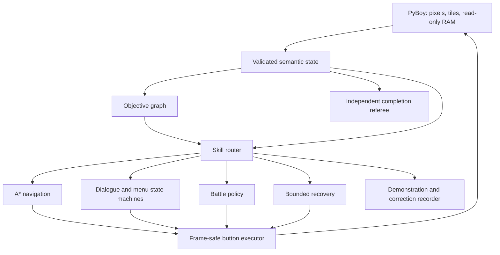

# Pokémon Red Completion Agent

[](https://github.com/PeteAndrews1289/pokemon-red-completion-agent/actions/workflows/ci.yml)
[](LICENSE)
[](docs/roadmap.md)

**A completion-first autonomous system for Pokémon Red: verified quest planning, deterministic
control, and progressively trained specialists.**

> **Current status:** the deterministic teacher completes Pokémon Red from clean power-on through
> the Hall of Fame in one uninterrupted, no-save-restore emulator session. Three independent runs
> produced the same **299/299 checkpoints**, **36/36 objectives**, **4,796,436 frames**, and
> **41,316 actions**, with human input disabled and the controller released at termination. The
> terminal gate requires the Champion-defeated event and Hall-of-Fame map concurrently. This is a
> verified deterministic-teacher completion—not a learned-policy or unseen-seed generalization
> claim. See the
> [sanitized three-run completion receipt](docs/evidence/qualified-play-hall-of-fame-2026-07-29.json).

## The goal

Reach the Hall of Fame from clean power-on with:

- a fingerprinted Pokémon Red ROM supplied privately by the user;
- frozen source, configuration, objective graph, and model weights;
- no human controller input;
- no save-state restoration during evaluation;
- no online code or prompt modification; and
- concurrent Champion-event and Hall-of-Fame verification.

Training may use walkthrough knowledge, read-only game state, demonstrations, private snapshots,
teacher corrections, and local reinforcement learning. Those resources are disclosed rather than
presented as learning from nothing.

## Why this project exists

The predecessor, [Pokémon Red AI](https://github.com/PeteAndrews1289/pokemon-red-ai), processed
8.24 million self-generated actions and discovered seven milestones, but finished frozen
evaluation with zero durable skills. Its result was that discovery and training activity did not
become cumulative competence.

This successor changes the objective and architecture:

1. make reliable game completion the primary target;
2. represent the known long-horizon route explicitly;
3. use deterministic solutions for pathfinding, menus, and verification;
4. train bounded specialists where learned decisions are valuable; and
5. replace teacher components only after learned alternatives pass frozen reliability gates.

## Architecture



The learned policy will choose goal-conditioned **macro-actions**, not rediscover controller timing
one frame at a time. The objective graph carries long-term progress; specialists solve bounded
navigation, dialogue, battle, inventory, puzzle, and recovery tasks.

See [Architecture](docs/architecture.md), the
[Completion Contract](docs/completion-contract.md), and the
[Assistance Policy](docs/assistance-policy.md).

## Planned training ladder

1. A deterministic teacher completes three clean runs.
2. Teacher trajectories train goal-conditioned specialists with behavioral cloning.
3. DAgger adds corrections from states caused by the learner's own mistakes.
4. Snapshot curriculum RL is used only for skills that remain below their reliability gates.
5. Teacher fallback is removed one specialist at a time.
6. A distilled local macro-policy attempts the full game.

Each stage retains its complete success and failure denominator. Hybrid completion, learned-module
completion, learned-stack completion, and distilled-model completion are separate claims.

## Does it need a completed run?

Not to begin. The deterministic teacher is built chapter-by-chapter from disclosed route knowledge,
verified maps and state, and closed-loop objective checks. This project requires a full teacher
completion before training or evaluating full-game composition.

A single completed video or button trace would help with route review, but it would not teach
recovery from mistakes. Behavioral cloning needs action-aligned demonstrations; DAgger needs a
queryable teacher that can correct states the learner actually reaches. See the
[Teaching and Data Plan](docs/teaching-plan.md).

## Public verification

The default checks require no ROM:

```bash
python3 -m venv .venv
source .venv/bin/activate
python -m pip install -e ".[dev]"

python scripts/check_public_artifacts.py
python scripts/check_docs.py
ruff check .
pytest -m "not integration"
```

## Private emulator setup

PyBoy integration is optional so public tests remain redistribution-safe:

```bash
python -m pip install -e ".[dev,emulator]"
export POKEMON_RED_ROM="/absolute/path/to/Pokemon Red.gb"

pokemon-red-completion doctor
pokemon-red-completion bootstrap
pokemon-red-completion opening
pokemon-red-completion opening --watch --speed 4
pokemon-red-completion play
pokemon-red-completion play --watch --speed 4
```

`bootstrap` starts PyBoy headlessly from immutable verified ROM bytes, disables human window input,
loads no adjacent save data, reaches the bedroom with the built-in RED/BLUE names, verifies one
movement action, and exits without saving. Its JSON report contains hashes and semantic evidence,
not the ROM path or game assets.

`opening` runs the bounded teacher through six closed-loop checkpoints: bedroom input, downstairs,
outside, Oak's trigger, starter-selection readiness, and verified Squirtle. It is headless and
uncapped by default. `--watch --speed 4` instead opens a local PyBoy window at 4× speed and prints
checkpoint progress before the final JSON report. Watch mode changes presentation only: keyboard
input remains disabled, while the window itself stays responsive and can be closed with Escape or
its red close button. The same semantic gates choose every action, and the emulator still exits
without saving.

`play` is the recommended continuous command. It uses one clean emulator session for the opening,
the verified rival win, both Route 1 crossings, the parcel handoff, Viridian Forest, Brock, Route
3, Mt. Moon, Cerulean City, Nugget Bridge, Bill, Misty, Route 5, the Underground Path, Route 6,
Vermilion City, the S.S. Anne through HM01, Vermilion Gym through the Thunder Badge, Route 9,
Rock Tunnel, Lavender Town, Route 8, the west-east Underground Path, Route 7, and Celadon City.
It then reveals and clears the Rocket Hideout, defeats Giovanni, obtains the Silph Scope, crosses
Pokémon Tower, calms Marowak, rescues Mr. Fuji, receives the Poké Flute, and heals in Lavender
Center. It then wakes and defeats the level-30 Route 12 Snorlax, clears the four mandatory
Route 12/13 trainers, bypasses every other Route 12–15 trainer and progression pickup, and heals
the complete party in Fuchsia Center.
It then returns to Celadon, defeats Erika, buys exactly one Fresh Water on the Department Store
roof, proves the guard consumes it before the global Saffron-access flag is set, crosses the
Route 7 gate without battle, and heals in Saffron Center.
It then buys a bounded recovery reserve, obtains and teaches TM13 Ice Beam, enters Silph Co.,
obtains the Card Key, clears the required warp route and trainers, defeats the rival and Giovanni,
receives the Master Ball, leaves optional Lapras untouched, and returns to a healed Saffron
Center boundary.
It then follows a live-qualified trainer-free Saffron Gym warp route, defeats Sabrina with a
physical Strength and Ice Beam policy, verifies TM46 plus both Marsh Badge lanes, and heals.
It then obtains HM02 Fly, reaches Cinnabar by way of Pallet and Route 21, traverses Pokémon
Mansion with one Max Repel and no trainer battles, recovers the Secret Key, clears all six Gym
quizzes without a regular-trainer battle, defeats Blaine with Surf, receives TM38 plus both
Volcano Badge lanes, and returns to a healed Cinnabar Center.
It then flies to Viridian, frees one bag slot by selling TM46, solves the spinner floor, clears
the six route-gating trainers with Strength and Ice Beam, heals before the leader, defeats
Giovanni with Surf, verifies TM27, both Earth Badge lanes, and both Route 22 rival events, then
returns to a healed Viridian Center with all eight badges.
It then teaches Toxic, prepares a bounded Saffron recovery and repel reserve, defeats the final
Route 22 rival with state-aware healing, verifies all seven remaining Route 23 badge checks,
solves every Strength boulder and switch in Victory Road, reaches Indigo Plateau, heals, and buys
the declared Full Restore, Full Heal, Hyper Potion, X Special, and Max Repel reserve.
It then defeats Lorelei, Bruno, Agatha, Lance, and the Champion, enters the Hall of Fame, and
reports completion only when the Champion event and Hall-of-Fame map are simultaneously true.
The forest
segment deliberately trains against three verified Kakuna encounters and one mandatory Bug
Catcher. Later gates require the declared trainer identities and event order, Bill's complete
transformation and S.S. Ticket sequence, the mandatory Cerulean Gym trainer, Misty's live trainer
identity, the Cerulean Rocket thief and TM28, and both required lower Route 6 trainers. A bounded
heal-and-replay recovery explicitly records and flees three exact Route 6 Pidgey encounters while
proving unchanged PP and trainer events. The S.S. Anne chapter verifies the required RIVAL2
identity, a live win, the Captain's rub event, the separate HM01 event, HM01 inventory presence,
and the derived Cut fact. The Surge chapter buys bounded capture and recovery supplies, captures
Spearow and a source-valid Diglett, trades for DUX, teaches Cut and Dig when needed, adapts to the
live Gym switch pair, and verifies a Dig-only Surge win plus TM24 and mirrored badge evidence.
The Lavender chapter teaches BubbleBeam, purchases an exact recovery reserve, proves all 11
required Route 9/Rock Tunnel trainer identities and PP decrements, retries a movement step only
after a qualified wild flee, bypasses the optional south Route 10 trainer, and heals the complete
three-Pokémon party in Lavender Center.
The Celadon chapter bypasses eight optional Route 8 trainers, proves the single required Lass
identity and event transition with selected-move PP evidence, preserves the exact recovery
inventory, and heals the complete party in Celadon Center. After the later qualified Tower
evolution, the exact route ends with a full-health, status-free Blastoise restored as party lead.
The Hideout chapter proves five exact trainer identities, bypasses all eight optional basement
trainers, verifies the poster switch, Lift Key, elevator floor, boss-door, Giovanni, and Silph
Scope gates, and explicitly records the pinned source's known `EVENT_ENTERED_ROCKET_HIDEOUT`
callback bug without weakening any required event.
The Tower chapter proves the exact scripted rival, five required Channelers, level-30 Marowak,
and three Rocket identities; bypasses eight optional Channelers; verifies all three purified-zone
heals, both blocking item pickups, the mirrored and world Fuji rescue events, and the Poké Flute;
and qualifies the natural Wartortle-to-Blastoise evolution without changing party order or moves.
Its adaptive battle and navigation selection reacts to bounded state, but the
three-run result evaluates one frozen teacher route and does not yet show held-out timing or RNG
generalization.
The Fuchsia chapter verifies the Poké Flute wake transition, exact Snorlax species and level,
defeat event, removed-object tile, and retained Flute; records five exact battle PP receipts;
performs a disclosed resource-neutral Lavender Center recovery; flees four bounded wild
encounters; and proves 35 optional events plus five optional items remain untouched.

The ROM, saves, snapshots, recordings, datasets, and model checkpoints are ignored and must remain
outside Git. The visible window is not recorded or uploaded by the project. The supported revision
is identified by public hashes in the source; reports omit the private ROM path, and no game data
is distributed.

## Evidence and project status

- [Roadmap](docs/roadmap.md) — milestone gates and current implementation status
- [Completion contract](docs/completion-contract.md) — what qualifies as completion
- [Architecture](docs/architecture.md) — authority and subsystem boundaries
- [Assistance policy](docs/assistance-policy.md) — permitted training and evaluation resources
- [Teaching and data plan](docs/teaching-plan.md) — references, demonstrations, and DAgger order
- [Optional upstream baseline](docs/upstream-baseline.md) — pinned, isolated comparison boundary
- [Contributing](CONTRIBUTING.md) — safety and evidence requirements

## Attribution

The design is informed by the author's concluded Pokémon Red AI study, the MIT-licensed
[Continual Harness/PokéAgent](https://github.com/sethkarten/continual-harness), the
[PyBoy](https://github.com/Baekalfen/PyBoy) emulator, and the
[pret Pokémon Red disassembly](https://github.com/pret/pokered). The qualified opening corridors,
warps, events, and starter layout are pinned to pret/pokered commit
`1e96034092686d006e863cace09e87273051a3d8`; the route was independently exercised against the
supported private ROM. Any other imported or adapted code will be pinned and attributed before
use.

Pokémon is owned by Nintendo, Game Freak, and The Pokémon Company. This independent educational
project is not affiliated with or endorsed by them.
