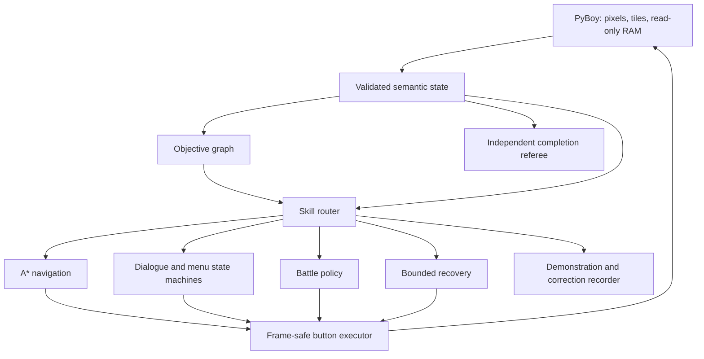

# Pokémon Red Completion Agent

[](https://github.com/PeteAndrews1289/pokemon-red-completion-agent/actions/workflows/ci.yml)
[](LICENSE)
[](docs/roadmap.md)

**A completion-first autonomous system for Pokémon Red: verified quest planning, deterministic
control, and progressively trained specialists.**

> **Current status:** the private runtime now reaches the input-ready bedroom from clean power-on
> and verifies autonomous one-tile movement. This is a runtime milestone, not a badge or game
> completion claim. See the
> [sanitized 2026-07-28 evidence receipt](docs/evidence/bootstrap-smoke-2026-07-28.json). The active
> target is three clean-start runs through Brock.

## The goal

Reach the Hall of Fame from clean power-on with:

- a fingerprinted Pokémon Red ROM supplied privately by the user;
- frozen source, configuration, objective graph, and model weights;
- no human controller input;
- no save-state restoration during evaluation;
- no online code or prompt modification; and
- concurrent Champion-event and Hall-of-Fame verification.

Training may use walkthrough knowledge, read-only game state, demonstrations, private snapshots,
teacher corrections, and local reinforcement learning. Those resources are disclosed rather than
presented as learning from nothing.

## Why this project exists

The predecessor, [Pokémon Red AI](https://github.com/PeteAndrews1289/pokemon-red-ai), processed
8.24 million self-generated actions and discovered seven milestones, but finished frozen
evaluation with zero durable skills. Its result was that discovery and training activity did not
become cumulative competence.

This successor changes the objective and architecture:

1. make reliable game completion the primary target;
2. represent the known long-horizon route explicitly;
3. use deterministic solutions for pathfinding, menus, and verification;
4. train bounded specialists where learned decisions are valuable; and
5. replace teacher components only after learned alternatives pass frozen reliability gates.

## Architecture



The learned policy will choose goal-conditioned **macro-actions**, not rediscover controller timing
one frame at a time. The objective graph carries long-term progress; specialists solve bounded
navigation, dialogue, battle, inventory, puzzle, and recovery tasks.

See [Architecture](docs/architecture.md), the
[Completion Contract](docs/completion-contract.md), and the
[Assistance Policy](docs/assistance-policy.md).

## Planned training ladder

1. A deterministic teacher completes three clean runs.
2. Teacher trajectories train goal-conditioned specialists with behavioral cloning.
3. DAgger adds corrections from states caused by the learner's own mistakes.
4. Snapshot curriculum RL is used only for skills that remain below their reliability gates.
5. Teacher fallback is removed one specialist at a time.
6. A distilled local macro-policy attempts the full game.

Each stage retains its complete success and failure denominator. Hybrid completion, learned-module
completion, learned-stack completion, and distilled-model completion are separate claims.

## Does it need a completed run?

Not to begin. The deterministic teacher is built chapter-by-chapter from disclosed route knowledge,
verified maps and state, and closed-loop objective checks. This project requires a full teacher
completion before training or evaluating full-game composition.

A single completed video or button trace would help with route review, but it would not teach
recovery from mistakes. Behavioral cloning needs action-aligned demonstrations; DAgger needs a
queryable teacher that can correct states the learner actually reaches. See the
[Teaching and Data Plan](docs/teaching-plan.md).

## Public verification

The default checks require no ROM:

```bash
python3 -m venv .venv
source .venv/bin/activate
python -m pip install -e ".[dev]"

python scripts/check_public_artifacts.py
python scripts/check_docs.py
ruff check .
pytest -m "not integration"
```

## Private emulator setup

PyBoy integration is optional so public tests remain redistribution-safe:

```bash
python -m pip install -e ".[dev,emulator]"
export POKEMON_RED_ROM="/absolute/path/to/Pokemon Red.gb"

pokemon-red-completion doctor
pokemon-red-completion bootstrap
```

`bootstrap` starts PyBoy headlessly from immutable verified ROM bytes, disables human window input,
loads no adjacent save data, reaches the bedroom with the built-in RED/BLUE names, verifies one
movement action, and exits without saving. Its JSON report contains hashes and semantic evidence,
not the ROM path or game assets.

The ROM, saves, snapshots, recordings, datasets, and model checkpoints are ignored and must remain
outside Git. The supported revision is identified by public hashes in the source; no game data is
distributed.

## Evidence and project status

- [Roadmap](docs/roadmap.md) — milestone gates and current implementation status
- [Completion contract](docs/completion-contract.md) — what qualifies as completion
- [Architecture](docs/architecture.md) — authority and subsystem boundaries
- [Assistance policy](docs/assistance-policy.md) — permitted training and evaluation resources
- [Teaching and data plan](docs/teaching-plan.md) — references, demonstrations, and DAgger order
- [Optional upstream baseline](docs/upstream-baseline.md) — pinned, isolated comparison boundary
- [Contributing](CONTRIBUTING.md) — safety and evidence requirements

## Attribution

The design is informed by the author's concluded Pokémon Red AI study, the MIT-licensed
[Continual Harness/PokéAgent](https://github.com/sethkarten/continual-harness), the
[PyBoy](https://github.com/Baekalfen/PyBoy) emulator, and the
[pret Pokémon Red disassembly](https://github.com/pret/pokered). Any imported or adapted code will
be pinned and attributed before use.

Pokémon is owned by Nintendo, Game Freak, and The Pokémon Company. This independent educational
project is not affiliated with or endorsed by them.
