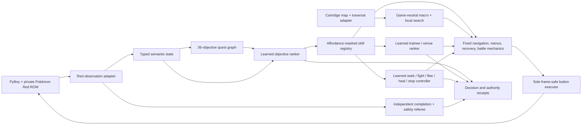

# Architecture and authority boundaries

This project is not one monolithic "Pokémon AI." It is a layered autonomy system in which every
decision has a named owner, every learned artifact is authenticated, and an independent referee
checks what actually happened in the emulator.

The deterministic implementation is intentionally retained as an expert teacher, a mechanics
library, and a safety oracle. The research program replaces its decisions one boundary at a time
and does not call a boundary learned until a model has controlled real execution without a hidden
teacher fallback.

## System at a glance



The arrows matter. Models receive identity-free or semantic observations and return bounded
choices. They do not receive an expected answer label, raw ROM bytes, arbitrary memory access, or
direct button authority. Fixed skills convert accepted choices into game-specific mechanics; the
referee then reobserves the cartridge instead of trusting a skill's success claim.

## Current authority ledger

| Layer | Current owner | Strongest evidence | What is still fixed |
| --- | --- | --- | --- |
| Completion contract | Independent semantic referee | 312/312 checkpoints, 36/36 objectives, Champion and Hall of Fame from clean power-on | Red-specific facts and memory adapter |
| Long-horizon objective dispatch | Learned ranker behind a live affordance mask | One uninterrupted captured-state loop completed 20 dispatches and reached Hall of Fame | 19/20 dispatches were single-option; registered skills executed the mechanics |
| Battle action ranking | Learned policy with legal-action masks | Model-controlled Red battle qualifications with no disagreement fallback | Authored curriculum and Red battle executor |
| Training action control | Learned five-action controller | Portable Blaine proof: 57,548 controlled battle/overworld decisions, 1,796 development battles, zero fallback | Candidate masks, hard safety gates, navigation and menu execution |
| Trainee and venue strategy | Shared identity-free candidate scorer | 99.9004% sealed validation; isolated causal completion with 191 disagreements; portable Blaine completion and one clean-power Hall-of-Fame rehearsal with 400 disagreements | Still one uncounted fixed-route Red root; candidate eligibility and mechanics remain fixed |
| Navigation mechanics | Deterministic cartridge-derived planner, title adapter and closed-loop executor | Multi-map land routes; Surf mode; live occupancy; repeated Cut; full Strength chain; trainer sight; one closed/open story gate; resource renewal; joint local/macro pricing; a 174-step route resumed through one trainer engagement | Completion teacher still owns most route invocation, broader non-trainer menu/script recovery, special story objects and the final Indigo exit |
| Strategic navigation choice | Data contract plus deterministic calibration teacher | Identity-free schema, reviewed vocabulary, authenticated join/lineage audit, collection baselines, three unassigned live calibrations, and a prospective 5-train/2-validation/5-sealed-test whole-root registry | 0 collected train/validation choices; full-run collector is not connected; no frozen numeric features, model, shadow result or causal authority |
| Collection planning | Typed deterministic planner plus cartridge-derived reachability | Exact ordinary retail reach: 135 species solo / 139 with a trade partner on each Red or Blue cartridge | No autonomous living-Pokédex execution, storage rotation, multi-save or trade orchestration yet |

This table is the claim boundary. A model choosing an objective does not mean it navigated to the
objective. A model matching a teacher in shadow does not mean it controlled execution. A safe
candidate mask can remain part of the referee, but its effect must be measured so forced
single-option decisions are not presented as learned judgment.

## The four major subsystems

### 1. Teacher and referee

The qualified teacher completes Pokémon Red from clean power-on through the Hall of Fame in one
emulator process. It provides expert demonstrations and bounded mechanic skills. It is not the
actor in a strict learned evaluation.

The referee reads a declared set of semantic cartridge facts and checks exact maps, events,
inventory changes, badges, party state, battle outcomes, resource bounds, controller release, and
terminal completion. The actor cannot certify itself. Unexpected states fail closed, and failed
lineages remain in the evidence history rather than being silently rerun.

### 2. Portable player loop

The reusable control cycle is:

```text
observe -> enumerate dependency-legal goals -> mask physically unavailable skills
        -> rank executable objectives -> execute one bounded skill
        -> reobserve declared effects -> continue, replan, or fail
```

Objective legality and physical executability are separate. For example, a badge may be legal in
the quest graph while its skill cannot start from the current map. Each skill therefore publishes
a typed starting affordance. Unsupported choices remain visible with a reason and never fall back
to the teacher route.

The strongest integration proof begins from an authenticated Celadon capture and returns control
after every objective through Hall of Fame. It verifies that the loop, state adapter, skill
contracts, and referee compose. Its honest denominator—one genuine ranking branch and nineteen
singletons—is why it is not described as open-world planning.

### 3. Learned decision seams

Learned components are small authenticated artifacts loaded behind typed interfaces:

- the objective ranker scores currently executable graph objectives;
- the battle ranker scores legal moves or battle actions;
- the training controller selects `seek`, `fight`, `flee`, `heal`, or `stop`; and
- the strategic candidate ranker scores a variable number of possible trainees or encounter
  venues with one shared network.

Strategic *navigation* is the next learned seam, not an existing model. Its implemented contract
ranks at least two semantic destinations from a reviewed cross-title vocabulary and route metrics.
The authenticated trajectory stores the choice and one consumed outcome, but exact button actions,
map ids, coordinates and destination bindings are excluded from policy input. Only successful
deterministic-teacher routes may become imitation targets; learned-policy successes and route
failures remain outcome evidence, and external power loss remains censored. Three unassigned live
calibrations prove binding and recording, including a long Celadon→Pokémon Tower branch that rejects
the minimum-route-cost candidate and resumes after a trainer engagement. Train and validation still
contain zero records, so a numeric feature schema would be premature.

The collection split is now a separate authenticated authority. A canonical registry fixes five
train, two validation and five sealed test roots, plus one rehearsal, before execution. Each root is
bound to an exact source bundle, teacher configuration, objective graph, semantic decision contract
and timing schedule. A non-unassigned decision cannot be constructed from caller-supplied strings;
it must match the committed assignment. The full teacher still needs to emit these strategic
decision/outcome pairs before any root can be consumed.

The candidate ranker is deliberately permutation-equivariant. Its 27 normalized features exclude
species IDs, move IDs, party-slot identity, map IDs, area names, memory addresses, and route
indices. Each candidate is scored independently, then normalized within the current set. Teacher
ties that depend on hidden identity are excluded instead of becoming misleading labels.

Every live learned seam distinguishes three modes:

1. **teacher collection** — teacher choice is executed and recorded;
2. **shadow evaluation** — model prediction is measured but cannot affect the game; and
3. **causal control** — model prediction is bound to the real candidate or action and executed.

Invalid indexes, incompatible artifacts, missing hashes, unsupported actions, and unsafe states
stop the run. There is no disagreement fallback in causal qualification.

### 4. Evidence and promotion

Promotion is an authenticated chain rather than a favorable score:


Receipts bind the source commit, root-state hash, replay hash, model-file hash, canonical model
hash, partition, terminal party, faint count, operational budgets, and explicit authority mode.
Whole lineages—not individual frames—form split boundaries. Root overlap, state overlap, validation
leakage, partial streams, altered artifacts, and private ROM-derived data in public files are
rejected mechanically.

Accuracy alone is not a promotion gate. The project has preserved models that scored well offline
but healed too rarely, fought too little, exhausted runtime budgets, or exposed a candidate mask
that made every choice trivial. Those are research results, not CI noise.

## Private runtime boundary

The exact ROM, emulator states, trajectories, and learned model files stay outside Git. Public
receipts contain path-free hashes and sanitized aggregate evidence.

The ROM is fingerprinted and provided to PyBoy without exposing its path to policy code. The
emulator adapter exposes narrow read-only Work RAM and declared box-storage reads; it does not
expose arbitrary ROM, VRAM, I/O, save-state, or memory-write capabilities. Only the frame-safe
executor can press buttons. Optional watch mode changes rendering speed, not actor authority.

This is a strongly constrained in-process interface, not a sandbox against malicious Python. The
security goal is auditable experiment boundaries and accidental-leak prevention.

## Portability: real seams and remaining Red assumptions

The following contracts are intentionally game-neutral:

- semantic objective graphs and policy selection;
- party and team-development observations;
- candidate-relative training features;
- battle and training action masks;
- capture, storage, evolution, and Pokédex directives; and
- typed skill results and promotion evidence.

The following remain Pokémon Red implementations:

- memory addresses and event interpretation;
- cartridge table offsets, dynamic traversal state and field-capability compilation;
- dialogue and menu compilation;
- item, move, encounter, and trainer catalogs;
- chapter recovery paths; and
- most battle and navigation mechanics.

Identity-free features are a transfer hypothesis, not transfer evidence. A small Crystal
microbenchmark—one battle task, one navigation task, and one training-choice task—is the next
falsification gate. It should compare zero-shot reuse, few-shot adaptation, and training from
scratch under the same metrics.

## Code map

| Concern | Primary modules |
| --- | --- |
| Semantic state and emulator boundary | `observation.py`, `emulator.py`, `red_player_observer.py` |
| Cartridge topology, traversal and acquisition | `gen1_maps.py`, `gen1_terrain.py`, `gen1_traversal.py`, `gen1_acquisition.py` |
| Game-neutral route search and execution | `global_router.py`, `local_router.py`, `route_plan.py`, `route_executor.py` |
| Strategic navigation records and datasets | `strategic_navigation.py`, `strategic_navigation_trajectory.py`, `strategic_navigation_dataset.py` |
| Quest planning and portable loop | `quest.py`, `player_loop.py`, `learned_planner_policy.py` |
| Bounded skill contracts and Red adapters | `objective_skills.py`, `red_objective_skills.py` |
| Battle learning | `battle_policy.py`, `battle_runtime.py`, `battle_model.py` |
| Training action learning | `training_control.py`, `training_control_model.py` |
| Strategic trainee/venue learning | `training_candidate_rank.py`, `training_candidate_model.py` |
| Team, capture and Pokédex contracts | `team_training.py`, `capture.py`, `pokedex.py` |
| Evidence integrity | `collection_protocol.py`, `provenance.py`, `artifacts.py` |

Red chapter modules remain large because they encode verified mechanics and recovery. The target is
not to delete the teacher before it has taught replacements; it is to prevent Red-specific code
from leaking into the learned observation and policy contracts.

## End state

The final goal is a model that can complete Pokémon titles, recover from changed routes and random
outcomes, build and train a full party, and pursue a living Pokédex rather than replaying a brittle
answer key. Red is the teacher and first evaluation platform. Cross-title competence begins only
when the same learned interfaces produce measured value on a title they were not written around.

For the newest navigation measurements and risks, see the
[knowledge-to-action audit](traversal-audit-2026-08-10.md). For the full capability ledger, see the
[current audit](current-audit-2026-08-11.md). For the dependency order, see the
[roadmap](roadmap.md). For the experiment story, see the [project narrative](project-narrative.md).
