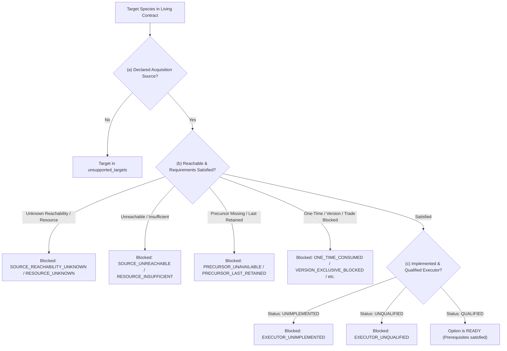

# Phase 5 Collection Planning Catalog Design and Synthetic Audit

- **Date:** 2026-09-09
- **Baseline Commit:** `774805e243299cb7c8caebe5fe691fa26f8fcd6a`
- **Correction Pass:** Addressing audit findings on frozen first draft `f451da63`
- **Branch:** `agent/flash-collection-planning-20260909`
- **Module:** `pokemon_red_completion.collection_planning_catalog`

---

## 1. Architectural Purpose and Operational Boundaries

The `collection_planning_catalog` is an **offline pure catalog**, not wired gameplay, a trained ability, or an execution engine.

```
+-------------------------------------------------------------------------+
|                        Game Adapters & Cartridge                        |
|  - SRAM Census (12-box checksum, party)                                 |
|  - Cartridge Evolution Tables (gen1_cartridge / level_acquisition_edges)|
|  - Environment Reachability & Resource Inventory                        |
+------------------------------------+------------------------------------+
                                     |
                                     v
+-------------------------------------------------------------------------+
|                  collection_planning_catalog (PURE)                     |
|  - Evaluates (a) source exists, (b) reachable/satisfied, (c) qualified  |
|  - Preserves retained precursor instances; detects surplus              |
|  - Computes non-additive marginal useful demand via augmenting paths    |
|  - Emits typed blocker reasons and deterministic display ordering       |
+------------------------------------+------------------------------------+
                                     |
                                     v
+-------------------------------------------------------------------------+
|                       Learned Goal Policy / Model                       |
|  - Consumes ready_options as candidate rows                             |
|  - Evaluates learned value / policy scoring                             |
|  - Samples goal (e.g. regional source softmax)                          |
+-------------------------------------------------------------------------+
```

### Operational Boundaries:
1. **Meaning of `OptionReadiness.READY`:**
   `READY` means consistent caller-supplied prerequisites are satisfied. It is **not** an authenticated runtime execution proof. Real executable goal bindings, live coordinate reachability, inventory checks, and skill qualification must be provided by existing runtime adapters. Raw ready IDs must **never** be fed directly to the actor as executable controller actions.
2. **Static Cartridge Reachability $\neq$ Presently Reachable:**
   A corridor existing in ROM does not mean the agent can reach it right now. Present reachability must be observed.
3. **Caller-Supplied Constraint Booleans:**
   The flags `is_version_blocked`, `is_trade_blocked`, and `is_event_blocked` default to `False`. This default is not independent proof of availability; callers must supply verified flags.
4. **Marginal Demand Semantics & Limitations:**
   Report-level marginal counts measure additional capture demand. Transformation
   readiness instead measures replacement utility after removing the consumed
   precursor, capped at one specimen. This permits necessary intermediate steps
   even when existing stock already covers the eventual target mathematically.
   Neither calculation proves the intermediate skills are executable. The catalog
   is a one-step prerequisite projection, not a complete dependency scheduler.
5. **Prior Snapshot Evidence:**
   Post-game snapshot figures cited from prior handoffs are historical evidence, not re-verified by this ROM-free task: 30 physical specimens, 28 unique living species, 33 registrations, and 120 coexisting living species in the solo Red contract.

---

## 2. API Design and Invariants

### 2.1 Enums and Types

```python
class AcquisitionMethodKind(StrEnum):
    WILD_ENCOUNTER = "wild_encounter"
    SAFARI_ENCOUNTER = "safari_encounter"
    FISHING = "fishing"
    STATIC_ENCOUNTER = "static_encounter"
    GIFT = "gift"
    FOSSIL_REVIVAL = "fossil_revival"
    GAME_CORNER = "game_corner"
    LEVEL_EVOLUTION = "level_evolution"
    ITEM_EVOLUTION = "item_evolution"
    TRADE_EVOLUTION = "trade_evolution"
    IN_GAME_TRADE = "in_game_trade"

class ExecutorStatus(StrEnum):
    QUALIFIED = "qualified"          # Verified, qualified executor exists in runtime
    UNQUALIFIED = "unqualified"      # Implementation exists but unverified / unqualified
    UNIMPLEMENTED = "unimplemented"  # No runtime executor exists

class OptionReadiness(StrEnum):
    READY = "ready"
    BLOCKED = "blocked"

class BlockerReason(StrEnum):
    NO_REMAINING_DEMAND = "no_remaining_demand"
    SOURCE_UNREACHABLE = "source_unreachable"
    SOURCE_REACHABILITY_UNKNOWN = "source_reachability_unknown"
    RESOURCE_INSUFFICIENT = "resource_insufficient"
    RESOURCE_UNKNOWN = "resource_unknown"
    PRECURSOR_UNAVAILABLE = "precursor_unavailable"
    PRECURSOR_LAST_RETAINED = "precursor_last_retained"
    ONE_TIME_CONSUMED = "one_time_consumed"
    VERSION_EXCLUSIVE_BLOCKED = "version_exclusive_blocked"
    LINK_TRADE_BLOCKED = "link_trade_blocked"
    EVENT_BLOCKED = "event_blocked"
    EXECUTOR_UNQUALIFIED = "executor_unqualified"
    EXECUTOR_UNIMPLEMENTED = "executor_unimplemented"
```

### 2.2 Dataclasses & Invariant Protections

- **`PlanningObservation` Immutability:**
  Defensively copies and wraps `living_counts` and `available_resources` in `types.MappingProxyType`. External alias mutation and direct item assignment (`obs.available_resources['ball'] = 5`) raise `TypeError`.
- **`CollectionPlanningReport`:**
  - `marginal_useful_counts`: Read-only `MappingProxyType`.
  - `registered_but_not_living`: Identifies requested targets present in `observation.registered_species` but having 0 physical specimens in `living_counts`. Does not satisfy living requirements.
- **Consumption Validation:**
  - `CandidateOption(is_consumed=True, is_one_time=False)` raises `ValueError`.
  - An option declared repeatable (`is_one_time=False`) present in `observation.consumed_options` raises `ValueError`.
- **Transformation Edge Declaration:**
  Every option declaring `consumes_species` must have its `(consumes_species, target_species)` edge explicitly present in `transformation_edges`. Undeclared transformations are rejected with `ValueError`.
- **`living_counts` Consistency:**
  `living_counts` and `observation.living_counts` must agree across all referenced species. Absent keys normalize as 0; any non-zero count mismatch raises `ValueError` before option evaluation.

---

## 3. The Three Distinct Operational Gates



---

## 4. Synthetic Walkthroughs

### Example 1: Multi-Stage Chain Evolution (A $\rightarrow$ B $\rightarrow$ C)

- **Targets:** `["A", "B", "C"]`
- **Edges:** `[("A", "B"), ("B", "C")]`
- **Options:**
  - `evolve_ab`: Consumes `A`, produces `B`, executor `QUALIFIED`.
  - `evolve_bc`: Consumes `B`, produces `C`, executor `QUALIFIED`.

#### State 1: `living_counts = {"A": 1, "B": 1, "C": 0}`
- `B` is a required living target. Held count = 1, required = 1 $\rightarrow$ surplus = 0.
- `evolve_bc` is **`BLOCKED`** with `PRECURSOR_LAST_RETAINED`.
- `A` held count = 1, required = 1 $\rightarrow$ surplus = 0.
- `evolve_ab` is **`BLOCKED`** with `PRECURSOR_LAST_RETAINED`.

#### State 2: `living_counts = {"A": 2, "B": 1, "C": 0}`
- `A` surplus = 1 ($2 - 1$).
- `evolve_ab` is **`READY`**.

#### State 3 (after executing A $\rightarrow$ B): `living_counts = {"A": 1, "B": 2, "C": 0}`
- `A` surplus = 0. `evolve_ab` is **`BLOCKED`** with `PRECURSOR_LAST_RETAINED`.
- `B` surplus = 1 ($2 - 1$).
- `evolve_bc` is **`READY`**.
- Executing B $\rightarrow$ C reaches final living state: `{"A": 1, "B": 1, "C": 1}`, preserving all intermediate forms!

---

### Example 2: Multiple Resources and Partial Sufficiency

- **Targets:** `["SAFARI_SPEC"]`
- **Option `catch_safari`:** Requires 5 `safari_ball` and 500 `poke_dollar`.

#### Case A: Ball sufficient, money insufficient
- `available_resources = {"safari_ball": 5, "poke_dollar": 200}`
- **Status: `BLOCKED`** with `RESOURCE_INSUFFICIENT` on `poke_dollar`.

#### Case B: Ball sufficient, money unobserved
- `available_resources = {"safari_ball": 5}` (`poke_dollar` omitted)
- **Status: `BLOCKED`** with `RESOURCE_UNKNOWN` on `poke_dollar`.

---

### Example 3: Branching Alternatives with Shared Surplus Recomputation

- **Targets:** `["ROOT", "BRANCH_A", "BRANCH_B"]`
- **Edges:** `[("ROOT", "BRANCH_A"), ("ROOT", "BRANCH_B")]`
- **Options:** `evolve_a` (ROOT $\rightarrow$ BRANCH_A), `evolve_b` (ROOT $\rightarrow$ BRANCH_B).

#### State 1: `living_counts = {"ROOT": 2, "BRANCH_A": 0, "BRANCH_B": 0}`
- Surplus ROOT = 1 ($2 - 1$).
- Both `evolve_a` and `evolve_b` evaluate to **`READY`** as independent alternatives.

#### State 2 (after model chooses and executes `evolve_a`):
- `living_counts = {"ROOT": 1, "BRANCH_A": 1, "BRANCH_B": 0}`
- Surplus ROOT = 0 ($1 - 1$).
- `evolve_a` is **`BLOCKED`** with `NO_REMAINING_DEMAND`.
- `evolve_b` is **`BLOCKED`** with `PRECURSOR_LAST_RETAINED`.
- Prevents double-spending the shared precursor.

---

## 5. Audit Corrections Summary

| Finding | Resolution in Second Pass |
| :--- | :--- |
| `living_counts` vs `observation.living_counts` mismatch | Validated for exact equality (normalizing absent keys as 0); mismatch raises `ValueError`. |
| Undeclared transformation edges | Options declaring `consumes_species` must exist in `transformation_edges`; undeclared edges raise `ValueError`. |
| Mutable mapping aliasing in dataclass | Defensive copies wrapped in `types.MappingProxyType` for `living_counts`, `available_resources`, and `marginal_useful_counts`. |
| Contradictory consumption declarations | `is_consumed=True, is_one_time=False` and repeatable options in `consumed_options` raise `ValueError`. |
| Unused `registered_species` | Added `report.registered_but_not_living` to expose registered but physically absent targets without counting them as living. |
| Formatting & Linting | Fixed 7 E501 long lines and removed 4 unused imports. |

---

## 6. Independent execution and acceptance

Flash did not run commands. Codex ran the tests: its correction pass initially
failed the A→B→C chain case and removed prior coverage. Codex repaired the
transformation utility calculation, restored coverage, added independent alias
and invalid-key probes, and corrected the remaining lint issue. The accepted
package passes 69 targeted ROM-free tests, module typing and source/test lint.
This is not a full-suite pass or runtime integration. See the
[capability map](phase5-collection-capability-map-2026-09-09.md) for adjudication
and the narrow next gameplay-facing step.
