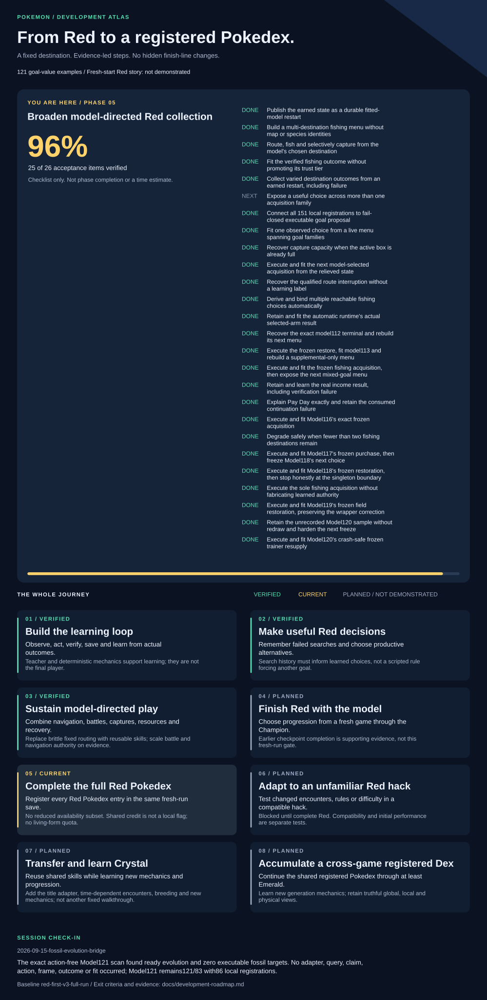

<!-- Generated by scripts/development_roadmap.py; edit the baseline/state, not this file. -->
# Development roadmap

Baseline: **red-first-v1**. Reviewed through **2026-09-06-history-aware-learner**.

A learned player that finishes Pokemon games and builds a living Pokedex across versions and generations.

## Current milestone

**Useful memory-aware play: 2/5 acceptance items (40%).**
This is a checklist, not project completion or a remaining-time estimate.

- [x] Saved-state learning loop ([evidence](../docs/evidence/red-saved-endpoint-learning-result-2026-09-06.json))
- [x] Persisted search-history contract ([evidence](../docs/evidence/red-search-memory-qualification-2026-09-06.json))
- [ ] Model trained to use history ([evidence](../docs/evidence/red-history-aware-learner-qualification-2026-09-06.json))
- [ ] Two useful executable alternatives
- [ ] Productive lesson and follow-up

Current model: **32 examples**. This is a small goal-value learner, not a demonstrated full-game player.

## Stable goals and exit criteria

### 01. Build the learning loop — verified

Observe, act, verify, save and learn from actual outcomes.

**Exit criterion:** Authenticated saved-state collection, retained-data fitting and a bounded post-fit continuation.

Teacher and deterministic mechanics support learning; they are not the final player.

[Current evidence](../docs/evidence/red-saved-endpoint-learning-result-2026-09-06.json)

### 02. Make useful Red decisions — current

Remember failed searches and choose productive alternatives.

**Exit criterion:** A history-aware learner chooses between useful executable goals, learns from the result and continues productively.

Search history must inform learned choices, not a scripted rule forcing another goal.

[Current evidence](../docs/evidence/red-history-aware-learner-qualification-2026-09-06.json)

### 03. Sustain model-directed play — planned

Combine navigation, battles, captures, resources and recovery.

**Exit criterion:** Repeated multi-goal progress across varied Red situations, with measured costs, interventions and recovery.

Replace brittle fixed routing with reusable skills; scale battle and navigation authority on evidence.

### 04. Finish Red with the model — planned

Plan quests, prerequisites and puzzles through the Champion.

**Exit criterion:** Model-directed completion with concurrent Champion and Hall-of-Fame evidence under declared authority.

Teacher completion already exists. It does not satisfy this learned-player milestone.

### 05. Build the Red-era living Dex — planned

Capture and retain specimens; evolve, store and trade as needed.

**Exit criterion:** Verified living collection against an explicit Red/Blue, trade and event availability contract.

Version exclusives and trade evolutions require partner versions; unavailable event inputs stay explicit blockers.

### 06. Adapt to an unfamiliar Red hack — planned

Test changed encounters, rules or difficulty in a compatible hack.

**Exit criterion:** Report initial performance and learning gains against an otherwise identical learner without Red experience.

Compatibility is checked separately. Red competence does not guarantee an immediate win.

### 07. Transfer and learn Crystal — planned

Reuse shared skills while learning new mechanics and progression.

**Exit criterion:** Measured transfer and adaptation, followed by model-led story and declared living-collection completion.

Add the title adapter, time-dependent encounters, breeding and new mechanics; not another fixed walkthrough.

### 08. Accumulate a cross-game living Dex — planned

Carry competence and specimen lineage into later mainline games.

**Exit criterion:** Per-title story and supported-mechanic completion plus verified cross-version collection and transfer records.

Legitimate trades and events, special puzzles and unsupported mechanics remain visible dependencies.

## Session reviews

### 2026-09-06-history-aware-learner

History learner initialized; all 32 old rows preserved. Useful live alternatives still need connecting.

**Deviation:** No change to the baseline. Another engineering-only session triggers reorientation: stop feature expansion and connect existing collection skills. History training stays unfinished, so the checklist remains 40%.

**Next:** Connect boxed-precursor evolution from the field, then collect and fit a short useful-choice lesson.

### 2026-09-06-search-memory

Memory contract qualified; model remains at 32 examples. No new gameplay or fit.

**Deviation:** None from the Red-first sequence. This session was an engineering prerequisite, not learned progress.

**Next:** History-aware learner, useful alternatives, then a short measured lesson.

## Update contract

After each completed session or substantial verified milestone, update the [status record](../configs/development-roadmap-state.json), preserve the review history, and regenerate this page and graphic. Record changes to the stable goals in [roadmap decisions](roadmap-decisions.md).

The [North Star](../NORTH_STAR.md) and [active product state](../ACTIVE_PRODUCT_STATE.md) remain authoritative. The existing documentation check detects stale generated output; no new CI workflow is required.
