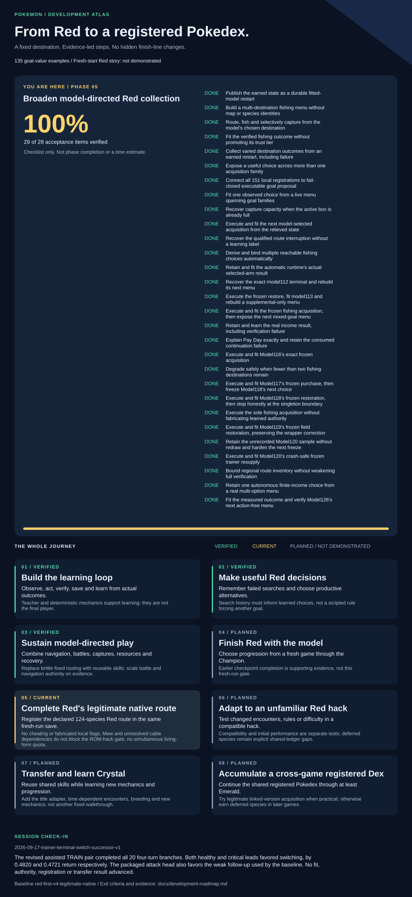

<!-- Generated by scripts/development_roadmap.py; edit the baseline/state, not this file. -->
# Development roadmap

Baseline: **red-first-v4-legitimate-native**. Reviewed through **2026-09-22-forced-motion-gym**.

A learned player must complete a fresh-start, model-directed Red run and Red's declared 124-species legitimate native route before any ROM hack, then continue one shared registered Pokedex through later titles to at least Emerald.

## Current milestone

**Model-directed play after setbacks: 4/4 acceptance items (100%).**
This is a checklist, not project completion or a remaining-time estimate.

- [x] Map model versus controller ownership and fresh-story gaps ([evidence](../docs/evidence/red-integrated-player-2026-09-21.json))
- [x] Test retained failure, fresh choice, history and cost boundaries ([evidence](../docs/evidence/red-integrated-player-2026-09-21.json))
- [x] Execute at least five model decisions including setback and useful success ([evidence](../docs/evidence/red-integrated-player-2026-09-21.json))
- [x] Independently verify each native boundary and close the episode ([evidence](../docs/evidence/red-integrated-player-2026-09-21.json))

Pinned historical learning receipt: **135 examples**. The current model and integration boundary are reported below in the latest review and active state; this older chart receipt is not full-game competence.

## Stable goals and exit criteria

### 01. Build the learning loop — verified

Observe, act, verify, save and learn from actual outcomes.

**Exit criterion:** Authenticated saved-state collection, retained-data fitting and a bounded post-fit continuation.

Teacher and deterministic mechanics support learning; they are not the final player.

[Current evidence](../docs/evidence/red-saved-endpoint-learning-result-2026-09-06.json)

### 02. Make useful Red decisions — verified

Remember failed searches and choose productive alternatives.

**Exit criterion:** A history-aware learner chooses between useful executable goals, learns from the result and continues productively.

Search history must inform learned choices, not a scripted rule forcing another goal.

[Current evidence](../docs/evidence/red-complete-evolution-learning-2026-09-07.json)

### 03. Sustain model-directed play — verified

Combine navigation, battles, captures, resources and recovery.

**Exit criterion:** Repeated multi-goal progress across varied Red situations, with measured costs, interventions and recovery.

Replace brittle fixed routing with reusable skills; scale battle and navigation authority on evidence.

[Current evidence](../docs/evidence/red-phase3-sustained-closeout-2026-09-08.json)

### 04. Finish Red with the model — current

Choose progression from a fresh game through the Champion.

**Exit criterion:** One authenticated fresh start-to-finish model-directed Red run with concurrent Champion and Hall-of-Fame evidence; no fixed walkthrough or checkpoint stitching.

Earlier checkpoint completion is supporting evidence, not this fresh-run gate.

[Current evidence](../docs/evidence/red-forced-motion-gym-2026-09-22.json)

### 05. Complete Red's legitimate native route — planned

Register the declared 124-species Red route in the same fresh-run save.

**Exit criterion:** 124/124 selected-route registration in the authenticated model-directed run, with every unavailable version, cable-trade or event dependency recorded for later legitimate acquisition.

No cheating or fabricated local flags. Mew and unresolved cable dependencies do not block the ROM-hack gate; no simultaneous living-form quota.

[Current evidence](../docs/evidence/red-npc-trade-bridge-2026-09-21.json)

### 06. Adapt to an unfamiliar Red hack — planned

Test changed encounters, rules or difficulty in a compatible hack.

**Exit criterion:** Only after the fresh Red story/124-route gate: compare initial performance and adaptation with a learner lacking Red experience.

Compatibility and initial performance are separate tests; deferred species remain explicit shared-ledger gaps.

### 07. Transfer and learn Crystal — planned

Reuse shared skills while learning new mechanics and progression.

**Exit criterion:** Measured transfer and adaptation, then model-led story and new registrations against the shared ledger.

Add the title adapter, time-dependent encounters, breeding and new mechanics; not another fixed walkthrough.

### 08. Accumulate a cross-game registered Dex — planned

Continue the shared registered Pokedex through at least Emerald.

**Exit criterion:** Per-title story completion and verified global species coverage with explicit version, trade, event and unsupported-mechanic gaps.

Try legitimate linked-version acquisition when practical; otherwise earn deferred species in later games.

## Session reviews

### 2026-09-22-forced-motion-gym

Shared forced-motion routing and hazard-aware feasibility repaired;294targeted tests passed. One earned gym win in9model choices earned1365cash;one faint recovered,Viridian anchor1 verified. Stage285 safe,26627cash,seven badges. No fits, registrations or authority promotion.

**Deviation:** Stage284 precombat route failure retained and resumed forward. Routing, trainer choice and recovery remain support. One-battle packet consumed; native spinner coverage is not universal transfer qualification.

**Next:** Prospectively bound forward gym clearance from stage285, reassess Giovanni after wins, preserve existing overall caps and completed preparation. No replay, refit or publication.

### 2026-09-22-giovanni-readiness

Three reserves reached39 in40earned outings:160encounters/153wins/496learned choices. Two faints and32status changes recovered,25262cash preserved. Stage283 safe in ViridianGym; Giovanni not fought. Zero new fits/goals/registrations.

**Deviation:** Three support failures retained. Narrow native Fly event rule repaired without replay; spinner geometry remains unresolved. Read-only audit corrected a false Viridian-anchor support label: actual anchor is Celadon. Venue/targets/healing were support, not learned goals. Owner-requested retrospective sync changes no gates/counters.

**Next:** Test shared cartridge-derived forced-motion edges for chains/stops/cycles/hazards, reconcile no-battle interruptions and verify actual recovery anchor. Resume retained stage283 toward Giovanni;60-120minutes then reassess. No preparation-budget refill, replay, refit, save edits or publication.

### 2026-09-22-learned-blaine

Learned battler won8/8Cinnabar gym battles including Blaine,48choices,zero faints/illegal actions. Seven badges,28/36story objectives,25262cash and fullHP/PP. No registration gain or fit.

**Deviation:** Native shared Dig/Fly escaped Mansion instead of another switch-route repair. Navigation, accessible trainer selection and healing remain support; one development lineage, no broad promotion or final-gate change.

**Next:** Reversibly store TM38, Fly to Viridian, review observed preparation and gym approach, then bounded learned Giovanni. Astra High, Fast off;60-120minutes, no default grinding/refit/replay.

### 2026-09-22-return-to-story-development

Additive comparison audited:72wins versusK66,349decisions versus276,zero illegal/flagged choices. Original efficiency criterion remains failed.

**Deviation:** Explicit owner acceptance permits bounded exact-model story DEVELOPMENT rather than further selector fitting. No final-run or broad qualification gate changed.

**Next:** Bind story dispatch, restore legitimate cash reserve, then retained Silph progression with actual-party results and costs.

### 2026-09-22-randomized-outcome-training

Readout fit passed TRAIN but failed128fresh pairs:56wins versusK73,501decisions versus290; no promotion. RNG diagnostic completed256episodes, all four contexts varied,651K choices audited.

**Deviation:** Move from small timing samples to32paired TRAIN-only RNG seeds per context and conservative learned preferences. Native rewards/182retention constraints/outcome acceptance stay unchanged; RNG is never a player action.

**Next:** Complete64-start randomized collection and independent audit, then the prospective staged fit and128fresh unedited comparisons. Natural-party qualification remains required.

### 2026-09-22-outcome-value-broad-training

V2produced30measured targets and one fit; TRAIN regret0.86153 to0.00404,182preferences retained. Fresh screen rejected12/32wins versusK14 and98decisions versus71.560episodes retained.

**Deviation:** Standing owner authorization replaces per-step permission requests. No acceptance changes or campaign writes. Broad V3collects all8families and later on-policy decisions before one fit and a fresh screen.

**Next:** Finish broad V3and audit model choices and outcomes; no automatic promotion or fitting on screen cases.

### 2026-09-22-outcome-value-pilot

Owner approved prospective outcome readiness. Fresh value packet completed11episodes/120learned choices, then planner offset13violated existing12frame bound. No complete target or fit.

**Deviation:** Readiness revision recorded, old failures unchanged. Timing preflight repaired without widening executor. Fresh corrected successor prepared, separate approval pending; all V1costs retained.

**Next:** Await approval for one corrected outcome-value successor. Eight offsets0,1,2,3,5,7,11,12 satisfy the unchanged executor bound; fresh seeds2026092233/34 and consumed-state exclusions are prepared. Preserve V1failure and all costs. Same one-fit/182preference/outcome gates,90minute cap. No replay, widened timing guard, old128comparison or campaign access.

### 2026-09-22-selector-value-audit

Read-only24branch audit reproduces four flagged TRAIN targets: three timing-sign reversals, zero consistent damage advantages above0.05. Two raw Rest flags were suppressed. No new learning or authority.

**Deviation:** No stage or acceptance change. Raw-flag diagnostic treatment proposed to Pete, awaiting explicit decision; current candidate remains rejected independently on201>192.5decisions.

**Next:** Await explicit owner adjudication of prospective outcome-based readiness; keep all raw flags and old rejected outcomes. If approved, freeze one fresh bounded on-policy value curriculum and untouched screen. No additional fit, gameplay, reward rewrite or silent gate change in this audit.

### 2026-09-22-native-later-selector

Later-effect qualification passes10observed/9correct,Brier0.042024 and all five cells. One fit preserves182preferences. Native TRAIN candidate38/64wins versusK32, but13concerns and201versus154decisions fail readiness.

**Deviation:** No acceptance or stage change.148episodes/355learned choices audited; candidate1de5e6a2 retained unqualified. Two Rest flags were suppressed while asleep; four flagged inputs match measured targets, two favor the flagged move. No reserved or story access.

**Next:** Resolve measured-value versus raw-concern conflict before another fit. Audit four exact matching targets; predeclare a small on-policy TRAIN packet for redundant sleep/paralysis/confusion and suppressed Rest. Retain182preferences and failures. No repeated312context fit, auxiliary refit, automatic alarm exemption, reserved comparison or story input. Budget60-90minutes; request explicit adjudication if readiness must change.

### 2026-09-22-battler-finish-preparation

Implemented bounded qualification/fit/screen preparation, independent audit and guarded128case reserved-comparison runner. Twelve native turns yielded7observed later effects,6/7correct,Brier0.056345<=0.125;585targeted tests pass/13private skips.

**Deviation:** Qualification coverage failed:7<8observed effects and no occupied-confusion observations because both actors fainted before acting. Retained suppression and all failures; zero fits/screens/reserved comparisons or promotions. New fresh-native mode prepared, awaiting Pete's explicit decision.

**Next:** Await Pete's decision on one new prospectively complete native later-turn qualification. Prepared --fresh-native mode freezes ten setup/diagnostic pairs, excludes22consumed identities, retains8ac8c2d5 without refit and keeps>=8observed/all-five-cell/Brier<=0.125 thresholds. If approved and passing, one182constraint selector fit then64case paired TRAIN screen run automatically. Reserved comparison runner remains blocked until independent passing audit; no story/save changes. Budget90minutes.

### 2026-09-22-timing-effect-learning

One timing-aware72label fit/24unique vectors;12unused configurations pass11/12correct,Brier0.034718<=0.125 versus0.222222constant. Both orderings and conditions observed per root.84turns/588events/111648frames independently audited; no actor promotion.

**Deviation:** No stage or acceptance change. Assisted first-turn TRAIN generalization only; one actor-first full-HP Recover prediction52.22%is wrong and retained. Old failures, raw-concern gate, saves/K/Model141 and128unopened comparisons unchanged.

**Next:** Freeze revised effect predictor8ac8c2d5; qualify it on prospectively selected unused later-turn TRAIN states, excluding the12consumed checks. If that gate passes, perform one existing constrained selector-combination fit retaining182preferences/rewardv2, then a bounded native TRAIN screen under unchanged readiness. No refits on these reserved labels, silent raw-concern exemptions, campaign input or old128comparison access. Budget60-90minutes.

### 2026-09-22-effect-selector-combination

Scoring/checkpoint composition implemented with exact zero-weight equivalence on312contexts. Later qualification12turns/84events/18492frames;8/10awake predictions correct but Brier0.19013>0.125. Two full-HP Recover choices each healed55after opposing damage. Stopped before fit.

**Deviation:** No stage or acceptance change. Prior effect fitting covered actor-first only; native timing falsifies broad application. Two sleeping Rest outcomes remain suppression, not negative labels. Raw-concern gate unchanged;128comparisons unopened.

**Next:** Freeze a bounded timing-aware effect curriculum crossing full/injured HP with both move orderings on fitting roots and unused configurations. Require actual support before one auxiliary fit. Preserve failed qualification, original182preferences/rewardv2/readiness and128unopened comparisons. Budget60-90minutes; no silent gate changes.

### 2026-09-21-measured-effect-learning

One auxiliary predictor fit on36native labels/12unique feature vectors. Six withheld configurations all classified correctly; Brier0.00079751versus0.25constant. Six native Disable paired states match with two applications.54turns/378events/63200frames audited.

**Deviation:** No stage or acceptance change. Conditional effect prediction on assisted first-turn TRAIN cases, not battle-value learning, natural transfer or actor promotion. Prior rejected players and128unopened comparisons preserved.

**Next:** Bounded learned selector-combination design and later-turn support, retaining182preferences/rewardv2 and unchanged readiness. Use learned input, never veto; distinguish execution from application. Budget60-90minutes before subsequent unused battle/natural-party qualification.

### 2026-09-21-status-coverage-and-effect-trace

Engineering checkpoint: explicit mechanics/root assignments implemented. Eight paired native effect checks matched exact states across16turns/112events/18812frames. Recover, Rest and confusion applied/no-effect observed; Disable positive still open. No learned choices or fit.

**Deviation:** No stage, acceptance or player authority change. Pre-execution custom-stat setup rejected and retained; guard unchanged.224crossed recipes are prospective only; original128battle comparisons unopened.

**Next:** Verify a positive native Disable transition in a new capped contrast, then bounded authenticated effect-label collection and one coverage-checked learning design. Keep hidden telemetry out of actor features, retain182preferences/rewardv2 and unchanged battle readiness. Budget60-90minutes; no live promotion.

### 2026-09-21-status-effect-observability

Authenticated936retained branches;392observable labels,71suppressed,473unknown. One diagnostic fit converged40iterations but excluded TRAIN-root Brier0.38335 was worse than0.25341constant.392predictions rechecked; zero player/gameplay changes.

**Deviation:** No acceptance or stage change. Root/condition confounding leaves all36observed immunity examples outside fitting; unknown effects remain unknown. Closed split not tuned;128comparisons unopened.

**Next:** Correct root/condition coupling with a mechanics-by-root coverage preflight, then add narrowly verified training-only effect telemetry for healing/Rest/Disable/confusion ambiguity. Budget60-90minutes. No second fit on the closed probe, broad recollection, runtime action bans or live promotion. Preserve182preferences, rewardv2 and unchanged battle acceptance.

### 2026-09-21-status-reward-correction

Rewardv2 authenticated/rescored1872branches/312contexts and corrected7earlier-loss preferences. Candidate TRAIN38/64wins vs32K,flags13to8,182retained; still fails8flags and196vs154decisions.128episodes/350choices audited.

**Deviation:** Versioned training reward correction, not weaker battle acceptance. Original outcomes/rewards/candidates preserved; full-game stage and authority unchanged.128comparisons unopened.

**Next:** Assess separate measured immediate-effect learning from existing TRAIN transitions; distinguish no-change, suppression and unknown effects before freezing another learner. Rewardv2 is corrected; no coefficient/optimizer sweep, broad recollection, runtime bans or live promotion. Preserve182preferences and the unchanged behavior gate. Budget45-60minutes.

### 2026-09-21-status-feature-readout

Learned-feature convex fit passed; TRAIN37/64wins vsK32/64,but13concerns and197vs154decisions reject integration.128episodes/351choices independently audited; saves unchanged.

**Deviation:** No acceptance or stage change.12TRAIN targets favor concerning status choices,7all-loss pairs; objective/readiness mismatch now blocks useful promotion.128comparisons remain unopened.

**Next:** Design and test a versioned training objective aligned with battle readiness: separate useful immediate effects from noisy later outcomes and remove incentives for shorter losses. Audit existing TRAIN traces first; preserve old rewards, gates, candidates and182retained preferences. No blind refit, new collection or integration before the design is frozen. Budget45-60minutes.

### 2026-09-21-status-readout-learning

Convex readout converged in103iterations/0.029seconds;182preferences retained. Later regret improved20.521%but failed25%gate;oldest group slightly regressed. Zero native evaluation or authority.

**Deviation:** No stage or acceptance change. Numerical convergence solved; fixed basis/objective insufficient. Next assess existing richer TRAIN features without changing original retention/reference.

**Next:** Assess frozen0734686a TRAIN features with the convex readout solver; keep0734686a output anchor separate fromfc4098a6 retention/reference. Preserve182original preferences and baseline,then separately freeze one fit/evaluation. Budget30-45minutes; no new collection,nonlinear refit,closed-packet retry or live promotion.

### 2026-09-21-status-execution-learning

Execution eligibility corrected;126new awake contexts,820episodes/3516decisions audited. Fit retained182preferences,reduced high-cost errors27->3,but hit numerical cap. No evaluation,promotion or save change.

**Deviation:** No acceptance or stage change. Stop repeated nonlinear cap extensions; next assess a simpler fixed-hidden learning design. Capacity message did not stop the local run.

**Next:** Assess a fixed-hidden,anchored final-layer learner so retention constraints are linear and fitting is convex. Check representation adequacy,then separately freeze one update/evaluation. Budget45-60minutes; no numerical continuation,closed-packet refit,heldout tuning or live promotion.

### 2026-09-21-status-retention-fit

Converged fit retained109preferences and removed17high-cost TRAIN errors; full battles35/64vs32/64failed19flags and59.7%turn overhead.128episodes/400decisions audited. Zero promotion/save change.

**Deviation:** No stage or acceptance change. Three numeric invocations retained; stopped after TRAIN failure.12flags were unexecuted asleep selections;7awake concerns remain. Correct label semantics and on-policy coverage,not optimizer sweeps.

**Next:** Reconcile selected versus executed action semantics in TRAIN labels/diagnostics; then freeze a new on-policy coverage/update packet with paired awake-redundancy outcomes. Budget60-90minutes for the smallest correction/falsifier. No repeated numeric fits,heldout tuning or live promotion.

### 2026-09-21-status-trajectory-coverage

Later-turn TRAIN capture qualified:97contexts,646episodes/2197decisions. All64action sequences unchanged;27measured policy errors,20timing-sensitive contexts. No fit,promotion or save changes.

**Deviation:** No stage or acceptance change. Completed the planned collector/target qualification; no broad presentation refresh needed.

**Next:** Freeze one retention-aware fit using the new later-turn TRAIN targets; account for continuation differences and timing uncertainty. Require high-cost improvement and retention of measured negative preferences, then full TRAIN trajectories before fresh heldout comparison. Budget60-90minutes; no consumed replay or live promotion.

### 2026-09-21-closed-loop-status-learning

Three status fits rejected after1550episodes/5699decisions. Fewer repeats did not prevent18/32versus20/32withheld regression; cost-sensitive fit restored18late redundancy flags. Saves unchanged.

**Deviation:** No stage or acceptance change. Closed-loop credit improved; objective-only correction failed. Stop optimizer sweeps and address visited TRAIN states and negative-preference retention.

**Next:** Design authenticated trajectory-wide TRAIN snapshots and contrast labels, inspect aliasing and negative-preference retention before another fit. No consumed-holdout reuse or live promotion.

### 2026-09-21-balanced-status-learning

Balanced status fit:80new TRAIN contexts,560episodes. Withheld13/32versusK12/32, but44redundancy flags and196versus76decisions reject the candidate. Protected models/saves unchanged.

**Deviation:** One frozen comparison consumed without replay or refit. Reorient from more opening examples to measured learner-continuation credit and turn/resource costs. Stage exits remain unchanged.

**Next:** Verify closed-loop TRAIN targets distinguish stopping from repetition before another bounded fit and fresh withheld comparison. No live promotion or campaign action.

### 2026-09-21-status-battler-learning

Status learning:44TRAIN contexts,390lab episodes, two fits. Lower fitting regret did not generalize:4/8vs4/8, then3/8vs5/8. Both rejected; K, Model141 and saves unchanged.

**Deviation:** User-authorized status learning after rival losses. Separate sequence correction preserved damage ranking. Neither heldout fitted or replayed; no stage or final-run gate changed.

**Next:** Freeze a balanced TRAIN-only status curriculum covering beneficial, redundant, immune, already-afflicted, imminent-KO and recovery choices, including native post-action states. One fit and a new withheld comparison; only then consider disjoint-origin multi-party qualification. Do not tune or replay consumed holdouts, overwrite K, resume unchanged rival attempts, change protected saves or publish.

### 2026-09-21-learned-silph-completion

K won3F Rocket/opened door, then lost three rival attempts;95model decisions. Native recovery retained all13344cash losses. Safe Center1906cash; Giovanni incomplete.878targeted tests pass.

**Deviation:** Disabled Tackle with legal Sand-Attack exposed narrow unsupported-action boundary; repaired in place. Last rival attempt used two disclosed boost items and still lost. No fit, registration or stage promotion.

**Next:** Stop unchanged rematches; choose a bounded TRAIN-side attrition/accuracy/Disable/recovery lesson or explicitly broader recovery support. Preserve actual stage047/35feb8fa and DEVELOPMENT exclusion.

### 2026-09-21-learned-story-battle

Shared explicit story interface connected K to required Silph5F Rocket: two attacks,990earned,Card Key,zero damage/faints/items/native errors. Actual partial terminal58b4f6b0 at14410cash;657targeted tests pass.

**Deviation:** User approved learned story combat before restart or scripted chapter continuation. One overlevelled DEVELOPMENT encounter is not boss/gym mastery or independent transfer. No fitting, new goal queries, registration or gate advancement.

**Next:** Resume actual Card Key partial state to required3F Rocket with shared K interface; verify door/heal boundary, then prepare separate bounded rival. No source replay or pristine full-chapter entry.

### 2026-09-21-story-trainer-funding

K connected to story funding:31recorded choices, six eventual native wins,5140earned, one faint/no blackouts. FullHP/PP Saffron entry at13420cash admits11550Silph supply plan. Story19/36/local15 and primary109/124unchanged.

**Deviation:** Seven outer stage errors and two failed actor logs retained. Explicit K recoverable-faint contract, forced-menu settlement and full-PP healing required. Prior11200quote corrected to11550. No fit or acceptance gate advanced.

**Next:** Execute the sole admitted Silph prerequisite from actual healed2938855c, verify stock-aware purchases, party/Lapras and chapter events. Chapter combat remains scripted; then expose real alternatives to Model141. No replay, DEVELOPMENT fit or publication.

### 2026-09-21-earned-story-campaign

Erika and Fuji complete:19/36story,15registrations,8280cash, four preserved healed members. One model goal choice; four blackouts cost9073.649targeted tests pass. Full game remains unfinished.

**Deviation:** Retained-state DEVELOPMENT continuation, not fresh-run acceptance or learned battle qualification. No fit, item sale, source replay or stage promotion; primary save and Model141 unchanged.

**Next:** Qualify no-sale funding/restocking and Fuchsia/Silph resource admission from exact healed stage025, then resume the requested story campaign.

### 2026-09-21-saffron-retained-goal

Existing Saffron goal completed from retained partial terminal:552actions,63183frames,200spent. Independently verified open guard and safe Saffron Center;17/36story,14registrations,10692cash.145targeted tests pass.

**Deviation:** Maintenance, no stage promotion or new model choice. Original failed preparation and2300total goal cost preserved; source consumed, primary save and Model141 unchanged.

**Next:** Qualify executable Fuji/Erika support from earned Saffron: relocation, party/move contracts and actual costs before a new model choice. No automatic launch, fit, replay or full run.

### 2026-09-21-story-frontier-continuation

Model141 chose Saffron among3costed options. Preparation verifier rejected Wartortle core after846actions and2100spent. Safe terminal retains Jolteon;16/36story,14registrations,10892cash. Independent audit and141targeted tests pass; goal failed.

**Deviation:** No stage or milestone promotion. Preserve failed source, partial progress and costs. Future admission now rejects the incompatible preparation before spending; legacy verifier and main save unchanged.

**Next:** Continue the already-selected Saffron goal from34086644with200-cost direct access; no new draw, gift/evolution replay, fit or full run.

### 2026-09-21-story-branch-development

One native Model141 story choice selected Hideout from two options and passed: 1061actions, +5481cash, Silph Scope, safe return.84targeted tests; weights and primary109/124save unchanged.

**Deviation:** User approved story-versus-story because healing was unnecessary. Five battles remained scripted; near-even probabilities prove no strategic superiority. No stage or fresh-run exit changed.

**Next:** Preflight the earned01fff089terminal for genuine story alternatives and truthful chapter costs. Keep native learned healing open; no source replay, fit, full run or publication.

### 2026-09-21-story-authority-history

Story artifacts audited: none current-graph compatible; early conductor is singleton-only. Source-specific Safari history now survives unrelated registrations.691targeted tests pass. Frozen-model diagnostics confirm history affects scores; synthetic critical healing remains safety-owned. No native gameplay, new fit or registration.

**Deviation:** Engineering closeout only. Preserve existing milestone and final-gate counters; no learning or native qualification promotion.

**Next:** Authenticate an unused bounded story/recovery context and test the resource-aware Model141 with genuine alternatives; distinguish safety overrides from learned healing. Preserve consumed trials, use isolated TRAIN only if native outcomes expose a learning gap; no full run or publication.

### 2026-09-21-integrated-player

7continuous native model decisions: 1verified success, 5normal unsuccessful searches and one retained search-limit stop; +1registration, 3000cash spent. No reset, teacher choice, code/model change or intervention. Every before/after save independently audited with zero input. Current 109/124,78specimens,11968cash; terminalbf603930.

**Deviation:** User-approved short integrated-play gate closed, not full-player readiness. Historical29/29 checklist retained; no stage promotion, fit, full run, replay or final-gate change.

**Next:** Audit and reuse the existing objective-ranker artifacts and story skills; qualify a short story/resource choice with genuine alternatives and a trained authenticated ranker. Do not rebuild the teacher or finish the development dex as a prerequisite. Train only an observed bottleneck; no full run or publication.

### 2026-09-21-npc-exchange-learning

Four new native teacher TRAIN outcomes and four distinct vectors admitted. One five-ridge selection rejected: best new-TRAIN error85.59%lower, old error+2.00699%exceeds2%. Zero adopted examples; Model141 unchanged.400targeted tests pass. Earned108/124,78specimens,14968cash.

**Deviation:** Retention rejected; both heldout cases remain unopened. No new model, threshold relaxation, stage promotion, replay or DEVELOPMENT fitting. New lessons use one historical TRAIN opening, not independent roots.

**Next:** Keep Model141 and the actual earned 1c42fd3d endpoint. Add prospectively declared native TRAIN examples of boxed-source preparation and transport costs, rather than repeat adjacent trades or tune this closed four-case fit. Preserve the four admitted lessons and all old retention rows. Do not use more paid searches to obtain a desired choice. No full run or publication.

### 2026-09-21-npc-trade-bridge

Default-off stationary NPC trades added. Two direct native trades and a recovered boxed PC/Cut/exchange chain pass;386targeted tests pass. One ordinary five-option earned draw selected Safari and failed safely after500spent:108/124,78specimens,15468cash. Model141 unchanged; no earned NPC registration or learning delta.

**Deviation:** Preserved reporting, fixture and Cut failures and continued only unstarted cases or actual terminals. No replay, forced target, stage promotion or weakened guards. Recovered boxed chain is not an uninterrupted pass.

**Next:** Continue from earned Fuchsia cbb877dc, whose action-free five-option menu includes the boxed Abra trade. Seek model-owned acquisition; no paid rerolls, DEVELOPMENT fitting or publication. NPC learner admission still needs a typed exchange contract.

### 2026-09-21-gift-model-qualification

Gift integration PASSED. Model141:141fitted/96successes/58economy-qualified; four authenticated teacher TRAIN outcomes retained. Old error+1.7267% below2%; heldout error80.82%lower. Ranked and selected Lapras from five real choices; native receipt verified.108/124,78specimens,15968cash.415targeted tests pass.

**Deviation:** Full-player unit-weight teacher admission, not invented comparative choices. Fixed TRAIN-only tuning and unopened heldout; deterministic publication matched frozen weights. Earlier rejection preserved; no stage or final-run gate change.

**Next:** Continue ordinary collection from earned Silph7F59d8ab24 with Model141; inspect actual prerequisites for16remaining registrations. Gift exhausted. No consumed replay, DEVELOPMENT fitting, forced target, battler refit, full run or publication.

### 2026-09-21-gift-learning-result

Six isolated gifts/departures pass; four teacher TRAIN outcomes fitted with137prior rows. Heldout error78.93%lower, but old error+2.1966% exceeds2%: candidate REJECTED.387targeted tests. Model137 and earned107/124 unchanged.

**Deviation:** Candidate rejected: old-row error+2.1966% exceeds2%. Acquisition-only teacher context differs from ordinary registered-player context/reward normalization; no genuine mixed menu in these fixtures. No production admission or promotion.

**Next:** Implement the ordinary registered-player TRAIN bridge with matching context/reward scope and authenticated teacher provenance, then a retention-qualified fit and genuinely mixed-menu qualification. Do not repeat verified gift mechanics, reopen v1/v2, fit DEVELOPMENT, force a gift or spend paid admissions until selected.

### 2026-09-21-gift-native-qualification

Native party/box gift receipt and corrected55-step approach independently pass. General inert-warp filter repaired;362targeted tests. Main save107/124,77specimens,15968cash and Model137 unchanged. Zero admitted rows/fits or model choices.

**Deviation:** Gift section remains incomplete. The first curriculum approach failed and its schedule closed before fitting. A mechanics-only exact-terminal continuation acquired the gift; departure reached safe Saffron but failed exact arrival because the artificial fixture retained a guard. All failures preserved.

**Next:** Reassess fixture coherence before further native input, then separately declare admissible acquisition TRAIN evidence and heldout/mixed-menu gates. No consumed replay, DEVELOPMENT fitting, forced target or automatic pilot promotion.

### 2026-09-21-scripted-gift-menu

Silph gift enters the five-choice menu;440targeted tests pass. Model137 ranked it last and chose Safari West:500spent,18encounters,0captures, safe automatic return. Native endpoint audit and five-choice reinspection pass.107/124,77specimens,15968cash.

**Deviation:** Engineering/menu connection only: gift native execution remains unqualified. No new registration, fit or learned advantage. Preserve the failed choice rather than forcing a target or repeatedly sampling paid admissions.

**Next:** Prospectively declare an isolated mechanics-only gift qualification, then identify admissible TRAIN evidence for scripted acquisition. No DEVELOPMENT fitting, earned-state replay, forced singleton or publication.

### 2026-09-21-paid-safari-lifecycle

Legacy North exit connected; one fresh Model137 choice searched West and returned automatically.19encounters, zero captures; failed outcome retained.107/124,77specimens,16468cash. Two native audits and next ordinary four-choice menu pass;509targeted tests.

**Deviation:** Engineering lifecycle qualification, not rare-capture reliability, a new fit or a stage promotion. Explicit lifecycle option preserves legacy training probes. No reset, teacher target, authority expansion or publication.

**Next:** Connect one authenticated NPC-trade or gift acquisition family to the ordinary multi-choice menu from earned de8c4e96. Verify physical prerequisites and native resource/registration changes; reuse existing mechanics where possible. No repeated Safari grinding, consumed replay, DEVELOPMENT fitting, battler refit, full run or publication.

### 2026-09-21-two-earned-collection-sessions

Four Model137 choices across two sessions: Dragonite55 earned after two partial failures, then a paid Safari failure.107/124,77specimens,16968cash. All four terminals audited;388targeted tests passed.

**Deviation:** Outer budget expansion exposed a128-quantum work-size cap. Default unchanged; explicit512cap passed native Dragonite execution under unchanged wall/resource guards. Paid continuation is still operator-managed and not a generic parent; no promotion.

**Next:** Admit exact paid-search terminal f9ee826e with original failure, reserve and remaining budgets intact; preserve24Safari balls/129steps without repayment or replay. Then expose one authenticated NPC-trade or gift family to real model choice. Dragonite is complete. No arbitrary growth, DEVELOPMENT fitting, battler refit, full run or publication.

### 2026-09-21-earned-endpoint-connection

Endpoint connected. Two Model137 choices and two deterministic storage operations: Dratini15→27 partial failure preserved, then Dragonair30 verified. Earned106/124,77specimens,17468cash;421 targeted tests passed.

**Deviation:** Repaired inactive same-town Safari menu after a zero-input block. New paid gate walk was not selected in native play. DEVELOPMENT outcomes not fitted; no stage promotion.

**Next:** Continue ordinary model-directed collection from the earned Dragonair terminal70b31fba:106/124 registrations,77specimens,17468cash. Inspect without input, then execute a bounded fresh choice with metered recovery/storage support. No consumed replays, forced Dragonite target, DEVELOPMENT fitting, experimental promotion, League prerequisite or publication.

### 2026-09-21-safari-semantic-context

Fixed prospective cost units;16new native TRAIN outcomes and one153-row experimental fit. Held-out candidate1/4captures versus Model137 0/4; old-row fitting error+5.42%. No promotion, main105/124unchanged.

**Deviation:** V1 pilot cost scales were incompatible with recent registered rows; preserved but excluded its8rows from this successor. Context assistance is isolated, disclosed and excluded from legitimate funding/completion. No stage change.

**Next:** Return to earned collection with Model137 and existing17468cash; inspect the current paid-session menu before bounded continuation. Do not keep refitting these consumed experiments.

### 2026-09-21-safari-learning-pilot

Pilot complete:8new native TRAIN outcomes, one145-row experimental fit and four held-out pairs. Both models4/4; candidate51.5%more frames. Model137 and105/124 preserved.

**Deviation:** Exact-terminal recoveries retained initial failures and costs. Same-recipe fresh parents and correlated reset cases do not establish statistical independence. Candidate not promoted; no stage or final-gate change.

**Next:** Diagnose TRAIN-only destination utility/cost calibration before a small semantically diverse curriculum. No consumed held-out reuse, candidate refit or broad setup factory.

### 2026-09-20-safari-assisted-setup-pilot

One short fresh setup passed opening and disclosed assistance but stopped at the lab doorway. Failure retained; exact-doorway correction ROM-free tested, not natively verified. Model137 and105/124 unchanged.

**Deviation:** First-source stop condition fired before a model query or TRAIN recording.105targeted tests are engineering evidence, not learning; no stage or acceptance change.

**Next:** Declare a bounded exact-terminal recovery without replaying the opening, then qualify assisted-origin native TRAIN recording and separate held-out supply before any batch or fit.

### 2026-09-20-destination-training-preparation

Local registered TRAIN batch fitting added; retained Model137 history authenticated.106targeted tests. Five catalog revisions yield8unclaimed TRAIN and5validation captures, but no verified independent Safari packet.0fits/gameplay.

**Deviation:** The conditional two-session training estimate lacks established source prerequisites. No stage exits or learning counters changed; new data remain blocked rather than reclassifying DEVELOPMENT.

**Next:** Seek bounded isolated teacher-assisted Safari setup authority; trace source ancestry/exposure and qualify local native TRAIN recording before collecting or fitting. No full-game factory, retired-source retry or publication.

### 2026-09-20-safari-fishing-connection

Safari route/interruption/fishing connected; one fresh Model137 goal completed through exact-state continuation and caught Dratini.105/124 registrations,77specimens,17468cash.406targeted tests;0fits.

**Deviation:** Initial private telemetry serialization failed; endpoint retained and missing counts remain censored. Later intro-readiness failure repaired without replay or repayment. Stage exits unchanged; broad unattended continuation remains closed.

**Next:** Astra High, Fast off: prepare eligible disjoint TRAIN/held-out destination-choice sources and audit local fit admission. No DEVELOPMENT fitting or replay. Plan one preparation session then one collection/fit/comparison session if sources exist; remaining19registrations are not prerequisites.

### 2026-09-20-safari-area-choice

Four real Safari area alternatives exposed; model selected one and caught Kangaskhan.104/124 registrations,76specimens,17468cash. Two model choices, one success, one fishing failure, zero fits.1398actions/149664frames including safe defensive escape.

**Deviation:** Ordinary fishing was falsely offered within an active Safari session and failed at incompatible battle controls. Failed state preserved and safely settled with all resources retained.295targeted tests passed; no replay or ordinary-fishing Safari qualification.

**Next:** Astra High, Fast off: bounded Safari-aware active-session continuation from cd3840bb with29balls/129steps. Authenticate selected-goal and reserve lineage, retain failure costs; no rewind, hidden repayment, fit or full run. Reassess45-90minutes.

### 2026-09-20-rhydon-settlement

Rhydon completed after exact-state defensive escape. Red 103/124 registrations, 75 specimens, 17968 cash. Rhyhorn level35 to42; one original model goal completed, no new query or fit.

**Deviation:** Recovery and continuation operator-dispatched; all earlier costs retained. 350 targeted tests passed. Native completion preceded the reserve threshold, so forced reserve crossing remains ROM-free tested only. No broad automatic restart or battle promotion.

**Next:** Astra Medium, Fast off: inspect the safe earned menu, then up to3model collection choices with genuine alternatives. No teacher target substitution, League prerequisite, fit, replay or publication. Reassess45–90minutes.

### 2026-09-20-post-seaking-collection

Exeggutor registered; Rhyhorn25to35 retained before action-budget exhaustion.102/124registrations,75specimens,17968cash;2model choices,1success,1incomplete goal,0fits.30000actions/2541318frames.

**Deviation:** One pre-choice menu failure repaired generically;211targeted tests and native zero-input inspection passed. Operator process restart retained all earlier state and costs. Latest terminal is mid-wild-battle, not safe for ordinary restart.

**Next:** Astra High, Fast off: settle exact retained battle, then qualify a long-evolution settlement reserve. No rewind, DEVELOPMENT fit, League prerequisite or publication. Reassess45–90minutes.

### 2026-09-20-celadon-collection

Three consecutive model goals succeeded:Arcanine,Starmie,Seaking.101/124registrations,75specimens,20068cash.0failures/operator recovery/fits;20119actions/1766645frames.

**Deviation:** Existing deterministic navigation/storage and heuristic wild-battle execution remain. One earned development chain, not fresh-run or independent generalization.

**Next:** Continue up to3model-selected collection goals from the exact earned map22 endpoint and20068cash.23native registrations remain; no League prerequisite, reset or fit. Reassess45-90minutes and retain level-evolution throughput costs.

### 2026-09-20-recovery-connection-and-collection

Shared-budget League recovery/earning composition and exact item replacement accounting implemented;422targeted tests pass. Two model collection choices added Poliwrath:98/124registrations,75specimens,24268cash in Celadon. No fits.

**Deviation:** No native League attempt or profitability promotion. Safari search and all three failed Scyther capture attempts retained; two operator-started exact-state continuations are not unattended restart qualification. Total2600cash spent, zero earned.

**Next:** Astra High, Fast off: continue existing-resource collection from the earned Celadon endpoint, up to three bounded goals and reassess45–90minutes.26native registrations remain. No League prerequisite or battle-trainer refit.

### 2026-09-20-recovery-integration

Opt-in K escape selected, survived and dealt damage in one TRAIN pair; both arms won.8model decisions/2prescribed openings. Native Revive0to61HP and Potion61to81HP verified.358targeted tests;0fits and0newregistrations.

**Deviation:** Disclosed assisted TRAIN item fixture and two retained setup/menu failures; exact-state continuations only. No independent generalization, legitimate fixture income or main-save change. League intermission is a tested component, not integrated live authority.

**Next:** Astra High, Fast off: shared-budget recovery/earning intermission with exact item and replacement-cost accounting, followed by one next-trainer composition. League0/2clean profitable cycles; reassess60–90minutes.

### 2026-09-20-league-skill-learning

One TRAIN capture,30branches/five timing offsets, yielded candidate L with69.1%lower composed TRAIN regret and44retention checks passed over318old captures. Reserved K/L games both lost in6decisions/3faints.426targeted tests passed; no broad win or League qualification.

**Deviation:** Original eight-case plan closed incomplete; reporting and minimum-five-offset errors retained, completed branches reused without replay. One-case completion stayed within original96branch ceiling. Three prior immune attacks were forced by the repeat-switch guard; new bounded opt-in recovery is disabled by default and not live-qualified. No DEVELOPMENT fit or main-save change.

**Next:** Astra High, Fast off: qualify one-extra immune switch recovery in a short prospectively declared TRAIN scenario, then expose ordinary between-battle healing choices. Keep K/L frozen; no consumed-case replay, blind League repeat or publication. Reassess60–90minutes.

### 2026-09-20-k-league-recovery

152new K choices demonstrated Agatha faint recovery through Champion and Hall of Fame. Native Continue/free healing verified. Repeat lost Champion; blackout penalty26868, cycle net-3504. Final26868cash,97/124registrations,75specimens.0clean profitable cycles; no fit.

**Deviation:** Pete prospectively approved recoverable faints. Historical failed cycles stay failed. All-party loss ended the probe; ordinary blackout settled without reset. Deterministic recovery is not learned strategy; all costs retained.

**Next:** Astra High, Fast off: diagnose immunity handling, switch survival and between-battle recovery; declare one bounded admissible TRAIN contrast with retention/transfer gates. Reassess60–90minutes. No DEVELOPMENT fitting or blind League repeat.

### 2026-09-20-k-league-qualification

League DEVELOPMENT qualification failed:31K choices,11286actual cash gained, but an unowned Surf disqualified the cycle and Agatha's Goldeen faint stopped the unchanged guard.97/124registrations,75specimens,11859cash;0complete clean cycles. No fit or default promotion.

**Deviation:** Operator-selected qualification used deterministic travel/lead preparation. Controller spillover repaired prospectively; all failures retained. No reset, teacher battle takeover, or changed faint criterion.

**Next:** User decision: retain strict no-faints or approve prospective profit-after-recovery qualification. Gameplay stopped at exact Agatha state; still need postgame recovery, two clean profitable cycles and model-selected League income. Astra High, Fast off.

### 2026-09-20-k-player-integration

Qualified K ordinary integration and both ledge approaches earned875cash; the model chose healing and a500-cost Safari acquisition. A same-paid-session continuation caught Rhyhorn:97/124registrations,75specimens,573cash. Frozen weights; all failed searches/evolution budgets retained. Unattended recovery remains open.

**Deviation:** Explicit K scope only for supported ordinary funding. Operator-initiated continuations preserved exact earned states and no second fee; no League/wild promotion, fit or fresh-run gate change.

**Next:** Package paid-session continuation in normal restart, reusing403steps/28balls; then renewable League partial-prefix income and27remaining registrations. Astra High, Fast off.

### 2026-09-20-natural-six-qualification

Natural six-member execution gate passed: J/K4wins each, K actual late-slot use on both origins,210model choices and841verified events. K99vsJ111decisions and30vs41PP, but16vs15faints; no automatic production promotion.

**Deviation:** Both originally declared roots reached six through ordinary resources;3700continued and3900started once. Same opponent roster across roots. Before queries, budgets tightened to existing80decision/120000frame limits. Post-battle null-slot reporting error corrected read-only; outcomes and failures immutable.

**Next:** Astra High, Fast off: one90minute explicit supported K integration and ledge-approach packet, then one model-selected earned-and-spent funding opportunity. Preserve no-faints/resource guards; no replay, old-bank refit or silent League promotion.

### 2026-09-20-natural-k-continuation

Exact-state recovery reached one natural K victory:28model decisions,360cash, Wartortle evolution; one faint and repeated weak-reserve switching.113event log entries verified. Three retained stages cost54204frames/603macros, with no rewind.

**Deviation:** Six balls could not produce six members after the first catch cost four; used the smaller-party fallback declared before input. No six-member or no-faints funding pass. Earlier species107/Geodude prose corrected to Zubat. Future terminal HP scorer fixed without rewriting this log or fitting outcomes.

**Next:** Bound ordinary recovery/resupply from the earned endpoint and actual1201cash before remaining natural full-party qualification. Keep J/K frozen and all acceptance gates unchanged; no opening replay or automatic3900dispatch.

### 2026-09-20-natural-six-preparation-stop

Natural3700setup stopped before six-member preparation: wild Geodude interrupted optional TM01 pickup facing. Exact endpoint retained after440150frames/6073macros;3900unstarted. Zero model queries or learning;106targeted tests passed.

**Deviation:** Declared setup stop honored. No route repair, replay, replacement origin or main-save mutation. Partial natural state authenticated read-only against ten prior origins; not a completed trainer source.

**Next:** Request separately bounded exact-state continuation that bypasses the optional TM detour using observed mechanics. Keep K frozen; no repeat opening or automatic3900dispatch. Natural party qualification, funding and final Red gates unchanged.

### 2026-09-20-battler-k-control-result

Canonical target reconciliation enabled one accepted control-head update K:32.64%lower composed TRAIN regret,20retention checks passed. Paired whole-battle TRAIN test: J/K8wins each, faints11/5, decisions180/165, PP101/92, observed HP loss1419/1437;345model-owned choices with no invalid actions.

**Deviation:** Only16exact-capture targets replaced;302unaffected contexts protected separately. Eight non-fitted variations still share four TRAIN origins, not independent natural qualification. Production scope, main save, stage and final-run gates unchanged.

**Next:** Freeze K. One60–90minute bounded fresh natural six-member source/qualification packet, then scope-qualified funding integration and renewable League income. No repeat fits or diagnostics on consumed inputs.

### 2026-09-20-larger-party-j-comparison

485TRAIN branches on16existing five-member captures:387wins/98losses,10789J continuation decisions, zero invalid actions. One switch/control fit rejected; both heads selected epoch0 and candidate is byte-identical to J.

**Deviation:** Runner three-timing mistake corrected by explicit five-timing amendment;24completed branches retained without replay.16new policy-conditioned measurements, no new physical contexts, accepted weights or stage/authority changes.

**Next:** Audit old/current target compatibility on16overlaps; propose canonical targets and unchanged unrelated retention before any separately frozen successor. No new source bank, broad redesign, replay or second fit in this completed packet. Then unused natural full-party qualification and funding.

### 2026-09-20-six-party-assisted-result

Frozen J completed six assisted4/5/6-member battles across two origins: six wins,107 decisions,55 confirmed switches,14 forced replacements and no invalid actions.128 targeted ROM-free tests pass.

**Deviation:** Actual held-out execution result, not production promotion or natural qualification.14 own faints and433HP lost during voluntary switches expose cost. Both setup failures and the pre-inference enemy reserve PP amendment retained; no source/model replay or changed final gate.

**Next:** One bounded separate-TRAIN switching-cost comparison if needed, retaining J; then prospectively frozen unused natural full-party workload, ordinary earning/spending and renewable League income. No fitting/replaying these DEVELOPMENT cases or broad redesign.

### 2026-09-20-six-party-assisted-preparation

Separate assisted DEVELOPMENT interface and fixed six-case pilot implemented. First fresh source retained in31284frames; legacy optional-parent metadata bug stopped setup before construction/inference, then was corrected without replay.

**Deviation:** User approved controlled held-out construction and requested the Red roadmap. Assisted sources are not natural qualification; all learning counters, stage criteria and five final-run acceptance gates remain unchanged.

**Next:** Request exact-state continuation using retained boot3300 and the original unstarted boot3500, with unchanged conditions. Then assisted pilot, natural full-party qualification, earned-and-spent funding, renewable League income,28registrations, story/recovery coverage and fresh Red exam.

### 2026-09-20-six-party-budget-integration

Six-slot checks and action/time admission limits verified; compound cleanup diagnostics corrected. 610 ROM-free tests and 14 independent cases pass. No gameplay or learning delta.

**Deviation:** Foreground correction authorized after overnight rejection. All milestone criteria and learning counters unchanged; session metadata only.

**Next:** Authenticate unused DEVELOPMENT origins and bind the six-episode pilot with no retry and global stop. Six-party cartridge performance and profitable League income remain unqualified.

### 2026-09-20-observed-resource-departure

Read-only actual-runtime and projected exit/Fly probes falsified departure-only integration. Local ledge support reveals two diagnostic trainer approaches; no executable funding offer or learned outcome.

**Deviation:** No production edits, gameplay, learning, registration or authority delta. Preserve main six-member party and stop at battle-scope boundary. Session metadata only; no milestone changes.

**Next:** Request direction for bounded six-member learned-battle qualification and explicit binding, then ledge-safe funding composition. League partial-prefix and renewable earnings remain separately unqualified.

### 2026-09-19-safari-session-lifecycle-correction

Safari lifecycle and metered approach corrected;613 targeted ROM-free tests and one isolated assisted cartridge admission pass. Exact500 fee,30 balls/500 steps; main save unchanged.

**Deviation:** Engineering qualification only; no learner milestone, registration, authority or full-run gate movement. Retain first no-input graph-requirement rejection. Session metadata only.

**Next:** Astra High: qualify generic observed indoor resource departure from the main gate and inspect executable earning/collection alternatives. Preserve J party scope; qualify the partial League event prefix separately. 45-90 minutes; no gate refit, full run or Sol substitution.

### 2026-09-19-safari-gate-cartridge-check

Read-only cartridge qualification stopped: inactive gate retains28 balls/473 steps and is rejected by the counter-only session predicate. Main bytes unchanged; no money override or entry attempted.

**Deviation:** No learner milestone, gameplay, refit or full-run gate changed. Only required session metadata is refreshed. Retain failed qualification and corrected diagnostic logger evidence.

**Next:** Astra High: correct inactive Safari session semantics and preserve residual counters across approach, then declare one assisted mechanics qualification. Keep the main save unchanged; generic indoor funding departure and partial League-reset support remain separate. 45-60 minutes; no refit, full run or Sol substitution.

### 2026-09-19-safari-gate-integration

Codex completed the partial Flash gate-entry implementation locally.570 ROM-free tests pass; two greeting regressions reject the deliberately restored facing defect.

**Deviation:** Engineering only; no learner or collection delta, milestone movement, full-run promotion or GitHub publication. Close the Flash experiment; savings unmeasured. Session metadata only.

**Next:** Codex: qualify the local gate observation/entry on authenticated private development inputs, keeping the main save unchanged until a legitimate resource choice is executable; 30-60 minutes. No repeated ROM-free refit, six-member J bypass or Flash assignment.

### 2026-09-19-flash-safari-funding-integration

Integrated the reviewed Flash paid-admission funding quote locally. Expanded ROM-free verification passed280 tests; disabling real eligibility caused10 expected failures. Source registry refreshed.

**Deviation:** Engineering only: no gameplay, fit, learning or collection delta; stage criteria and full-run gates unchanged. Roadmap metadata synchronized solely for the existing documentation consistency check.

**Next:** One isolated Flash3.8High unpaid Safari gate-entry implementation draft,60-90minutes, reusing existing paid admission, followed by Codex audit. No party-size workaround or live run.

### 2026-09-19-battle-lifecycle-continuation

Frozen J continued the retained faint with one forced replacement and four attacks. Natural loss, normal blackout and field control verified; cash1706 to853, party restored. Original funding goal remains failed.

**Deviation:** No reset, teacher rescue, fit, six-member promotion or collection gain. All28 native registration gaps enumerated; return to useful main-save choices. Existing September15 native-route/deferred-dependency requirement restored in stale completion-contract prose; stage criteria unchanged.

**Next:** Return to the exact Model137 main-save terminal; rebuild useful funding/admission or non-Safari options and retain one model-selected result. Qualify six-member battle scope if needed; no blind refit or full run.

### 2026-09-19-player-battler-integration

Frozen J is connected to ordinary trainer funding. One new earned-state goal exercised4model decisions but failed after Wartortle fainted; strict funding guard stopped the unfinished battle. Exact final state retained and reopened. Model137/Red96of124 unchanged.

**Deviation:** No stage exit, fit or fresh-run gate changed. Direct prepared-entry probe, not high-level model-selected funding. Current docs refreshed and this checkpoint authorized for GitHub; earlier evidence remains unchanged.

**Next:** Astra High, Fast off: separate general learned-battle completion and recovery from strict no-faint funding acceptance. Use the retained failed state only under a new prospective continuation, never replay its source or fit this DEVELOPMENT outcome. Estimate45-60minutes; no full run.

### 2026-09-19-battler-live-v1

Frozen J won two new earned-state trainer encounters with two voluntary switches and33decisions. Both returned verified live field state without reset or assistance. Supported small-party battler v1 is packaged; main-player call-site integration is next.

**Deviation:** No fit or stage/checklist exit change. The previous reserve-coverage failure remains historical. These are same-origin continuations, not new independent roots or six-member mastery. Recovery needs persist in the earned states.

**Next:** Astra High, Fast off: explicitly connect J to one supported main-player trainer boundary and verify one bounded saved-state goal. No new trainer refit/review cycle or full run.

### 2026-09-19-battler-natural-team-v1

Frozen J and H each won6/6 natural two-member battles. J37decisions/90HP lost versus H42/102. Neither used a reserve: switching coverage remains missing. All12earned endpoints retained and reopened read-only; no fit or player integration.

**Deviation:** No stage or checklist change. Retained the failed coverage gate rather than counting starter-only wins as switching proof. Current-source consistency check requires this session record and regenerated projection.

**Next:** Astra High, Fast off per Pete: bounded new-encounter reserve-use probe from earned saves with normal menu lead changes, then one player objective/ledger. No fresh-source factory, refit or replay.

### 2026-09-19-battler-policy-learning-v1

One J fit preserves15 TRAIN checks after16 policy-bound measurements/400branches. Unused generated teams:9/24wins versus H7/24, fewer faints. Two natural boot origins at three timings: J6/6, H5/6, first-legal0/6. J frozen and packaged; no final-player promotion.

**Deviation:** Pete clarified learning rather than perfect wins and authorized two bounded natural starts. Prospective learning gate does not require teacher superiority; historical failures retain their verdicts. Small descriptive cohorts, attack-only natural evidence, no stage/checklist exit changes.

**Next:** Sol High, Fast off: legitimate independent natural full-party tests, then bounded earned-state integration with durable final-state capture. Keep J fixed; no consumed-test fitting/replay or new review cycle.

### 2026-09-19-battler-readiness-v1

318 fitted battle TRAIN contexts,138 added through3265 complete matched branches. H improves14wins versus11 but teacher17; I fits TRAIN better yet regresses7wins versus H14. No final-player readiness.

**Deviation:** Four-root120-branch audit changes best action in4/4 states under learner continuation. Next work addresses policy-dependent target semantics; no gate relaxation, consumed evaluation reuse, stage/checklist exit change or new framework.

**Next:** Astra High, Fast off: explicit learner-continuation target contract and bounded four-root supply, then one declared fit and unused comparison. Independent natural full-party qualification still needs source preparation approval.

### 2026-09-19-trainer-retention-v1

One retention-constrained fit on180 existing contexts passes all old gates and improves terminal128 composed regret42.3%. Natural Champion wins22decisions/1faint/389HP, but frozen wins16/0/156. No new TRAIN data or player promotion.

**Deviation:** The natural performance gate stops integration. Champion is an unused encounter for this trainer but shares historical League ancestry; no independent replication or fresh completion is claimed. Stage and checklist exits unchanged.

**Next:** Astra High, Fast off: TRAIN-only attack optimizer/coverage diagnosis. Preserve the candidate and failed natural comparison; no framework rebuild, blind refit, consumed DEVELOPMENT replay or GitHub push.

### 2026-09-17-trainer-return-objective-v1

Concrete-action control fixed the observed 13-HP premature switch and improved reserved TRAIN play. A return-based successor won8/8 versus6/8 on harder fresh variants, but lost the known battle and failed all three retained gates. Four fits total in the extended session; none promoted.

**Deviation:** Pete's explicit added-credit finish request reopened bounded work. The one-fit control experiment closed before a separately declared objective successor. Preserve every failure; assisted TRAIN variants do not establish natural transfer, and no stage or Red completion criteria change.

**Next:** Stop this fitting sequence. Use the retained180-context corpus for a retention-constrained learning feasibility check; no new trainer infrastructure or data recollection, and no consumed DEVELOPMENT replay.

### 2026-09-17-trainer-terminal-learning-v1

Two battle fits added 128 contexts and 3755 complete branches. Reserved five-member TRAIN wins improved 3/8 to 8/8; party faints 35 to 8. Original hard battle still lost; composed retention failed. No promotion or Red acceptance progress.

**Deviation:** One known TRAIN regression per candidate was prospectively authorized; both failures remain retained. Same-origin assisted variation is not independent natural transfer. No further fit or replay this session; stage and checklist exits are unchanged.

**Next:** One bounded concrete-action-conditioned control experiment using retained data, then independent natural validation after qualification. No blind refit sweep, full-game replay or GitHub push.

### 2026-09-17-trainer-packaged-rollout-diagnostic-v1

The packaged three-head policy won one easy TRAIN battle in one attack but lost a full-party TRAIN battle after 16 decisions and five party faints. Both logs verified, with no teacher intervention, memory edit, fit, authority, registration or transfer gain. An authenticated corpus audit found 965 of 1110 matched branches stopped at the turn budget.

**Deviation:** Opening-choice retention is no longer treated as evidence of full-battle readiness. Preserve the in-sample failure without replay or refit; stage and completion exits remain unchanged.

**Next:** Sol High, Fast off: audit distinct TRAIN origins and freeze one bounded terminal multi-turn curriculum with intermediate choices; require separate natural-origin evaluation before promotion.

### 2026-09-17-trainer-terminal-switch-successor-v1

The revised assisted TRAIN pair completed all 20 four-turn branches. Both healthy and critical leads favored switching, by 0.4820 and 0.4721 return respectively. The packaged attack head also favors the weak follow-up used by the baseline. No fit, authority, registration or transfer result advanced.

**Deviation:** The predeclared switch/stay reversal gate stopped before the second matchup and reserved variations. Keep the negative result; do not tune this consumed pair to force a desired label. Stage and completion exits remain unchanged.

**Next:** Sol High, Fast off: inspect packaged-policy continuation and varied realistic TRAIN supply before another switching fit. Preserve original retention and independent natural promotion gates.

### 2026-09-17-trainer-frozen-composition-terminal-hp-v1

Packaged frozen attack plus corrected switching weights, passing all three unchanged TRAIN retention gates. Fixed inherited warm-start settings. The first terminal HP scenario retained 25 branches: 15 wins, 10 four-turn truncations, including every switch branch. No fit or authority change.

**Deviation:** The declared terminal gate stopped the four-case recipe before the critical-HP case and second matchup. No misleading truncated target was admitted; stage and completion exits remain unchanged.

**Next:** Sol High, Fast off: one prospective switching curriculum with a continuation that can complete a switched battle; preserve existing retention gates and reserve unseen variation.

### 2026-09-17-trainer-astra-readiness-decision-v1

Astra evaluated old attack plus corrected control/switch in memory: all unchanged TRAIN gates pass (0.03538 original attack, 0.04475 all attack, 0.11260 composed regret). Reproduced inherited warm-start settings defect; 34 focused tests passed. No fit, gameplay or authority change.

**Deviation:** Freeze attack weights instead of another same-corpus attack refit. Terminal HP learning, unseen variation and new-origin natural comparison remain required; stage and completion criteria unchanged.

**Next:** Sol High, Fast off: authenticated composition, inherited-settings fix and terminal HP pilot. Inventory new natural supply; no standing Astra gate if checks pass.

### 2026-09-17-trainer-warm-attack-retention-v1

One old-weight attack continuation on 52 retained TRAIN contexts failed both attack gates: original-44 regret 0.0857 versus 0.0554, all-52 regret 0.0850 versus 0.0648. Lower cross-entropy accompanied a high-cost flipped attack choice. No gameplay, authority or completion gate advanced.

**Deviation:** Two retention failures now stop the current optimization recipe. The terminal HP pilot remains unopened and stage/checklist exits remain unchanged.

**Next:** Astra High, Fast off: decide one bounded design for the loss-versus-return conflict before another fit.

### 2026-09-17-trainer-mean-return-refit-v1

Corrected attack and switch targets rank mean TRAIN returns consistently across 80 unique head inputs. One 52-context refit improved all-corpus attack regret to 0.0543 and complete-action regret to 0.1111, without gameplay. Its original-44 attack regret was 0.0571 against the predeclared 0.0554 ceiling. No authority or completion gate advanced.

**Deviation:** The small retention miss stops the terminal HP pilot. Retain the failed fit and unchanged threshold; stage and checklist exits remain unchanged.

**Next:** Sol High, Fast off: one prospectively bounded ROM-free old-weight continuation using the same retention gates. Run the four-case HP pilot only if it passes.

### 2026-09-17-trainer-astra-focused-review-v1

Astra authenticated 52 TRAIN contexts and found two target defects: averaged timing-wise softmax can prefer worse mean returns, and control maxima use hidden-timing best actions. All 260 new HP-pair branches truncated at two turns. Existing attack weights outperform the new fit; model capacity is not established as the blocker. No learner authority or completion gate advanced.

**Deviation:** Repair target mathematics and composed-action diagnostics before another fit; the rejected full-team HP recipe is not a full-battle contrast. Stage and checklist exits remain unchanged.

**Next:** Sol High, Fast off: localized target fixes and common-case retention, then one bounded terminal HP-pair pilot. No standing extra review gate.

### 2026-09-17-trainer-astra-remediation-v1

Repaired return scoring, fit/live history parity, observed opponent replacement and Counter admission; added 16 new paired TRAIN contexts for 44 total across four clean-power roots. A 2400-epoch three-head fit learned two of three clear type reversals and autonomously won five new natural trainer battles. A sleeping-faint runtime defect found in the prospectively declared League cohort was repaired and verified.

**Deviation:** The original League cohort failed at Agatha. Its mechanics-only replay completed, but descriptive Bruno/Agatha/Lance totals are worse than the older frozen control: 27 versus 24 attacks, one versus zero faints and 552 versus 340 HP lost. Historical natural checkpoints remain one unresolved origin cluster. The challenger is not promoted; Model137, Red 96/124, fresh acceptance 0/5, transfer, full run and GitHub publication are unchanged. Stage and checklist exits remain unchanged.

**Next:** Sol High, Fast off: broaden independent varied TRAIN battles without fitting consumed DEVELOPMENT, freeze a successor and evaluate it on a new-origin natural cohort. Stop on no control advantage; do not run the full game.

### 2026-09-17-trainer-astra-review-v1

Astra readmitted 140 retained timing trials and 500 branches, but found only four distinct attack inputs among sixteen examples, conflicting targets, switch-damage scoring loss, untrained live history, opponent identity aliasing and inconsistent move support. Thirty-eight focused existing tests passed. Keep the framework and small model; repair feedback before larger training.

**Deviation:** Review only: no new fit, gameplay, authority or collection progress. Existing natural win and cost evidence remains valid. Stage and checklist exits are unchanged; independent origins are not a substitute for distinct decisions.

**Next:** Sol High, Fast off: repair scoring/history/support with focused regressions, then run a small distinct paired TRAIN pilot with uncertainty-aware targets. Never tune on or replay consumed DEVELOPMENT encounters.

### 2026-09-17-trainer-fresh-roots-natural-comparison-v1

Four separate clean-power starts supplied four distinct origin hashes and first-party trainer IDs. Sixteen four-context TRAIN scenarios at five timings qualified a three-head fit; twelve additional move contrasts expanded it to 28 contexts without replay. On Celadon and Fuchsia natural DEVELOPMENT trainers the challenger won, but both frozen and fixed controls won faster and without HP loss. All six arm logs completed without teacher queries or invalid actions.

**Deviation:** The historical 81-state goal bank is conservatively one unresolved origin cluster, not independent supply. The two DEVELOPMENT encounters are disjoint from TRAIN but correlated to each other through historical saves. Their unfavorable outcomes block authority promotion; no voluntary switching benefit, Model137 increment, Red registration, fresh acceptance, transfer, full run or GitHub publication occurred. Stage and checklist exits remain unchanged.

**Next:** Astra High, Fast off: review the source-chain, fit targets, constant-attack behavior, and prospective independent natural evaluation design. Redesign on TRAIN only; never tune on or replay these two DEVELOPMENT encounters.

### 2026-09-17-trainer-source-depleted-switch-v1

The trainer collected admitted same-root depleted-attack, optional-prompt and forced-replacement contrasts at five timings each. A four-context exploratory fit and unchanged 11-case fit lost a full-party TRAIN diagnostic. State-by-action control features repaired the linear ranker's cancellation flaw; the new 11-case one-root fit won two full-party TRAIN diagnostics and all three edge smokes. An unmodified Celadon Gym Lass TRAIN capture was bridged to stat-rich observation without game input. After a narrow pre-move-menu faint repair, the model completed 33 logged decisions but lost, while the frozen attack-only comparator won in 24. No teacher queries or invalid actions occurred in either completed natural run.

**Deviation:** The first depleted and forced pilots, plus the first natural Celadon pre-menu-faint pilot, remain failed without replay; distinct bounded successors completed. The reused full-party diagnostic cannot count as independent evaluation. Three Celadon source captures remain correlated, and every fit is one-root TRAIN only. The natural TRAIN loss blocks any quality claim. No natural DEVELOPMENT, authority, Model137, Red registration, fresh acceptance, transfer, full run or GitHub publication advanced; stage and checklist exits remain unchanged.

**Next:** Sol High, Fast off: audit ancestry and freeze three further disjoint TRAIN origins with four admitted contexts each. Collect naturalistic control contrasts that address over-switching without replay-tuning the consumed Celadon case. Then compare a qualified fit on untouched natural DEVELOPMENT against frozen and fixed controls. Reserve Astra High for promotion review.

### 2026-09-17-trainer-exploratory-train-v1

The repaired teacher factory now gives synthetic reserves the player's owner ID. Eight distinct same-root TRAIN trainer scenarios each passed five-timing admission and fitted an exploratory move/control/switch model. On a fresh synthetic TRAIN holdout, the model made its own opening switch and won all five timings while the frozen attack-only baseline lost all five; all ten logs completed without teacher fallback.

**Deviation:** The original defective-reserve fit is superseded. A four-case fit had no switching advantage on its holdout, and the first eight-case holdout failed from repeated switches and a targetless optional prompt; those failures remain retained. A disclosed no-repeat-switch-until-attack safety mask and empty-prompt decline enabled the later result. Only one upstream root exists, the model has no prompt/forced/depletion training coverage or natural DEVELOPMENT comparison, and no authority, central Model137, Red registration, fresh acceptance, transfer, full run or GitHub publication advanced.

**Next:** Sol High, Fast off: secure prospectively bounded independent authentic trainer TRAIN roots and missing prompt, forced and depleted-attack contexts. Keep the four-root-by-four-scenario fit gate; then compare against frozen and fixed controls on disjoint natural DEVELOPMENT before promotion.

### 2026-09-17-trainer-practice-astra-repair-pilot

Cartridge stat and reserve semantics, loss-preserving switch execution, actor-visible combat features, whole-party returns and strict evidence admission were repaired. One prospectively declared six-choice trainer scenario passed all five timing trials as one TRAIN target across move, control and switch heads; native mechanic probes passed.

**Deviation:** The scenario still has one upstream TRAIN root; a second prospectively declared prompt scenario failed closed at terminal PP restoration and was excluded without replay. A narrow terminal rule passed ROM-free and a separate one-turn private-ROM mechanic case. No fit, authority promotion, Red registration, fresh acceptance, natural DEVELOPMENT, transfer or GitHub push. Stage and checklist exits remain unchanged.

**Next:** Secure four genuinely independent authenticated trainer TRAIN roots without reopening the prohibited clean-power factory. Collect four admitted scenarios per root with five timings and prompt, forced and depleted-attack coverage before the first fit; compare any challenger on disjoint natural DEVELOPMENT.

### 2026-09-17-trainer-practice-telemetry-varied-train

Trainer decision logging and cohort reporting passed real Red tests. The six-on-six frozen baseline lost; a low-HP six-choice TRAIN contrast was retained. A type-immunity run stopped at the PP boundary after eleven completed decisions.

**Deviation:** All three assisted configurations share one TRAIN root. The PP-accounting failure is unresolved and was not replayed or relabeled. No fitted switch challenger, natural development comparison, authority promotion, Red registration, fresh acceptance, transfer or GitHub push. Stage and checklist exits are unchanged; this review is a required projection sync, not learning progress.

**Next:** Sol High, Fast off: inspect the retained PP failure or a ROM-free reproducer without replay. Resume prospective varied TRAIN contrasts only after the turn boundary is sound; fit on TRAIN and compare against frozen/fixed controls on disjoint natural DEVELOPMENT roots.

### 2026-09-17-trainer-practice-model-boundary

A clean TRAIN source yielded six-on-six practice, a 29-decision baseline loss, six matched opening branches and six matched replacement-prompt branches. No fit or promotion.

**Deviation:** The fixed switch baseline lost after four opponent KOs; this is not a learned switch result or development evaluation. All assisted variants inherit one TRAIN root. No fit, promotion, Red registration, fresh acceptance, transfer or GitHub push.

**Next:** Sol High, Fast off: vary authenticated TRAIN rosters and timings, fit a switch-aware challenger on TRAIN only, then test disjoint natural development advantage.

### 2026-09-17-teacher-battle-team

The teacher-only factory configured five reserve slots from the Red cartridge in one six-member private train state. All five appeared as semantic switch candidates, and one bounded real switch succeeded in 18 actions and 1098 frames.

**Deviation:** This qualified team construction and switch mechanics, not model-selected switching or full trainer battles. No fit, promotion, independent root, Red registration, fresh acceptance or GitHub push.

**Next:** Sol High, Fast off: capture model-selected attack and switch outcomes from varied six-member train states across timings, then scope trainer-roster setup.

### 2026-09-17-teacher-battle-species-moves

The teacher-only factory now reads all 151 Red species and their starting, level-up and TM/HM move availability from the cartridge. It configures both combatants, both movesets, stats, levels and actor experience. A private Pikachu-versus-Squirtle state passed exact readback and four real move branches; Thunderbolt won the turn and was the frozen model's choice.

**Deviation:** One assisted root and one RNG timing establish control, not model improvement or independent coverage. Custom movesets are assisted; teams, switching, status, items and trainer AI remain unsupported. No fit, promotion, Red registration, fresh acceptance or GitHub push.

**Next:** Sol High, Fast off: prospectively vary species, movesets and timing in bounded train episodes; only consider a fit with the existing multi-root gate and natural held-out comparison.

### 2026-09-17-teacher-battle-level-stats

The teacher-only Red factory now controls and reads back both levels, current/max HP, and Attack, Defense, Speed and Special across battle mirrors. Four matched real turns at new settings yielded one correctable frozen-model choice: Guillotine missed while Ice Beam dealt 44.4% HP.

**Deviation:** The new case shares the prior train root and one RNG timing. Actor experience was not recalculated for its changed level. No fit, promotion, Red registration, fresh acceptance, independent evaluation or GitHub push.

**Next:** Sol High, Fast off: bound level-consistent experience or single-turn use, then prospectively sample varied assisted train configurations and timings. Do not count siblings as independent roots or promote without natural held-out advantage.

### 2026-09-17-teacher-battle-practice-factory

Teacher-only Red battle factory generated one authenticated train state with controlled actor moves/PP and opponent current HP. Four matched real cartridge outcomes contrasted Tackle's partial damage with three one-turn knockouts; the frozen model selected successful Guillotine at this timing.

**Deviation:** One assisted state, one upstream train root and one RNG timing provide neither independent coverage nor a correctable model error. No fit, promotion, Red registration, fresh-run progress, cross-title transfer or GitHub push.

**Next:** Sol High, Fast off: extend verified teacher-only generation by one coherent battle axis, preferably a species/level/stat package; test one isolated generated battle before broader train sampling.

### 2026-09-17-retained-train-battle-alternatives

Four exact-state train-only move branches from the first saved Mansion decision used matched 2048-frame pre-attack timing and all produced one-turn knockouts with utility 3.0. Terminals and a 204-frame execution-cost difference were retained.

**Deviation:** One root and one observation; the other two decisions were not branched. No fit-eligible addition, model update, battle promotion, Red registration or fresh acceptance. Stop the overleveled source family for now; no GitHub push.

**Next:** Sol High, Fast off: triage untouched train roots action-free for level-appropriate, consequential move choices; precommit one bounded pilot only if a source qualifies.

### 2026-09-17-model-battle-mansion-train-pilot

One claim-first train root yielded three natural encounters, three frozen-model attack choices and three durable settled outcomes. Each was a one-turn win with move 56 against a level-32 opponent; the root is consumed.

**Deviation:** This proves repeated model-owned execution but not useful alternative-move judgment: one upstream root, one selected move, zero fit-eligible labels, no fit or promotion. Red remains 96/124 and fresh acceptance 0/5; no GitHub push.

**Next:** Sol High, Fast off: branch only retained train pre-choice states for bounded real alternative-move outcomes; inspect timing and value contrast before another root or fit.

### 2026-09-16-natural-battle-supply-audit

Action-free inspection authenticated 81 source saves and found 18 natural train battle starts on 14 roots, none with four examples. Four starts were single-action; the other 14 contained only two move sets. Six untouched unclaimed train roots and four development roots remain.

**Deviation:** The static capture route cannot meet the ordinary four-by-four fit gate; no new gameplay, outcome, fit, authority, Red progress or fresh-run gate change. The learned model has not beaten the fixed heuristic in existing comparisons.

**Next:** Sol High, Fast off: implement and ROM-free-test a bounded model-directed multi-encounter train episode with durable pre-choice states and actual outcomes; at most one prospective train-only mechanical pilot, no fit yet.

### 2026-09-16-choice-rich-battle-pilot

Two assisted train roots yielded one correctable 3.132-regret choice and a private last-layer fit. Four precommitted development trials across two separate roots showed one pilot win and one tie versus frozen, but two ties versus the fixed heuristic.

**Deviation:** The changed choice still missed the best move. Two assisted examples per partition are below ordinary coverage; no battle authority, Red collection, fresh-run gate, or cross-title transfer advanced. No GitHub push.

**Next:** Sol High, Fast off: inventory natural choice-rich battle contexts for four independent train roots with four distinct informative examples each, plus disjoint development roots. Stop or redesign if supply is absent; do not promote this pilot.

### 2026-09-16-battle-timing-and-contrast

Two distinct train states completed 4/4 timing trials and yielded non-tied move values. The frozen ranker selected a best move both times: zero regret and no fit.

**Deviation:** One shared train root; old mismatch begins asleep, but its missing candidate counts preclude a proven root cause. Stop near-duplicate sampling; no model, stage or fresh-run gate change.

**Next:** Sol High, Fast off: freeze a diverse choice-rich train curriculum with distinct development roots. Require a correctable train error before fitting or opening held-out outcomes.

### 2026-09-16-live-faint-qualification

A distinct train capture completed 2/2 cartridge trials with six retained player faints at -2.3019 utility. All moves tied before execution; no fit or model gain.

**Deviation:** Five old timing failures lack candidate-level frame evidence; future errors now report it. No consumed replay, development opening, registration, stage or fresh-run gate change.

**Next:** Sol High, Fast off: diagnose timing on a distinct train state, then seek a non-tied hard battle choice before fitting. No full run or GitHub push.

### 2026-09-16-natural-near-boundary-battle

Five natural train examples survived eight captures; 10/40 trials were quarantined by faints or frame mismatch. The bounded faint-outcome repair passed 258 tests; a fresh 2/2 cartridge check did not faint.

**Deviation:** Stop the fit and leave eight planned development captures unopened: surviving baseline regret was only 0.025 utility and hard-loss censoring remained unresolved. No model, registration, stage, fresh-run or GitHub publication delta.

**Next:** Sol High, Fast off: verify a live faint-bearing result on a distinct unused train capture and diagnose timing mismatch before another train/development freeze. Never replay consumed trials.

### 2026-09-16-earned-learned-battle

Frozen battle ranker controlled six attacks: five zero-damage Guillotines, then a Vicegrip KO. Exact PP spends verified; 149 actions / 13177 frames; safe field terminal at 59/76 HP.

**Deviation:** Bounded correlated development control, not good battle judgment. No fit, collection gain, stage exit, independent advantage or promotion. Model137 and fresh-Red gates unchanged.

**Next:** Sol High, Fast off: a reliability-focused training and untouched-comparison cycle. Keep this consumed encounter diagnostic; no development fit or hardcoded move ban.

### 2026-09-16-assisted-safari-mechanics-probe

One marked teacher-selected Safari attempt paid 500 admission and reached the area, then stopped safely at the 66-semantic-action survey limit after 431 controller actions / 53700 frames. It retained 27 Safari Balls and 437 steps but no new registration or specimen.

**Deviation:** Assisted mechanics only: zero model queries, fits, authority promotions or fresh-run credit. The original 96/124 earned save stayed unchanged and the probe is consumed. No stage exit, transfer claim or GitHub push.

**Next:** Astra High, Fast off: qualify a genuine bounded model-controlled decision on an earned Red state. If collection remains singleton, prioritize a story/battle authority boundary instead of replaying or widening Safari.

### 2026-09-16-assisted-safari-admission-qualification

A trainer-only in-memory money override derived a marked 500-cash state from the authenticated 198-cash post-Marowak save. An action-free menu inspection exposed evolution and Safari acquisition, with zero actions, frames, model queries or registrations. The original save SHA remained unchanged.

**Deviation:** Pete clarified that training teachers may cheat, while the final player and official Red gate may not. Assisted provenance is explicit and ordinary goal-value fitting rejects it. Model137 remains 137 examples / 92 successes / 58 economy-qualified; earned Red remains 96/124 and fresh acceptance 0/5. No stage exit, independent claim or GitHub push.

**Next:** Sol High, Fast off: one marked teacher-selected assisted Safari mechanical probe, then resume unassisted model choice on earned states and prioritize story/battle authority. Genuine funding is still required for an official run.

### 2026-09-16-model137-fishing-route-drift

A five-option post-Marowak menu led Model136 to choose fishing. Traversal stopped before fishing after 735 actions / 22944 frames when a Safari-gate up step expected (2,3) but observed (3,4). Its one safe measured failure trained Model137 to 137 examples / 92 successes / 58 economy-qualified; Red stayed 96/124.

**Deviation:** Read-only reconstruction showed all four false fishing offers crossed an unguarded paid Safari gate with 198 cash against a 500 fee. A two-lane semantic admission requirement now excludes them; the exact failed terminal has no two-option menu. No registration, cash or specimen loss, teacher override, replay, independent promotion, fresh-start Red acceptance or GitHub push occurred. The older dashboard counter is a frozen audit projection.

**Next:** Sol High, Fast off: qualify legitimate funding for 302 cash and compose the existing metered Safari skill as a model option, or find a distinct non-Safari goal. Require two executable options before another Model137 choice.

### 2026-09-16-model136-marowak-choice-fit

A six-option post-Kingler menu led Model135 to choose Cubone-to-Marowak. The bounded cartridge run verified Marowak #105 and advanced the development save 95 to 96/124 in 17066 actions / 1468626 frames. Its one observed success trained Model136 to 136 examples / 92 successes / 57 economy-qualified.

**Deviation:** Correlated development only, not fresh-start acceptance or independent promotion. Cash stayed 198, physical specimens 74, and teacher actions zero. No earlier Kingler chunk was refitted and no GitHub push occurred.

**Next:** Sol High, Fast off: qualify practical alternatives from the exact 96/124 terminal and let Model136 choose one bounded new goal. Stop if resources, availability or safety fail instead of forcing a target.

### 2026-09-16-model137-targeted-kingler-completion

Model134's previously selected Krabby goal finished through an exact-target bounded continuation. Kingler #099 registered at level 28 in 12208 actions / 1095240 frames from the earned level-19 terminal. Red advanced 94 to 95/124 on a safe development save.

**Deviation:** One completed model-selected goal, but no new model query, fit or authority promotion in this session. Model135 stays 135 examples / 91 successes / 56 economy-qualified; 74 specimens and 198 cash remain. Fresh Red acceptance remains 0/5. No GitHub push.

**Next:** Sol High, Fast off: expose genuine post-Kingler alternatives from the exact 95/124 terminal, let Model135 choose a new goal, and retain one bounded costed outcome without replaying the completed evolution.

### 2026-09-16-model136-selected-goal-continuation

The prior model-selected Krabby goal persisted through one bounded support chunk. Krabby rose from level 16 and 4905 XP to level 19 and 7095 XP in 4591 actions / 418136 frames. The terminal is safe and the goal is pending, with about 14857 XP to level 28.

**Deviation:** No new model decision, fit, teacher action, registration or authority promotion. Red stays 94/124 with 74 specimens; Model135 stays 135 examples / 91 successes / 56 economy-qualified. Fresh Red acceptance remains 0/5; no GitHub push.

**Next:** Sol High, Fast off: resume the same goal from the exact terminal, reducing repeated global-menu cost through private target binding if it can be proved safe. Preserve original reserves and stop on target mismatch, unsafe state or no trainee XP.

### 2026-09-16-model135-in-party-continuation

The earned Route 11 save qualifies eight distinct action-free choices, including Krabby's in-party evolution and recovery. Original party reserves are authenticated from the parent outcome. The previous attempt earned 1530 Krabby XP in 3000 actions; approximately 17047 XP remain to level 28.

**Deviation:** This is execution qualification, not a new model choice, gameplay, fit or registration. Model135 stays at 135 examples / 91 successes; Red stays 94/124 with 74 specimens and 198 cash. Fresh Red acceptance remains 0/5. No GitHub push.

**Next:** Sol High, Fast off, 45-60 minutes: carry the prior model-selected goal across bounded chunks with one outcome and measured XP/action/frame cost. Then execute one prospective continuation from the earned terminal; stop on lost identity, unsafe state or no XP progress.

### 2026-09-16-model135-opportunity-discovery

Action-free discovery restored seven distinct choices: four fishing destinations and three level evolutions. Model134 chose Krabby-to-Kingler; Krabby advanced level 15 to 16 before the 3000-action cap, with a safe terminal after 272555 frames. The incomplete result was fitted once into Model135: 135 examples / 91 successes / 56 economy-qualified.

**Deviation:** No evolution or new registration: Red remains 94/124, 74 specimens and 198 cash. No replay, teacher substitution, independent evaluation or GitHub push. The earlier League diagnosis is corrected: travel supports indoor exit/Fly, but the partial event flags fail eligibility. Fresh-Red gates remain 0/5.

**Next:** Sol High, Fast off, 45-60 minutes: qualify in-party continuation from earned level 16 while retaining original reserves; inspect throughput before proposing a budget. Do not restart the old attempt, protect the temporary trainee against intended evolution or blindly increase the cap.

### 2026-09-16-model134-post-cloyster-empty-menu

The action-free inventory from the authentic post-Cloyster terminal exposed zero ordinary goals, regional captures or item evolutions. Ball resupply requires 2400 cash against 198; League funding cannot bind away from a fresh postgame boundary. No gameplay, query, fit or registration changed.

**Deviation:** The empty menu stopped before any input. Original state and Model134 remain unchanged, at 94/124 registrations, 74 specimens and 134 examples / 91 successes. No full-Red gate change or GitHub push.

**Next:** Astra High, Fast off: qualify reusable discovery and safe transport to a legitimate collection or income opportunity from the earned terminal; do not force a zero-option choice or replay the prior evolution.

### 2026-09-16-model134-equivalent-evolution

One honest uniform support choice among five equivalent stone evolutions selected Shellder-to-Cloyster. The native executor succeeded in 620 actions / 64968 frames; Red advanced 93/124 to 94/124 registrations, kept 74 specimens, and spent 2100 from 2298 cash. Terminal is safe and input-ready.

**Deviation:** Zero model decisions, teacher actions or fits. Model134 remains 134 examples / 91 fitted successes. This is collection progress, not a learned target preference or a fresh-Red acceptance gate. No GitHub push.

**Next:** Sol High, Fast off: inspect the exact 198-cash terminal action-free and qualify at most one newly planned bounded model-directed collection goal. Never replay or fit the support tie.

### 2026-09-16-model134-multi-evolution-menu

Action-free cartridge inspection exposes five separately verified stone targets instead of one preselected evolution. Each has its own executor and a 2100 purchase quote. All five have identical portable inputs; 113 targeted ROM-free tests and four-file type checks pass.

**Deviation:** The declared feature-distinction falsifier fired. No query, gameplay, fit, registration, promotion or fresh-Red gate changed. Model134 remains 134 examples / 91 successes; Red remains 93/124, 74 specimens and 2298 cash. No GitHub push.

**Next:** Sol High, Fast off: qualify explicitly labelled equivalent-target exploration without claiming learned target preference, then one new bounded continuation if qualified. Do not invent identity features or spend another session manufacturing distinctions.

### 2026-09-16-model134-center-restore-singleton

Model133 chose Center restoration over evolution and verified whole-party recovery after 22 actions / 1584 frames. It fit once as Model134: 134 examples / 91 successes. Red remains 93/124, 74 specimens and 2298 cash, safe at the Center.

**Deviation:** The item-evolution repair was not exercised live. An action-free next inventory finds evolution as the sole executable goal; no restore need, regional acquisition or finite resupply. No second model choice, teacher action, independent evaluation, authority promotion, full-Red gate change or GitHub push.

**Next:** Astra High, Fast off: inventory distinct feasible evolution targets action-free. Expose a portable multi-target choice only if two real executors exist; otherwise stop and reassess without forcing the singleton.

### 2026-09-16-model133-item-evolution-departure

Model132 selected evolution from a verified restore-versus-evolution menu. The item skill stopped after 106 actions / 6780 frames on an invalid healed-Center farewell assumption. It ended safe, the failure fit once as Model133: 133 examples / 90 successes. Red remains 93/124, 74 specimens, 2298 cash.

**Deviation:** The terminal's unhealed party and absent dialogue explain the unconditional precondition error. A generic conditional-departure repair passed 114 ROM-free tests but has not been live validated. No replay, item spend, teacher action, independent evaluation, authority promotion, full-Red gate change or GitHub push.

**Next:** Sol High, Fast off: verify the saved Center menu action-free, then permit at most one fresh Model133 choice from real restoration/evolution alternatives. Stop if the boundary failure repeats.

### 2026-09-16-model132-routed-menu-income

A verified action-free Center-heal versus finite-income menu gave Model131 one real choice. It selected income, earned 690 in 92 actions / 7981 frames, ended safe and fit once as Model132: 132 examples / 90 successes. Red remains 93/124 with 74 specimens and 2298 cash.

**Deviation:** No registration, independent evaluation, authority promotion or teacher action. The next state exposes Center restoration and a quoted 2100 evolution; no second model query or game input occurred. Full-Red gate remains 0/5; no GitHub push.

**Next:** Sol High, Fast off: one bounded Model132 choice from the verified restore-versus-evolution menu; retain the real result and stop on unsafe or unverifiable state.

### 2026-09-16-capture-initialization-recovery

Corrected pre-introduction HP latching with declared-target verification and preserved setup guards. One qualified exact-state continuation caught Haunter in 158 actions / 13716 frames, reaching 93/124 registrations and 74 specimens at a safe terminal.

**Deviation:** Support recovery adds no learner example: Model131 remains 131 examples / 89 successes. The original failure remains fitted; live recovery from MAIN does not prove the historical callback entry. The next action-free menu has only resupply, no acquisitions or restoration. Routed Center recovery is disabled and the capture helper is at 34/70 HP.

**Next:** Sol High, Fast off: qualify existing routed restoration in the mixed menu, then permit one fresh Model131 decision only with real executable alternatives. No replay, forced species, full-Red gate change or GitHub push.

### 2026-09-16-model131-capture-status-drift

Model130 selected an acquisition from a four-option menu and stopped after112actions/5256frames when capture preparation observed target-HP drift. The typed failure was fitted once: Model131 has131 examples/89 successes. Red remains92/124 with73 specimens and1608 cash.

**Deviation:** The terminal is inside a wild battle and not input-ready. No catch, cash or ball spend, teacher action, replay, independent evaluation, authority promotion, full-Red gate or GitHub push occurred. Cause of target-HP drift remains unknown.

**Next:** Astra High, Fast off: diagnose general capture-status turn semantics with ROM-free cases, then consider a separately qualified exact-state safety continuation only if justified. Do not replay Model130 or route-patch the failure.

### 2026-09-16-model130-bounded-admission-and-search-failure

Versioned bounded admission fitted the original Model128 restoration success without replay. Model129 then chose an acquisition route that safely exhausted its survey after three encounters and no catch; the verified failure was fitted. Model130 has130 examples/89 successes. Red remains92/124 with73 specimens.

**Deviation:** Two correlated development lessons, zero new registrations, no independent evaluation or authority promotion. The fixed30000/3000000 reward normalization and older records were preserved while the original3000/300000 execution ceilings were authenticated. No teacher choice, retry, full-Red gate or GitHub push changed.

**Next:** Sol High, Fast off: allow at most one fresh Model130 choice from the action-free four-option safe terminal. Stop for a general acquisition-yield review if another search exhausts without a registration.

### 2026-09-16-model128-measured-restore-budget-boundary

An action-free five-option menu offered three acquisitions, restoration and finite income. Model128 selected and successfully executed restoration in62 actions/5064 frames. Red remains92/124 with73 specimens and1608 cash; the terminal is safe.

**Deviation:** One raw on-policy success is retained, but the run's prospective3000/300000 execution ceiling conflicts with the learner's fixed30000/3000000 normalization. Admission failed closed before any example or fit. Do not edit the consumed plan or replay the choice; Model128 remains128 examples/88 successes.

**Next:** Sol High, Fast off: version and test truthful bounded-budget admission. Fit this original receipt once only if its exact limits can be represented without reinterpreting old rewards; otherwise leave it excluded and inspect the earned state action-free.

### 2026-09-16-model127-capture-guard-recovery

Generic field-specific capture-status diagnostics passed ROM-free tests without weakening protection. A separately qualified exact-state support continuation caught Gastly, raising Red from91 to92/124 registrations and from72 to73 specimens; the terminal is safe.

**Deviation:** The historical guard mismatch field cannot be reconstructed from its old exception. Recovery used156 actions/13752 frames but no route replay, model query, teacher choice, new training label or authority promotion. Model128 remains128 examples/88 successes; no full-Red gate or GitHub push changed.

**Next:** Sol High, Fast off: inspect the exact safe terminal action-free, then permit at most one fresh Model128 decision only if executable alternatives exist. Preserve its actual result; do not replay Model127 or fit support recovery.

### 2026-09-16-model128-affordability-and-capture-failure

Observed supply need suppressed unnecessary finite income, leaving three capture destinations. Model127 chose one, but a capture-status safety guard halted after276 actions/10368 frames. The failed choice fitted Model128 at128 examples/88 successes; Red stays91/124.

**Deviation:** The exact terminal is an unsafe wild battle; no capture or registration occurred. The exception was preserved and fitted as failure without replay. No teacher action, authority promotion, full-Red gate or GitHub push occurred.

**Next:** Sol High, Fast off: keep gameplay stopped and diagnose the protected capture-status field generically before separately qualifying recovery or another prospectively distinct attempt.

### 2026-09-16-model127-second-finite-funding

Model126 selected a second finite trainer-income option from four executable choices and earned660 in47 actions/3985 frames. The safe terminal has1608 cash,91/124 registrations and72 specimens. One measured choice fitted Model127 at127 examples/88 successes.

**Deviation:** Two consecutive income choices produced no new registrations. This is bounded correlated development, not independent evaluation or a collection gain. No teacher action, retry, authority promotion, full-Red gate or GitHub push occurred.

**Next:** Sol High, Fast off: audit affordability and option values at the exact terminal before another action; test a general need-conditioned income offer without hand-selecting capture.

### 2026-09-16-model126-bounded-region-and-funding

Nearby-first bounded inventory produced a four-option action-free menu in about18 seconds. Model125 selected finite income, earned720 in42 actions/3925 frames and fitted Model126 at126 examples/87 successes. Cash is948; Red remains91/124 with72 specimens.

**Deviation:** The model chose economy rather than collection and that real decision was retained. The payout is one finite ordinary trainer, not renewable League evidence. No retry, teacher choice, support action, authority promotion, full-Red gate or GitHub push occurred.

**Next:** Sol High, Fast off: permit at most one Model126 choice from the already verified four-option terminal and retain its actual result. Keep partial-League reset as a separate prerequisite.

### 2026-09-16-model125-prerequisites-and-cubone

Two retained autonomous choices fitted Model125 at125 examples/86 successes. Nonlearning storage safety created19 box slots, Model125 chose Pokemon Tower from four capture routes, and exact-state support caught Cubone without replaying the route. Red reached91/124 registrations and72 specimens.

**Deviation:** The capture adapter's generic failure did not retain its nested cause, so the failed outcome remains failed and excluded. A separate authenticated support continuation resumed only the exact battle with zero model queries or teacher choices. No full-Red gate or formal authority promotion changed.

**Next:** Bound action-free regional inventory by reachable-region priority, then allow at most one new Model125 choice from the exact91-registration terminal. Qualify partial-League reset separately; do not sell items or publish to GitHub.

### 2026-09-16-model123-autonomous-collection

Two consecutive Model123 goals completed without a teacher-selected action or state reset: Vileplume evolution and seven Great Balls purchased. Red advanced89 to90/124 registrations, with67 living species and71 specimens;755 actions/64440 frames.107 targeted tests passed.

**Deviation:** At Pete's direction, replaced one-off teacher-steered execution with a bounded goal/destination decision loop. The third menu lacked distinct executable candidates at228 cash and one free active-box slot. This correlated development run is not an independent evaluation; Model123 remains123 examples/84 successes and no full-Red gate changed.

**Next:** Admit both retained autonomous outcomes with actual costs, then expose verified storage relief and legitimate earning as model-selectable prerequisites. Continue only from the earned90-registration terminal; no manual recovery goal or reset.

### 2026-09-15-model123-item-evolution-integration-query-failure

Generic stone procurement, boxed preparation and item use now form one goal-manager executable. Fire and Water families passed ROM-free gates,372 targeted tests passed, and the89-registration terminal exposed acquire,evolve and resupply with zero input, zero frames and no identity fields.

**Deviation:** The sole Model123 selection returned, but a post-query enum assertion failed before its selected arm was persisted. The write-ahead intent consumes seed123091501; no gameplay, cash, registration, fit, authority or transfer counter changed, and no redraw or inferred arm is allowed.

**Next:** Astra High, Fast off: audit the one-shot boundary and either close this exact retained-state lane or freeze a prospectively distinct recovery experiment before any further query. Do not execute gameplay without a durable decision.

### 2026-09-15-model123-renewable-stone-execution

One no-retry League attempt beat Lorelei, Bruno and Agatha before retaining a Lance failure with17257 cash. Controlled blackout, a legitimate2100 Thunder Stone purchase and generic PC preparation then registered Raichu. Red is89/124 on the declared route with67 living species,71 specimens and6528 cash.

**Deviation:** The four retained phases used2397 actions/228915 frames with zero retries, model queries or teacher labels. This is capability and collection progress, not learned authority; Model123 remains123 examples/84 successes and all fresh-Red gates remain unchanged.

**Next:** Sol High, Fast off: integrate generic stone procurement plus boxed item use as one goal-manager executable, qualify two stone families ROM-free, then require the next gameplay decision to be exactly one identity-free Model123 acquisition-versus-item-evolution query.

### 2026-09-15-model123-renewable-stone-preflight

The untouched88-registration terminal now action-free qualifies for a29799-gross,29624-net renewable League cycle through the cartridge-native Indigo-lobby reset. Cartridge learnsets cover151 species/728 rows; all seven physical buyable-stone candidates avoid a move prompt at their stored levels.

**Deviation:** No gameplay, model query, fit, authority, registration or transfer counter changed. Pete revised the pre-hack collection gate to the legitimate124-species Red route and deferred Mew/version/link dependencies to later legitimate acquisition; baseline V4 records the change without rewriting V1-V3.

**Next:** Sol High, Fast off: execute one claimed renewable League cycle and preserve its first outcome. Continue to postgame settlement, catalog-derived stone purchase, boxed retrieval and live evolution only after each prior boundary verifies; stop on the first unsupported mechanic.

### 2026-09-15-model123-next-menu-capability-gate

The authenticated88-registration terminal failed the cheapest heterogeneous-menu gate before any model query or input: no boxed level evolution remains, no evolution stone is held, and cash206 is below the2100 stone price. A reusable party-only stone-use controller now passes40 focused and79 combined controller/protocol tests.

**Deviation:** No learning, registration, fit, authority or transfer counter changed. Item use remains separate from procurement and lacks live cartridge qualification. The full suite reached6770 passes before an unrelated exact local PyBoy metadata pin failed; no GitHub push occurred and all five full-Red gates remain false.

**Next:** Sol High, Fast off: ROM-free qualify a reusable bounded sale-and-stone-purchase provider plus cartridge-derived move-learning admission, then integrate item evolution. Return immediately to one measured Model123 choice once two families are genuinely executable; otherwise reassess the lane.

### 2026-09-15-model123-heterogeneous-evolution-fit

The one successful mixed-family outcome was fitted exactly once. Model123 has123 examples/84 successes, retains all122 prior rows and keeps evolution selected on the frozen menu with probability0.852719 versus0.852663 before fitting. The durable Red state remains88/151 registered,67 living species and71 specimens.

**Deviation:** The first acceptance pass failed only because its one-off verifier assumed append ordering while the corpus canonically sorts row fingerprints. The existing sealed fit was verified without refitting or replaying gameplay. None of the five full-Red completion gates changed.

**Next:** Sol High, Fast off: construct and freeze Model123's next identity-free heterogeneous menu from the authenticated88-registration terminal. Authorize at most one model-selected outcome only if at least two legitimate families are executable; no teacher substitution, full run, push or ROM-hack work.

### 2026-09-15-model122-heterogeneous-evolution

Stored Silph Scope support exposed four Pokemon Tower capture sources action-free. Model122 then chose evolution from a genuine acquire/evolve menu and succeeded in11623actions/1050627frames, advancing Red to88/151 registrations with67living species and71specimens.

**Deviation:** The model legitimately selected evolution, so the qualified capture-item composite was not forced. One successful measured outcome is durable but not yet fitted; Model122 remains122 examples/83 successes and no full-Red gate changed.

**Next:** Sol High, Fast off: fit exactly the retained heterogeneous success into Model123, verify all prior rows and the frozen-menu selected-option response, then inspect the88-registration terminal action-free. No replay, forced capture, full run, push or ROM-hack work.

### 2026-09-15-model122-safari-transport-tentacruel

The heterogeneous Safari/evolution choice retained a failed Safari acquisition and fit Model122 at122 examples/83 successes. Semantic Safari exit plus Fly was cartridge-qualified, then one forced Tentacool evolution registered Tentacruel. Red is87/151 registered with67 living species and71 specimens.

**Deviation:** The Safari failure required bounded generic transport repair and two exact no-retry recoveries. Tentacruel was a forced singleton, so it advances collection but adds no query, label or training target. The mixed-acquisition checklist closes26/26 without satisfying any of the five full-Red completion gates.

**Next:** Sol High, Fast off: action-free freeze the exact Model122 terminal, require at least two executable acquisition families, and retain at most one model-selected outcome. No forced-evolution replay, full run, GitHub push or ROM-hack work.

### 2026-09-15-local-battle-cartridge-campaign-c

Campaign C settled its first Route11 battle, then stopped after117 total actions/9881 frames when player-owned Wrap continued automatically without a new move menu; the third case never opened. The generic repair passes312 focused tests and three slow compatibility checks. No learning or collection delta.

**Deviation:** The exact campaign and failure remain consumed, and the repair has no post-repair cartridge claim. End the standalone qualification loop because repeated isolated campaigns delay measured collection progress; Red-first stage exits and order are unchanged.

**Next:** Sol High, Fast off: build one legitimate heterogeneous acquisition choice from the authenticated Model121 terminal and execute at most one retained selection. Do not create Campaign D by default.

### 2026-09-15-battle-stall-contingency

One voluntary live-battler switch after observed stall or no usable move passes 537 ROM-free focused tests, lint and whole-source type checking. It uses the original runtime budget and metered executor; old frozen policies remain unchanged.

**Deviation:** Clarify the prior roadmap: voluntary contingency switching is not fainted forced-switch handling. No cartridge, learning, registration or authority delta; stage criteria and denominators stay unchanged.

**Next:** Sol High, Fast off: freeze a distinct campaign C with the opt-in policy, varied short controls and cross-venue coverage. Credit switches only if actually observed and durably settled. No replay or in-campaign replacement.

### 2026-09-15-durable-battle-cartridge-campaign

Campaign B stopped on its first Route11 control after 893 actions / 80,081 frames. V2 reopened exact battle/policy-selection failure evidence; the final active move PP was exhausted while opponent HP stayed unchanged, and three later cases never opened.

**Deviation:** The campaign failed honestly and is consumed. It added no model query, example, fit or registration, but converted the prior unknown-cost failure class into an exact generic no-progress/no-usable-PP falsifier.

**Next:** Astra High, Fast off: one ROM-free architecture session for an observable identity-free switch contingency using existing battle mechanics. Do not replay campaign B or freeze its replacement in that session.

### 2026-09-15-cartridge-journal-v2

Integrated V2 journal passes371 focused tests and whole-source type checking. Setup and battle retain phase/reason/attempted/completed/frame evidence, including partial failures and session changes. No gameplay or learning.

**Deviation:** Planned maintenance only. Restored the prior battle-runtime-refocus review accidentally omitted by the previous closeout; no checklist or learning denominator changed.

**Next:** Sol High, Fast off: freeze distinct cartridge identities and exact inputs for a bounded V2 campaign, including cross-venue setup. Stop on the first failure; no consumed-case retry.

### 2026-09-15-bounded-battle-cartridge-qualification

Synthetic diagnostic reopening passed and three Route11 cartridge cases settled in223actions/19851frames. The first Diglett relocation failed and exposed missing phase/cost evidence; campaign stopped.

**Deviation:** Qualification failed honestly. The failed episode was durable but retained only its exception class, so alternate-venue and extended-training reliability remain open; no learning counter changed.

**Next:** Astra High, Fast off: build and ROM-free test a V2 cross-component phase/reason/cost journal before any new cartridge identity.

### 2026-09-15-battle-runtime-refocus

Seven false successes reproduced and rejected;108 transition combinations and604 focused tests pass,1 skipped. Bounded diagnostics added; no gameplay or learning.

**Deviation:** User-directed maintenance after reactive failures. Exact historical cause unknown; checklist denominators unchanged.

**Next:** Sol High, Fast off: bounded disposable cartridge qualification with durable diagnostics, then heterogeneous collection if ready.

### 2026-09-15-exact-terminal-recovery

Recovery settled the terminal in11 actions/1320 frames, preserving86 registrations. The menu has restoration and resupply.

**Deviation:** Prior closeout left entry points stale; corrected here. Evolution and recovery identities remain consumed.

**Next:** User requested a battle-runtime refocus before collection.

### 2026-09-15-safe-singleton-evolution

One safe Tentacool evolution ran once:61 verified quanta advanced level5 to24 before BattleRuntimeError. The sealed mid-battle terminal preserves86 registrations/66 living species/70 specimens; no retry.

**Deviation:** The planned menu rebuild could not occur because the actual terminal is mid-battle. The attempt used25301 actions/2232160 frames, queried no model, created no row or fit, and is permanently consumed without retry. This is real gameplay progress but an eighth consecutive session without measured learning output.

**Next:** Sol High: authenticate and diagnose the exact retained terminal action-free. Freeze one recovery-only settlement only if existing recovery preserves the collection; do not automatically resume evolution. Rebuild the menu after a stable terminal.

### 2026-09-15-fossil-evolution-bridge

The exact action-free Model121 scan found ready evolution and zero executable fossil targets. No adapter, query, claim, action, frame, outcome or fit occurred; Model121 remains121/83 with86 local registrations.

**Deviation:** The cheapest falsifier fired before implementation, so the planned conditional bridge was correctly skipped. This seventh consecutive no-learning session ends the serial provider-probe loop. Flash3.8 High recommended a safe forced-singleton evolution followed by a fresh menu rebuild; Claude returned no completed verdict.

**Next:** Sol High: inspect the ready evolution's resource type and physical-preservation constraints action-free. If it is a safe level-triggered transition, freeze and execute it exactly once without a model query or fit, then rebuild the heterogeneous menu from the retained terminal.

### 2026-09-15-fishing-evolution-bridge

The reusable full-Pokedex observer now falls back from unavailable grass capture to one best reachable productive fishing executor while retaining ready evolution and identity-free acquire/evolve policy input. The exact committed Model121 state has zero reachable fishing destinations, so the gate failed with zero gameplay or learning delta.

**Deviation:** The adapter completed as planned, but the exact endpoint falsified fishing as its acquisition partner. This sixth consecutive no-learning session stopped before reset, query or input; it did not patch a route, substitute another mechanic, touch source four or weaken the milestone.

**Next:** Sol High: qualify the already-implemented fossil acquisition provider at the exact terminal and adapt it beside evolution only if an observed target is executable. Run one lesson only after the unchanged two-family gate passes.

### 2026-09-14-route-feasible-candidate-gate

Evolution routing is restored. Four grass corridors were checked action-free: three have ready capture providers but no route; one lacks resources. No learning delta.

**Deviation:** The generic candidate falsifier fired, so gameplay stopped without a reset or source. This fifth no-learning session closes grass-corridor routing at this endpoint rather than adding map/species exceptions. The prior evolution discrepancy is resolved as lost transport permission.

**Next:** Sol High: connect an already-supported non-grass acquisition mechanic, starting with reachable fishing, to the ready evolution option. Declare and play one lesson only after the unchanged two-family gate passes.

### 2026-09-14-capture-route-capability-repair

Direct retargeting now preserves exactly eight declared generic capture capabilities without copying target identity. ROM-free regressions pass, but the exact zero-input terminal still has no capture route; no learning delta.

**Deviation:** The flags-alone hypothesis was falsified and the repair lane stopped without gameplay. The repaired-profile check also reports evolution unavailable, contradicting the prior legacy-profile diagnostic; the discrepancy is preserved and neither family is treated as executable. This is a fourth consecutive no-learning session.

**Next:** Sol High: qualify generic route-feasible capture candidate selection and declare one new collection lesson only if the unchanged capture-plus-evolution gate passes. No species-specific patch, consumed-reset retry, protected-root scan or source four.

### 2026-09-14-registered-correlated-reset

Reset bridge implemented. Model121's gate stopped before query/input/fit: evolution ready; capture routing unavailable. Reset closed, nine unused sources preserved. No learning delta.

**Deviation:** No learned result. The original failure omitted typed family details; matching read-only reconstruction retained them and future recorder behavior was repaired. This third no-learning session is engineering progress only; the consumed reset cannot replay.

**Next:** Sol High: source-free capture transport-capability preservation and route-feasibility test, then a scoped repair if justified. Do not redesign admission, scan sources or replay the closed reset. A played successor needs a new prospective scope.

### 2026-09-14-full-pokedex-supply-admission

Rejected a fourth blind source: metadata-only selection cannot prove both acquisition families before an irreversible claim. Preserved nine unused roots and selected an explicit correlated Model121 reset as the next supply design. Relevant source-free tests passed185 cases.

**Deviation:** The planned source-supply decision is NO-GO under the direct claim-then-gate architecture. Preclaim scanning was rejected as private-state cherry-picking. A second consecutive no-learning session fires the anti-drift alarm; Model121 and86/151 registrations are unchanged.

**Next:** Use Astra High to implement and qualify the registered correlated-reset bridge for the exact Model121 terminal, then require a zero-action two-family PASS before one retained choice. Do not select source four, reopen V1–V3 or claim independent evaluation.

### 2026-09-14-full-pokedex-family-diagnostics

Structured identity-free reasons now distinguish inaccessible capture route, missing capture resource, absent/protected evolution precursor and already-registered target. The two-family gate remains strict. Focused25, rehearsal22 and related247 tests passed; zero source/ROM/model/game effects.

**Deviation:** None from the refocused source-free session. V3 remains unexplained because its old record lacks the new fields. This is maintenance, not a learning or registration gain. Exact-head CI passed; source four remains unauthorized pending a separate supply plan.

**Next:** Design and audit a prospective plan that binds one source directly to one retained measured collection lesson. Never reopen V1–V3 or spend another source only to validate software.

### 2026-09-14-third-source-roadmap-audit

Third source prepared and registered, then failed the two-acquisition-family gate. No model query, action, frame, outcome or fit. Nine unused sources remain; exact repair CI and17 source-free tests passed.

**Deviation:** The expected menu unblock did not occur. The source is permanently closed without replacement, and missing per-family diagnostics limit the explanation. Today adds one measured lesson (120 to121, +0.83% dataset size), no local registrations (86/151), and no progress on the fixed21/22 checklist. Expanded25/26 is not a whole-project percentage.

**Next:** Source-free rejection diagnostics and eligibility tests, then a separately justified measured lesson, practical training batch and separate-lineage reliability/dependency review. No fourth-source authority, fresh run, ROM hack or Crystal execution follows from this roadmap.

### 2026-09-14-direct-profile-encounter-media-repair

The generic encounter-media repair is qualified ROM-free. Five regressions cover the complete catalog, Route21 coexistence, real unmocked corridor derivation, clean exhaustion and invalid-candidate defense; the named rehearsal now passes17 tests. Zero source, ROM, emulator or model effects occurred.

**Deviation:** This maintenance directly unblocks the named learning experiment but creates no learner or transfer result. Both consumed sources remain closed, the zero-learning alarm remains active and no third source was selected or claimed. Flash3.8 High and Claude Opus4.6 returned PASS without findings.

**Next:** Publish and require exact-head CI. Then separately re-audit the two failures, remaining inventory and strengthened gate; authorize at most one distinct third-source action-free attempt only if its irreversible cost is justified.

### 2026-09-14-direct-full-local-source-v2-preflight-failure

The 12-test rehearsal passed, then one distinct source was selected and claimed exactly once. Preparation opened only that source and failed before action-free preflight because wild:Route21:water entered the grass-only corridor sorter. Zero model queries, actions, frames, registration sessions, outcomes, examples or fits occurred.

**Deviation:** The source is consumed without retry or replacement. The failure is a generic public-catalog integration defect, not evidence about the source's cartridge feasibility. Flash confirmed a second uncaught resolver boundary. The zero-learning alarm remains active and all Red-final, ROM-hack and later-title gates stay closed.

**Next:** Implement and publish the generic ROM-free source-media filter, defensive corridor boundary and complete-catalog regression tests. Do not select or claim another source in that repair session; re-audit third-source spending only after exact-head CI.

### 2026-09-14-nonconsuming-direct-rehearsal

A named ROM-free rehearsal passes 12 real component checks covering the parser fallback, v4 base-plan behavior, temporary direct registration, two-family proposal/observer, real preflight qualification and zero action/frame effects.

**Deviation:** This user-requested maintenance session produced no learner outcome or transfer result. Flash rejected a heavily mocked first design; it was removed and replaced with an honest component suite. The anti-drift alarm remains active and every full-game gate stays unchanged.

**Next:** Publish and green the rehearsal. Then run it before freezing and claiming one distinct unused source; require a real capture-plus-evolution action-free menu before one Model121 episode, with no fallback source.

### 2026-09-14-direct-full-local-preflight-failure

The exact frozen source was claimed once. Its first preparation failed before payload access on a null parser default; one same-claim recovery opened and authenticated only that source, then failed during v4 base-plan construction. Both failures are retained with zero completed preflights, actions, frames, queries, registration sessions, outcomes, examples or fits.

**Deviation:** The live gate exposed two generic preparation defects rather than an acquisition-family result. The source is consumed and was not retried or replaced. Maintenance now normalizes empty regional input, preserves legacy wild sources and keeps v4 base behavior separate from strict economy promotion; learning counters and all stage exits remain unchanged.

**Next:** Publish and require exact-head CI for the generic repair. In a separate session, freeze one distinct unused source prospectively and run only its exact-claim two-family gate before any model query or gameplay.

### 2026-09-14-direct-catalog-origin-bridge

Direct catalog-origin completion plans and local-registration sessions are qualified without a fabricated predecessor. A read-only inventory observation now derives one boxed level evolution and one ordinary wild corridor, while the runner requires an already-atomic exact-root claim before opening ROM or saved-state payloads. Model121 remains121 examples/83 successes/86 registrations; no game or learning effect occurred.

**Deviation:** This was an engineering session, not a measured learner result. The frozen source remained unopened and unclaimed because exact-head publication and CI must precede irreversible consumption. Legacy continuation schemas and their checkpoint requirements remain unchanged.

**Next:** Publish the exact bridge and require exact-head CI. Then atomically claim only the frozen source, run the action-free two-family preflight, and stop without substitution on claim conflict or menu failure; execute and fit one model-selected outcome only if it passes.

### 2026-09-14-full-local-training-source

A metadata-only census found54 train entries,42 claimed and12 unclaimed. One source was frozen by slot order before payload/menu inspection; its configuration lacks capture/evolution declarations. Zero game effects or learning results.

**Deviation:** The previous handoff overstated direct-start readiness: completion-dose training and registration require a continuation. The selected profile omission is not proof of impossible gameplay. No root was claimed, substituted or opened.

**Next:** Implement direct catalog-origin training/session anchoring and inventory-derived acquisition declarations; then claim and inspect only the frozen source. Require two real families before one model choice, retaining any failure without replacement.

### 2026-09-14-model121-full-local-collector-stop

The full-local151 proposal is connected to the durable player with local scope, shared one-shot authority, continuation persistence and write-ahead selection. The exact Model121 departure stopped before input because its immutable header is training-ineligible and its original state has zero frozen-catalog matches.

**Deviation:** No gameplay, query, label, registration session, outcome, fit, promotion or stage exit occurred. One hosted legacy false-mode compatibility failure was repaired without changing the opt-in contract. The provenance falsifier outranked pressure to produce another row.

**Next:** Provision one prospectively eligible catalog-backed departure for the integrated full-local collector. Require two executable acquisition families action-free, then freeze and execute one exploratory model choice; do not search consumed historical states or weaken training provenance.

### 2026-09-14-full-pokedex-shared-departure

Shared-departure redesign qualified: actual capture and native evolution were offered together on the same historical saved state with zero actions/frames and unchanged bytes. Full-local151 policy, checkpoint, reward and recovery round trips passed. Model121 remains121 examples/83 successes/86 registrations; no learning result.

**Deviation:** The prior structural-incompatibility diagnosis was too broad: it inspected the local enumerator rather than the existing travel-aware router. Corrected without a new route engine or a historical-menu search. Historical catalog identity does not prove independent upstream lineage. No stage exit or consumed-trial rule changed.

**Next:** Use the qualified runtime for one model-selected measured outcome from a prospectively eligible authenticated train departure. Preserve costs, failures and terminal registration before fitting; do not count this engineering diagnostic as learning.

### 2026-09-14-full-pokedex-goal-proposal-falsification

The full151 inventory now gates profile-bound goal proposal. An authenticated historical state had three missing wild targets plus a physical precursor for a missing evolution, but only the wild family was executable. The required two-family gate failed with zero controller actions, frames, model queries or claims.

**Deviation:** No outcome, example, fit, registration, authority or stage changed. This is the second consecutive session without measured learning output, so the anti-drift alarm requires a shared-departure executor redesign rather than another menu search or wrapper.

**Next:** From one authenticated Pokemon Center state, expose travel-capable capture and native boxed evolution before selection. Run only the action-free gate first and allow gameplay only if two independently verified acquisition families are available.

### 2026-09-14-model121-full-pokedex-refocus

Model121 reopened action-free into only resupply and restore, with zero acquisition candidates. The resource loop stopped without a model query or gameplay. A new ROM-free inventory classifies all151 Red registrations:86 local,65 missing across38 solo catalog plans,11 version trades,4 link trades,11 supporting-save trades and1 legitimate event input.

**Deviation:** The dated handoff proposed freezing another same-lineage choice, but the North Star's anti-drift rule outranked it. No learning counter, registration, authority or stage changed. This is one engineering-only reorientation session; the mixed-acquisition-family milestone remains open.

**Next:** Connect the151-target inventory to goal proposal and qualify one independent action-free menu spanning at least two supported executable acquisition families. Stop before gameplay if the gate fails; do not return to the Model121 resource loop.

### 2026-09-14-model121-frozen-resupply

Model120 selected trainer resupply once at probability0.4072490891 and earned exactly360 cash in153 actions/11461 frames. The verified success became row121; Model121 has121 examples/83 successes and retains86 registrations/66 living species/70 specimens with cash706.

**Deviation:** The first fit preflight correctly rejected the new write-ahead declaration schema. The original receipt was preserved; a narrow exact-key and three-hash admission passed hosted CI before the row was fit. No retry, redraw, teacher fallback, authority promotion, hack, Crystal access or full replay occurred.

**Next:** Inspect Model121's published terminal action-free, freeze its exact menu once, and execute and fit only one eligible measured Red result.

### 2026-09-14-model120-freeze-instrumentation-failure

The exact two-option Model120 menu was rebuilt action-free and queried once, but a wrapper attribute error occurred before the selected index was persisted. The seed is consumed; the selection is unknown. No gameplay, fit or counter changed.

**Deviation:** This session produced no measured learning output and therefore triggers the one-session reorientation alarm. It stopped without redraw and prepared an unexecuted V2 freeze with a pre-query tombstone, write-ahead decision receipt and selected-option content hash.

**Next:** In a new session, run the repaired Model120 V2 identity once. If it retains a valid decision, execute only that binding and fit only its eligible measured result; treat any ambiguous tombstone as consumed.

### 2026-09-13-model120-frozen-field-restore

Model119 selected restoration once at probability0.5524737204. The field-item executor consumed one Full Heal and cured one status in58 actions/4776 frames. The verified success became row120; Model120 has120 examples/82 successes and retains86 registrations/66 living species/70 specimens.

**Deviation:** The generic runner preserved a failure after applying routed-Center postconditions to a single-field-item binding. A zero-input audit passed the exact original binding verifier and admitted only that retained terminal; there was no retry, redraw, teacher fallback, hack, Crystal access or full replay.

**Next:** Freeze Model120's exact routed-restore-versus-trainer-resupply menu, execute the sampled choice once and fit only its eligible measured result.

### 2026-09-13-model119-forced-singleton-fishing

The sole fishing acquisition executed once under forced-singleton authority and captured national species061 in905 actions/45,564 frames. Collection advanced to86 registrations/66 living species/70 specimens; Model119 stayed119 examples/81 successes with zero model queries, teacher labels or training examples.

**Deviation:** A zero-input audit corrected one private result field that had mislabeled the checkpoint document hash as the sealed record hash; the original result was preserved and the valid checkpoint reopened. Flash's observation-purity finding moved the controller claim into the executor before input. No retry, redraw, fit, hack, Crystal work or full replay occurred.

**Next:** Freeze Model119's genuine two-option resupply-versus-restore menu from the corrected checkpoint, execute the sampled choice once and fit only its eligible measured result.

### 2026-09-13-model119-frozen-restore

Model118's frozen restoration executed once in153 actions/5,424 frames and fully restored HP/PP while preserving85 registrations, cash346 and all inventory. The success became row119; Model119 has119 examples/81 successes. Its action-free successor exposed one supplemental fishing acquisition.

**Deviation:** The mixed-option contract rejected the singleton instead of inventing a learned choice. No controller input, model query, teacher label or fit followed that stop. Exact hosted CI passed before the restoration; a duplicate local suite reached7,742 passing tests without failure before being deliberately stopped.

**Next:** Publish and qualify a separately labelled forced-singleton bridge for the sole fishing acquisition, prove zero model/teacher queries and choice-fit exclusion, then execute once from Model119 without retry.

### 2026-09-13-model118-frozen-purchase

Model117's frozen resupply executed once:134 actions and7,716 frames bought3 Ultra Balls for exactly1,800 money. The terminal remained at85 registered species, Model118 retained all118 rows with80 successes and improved weighted MSE from0.0311424461 to0.0120639699.

**Deviation:** No redraw, retry, teacher label, ROM hack, Crystal work or full replay occurred. Exact hosted CI passed before input; one broad local runtime-identity assertion remains blocked by a pre-existing PyBoy RECORD digest mismatch while the other11,567 tests passed.

**Next:** Execute Model118's exact frozen restore once from checkpoint ccbc114a7d089cad9df320a5cf887b42fda5eaf2206e328b535cc3626969178d, retain the actual outcome and fit only eligible measured evidence.

### 2026-09-13-model117-sparse-fishing-menu

Zero/one-destination fishing degradation passed150 broader targeted tests. The actual Model117 terminal exposed one identity-free fishing supplement beside three ordinary goals and froze resupply candidate0 at probability0.2577685686 with zero actions, frames or teacher labels.

**Deviation:** No gameplay or learning output occurred. Claude found singleton travel-effort saturation and Flash found exact test gaps; the accepted repairs preserved historical multi-destination behavior. Both final verdicts were PASS.

**Next:** Execute Model117's exact frozen resupply once from the authenticated parent, retain its actual resource result and fit only eligible measured evidence. No redraw, retry, hack, Crystal or full replay.

### 2026-09-13-model117-frozen-acquisition

Model116's exact frozen acquisition added one registration in979actions/59232frames across six casts. The verified success became row117; Model117 has117 examples,79 successes,85 registrations,65 living species and69 specimens.

**Deviation:** Model117's next action-free menu failed closed before selection because fewer than two reachable productive fishing destinations remain. No second gameplay attempt, manual target, teacher label, retry or authority promotion occurred.

**Next:** Qualify identity-free one/zero-destination fishing degradation, then rebuild and freeze Model117's next mixed menu without controller input. No hack, Crystal or full replay.

### 2026-09-13-model116-pay-day-accounting

Pinned cartridge source explains Model114's extra58 as opponent Pay Day. Model115's exact continuation stopped on the retained accumulator after27 actions/864 frames; its actual failure became row116. Model116 has116 examples,78 successes,84 registrations and cash2146; its next acquisition choice is frozen.

**Deviation:** The first verifier assumed the Pay Day accumulator cleared at battle end. Source proved it persists until the next battle initializes, so the final contract now proves stale prior value, exact battle-init clear and current-battle terminal value. Neither historical failure was relabeled or retried.

**Next:** Execute Model116's exact frozen acquisition once, retain its actual result, fit only eligible evidence, publish the terminal and rebuild the menu. No resampling, consumed Model115 retry, hack, Crystal or full replay.

### 2026-09-13-model115-frozen-resupply-learning

Model115 retains one income-verification failure: 115 examples, 84 registrations, cash2146. The next income choice is frozen and stopped.

**Deviation:** Actual terminal cash2146 differed from expected2088; retained as failure, never retried. Pete strengthened the gate: full fresh-run Red story and local Pokedex before any ROM hack. V3 preserves V1/V2 and returns the unproved fresh-run story exit to planned.

**Next:** Diagnose and qualify income accounting before executing the exact frozen Model115 choice. No post-hoc tolerance, resampling or consumed retry. Red remains the curriculum through the full fresh-run/Pokedex gate, followed by hack, Crystal and at least Emerald.

### 2026-09-13-model114-frozen-fishing-learning

Model113's exact frozen fishing choice added one registration in513actions/30804frames across four casts. The success became example114 with zero teacher labels and published a durable Model114 checkpoint with84registrations/64living/68specimens. The next action-free six-choice menu crossed three goal families and Model114 selected resupply.

**Deviation:** Flash rejected a stale parent-model binding and selection seed before controller input; both were corrected before the one consumed execution. The successful choice was not retried, no post-hoc target was added and no authority tier advanced.

**Next:** Execute Model114's exact frozen resupply choice once without another policy query, retain its actual outcome, fit Model115 only if eligible, publish the terminal and rebuild the next menu. No consumed retry, Blue, Crystal or full replay.

### 2026-09-13-model113-frozen-restore-learning

Model112's exact frozen restore succeeded once in87actions/3996frames with zero policy queries during execution and zero teacher labels. Its measured success became example113 and published a durable Model113 checkpoint with83registrations/63living/67specimens. Model113 then selected one of four supplemental-only fishing destinations action-free.

**Deviation:** The first fit attempt failed before record publication because the generic validator did not admit the new frozen receipt; a second failed before publication because Python runtime RNG drift could not reproduce an already-frozen sample. Validation now recomputes exact scores/probabilities but does not redraw frozen decisions. The post-restore menu also exposed a reusable zero-ordinary-option gap, repaired without weakening storage or recovery safety.

**Next:** Execute Model113's exact frozen acquisition once without another policy query, retain its actual outcome, fit only that measured result, publish the terminal and rebuild the next menu. No consumed retry, named-species target, Blue, Crystal or full replay.

### 2026-09-13-model112-dialogue-recovery-and-menu

The exact model112 dialogue terminal recovered input-ready control in8actions/576frames and published with83registrations/67specimens unchanged. A zero-input automatic menu exposed restore plus four reachable fishing destinations; model112 selected restore by exploration. No outcome or fit has occurred yet.

**Deviation:** Flash's warning about brittle private module rebinding was borne out by one publication assembly failure before any write; resolving the parent first fixed it. One incomplete continuation chain also failed closed before emulator input. Neither event retried gameplay or changed the checkpoint.

**Next:** Execute the exact frozen restore choice once without another policy query, retain success or failure, fit model113 only from that observed outcome, publish the terminal and rebuild the next menu action-free.

### 2026-09-13-model112-automatic-fishing-failure-learning

The automatic runtime exposed four reachable fishing acquisitions beside restore. Model111 selected acquisition without a teacher, then stopped at a scripted dialogue after228actions/16668frames. The failure was retained once and fitted as example112; registrations remain83.

**Deviation:** No consumed action was retried and no post-hoc target was added. A zero-dialogue default was repaired prospectively to a four-dialogue bound; the historical outcome remains a failure and model112 remains bounded-development only.

**Next:** Recover the exact model112 terminal once as zero-label support, publish an input-ready restart and rebuild its automatic menu action-free. Permit one fresh choice only when useful supported alternatives remain.

### 2026-09-13-model111-cross-box-capture-support

All-box capability discovery, safe PC switching, complete specimen/resource guards and same-acquisition rebinding passed304 focused tests and exact-source CI. The model111 menu rebuilt with zero actions/frames and remained forced-only; model111 and83 registrations are unchanged.

**Deviation:** The prior handoff treated helper locality as the immediate menu blocker. Exact inspection separated two facts: cross-box support was a real reusable gap, but the configured Seafoam source is exhausted. Four productive fishing destinations remain reachable, so no gameplay or fit was attempted from the unchanged menu.

**Next:** Move cartridge-derived fishing candidate and bounded executor assembly from private scripts into the reusable mixed-option runtime, attach cross-box preparation after one model-selected acquisition, then rebuild model111 action-free.

### 2026-09-12-model111-zero-label-recovery

The exact model111 terminal recovered input-ready field control in8actions/576frames and reopened as zero-label support with83registrations. The action-free next menu was forced-only restore_team; no choice or fit occurred. The roadmap advances to9/10.

**Deviation:** The committed forced-only stop condition fired, so no healing or acquisition ran. Action-free diagnosis found no capture-status move in the party or active box, but seven capability-qualified helpers in other boxes. This is a cross-box preparation gap, not another route failure.

**Next:** Qualify capability-derived cross-box helper retrieval using existing PC switching, preserve every specimen and field-move dependency, then rebuild model111's menu action-free. Allow one fresh choice only if a useful supported alternative exists.

### 2026-09-12-model111-route-capability-gate

The generic resource router now requires explicit wild, trainer and scripted-dialogue support before advertising a route. The declaration survives guarded recovery and travel-capture wrappers; 132 focused and 11,470 broad tests passed. Model111, 83 registrations and the retained terminal are unchanged.

**Deviation:** This was the planned engineering gate, not another gameplay attempt. One Mac-only frozen PyBoy metadata fingerprint test was excluded and recorded; no controller input, label, fit, authority promotion or transfer occurred.

**Next:** Publish one exact-source green qualification, then recover the exact model111 dialogue terminal as zero-label support, rebuild its menu action-free and permit at most one useful supported choice.

### 2026-09-12-model111-fishing-learning-loop

Model109 selected one of four identity-free fishing destinations and caught one missing species:82to83 registrations after542actions/31,464frames. The success produced model110. Its next four-way choice reached an unsupported scripted dialogue after435actions/14,832frames; the consumed failure produced model111. Both rows retained actual outcomes and all109 earlier examples.

**Deviation:** Fishing remained the only executable acquisition family, so this did not close mixed-family coverage. The failed route was not retried or relabeled. A reporter-only exception occurred after the model111 checkpoint had published and reopened; the report was reconstructed against the sealed record with no new gameplay or publication.

**Next:** Make destination eligibility consult declared interruption capability, then recover ordinary control from the exact model111 terminal as deterministic support. Rebuild the menu action-free and allow at most one fresh model choice.

### 2026-09-12-model109-mixed-and-storage

Model108 selected restore_team from a mixed live menu;83actions/3900frames verified the outcome and one training-only row produced model109 with109examples. The next state had a full active box despite180free slots elsewhere. New routed storage relief changed Box4toBox5 and immediate capacity0to20 while preserving82registrations/66specimens and cash58; it added zero labels.

**Deviation:** The storage skill completed but its private reporter failed after saving the terminal. The consumed step was not replayed. A zero-input reconstruction verified the outcome, while exact execution costs remain unknown and the full declared bounds are conservatively charged. This support result does not advance learned authority or evaluation.

**Next:** Reopen the storage-relieved model109 checkpoint action-free, expose the broadest useful acquisition menu, execute one model-selected outcome and fit model110 only if eligible. Keep mixed acquisition-family coverage open until more than one acquisition mechanic is genuinely executable.

### 2026-09-12-model108-adaptive-fishing-loop

Model106 retained a92-action route-readiness failure as training row107. A bounded six-action scripted-dialogue recovery contributed no label. Model107 then selected a different one of eight anonymous fishing destinations; generic execution added registration82 after1,101actions/57,132frames, and the verified success produced model108 with108 retained examples.

**Deviation:** The first choice did not reach its fishing destination, so it teaches observed route cost and zero gain rather than destination-specific fishing quality. The changed next sample is encouraging online adaptation but is not an independent comparison or proof that the fitted update alone caused the change. No teacher labels, authority promotion, full replay or Crystal access occurred.

**Next:** Restore model108 action-free and expose the broadest honest multi-option acquisition menu. Prefer a cross-family choice; otherwise collect one more varied fishing result. Stop if only forced support remains or progress requires a named-species route.

### 2026-09-12-model106-measured-fishing-capture

Model105 sampled one of eight identity-free fishing destinations. Generic routing handled three interruptions; 11 casts produced two encounters, one deliberate flee and one missing registration. The80-to-81 outcome added one lower-trust row, model105 became model106 with 106 retained examples, and the exact terminal reopened as a zero-input checkpoint.

**Deviation:** The observed success does not prove that the destination ranking is good: model105 preferred a long one-target route over a near four-target route. The attempt has no action journal, remains training-only, and produced no evaluation or authority promotion. The restart trust boundary was extended only to authenticate alternating measured acquisition and deterministic support steps.

**Next:** Rebuild the remaining action-free fishing menu from the 81-registration model106 restart, collect another genuine bounded destination outcome, and preserve success or failure. Seek varied strategic costs before claiming a useful fishing policy; no named-species route, full replay or Crystal execution.

### 2026-09-12-model105-measured-safari-fit

The typed measured-choice adapter replayed model104's committed four-area sample, verified the five-state chain and79to80 registered transition, and admitted exactly one training-only row. Model105 has105 examples and retains all104 prior row hashes; the import observer sent zero input and advanced zero frames.

**Deviation:** The source harness lacks a per-action journal, so the new row is permanently marked training-only, action-trace unavailable, independent-evaluation false and authority-promotion ineligible. Antigravity Flash drafted the broad path; Codex hardened and adjudicated it. No Crystal, full replay or new gameplay occurred.

**Next:** Preserve the 80-registration terminal through the ordinary restart path, expose at least two physically executable identity-free item-procurement or fishing alternatives, and let model105 make one bounded choice. Stop before named-species routing or unsupported prerequisites.

### 2026-09-12-safari-live-outcome

Model104's four-way Safari area choice controlled one paid attempt. Generic transport, admission, terrain patrol and observed commands retained one missing registration:79to80 registered,59to60 living and63to64 specimens. The final patrol saw12 encounters,11 flees and1 capture. Model104 remains unchanged.

**Deviation:** Four consumed integration failures were resumed from exact retained states rather than retried. The capability harness has aggregate counters and exact state hashes but lacks the normal per-action player journal, so the useful outcome is measured evidence rather than a fitted native row.

**Next:** Implement a development-measured outcome trust tier and retained-corpus adapter. Admit this exact row once only if selection replay, registered transition, aggregate costs and all104 prior rows verify; otherwise preserve it as zero-row support. Then broaden item procurement and fishing.

### 2026-09-12-safari-capability-preflight

Cartridge data exposed four productive Safari areas covering six missing registrations. Model104 selected one identity-free area profile in an exact zero-input restore; capture and single-admission mechanics are tested. No gameplay, registration, fit or authority promotion occurred.

**Deviation:** The model currently scores the two four-productive-slot profiles above the two five-slot profiles. Preserve that weakness as a real falsifier; do not override its sampled choice with the higher-yield deterministic answer.

**Next:** Authenticate transport from the exact endpoint to Fuchsia Center, join the selected area to one generic bounded patrol and execute one model-selected admission. Retain the observed result once and fit only if eligible.

### 2026-09-12-item-evolution-prerequisites

A zero-input restore found nine owned missing stone-evolution candidates, but zero held stones,558money against the2100 shop price and no party Pay Day. Item evolution is not the cheapest executable next gameplay. Model104 and79 registrations are unchanged.

**Deviation:** The roadmap pivots before implementation rather than fabricating availability or reopening the League-income detour. Safari costs500, supplies its own balls and has six missing registrations; existing traversal is retained but its encounter behavior must be generalized from flee to capture.

**Next:** Implement a generic Safari capture provider from cartridge encounter tables and tested traversal. Require an action-free executable goal, then one bounded admission with no species-specific route or forced result called learning.

### 2026-09-12-fossil-owned-evolution

The generic fossil provider retained Omanyte and the automatic owned-evolution inventory completed Omastar. Registrations advanced77to79, living species58to59 and specimens62to63. Both goals were forced singletons, so model104 and its104 examples are unchanged.

**Deviation:** An interrupted fossil transaction required bounded authenticated recovery after the game entered its nickname screen. No original choice was retried, and the repaired executor now completes nickname and storage settlement atomically. No Crystal, Blue, full replay or model fit occurred.

**Next:** Read exact stone inventory, owned precursors and procurement access from the retained endpoint. Implement a generic item-evolution provider and require a useful action-free menu before gameplay; fishing is the next family if item procurement is not executable.

### 2026-09-12-funded-model104-collection

A guarded zero-label support bridge restored19 capture balls. The continuation caught Psyduck as a forced singleton, then model103 chose evolve_species from three goals and completed Golduck. Registrations advanced75to77 and the learner fitted103to104 before a clean no-executable-goal stop.

**Deviation:** The practical funding detour closed through a disclosed controlled blackout and resupply rather than a completed League rematch. The support import retains authenticated receipt and state hashes but no action trace, so it remains support-only and contributes no learning claim.

**Next:** Inventory the model104 checkpoint's physical prerequisites and expose one catalog-driven acquisition family. Require an action-free useful menu before bounded play; reject species-specific routing and defer Blue and Crystal.

### 2026-09-11-model103-confusion-attack-drop-qualification

The generic confusion-plus-Attack-drop bound passed375 focused tests. A zero-input retained-state check computed bounds165/250/160/495/150/351 and selected attack for the241-HP active member against its165-HP commitment. Model103 and75 registrations are unchanged.

**Deviation:** No stage exit, gameplay, fit or authority promotion. An initial observed-Attack proposal was rejected after a reachable burn-plus-badge-glitch counterexample; the implementation uses the cartridge-wide999 Attack cap and still refuses every non-Attack stat drop.

**Next:** Await exact-source green CI, then bind one separately identified development successor from the unchanged model103 checkpoint. Stop on the first new unsupported mechanic or resource failure; after verified net-positive funding, restore capture stock and resume model-selected registration immediately.

### 2026-09-11-model103-trapping-qualified-league-failure

The green-CI successor crossed the prior Clamp stop and reduced Cloyster124to61HP, then stopped after298actions/25812frames while the active member was confused because an available damaging stat-reduction move made same-turn self-hit risk unqualified. All six party members remain alive; model103 and75 registrations are unchanged.

**Deviation:** No stage exit or authority promotion. The consumed successor is not retried and the live loop stopped at its declared unsupported-mechanics condition. Another boss-specific exception is prohibited.

**Next:** Use pinned cartridge order and live stats to qualify or reject one generic confusion-plus-damaging-debuff commitment. Require focused tests and a zero-input retained-terminal decision before any new gameplay.

### 2026-09-11-model103-supplied-league-failure

The prospectively priced shop transaction succeeded, but the supplied successor stopped at Lorelei's Cloyster after274actions/23484frames because Clamp lacked a qualified incoming forced-repeat bound. The generic repair passed a zero-input retained-terminal check and authorized the253-HP workhorse against an80-HP commitment. Model103 and75 registrations are unchanged.

**Deviation:** No stage exit or authority promotion. The consumed attempt is not retried. The narrow repair covers all four cartridge trapping moves only inside the full incoming-damage commitment; the type-only screen and outgoing recovery attack remain closed.

**Next:** Use a separately labeled repeatable development successor. Stop on another unsupported commitment and return to model-selected collection immediately after a net-positive League cycle.

### 2026-09-11-model103-league-rehearsal

The exact model103 save verified Lorelei, Bruno, Agatha and Lance, earning23364 with no items spent or party faints. Champion reached its final Venusaur before cumulative HP and Ice PP exhausted every qualified matchup. All retained attempts total1482actions/133282frames; model103 and75 registrations are unchanged.

**Deviation:** No stage exit or authority promotion. Two explicit critical-risk intents were consumed and every failure terminal was preserved. The result falsifies independent per-fight coverage as sufficient whole-cycle qualification; it does not justify brute-force retries or a renewable-funding claim.

**Next:** Implement prospective pre-League healing and cumulative PP provisioning, including a priced Full Restore reserve and usable late-fight coverage. Bind one new supplied rematch, then on verified Champion/Hall of Fame recover, buy capture stock and resume model-selected collection.

### 2026-09-11-model103-league-readiness

Four real multi-option outcomes advanced model99 to103 and collection advanced73 to75 registrations. The final acquisition and recovery were forced singletons and stayed unfit. A zero-input audit proved ordinary trainer income exhausted and qualified the exact save for a five-battle League rematch worth29799 gross.

**Deviation:** No authority promotion or stage exit. The learner made measurable progress before reaching a legitimate resource dead end. League qualification establishes route, roster, coverage and gross payout only; execution, survival, post-credits recovery and net profit remain unproved.

**Next:** Compose one bounded League-rematch executor from existing skills and rehearse it on an exact checkpoint copy. Preserve all partial money, bag and party costs; stop without retry on divergence. If stable, restore capture supply and resume model-selected collection.

### 2026-09-11-fresh-celadon-join

Published-source Red resumed the authenticated first-badge state through seven semantic stages in42584actions/2244209frames, retained fourteen verified objectives at Celadon Center, and exposed clear_rocket_hideout plus reach_saffron through the existing midgame registry. Model99 and73 registrations are unchanged.

**Deviation:** The fresh-start checklist is3/3, but this remains integration rather than learning: the ranker was explicitly unlearned, every menu was a singleton and deterministic chapters executed the controls. A narrow Surge bound adjustment and missing Vermilion Gym location label were verified before publication.

**Next:** Return immediately to the actual BV/model99 collection lineage for one bounded multi-option goal sequence. Fit only actual eligible outcomes and seek another registration or useful evolution; no additional story-infrastructure session, full replay or Crystal execution.

### 2026-09-11-fresh-start-conductor

Published-source Red reached Brock from clean power in2945actions/221538frames and retained an authenticated six-objective checkpoint. Reload advanced zero frames, used zero inputs and exposed reach_cerulean as executable. The explicitly unlearned integration ranker made three singleton dispatches; model99 and73 registrations are unchanged.

**Deviation:** This is a fresh-start and resumability integration result, not learned objective competence or autonomous play. One pre-emulator CLI failure and one telemetry wording repair were retained in the session report; neither created input or a learning result.

**Next:** Execute the bounded checkpoint continuation through Cerulean and Celadon, retain the next authenticated handoff, and prove the existing midgame skill registry accepts the fresh lineage. Then return immediately to measured model99 collection learning.

### 2026-09-11-power-plant-diversification

BU fitted two model-selected income outcomes, model97 to99 and money493 to1093. A third model-selected acquisition registered Magnemite at Power Plant before a post-action observer failure. The failed choice stayed unfit; deterministic recovery retained73 registrations,56 living species and60 specimens.

**Deviation:** The requested non-Seafoam/non-water transfer test succeeded at the registration level but not as a successful outcome. A scripted encounter shared the cartridge trainer bit and crashed payout inventory; the narrow repair and46-action support recovery preserved the exact failure rather than retrying or relabeling it.

**Next:** Close retained-endpoint diversity and begin the fresh-start Red conductor: semantic new-game goals, one bounded first-badge checkpoint and a join to existing midgame skills. No fixed input walkthrough, Crystal execution or autonomy claim.

### 2026-09-11-slowpoke-slowbro-learning

BT completed a model-directed catch-recover-evolve chain: six-way SeafoamB3F choice caught Slowpoke, recovery restored it, and evolution registered Slowbro. Model94 to97; registrations70 to72; final493money and three capture items. Read-only audit verified all terminals and retained artifacts.

**Deviation:** No stage exit or authority promotion. The sequence is productive but concentrated in Seafoam/water species; Slowbro evolution also cost16066actions and1369123frames, so efficiency is not established.

**Next:** Continue from audited BT03/model97 and seek a registration outside the Seafoam/water chain through a model-selected acquisition or owned evolution. Preserve all costs and failures; no retained-step replay, Crystal run or autonomy claim.

### 2026-09-11-seadra-and-prerequisite-learning

BR and BS completed four successful model-directed outcomes: evolve Horsea into Seadra, earn550, buy one capture item and restore the party. Model90 to94; registrations69 to70; final493money and four capture items. A read-only audit verified every terminal, resource, model and corpus hash.

**Deviation:** No stage exit or authority promotion. Route-plan sharing preserved the exact regional menu but improved the measured scan only4.2percent. Indistinguishable regional identities are now excluded from source-choice training instead of receiving fake labels.

**Next:** Continue from audited BS03/model94 and prioritize another verified model-selected acquisition or useful evolution. Keep the safe scan refactor, but do not spend another session optimizing it. No retained-step replay, Crystal run or autonomy claim.

### 2026-09-11-horsea-capture-and-loop-speedup

Two execution-path repairs removed duplicate authenticated preparation and duplicate regional inventory within each bounded step. BQ then completed three fitted choices: earn700, buy one ball for600 and select one of six regional sources. Exploration chose SeafoamB1F, where deterministic mechanics registered Horsea. Model87 to90; registrations68 to69; ending543money, three balls and full party HP.

**Deviation:** No stage exit or authority promotion. The loop now performs one full preparation/inventory pass instead of two, but a fresh51-source route scan still measured252.24seconds and remains the main engineering bottleneck. BQ is bounded development, not fresh-game autonomy or independent evaluation.

**Next:** Continue from audited BQ03/model90 at SeafoamB1F. Cache or precompute only cartridge-static source work while recomputing live blockers and resources; prove identical candidate menus and hashes, then resume bounded collection. No BQ replay, Crystal run or autonomy claim.

### 2026-09-11-resource-cycle-and-staryu

After Dewgong evolved through forced mechanics, the retained model completed real earn, buy and recovery choices. BI then earned315, chose to spend1200 on two balls, selected SeafoamB2F from six acquisition sources, and registered Staryu during travel. The destination survey exhausted its remaining stock and failed; the partial gain and all costs remain. The audited model advanced79 to82examples and the collection67 to68 registrations.

**Deviation:** No stage exit changed. The learner made a useful earn-then-buy sequence and a source choice; the resulting acquisition remains failed despite real partial gain.

**Next:** Continue from audited BK01/model82 at Vermilion Center with168money, zero balls and a fully restored team. Expose legitimate trainer income, then another model-selected earn/buy/acquisition decision. Do not retry BI's failed survey, reset supplies, or count deterministic support as a learned choice.

### 2026-09-11-cave-recovery

BC selected recovery from three actual options, escaped Seafoam and healed at FuchsiaCenter. The selected success was fitted:76 to77examples.66registrations/56specimens remain, with333money and zero balls; no costs were erased. The preceding Seel capture still belongs to a failed acquisition, not a retroactive success.

**Deviation:** No stage-exit change. Flash identified diagnostic loss, but actual recovery refutes an absorbing-dead-end claim. Codex added optional typed diagnostics only; past outcomes unchanged. Publication later blocked by authentication; no gameplay retried. Overnight follow-up paused.

**Next:** Restore GitHub authentication and publish the tested local source before more gameplay. BD stopped before input because publication was unavailable; retire its declaration. Then use a fresh BE identity from actual BC01/model77 for at most3goals/30minutes, preserving all costs.

### 2026-09-11-seel-partial-result

BB selected Seafoam1F from six destinations and retained Seel:65 to66registrations,55 to56specimens. The full acquisition failed with binding_failed after all three balls were spent. The actual selected failure was fitted once:75 to76examples. Current Seafoam1F save has333money and zero balls; costs and partial progress remain retained.

**Deviation:** No stage-exit change. Resource checklist3/3 remains tied to AZ. BB is failed despite partial registration gain.

**Next:** Inspect the retained capture-to-destination resource boundary, then continue only from actual BB01/model76 through legitimate supplies, recovery or useful evolution. No retry, rewind or success relabeling. Bound the next attempt to3goals/30minutes within the overnight cutoff.

### 2026-09-11-collection-replenishment

BA earned1540 as forced support, then the model bought3GreatBalls and chose recovery rather than the offered acquisition. All three goals succeeded; only the two model-selected outcomes were fitted:73 to75examples. Registrations65/specimens55 unchanged. Current FuchsiaCenter save:333money,3balls,fully healed team. No Seafoam capture attempt occurred.

**Deviation:** The prior resource-choice checklist remains completed3/3 on AZ evidence. BA adds useful supplies and two selected outcomes, not a new capture or phase exit.

**Next:** Continue from actual BA03/model75 with the purchased balls and healed team. Expose the next useful acquisition/evolution options without forcing a destination; retain any failure and fit only the actual selected outcome. At most3goals/30minutes, within the overnight cutoff.

### 2026-09-11-funded-capture-result

AZ completed all three model-selected goals: team recovery, buying2GreatBalls instead of earning more money, then choosing Route21 from7destinations and catching Tangela. Audited outcomes fitted70 to73examples; registrations64 to65 and specimens54 to55. Current save:593money,no balls. This proves one productive funded sequence, not reliable autonomy or learned advantage.

**Deviation:** The unchanged resource checklist is now3/3: real earn/buy options, selected outcome fitting and a new registration. This is not phase completion, independent advantage or sustainable income. Earlier failed attempts remain retained.

**Next:** Continue from actual AZ03/model73: replenish through available legitimate income, then let the model select a different useful missing-registration goal. Retain costs and failures; no forced destination, old-state replay, sealed Red or Crystal. Reassess after at most3goals or30minutes.

### 2026-09-11-flight-income-result

AY verified Fly-to-Lavender and Route8 trainer income:113actions/9565frames, cash113 to1793, unchanged HP and64registrations. One forced support goal, zero eligible examples/fit; model70 retained. Read-only terminal audit passed.

**Deviation:** Resource checklist stays1/3: income access is working but useful earn/buy learning and new registration remain unproved. No stage exits changed. Three CI typing errors repaired without relaxing checks.

**Next:** Continue actual AY01 through bounded resource choices toward another model-selected collection outcome; retain costs and fit only eligible choices.

### 2026-09-11-funding-fly-integration

Flight-assisted ordinary-income integration passes240 focused tests after a bounded Flash draft and Codex repairs. Zero-input inspection found93 unpaid outdoor trainers and usable Fly; these are not routed victories. Model70 and64registrations unchanged; gameplay stopped.

**Deviation:** Choose the smaller access repair before a League-rematch subsystem. Preserve resource checklist1/3 and all stage exits; no support or tests counted as learning.

**Next:** Qualify the opt-in flight-assisted ordinary-income path from AX03/model70, then retain one actual earning outcome before another collection choice. Verify the exact landing and same trainer after travel; no League replay, erased costs or support labels.

### 2026-09-11-funded-search-reorientation

AW healed the team; AX earned145, bought one GreatBall, then chose Route21 from seven destinations. A paralyzed Tangela escaped the only throw; no new registration. The actual failed destination outcome was audited and fitted:69 to70examples. Current Route21 save:113money,no balls,64registrations/54specimens.

**Deviation:** Resource checklist remains1/3. Reorient before another one-ball search; actual funding/purchase support is not learned earning or new registration.

**Next:** Stop repeating one-ball searches. Audit practical reserve funding and existing repeatable-income components, with bounded Flash support; qualify the smallest legitimate resource continuation from AX03/model70 before further collection.

### 2026-09-11-collection-resource-exhaustion

AV01 chose acquisition from two native options, traveled to Seafoam and spent its last GreatBall without a new registration. It stopped safely after443actions/21408frames. One failed selected outcome was audited and fitted:68 to69examples. Cash568,64registrations and54specimens remain; party HP costs are retained.

**Deviation:** Resource checklist remains1/3. The next failed collection outcome adds feedback, not useful earning competence or registration progress.

**Next:** Inspect legitimate replenishment and recovery from the actual AV01 cave endpoint/model69, preserving its source ancestry and spent ball. Execute only a qualified bounded continuation; no earlier restore or fabricated funding success.

### 2026-09-11-funding-route-failure

AU01 selected funding from two native options but stopped on a blocked Fuchsia step:47actions/1284frames,no income or new registration. The failed selected outcome was retained and fitted:67 to68examples. Current save:FuchsiaCity,568money,one GreatBall,full HP;64registrations/54specimens unchanged.

**Deviation:** 1/3 useful-resource checklist: actual negative resource-choice fit. Earn/buy alternatives and new registration remain unverified; no stage exit changed.

**Next:** Existing live-terrain observation now qualifies a122-step route from actual AU01/model68 that avoids the failed edge. Execute a fresh bounded changed-state choice with its exact source ancestry. No new route patch, Mart replay or erased costs.

### 2026-09-11-resource-choice-runtime

AT01 bought one GreatBall for600 through a forced singleton:135actions/5520frames,zero learning examples or fit. Current save:FuchsiaMart,568money,one ball,full HP. Model67,64registrations and54specimens remain unchanged.

**Deviation:** Runtime connected but actual economic alternatives absent; checklist remains0/3. No stage exit or objective changed.

**Next:** Continue only from AT01/model67. Qualify a default-off exit from the declared Mart to existing bounded trainer routes; then seek a real funding/collection choice. Preserve the purchased ball and all earlier costs. No wider route radius, reset or consumed retry.

### 2026-09-11-resource-variant-core

Default-off earn/buy core integrated after Flash draft, Codex repairs and Claude contract review.194focused tests pass; ordered execution/replay and positive learned probabilities qualified with synthetic fixtures.67examples and64registrations unchanged; gameplay stopped.

**Deviation:** No stage exit changed. Runtime/profile enumeration is not enabled; useful resource checklist remains0/3. Older rejected funding draft not integrated.

**Next:** Connect explicit Red profile/router opt-in and preserve both legitimate offers. Then qualify one actual resource choice from AS02 with model67, retaining all costs and no reset.

### 2026-09-11-recovery-funding-followup

AS01 chose safe recovery from two native options and added one verified fitted example:66 to67. AS02 then earned725 through forced trainer support, with no additional label. Latest save:Route18,1168money,zero balls,full party HP;64registrations and54specimens unchanged.

**Deviation:** Closed prior funded-lesson checklist without claiming sustainability; next checklist tests useful resource choice and collection yield.

**Next:** Expose distinct earning and purchasing options without changing historical journals or removing an affordable purchase. First verify the default-off core draft, then connect one bounded runtime fork. Continue gameplay only from AS02 with model67; no reset or consumed retry.

### 2026-09-11-funded-collection-overnight

AR01 selected Seafoam B1F from7 destinations, reached it and spent all3 GreatBalls without a catch. The actual failure and costs were verified and fitted:65 to66 examples;64 registrations and54 specimens unchanged. Safely stopped with443money and no balls.

**Deviation:** Resource checklist3/3 means one funded lesson retained, including failure; it does not mean sustainable capture or stage completion.

**Next:** Continue only from AR01 and its new66-example model. Inspect existing Dig/recovery and funding offers, preserving spent balls and failed capture. Audit capture preparation before another poorly supplied search; no consumed retry, reset, full replay, sealed Red or Crystal.

### 2026-09-11-economy-live-qualification

AO01 funding succeeded: cash593 to1443 (+850),123 actions/7825frames, all party HP full. Forced singleton support:65examples and64registrations unchanged; no fit. Stopped safely on Route18.

**Deviation:** Qualified finite trainer income through explicit observed Center exit, rather than unqualified League rematch. No learned earning claim; funded collection checklist remains2/3.

**Next:** Continue exact AO01 with the same v4 model and economy-training. Buy affordable supplies using existing transport, then retain one genuine model-selected collection outcome. Preserve support as zero-label and actual failures/costs. Budget45-90minutes; no reset, full replay, sealed Red or Crystal.

### 2026-09-11-economy-runtime-connection

Native economy recorder/replay/update passes 314 targeted tests. Actual v4 initialization preserves 65 examples and 64 registrations; zero gameplay or fitting.

**Deviation:** Engineering connection is complete, not a learned income result. Resource checklist remains 2/3; no phase exit or goal changed. Prior Flash implementation reused without another delegation.

**Next:** Continue exact AM01 with initialized v4 model6cd88d0f…837e92 and explicit economy-training. Verify bound plan/supply readiness without input, then qualify Center departure and one bounded legitimate income attempt. Retain costs/failures and exclude forced support from fits. No full replay, sealed Red or Crystal.

### 2026-09-11-economy-objective-loop

183 focused tests pass for explicit economy objectives and native policy score integration. No live gameplay or checkpoint fitting;65examples/64registrations unchanged.

**Deviation:** Flash draft plus one correction required Codex repairs; useful bounded delegation, not demonstrated net usage savings. No stage exit or mission change.

**Next:** Continue AM01/model65. Refresh supply-derived cash context before selection; version and replay before/after economy evidence, then qualify one bounded League-income attempt. Fit only actual eligible measured choices, not forced support or quotes. Historical missing money stays unknown. No full replay, sealed Red or Crystal.

### 2026-09-10-economy-agent-integration

Flash draft/correction integrated after Codex review:258targeted tests; prospective economy features and supply budget only. No gameplay or fit;65examples/64registrations unchanged.

**Deviation:** Use external subscriptions for bounded implementation and review. Cash metadata is not an economy objective; keep activation off until explicit targets and runtime replay connect.

**Next:** Continue AM01/model65. Connect explicit economy gain/loss targets and runtime/replay wiring, masking historical missing evidence rather than inventing zeros. Then qualify one bounded League-income attempt with measured costs; forced support stays excluded from fits. Budget two bounded sessions for connection and live qualification, not Red completion; no full replay, sealed Red or Crystal.

### 2026-09-10-renewable-funding

Prospective economy facts/features tested; no controller input, fit or registration. Model65/64 registrations unchanged.

**Deviation:** User prioritizes renewable income. Audit found cash missing from current learning; repair that boundary without changing historical targets or phase exits.

**Next:** Connect explicit earning choices and measured economy outcomes, then one bounded League-income trial. Pay Day needs TM/holder setup.

### 2026-09-10-dig-recovery

Dig-to-Center recovery succeeded under an actual sampled native choice: 46 actions/3732 frames. An earlier exploration failure retained 244 actions/13380 frames. Both choices fitted 63 to 65 examples. 64 registrations and 54 specimens preserved; all party HP/status restored. Gameplay stopped at Fuchsia Center.

**Deviation:** AL sampled exploration despite higher recovery value; its failure was retained. AM continued AL/model64 with the next seed and succeeded. No resampling, stage-exit or objective change.

**Next:** Continue exact AM01/model65, not AJ or AL. Qualify reusable Center departure and legitimate trainer income: the healed Center offers no goal with zero balls and 593 money. Reuse existing mechanics, retain costs and protected stock, and exclude forced support from fits. Obtain adequate balls before one model-selected collection lesson. Allow 60-90 minutes for the funding/access boundary, not full collection. No replay, reset, sealed Red, Crystal or full run.

### 2026-09-10-capture-sustainability

Engineering only: 90 focused tests passed; exact preflight offers only explore, zero regional acquisitions and no planned Center-entry route. 64 registrations, 54 specimens and 63 examples unchanged; zero inputs or fits.

**Deviation:** Stopped before gameplay at the declared no-resource-offer falsifier. Existing Dig is not yet integrated with collection recovery. No prior failure, stage exit or counter changed.

**Next:** From exact AJ01/model63, qualify existing Dig as a bounded escape/recovery composition using observed legal terrain, living holder and healing anchor. Preserve party, inventory, registration and exact continuation; reobserve after escape. Then expose legitimate trainer income and adequate supplies before one model-selected collection lesson. Allow 60-90 minutes for escape/recovery qualification; funding/collection may need a follow-up. No replay, reset, sealed Red, Crystal or full run.

### 2026-09-10-supply-transport

2/3 goals succeeded; 2 eligible fits, 61 to 63 examples. 63 to 64 registrations; 54 specimens retained. Failed costs and deterministic support remain separate.

**Deviation:** AH preparation stopped before inputs for a reporting-schema correction. AI completed supply and model-selected healing, so one separately declared AJ choice continued its save. AJ caught Shellder in transit, resumed to B3F and failed on Seel. A preliminary zero-gain interpretation of the destination-only survey was corrected against the full checkpoint before publication. Stage exits are unchanged.

**Next:** Continue from AJ01/model63, never replay AI/AJ: Seafoam B3F, 64 registrations, 54 specimens, zero balls, 593 money, input-ready. Obtain sufficient legitimate supplies and qualify capture support that survives a catch without unnecessary healing trips. Preserve target/party guards and the real partial-gain failure. Then one short model-selected collection sequence. Skip unused history reconstruction as a bounded throughput repair. Allow 60-90 minutes; no reset, sealed Red, Crystal or full replay.

### 2026-09-10-surf-collection-access

1/2 goals succeeded; 1 eligible fits,60 to61 examples. 62 to63 registrations; 53 specimens retained. Failed costs and deterministic support remain separate.

**Deviation:** The initial Surf-only hypothesis exposed zero candidates. Missing encounter-map identities and capture preparation were separated before a bounded evolution-to-collection attempt; no failed labels changed.

**Next:** Resume AG02/model61: Power Plant, 63 registrations, zero balls, 1638 money, input-ready. Qualify scoped indoor/field transport for affordable resupply, then one productive collection choice. Preserve typed ball exhaustion, completed-route diagnostics and failed costs. Allow 60-90 minutes; no replay, reset, sealed Red or Crystal. Optimize duplicate route inspection only as a secondary unblock.

### 2026-09-10-cut-collection-access

1/1 goals succeeded; 0 eligible fits,60 to60 examples. 61 to62 registrations; 53 specimens retained. Failed costs and deterministic support remain separate.

**Deviation:** The read-only Cut falsifier exposed Route16. Prospective profile and shared-meter field execution were tested before one fresh bounded attempt; no historical profile, source or failed label changed.

**Next:** Continue from AF01/model60 with Doduo retained and the capture-Cut/source transitions. Qualify observed Surf access to expose a new acquisition alongside owned evolution, then fit a real multi-option choice. Check two remaining balls and funding first; retain field receipts and measure planning cost. Allow 60-90 minutes for one access/choice qualification, not full collection. No reset, sealed Red, Crystal or full replay.

### 2026-09-10-owned-evolution-access

2/2 goals succeeded; 0 eligible fits,60 to60 examples. 60 to61 registrations; 52 specimens retained. Failed costs and deterministic support remain separate.

**Deviation:** AC healed with no fit; AD had no executable goal and no gameplay. A read-only probe isolated lost evolution transport settings; a prospective opt-in qualified the same access for admission and execution. Flash repaired an isolated stone draft; not integrated. No stage exits changed; costs retained.

**Next:** Continue from AE01/model60 with Parasect retained, not AB or AC. Preserve the selected evolution plus explicit Fly/indoor transitions. Reorient after zero new fitted choices: qualify one generic Cut-enabled collection route using the existing field-move executor, starting with action-free feasibility and a changed-party/blocked-access falsifier. Do not merely remove walking-only guards or hand-route a species. Then expose real destination alternatives and fit actual outcomes. Allow45-90minutes to qualify the first access mechanic, not finish collection. Stone acquisition/funding and the isolated item-evolution draft remain separate; no reset, sealed Red, Crystal or full replay.

### 2026-09-10-search-budget

0/1 goals succeeded; 1 eligible fits,59 to60 examples. 59 to60 registrations; 52 specimens retained. Failed costs and deterministic support remain separate.

**Deviation:** Prospective search-budget repair and reviewed Flash research, followed by fresh bounded goals. AA preparation stopped before input after a budget interaction was found. No stage exits changed; costs retained.

**Next:** Continue from AB01/model60 with Paras retained; never replay AB or restore Z. The travel-satisfied arrival emitted an incomplete capture summary after the catch; its producer/consumer regression is repaired locally, not live-qualified. Run one fresh bounded goal, preserving the failed label and all costs. Then review the existing isolated item-evolution draft for a reusable collection expansion. Allow45-60minutes including audit; no reset, sealed Red, Crystal or full replay.

### 2026-09-10-preparation-collection

2/4 goals succeeded; 3 eligible fits,56 to59 examples. 59 to59 registrations; 51 specimens retained. Failed costs and deterministic support remain separate.

**Deviation:** Measured preparation repair followed by four fresh goals, three real fits and no collection gain. No stage exits changed; search failures retained.

**Next:** From Z04/model59, inspect the64-leg search cap that yielded only two and four destination encounters. Implement a prospectively bounded, source-agnostic search dose if supported by those traces, preserving old profile identities, safety checks and failures; then play fresh choices. Time-box repair to45minutes; no reset, sealed Red, Crystal or full replay.

### 2026-09-10-post-merge-collection

3/4 goals succeeded; 2 eligible fits,54 to56 examples. 58 to59 registrations; 51 specimens retained. Failed costs and deterministic support remain separate.

**Deviation:** Fresh same-lineage learning after PR236 merge. No stage exits changed; failures retained.

**Next:** Continue from the exact Y terminal and latest fitted model, not the old X save. Use actual search/resource outcomes to prioritize the next bounded collection task. Keep preparation optimization measured and small; no replay, reset, sealed Red or Crystal.

### 2026-09-10-public-project-reset

Public documentation and handoffs reset without deleting history. No gameplay or fit; model54,58 registrations and all stage exits unchanged.

**Deviation:** User-requested presentation maintenance before the next collection batch. Repository remains active/public, not archived. No milestone or learning counter advanced.

**Next:** Complete the requested public-documentation cleanup and merge, then resume a short fresh collection batch from exact X/model54. Keep real goal choices, failed costs and deterministic support distinct. Bound preparation optimization; no consumed retry, reset, full replay, sealed evaluation or Crystal.

### 2026-09-10-collection-continuation

Model54; 58 registrations. 4/4 fresh goals succeeded; 3 actual fits. Collection and goal outcome remain separate.

**Deviation:** No stage exits changed. Actual goal choices and collection gains are counted separately from the still-pending travel-capture/resume test.

**Next:** Continue from the exact retained X checkpoint and latest model with a short fresh goal-choice batch. Prioritize actual missing-registration gains and sustainable resources; let the model choose. Keep the travel-capture/resume live check open until exercised. Time-box any measured preparation-overhead repair; no broad cache framework, consumed retry, reset, sealed evaluation or Crystal.

### 2026-09-10-travel-resume-learning

Model51; 57 registrations. Model-selected Koffing-to-Weezing evolution retained both entries. 3/3 goals succeeded; travel-capture/resume check stays open.

**Deviation:** No stage exits changed. Followed genuine goal choices rather than forcing the travel-capture test; useful evolution is counted separately from that checklist.

**Next:** Continue from the exact retained W checkpoint and latest model with a short fresh goal-choice batch. Prioritize actual missing-registration gains and sustainable resources; let the model choose. Keep the travel-capture/resume live check open until exercised. Time-box any measured preparation-overhead repair; no broad cache framework, consumed retry, reset, sealed evaluation or Crystal.

### 2026-09-10-travel-capture-runtime

Koffing retained: 56 registrations /49 specimens. One failed trip fitted model47 to48. Box-prepend verifier corrected prospectively; route-resume milestone remains open.

**Deviation:** No stage exits changed. Travel checklist stays1/3: the real catch and fitted failure do not demonstrate a completed capture-and-resume journey.

**Next:** Continue from the exact retained V checkpoint and model48 under the tested prospective box-prepend fix. Collect a fresh bounded model-selected choice; verify useful travel capture and actual route resumption when encountered, preserving resource costs and partial gains on failure. One focused session; no consumed retry, reset, new routing framework, sealed evaluation or Crystal.

### 2026-09-10-travel-capture-guards

Capture/resume and route-failure guards: 88 focused tests passed. Zero-input Mansion diagnosis confirmed a route mismatch. Not enabled in gameplay; model47 and55 registrations unchanged.

**Deviation:** Engineering-only session; live connection and productive outcome were not reached. Checklist stays1/3 and stage exits unchanged. Reorient on bounded integration, not a broader navigation rewrite.

**Next:** Bind travel capture to bounded acquisition-only runtime actions without changing historical profiles. Verify already-satisfied arrival and retained gains on later failure, then collect one fresh model47 choice if executable. One focused session; no new routing framework, consumed retry, reset, sealed evaluation or Crystal.

### 2026-09-10-registration-opportunities

1/3 fresh steps succeeded; 3 actual fits, 44 to 47 registered-objective examples and 55 to 55 registrations. Batch stopped at failed_step_retained_and_fitted; failures and costs are retained.

**Deviation:** Stage exits unchanged. Measured preparation; removed only redundant standalone preview. New missed-registration evidence prioritizes reusable travel capture over broad caching. Archived prior indoor checklist3/3; new travel-capture checklist1/3 is diagnostic evidence, not phase completion.

**Next:** Diagnose the retained Mansion route without input, then qualify missing-species capture during acquisition travel. Preserve destination, route resumption, party/storage/resource guards and actual outcome attribution. Collect a fresh model47 choice after tests. One-session time box; no consumed retry, reset, broad cache, sealed evaluation or Crystal.

### 2026-09-10-purposeful-collection

3/4 fresh steps succeeded; 4 actual fits, 40 to 44 registered-objective examples and 54 to 55 registrations. Geodude evolved into Graveler through a sampled goal choice. Batch stopped at step_limit; all failed searches and costs are retained.

**Deviation:** Stage exits unchanged. Four-choice maximum is bounded by time; no replay. Whole-project percentage estimates are withdrawn in favor of explicit gates.

**Next:** Profile the preparation overhead without input, then qualify the smallest safe reuse of unchanged authenticated calculations if a hotspot is confirmed. Time-box that maintenance to 30 minutes and use it to unblock the next fresh four-choice learning batch from model 44. Keep stone evolution isolated; no consumed retry, resource reset, forced source, sealed evaluation, fresh-game replay or Crystal.

### 2026-09-10-observed-funding-menu

Observed funding menus authenticated against the actual prior checkpoint. 1/2 new steps succeeded; 2 fits, model 40, 54 registrations and 48 specimens. Batch stop: step_limit. Failed costs remain recorded; singleton mechanics are not learned goal choices.

**Deviation:** Same registration-first lane; observed menu mode preserves historical checkpoint reconstruction.

**Next:** Continue a fresh four-choice collection/resource batch from the input-ready model 40 Rock Tunnel checkpoint. Expose legitimate resupply, capture and evolution alternatives as actually available; preserve search costs and shared registrations. No consumed retry, reset, forced destination, sealed evaluation or Crystal.

### 2026-09-10-observed-funding

Funding execution now requalifies the same trainer against observed terrain before input. 168 focused tests passed. The actual retained state has no safe approach to its quoted trainer; zero-input qualification rejects it. No fresh gameplay or fit: model 38, 53 registrations and 47 specimens remain unchanged.

**Deviation:** Same resource/collection lane; no stage-exit or learner-counter change. Live qualification found no safe funding route, so the batch was not launched.

**Next:** Version prospective observed-terrain funding eligibility in new decision menus while reconstructing old menus with their recorded flags. Authenticate the actual model 38 endpoint, then run a short fresh learner batch only if a useful executable alternative exists. If none exists, identify the missing departure or puzzle capability; do not repeat a known-impossible choice.

### 2026-09-10-qualified-status-recovery

Model 38 retained: 53 registrations and 47 specimens. One of two settled steps succeeded; both choices were fitted. No new registrations this session. The prior unfit Mansion3F decoder failure remains preserved (88 actions / 4,164 frames). Its exact state was admitted with zero input, no healing trip and no extra training row.

**Deviation:** No stage-exit change. Mixed trainer parsing and exact settled-state admission unblocked actual retained play.

**Next:** Qualify observed current-map blocks for trainer-funding routes: the retained state proves the static planner proposed a closed passage. Test closed passages, alternate routes and observation identity, then continue model 38 from its actual checkpoint with a fresh short learner batch. No consumed retry, resource reset, forced source, sealed evaluation or Crystal.

### 2026-09-10-status-recovery-audit

Model36 retained:53 registrations and47 specimens. Latest Mansion acquisition stopped after238 actions/19596 frames; lead status changed to burn,67/93HP, then returned to field-ready. One failed choice fitted; no new registration or retry.

**Deviation:** No stage-exit change. Audit prioritizes bounded status recovery; training volume is not learned advantage.

**Next:** Qualify bounded degraded-status recovery with preserved escape and party guards, then authenticate model36 and continue a fresh short collection batch from its actual terminal. No consumed retry, resource reset, forced destination, sealed evaluation or Crystal. Keep stone support isolated.

### 2026-09-10-capture-to-evolution

Four successful fitted choices: model35,53 registrations,47 specimens. The model chose Machop-to-Machoke evolution, earned900 money, bought one ball and healed real damage. 17180 actions /1428520 frames;6 balls and548 money retained. No reset or duplicate trial.

**Deviation:** No stage-exit change. New capture developed into its next missing registration. No stage-exit change or independent reliability claim.

**Next:** Authenticate model35 and continue up to8 bounded steps/40minutes of supported collection, evolution and lawful resource recovery. No forced destination, consumed retry, resource reset, sealed evaluation or Crystal. Keep unqualified stone support isolated.

### 2026-09-10-supported-collection

Four successful steps /three fitted choices: model31,52 registrations,47 specimens. Legitimate supplies, model-selected Machop capture in RockTunnelB1F, healing and resupply. 2272 actions /93109 frames;5 balls and248 money retained. Forced recovery was not fitted.

**Deviation:** No stage-exit change. Useful indoor capture resumed; no stage-exit change and no claimed learned combat or independent reliability.

**Next:** Authenticate model31 at its actual Mart endpoint and continue supported collection/evolution with legitimate resource recovery. Keep incomplete stone support isolated; no consumed retry, resource reset, sealed evaluation or Crystal.

### 2026-09-10-capture-prerequisites

One retained failed source choice /one fit: model28,51 registrations,46 specimens. The actor reached Tower3F without Silph Scope and spent18 balls on uncatchable ghosts. 1071 actions /85140 frames retained;0 balls and3503 money remain. No new registration.

**Deviation:** No stage-exit change. Prerequisite screening fixes impossible collection rather than rerunning it. Stone draft stays parked.

**Next:** Publish prospective capture prerequisites and final throw guard, authenticate model28, then use legitimate resupply and fresh supported collection choices. No resource reset, consumed retry or forced destination. Item withdrawal and general puzzle solving remain unfinished.

### 2026-09-10-observed-local-capture

One retained failed source choice /one fit: model27,51 registrations,46 specimens. Indoor departure and Fly reached Mansion1F, but closed doors blocked the old capture lane. 214 actions /14568 frames;18 balls and3503 money retained. No indoor capture yet.

**Deviation:** No stage-exit change. Observed local terrain adaptation replaces an unreachable same-map patch, not the chosen source. Stone draft stays parked.

**Next:** Qualify a reachable encounter patch from actual current-map blocks within the same selected area, then continue model27 from its retained Mansion endpoint. No source substitution, consumed retry or resource reset. Keep stone evolution parked until useful collection resumes.

### 2026-09-10-indoor-departure

Three retained choices /three fits: Golbat and Raticate registered, then a failed Mansion destination attempt. Model26,51 registrations,46 specimens. Two native evolution choices and one learned regional source choice; capture preparation stopped at a Center before the destination. No indoor capture yet.

**Deviation:** None to product or stage exits; indoor departure is maintenance unblocking collection. Stone draft remains unintegrated.

**Next:** Compose a verified indoor departure before requalifying the same Fly destination, then continue model26 from its actual terminal. Keep all failed costs and prior registrations; no retry or resource reset. Review the isolated stone-evolution capability without claiming it is live.

### 2026-09-10-corridor-continuation

2 completed model-selected evolutions /2 fits: Nidorina and Nidorino. Model23,49 registrations,46 specimens. 7741 actions /677718 frames. Step3 stopped before input on a profile-reconstruction mismatch. No indoor capture yet.

**Deviation:** Checklist3/3 measures real alternatives and model-selected lessons, not completed indoor capture. Continuation repair does not change stage exits.

**Next:** Verify exact model23 terminal restoration with matching corridor exclusions, then a fresh bounded continuation. Preserve two completed attempts and their fits. Let the model choose among capture and remaining evolutions; no forced destination, reset or replay.

### 2026-09-10-indoor-collection-options

Ordinary indoor land encounters now qualify through cartridge tiles and actual land tables; 187 targeted tests, 465-file type check and lint passed. Real-ROM inspection found 1141 eligible static cells in Mt. Moon1F and1078 in Rock Tunnel1F despite zero literal grass. These counts do not establish accessible routes or successful capture. Model21 and47 registered species are unchanged.

**Deviation:** Next bounded checklist replaces completed native-stock3/3; stage exits unchanged. No learning count advanced.

**Next:** Verify current saved-state indoor capture choices with zero controller input, then run a fresh bounded model21 learning cycle from the actual batchG terminal. Retain outcomes and costs; do not count forced singleton mechanics as learned choices. No consumed retry, resource reset, sealed evaluation, full replay or Crystal.

### 2026-09-10-native-stock-overnight

4 fresh steps /2 fits; registered examples19 to21. 3 new registrations; 47 registered /46 specimens. 45,311 actions /3,896,566 frames. Two model choices and two forced singleton steps; no independent reliability or learned combat claim.

**Deviation:** No stage-exit change. Native-stock checklist3/3; two forced singletons explicitly excluded from fit counts.

**Next:** Restore the latest actual endpoint and diagnose why capture alternatives disappeared. Restore genuine supported choices before extending automatic collection; do not count forced singleton evolution as model training. Measure any preparation optimization without bypassing the final controller gate. No consumed replay, resource reset, sealed evaluation or Crystal.

### 2026-09-10-owned-evolution-options

4 fresh steps /4 fits; registered examples15 to19. 3 new registrations; 44 registered /46 specimens. 22,276 actions /1,834,065 frames. Bounded development learning, not independent reliability or learned combat.

**Deviation:** No stage-exit change. Connected existing stock inventory and native evolution to the learning loop; target shortlisting is disclosed deterministic support.

**Next:** Use the verified capture/evolution loop to broaden native evolution beyond the old one/two-copy experiment adapter. Retain the latest actual checkpoint and fit, expose real supported alternatives, and compare measured collection yield and costs. No historical reward relabeling, consumed replay, Crystal execution or full-game reset.

### 2026-09-10-capture-efficiency

4 fresh steps /3 fits; registered examples12 to15. 1 new registrations; 41 registered /45 specimens. 1,316 actions /58,824 frames. Bounded development learning, not independent reliability or learned combat.

**Deviation:** No stage-exit change. Added pre-throw diagnostics instead of assuming weakening is safe or failures are ordinary variance.

**Next:** Expose useful capture and evolution alternatives from actual stock and the cartridge graph, then run a short model15 continuation with measured costs. Keep pre-throw diagnostics and the utility review; do not force weakening, alter historical rewards or replay consumed attempts.

### 2026-09-10-planning-throughput

5 fresh steps / 5 fits; registered examples7 to12. 0 new registrations; 40 registered /44 specimens retained. 1,529 actions /93,564 frames. Bounded development learning, not independent reliability or learned combat.

**Deviation:** No stage-exit change. Projection-only performance repair; historical objective corpus unchanged.

**Next:** The twelve-example review threshold is met, but collection yield is inadequate. Verify and settle the retained control boundary, then resupply through legitimate play. Test registered-goal utility balance, search duration and safe capture preparation before another larger batch; broaden capture/evolution coverage. Keep all existing outcomes; no retries, resets or retrospective reward edits.

### 2026-09-10-transform-capture

Transform adapter repaired. 1 steps / 1 fits; examples 6 to 7. 1 new registrations; 40 registered / 44 specimens. Bounded training only.

**Deviation:** No goal or stage redefinition. Flash drafted mechanics; Codex corrected and verified. No consumed failure replay.

**Next:** Reduce remaining route-search and checkpoint-verification overhead with a bounded, measured repair; unused Center offers are now omitted from capture-only menus. Then continue model7 from the saved Venonat checkpoint. Broaden useful missing-registration and evolution alternatives. Preserve actual failed searches and never replay consumed attempts.

### 2026-09-09-capture-resource-exit

Recovered both failures; bought 20 balls. Scorer examples 5 to 6. Ditto Transform stopped the next attempt, then recovery succeeded. No new registration: 39 registered / 43 specimens retained.

**Deviation:** No milestone redefinition. Added one explicit nearby shop using existing routing; preserved a new failed Transform encounter and separately recovered it. Setup/support is not learning.

**Next:** Qualify stable original encounter identity across Transform without relaxing party/bag/HP guards; then resume model6 from the recovered state, never replay the consumed capture.

### 2026-09-09-capture-helper-recovery

Registered3 to5 with two fits. Search failed; restoration succeeded. Model5 selectedRoute15 but exhausted balls mid-battle; unfit failure state preserved. Last verified39registrations/43specimens.

**Deviation:** Four-step batch stopped after third attempt; fourth unclaimed. No stage-exit change. Helper restoration callback remains test-qualified, not demonstrated by healthy-helper retrieval.

**Next:** Qualify legitimate escape after capture-ball exhaustion from the preserved failure state, retain costs, restore affordable supplies, then resume model5 without replaying consumed attempts.

### 2026-09-09-registered-live-training

Registered integration3/3: real ledger, three outcomes/two fits, model2 played;39 registrations/43 specimens retained. Model3 not yet played.

**Deviation:** Expanded preferred species locations to real cartridge land tables; direct missing evolved forms remain alternatives. Stopped on capture-helper readiness failure. No stage exits changed.

**Next:** Diagnose capture-helper readiness at the retained terminal without replaying earlier attempts; qualify recovery, then collect another bounded registered-objective lesson.

### 2026-09-09-registered-learning-bridge

249 targeted tests passed: registered observation, durable checkpoint, goal-outcome reconstruction and a separate synthetic two-choice fit/reload. No production input, import or fit; native114 unchanged.

**Deviation:** No baseline change; integration checklist remains1/3 because the live regional launcher is not migrated. Synthetic fitting is engineering evidence only.

**Next:** Wire the registered objective through regional destination outcomes and the live incremental launcher, import the authenticated endpoint, then collect two settled choices and fit the separate scorer.

### 2026-09-09-registered-runtime-binding

Capture/evolution runtime bindings passed340 targeted tests, including simulated single-copy training; no live input, import or fit. Native114 unchanged.

**Deviation:** No baseline change. Memory remains1/3 integration items; live-runtime item is partial because checkpoint and reward consumers still require migration.

**Next:** Version registered observer pressures, checkpoints and reward admission; decide old114 compatibility, then authenticate the saved endpoint and run one bounded registered-objective lesson.

### 2026-09-09-shared-registration-foundation

Shared registration memory and registered capture/evolution projections passed 237 targeted tests; no gameplay, live import or fit. Model114 unchanged.

**Deviation:** No baseline or exit change. Memory is 1/3 integration items; runtime consumers and a new-objective lesson remain pending.

**Next:** Integrate registered V1 into live checkpoint, capture, evolution and reward consumers; authenticate the saved Red endpoint, then qualify one bounded collection lesson.

### 2026-09-09-shared-registration-scope

User adopted global caught/owned registration, no level100 or living-form quota. No new gameplay or fit; model114 unchanged.

**Deviation:** Explicit baselineV2 replaces the collection objective. Old post-game preparation checklist remains historical2/3; new registration integration checklist starts0/3.

**Next:** Implement the private shared ledger and a versioned registered-only runtime contract, then qualify useful missing-registration capture/evolution choices before resuming play.

### 2026-09-09-capture-fly-access

4 automatic steps, 3 fits: 111 to 114 examples; 1,405 actions / 88,200 frames; automatic cycle completed in 14.7 minutes. 42 specimens and 34 living species retained; 1 failed steps. Two model-selected destinations produced Nidoran female and an additional Oddish; a third learned choice restored the team. The last forced capture exhausted its survey without loss and was retained as history, not a training label. Capture Fly travel is demonstrated; supplied encounter tables are not learned habitat discovery.

**Deviation:** No stage-exit change. Fly access is opt-in for capture and evolution; location tables remain supplied knowledge.

**Next:** Enumerate useful level-evolution objectives from the retained collection and cartridge graph instead of naming each target manually. Qualify a fresh model114 capture/evolution choice; keep failed-search history and all specimens.

### 2026-09-09-collection-fly-access

1 automatic steps, 1 fits: 110 to 111 examples; 17,523 actions / 1,549,746 frames; last fit settled at 4.4 minutes. 40 specimens and 33 living species retained; 0 failed steps. Model110 chose evolution, flew to the supported training region and evolved Drowzee13 into Hypno26. The next action-free menu had no supported goal; gameplay stopped before step2. Its orchestration exception is preserved, and a typed empty-menu stop is now qualified.

**Deviation:** No stage-exit change. Fly access is opt-in and currently evolution-only.

**Next:** Extend the qualified Fly transport to useful capture destinations, then a short model111 continuation from Route11. Preserve the useful Drowzee/Hypno pair; broaden generic evolution readiness afterward.

### 2026-09-09-extended-collection

16 automatic steps, 15 model updates: 95 to 110 examples; 4,875 actions and 304,644 frames. 7 useful specimens, 3 new living species; 40 specimens and 32 living species retained. 0 unexpected runtime failures.

**Deviation:** No stage-exit change. Existing supported grass sources only; living target census still unfinished.

**Next:** Connect existing observed-menu Fly travel to bounded collection/evolution routing; qualify visited-town/Fly-holder prerequisites and destination/resource conservation, then let the model choose a useful evolution or newly reachable capture. Do not repeat the same local-only batch.

### 2026-09-09-opportunistic-collection

Four automatic decisions and fits: 91 to 95 examples; 1,494 actions and 95,880 frames. Two useful specimens, zero new living species; 33 specimens and 29 living species retained. No unexpected runtime failures.

**Deviation:** No stage-exit change. Existing supported grass sources only; living target census still unfinished.

**Next:** Scale to a longer bounded automatic collection run from the retained endpoint; measure useful catches/evolutions per hour and ball/supply costs. Keep current failure stops and inspect missing map/mechanic coverage; no full replay.

### 2026-09-09-automatic-collection-loop

Four automatic native decisions and fits:87to91. Search, resupply, search, recovery;1561actions/73322frames. Two safe search exhaustions, no runtime failures. All31specimens/29species retained; zero new captures.

**Deviation:** Phase5 remains open and its local checklist stays2/3. User requested automatic collection; the existing runner was extended. Safe search exhaustion continuation was declared; no success or phase exit fabricated.

**Next:** Broaden useful missing-specimen and evolution-precursor captures to alternate cartridge-declared wild sources, then run another bounded automatic batch. Measure acquisition throughput; no new framework or full replay.

### 2026-09-09-phase5-native-learning

Native85to87 across2 real outcome fits. Legitimate supply, healing and Spearow capture retained31specimens/29species. Model-selected Route3 capture failed after storage preparation; failure fitted.145 targeted tests passed.

**Deviation:** No phase exit changed. Local checklist2/3 measures a failed learned collection attempt, not successful competence. Full current attainability census unfinished; first runtime failure stopped input. No forced/source-proposal labels or independent advantage.

**Next:** Diagnose execution-time blocked-cell/interruption history: the exact terminal has a fresh57-step walking plan. Qualify the smallest repair, then a declared native87 collection continuation; no replay or Cut workaround.

### 2026-09-09-phase5-agent-package

Offline Flash catalog corrected and accepted after Claude review and136 targeted tests. No gameplay or fit; model85 and Phase5 lesson0/3 unchanged.

**Deviation:** Engineering-only support session. Stop broad architecture expansion and connect existing skills; baseline exits unchanged.

**Next:** Verify retained post-game control and supply; expose two useful executable collection alternatives, then measure one model-selected lesson.

### 2026-09-09-phase4-complete

Phase4 verified:current Champion and Hall of Fame,30specimens0faints,652actions39978frames.2genuine recovery choices,1forced story step. Native85 fitted2rows;all prior data retained.

**Deviation:** Checkpoint-based hierarchical development, not fresh-game autonomy. Forced Champion excluded; oldfailedattemptsretained. Native85 unplayed and in-sample error slightly worse. Phase4 exit unchanged.

**Next:** Phase4 complete. Next session: audit the post-game living collection and legitimate supply, expose useful acquisition/precursor alternatives, then measure a model-selected collection lesson.

### 2026-09-09-combined-owned-recovery

Native83 fitted actual Lance victory with all prior rows retained. Later Champion attempt beat3opponents, stopped atGyarados:331actions25998frames3items0faints30specimens.

**Deviation:** PP profile replaced HP restoration; combined opt-in restores both offers. Failed episode remains quarantined; no new tactic learner, reset or phase-exit change.

**Next:** Use the new combined HP/PP restoration profile in one three-decision native83 continuation from the successful Lance checkpoint, then verify current Champion and Hall-of-Fame evidence.

### 2026-09-09-model-selected-lance

Model chose story and beat Lance:30 specimens,zero medicine/faints. Champion remains; current checklist2/3.

**Deviation:** No phase exit change. A real sampled model choice succeeded under disclosed deterministic combat; no independent advantage claim.

**Next:** Qualify the actual post-Lance PP/recovery menu and narrow Champion switch mechanics, then run a separately declared bounded continuation from this carried checkpoint. Verify concurrent Champion and Hall-of-Fame facts.

### 2026-09-09-ordinary-bounded-healing

Strict trial stopped before attack;30 specimens retained. Ordinary bounded healing qualified; Phase4 remains open.

**Deviation:** Same phase exit. New explicit controller mode keeps historical attack risk; strict profiles preserved. This is engineering, not a fit or completion.

**Next:** Lance-only trial, then inspect actual carried state before Champion.

### 2026-09-09-proactive-recovery-integration

Budgeted proactive recovery integrated and tested; no new gameplay, fit or completion. Native82 unchanged.

**Deviation:** No baseline or phase-exit change. One focused engineering slice connects existing survival control to story goals, with actual-spend accounting and explicit plan admission.

**Next:** Qualify owned stock and real choices, then a bounded correlated Lance/Champion continuation.

### 2026-09-09-lance-resource-reorientation

Repair passed live battle entry; Lance stopped at depleted offensive reserves. All30specimens retained; Champion unattempted.

**Deviation:** The separately declared successor preserves the earlier failure. Zero-input damage analysis rejects a late zero-item fallback; next manage resources earlier. Stable phase exits and local1/3 checklist unchanged.

**Next:** Integrate explicitly budgeted, damage-aware battle recovery before depletion strands the party. First qualify a multi-turn resource falsifier and real story-call accounting; retain both failed Lance episodes, with no failed-save resume or replacement boss cohort.

### 2026-09-09-league-initialization-closeout

Lance stopped before battle after one learned heal; Champion unattempted.217 repair tests pass; live confirmation next.

**Deviation:** Closed the two-leg sequence at its first exception. Stable Phase4 and local1/3 checklist remain unchanged; no extra fitting cohort or replacement win.

**Next:** Declare one bounded development successor on the repaired controller from an authenticated safe post-Agatha checkpoint; preserve the closed Lance failure, distinguish genuine model choices from forced actions, and require current Lance completion before a conditional Champion leg. No per-boss fit cohort, failed-save resume or same-plan retry.

### 2026-09-09-resource-fit-fixed-entry

Seven real returns fitted, including every miss and the prior controller stop. Shared fixed-damage support passes168 focused tests. No model-led Champion/Hall-of-Fame result yet.

**Deviation:** Closed the last Agatha coverage check at2/3 without pretending the optional probe passed. Return to reusable mechanics and linked model-led story execution; no new phase gate or per-boss fitting campaign.

**Next:** Declare one current-source native82-controlled Lance continuation from the first newly completed Agatha checkpoint, at most two decisions; only after verified Lance completion may one two-decision Champion continuation follow. Retain every cost and failure. No reset, replacement cohort or recursive old-head deployment.

### 2026-09-09-agatha-control-closeout

Agatha head chose healing; frozen tail beat Agatha in 335 actions / 31,141 frames / one item. All 30 specimens retained. Two actual first-choice heads now demonstrated; Phase 4 remains open.

**Deviation:** Archived the completed 3/3 native-story checklist without changing Phase4's exit. The prepared resource batch is the last small within-Agatha check, not a new gate; afterward return to reusable mechanics and model-led composition. Preparation alone is engineering.

**Next:** At most the four prepared old82-sampled Agatha returns and one admissible all-attempt shadow refit, with no replacement cohort. This is not a Phase4 gate: after the bounded result or justified cancellation, return to reusable fixed-damage mechanic support and declared model-led story composition.

### 2026-09-09-agatha-controller-fit

Separate Agatha shadow model3bf43581 fitted all3returns:two reached and one known frozen-controller stop. One root,two selected inputs;no native82/Bruno32 change. Two deterministic computations after a publication naming fault produced one saved candidate.

**Deviation:** One artifact-name publication fault required deterministic recomputation;two computations/one candidate disclosed. No failed outcome omitted. Only frozen-controller meaning,not ideal-play competence.

**Next:** Run one explicitly opted-in Agatha first-choice training probe from the different authenticated post-Bruno02 endpoint, new head first and frozen old82 tail, max2macros. Preserve every terminal; no fit, replay or promotion. Do not begin after10:20UTC.

### 2026-09-09-agatha-forward-stop

Agatha:3attempted/2reached/1controllerstop,848actions/78890frames/2items. Three genuine first choices and two forced story continuations. Fourth cancelled unclaimed; noAgathafit. Bruno learnercontrol remains real;Phase4 open.

**Deviation:** Firstmechanicalexception stoppedcollection. The retained zero is a frozen-controller failure, not an in-game loss. Separate offline quarantine diagnostic shares sampler/goal/prefix checks without relaxing fitting admission.

**Next:** Close the Agatha batch without retry or a success-only fit. Audit its known controller-stopped return through the separate non-fitting reader, then decide whether explicit forward-only failure admission supports a useful frozen-controller shadow fit; do not repair bosses or relabel Bruno.

### 2026-09-09-forward-first-choice-control

New four-example forward learner chose story over healing from2genuine alternatives and completed Bruno:181actions/17293frames,0fielditems,all30specimens retained. No tail query or new fit. Story checklist3/3;Phase4 open.

**Deviation:** The newly declared training probe reused a changed-resource historical endpoint in the same already-observed lineage. Not independent generalization or measured advantage; old82 was shadowed only. First-actor and checkpoint identities independently audited.

**Next:** Collect prospective Agatha forward returns from the actual learner-controlled Bruno successor if it has genuine story/recovery alternatives. Keep goal contracts separate; do not relabel the Bruno head or resume a boss-repair cascade.

### 2026-09-09-red-forward-goal-pilot

Four real forward returns fitted separate shadow model32fd4144: three Bruno completions, one heal/heal goal failure; all30 specimens retained. Seven genuine choices, one correlated root/two inputs. Native story-learning checklist3/3.

**Deviation:** Disclosed historical training resets for a new prospective goal objective, not old-trial retries, Champion continuation or independent tests. Stable Phase4 exit unchanged; shadow estimates are not calibrated authority.

**Next:** Inspect changed-resource support, separate the learned first-choice actor from its frozen model82 tail, and qualify a bounded own-decision test. Keep Champion failure and oldmodel82 unchanged.

### 2026-09-09-forward-goal-learner

Separate toy forward-goal learner:8/8 supported new contexts complete efficiently;3 unsupported abstain. Red collector/admission/shadow-fit path tested. Model82,82 real rows and2/3 unchanged.

**Deviation:** Separate prospective target replaces neither historical labels nor live authority. Current Champion failure remains retained. Toy evidence is not counted as Red progress; stable phase exits unchanged.

**Next:** Collect a prospectively declared bounded Red story/recovery lesson with genuine alternatives and the same frozen continuation, then fit separate forward outcomes and test different contexts before new authority.

### 2026-09-09-pp-choice-horizon-reorientation

Model81 to82 after one genuine Elixir choice:22PP,38actions/3396frames. Later guided Champion stopped at Dragon Rage entry screening with6alive;205actions/14406frames retained, no fit or Champion/HoF.82rows,40successes,69distinct features.

**Deviation:** The bounded boss attempt reached its guard stop. Reoriented to a synthetic objective/horizon falsifier instead of another repair cascade. No old weights/targets, stage exits or consumed scopes changed.

**Next:** Qualify completion-once within-budget/cumulative-cost diagnostic, then a prospective goal-conditioned trajectory-learning contract. Model-led story submilestone remains2/3; no full replay.

### 2026-09-09-pp-champion-qualification

Two completed healing choices,80actions/6960frames,2FullRestores spent in the separate post-Lorelei branch. Model81 retains81rows,39successes and69distinct selected features.

**Deviation:** The two choices repeated healing rather than selecting story; no independent coverage or measured improvement. Correction: Lance has1ownedElixir, previously unexposed by the provider; 'no resource alternative' was too broad. PP/Champion work is bounded engineering until played.

**Next:** Run one prospectively declared model81 choice from the actual completed Lance checkpoint, exposing owned Elixir restoration and cartridge-qualified Champion entry. Fit only its audited outcome; preserve its actual successor. No reset, forced-choice relabeling, hidden battle-head promotion or full replay.

### 2026-09-09-lance-complete-reorientation

Lance defeated; all6 alive,30specimens/28living retained. Full chain368actions/32869frames,1FullRestore,1explicit critical-exposure intent. Zero new model queries or fit rows; model79 unchanged.

**Deviation:** Supported boss progress is not learned Phase4 completion. Current room has no genuine resource alternative. A separately declared dependent practice branch is permitted by existing short-scenario training policy; no splicing, replenishment or independent-root claim.

**Next:** Authenticate one eligible successful post-Lorelei training checkpoint, expose actual model79 story/resource alternatives, then play and fit only a newly admitted observed outcome. Champion adapter follows the learning falsifier.

### 2026-09-09-critical-exposure

No new admitted row or fit. Four opponents defeated, exact final Dragonite retained, one Full Restore legitimately spent. Model79 unchanged. Risk actor qualified read-only;314 related tests pass.

**Deviation:** Explicit support risk mode, not weakened default safety or a changed baseline. No learned progress; risk probability not estimated.

**Next:** One atmost2-intent critical-exposure continuation from exact Dragonite3ff8391e. Then reorient on actual model story choices and Champion integration; no lower stage exit.

### 2026-09-09-lance-survival

No new admitted row or fit. Gyarados defeated during deterministic support; model79 unchanged. Retained first Dragonair qualified with zero inputs;136 focused tests pass.

**Deviation:** Maintenance only; Phase4 exit and2/3 submilestone remain unchanged. Guided support cannot replace learned story authority.

**Next:** One support continuation from exact retained first Dragonair aa40123d; no Gyarados replay or item spend. Then return to a genuine story/resource choice and reorient before the two-hour slice ends.

### 2026-09-09-lance-dialogue

Lance reached, then stopped before battle after69 actions/4452 frames. Exact introduction retained; model79 unchanged.520 focused tests qualify the narrow pre-latch dialogue and retained recovery. Phase4 remains incomplete, sub-checklist2/3.

**Deviation:** Cartridge text precedes the battle latch, contrary to the initial handoff assumption. Repair is support-only maintenance; no replay, failed-episode fitting or lowered completion gate.

**Next:** Continue only from retained Lance introduction a3d29985 after qualifying its pre-latch text. Preserve the failed69-action prefix, final Full Restore and model79; no Agatha rewind or repeated entry. Then expose a useful genuine story choice.

### 2026-09-09-agatha-curriculum

Agatha defeated; one prospective guided outcome fitted,model78 to79. All78 old rows and30 specimens retained. No model-choice authority increase; milestone2/3 stays. Maintenance follow-up: stale battle-module golden expectation reproduced and corrected after source review;52 related tests passed. No new model or save change.

**Deviation:** Separate unit-weight curriculum permits truthful outcome learning without fake menus or historical support backfill. Initial report objective label corrected for display from unchanged serialized model; no refit. Lance grammar differs and was refused without input.

**Next:** Qualify Lance's distinct entrance script and a genuine story-versus-recovery choice from retained dc12195a/model79. Preserve the one Full Restore, all30 specimens and all79 rows. No Agatha replay, borrowed entrance assumption or full-game run.

### 2026-09-09-story-curriculum

Prospective singleton-story outcome recording, admission and unit-weight regression qualified; model78/hash and all78 prior outcomes unchanged.358 focused tests pass. Agatha and exact revision-bound entry are implemented but not live-tested. Income-to-story remains2/3.

**Deviation:** Added a separate curriculum-outcome stream, not forced-choice labels or retrospective support backfill. Narrow cartridge entry qualification preserves ordinary route-drift rejection. No stage-exit changes.

**Next:** Run one prospectively declared V5 Agatha curriculum attempt from retained0243af84/model78. Preserve the actual outcome and all prior rows; fit only authenticated settled experience, then inspect a genuine later choice. No replay, retroactive support admission or full-game run.

### 2026-09-09-bruno-support

Bruno defeated from audited room endpoint:177 actions/17137 frames;5742 earned; all30 specimens and final Full Restore preserved. Model78 unchanged;zero fit labels.

**Deviation:** After retained doorway drift failure(6 actions/300 frames), reviewed safe arrival and declared one current-room continuation. No rollback or guard weakening. Current-room story/readiness earns item2; scripted cross-map arrival remains unqualified. No stage exit changed.

**Next:** Before another boss, define prospective curriculum-outcome admission separately from comparative goal-choice evidence, then extend the cartridge-driven trainer integration to Agatha. Start only from retained state0243af84. Preserve scripted-arrival failure and existing V4 labels; no doorway replay, forced-choice fit, full replay or unmeasured reward claim.

### 2026-09-09-postfit-readiness

Model77 to78: Jolteon61 to172 HP; one Full Restore,22 actions /2184 frames.78 outcomes,36 successful,68 distinct. All30 specimens retained.

**Deviation:** No stage exits changed; income-to-story remains1/3. Story/access training gap identified. Two necessary heals are not a story victory or proof of reward gaming.

**Next:** From retained checkpoint 2d1e3033 and model78, prospectively qualify a generic last-item readiness reserve and an explicitly logged story-coverage curriculum. Preserve historical V4 replay. Seek one actual bounded story outcome; a forced singleton is support, not learned choice, and stays excluded from the current choice-fit pipeline. Do not rerun consumed healing choices or manufacture labels.

### 2026-09-08-native-choice-learning

Model76to77: one genuine readiness choice, Dugtrio12to118HP, one Full Restore.339 focused tests; live layout yields14-step Bruno route.30specimens preserved.

**Deviation:** No baseline exits changed. Bruno has not been executed, so income-to-story stays1/3 conservatively. A successful healing lesson is not learned story completion.

**Next:** From retained checkpoint11ff52b0 with model77, run one prospectively declared post-fit readiness-versus-Bruno choice. Preserve finite healing stock; inspect whether preparation leads to story progress instead of repeated healing. No replay or new battle simulator.

### 2026-09-08-confusion-recovery

Lorelei defeated;57actions/5413frames,5544earned, no additional heal or faint. Collection30/28/33 preserved. Model76 unchanged; income-to-story1/3 pending native choice integration.

**Deviation:** Existing no-PP suppressed-turn behavior was already present; qualified it and added narrow confusion bounds instead of another turn engine. No stage exit changed. Live self-hit remains unobserved.

**Next:** From completed post-Lorelei checkpoint93c7fef8, qualify genuinely executable story-versus-restoration alternatives in the existing native player, then collect and fit actual model-selected outcomes. A first menu action alone is not option completion; forced singletons remain support. No replay or further simulator expansion.

### 2026-09-08-budgeted-trainer-recovery

Jynx defeated with one Full Restore in108actions/9456frames; all six unfainted. Paused at Lapras/Confuse Ray. Collection30/28/33 and model76 unchanged; checklist1/3.

**Deviation:** Explicit separate recovery allows survival-budgeted healing and an emergency switch without a forced attack. All prior failures and costs retained; no stage exit weakened and no support labels.

**Next:** Qualify confusion-aware turn completion and conservative self-hit/reply risk, then a separately declared successor from retained Lapras state2e9d70ff only. Carry one spent Full Restore and switches[2,4,1]; never replay the Jynx recovery. Then connect genuine story-versus-preparation alternatives and fitting.

### 2026-09-08-switch-entry-screen

Observed coverage screen rejects the remaining ice-vulnerable reserve at the exact saved Jynx failure.364 focused tests pass; no gameplay, healing, labels or fit.

**Deviation:** Bounded maintenance for the story lesson. No-learning alarm remains active; type screening is not survival qualification, and stage exits are unchanged.

**Next:** Qualify incoming-turn HP risk and explicitly budgeted healing from exact mid-battle ef23d074, then a separately recorded bounded recovery. Do not expand preparation screens, replay consumed choices, or count support as learning; genuine story-versus-preparation fitting remains next.

### 2026-09-08-native-trainer-story

Imported prior support; two native singleton rehearsals used301actions/27684frames. Three Lorelei opponents defeated; stopped at Jynx after switch damage. Model76 unchanged;30specimens retained.

**Deviation:** Entrance drift is retained as failure; a fresh exact-state continuation did not replay it. Battle remains unsafe for ordinary checkpoint admission. No forced label or stage exit change;1/3 checklist remains.

**Next:** From exact mid-battle ef23d074, qualify switch-entry risk and explicitly budgeted healing, then a separately recorded bounded recovery. Do not replay entrance or either consumed choice. Genuine story-versus-preparation alternatives and fitting remain open.

### 2026-09-08-flexible-trainer-preparation

177 targeted tests pass; actual Indigo party has five-opponent coverage and a30-step candidate approach. No gameplay, native admission or fit. Model76 and checklist1/3 unchanged.

**Deviation:** Another support-only slice triggers reorientation: stop standalone preparation work and integrate the named story lesson. No stage IDs or exits changed.

**Next:** Bounded generic boss control plus exact diagnostic-lineage/cost continuation, then a genuine model-selected story outcome and fit.

### 2026-09-08-field-transport

Owned specialist retrieved and observed Fly reached Indigo.236actions/19740frames including first stop;30specimens and619currency retained. Model76 unchanged.

**Deviation:** One prospective exact-menu successor followed a retained header failure; report serialization loss is disclosed. No baseline exits changed and diagnostics are not training checkpoints.

**Next:** Preserve diagnostic lineage/costs in native continuation, qualify flexible-party boss execution, then a genuine story-learning choice. Income-to-story remains1/3.

### 2026-09-08-observed-fly

Indigo Fly unlock verified; observed-destination controller implemented,311 focused tests pass. No live flight, PC retrieval or fit; model76 and income-to-story1/3 unchanged.

**Deviation:** No stage-exit change. Another support-only slice leaves the no-learning alarm visible: stop new inventory research and integrate existing operations for the named story lesson.

**Next:** Safe boxed-specialist retrieval, one retained-state observed flight, flexible-party boss execution, then genuine story-versus-preparation learning.

### 2026-09-08-story-entry

Legacy readiness mismatch repaired; stored level55 Cut/Fly holder verified with zero input. Model76/checkpoint21445916 and income-to-story1/3 unchanged.

**Deviation:** No-learning alarm reorientation: stop adapting the old chapter. Exact party/stock reconstruction rejected; capability-based PC/Fly preparation selected, not a new stage exit.

**Next:** Qualify safe capability retrieval and observed Fly destinations, then generic boss readiness and a genuine model-selected story lesson.

### 2026-09-08-regional-income

Adjacent-map income qualified:525 earned,30 specimens retained;219actions/21349frames include the failed intro and its exact-state continuation. Model76 unchanged;0learnedrows. New story-entry checklist1/3.

**Deviation:** Bounded funding scope uses adjacent ordinary connections only. Pending latch plus visible dialogue required a small repair; first attempt remains consumed. Prior resource checklist3/3 archived without changing phase exits.

**Next:** From checkpoint21445916/model76, qualify an honest story-entry option: safe access to Indigo, current-party and resource readiness, then one bounded Lorelei goal versus real alternatives. Existing chapter assumes a specific lead/moves and exact stock; do not simply enable or replay it. Preserve specimens and all income costs.

### 2026-09-08-earned-supply-continuation

Finite resource-backed checklist3/3: trainer-funded ball purchase, genuine model-selected HP/PP recovery fitted75to76, singleton Oddish capture adds one specimen.30specimens/28living/33registered; all prior rows/species retained.

**Deviation:** Healing rather than capture was the actual learned resource-management choice. The subsequent capture was forced singleton and zero-label. No phase exit or authority promotion changed. Current Route24 menu only heals, so repeated support stops.

**Next:** From actual checkpoint4a609569/model76, qualify one bounded reachable trainer-income option beyond the current map and expose a genuine resource/story target choice. Current menu has only healing; do not execute another heal loop, rewind, or expand a teacher.

### 2026-09-08-trainer-transition-repair

Trainer funding qualified:285 earned,29 specimens retained,0faints;104actions/9541frames include both failed prefixes. Safe recovery checkpoint06982228. Model75 unchanged,0newlabels. Resource-backed checklist1/3.

**Deviation:** Armed transition, historical menu and field/battle memory lifetime required scoped repairs. Two failed prefixes remain consumed; active-menu recovery is separately metered zero-label support. No exit criterion changed.

**Next:** From safe recovery checkpoint06982228, verify an affordable ball purchase and continue a genuine model-selected collection/evolution goal. Preserve both failed funding prefixes and the zero-label recovery; no rewind, catalog expansion or new CI gate.

### 2026-09-08-trainer-funding-runtime

Flash draft integrated;619 focused tests pass. One live safety-rule attempt failed before battle after16actions/1068frames. Exact terminal preserved;0earnings/0labels,model75 unchanged. Checklist0/3.

**Deviation:** Reoriented after a second engineering/support-only session. Missing income quote repaired; actual transition and older event-bit carry now the only repair scope. No baseline or exit criteria weakened.

**Next:** Diagnose the recorded trainer transition from actual 3fe01202, preserve the failed zero-label support, correct full event-offset handling with historical-menu compatibility, then one bounded earning/purchase continuation. No replay, broad catalog or new CI gate.

### 2026-09-08-trainer-funding-static-qualification

Engineering-only: cartridge-derived parties and rewards plus four static, sight-avoiding trainer approaches (8–28 steps;255–1050currency).133 focused tests pass. Model75,28living/29specimens,zero balls and9currency unchanged; zero input, earnings, predictions or fit rows.

**Deviation:** No stage exit or checklist promotion. This first Phase4 engineering session adds zero learning output; next session must prioritize runtime qualification, not another inventory layer.

**Next:** Implement bounded prepared-lead interaction with exact trainer identity, defeated-event and money-delta settlement; then earn funds and purchase balls from actual d8151f88/model75. Fit only a genuine selected outcome. No further inventory-only session.

### 2026-09-08-phase3-sustained-closeout

Phase3 bounded milestone complete: two linked chains with5and3 genuine model choices, two new living species (Arbok andElectrode),54,971actions/4,913,974frames including all failures/support. Model75:75 fitted outcomes,33successful,65distinct rows.28living/29specimens/33registered; zero losses or observed faints. Same-lineage development, not independent advantage or full Red.

**Deviation:** No baseline or exit change. Regional choices count at their actual hierarchy; support and safety-rule steps stay zero-label. Private prospective unique-evolution and cash-only profile exposure is disclosed operator orchestration, not autonomous multi-target planning. Stage4 begins with a bounded funding/event skill, not a full replay.

**Next:** From actual Route11/model75, qualify a cartridge-derived ordinary-trainer funding goal: verify reachable uncompleted events, party safety and actual payout, then an affordable ball purchase and fresh model-selected continuation. Four local trainers are unbeaten; zero balls and9currency remain. No full replay, protected-stock sale or authority promotion.

### 2026-09-08-phase3-chain-05

Model72: 72 fitted outcomes, 30 successful, 62 distinct selected rows. Chain05 completed actual Ekans19-to-Arbok22 evolution, retained a base Ekans and all 27 specimens. Living species 26 to 27; registered 31 to 32. First chain: five model-selected goals, two successes and three failures, 15,327 actions / 1,314,789 frames. Phase3 remains open.

**Deviation:** Safe precursor-evolution milestone closes 3/3. Broad sustained-Red stage is unchanged and open. Route10 interruption-cap failure remains part of the first chain; no cap increase or automatic target retry.

**Next:** Continue model72 from actual Route11 checkpoint a82bd3b6. Gather a second useful linked collection chain with genuine choices, retained resource costs and recovery. No reset, authority promotion or budget increase. Audit phase coverage after the next three bounded goals.

### 2026-09-08-phase3-chain-03

Model70 has70 fitted outcomes/29successful/60distinct. Chain02 chose healing and succeeded; chain03 chose acquisition but stopped before storage movement because a generic PC menu inherited an irrelevant bag-scroll offset. Ekans19 and all27specimens retained;26living/31registered. No Arbok or Phase3 completion.

**Deviation:** Two bounded executor repairs unblock actual retained state; Phase3 exit and living-collection requirement unchanged. Three linked choices alone do not establish sustained useful progress.

**Next:** Continue from actual chain03/model70 PC endpoint after qualifying generic PC-session cancellation and computed nurse access. Let the model choose the next goal; preserve prior failures, costs and all earned progress. Complete sustained collection chains before claiming Phase3.

### 2026-09-08-phase3-chain-01

Model67to68 from actual failed evolution: Ekans11to19,27specimens preserved.8899actions/778549frames. Safe terminal retained, Arbok unfinished; checklist2/3 unchanged.

**Deviation:** Direct-combat suppression was erased by healing. Collection-only repair retains this evidence and distinguishes ineffective healing from new encounter damage; fixed total safety budgets and stage exits remain unchanged.

**Next:** Continue from actual chain01/model68 terminal after qualifying persistent direct-fight suppression and the resource-readiness recovery sentinel. Preserve all failed costs and total safety budgets. Let the model select the next goal, fit its actual outcome, and continue the Phase3 linked-chain plan.

### 2026-09-08-resource-recovery

Exact-failure recovery succeeded after two preserved support failures. All27specimens and Ekans11 retained; party HP/status/PP restored. Zero labels; model67 unchanged. Safe-evolution2/3, not Phase3 completion.

**Deviation:** Support chain totals213actions/14,868frames without a rewind. Explicit PP restoration extends existing guarded Center control; no new teacher or stage exit changes.

**Next:** Run linked native model-selected goals from the authenticated healed checkpoint, retain costs and actual outcomes, fit only eligible labels, and continue from each retained endpoint. Audit at least two three-goal chains across multiple regions and three supported goal kinds against the unchanged Phase 3 exit. No reset, teacher replay, sealed Red or Crystal.

### 2026-09-08-retained-ekans-failure

Model67 chose evolution; Ekans6 to11, no Arbok or fit. Exact failure and six quantum saves retained;27specimens intact. Field/actual-opponent finisher mismatch diagnosed.

**Deviation:** The learned goal was useful but its deterministic execution failed. Archive the prior3/3 acquisition checklist; new safe-evolution checklist1/3 is engineering diagnosis, not learned progress. No reset or stage-exit change.

**Next:** Qualify the smallest evolution-recovery repair: require resource-valid finisher coverage for the actual encounter set before seeking a battle, and a separately guarded escape when no combat finisher exists. Add adversarial ROM-free loop tests; keep current safety limits. Verify a bounded recovery from the retained exact failure state before any new learned continuation. Never replay the consumed evolution, silently rewind to a quantum save, or fit the unsafe partial as a settled episode.

### 2026-09-08-useful-precursor-practice

Useful acquisition3/3 closed: model66 chose Route4, retained a spare Ekans6 and fitted67 outcomes.27specimens/26living/31registered; two balls209currency. No Arbok yet.

**Deviation:** User explicitly authorized one historical Route11 practice restart after lost Route10 terminal. Prior failure853actions/52,068frames preserved separately; same lineage, no independent or uninterrupted-play claim. Stage exits unchanged.

**Next:** Continue from the actual Route4/model67 checkpoint. Rebind the cartridge-derived Ekans-to-Arbok level22 objective, preserve one Ekans, and expose evolution beside genuine acquisition/resource alternatives. Run one bounded model-selected goal and fit its actual outcome. Stop on an unsafe or unsupported boundary; no historical reset, teacher replay, sealed Red or Crystal.

### 2026-09-08-safe-travel-stop

Travel now checks interruption budget before new inputs; exact failure state retained as diagnostic only.350tests pass and167,677actual emulator bytes round-trip with0input. Model66/checklist2/3unchanged.

**Deviation:** Engineering-only session honored the maintenance time box; no consumed replay, invented label, automatic unsafe recovery or baseline change.

**Next:** Decide the next bounded training origin, then run one useful acquisition lesson. The lost Route10 terminal cannot be resumed; a fresh practice branch from the historical Route11 save must be explicitly disclosed, preserve the consumed failure/costs and same lineage, and never replace or resample that assignment. No additional infrastructure expansion, teacher, sealed Red or Crystal.

### 2026-09-08-alternative-acquisition

Four sources admitted instead of one; model66 selectedRoute10. Travel failed on wild battle17 after16resolved interruptions.853actions/52,068frames, no capture, terminal save or fit; checklist2/3.

**Deviation:** Failed-skill stop honored. Historical Route11 checkpoint is not this attempt's terminal state. No silent rewind, consumed retry or baseline exit change.

**Next:** Qualify safe travel-budget stopping and durable failure/recovery state before another useful capture attempt. The consumed Route10 choice stopped mid-battle without a terminal save; declare any recovery origin explicitly, never silently rewind or retry it. Keep actual failures, base forms and prior model rows; no teacher, sealed Red or Crystal.

### 2026-09-08-remaining-acquisition-demand

Remaining-demand repair verified: Mankey+Primeape closes Route5. 282 tests and exact saved restore pass; no inputs, predictions or fits. Model66/26 living unchanged.

**Deviation:** The corrected menu has only Route24 capture. Stopped as declared; single canonical acquisition methods hide eight evolution alternatives. Old safe-acquisition 3/3 archived intact; next checklist prospective 0/3. Stage exits unchanged.

**Next:** Qualify cartridge-derived spare-precursor acquisition alternatives using existing capture and level-evolution skills. First expose genuine reachable choices from Route11/model66, then retain one played outcome and fit. Keep completed families closed, historical saves intact and all failures; no forced label, reset, teacher, sealed Red or Crystal.

### 2026-09-08-mixed-owned-evolution

Model65 selected evolution and retained Primeape28 plus Mankey12.26living/26specimens,31registered,no losses.65to66outcomes with all earlier rows. Existing safe acquisition3/3 remains closed; Phase3current.

**Deviation:** Post-run audit found static source demand asks for Mankey again after the family is complete. Stop new capture and repair remaining-demand accounting first. Actual successful evolution/fit preserved; no stage exits changed.

**Next:** Repair remaining acquisition demand before further play: reserve each retained living target, use surplus precursors toward missing descendants, and avoid requesting Mankey after Mankey plus Primeape coexist. Preserve historical checkpoint semantics and qualify branched/trade chains in ROM-free tests. Then inspect the actual Route11/model66 menu and run one useful bounded choice only if genuine alternatives remain; no reset or synthetic choice.

### 2026-09-07-bounded-search-continuation

Model64 chose Route5, caught a second Mankey12 using one ball, and fitted65 outcomes while retaining all prior rows.26specimens/25living,all6healthy. Safe acquisition3/3closed.

**Deviation:** Two-choice maximum ended after one success because only one capture source remained. No fake second choice or replay. Post-run routed-summary omission repaired prospectively; stage exits unchanged.

**Next:** Restore the actual Route5/model65 endpoint, bind the owned Mankey-to-Primeape prerequisite through existing completion-dose development, and inspect a mixed acquisition/evolution menu. If genuinely executable, let model65 choose one bounded objective and fit its actual outcome. Do not force another two-source question or reset.

### 2026-09-07-safe-capture-integration

Recovery succeeded163actions/9156frames. Fresh Route24 choice failed safely664actions/36600frames: ten encounters, two Abra throws, no capture. Model63to64, allpriorrows/25specimensretained. Safe-chain2/3.

**Deviation:** Stopped on the preregistered failed-search boundary. No reset/retry or easier replacement for productive capture. Flash contributed eight reviewed tests; engineering is now live-qualified but does not close Phase3.

**Next:** Continue from the exact healthy Route24/model64 endpoint. Qualify finite, resource-bounded continuation after ordinary no-catch exhaustion using the existing collector, then one or two fresh model-selected attempts; preserve failures and fit only actual choices. No reset, unsafe reserve spending or broad new teacher.

### 2026-09-07-retained-acquisition-safety

AA selected Route 5 and failed: no capture, Beedrill fainted. All 25 specimens, seven balls and 209 currency retained; model62 to model63, all prior rows preserved. Exact save verified.

**Deviation:** Planned2-4-step chain stopped at its first failed skill. Minimal ROM-free search-stop repair added; no retry or live repair claim. Prior3/3 milestone archived intact; new recovery checklist is prospective0/3, not a Phase3 percentage.

**Next:** Scoped Flash recovery draft and Codex integration pass 272 targeted ROM-free tests; no live recovery or new fit. Finish capture/PC lead preparation and verify old-save/new-runtime behavior, then legitimately recover AA and let model63 choose a fresh source. Preserve AA; no reset or retry.

### 2026-09-07-collection-prerequisites-learning

Closed 3/3: model-selected Beedrill evolution retained and fitted, 61 to 62 outcomes. 25 living species/25 specimens, 30 registered; seven balls and 209 currency remain.

**Deviation:** Zero balls made resupply mandatory, so Y stayed zero-row support. Parent observer settings repaired after exact hash probe; Z then made the real choice. No baseline exit changed; Phase3 remains current.

**Next:** Short retained-state acquisition chain with genuine source-choice authority, duplicate demand, measured resource costs and no resets.

### 2026-09-07-owned-precursor-bridge

Metapod evolved into Butterfree: +978 XP, 24 living species, all 25 specimens retained. Forced support; model61 unchanged. Only one surplus evolution target remains.

**Deviation:** Stopped at the planned inventory falsifier: nine other missing evolution targets require duplicate acquisition. No fake alternatives or new fit.

**Next:** Existing reserve-aware supply and duplicate demand must create real acquire/evolve choices; retain X's zero-row support.

### 2026-09-07-optional-recovery-learning

Recovery v3 preserved historical predictions. W healed Metapod from 5 to 18 HP and fitted outcome 61, preserving 25 specimens and V support. No XP or collection gain.

**Deviation:** The actual exploratory choice was healing, not evolution. Kept the productive-collection criterion open:2/3 unchanged. Bounded slow retired-campaign regression and checked active callers separately.

**Next:** One bounded productive evolution from W/model61, then genuine automatically enumerated owned-precursor alternatives. No reset, teacher factory or unsupported fallback.

### 2026-09-07-resource-recovery-closeout

Cross-box retrieval demonstrated; recovery repair passed154 checks. V successor has two game goals but zero model scores; no new play or fit. Model60 and2/3 unchanged.

**Deviation:** Stopped before deterministic fallback. The next priority is compatible optional-recovery model coverage, not another support replay; no stage exits changed.

**Next:** Version the optional-recovery projection, preserve historical decisions, then one genuine V-successor choice and fit.

### 2026-09-07-resource-recovery-v

V retrieved Metapod4 across boxes and preserved25specimens, but failed before XP because recovery did not heal it. Zero learning rows; model60 and2/3 unchanged.

**Deviation:** One bounded support attempt, not a new model decision. Preserve its failure; native recovery repair replaces an inherited nurse-facing assumption, not the teacher.

**Next:** Inspect V/model60 after whole-party recovery tests, then one actual goal choice with V support retained.

### 2026-09-07-resource-recovery

Cross-box evolution and retained storage costs qualified in145 focused tests; model60 and2/3 unchanged. Live feasibility pending.

**Deviation:** Engineering support only; no new learning result or changed stage exit. No new economy subsystem or teacher.

**Next:** Inspect exact U/model60. A unique evolution bridge is zero-row support; seek genuine useful choices afterward.

### 2026-09-07-varied-collection

Storage expanded from 1 to 20 slots; all 25 specimens preserved. Capture failed. The real failure was fitted: 59 to 60 examples, with all earlier data retained. Current milestone: 2/3, not a productive capture.

**Deviation:** Stopped on zero balls109currency and no available next goal. Closed mixed5/5 preserved; stage exits unchanged. More fitted rows do not establish better play.

**Next:** Restore U/model60; qualify typed capture-item exhaustion and legitimate resource recovery, then cross-box access to retained evolution precursors. Do not repeat an unchanged capture.

### 2026-09-07-shared-experience-learning

S selected evolution with probability0.1553, developed Abra12 into Kadabra16, retained Abra10/all25specimens, and fitted58to59. Exact23living/28registered. Mixed checklist5/5 closed.

**Deviation:** The first real model-selected evolution quantum served as the component falsifier inside the same retained attempt; no separate diagnostic branch/reset or forced demonstration. Stage exits unchanged.

**Next:** Continue from S/model59 through legitimate supply support, varied collection objectives and storage composition. Keep support-only episodes out of learning counts; broaden evidence before claiming generalization.

### 2026-09-07-mixed-goal-integration

136 focused checks qualify mixed-goal wiring. Exact R restore with the ordered new objective passed, but evolution remains unavailable and selection deterministic_unsupported. Zero input/frames/new examples; model58 unchanged. Mixed checklist3/5.

**Deviation:** Stopped at the declared pre-input falsifier: low-level non-attacking specimens are not supported by the direct trainer. No stage-exit change, fake choice or consumed live attempt.

**Next:** Qualify bounded shared-experience development, then a real model-selected mixed goal and retained fit. Preserve R and all25specimens.

### 2026-09-07-incremental-learning-complete

R completed two real successful linked source choices and automatic fits56to58. All prior rows retained,22successful total. Exact22living/25specimens,1ball109currency. Bounded collect/fit/continue checklist3/3 closed.

**Deviation:** Q preserved as a failed first-step cycle. Fresh R used actual Q/model56 and completed both successes. Safe-failure continuation is prospective opt-in, not a retry. Stage exits unchanged.

**Next:** Integrate mixed resource, storage and evolution goals from the actual R/model58 save. Only one capture source, one ball and one box slot remain; do not invent alternatives or reset.

### 2026-09-07-incremental-cycle-review

55 to56 retained examples,20successful. Q first search failed after212actions/10236frames; automatic fit preserved all55 prior rows. Second step unclaimed; current bounded checklist2/3, not sustained-play completion.

**Deviation:** The declared cycle stopped after its first failed search; the second remained unclaimed. Preserve the two-real-steps criterion as unfinished. Saved-viewer work is maintenance, not model progress.

**Next:** Diagnose search throughput from Q's retained trace, then qualify a finite successful-step continuation from the actual model56/save; no Q retry or reset.

### 2026-09-07-incremental-learning-cycle

Incremental inventory/loop82focused tests passed; no live cycle yet. Model55 and P preserved. Checklist1/3.

**Deviation:** Replace handwritten per-example assembly with existing authenticated collection/fitting machinery. No change to model authority or stage exits.

**Next:** Run the qualified two-step collect/fit/continue cycle from P/model55, retain actual outcomes, then audit the resulting endpoint and viewer evidence.

### 2026-09-07-affordable-capture-closeout

P captured Abra with one ball,21living/23specimens,fit55 retaining all54 earlier rows. Affordable continuation3/3closed.

**Deviation:** Escape-aware deterministic preparation was required before the productive source choice; no baseline exit changed.

**Next:** Run the qualified two-step collect/fit/continue cycle from P/model55, retain actual outcomes, then audit the resulting endpoint and viewer evidence.

### 2026-09-07-affordable-continuation

Affordable-continuation checklist2/3: O purchased five balls and restored helper health, exact save preserved. Both support steps excluded; model54 unchanged.

**Deviation:** Narrow resupply maintenance unblocks sustained model collection; no new model credit or baseline exit change.

**Next:** Bind affordable ball purchases to actual funds, restore resources/helper health, then continue model54 from N without resetting.

### 2026-09-07-capture-status-closeout

N selectedRoute10, capturedVoltorb16 and fitted53 to54.20living/22specimens,zero losses. Resource-aware checklist3/3 closed.

**Deviation:** Three status attempts,zero verified status successes; all four balls spent. No catch-efficiency claim. Stage exits unchanged.

**Next:** Bind affordable ball purchases to actual funds, restore resources/helper health, then continue model54 from N without resetting.

### 2026-09-07-regional-resource-goals-closeout

K model-selected resupply succeeded; L/M source searches failed. Model50 to53,18successful outcomes;19living/21specimens,4balls1109currency. Checklist2/3; productive follow-up remains open.

**Deviation:** Stopped after two declared failed post-resupply searches. No consumed retry or stage exit change. Species-listed capture helper is a practical blocker.

**Next:** Inspect actual stored catch support and qualify reusable capture preparation; no unchanged ball-only search.

### 2026-09-07-regional-resource-goals

Regional integration closed 5/5: model45 to50, one successful capture and four failures. Living19/21 specimens. New resource-aware checklist starts1/3 with local contract tests, not new gameplay.

**Deviation:** J stopped before input because the model preferred resupply. The mixed-parent step will fit only actual native goal outcomes; no duplicate source credit. Full stage exits unchanged.

**Next:** Run model50 with regional capture and resupply alternatives, fit its actual goal outcome, then a productive fresh continuation.

### 2026-09-07-regional-funded-navigation

F restored10balls; G/H chose two different destinations and both navigation failures fitted47to49. Collection18/20 retained;2709currency. Checklist4/5 remains pending live repair/variation closeout.

**Deviation:** Shared destination-door movement was missing from route expectations. Repair uses cartridge semantics, not route coordinates; no stage exit or sampling result changed.

**Next:** Verify destination-derived arrivals, then a fresh model49 choice from H. All consumed outcomes remain failures.

### 2026-09-07-regional-source-learning

Two actual source choices fitted45 to47; both search failures retained. E used saved source history and model46. Collection18/20 preserved; zero balls remain.

**Deviation:** Choice is hierarchical acquisition-destination authority, not multiple top-level kinds. No stage-exit change or independent advantage. Checklist4/5 only.

**Next:** Legitimate resource recovery from E, then varied source outcomes; never reset to regain supplies.

### 2026-09-07-regional-continuation

Two new living species retained; collection18/20. Routed supply bought four balls. Five non-exploratory choices excluded; model45 unchanged.

**Deviation:** No stage-exit change. Stop repeating exhausted local exploration; qualify cartridge-local availability before pursuing genuine model alternatives.

**Next:** Verify C saved-state compatibility and useful candidate choices; continue within the six-hour window.

### 2026-09-07-regional-continuation

In progress: regional A retained17 living/19 specimens. Forced capture succeeded; unsupported fallback exploration failed. Zero model predictions and zero new fit rows; model45 unchanged.

**Deviation:** Operator-declared source transition reuses cartridge-derived corridors. The new checklist is an integration substage, not the full sustained-play exit; closed stage2 checklist preserved.

**Next:** Connect a useful next source and genuine alternatives from A; no reset or replay.

### 2026-09-07-complete-evolution-learning

Closed: model35 to45; authentic history effect fitted and productive model-policy evolution completed. Living16/18 specimens. Minimal checklist5/5; not full Red or sustained competence.

**Deviation:** Explicit larger completion dose and correlated practice reset from D; F retained, failed B excluded, all eligible failures kept. No stage exit changes or independent evaluation claim.

**Next:** Start sustained-play integration: give retained Route11 endpoint a useful reachable next source, then varied multi-goal episodes with model45.

### 2026-09-07-party-selection

Ponyta35 evolved into Rapidash40; all17 specimens retained, living14 to15, registered19 to20. No new model fit or selected outcome; checklist2/5 unchanged.

**Deviation:** One prospectively declared successor repaired damaging-PP exhaustion after the timing-fixed continuation stopped. Both diagnostics closed. Private multi-quantum orchestration does not yet qualify a complete model-facing alternative; exits unchanged.

**Next:** Connect the existing four-battle evolution callback to a bounded model-facing option with exact completion and honest partial-progress treatment. Then collect and fit a fresh model-selected useful-choice lesson; do not admit diagnostics or add a new trainer.

### 2026-09-07-evolution-completion

Ponyta level 32 to 35, +9606 XP in about 18 seconds; all 17 specimens retained. Travel failed, then successor stopped on wrong party selection. No evolution or fit; 2/5 unchanged.

**Deviation:** One prospectively declared retained-state successor tested local venue continuity but stopped before training. Both attempts closed; no baseline exit changed.

**Next:** Verify selected party source and target, complete a bounded evolution, then a model-selected lesson.

### 2026-09-07-resumable-evolution

Native PC preparation and no-storage resumption qualified. Final component: four battles, +508 XP, 17 specimens retained; reload verified without input. No completed evolution or fit; model35 and 2/5 unchanged.

**Deviation:** Prospectively declared retained-state component continuations exposed venue and move assumptions; one rejected before input. Report serialization failed after gameplay and was reconstructed read-only. No baseline exits changed.

**Next:** Measure evolution throughput and bounded feasibility, complete an actual evolution, then resume a model-selected collection lesson.

### 2026-09-06-center-pc-boundary

Farewell completion repaired; 11 computed PC steps passed with zero replans. PC opened in a standalone diagnostic. No fit or collection gain; 35 examples and 2/5 unchanged.

**Deviation:** Stopped before evolution because audit proved the participation-only trainer cannot fight with the existing capped escort. The bounded engineering session triggers reorientation; no milestone was weakened.

**Next:** Bind PC orientation and qualify safe, resumable evolution training without mandatory capped-escort use.

### 2026-09-06-native-boxed-evolution

32 to 35 examples; three real failures retained. Evolution reached/healed at Center but PC routing failed. No collection gain; 2/5 stays unchanged.

**Deviation:** One prospectively declared post-fit continuation followed A's saved endpoint; neither episode retried. No baseline or exit criteria changed.

**Next:** Qualify the saved Center's PC control/collision boundary, then one complete useful evolution.

### 2026-09-06-history-aware-learner

History learner initialized; all 32 old rows preserved. Useful live alternatives still need connecting.

**Deviation:** No change to the baseline. Another engineering-only session triggers reorientation: stop feature expansion and connect existing collection skills. History training stays unfinished, so the checklist remains 40%.

**Next:** Connect boxed-precursor evolution from the field, then collect and fit a short useful-choice lesson.

### 2026-09-06-search-memory

Memory contract qualified; model remains at 32 examples. No new gameplay or fit.

**Deviation:** None from the Red-first sequence. This session was an engineering prerequisite, not learned progress.

**Next:** History-aware learner, useful alternatives, then a short measured lesson.

## Update contract

After each completed session or substantial verified milestone, update the [status record](../configs/development-roadmap-state.json), preserve the review history, and regenerate this page and graphic. Record changes to the stable goals in [roadmap decisions](roadmap-decisions.md).

The [North Star](../NORTH_STAR.md) and [active product state](../ACTIVE_PRODUCT_STATE.md) remain authoritative. The existing documentation check detects stale generated output; no new CI workflow is required.
