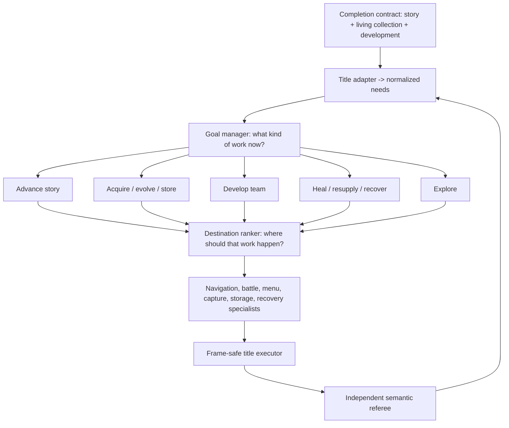

# Portable goal manager: the bridge from finishing Red to playing Pokemon

The project can execute many bounded mechanics and has learned several narrow decision seams. What
it has not yet learned is the decision that makes those seams into a player:

> Given the whole campaign state, what kind of progress should happen next?

That question is now a first-class model boundary. The implementation lives in
`goal_manager.py` and `goal_manager_model.py`. It is deliberately above the existing destination
ranker and below the completion contract.

## The hierarchy

The separation is important. The goal manager chooses `acquire_species`; it does not choose a Red
map or press buttons. The destination ranker can then select an encounter venue, and the capture
and navigation specialists execute bounded mechanics. Crystal can replace those bindings while
reusing the same manager question.

## Portable input

Every title adapter projects its state into nine pressures on a zero-to-one scale:

| Pressure | Meaning |
| --- | --- |
| story progress | required campaign work remains |
| collection progress | the declared registration/living target remains incomplete |
| team readiness | the party is not ready for its next declared challenge |
| evolution progress | reachable planned evolutions remain incomplete |
| safety | health, status, or PP makes continued work unsafe |
| resources | balls, healing, money, or other declared supplies need replenishment |
| storage capacity | party/box/daycare state blocks safe acquisition or rotation |
| control recovery | the current interaction state needs bounded recovery |
| world knowledge | useful areas, mechanics, or opportunities remain unknown |

The model ranks one option per semantic kind:

- advance story;
- acquire a species;
- develop the team;
- evolve a species;
- restore the team;
- resupply;
- manage storage;
- recover control; or
- explore.

An option includes normalized effort and risk plus a hard availability state. Its private binding
may identify a Red objective or a Crystal task, but that binding is never part of model input.
Likewise, title, map, coordinate, species, item, move, objective, party slot, and candidate position
identity are absent from the feature schema.

Goal kind determines which needs it can address. An adapter cannot supply a hand-authored
"expected utility" value that quietly encodes the teacher's answer. Multiple destinations of the
same kind are also rejected at this layer; choosing between them belongs to the destination ranker.

## Runtime authority

The first model is a shared-candidate linear ranker. Every candidate is scored with the same
weights, so reordering candidates reorders probabilities rather than changing the decision. The
feature view combines normalized need pressure with the candidate's semantic kind, effort, risk,
and relative cost—not private identity.

The live wrapper has no teacher callback. It:

1. validates a probability for every declared option;
2. requires probabilities to be finite, non-negative, and sum to one;
3. requires exact zero probability for every unavailable option;
4. applies the frozen confidence floor;
5. binds only the selected index back to the private title adapter; and
6. reports singleton dispatch separately from genuine learned choice.

This creates a causal seam that a later nonlinear or recurrent scorer can implement without
changing the binding or safety contract.

## Curriculum admission

The dataset audit rejects the shortcuts that made earlier full-run datasets look larger than they
were. By default, a development corpus is not admitted until it has at least:

- 54 successful, unique training contexts;
- 27 successful, unique development-validation contexts;
- all nine need families represented in both partitions;
- all nine goal kinds selected in both partitions;
- 24 training contexts with at least three available choices;
- three repeated semantic menus whose correct goal changes with context;
- more than one selected candidate position;
- whole-root partition and environment separation; and
- no replayed context, conflicting target, or train/validation context overlap.

Twenty-seven development contexts are still a small benchmark, but unlike the earlier six-example
design it can support a useful paired comparison. Results must be reported against at least the
lowest-effort baseline and broken out by goal kind. A fixed-priority baseline should also be added
before the first real fit.

Environment identity is retained only beside an example so the audit can enforce a held-out title.
It is structurally absent from the model input. The intended transfer evaluation is:

1. fit on admitted Red contexts;
2. freeze the Red model;
3. evaluate frozen zero-shot behavior on Crystal microtasks;
4. adapt with a small preregistered Crystal subset; and
5. compare with the same architecture trained from scratch on that subset.

Transfer means the Red initialization reaches equal Crystal performance with less Crystal teaching.
It does not mean that a Red route script also works in Crystal.

## Honest current status

The manager contract, shared feature projector, train-only fitter, authenticated model loader,
paired evaluator, hard-masked causal wrapper, curriculum audit, normalized state-evidence composer,
record-before-action writer, strict decision/outcome loader, and ROM-free invariance tests are
implemented. Red also has all nine finite live providers plus the authenticated profile, preflight,
catalog, one-shot collection, dataset reload, and fitting commands. Evaluation reports three
preregistered comparators: lowest effort, a static safety-first priority, and a stronger highest-
pressure heuristic. A learned result must add value beyond the strongest relevant comparator;
beating only a deliberately weak baseline is not enough.

The Red normalization target is fixed before private context selection: party size six, ordinary
team level 60, ten capture resources, eight recovery resources, and eight immediate storage slots.
A context profile cannot weaken those targets to manufacture its assigned pressure or teacher
label. Team-development examples execute one real weakest-member level quantum rather than replaying
an entire late-game grind. Perfect level-100 collection remains a separate long-horizon contract.

Setup tooling can derive Mansion, Mart, PC, blocked-movement, damaged-field, and damaged-Center
boundaries from authenticated nonsealed captures. It does so with ordinary controller actions,
writes only new external save/envelope files, preserves the story frontier, and creates no episode
or label. The matching finite profile builder admits no callbacks, private paths, arbitrary provider
JSON, or manager-target overrides. Ordinary wild collection can use Poké, Great, or Ultra Balls but
reserves the unique Master Ball for legendary mechanics.

The first nonsealed live rehearsal has now crossed the setup-to-preflight boundary. A post–Secret
Key capture reached a stable Mansion corridor through 82 controller actions; the resulting state
offered acquisition and exploration, and the teacher selected acquisition at pressure `0.8917`
without taking an action. A Mart rehearsal then found a real inventory constraint before data
collection: a full bag could not add an Ultra Ball stack. The fixed template extends the existing
Great Ball stack instead, and zero executable goals are now rejected with a sanitized reason before
a manager question can be constructed.

An attempted nurse-dialogue recovery context was also rejected: text boxes remain controllable and
therefore do not satisfy the normalized loss-of-overworld-control evidence. The replacement setup
uses one fully released, one-frame semantic movement pulse and captures the cartridge's genuine
transient movement latch. It never holds a button across save and never edits memory.

The new manager has **zero genuine teacher examples and no trained production artifact**. The
synthetic examples in unit tests only falsify candidate-order, binding-identity, masking, and
context-dependence bugs. They are not gameplay data and are not a performance result.

The existing strategic-navigation corpus contains 24 train and 12 development-validation choices.
Those examples answer which story destination to pursue after the need was already fixed. They are
useful for the layer below this manager but cannot honestly be relabeled as story-versus-collection
or story-versus-healing choices.

The one-shot sealed Red destination test is paused at 0/12 while this broader architecture is the
priority. Its evidence remains valid; it is simply not the shortest path to a model that can play
and collect across games.

## Next implementation slices

1. Publish the exact source-bound 81-slot registry and require green exact-commit CI.
2. Rehearse every setup/profile/preflight family on nonsealed external captures. A rehearsal may
   create a new setup save and receipt, but never a counted episode.
3. Curate 54 unique train and 27 unique development-validation contexts, preserving separate source
   lineages and obtaining at least 24 genuine three-way train menus plus three context-dependent
   repeated menus. Build storage pressure through real catches and box use, never RAM edits.
4. Freeze the complete private catalog before any counted action, then collect each one-shot episode
   and run the strict admission audit.
5. Fit the first genuine Red manager with the frozen training configuration and report all three
   fixed baselines on development validation.
6. Run Red shadow and causal campaigns with explicit manager authority and zero teacher fallback.
7. Add the Crystal adapter and the zero-shot/few-shot/from-scratch benchmark.
8. Expand acquisition, evolution, storage, breeding, trading, legendary puzzles, version routing,
   and multi-save mechanics until the same hierarchy can pursue each title's declared living-
   Pokédex contract.

The destination is still ambitious: complete games, recover from changed outcomes, and eventually
collect every legally obtainable Pokemon across multiple titles. This manager makes that ambition
an incremental research program instead of one enormous route script.
