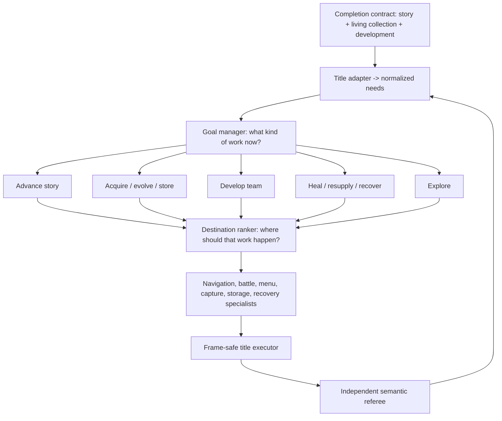

# Portable goal manager: the bridge from finishing Red to playing Pokemon

The project can execute many bounded mechanics and has learned several narrow decision seams. What
it has not yet learned is the decision that makes those seams into a player:

> Given the whole campaign state, what kind of progress should happen next?

That question is now a first-class model boundary. The implementation lives in
`goal_manager.py` and `goal_manager_model.py`. It is deliberately above the existing destination
ranker and below the completion contract.

## Current experimental status

The first Red curriculum reached and passed its read-only gate. All 81 contexts were regenerated
against one published commit and frozen with unique state, envelope, question and
order-independent policy-context fingerprints; 28 training choices were multiway, three identical
semantic menus changed answer with cartridge state, and correct answers occupied all nine
candidate positions.

The first counted pilot then found the missing gate. Five story episodes succeeded, but slot 006
failed inside its selected Fuchsia mechanic after the mandatory Fisher leg. Its setup had discarded
the final Poké Ball, but availability looked only for the Poké Flute; the executor's retained-ball
precondition appeared much later. The availability boundary now checks that observable hard input
before exposing the option. Read-only inspection had proved what the teacher would choose, not that
the exact long binding would finish. The failure and five successes remain immutable historical
evidence; a failed outcome is not an imitation target, and no model was fitted.

The protocol now inserts full execution rehearsal after freeze. It reloads each exact state,
reconstructs the frozen question and binding manifest, executes and independently verifies the
choice, checks action accounting and protected inputs, but has no writer and creates no episode.
Every capture is validated against the catalog before the first rehearsal acts. A fresh campaign
can begin only after all 81 rehearsals pass; any failure causes repair, new source identity,
preflight and refreeze rather than a retry.

## The hierarchy

The separation is important. The goal manager chooses `acquire_species`; it does not choose a Red
map or press buttons. The destination ranker can then select an encounter venue, and the capture
and navigation specialists execute bounded mechanics. Crystal can replace those bindings while
reusing the same manager question.

## Portable input

Every title adapter projects its state into nine pressures on a zero-to-one scale:

| Pressure | Meaning |
| --- | --- |
| story progress | required campaign work remains |
| collection progress | the declared registration/living target remains incomplete |
| team readiness | the party is not ready for its next declared challenge |
| evolution progress | reachable planned evolutions remain incomplete |
| safety | health, status, or PP makes continued work unsafe |
| resources | balls, healing, money, or other declared supplies need replenishment |
| storage capacity | party/box/daycare state blocks safe acquisition or rotation |
| control recovery | the current interaction state needs bounded recovery |
| world knowledge | useful areas, mechanics, or opportunities remain unknown |

The model ranks one option per semantic kind:

- advance story;
- acquire a species;
- develop the team;
- evolve a species;
- restore the team;
- resupply;
- manage storage;
- recover control; or
- explore.

An option includes normalized effort and risk plus a hard availability state. Its private binding
may identify a Red objective or a Crystal task, but that binding is never part of model input.
Likewise, title, map, coordinate, species, item, move, objective, party slot, and candidate position
identity are absent from the feature schema.

Goal kind determines which needs it can address. An adapter cannot supply a hand-authored
"expected utility" value that quietly encodes the teacher's answer. Multiple destinations of the
same kind are also rejected at this layer; choosing between them belongs to the destination ranker.

## Runtime authority

The first model is a shared-candidate linear ranker. Every candidate is scored with the same
weights, so reordering candidates reorders probabilities rather than changing the decision. The
feature view combines normalized need pressure with the candidate's semantic kind, effort, risk,
and relative cost—not private identity.

The live wrapper has no teacher callback. It:

1. validates a probability for every declared option;
2. requires probabilities to be finite, non-negative, and sum to one;
3. requires exact zero probability for every unavailable option;
4. applies the frozen confidence floor;
5. binds only the selected index back to the private title adapter; and
6. reports singleton dispatch separately from genuine learned choice.

This creates a causal seam that a later nonlinear or recurrent scorer can implement without
changing the binding or safety contract.

## Curriculum admission

The dataset audit rejects the shortcuts that made earlier full-run datasets look larger than they
were. By default, a development corpus is not admitted until it has at least:

- 54 successful, unique training contexts;
- 27 successful, unique development-validation contexts;
- all nine need families represented in both partitions;
- all nine goal kinds selected in both partitions;
- 24 training contexts with at least three available choices;
- three repeated semantic menus whose correct goal changes with context;
- more than one selected candidate position;
- whole-root partition and environment separation; and
- no replayed context, conflicting target, or train/validation context overlap.

Twenty-seven development contexts are still a small benchmark, but unlike the earlier six-example
design it can support a useful paired comparison. Results must be reported against at least the
lowest-effort baseline and broken out by goal kind. A fixed-priority baseline should also be added
before the first real fit.

Environment identity is retained only beside an example so the audit can enforce a held-out title.
It is structurally absent from the model input. The intended transfer evaluation is:

1. fit on admitted Red contexts;
2. freeze the Red model;
3. evaluate frozen zero-shot behavior on Crystal microtasks;
4. adapt with a small preregistered Crystal subset; and
5. compare with the same architecture trained from scratch on that subset.

Transfer means the Red initialization reaches equal Crystal performance with less Crystal teaching.
It does not mean that a Red route script also works in Crystal.

## Honest current status

The manager contract, shared feature projector, train-only fitter, authenticated model loader,
paired evaluator, hard-masked causal wrapper, curriculum audit, normalized state-evidence composer,
record-before-action writer, strict decision/outcome loader, and ROM-free invariance tests are
implemented. Red also has all nine finite live providers plus the authenticated profile, preflight,
catalog, one-shot collection, dataset reload, and fitting commands. Evaluation reports three
preregistered comparators: lowest effort, a static safety-first priority, and a stronger highest-
pressure heuristic. A learned result must add value beyond the strongest relevant comparator;
beating only a deliberately weak baseline is not enough.

The Red normalization target is fixed before private context selection: party size six, ordinary
team level 60, ten capture resources, eight recovery resources, and eight immediate storage slots.
A context profile cannot weaken those targets to manufacture its assigned pressure or teacher
label. Team-development examples execute one real weakest-member level quantum rather than replaying
an entire late-game grind. Perfect level-100 collection remains a separate long-horizon contract.

Setup tooling can derive Mansion, Mart, PC, blocked-movement, damaged-field, damaged-Center,
post-evolution, storage-ready and exploration boundaries from authenticated nonsealed captures. It
does so with ordinary controller actions, writes only new external save/envelope files, preserves
the story frontier, and creates no episode or label. The matching finite profile builder admits no
callbacks, private paths, arbitrary provider JSON, or manager-target overrides. Ordinary wild
collection can use Poké, Great, or Ultra Balls but reserves the unique Master Ball for legendary
mechanics.

PC restoration is explicitly field-item restoration: the PC stance is not the nurse boundary, and
the setup refuses any damaged PC state whose observed recovery plan cannot be paid from the bag.
Earlier Cinnabar lineages may buy an explicit Hyper Potion reserve through the actual Mart before
damage. The cartridge-qualified transaction binds product index 2, ₽1,500 per item, complete bag
equality apart from the requested stack, exact money change, stable return to the nurse and no
story mutation.

The first nonsealed live rehearsal has now crossed the setup-to-preflight boundary. A post–Secret
Key capture reached a stable Mansion corridor through 82 controller actions; the resulting state
offered acquisition and exploration, and the teacher selected acquisition at pressure `0.8917`
without taking an action. A Mart rehearsal then found a real inventory constraint before data
collection: a full bag could not add an Ultra Ball stack. The fixed template extends the existing
Great Ball stack instead, and zero executable goals are now rejected with a sanitized reason before
a manager question can be constructed.

An attempted nurse-dialogue recovery context was also rejected: text boxes remain controllable and
therefore do not satisfy the normalized loss-of-overworld-control evidence. The replacement setup
uses one fully released, one-frame semantic movement pulse and captures the cartridge's genuine
transient movement latch. It never holds a button across save and never edits memory.

Restoration setup now uses the manager's actual whole-party safety calculation rather than accepting
one token hit. The first controller-only state reached exactly `0.50` pressure and failed preflight
honestly because the fixed teacher's emergency gate is `0.55`. The repaired setup then produced a
field context at `0.6667` pressure with an exactly payable recovery plan and a Center context at the
same pressure. Both offered genuine competing work, selected restoration in read-only preflight,
and completed uncounted live execution: 152 actions in the field and 10 actions at the Center,
full HP, cleared status, zero safety pressure, stable input and no episode.

The evolution rehearsal then found a measurement bug rather than a gameplay bug. A genuine
three-way menu selected evolution and the bounded mechanic changed Diglett level 22 into Dugtrio
level 26. The generic progress verifier rejected it because Dugtrio is cataloged as wild-obtainable,
so the acquisition graph's evolution counter does not move. The repair keeps that global catalog
truth intact and verifies the exact one-slot living-party transformation, level increase, unchanged
story frontier, nondecreasing collection, stable input and zero faints. Published `70bb8b8` passed
CI; fresh slot-029 preflight selected evolution from the same three-way menu, and a 21,604-action /
1,252,066-frame uncounted execution changed Diglett level 22 to Dugtrio level 26. The catalog
aggregate correctly stayed 3/22 while the exact verifier succeeded, with zero faints, stable input,
released controls and no episode. A setup-only post-evolution materializer was then required before
the team-development rehearsal could run.

That gate and every remaining mechanic rehearsal are now complete. Team development executes one
real weakest-member level quantum from a post-evolution Center boundary. Acquisition retains one
required specimen and verifies the duplicate-precursor case where the missing-specimen count falls
while the unique-species count does not. Its verifier no longer equates an ended wild battle with a
capture: party-plus-box living count must grow by exactly one, so Roar and Teleport cannot become
false positive labels.

Storage setup built pressure through real Mansion catches. It exposed Gen I's prepend box order,
which is now verified directly, and uses bounded recovery after every three captures to prevent
setup attrition. The admitted external boundary had 18 of 20 active-box slots occupied. Storage
preflight selected `manage_storage` at pressure `0.75`; 36 actions / 4,512 frames rotated into an
empty box, preserved the party and every living specimen, and gained 18 immediate slots. The first
Route 24 exploration path failed closed at a blocked x=5 column. Cartridge terrain and live
movement corrected it to the x=4 corridor; the replacement completed in 38 actions / 1,968 frames
and added one genuine new sighting. Both executions ended stable and wrote no episode.

All nine goal families are therefore live-qualified end to end. This closes the mechanics gate,
not the learning gate.

The catalog freeze is also now a true prospective curriculum gate. Its first version guaranteed 81
different state files and ordered questions, but the strongest semantic checks still ran only after
one-shot execution. Version 2 preserves each read-only preflight's order-independent policy-context
digest, available-menu digest, exact candidate-kind order and selected position. It refuses to
freeze repeated semantic inputs, fewer than 24 multiway train contexts, fewer than three menus whose
selected kind changes with state, or a corpus whose train labels occupy only one candidate position.
Those failures are therefore found while contexts remain replaceable, not after episodes are spent.

### Planned Red context matrix

The Red curriculum uses state variation that the cartridge can actually produce, not copied saves
or edited memory. Story contexts come from distinct authenticated objective frontiers. Evolution,
resupply and recovery use their qualified Center, Mart and transient-control boundaries.
Acquisition, development, restoration, storage and exploration add bounded real encounter damage
where that creates a meaningful choice rather than merely a different file hash.

Four six-example training families are deliberately multiway: mild-damage development at a
Pokémon Center, stocked acquisition in the Mansion, storage pressure at the PC and discovery in a
wild corridor. Emergency restoration contexts reuse the Center, PC and Mansion menus above the
teacher's safety gate. The resulting paired menus require different answers in different states:
develop versus restore, manage storage versus restore, and acquire versus restore. Catalog freeze
checks these properties from read-only preflight evidence before any one-shot collection begins.

The first pair is now live: the identical story/development/restoration menu selected development
at `0.1342` safety pressure and restoration at `0.5599`. Mild Mansion acquisition is also live from
an acquire/restore/explore menu at `0.1071`. PC and field-recovery repairs have passed no-save live
rehearsal and await publication plus fresh exact-source preflight; they are not counted examples.

The new manager has **zero genuine teacher examples and no trained production artifact**. The
synthetic examples in unit tests only falsify candidate-order, binding-identity, masking, and
context-dependence bugs. They are not gameplay data and are not a performance result.

The existing strategic-navigation corpus contains 24 train and 12 development-validation choices.
Those examples answer which story destination to pursue after the need was already fixed. They are
useful for the layer below this manager but cannot honestly be relabeled as story-versus-collection
or story-versus-healing choices.

The one-shot sealed Red destination test is paused at 0/12 while this broader architecture is the
priority. Its evidence remains valid; it is simply not the shortest path to a model that can play
and collect across games.

## Next implementation slices

1. **Complete:** publish the exact source-bound 81-slot registry and require green exact-commit CI.
2. **Complete:** rehearse every setup/profile/preflight family on nonsealed external captures. No
   rehearsal consumed a counted episode.
3. Curate 54 unique train and 27 unique development-validation contexts, preserving separate source
   lineages and obtaining at least 24 genuine three-way train menus plus three context-dependent
   repeated menus. Build storage pressure through real catches and box use, never RAM edits.
4. Freeze the complete private catalog before any counted action. The v2 freezer must report 81
   unique policy contexts, at least 24 multiway train contexts, three context-dependent train menus
   and diverse selected positions. Then collect each one-shot episode and run strict admission.
5. Fit the first genuine Red manager with the frozen training configuration and report all three
   fixed baselines on development validation.
6. Run Red shadow and causal campaigns with explicit manager authority and zero teacher fallback.
7. Add the Crystal adapter and the zero-shot/few-shot/from-scratch benchmark.
8. Expand acquisition, evolution, storage, breeding, trading, legendary puzzles, version routing,
   and multi-save mechanics until the same hierarchy can pursue each title's declared living-
   Pokédex contract.

The destination is still ambitious: complete games, recover from changed outcomes, and eventually
collect every legally obtainable Pokemon across multiple titles. This manager makes that ambition
an incremental research program instead of one enormous route script.
