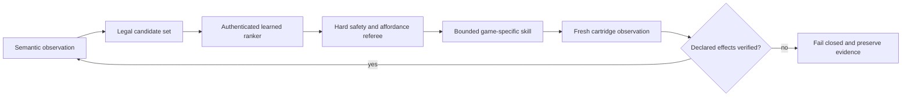

# Portfolio brief: a Pokémon agent built to make autonomy claims falsifiable

## August 28 latest update

The newest reliability pass illustrates the project's core discipline: a cartridge can report a
valid result that the automation still misunderstands. A difficult Cerulean rival schedule first
exhausted accuracy and recovery. A one-time authenticated switch fixed the battle; the next run
then **won** with Zubat as the sole survivor, but the checkpoint rejected the win because the
original lead had fainted. After accepting only the exact event-authenticated terminal, the helper
still could not walk—the Generation-I movement flags said “ready” while the party and field menus
were visibly open. The final repair closes both menu layers structurally, promotes only a provable
sole survivor, heals both roles, and restores Wartortle before storage.

That work sits beside reusable fixes to live battler identity, capture timing, blocked steps, and
bounded poison survival. One unchanged source bundle then reached late-Cinnabar
`mansion_returned` on **3/3** fresh one-use diagnostics at initial waits 197, 58, and 123:
**125,932 controller actions and 22,345,994 emulator frames**. It passes **5,718 tests**, lint,
typing across **309** source files, all source-bound registries, documentation, public-artifact,
and diff gates. The result is deliberately scoped as teacher engineering, not learned gameplay.
The honest scoreboard is still **causal train 1/60 · powered fit 0 · authority 0 · transfer 0**;
the next decision is a newly frozen 10-of-12 population gate before train-root generation resumes.

## August 28 update

The post-yield repair now has a tighter measured boundary. Exact main `be6a03a4` passed CI, but its
successor gate stopped after three failures made 10/12 impossible. Cartridge-exact funding, final-
pulse observation, semantic Silph healing, and an authenticated wild-to-trainer handoff repaired
the newly observed gaps. One unchanged source bundle then reached the late-Cinnabar Mansion return
on 3/3 new development seeds—112,486 actions and 21,072,636 frames—and passes 5,694 tests plus
lint, typing, registry, and diff gates. A path-free receipt binds the private runs while explicitly
withholding population, training, completion, and transfer claims. The next decision is an exact-
main, newly frozen 10/12 yield gate; only a pass may create train roots.

## August 28 earlier update

The project is now building a statistically powered causal curriculum for a transferable
living-Pokédex agent rather than treating a completed Red walkthrough as intelligence. The design
requires 90 independent Red training contexts with at least 60 settled selected-arm outcomes, then
105 untouched same-reset comparisons against random, cheapest-first, and myopic controls. Red can
currently identify 16 supported feature directions; unsupported Crystal mechanics must trigger
abstention and later adaptation rather than an invented zero-shot claim.

An exact action-free matching census made the data deficit concrete: 67 independent historical
lineages support only 54/90 training contexts and 63/195 disjoint train-plus-development contexts.
That opened a fresh-world classroom generator—and its first real test failed. The published source
passed CI but reached the mansion-returned boundary on only 1/12 prospectively fixed worlds. All
twelve outcomes were retained, none could retry, and no official root or model target was created.

The failure distribution drove reusable Gen-I capabilities instead of eleven seed-specific route
patches: live-mechanics battle selection, safe party switching and ordering, poison-aware return
planning, dynamic NPC routing, verified post-victory cleanup, capture-resource partitioning, and
protected-asset funding. One unchanged repaired source bundle then completed three new development
worlds in a row—115,696 controller actions and 21,246,875 emulator frames. That is engineering
qualification, not population yield or training. The exact candidate passes 5,657 repository
tests, Ruff, Mypy across 309 source files, every regenerated registry, documentation validation,
and the public-artifact scan; Antigravity returned publication GO with no P0/P1/P2 finding. After
publication and exact-main CI, twelve untouched seeds will run once against a fixed 10/12 gate
before any train-root plan can exist.

The interview story is the discipline around autonomy: deterministic tools generate safe,
independent classrooms; the learner sees anonymous strategic menus and selected-arm outcomes, never
teacher button sequences; negative and interrupted results stay in the denominator; and no model
earns Red or Crystal authority until it beats preregistered controls. The honest scoreboard remains
**causal train 1/60 · powered fit 0 · authority 0 · transfer 0**.

## August 13 update

The first strategic destination model is now frozen without spending the final test. An independent
audit rejected a 753-parameter MLP fitted from only 24 training choices. The replacement is a
five-coefficient linear scorer selected entirely by training-only leave-one-out evaluation; only
after selection did it score 10/12 on development validation against 4/12 for cheapest route. That
is promising development evidence, not a final claim.

The audit also caught two experiment-design defects before any private case was opened. The original
test registry declared no deliberate cheapest-route challenges, and the first replacement endpoint
mixed two baseline-favorable safety cases into the primary comparison. The prospective plan now
uses ten fixed challenges for a two-sided exact paired test, reports all twelve cases, and evaluates
the other two as a separate safety gate. Its realistic chance of a conclusive outcome is roughly
42–68% under an 85% challenge-validity assumption, so an inconclusive result will be published as
underpowered rather than reinterpreted.

The project now turns those promises into code. A one-shot state machine binds source, model,
teacher, case catalog and owner authorization before case one; durably claims inputs before access;
commits model and baseline predictions before teacher execution; consumes crashes without reruns;
and withholds every metric until all twelve outcomes exist. A strict path-free catalog boundary and
prediction-first PyBoy adapter now sit behind that state machine. Self-audit caught a real benchmark
execution flaw before access: ten challenge cases begin in a different city from the authenticated
source snapshot. The adapter now relocates after claim without a label, refuses any objective
change, and plans model candidates only at the declared origin. A later hardening pass made exact
audit and non-test qualification receipts part of runtime authority, blocked cloning of validated
objects, rejected symlinks throughout the private root and required cleanup capability before the
immutable ledger can start. Independent adapter audit, live non-test qualification, the actual
catalog and owner authorization remain pending. Final-test access remains **0/12**.

The qualification boundary has since produced the project's most useful kind of progress: a
sequence of safe public failures. The easy Celadon-to-Saffron rehearsal passed, but an audit noticed
that two sealed cases require Saffron-to-Cinnabar through Surf. The hard train substitute exposed an
automatic doorway-animation mismatch; published v8 then exposed a directional destination, a
bottom-gate input and an invalid cross-map arrival. Every attempt ran no teacher, left the source
artifacts unchanged and kept all twelve test cases sealed.

Schema v9 repairs the abstraction rather than scripting that route. A cross-map passage must now be
executable on both sides under the current movement mode and capabilities. The same public capture
completed 550 acknowledged steps, handled nine interruptions with no replan, reached Cinnabar in
land mode and made both strategic candidates available. It is strong systems evidence, but it is
still labeled correctly: an unpublished diagnostic awaiting exact-commit CI, typed qualification
and independent authorization audit—not a final model result.

## August 12 update

The strategic benchmark now has 76 authenticated captures, 43 distinct frontiers and 24 exact
non-test contexts: 16/24 train and 8/12 validation. All six preregistered validation challenges are
live-qualified, but counted data remains zero and all 12 test contexts remain sealed. Scenario 037
is the newest exact rehearsal: the teacher chose Erika at route cost 106 over a 77-cost Cinnabar
alternative, then completed 102 movements with no replan and no movement-imitation labels.

The strongest engineering result from the same session was a useful refusal. An early level-39
lineage now clears Silph and Giovanni on the real cartridge, with item use separately accounted for
in the rival and boss battles. Sabrina still cannot be admitted from that state because the party
has three members and the balanced Dojo/Sabrina curriculum requires five before recruiting member
six. The project records that as a missing recruitment curriculum rather than relaxing the team
contract or manufacturing a label.
Both repairs are now cartridge-qualified: Jolteon and Snorlax are construction-only party lessons
that preserve all 19 completion objectives and emit no policy example. Sabrina then recruits the
sixth member and succeeds before Surf using a separately qualified Ice Beam/Bite policy. Exact
scenario 013 is rehearsed: Fuchsia was selected over Erika, 136 movements completed without
interruption or replan, and no movement-imitation label was emitted.

Cinnabar-before-Sabrina is also now a qualified cartridge lesson rather than a graph-only
possibility. It produced exact scenario 041 and reduced the teacher-order audit from twelve gaps to
two. The official rehearsal chose the 701-cost Saffron approach over the 29-cost Secret Key,
acknowledged 690 movements, resumed 14 wild battles, replanned once and emitted no movement labels.
Its preserved failures found two world-model overclaims: only one of four Saffron guard houses was
bound to the global access flag, and an outdoor warp record with no cartridge-recognized trigger
was still routable. Both now fail closed. Counted data remains zero.

Scenario 042 carries that exact state one objective further without turning preparation into a
label. The teacher buys one X Accuracy, opens Saffron access, reaches Cinnabar and obtains the
Secret Key under four separate evidence contracts. Its official rehearsal again rejects the cheap
local option—Blaine at cost 22—in favor of the story-order Saffron destination at cost 701, then
completes 690 movements through 10 wild battles and one replan. A failed materialization also found
that Dig follows the save's live healing anchor; the repaired lesson observes Celadon, Cinnabar,
Saffron or Vermilion instead of assuming the older Saffron lineage.

Two more late-game contexts now compose from that state. A location-only constructor reaches
Saffron directly without replaying the already-consumed guard drink; Scenario 045 selects Silph in
55 movements. Late-game Silph then archives only spent story items, uses Surf rather than a
two-turn neutral attack against Rhyhorn, preserves seven carried Repels, and produces Scenario 046;
its rehearsal selects Sabrina in 67 movements. Both add one strategic label and zero button labels.

## August 11 headline

The project now separates three things that game-agent portfolios often collapse: cartridge
knowledge, deterministic mechanics and learned strategy. Red/Blue parsing derives exact ordinary
acquisition reach—135 species solo, 139 with a trade partner—rather than relying on a hand-written
Pokédex list. The game-neutral router has live evidence for stateful Surf, visible occupancy,
repeated Cut, the complete cross-floor Strength puzzle, trainer sight, a closed/open story gate and
resource renewal. Joint local/macro search rejects a real impossible shortcut on both cartridges.

The newest learning seam deliberately does **not** train on those arrow sequences. It records real
multi-destination choices from reviewed cross-title semantics and route costs, keeps exact bindings
private to execution, and joins every choice to one success, failure or censored interruption.
Successful routes may supervise imitation; failed routes remain negative outcome evidence; power
loss is not quietly rerun. The authenticated writer/reader and lineage audit are implemented, but
the honest model-development count is still zero train/validation strategic navigation examples and
no navigation model. Earlier route calibrations proved the seam. The first selected cost
15 over 87 between safe hubs; the second selected Koga's Gym at cost 21 over the Warden at cost 24.
The third is the important control: after the Celadon Hideout, story semantics selected Pokémon
Tower at cost 178 over optional Eevee at cost 60. The generic executor crossed nine maps, resumed
after one unavoidable trainer encounter and reached Tower 1F after 174/174 acknowledged movements
with zero replans. It proves the label is not merely shortest-path supervision, but it remains a
development calibration—not evidence of learning.

The newer context-diverse benchmark now has seven authenticated short-scenario calibrations and zero
counted rows. Its first four forced fail-closed repairs in return-warp timing and arrival, custom
trainer recovery, boundary control and portable envelope identity. The next two exercised a new
bounded-skill capture constructor and found a deeper world-model issue: the cartridge hides the
Silph entrance guard after Fuji and the Saffron Gym guard after Giovanni, while static topology had
kept both forever. Binding only those coordinates to observed story flags made both candidate sets
executable. The teacher completed Silph and Sabrina approaches with 35/35 and 67/67 acknowledged
movements, zero interruption or replan, and no movement labels. Scenarios 003 and 007 are measured
validation disagreements with the cost-only baseline; four more preregistered
challenge disagreements are still required before collection can support the paired comparison.

The next experiment is now preregistered rather than aspirational: five whole power-on train roots,
two validation roots, five sealed test roots and one rehearsal, each with a unique timing schedule
fixed before outcomes. The binding API will not accept a caller-invented train label; it requires
the exact committed assignment. All slots remain unopened, so this improves experimental validity
without inflating the dataset count.

That makes the best current interview story: I did not use a neural network where exact search was
the better tool, and I did not create synthetic labels to claim training had started. I built the
measurement boundary first, preserved negative outcomes, and made the next model earn its authority
against route-cost and candidate-shape baselines. See the
[current audit](current-audit-2026-08-11.md),
[acquisition evidence](evidence/acquisition-routes-2026-08-11.json), and
[joint-routing evidence](evidence/joint-route-pricing-audit-2026-08-11.json), plus the
[safe-hub calibration](evidence/pallet-strategic-safe-hub-route-probe-2026-08-11.json) and
[genuine-branch calibration](evidence/fuchsia-strategic-objective-route-probe-2026-08-11.json), the
[non-cost calibration](evidence/celadon-strategic-objective-route-probe-2026-08-11.json), and its
[six failed precursors](evidence/celadon-strategic-objective-route-failures-2026-08-11.json), plus the
[prospective collection registry](../configs/red-strategic-navigation-collection-v1.json).

## August 10 headline

The combined six-role learned stack has a complete uncounted derived-timing run through Hall of Fame:
74/74 scheduled battles, all 36 semantic objectives, 3,165 high-level battle decisions, 3,110
learned move decisions, 12/12 learned switch targets, both training models in live authority, and
zero battle-teacher query or fallback. The next root legitimately lost the lab rival; rather than
reroll, the system learned a bounded recovery branch and later completed that altered run under the
objective model plus authored skills. The official ten-root campaign remains 0/10.

The newest engineering milestone attacks the largest portability problem: fixed navigation. Red
and Blue produce the same complete static land graph—154,653 directed edges over 48,216
coordinates—but stateful mechanics stay separate. Surf is an observed movement mode; visible NPCs
are temporary live constraints; Cut is a staged mutation. In the Celadon proof, capability only
authorized walking to a stance. Live RAM then acknowledged block `$35 → $4C` and tile `$3D → $2C`,
terrain was rebuilt, and only the new graph crossed the former tree. Strength is still refused as a
fake possession permission because it needs player/boulder state search.

That pair is the best interview story in the repository. It demonstrates causal evaluation,
calibration against rare actions, separation of model errors from executor errors, source-bound
experiment lineage, and honest negative evidence. See the
[August 10 audit](current-audit-2026-08-10.md),
[navigation audit](traversal-audit-2026-08-10.md),
[passing receipt](evidence/portable-clean-start-six-role-perturbation-12-qualification-2026-08-10.json),
and [failure receipt](evidence/portable-clean-start-six-role-perturbation-13-failure-2026-08-10.json).

## The one-sentence version

I built a verified Pokémon Red teacher and independent referee, then replaced bounded decision
layers with authenticated learned policies and required each one to pass sealed offline, shadow,
causal emulator-control, and system-integration gates before calling it autonomous.

## Why this is more than a game script

The deterministic route is deliberately not presented as the AI. It is the expert oracle,
demonstration generator, mechanic library, and test fixture. The learned components sit behind typed
interfaces, receive semantic or identity-free observations, and cannot certify their own success.
Fresh cartridge observations and content-addressed receipts decide whether a run counts.

The project therefore asks a harder question than “can code beat Pokémon Red?”:

> Which decisions can a learned controller safely own without an answer key, and which apparent
> successes disappear when the denominator or baseline is made honest?

## Verified results

| Result | Evidence | Boundary |
| --- | --- | --- |
| Complete Red oracle | 312/312 semantic checkpoints, 36/36 objectives, Champion and Hall of Fame from clean power-on | Deterministic expert, not learned discovery |
| Portable objective loop | 20 sequential model dispatches in one emulator process through Hall of Fame | 1 genuine branch; 19 singleton choices; fixed skills execute mechanics |
| Five-action training control | 57,548 live battle/overworld decisions inside the portable Blaine objective | Candidate-only baseline was perfect, so this proves authority plumbing, not feature value |
| State-dependent training strategy | 99.9004% sealed validation versus 95.6615% for the shape-only baseline | One Red training curriculum; no cross-title result |
| Isolated strategic authority | 119,668 controlled trainee/venue choices, 191 executed teacher disagreements, all six level 55, zero faints | Captured-state training lesson |
| Portable strategic authority | 114,831 controlled choices, 400 executed disagreements, 1,803 development battles, no fallback; fresh observation opened Giovanni | Singleton objective dispatch and authored mechanics remain |
| Portable clean-start baseline | 21 selected composites plus 15 automatic effects through Hall of Fame; no expected label, fixed dispatch, or fallback | Battle mechanics were not under the full strict learned stack |
| Strict four-model rehearsal | 3,220 model move decisions and zero teacher query/fallback through a Lorelei win | Correctly rejected: 19/19 attacks from slot 1 and zero role switches |
| Reserve-aware controller | Four complete lineages; 98.2394% / 94.7537% held-out class metrics; 17/17 fresh offline targets; 13/13 isolated causal bindings; combined canonical Hall of Fame with 21/21 targets | Paired timing root exposed a deterministic early-game referee defect before model decisions; perturbation qualification remains |
| Prospective evaluation | Source/model/root-bound ten-run registry and independent 8-of-10 checker | Campaign remains unopened at 0/10 until reserve-aware battle control qualifies |
| Cartridge-derived navigation | Multi-map acknowledgement/replan; Surf; live occupancy; repeated Cut; full Strength chain; trainer sight; multiple observed story thresholds; resource renewal; joint pricing | Completion teacher still owns broad invocation, menu/script recovery and final Indigo travel |
| Strategic navigation data | Identity-free choice/outcome schema, reviewed vocabulary, authenticated trajectory join, 18 exact v2 contexts, six paired baseline disagreements and sealed test access | 0 counted train/validation examples; only 10/24 train and 8/12 validation contexts constructed; no frozen numeric schema, model, shadow result or causal authority |
| Acquisition knowledge | Exact Red/Blue ordinary reach: 135 solo / 139 with trade partner | No autonomous living-Pokédex execution or multi-save/trade orchestration |
| Repository gate | 2,727 non-integration tests, Ruff, mypy, public-artifact, documentation, and source-bound registry checks | Runtime ROM qualifications remain private and explicitly separated from CI; one expected failure is retained |

## Architecture in one minute

The model never receives arbitrary RAM access, a demonstration index, or permission to emit
unbounded controller input. Identity-free training features exclude species, move, slot, area,
map, and memory identities. Private ROM-derived artifacts stay outside Git; public receipts retain
only hashes, typed outcomes, metrics, and claim boundaries.

## The strongest debugging story

The first strategic ranker looked excellent offline: 99.9004% held-out accuracy and a 4.239-point
margin over its strongest shape-only baseline. Shadow evaluation also passed. Its first causal run,
however, exhausted the healing budget after 15,449 controlled choices while ending with an
underdeveloped party.

The easy reaction would have been to retrain or loosen the budget. Instead, the failed root was
frozen. The model had disagreed with the teacher zero times, so a model mistake could not explain
the changed behavior. A same-root teacher run completed normally. The fault was in the authority
wrapper: installing a callback recomputed downstream mechanics even when it returned the teacher's
own choice.

The repair made agreement a behavioral no-op and added a ROM-free regression test. The unchanged
model then passed a newly preregistered causal root with 191 executed disagreements and later passed
portable integration with 400. This sequence demonstrates experimental design, causal debugging,
invariant testing, and the discipline to preserve a negative result rather than edit it away.

The current battle lane repeats that discipline at a finer boundary. One Agatha replay passed setup,
status, residency, and exact-switch gates but still failed because the classifier chose “switch”
while a deterministic scorer chose the wrong party member. A new permutation-equivariant target
head improves held-out labels from 10/13 to 11/13, yet still misses that exact Golbat choice. It is
committed as an offline candidate with no runtime authority rather than presented as a fix. A
fourth complete lineage reproduced 11/13 against a weaker 9/13 baseline. Equal-total loss weighting
per battle plan then reached 54/54 across four opened leave-one-lineage-out folds without adding
identity. Because those settings were chosen after seeing all four, a fifth fresh lineage—not the
development score—is the next promotion gate.

## What I would discuss in an interview

### Latest reliability milestone

Fresh timing seed `990027` produced a legitimate lab-rival loss. Rather than rerolling, the system
now authenticates that outcome, builds the missing capability through thirteen bounded Route 1
battles with verified healing, and carries the altered experience and money state through Brock,
Route 3, a weakened Zubat capture, evolution, Misty, and the level-24 Bite transition. The repair
also separates trainer-switch prompts from evolution semantically and accounts for every extra
Potion and the conditional TM34 sale. Commit `d9a7beb` passes 2,227 ROM-free tests plus Ruff, mypy,
documentation, privacy, and source-registry gates. The traced run continued to 18/19 objectives and
71/74 battles before Agatha exposed a missing specialist revive. Commit `56e9be5` permits exactly
one, protects two Revives for Lance, and passes 2,228 ROM-free tests plus the same static gates. The
extended runtime result remains explicitly diagnostic until the exact committed source completes a
clean-power replay. That replay now passes: 47,317,703 frames, 21/21 selected objectives, 36/36
observed objectives, 74/74 battles, Champion, and Hall of Fame with a healthy
66/55/55/55/55/55 party. It is strong teacher/objective integration evidence, not a claim that all
six learned control heads were active.

- How to separate an expert teacher, learned actor, safety referee, and game-specific executor.
- Why a 100% model score can be meaningless when the legal candidate set already determines the
  answer.
- How whole-lineage splits, immutable roots, SHA-256 artifact chains, and prospective gates prevent
  leakage and favorable reruns.
- Why shadow agreement cannot substitute for causal authority, and why causal authority can still
  prove integration without proving feature value.
- How the candidate scorer remains permutation-equivariant and excludes title-specific identity.
- How an emulator-scale system is tested without redistributing the ROM: more than 2,300 ROM-free tests plus
  private authenticated runtime receipts.
- Why exact graph search should own geometry while a learned policy owns destination, capability,
  recovery and interruption decisions.

## Honest limitations

This is not yet a general Pokémon-playing model. Navigation, menus, recovery, resource handling,
and many mechanic skills remain authored. A portable clean-start objective loop now reaches Hall of
Fame, but many choices are affordance-masked and the strict battle model fails the balanced Lorelei
role contract. There is no Crystal benchmark, clean-start 8/10 learned-stack series, or autonomous
living-Pokédex result yet.

The strategic navigation collection seam contains zero train/validation records, but it now has one
qualified uncounted three-choice clean-power rehearsal. It completed 312/312 checkpoints and Hall of
Fame with three joined successes: Tower over Eevee, Koga before Warden, and Hitmonlee before
Sabrina. Candidate order is assignment-permuted, identity is excluded, and the shortest-route
baseline scores only 2/3. That is enough coverage to open the small prospective campaign after the
new official counted launcher passes its own regenerated rehearsal. The next credible navigation
claim still requires the disjoint train/validation lineages, a frozen numeric representation,
shadow evaluation and fresh causal authority—not one more development route.

The immediate modeling gap is no longer vague. The old battle controller could not observe reserve
matchups. Feature schema v3 now can, and it binds the chosen semantic candidate to switch execution.
A fresh artifact improved rare-class held-out balance and has causal evidence through an Agatha win.
The first switch-target head also beat its deterministic baseline but repeated the causal Golbat
case. The second candidate is perfect across 54 opened development labels after plan-balanced
training, which was promising but not prospective evidence. Seed 990006 stopped before producing
target rows and is excluded. The unchanged candidate then passed all 17 seed-990007 targets versus
12/17 for the deterministic baseline, including all seven Agatha switches. Its authenticated
artifact next passed 13/13 canonical shadow targets and causally rebound 13/13 live requests during
a Hall-of-Fame completion. The first six-role teacher-free composition exposed a chapter executor
that recognized a learned HP recovery semantically but still required the teacher's Python
exception class. That failure was preserved and repaired before the next combined replay.
The retry qualified S.S. Anne and then found a Route 11 intent advertising recovery effects that
the pre-Mart protected inventory could not legally spend. Capabilities now derive from live surplus
and remaining allowance on each dispatch. Seed `990013` qualified both repairs and defeated
Lorelei with no battle-teacher query, 13/13 learned target bindings, and live authority from both
training models. The evaluator still rejected attacks at 59 HP beneath Lorelei's 70-HP contract.
That negative result produced a portable HP intent, pre-ranking affordance masks, and a report-v2
contract that requires every requested learned authority. Seed `990014` then qualified those
boundaries, defeated Lorelei, Bruno, and Agatha, and reached Lance's room after 3,286 battle
decisions with zero teacher/safety fallback and 21/21 learned targets. The evaluator still refused
promotion because Agatha's switch receipt conflated one autonomous learned pivot with the fixed
teacher's preferred role even though the independent specialist lesson passed. The repair preserves
live opponent and target-slot identity evidence while separating receipt integrity from policy
agreement; the next fresh canonical replay was the terminal test.

That replay now exists. Seed `990015` completed all 36 objectives and Hall of Fame with the exact
six-model stack, 3,315 battle decisions, 21/21 learned target bindings, both training heads in live
control, and zero teacher query or fallback. Its paired timing root then failed before any model
battle decision because the lab-rival referee mistook one legal Squirtle DV outcome for the only
valid stat vector and exhausted its dialogue cap. Direct reproduction proved the battle win. The
repair preserves the semantic result/event/script proof and makes a fresh perturbation—not another
canonical replay—the next gate.

The next seed cleared that referee and immediately found a normal Route 1 wild encounter that the
fixed corridor rejected. The repair is deliberately game-like rather than seed-like: a finite,
evidence-bearing flee resumes the route while proving the party, level, max HP, PP, status,
coordinate, and controls remained valid.

The next perturbation accepted two flees and found a second-order defect: the first ready-looking
overworld frame did not yet accept movement, so the route silently drifted. A causal delay-only
trial reached the exact gate. The shared repair now authenticates the post-wait state and covers
both early Route 1 chapters, turning another favorable timing assumption into an explicit contract.

Seed `990019` then proved that a stable wait is not movement acknowledgement. Five flee receipts
passed, but one unconsumed north request left the route one tile short. A causal coordinate-checked
trial needed exactly one retry. The production helper now advances only after observed directional
progress or a map transition and publishes its bounded retry count.

Seed `990020` supplied the complementary boundary: an ordinary encounter began before coordinate
progress. The helper now spends a flee allowance, preserves the unchanged pre-step party, and
retries the direction instead of counting false movement or rejecting normal gameplay.

Seed `990021` shifted the title/menu timing enough that the fixed intro never entered the game.
The replacement is a finite state-authenticated recovery, not a favorable delay: cycle
`Start,A,A,A`, observe after every input, wait without input once the clean bedroom exists, and
accept only its exact input-ready gate. The failed root recovered in 18 inputs plus one input-free
settling wait and obtained Squirtle; no learned role had been reached in the original failure.

Seed `990022` qualified the intro repair and then hit an incidental battle on Route 2. The shared
traversal now takes an explicit map contract, so Route 2 can reuse the exact authenticated flee and
movement receipt without accepting trainers, wrong maps, or a global “ignore battles” shortcut.

The following root proved Route 2 and found the next semantic distinction in Viridian Forest:
incidental wilds during travel should be fled, while three planned Kakuna lessons must be fought.
One cumulative, evidence-bearing travel budget now coexists with the separate curriculum contracts.

Seed `990024` then revealed that the named Kakuna lesson never checked species and depended on one
frame wait to create a battle. The replacement performs a bounded semantic search for observed
Kakuna and publishes target identities and attempt counts.

Seed `990025` found that the early-game route had not reused the repository's own later solution
for Route 1's wandering youngster. The exact source gate now shares one bounded yield/restore/cross
contract, illustrating why mechanic knowledge must outlive the chapter that first discovered it.

Seed `990026` then reached the post-Forest resource gate after every intended lesson and still
failed. A same-root probe showed the precise legal state: level 9, 19/27 HP, 26 Bubble PP, and
poison. The repair does not lower HP or PP requirements; it permits that one recoverable status on
the direct Center transit, authenticates full recovery, then applies the healthy Gym gate. This is a compact
example of separating a curriculum outcome from the recovery mechanic needed to make it portable.
The next causal replay crossed Brock and found the same design gap after Route 3 trainer zero:
10/35 HP plus poison could not survive the return. The repair relocates the guaranteed PC Potion,
uses it at the observed boundary, and preserves the later six-Potion floor without changing total
spend. The next replay then exposed repeated Wrap at 13/35 HP in trainer one; a one-use MAIN-menu
recovery contract protects twelve Potions and retains the same downstream floor. Together these
are a small example of state-aware resource scheduling rather than seed-specific input timing.

The same causal root subsequently qualified all Route 3 repairs and a semantic level-seven Zubat
search in Mt. Moon. When a later ordinary wild interrupted another 1F segment, the next design was
deliberately widened to a single cave-wide, report-visible flee/retry ledger spanning every floor,
detour, and return path. This demonstrates the central engineering progression: use each changed
run to replace a local timing assumption with a scoped, reusable, evidence-bearing capability.
That ledger then qualified sixteen incidental cave encounters with no attrition. When the required
Rocket still won narrowly, the repair reused the already-collected TM01 instead of weakening the
economy contract; Mega Punch won, and a strict verifier caught the next defect when a fixed
switch-decline sequence canceled evolution. This is a compact example of why UI actions need
semantic intent and postconditions.

Those limitations are not hidden backlog trivia; they define the next falsification tests. The
[current audit](current-audit-2026-08-09.md) explains why the ten clean-start roots should not open
until the now-canonical-qualified reserve-aware stack also passes a perturbation rehearsal.

## Resume-ready bullets

- Built a typed Pokémon Red agent and independent semantic referee that verify 312 checkpoints and
  all 36 objectives through Hall of Fame from clean power-on.
- Designed an auditable ML promotion pipeline with sealed whole-lineage evaluation, identity-free
  variable candidate sets, exact artifact authentication, fail-closed safety, and preserved
  rejected experiments.
- Qualified a strategic trainee/venue controller inside a portable objective loop across 114,831
  live choices and 400 executed teacher disagreements, completing 1,803 development battles with no
  fallback before fresh emulator observation verified the Volcano Badge.
- Hardened a large Python research system with 2,300+ tests, Ruff, mypy, documentation/privacy
  gates, deterministic source registries, and at least 19 consecutive green GitHub Actions runs after
  diagnosing one derived-artifact CI regression.
- Replaced hand-written map sketches with cartridge-derived Red/Blue topology and traversal,
  preserving exact controller actions and proving generated routes against live emulator memory.
- Built a prospective one-attempt 8-of-10 clean-start evaluator and used its strict rehearsal to
  reject a mechanically successful Lorelei battle when the model failed the declared team-role
  curriculum, localizing the next representation gap before any counted root was consumed.

## Suggested two-minute demo

1. Show the clean-power Hall-of-Fame receipt and immediately label it “teacher/oracle.”
2. Show the portable loop returning to observation after each objective; display the honest
   `1 branching / 19 singleton` denominator.
3. Shuffle six anonymous trainee cards and three venue cards to demonstrate the identity-free
   candidate interface.
4. Show the offline baseline margin, the preserved causal failure, the same-root diagnostic, and
   the agreement-no-op regression test.
5. Show the clean-start baseline reaching Hall of Fame, then contrast the strict run's Lorelei win
   with `[19, 0, 0, 0, 0, 0]` and the verifier's red result.
6. Animate cartridge bytes becoming a map graph and local action graph, then show the generated
   Route 1 ledge approach, two-square hop, and blocked reverse input.
7. End on the causal staircase: `990007: 17/17 prospective`, `990009: 13/13 shadow`, and
   `990010: 13/13 causal + Hall of Fame`. Then show `990011` removing the S.S. Anne teacher-class
   check, `990012` replacing a static Route 11 capability claim with live resource authority, and
   `990013` turning a 59-HP Lorelei attack into an explicit legal-action boundary.
   Boundary card: “Causal success at one layer is the next composition test—not the end of the
   project.”
