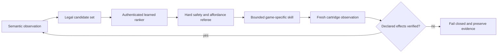

# Portfolio brief: a Pokémon agent built to make autonomy claims falsifiable

## The one-sentence version

I built a verified Pokémon Red teacher and independent referee, then replaced bounded decision
layers with authenticated learned policies and required each one to pass sealed offline, shadow,
causal emulator-control, and system-integration gates before calling it autonomous.

## Why this is more than a game script

The deterministic route is deliberately not presented as the AI. It is the expert oracle,
demonstration generator, mechanic library, and test fixture. The learned components sit behind typed
interfaces, receive semantic or identity-free observations, and cannot certify their own success.
Fresh cartridge observations and content-addressed receipts decide whether a run counts.

The project therefore asks a harder question than “can code beat Pokémon Red?”:

> Which decisions can a learned controller safely own without an answer key, and which apparent
> successes disappear when the denominator or baseline is made honest?

## Verified results

| Result | Evidence | Boundary |
| --- | --- | --- |
| Complete Red oracle | 312/312 semantic checkpoints, 36/36 objectives, Champion and Hall of Fame from clean power-on | Deterministic expert, not learned discovery |
| Portable objective loop | 20 sequential model dispatches in one emulator process through Hall of Fame | 1 genuine branch; 19 singleton choices; fixed skills execute mechanics |
| Five-action training control | 57,548 live battle/overworld decisions inside the portable Blaine objective | Candidate-only baseline was perfect, so this proves authority plumbing, not feature value |
| State-dependent training strategy | 99.9004% sealed validation versus 95.6615% for the shape-only baseline | One Red training curriculum; no cross-title result |
| Isolated strategic authority | 119,668 controlled trainee/venue choices, 191 executed teacher disagreements, all six level 55, zero faints | Captured-state training lesson |
| Portable strategic authority | 114,831 controlled choices, 400 executed disagreements, 1,803 development battles, no fallback; fresh observation opened Giovanni | Singleton objective dispatch and authored mechanics remain |
| Portable clean-start baseline | 21 selected composites plus 15 automatic effects through Hall of Fame; no expected label, fixed dispatch, or fallback | Battle mechanics were not under the full strict learned stack |
| Strict four-model rehearsal | 3,220 model move decisions and zero teacher query/fallback through a Lorelei win | Correctly rejected: 19/19 attacks from slot 1 and zero role switches |
| Reserve-aware controller | Four complete lineages; 98.2394% / 94.7537% held-out class metrics; target head passed 17/17 fresh offline targets, 13/13 shadow, and 13/13 causal bindings through Hall of Fame | Completed target trial kept switch timing and moves teacher-gated; combined and perturbation authority remain |
| Prospective evaluation | Source/model/root-bound ten-run registry and independent 8-of-10 checker | Campaign remains unopened at 0/10 until reserve-aware battle control qualifies |
| Repository gate | 2,157 tests, Ruff, mypy, public-artifact, documentation, and source-bound registry checks | 44 legacy modules remain in the explicit mypy debt register |

## Architecture in one minute

The model never receives arbitrary RAM access, a demonstration index, or permission to emit
unbounded controller input. Identity-free training features exclude species, move, slot, area,
map, and memory identities. Private ROM-derived artifacts stay outside Git; public receipts retain
only hashes, typed outcomes, metrics, and claim boundaries.

## The strongest debugging story

The first strategic ranker looked excellent offline: 99.9004% held-out accuracy and a 4.239-point
margin over its strongest shape-only baseline. Shadow evaluation also passed. Its first causal run,
however, exhausted the healing budget after 15,449 controlled choices while ending with an
underdeveloped party.

The easy reaction would have been to retrain or loosen the budget. Instead, the failed root was
frozen. The model had disagreed with the teacher zero times, so a model mistake could not explain
the changed behavior. A same-root teacher run completed normally. The fault was in the authority
wrapper: installing a callback recomputed downstream mechanics even when it returned the teacher's
own choice.

The repair made agreement a behavioral no-op and added a ROM-free regression test. The unchanged
model then passed a newly preregistered causal root with 191 executed disagreements and later passed
portable integration with 400. This sequence demonstrates experimental design, causal debugging,
invariant testing, and the discipline to preserve a negative result rather than edit it away.

The current battle lane repeats that discipline at a finer boundary. One Agatha replay passed setup,
status, residency, and exact-switch gates but still failed because the classifier chose “switch”
while a deterministic scorer chose the wrong party member. A new permutation-equivariant target
head improves held-out labels from 10/13 to 11/13, yet still misses that exact Golbat choice. It is
committed as an offline candidate with no runtime authority rather than presented as a fix. A
fourth complete lineage reproduced 11/13 against a weaker 9/13 baseline. Equal-total loss weighting
per battle plan then reached 54/54 across four opened leave-one-lineage-out folds without adding
identity. Because those settings were chosen after seeing all four, a fifth fresh lineage—not the
development score—is the next promotion gate.

## What I would discuss in an interview

- How to separate an expert teacher, learned actor, safety referee, and game-specific executor.
- Why a 100% model score can be meaningless when the legal candidate set already determines the
  answer.
- How whole-lineage splits, immutable roots, SHA-256 artifact chains, and prospective gates prevent
  leakage and favorable reruns.
- Why shadow agreement cannot substitute for causal authority, and why causal authority can still
  prove integration without proving feature value.
- How the candidate scorer remains permutation-equivariant and excludes title-specific identity.
- How an emulator-scale system is tested without redistributing the ROM: 2,157 ROM-free tests plus
  private authenticated runtime receipts.

## Honest limitations

This is not yet a general Pokémon-playing model. Navigation, menus, recovery, resource handling,
and many mechanic skills remain authored. A portable clean-start objective loop now reaches Hall of
Fame, but many choices are affordance-masked and the strict battle model fails the balanced Lorelei
role contract. There is no Crystal benchmark, clean-start 8/10 learned-stack series, or autonomous
living-Pokédex result yet.

The immediate modeling gap is no longer vague. The old battle controller could not observe reserve
matchups. Feature schema v3 now can, and it binds the chosen semantic candidate to switch execution.
A fresh artifact improved rare-class held-out balance and has causal evidence through an Agatha win.
The first switch-target head also beat its deterministic baseline but repeated the causal Golbat
case. The second candidate is perfect across 54 opened development labels after plan-balanced
training, which was promising but not prospective evidence. Seed 990006 stopped before producing
target rows and is excluded. The unchanged candidate then passed all 17 seed-990007 targets versus
12/17 for the deterministic baseline, including all seven Agatha switches. Its authenticated
artifact next passed 13/13 canonical shadow targets and causally rebound 13/13 live requests during
a Hall-of-Fame completion. The first six-role teacher-free composition exposed a chapter executor
that recognized a learned HP recovery semantically but still required the teacher's Python
exception class. That failure is preserved and repaired; a fresh combined replay remains.
The retry qualified S.S. Anne and then found a Route 11 intent advertising recovery effects that
the pre-Mart protected inventory could not legally spend. Capabilities now derive from live surplus
and remaining allowance on each dispatch. Seed `990013` qualified both repairs and defeated
Lorelei with no battle-teacher query, 13/13 learned target bindings, and live authority from both
training models. The evaluator still rejected attacks at 59 HP beneath Lorelei's 70-HP contract.
That negative result produced a portable HP intent, pre-ranking affordance masks, and a report-v2
contract that requires every requested learned authority. Seed `990014` then qualified those
boundaries, defeated Lorelei, Bruno, and Agatha, and reached Lance's room after 3,286 battle
decisions with zero teacher/safety fallback and 21/21 learned targets. The evaluator still refused
promotion because Agatha's switch receipt conflated one autonomous learned pivot with the fixed
teacher's preferred role even though the independent specialist lesson passed. The repair preserves
live opponent and target-slot identity evidence while separating receipt integrity from policy
agreement; a fresh canonical replay remains.

Those limitations are not hidden backlog trivia; they define the next falsification tests. The
[current audit](current-audit-2026-08-09.md) explains why the ten clean-start roots should not open
until a reserve-aware battle artifact passes canonical and perturbation rehearsals.

## Resume-ready bullets

- Built a typed Pokémon Red agent and independent semantic referee that verify 312 checkpoints and
  all 36 objectives through Hall of Fame from clean power-on.
- Designed an auditable ML promotion pipeline with sealed whole-lineage evaluation, identity-free
  variable candidate sets, exact artifact authentication, fail-closed safety, and preserved
  rejected experiments.
- Qualified a strategic trainee/venue controller inside a portable objective loop across 114,831
  live choices and 400 executed teacher disagreements, completing 1,803 development battles with no
  fallback before fresh emulator observation verified the Volcano Badge.
- Hardened a 142k-line Python research system with 2,157 tests, Ruff, mypy, documentation/privacy
  gates, deterministic source registries, and at least 19 consecutive green GitHub Actions runs after
  diagnosing one derived-artifact CI regression.
- Built a prospective one-attempt 8-of-10 clean-start evaluator and used its strict rehearsal to
  reject a mechanically successful Lorelei battle when the model failed the declared team-role
  curriculum, localizing the next representation gap before any counted root was consumed.

## Suggested two-minute demo

1. Show the clean-power Hall-of-Fame receipt and immediately label it “teacher/oracle.”
2. Show the portable loop returning to observation after each objective; display the honest
   `1 branching / 19 singleton` denominator.
3. Shuffle six anonymous trainee cards and three venue cards to demonstrate the identity-free
   candidate interface.
4. Show the offline baseline margin, the preserved causal failure, the same-root diagnostic, and
   the agreement-no-op regression test.
5. Show the clean-start baseline reaching Hall of Fame, then contrast the strict run's Lorelei win
   with `[19, 0, 0, 0, 0, 0]` and the verifier's red result.
6. End on the causal staircase: `990007: 17/17 prospective`, `990009: 13/13 shadow`, and
   `990010: 13/13 causal + Hall of Fame`. Then show `990011` removing the S.S. Anne teacher-class
   check, `990012` replacing a static Route 11 capability claim with live resource authority, and
   `990013` turning a 59-HP Lorelei attack into an explicit legal-action boundary.
   Boundary card: “Causal success at one layer is the next composition test—not the end of the
   project.”
