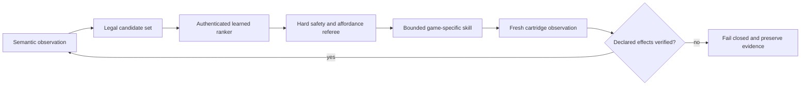

# Portfolio brief: a Pokémon agent built to make autonomy claims falsifiable

## August 10 headline

The combined six-role learned stack has a complete uncounted derived-timing run through Hall of Fame:
74/74 scheduled battles, all 36 semantic objectives, 3,165 high-level battle decisions, 3,110
learned move decisions, 12/12 learned switch targets, both training models in live authority, and
zero battle-teacher query or fallback. The next root legitimately lost the lab rival; rather than
reroll, the system learned a bounded recovery branch and later completed that altered run under the
objective model plus authored skills. The official ten-root campaign remains 0/10.

The newest engineering milestone attacks the largest portability problem: fixed navigation. Red
and Blue produce the same complete static land graph—154,653 directed edges over 48,216
coordinates—but stateful mechanics stay separate. Surf is an observed movement mode; visible NPCs
are temporary live constraints; Cut is a staged mutation. In the Celadon proof, capability only
authorized walking to a stance. Live RAM then acknowledged block `$35 → $4C` and tile `$3D → $2C`,
terrain was rebuilt, and only the new graph crossed the former tree. Strength is still refused as a
fake possession permission because it needs player/boulder state search.

That pair is the best interview story in the repository. It demonstrates causal evaluation,
calibration against rare actions, separation of model errors from executor errors, source-bound
experiment lineage, and honest negative evidence. See the
[current audit](current-audit-2026-08-10.md),
[navigation audit](traversal-audit-2026-08-10.md),
[passing receipt](evidence/portable-clean-start-six-role-perturbation-12-qualification-2026-08-10.json),
and [failure receipt](evidence/portable-clean-start-six-role-perturbation-13-failure-2026-08-10.json).

## The one-sentence version

I built a verified Pokémon Red teacher and independent referee, then replaced bounded decision
layers with authenticated learned policies and required each one to pass sealed offline, shadow,
causal emulator-control, and system-integration gates before calling it autonomous.

## Why this is more than a game script

The deterministic route is deliberately not presented as the AI. It is the expert oracle,
demonstration generator, mechanic library, and test fixture. The learned components sit behind typed
interfaces, receive semantic or identity-free observations, and cannot certify their own success.
Fresh cartridge observations and content-addressed receipts decide whether a run counts.

The project therefore asks a harder question than “can code beat Pokémon Red?”:

> Which decisions can a learned controller safely own without an answer key, and which apparent
> successes disappear when the denominator or baseline is made honest?

## Verified results

| Result | Evidence | Boundary |
| --- | --- | --- |
| Complete Red oracle | 312/312 semantic checkpoints, 36/36 objectives, Champion and Hall of Fame from clean power-on | Deterministic expert, not learned discovery |
| Portable objective loop | 20 sequential model dispatches in one emulator process through Hall of Fame | 1 genuine branch; 19 singleton choices; fixed skills execute mechanics |
| Five-action training control | 57,548 live battle/overworld decisions inside the portable Blaine objective | Candidate-only baseline was perfect, so this proves authority plumbing, not feature value |
| State-dependent training strategy | 99.9004% sealed validation versus 95.6615% for the shape-only baseline | One Red training curriculum; no cross-title result |
| Isolated strategic authority | 119,668 controlled trainee/venue choices, 191 executed teacher disagreements, all six level 55, zero faints | Captured-state training lesson |
| Portable strategic authority | 114,831 controlled choices, 400 executed disagreements, 1,803 development battles, no fallback; fresh observation opened Giovanni | Singleton objective dispatch and authored mechanics remain |
| Portable clean-start baseline | 21 selected composites plus 15 automatic effects through Hall of Fame; no expected label, fixed dispatch, or fallback | Battle mechanics were not under the full strict learned stack |
| Strict four-model rehearsal | 3,220 model move decisions and zero teacher query/fallback through a Lorelei win | Correctly rejected: 19/19 attacks from slot 1 and zero role switches |
| Reserve-aware controller | Four complete lineages; 98.2394% / 94.7537% held-out class metrics; 17/17 fresh offline targets; 13/13 isolated causal bindings; combined canonical Hall of Fame with 21/21 targets | Paired timing root exposed a deterministic early-game referee defect before model decisions; perturbation qualification remains |
| Prospective evaluation | Source/model/root-bound ten-run registry and independent 8-of-10 checker | Campaign remains unopened at 0/10 until reserve-aware battle control qualifies |
| Cartridge-derived navigation | Red/Blue static graphs agree; one generated Pallet route and one source-bound one-way-ledge probe pass live | Multi-map composition, dynamic objects and field capabilities remain outside completion-run authority |
| Repository gate | More than 2,300 tests, Ruff, mypy, public-artifact, documentation, and source-bound registry checks | Runtime ROM tests remain private and explicitly separated from CI |

## Architecture in one minute

The model never receives arbitrary RAM access, a demonstration index, or permission to emit
unbounded controller input. Identity-free training features exclude species, move, slot, area,
map, and memory identities. Private ROM-derived artifacts stay outside Git; public receipts retain
only hashes, typed outcomes, metrics, and claim boundaries.

## The strongest debugging story

The first strategic ranker looked excellent offline: 99.9004% held-out accuracy and a 4.239-point
margin over its strongest shape-only baseline. Shadow evaluation also passed. Its first causal run,
however, exhausted the healing budget after 15,449 controlled choices while ending with an
underdeveloped party.

The easy reaction would have been to retrain or loosen the budget. Instead, the failed root was
frozen. The model had disagreed with the teacher zero times, so a model mistake could not explain
the changed behavior. A same-root teacher run completed normally. The fault was in the authority
wrapper: installing a callback recomputed downstream mechanics even when it returned the teacher's
own choice.

The repair made agreement a behavioral no-op and added a ROM-free regression test. The unchanged
model then passed a newly preregistered causal root with 191 executed disagreements and later passed
portable integration with 400. This sequence demonstrates experimental design, causal debugging,
invariant testing, and the discipline to preserve a negative result rather than edit it away.

The current battle lane repeats that discipline at a finer boundary. One Agatha replay passed setup,
status, residency, and exact-switch gates but still failed because the classifier chose “switch”
while a deterministic scorer chose the wrong party member. A new permutation-equivariant target
head improves held-out labels from 10/13 to 11/13, yet still misses that exact Golbat choice. It is
committed as an offline candidate with no runtime authority rather than presented as a fix. A
fourth complete lineage reproduced 11/13 against a weaker 9/13 baseline. Equal-total loss weighting
per battle plan then reached 54/54 across four opened leave-one-lineage-out folds without adding
identity. Because those settings were chosen after seeing all four, a fifth fresh lineage—not the
development score—is the next promotion gate.

## What I would discuss in an interview

### Latest reliability milestone

Fresh timing seed `990027` produced a legitimate lab-rival loss. Rather than rerolling, the system
now authenticates that outcome, builds the missing capability through thirteen bounded Route 1
battles with verified healing, and carries the altered experience and money state through Brock,
Route 3, a weakened Zubat capture, evolution, Misty, and the level-24 Bite transition. The repair
also separates trainer-switch prompts from evolution semantically and accounts for every extra
Potion and the conditional TM34 sale. Commit `d9a7beb` passes 2,227 ROM-free tests plus Ruff, mypy,
documentation, privacy, and source-registry gates. The traced run continued to 18/19 objectives and
71/74 battles before Agatha exposed a missing specialist revive. Commit `56e9be5` permits exactly
one, protects two Revives for Lance, and passes 2,228 ROM-free tests plus the same static gates. The
extended runtime result remains explicitly diagnostic until the exact committed source completes a
clean-power replay. That replay now passes: 47,317,703 frames, 21/21 selected objectives, 36/36
observed objectives, 74/74 battles, Champion, and Hall of Fame with a healthy
66/55/55/55/55/55 party. It is strong teacher/objective integration evidence, not a claim that all
six learned control heads were active.

- How to separate an expert teacher, learned actor, safety referee, and game-specific executor.
- Why a 100% model score can be meaningless when the legal candidate set already determines the
  answer.
- How whole-lineage splits, immutable roots, SHA-256 artifact chains, and prospective gates prevent
  leakage and favorable reruns.
- Why shadow agreement cannot substitute for causal authority, and why causal authority can still
  prove integration without proving feature value.
- How the candidate scorer remains permutation-equivariant and excludes title-specific identity.
- How an emulator-scale system is tested without redistributing the ROM: more than 2,300 ROM-free tests plus
  private authenticated runtime receipts.
- Why exact graph search should own geometry while a learned policy owns destination, capability,
  recovery and interruption decisions.

## Honest limitations

This is not yet a general Pokémon-playing model. Navigation, menus, recovery, resource handling,
and many mechanic skills remain authored. A portable clean-start objective loop now reaches Hall of
Fame, but many choices are affordance-masked and the strict battle model fails the balanced Lorelei
role contract. There is no Crystal benchmark, clean-start 8/10 learned-stack series, or autonomous
living-Pokédex result yet.

The immediate modeling gap is no longer vague. The old battle controller could not observe reserve
matchups. Feature schema v3 now can, and it binds the chosen semantic candidate to switch execution.
A fresh artifact improved rare-class held-out balance and has causal evidence through an Agatha win.
The first switch-target head also beat its deterministic baseline but repeated the causal Golbat
case. The second candidate is perfect across 54 opened development labels after plan-balanced
training, which was promising but not prospective evidence. Seed 990006 stopped before producing
target rows and is excluded. The unchanged candidate then passed all 17 seed-990007 targets versus
12/17 for the deterministic baseline, including all seven Agatha switches. Its authenticated
artifact next passed 13/13 canonical shadow targets and causally rebound 13/13 live requests during
a Hall-of-Fame completion. The first six-role teacher-free composition exposed a chapter executor
that recognized a learned HP recovery semantically but still required the teacher's Python
exception class. That failure was preserved and repaired before the next combined replay.
The retry qualified S.S. Anne and then found a Route 11 intent advertising recovery effects that
the pre-Mart protected inventory could not legally spend. Capabilities now derive from live surplus
and remaining allowance on each dispatch. Seed `990013` qualified both repairs and defeated
Lorelei with no battle-teacher query, 13/13 learned target bindings, and live authority from both
training models. The evaluator still rejected attacks at 59 HP beneath Lorelei's 70-HP contract.
That negative result produced a portable HP intent, pre-ranking affordance masks, and a report-v2
contract that requires every requested learned authority. Seed `990014` then qualified those
boundaries, defeated Lorelei, Bruno, and Agatha, and reached Lance's room after 3,286 battle
decisions with zero teacher/safety fallback and 21/21 learned targets. The evaluator still refused
promotion because Agatha's switch receipt conflated one autonomous learned pivot with the fixed
teacher's preferred role even though the independent specialist lesson passed. The repair preserves
live opponent and target-slot identity evidence while separating receipt integrity from policy
agreement; the next fresh canonical replay was the terminal test.

That replay now exists. Seed `990015` completed all 36 objectives and Hall of Fame with the exact
six-model stack, 3,315 battle decisions, 21/21 learned target bindings, both training heads in live
control, and zero teacher query or fallback. Its paired timing root then failed before any model
battle decision because the lab-rival referee mistook one legal Squirtle DV outcome for the only
valid stat vector and exhausted its dialogue cap. Direct reproduction proved the battle win. The
repair preserves the semantic result/event/script proof and makes a fresh perturbation—not another
canonical replay—the next gate.

The next seed cleared that referee and immediately found a normal Route 1 wild encounter that the
fixed corridor rejected. The repair is deliberately game-like rather than seed-like: a finite,
evidence-bearing flee resumes the route while proving the party, level, max HP, PP, status,
coordinate, and controls remained valid.

The next perturbation accepted two flees and found a second-order defect: the first ready-looking
overworld frame did not yet accept movement, so the route silently drifted. A causal delay-only
trial reached the exact gate. The shared repair now authenticates the post-wait state and covers
both early Route 1 chapters, turning another favorable timing assumption into an explicit contract.

Seed `990019` then proved that a stable wait is not movement acknowledgement. Five flee receipts
passed, but one unconsumed north request left the route one tile short. A causal coordinate-checked
trial needed exactly one retry. The production helper now advances only after observed directional
progress or a map transition and publishes its bounded retry count.

Seed `990020` supplied the complementary boundary: an ordinary encounter began before coordinate
progress. The helper now spends a flee allowance, preserves the unchanged pre-step party, and
retries the direction instead of counting false movement or rejecting normal gameplay.

Seed `990021` shifted the title/menu timing enough that the fixed intro never entered the game.
The replacement is a finite state-authenticated recovery, not a favorable delay: cycle
`Start,A,A,A`, observe after every input, wait without input once the clean bedroom exists, and
accept only its exact input-ready gate. The failed root recovered in 18 inputs plus one input-free
settling wait and obtained Squirtle; no learned role had been reached in the original failure.

Seed `990022` qualified the intro repair and then hit an incidental battle on Route 2. The shared
traversal now takes an explicit map contract, so Route 2 can reuse the exact authenticated flee and
movement receipt without accepting trainers, wrong maps, or a global “ignore battles” shortcut.

The following root proved Route 2 and found the next semantic distinction in Viridian Forest:
incidental wilds during travel should be fled, while three planned Kakuna lessons must be fought.
One cumulative, evidence-bearing travel budget now coexists with the separate curriculum contracts.

Seed `990024` then revealed that the named Kakuna lesson never checked species and depended on one
frame wait to create a battle. The replacement performs a bounded semantic search for observed
Kakuna and publishes target identities and attempt counts.

Seed `990025` found that the early-game route had not reused the repository's own later solution
for Route 1's wandering youngster. The exact source gate now shares one bounded yield/restore/cross
contract, illustrating why mechanic knowledge must outlive the chapter that first discovered it.

Seed `990026` then reached the post-Forest resource gate after every intended lesson and still
failed. A same-root probe showed the precise legal state: level 9, 19/27 HP, 26 Bubble PP, and
poison. The repair does not lower HP or PP requirements; it permits that one recoverable status on
the direct Center transit, authenticates full recovery, then applies the healthy Gym gate. This is a compact
example of separating a curriculum outcome from the recovery mechanic needed to make it portable.
The next causal replay crossed Brock and found the same design gap after Route 3 trainer zero:
10/35 HP plus poison could not survive the return. The repair relocates the guaranteed PC Potion,
uses it at the observed boundary, and preserves the later six-Potion floor without changing total
spend. The next replay then exposed repeated Wrap at 13/35 HP in trainer one; a one-use MAIN-menu
recovery contract protects twelve Potions and retains the same downstream floor. Together these
are a small example of state-aware resource scheduling rather than seed-specific input timing.

The same causal root subsequently qualified all Route 3 repairs and a semantic level-seven Zubat
search in Mt. Moon. When a later ordinary wild interrupted another 1F segment, the next design was
deliberately widened to a single cave-wide, report-visible flee/retry ledger spanning every floor,
detour, and return path. This demonstrates the central engineering progression: use each changed
run to replace a local timing assumption with a scoped, reusable, evidence-bearing capability.
That ledger then qualified sixteen incidental cave encounters with no attrition. When the required
Rocket still won narrowly, the repair reused the already-collected TM01 instead of weakening the
economy contract; Mega Punch won, and a strict verifier caught the next defect when a fixed
switch-decline sequence canceled evolution. This is a compact example of why UI actions need
semantic intent and postconditions.

Those limitations are not hidden backlog trivia; they define the next falsification tests. The
[current audit](current-audit-2026-08-09.md) explains why the ten clean-start roots should not open
until the now-canonical-qualified reserve-aware stack also passes a perturbation rehearsal.

## Resume-ready bullets

- Built a typed Pokémon Red agent and independent semantic referee that verify 312 checkpoints and
  all 36 objectives through Hall of Fame from clean power-on.
- Designed an auditable ML promotion pipeline with sealed whole-lineage evaluation, identity-free
  variable candidate sets, exact artifact authentication, fail-closed safety, and preserved
  rejected experiments.
- Qualified a strategic trainee/venue controller inside a portable objective loop across 114,831
  live choices and 400 executed teacher disagreements, completing 1,803 development battles with no
  fallback before fresh emulator observation verified the Volcano Badge.
- Hardened a large Python research system with 2,300+ tests, Ruff, mypy, documentation/privacy
  gates, deterministic source registries, and at least 19 consecutive green GitHub Actions runs after
  diagnosing one derived-artifact CI regression.
- Replaced hand-written map sketches with cartridge-derived Red/Blue topology and traversal,
  preserving exact controller actions and proving generated routes against live emulator memory.
- Built a prospective one-attempt 8-of-10 clean-start evaluator and used its strict rehearsal to
  reject a mechanically successful Lorelei battle when the model failed the declared team-role
  curriculum, localizing the next representation gap before any counted root was consumed.

## Suggested two-minute demo

1. Show the clean-power Hall-of-Fame receipt and immediately label it “teacher/oracle.”
2. Show the portable loop returning to observation after each objective; display the honest
   `1 branching / 19 singleton` denominator.
3. Shuffle six anonymous trainee cards and three venue cards to demonstrate the identity-free
   candidate interface.
4. Show the offline baseline margin, the preserved causal failure, the same-root diagnostic, and
   the agreement-no-op regression test.
5. Show the clean-start baseline reaching Hall of Fame, then contrast the strict run's Lorelei win
   with `[19, 0, 0, 0, 0, 0]` and the verifier's red result.
6. Animate cartridge bytes becoming a map graph and local action graph, then show the generated
   Route 1 ledge approach, two-square hop, and blocked reverse input.
7. End on the causal staircase: `990007: 17/17 prospective`, `990009: 13/13 shadow`, and
   `990010: 13/13 causal + Hall of Fame`. Then show `990011` removing the S.S. Anne teacher-class
   check, `990012` replacing a static Route 11 capability claim with live resource authority, and
   `990013` turning a 59-HP Lorelei attack into an explicit legal-action boundary.
   Boundary card: “Causal success at one layer is the next composition test—not the end of the
   project.”
