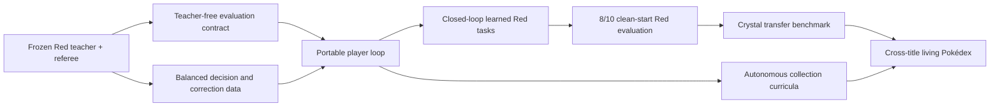

# Roadmap

> **Start with [HANDOFF.md](../HANDOFF.md).** This document is the long record: milestones, gates and
> results accumulated over the project. The handoff is what a new agent needs to be oriented today.

> **August 29 private-schedule result:** PR 101 merged as main `4190b92b` and exact-main CI
> `33268744819/1` passed. The one permitted zero-controller freezer reproduced schedule
> `35c00f38…`, sealed private plan `2a0462b8…`, and passed both immediate and independent ROM-free
> reopen validation. The plan contains 8 train lineages and 4 untouched development lineages with
> all seven portable option kinds and zero overlap. Actions, frames, claims, teachers, outcomes,
> and fits remained zero.
>
> Next: engineer and falsify a train-only claim-first selected-arm runner against that immutable
> plan. Require logical-plus-physical root protection, a durable pre-input arm commitment,
> development exclusion, no counterfactual target, and every crash cutpoint. Publish and exact-CI
> qualify it, then reorient before gameplay. Do not refreeze, recensus, or execute a scenario in
> the engineering gate. **Causal train 1/60 · powered fit 0 · authority 0 · transfer 0.** See the
> [freeze result](evidence/red-living-dex-clustered-schedule-freeze-result-v1-2026-08-29.json).

> **August 29 private-freezer qualification:** The zero-controller freezer and independent reopen
> validator are locally GO. They bind the passed 8+4 clustered schedule to exact private context,
> root, lineage, template, and Red recipe commitments, reject seven mutation classes, and pass
> **5,751 tests**, Ruff, Mypy over **313 source files**, all registries, docs, and public-artifact
> checks. No authentic plan, controller input, outcome, or fit was created.
>
> Next: publish the exact source, require green CI, run one action-free freeze and independent
> reopen, publish only the path-free aggregate, and reorient. Only then build the claim-first
> selected-arm runner; do not execute a scenario in the freeze gate. **Causal train 1/60 · powered
> fit 0 · authority 0 · transfer 0.** The
> [qualification](evidence/red-living-dex-clustered-schedule-freezer-local-qualification-v1-2026-08-29.json)
> records the exact supported and unsupported claims.

> **August 29 clustered-capacity result:** The exact action-free census passed with **8 train
> scenarios / 8 lineages** and **4 development scenarios / 4 untouched lineages**. Both sides
> cover all seven portable option kinds, maximum observed scenarios per lineage is one, overlap is
> zero, and controller/teacher/outcome/fit effects are all zero. The old 132-root deficit is a
> retired diagnostic for the discarded one-full-game-run-per-row design.
>
> Next: qualify a private freezer that reproduces schedule `35c00f38…`, persist and independently
> reopen the exact 8+4 assignments, then execute only the eight train selected arms and make the
> first non-authoritative fit. No V3 yield gate or routine replay. **Causal train 1/60 · powered
> fit 0 · authority 0 · transfer 0.** The
> [census result](evidence/red-living-dex-clustered-curriculum-census-v1-2026-08-29.json) records
> the passed gate.

> **August 29 V2-yield checkpoint:** Main `624325cf` passed CI `33232635929/1`, then its freshly
> frozen twelve-world gate stopped at **2/5** after three distinct failures made 10/12 impossible.
> Five worlds are consumed; seven unopened V2 identities are retired. The
> [terminal](evidence/red-living-dex-fresh-teacher-world-variance-yield-gate-v2-2026-08-29.json)
> records 90,565 actions, 15,824,793 frames, and zero new roots, labels, outcomes, fits, authority,
> or transfer.
>
> The bounded repair authenticates fossil reinteraction, settles delayed cave encounters before
> item facing, and avoids both observed Vermilion NPC lanes. Finish qualification and reviewer
> challenge, publish and green exact main, then freeze one genuinely new V3 12-world plan. Only a
> 10/12 pass opens train-root generation and recensus. **Causal train 1/60 · powered fit 0 ·
> authority 0 · transfer 0.**

> **August 28 world-variance checkpoint:** Published main `05ae3cce` and CI `33221693432/1`
> failed the frozen successor gate honestly at **2/5**; the third distinct failure made 10/12
> impossible, so five assignments are consumed and seven old-source assignments are unusable.
> Repairs now authenticate live battlers and captures, verify blocked steps, bound poison and
> accuracy recovery, normalize an exact reserve-led rival victory, and structurally close both
> Generation-I field-menu layers.
>
> One unchanged source bundle `7c2974ab` then reached late-Cinnabar `mansion_returned` on initial
> waits 197, 58, and 123: **3/3 · 125,932 actions · 22,345,994 frames**. The
> [V3 qualification](evidence/red-living-dex-fresh-teacher-world-variance-repair-local-qualification-v3-2026-08-28.json)
> records **5,718 tests · Mypy 309 · Ruff · registries · docs · public artifacts · diff** and zero
> learner, root, fit, authority, or transfer effects. Publish and require exact-main green CI;
> then freeze a new twelve-world one-use plan and require at least 10/12 with no repeated stage or
> leak. Only a pass opens train-only roots and recensus. **Causal train 1/60 · powered fit 0 ·
> authority 0 · transfer 0.**

> **August 28 exact-capacity checkpoint:** Published main `cb18a8b5` passed CI `33140010028/1`.
> The [action-free census](evidence/red-living-dex-causal-capacity-census-v1-2026-08-28.json)
> authenticated 67 independent lineages and 414 compatibility edges, then measured **train 54/90,
> development 63/105 in isolation, and disjoint combined 63/195**. At least 36 new compatible train
> roots and 132 new combined roots are required. One development evolve/storage/access menu has
> zero historic compatible roots, and storage pressure has only two of the required three values.
>
> Next qualify a fresh episode-lineage generator, target the scarce train templates and missing
> storage pressure, create at least 36 compatible train roots, and recensus before collecting an
> outcome. Keep development unmaterialized until train is populated and collected. A clone, copied
> save, RNG nudge, or rehash inherits its parent lineage. The census had actions, frames, claims,
> teachers, predictions, outcomes, and fits all zero. **Causal train 1/60 · powered fit 0 · authority
> 0 · transfer 0.**

> **August 27 powered-curriculum checkpoint:** The next Red learner is preregistered at **90 train
> contexts / at least 60 settled outcomes** and **105 untouched development contexts / at least 102
> complete paired comparisons**. Every incomplete comparison is scored as a candidate loss; the
> maximum-three-incomplete design retains 83.2% power. It spans seven direct living-Dex option kinds, uses a
> block-balanced three-candidate exploration schedule, and compares on the same reset against
> random, cost-only, and myopic controls. The actual Red setup feature support is rank 16; the
> guarded fit path rejects unsupported features, train/development overlap, low information, low
> success, or inadequate kind coverage before the fitter is called.
>
> The [public capacity bound](evidence/living-dex-causal-public-capacity-bound-v1-2026-08-27.json)
> is at most 67 usable historic roots. At least 23 new train roots and 128 new combined roots are
> therefore necessary, but not necessarily sufficient. Publish, run the action-free exact
> root-to-menu maximum matching, then create fresh prospectively assigned harness episodes for the
> measured deficit. Clones and RNG perturbations inherit lineage. No new outcome, fit, sealed Red,
> Crystal run, replay, authority, or transfer result exists yet. **Causal train 1/60 · authority 0
> · transfer 0.**

> **August 27 execution-reorientation checkpoint:** PR 90 passed, executable commit `6fd2286f`
> passed exact-main CI `33118840112/1`, and the frozen train campaign remains unconsumed. The
> [reorientation](evidence/red-living-dex-causal-execution-reorientation-v1-2026-08-27.json) opens
> one current-main-bound invocation and nothing else. Its terminal must be one authentic settled
> selected-arm train example or one honest target-free consumed closure. Stop after it. No
> refreeze, retry, preflight, wrapper, one-row fit, sealed Red, Crystal, promotion, or replay.
> **Causal train 0/1 · authority 0 · transfer 0.**

> **August 27 direct-consumer checkpoint:** One action-free Red train campaign is frozen and still
> unconsumed. Its direct isolated consumer now authenticates exact project source, exact successful
> CI identity, the clean PyBoy/NumPy/SDL runtime closure, the sealed producer's runtime identity,
> and the nearest private-root boundary before claim. The causal journal constructs only the
> randomly selected runtime after durable claim, commitment, selection, and construction start;
> terminal recovery constructs none. Distinct Red and Crystal semantic adapters share one
> identity-free feature contract without claiming empirical transfer.
>
> The [qualification](evidence/red-living-dex-causal-direct-consumer-local-qualification-v1-2026-08-27.json)
> records **69 focused · 5,475 repository · 299 typed source files**. Claude and Antigravity return
> publication GO; private execution remains conditional on exact-main green CI and fresh
> reorientation. Publish, verify exact main, reorient, and execute the frozen train campaign once.
> Then expand to a powered multi-kind Red causal dataset before fitting, benchmark on untouched
> Red outcomes, and only then freeze weights for a controlled Crystal transfer test. **Causal train
> remains 0/1; authority 0; transfer 0.**

> **August 27 freeze-first campaign checkpoint:** The shared causal boundary is published at main
> `74d7e7e8` with exact-main CI `33098041804/1` green. The new composition keeps the Red runtime
> absent until the generic journal has durably claimed, committed, selected, and recorded
> construction start. The separate freezer binds one eligible train root and explicit retired
> physical roots without ROM, runtime, controller, teacher, learner, model, or execution access.
>
> The [qualification](evidence/red-living-dex-causal-campaign-freeze-gate-v1-local-qualification-2026-08-27.json)
> records **140 focused · 5,441 passed repository · 296 typed source files**. Antigravity returns
> GO with P0/P1/P2 zero; Claude is usage-limited and supplies no verdict. Publish this exact gate,
> require exact-head CI, freeze exactly once only when the selected and retired identities are
> unambiguous, then reorient before execution. **Causal train remains 0/1.**

> **Previous August 27 causal-boundary checkpoint:** The V1/V2 wrapper lane is closed without retry or a
> private-cause claim. The replacement title-neutral journal and Red adapter now bind a complete
> identity-free menu to one full-support randomized selected arm, one independent outcome, and one
> crash-safe learner datum. Store substitution, logical/physical relabelling, restart meter reset,
> every durable cutpoint, early controller use, unselected construction, proof drift, observer
> effects, and title/private leakage fail closed in ROM-free tests.
>
> The [qualification](evidence/cross-title-living-dex-causal-example-pipeline-v1-local-qualification-2026-08-27.json)
> records **182 focused · 5,428 repository · 295 typed source files**. Antigravity returns GO with
> P0/P1 zero; Claude hit its session limit and supplies no verdict. Publish this exact source,
> require exact-head green CI, freeze one bounded development Red causal campaign without
> gameplay, and reorient before its one execution. Causal train remains **0/1**; Crystal schema
> parity is not Crystal transfer.

> **August 27 V1 preflight failure checkpoint:** PR 86 and exact-main CI passed, but the sole V1
> preflight failed before private access because Git authenticated only the Red package while the
> filesystem guard inspected all tracked packages. The legitimate Crystal sibling was rejected.
> The [path-free failure](evidence/red-living-dex-claim-first-one-slot-preflight-v1-failure-2026-08-27.json)
> records every protected effect at zero; V1 never retries.
>
> Publish one minimal all-tracked-`src` V2 with tracked-sibling and untracked-shadow tests, require
> exact-head CI, and run one V2 preflight. V2 failure aborts the lane; V2 success reorients directly
> to setup plus randomized outcome. No V3 or another wrapper-only session. Causal train remains
> **0/8**.
>
> The [V2 local qualification](evidence/red-living-dex-claim-first-one-slot-preflight-v2-local-qualification-2026-08-27.json)
> records **44 focused · 5,391 repository · 291 typed source files** and the real checkout's exact
> 292-file source match. Antigravity approves publication and one preflight with no P0/P1 finding;
> setup remains closed. Claude's exact-commit review awaits its CLI usage reset before merge.

> **August 27 selected-slot invocation checkpoint:** The claim-first core and its thin
> current-source Red wrapper pass **67 focused and 5,389 repository tests across 291 typed source
> files**. Preflight proves clean published source, exact push
> CI, the sealed producer/private joins, one selected state/envelope pair, and both available root
> identities while leaving ROM, claim, resolver, controller, learner, and model capabilities
> unreachable. Claude and Antigravity approve publication and one ROM-free preflight with no P0/P1
> blocker and reject private setup. See the
> [qualification](evidence/red-living-dex-claim-first-one-slot-invocation-v1-local-qualification-2026-08-27.json).
>
> Publish the exact wrapper, require exact-head successful push CI, run exactly one selected-root
> preflight, publish only a path-free structural receipt, and reorient immediately. Another
> infrastructure-only session is forbidden; next open the shortest setup-to-randomized-outcome
> sequence or abort the lane. Causal train remains **0/8**.

> **Previous August 27 claim-first core qualification checkpoint:** The title-neutral atomic pair ledger,
> deep-plan admission, one-slot Red campaign and production runtime pass **60 focused and 5,347
> repository tests across 289 typed source files**. Pair/pair and legacy/pair subprocess races,
> every recovery class, uncertain durability, causal failure metering, BaseException closure,
> provider refusal, and Red/Crystal-shaped fixtures pass. Claude and Antigravity return GO with no
> blocking finding. See the [qualification](evidence/red-living-dex-claim-first-outer-boundary-v1-local-qualification-2026-08-27.json).
>
> Publish this exact core and require exact-main CI. Then reorient and build a separately
> source-bound one-slot wrapper, qualify and rehearse it ROM-free, and stop again before private
> setup. Causal train remains **0/8**.

> **Previous August 27 claim-first outer-boundary checkpoint:** PR 83 passed CI `33058891890/1`, merged as
> main `18eea8bd`, and passed exact-main CI `33059506829/1`. The sole V2 read-only rehearsal
> succeeded. Its [path-free result](evidence/red-living-dex-setup-bridge-namespace-successor-v2-result-2026-08-27.json)
> authenticates **15 roots · 45 options · 33 families · 10 origins · 37 routed options · 7
> cartridge corridors**, with every protected effect zero. The namespace lane is closed.
>
> Next implement durable outer execution identity, atomic logical-plus-physical claims,
> authenticated recovery, deep plan reauthentication, and claim-first runtime construction.
> Concurrent duplicates and every crash cutpoint must pass ROM-free Red-shaped and Crystal-shaped
> fixtures. Publish and reorient before private setup execution; causal train remains **0/8**.

> **Previous August 27 runtime-free bridge checkpoint:** Two independent audits stopped the first green
> candidate because it eagerly executed unbound helpers, constructed emulators inside the
> no-runtime gate, and hid a production keyword mismatch behind a permissive mock. The repaired
> bridge authenticates every tracked `src/` and script byte through a standard-library-only
> pinned-base `python -I -S -B` bootstrap with no extra flags before project import, anchors the canonical receipt plus old
> package/script closure, validates import origins, verifies every static plan/cartridge/execution
> join, and rejoins fifteen exact state/envelope byte pairs without restoring a state. Its read
> lease requires pre-existing coordination metadata and is injected into the exact authenticated
> old input helper, so no nested support can create it. Exact PyBoy metadata is read without a
> global distribution scan or runtime import; hardened direct Command Line Tools Git ignores hooks,
> filesystem monitors, worktree redirection, attributes/filters from worktree, linked common dir,
> or staged index, lazy fetch, submodule descent, and ambient configuration; pinned delayed stdlib HTTPS verifies the exact CI
> workflow and refetches the final attempt. A real canonical-history probe proves the replacement
> registry/source readers are equivalent. The stdlib/native-loader closure is an explicit host TCB.
> The
> [local qualification](evidence/red-living-dex-setup-bridge-runtime-free-qualification-v1-2026-08-27.json)
> records **156 related · 5,288 full-suite tests · 285 typed source files**. Publish, require exact
> successful push CI, perform one read-only private rehearsal, and reorient. Setup stays closed
> until a separate outer execution identity, dual logical/physical claim boundary, authenticated
> recovery path, deeply immutable or reauthenticated consumer plan, and claim-first runtime factory
> are qualified.

> **Current lane:** Read the generated [active product state](../ACTIVE_PRODUCT_STATE.md). The
> active lane is `repeatable-red-living-dex-option-value-calibration-v1`. The same-root causal
> trust boundary is repaired at source `539454f3` through PR 78 and CI `33009960617/1`: exact
> restore readback, authenticated route execution, registry-built offers, comprehensive effect
> metering, typed families, complete proof joins, account-wide physical-root no-retry, and restart
> recovery are qualified. PR 80 published the authentic provider inventory, production freezer and
> exact identity composer as main `69a0c707` under exact-main CI `33031356455/1`. The freezer then
> ran once and sealed canonical plan `b555dfb6…a2bcc` under manifest `3bb93056…b4816`: **15 recipes
> / 45 offers / 33 families / 10 origins**, seven cartridge corridors and 37 routed offers, with
> every gameplay and learner effect zero. Historical catalog partitions are provenance, not the
> new prospective 10+5 labels. Next implement and attack the exact-plan setup-campaign bridge,
> rehearse its complete pre-controller boundary without a root claim or runtime, publish under
> exact-head green CI, and reorient before setup execution. After complete captures exist, collect
> at least 8 train + 4 disjoint development selected-arm outcomes, fit once on train, and report descriptive
> calibration/variance. Stop before a powered benchmark, sealed Red, Crystal, promotion, or replay.
> See [red-living-dex-same-root-setup-recipe-v1.md](red-living-dex-same-root-setup-recipe-v1.md).

> **Active strategy moved on 2026-08-14.** The current roadmap is
> [model-first-roadmap.md](model-first-roadmap.md), governed by
> [NORTH_STAR.md](../NORTH_STAR.md). The material below is retained as historical evidence. Its
> repeated full-route execution order is superseded and may not authorize another Red replay.

## Current checkpoint (2026-08-26): canonical provider plan frozen; setup bridge next

PR 80 merged as main `69a0c707006c78ae8473544f40e2bdd0a0b23f91`; both PR CI
`33030916595/1` and exact-main CI `33031356455/1` passed. The unmodified production freezer then
ran exactly once and persisted canonical private plan `b555dfb6…a2bcc` under manifest
`3bb93056…b4816`. The path-free
[result](evidence/red-living-dex-provider-plan-freeze-result-v1-2026-08-26.json) records 15 roots,
45 genuine offers, 33 semantic families, 10 physical origins, seven cartridge-derived corridors,
37 routed offers and the prospective 10+5 split. Actions, frames, provider executions, claims,
teacher queries, predictions, outcomes, learner effects and fits were all zero.

Next: build the production adapter/entrypoint that authenticates this exact plan and execution
identity into the durable same-root setup campaign. Mutation-test replacement, cross-join,
consumption, recovery and hidden-effect failures; perform only a publication-disabled
pre-controller rehearsal; publish; require exact-head green CI; then reorient. Do not claim a root,
construct a runtime, execute setup, collect an outcome or fit a model during this engineering gate.
Once setup is separately opened, capture all 15 same-root menus; then randomize selected arms,
collect at least 8 train and 4 disjoint development outcomes, fit train-only, benchmark powered
Red, and test frozen-weight transfer to Crystal. Trade and cross-version living storage remain
mission requirements.

## Current checkpoint (2026-08-16): the exact collector exists; publication is next

The catalog-wide collector now represents all fourteen frozen menus as 55 independent candidate
trials. It fixes each trainee lineage and venue for four battles, bounds every resource, durably
claims before input, retains invalid/censored terminals and forbids retries. The view-only dashboard
can follow the ledger. Focused coverage passes 221 tests, and a working-source read-only pass
reconstructed all 14/55 real bindings without controller, teacher, model or outcome access.

Next: run the complete gate and regenerate source-bound registries; publish; require exact-head
green CI; freeze one external plan; repeat the full read-only preflight under real publication/CI
guards; then seek exact owner authorization. No tracked checkpoint authorizes execution. Fit only
the eight train examples after collection and keep the six development examples untouched.
Counters remain trials 0/55, complete examples 0/14, fits 0 and authority 0.

## Current checkpoint (2026-08-16): input audit passed; collector is the active build

Separate verifier source `e849e43` passed exact CI run `31973374921` attempt 1 and reconstructed
all 14 frozen reservation/state/profile/root/menu joins read-only. The verified shape is 8 train / 6
development, 55 candidate rows, 66 features, 49 nonconstant columns and 12 distinct menus. Nineteen
focused mutations and two fully re-hashed semantic forgeries were rejected. Protected inputs were
unchanged and every answer, outcome, teacher, controller, model, sealed and Crystal counter stayed
zero.

The final readiness check found that no batch collector yet consumes this catalog. The old runner
is one historical two-choice Cinnabar probe. Because a preference label needs every available
candidate measured, the real campaign is 14 examples and 55 cloned candidate trials.

Next: implement, attack, publish and read-only preflight that 55-trial collector. Only then request
exact authorization bound to its immutable plan, published source and CI attempt. Fit only on train
and report the untouched development partition against the frozen baselines with authority still
zero. Counters are priors 2, PP states 2/2, menus 14, verified inputs 14/14, trials 0/55, complete
examples 0/14, fits 0 and authority 0.

## Current checkpoint (2026-08-16): official 8+6 inputs frozen; outcomes closed

Published source `065c68a` passed exact CI run `31969641298` attempt 1. Read-only re-inventory
preserved the 81 historical captures and added exactly the two accepted PP states. The official
catalog now binds 14 unanswered questions—8 train / 6 development, both choice kinds per partition,
candidate widths 2–6—with file SHA `2f412460…` and semantic SHA `7f955e6a…`. Typed reload and
path/target scans pass; every learning and authority counter is zero.

Next: independent input-integrity audit, then separate owner authority for 8+6 outcome collection
and one train-only fit. Do not open an answer during review. Counters are priors 2, PP states 2/2,
menus 14, outcomes 0/14, fits 0 and authority 0.

## Current checkpoint (2026-08-16): both PP states passed; publish the input freezer

Train and development each ran once under separate authorization from exact source `27e966b`, CI
run `31962598106` attempt 1 and v4 plan-file SHA `b9d1eeef…`. Both reached middle PP naturally,
passed independent reload and are consumed. The input-only catalog freezer now passes focused tests
and a real private read-only rehearsal with 14 questions, 8 train / 6 development and candidate
widths 2–6. That rehearsal is not official because its source was not yet published.

Next: publish the freezer and require exact-head green CI; repeat read-only inventory; freeze and
audit the official path-free catalog; then send it for independent input-integrity review. Do not
open teacher answers or outcomes until a later, separate authorization. Counters are priors 2, PP
states 2/2, official menus 0, outcomes 0/14, fits 0 and authority 0.

## Current checkpoint (2026-08-16): v4 is ready; ask for train once

Published `27e966b` passed CI run `31962598106`, attempt 1. Private v4 (file `b9d1eeef…`, semantic
`2ae07f3a…`) passes train and development read-only preflight. Claude independently verified every
binding and returned **APPROVE** to request one partition; the only medium regression-test gap was
closed without changing the audited runner. The active action is one exact **train** authorization.
Development stays untouched and needs a second authorization after train is durably assessed.

## Current checkpoint (2026-08-16): publish the v4 semantic lock, then audit it

V3 is retired unexecuted. The v4 candidate binds exact runner bytes, exact GitHub retry attempt,
cartridge-derived Route 11 species/level evidence and the two-prior registry into one pre-controller
gate. It raises the battle cap from 27 to 32 for five battles of headroom and extracts the live PP,
encounter, move, field-control, protected-state and terminal predicates into behavioral seams.
Focused coverage is 193/193 and the corrected mutation result is 67/67 killed.

The shortest forward sequence is:

1. **Local gates complete:** public/docs/registry/static checks and 3,792 tests pass. Publish the v4
   source.
2. Require successful pull-request `CI` for the exact published head and exact attempt.
3. Generate one new private v4 two-entry plan; run train and development only in read-only
   preflight mode.
4. Give Claude the immutable delta and adjudicate only a discriminating failure. Do not broaden
   this into another full-route audit.
5. Ask the owner for one exact partition/head/run/attempt authorization. A second partition requires
   a second authorization; any controller input consumes that identity without retry.
6. After two accepted preparations, re-inventory read-only and freeze the exact 8+6 menus. Only
   those real questions open the separate outcome-collection and first-fit gates.

Current counters remain priors 2, PP states 0/2, menus 0, outcomes 0/14, fits 0, authority 0,
sealed Red 0, Crystal 0 and replay 0. This lane is maintenance only because it directly unlocks the
first resource-pressure learner choices; it grants no learned authority by itself.

## Current checkpoint (2026-08-16): authenticate CI evidence, then rebuild the one-shot plan

The private v2 natural-PP plan is superseded without execution. Its runner accepted and recorded a
positive CI run number but did not prove that the named run was the successful pull-request `CI`
run for the exact source. The successor authenticates that evidence before output claim or
controller entry and behaviorally distinguishes every frozen source/input/output binding. Focused
coverage is 106/106; 53/53 targeted mutations are killed across CI fields, private bindings, hard
bounds, reload checks, Gen I PP arithmetic and durable protected-state fields.

Next: publish the successor; require one green exact-head CI run; regenerate the private plan as
v3 at that clean head; rerun train and development preflights without `--execute`; obtain an
independent authorization-level audit; then ask the owner for exactly one partition-specific
execution. The other partition still requires its own later authorization. Only two accepted
preparations unlock read-only re-inventory and the exact 8+6 menu freeze. Current counters remain
priors 2, PP states 0/2, menus 0, outcomes 0/14, fits 0 and authority 0.

## Current checkpoint (2026-08-16): PP preparation implemented, execution still closed

The active model-first roadmap now has the exact bridge for its two missing natural middle-PP
contexts. Read-only tooling can refresh only the one health/status-invalid development reservation,
authenticate the retained 8+6 roots against both venue priors and freeze one train plus one
development preparation. The partition-specific runner is bounded, single-use after input and
cannot heal, switch, capture, edit memory, ask a teacher/model or create a learner outcome.

Publication, exact-head CI, the one-source refresh and both read-only preflights are complete.
Next: independent review and separate owner authorization; materialize each once; re-inventory;
then freeze and review the exact fourteen menus. Counters remain priors 2, PP states 0/2, menus 0,
outcomes 0/14, fits 0 and authority 0. No full replay or Crystal case is part of this gate.

## Current checkpoint (2026-08-15): exact roots reserved, catalog still closed

Exact head `3ee15fd` passed CI run `31900603291`, and Claude killed 28/28 targeted H2/M2/L2
mutations. A repeated read-only inventory reproduced the 81-state pool and its real deficiency:
every train and development source still has high PP. The new private reservation plan
`9097f73e…` selects exactly 8 train and 6 development roots with both trainee/venue assignments,
all four completion goals, three health bins, two evolution-route kinds and unique source states.
It excludes every teacher-prior and Route 11 support identity.

The [public receipt](evidence/party-development-question-reservation-2026-08-15.json) records one
future natural PP materialization in each partition under a frozen no-label/no-prediction/no-memory-
edit protocol. It also records the honest blockers: concrete Red menus are not bound, the PP states
do not yet exist, and one qualified venue prior cannot support a genuine multi-candidate venue
question. Thus reservations are 14 but menus remain 0; outcomes 0/14; fits and authority 0.

Next: qualify the read-only Red binding/preflight adapter, separately measure and qualify one
compatible second venue, then materialize only the two reserved PP contexts. Re-inventory and
freeze the actual 8+6 candidate catalog before either reviewer permits outcome execution.

## Current checkpoint (2026-08-15): one venue prior, zero learning outcomes

Exact head `3a24a2e` passed CI run `31896779190`, and Claude's immutable cross-Python delta audit
returned **APPROVE** for exactly one private Route 11 prior. Codex composed it once from the two
authenticated V2 receipts. The
[path-free summary](evidence/red-route-11-venue-prior-composition-2026-08-15.json) records one
accepted venue, one rejected stale Cave sibling, and zero ROM reads, emulator starts, controller
actions, teacher queries or outcomes.

Priors are now 1; menus 0, outcomes 0/14, fits 0, sealed/Crystal 0, replay 0 and authority 0. Exact
source `16ed83d` closes the three remaining source conditions locally: eight module-assignment
digests, isolated PEP 695 semantic pairs and an independent attestation closure oracle. It passes
3,508 ROM-free tests and every local quality gate; source bundle `ce43f6d…`. Publish, require one
green exact-head run and obtain Claude's narrow recheck. Then search already-open non-sealed states
for depleted PP or freeze a bounded materialization plan. No execution yet.

## Current checkpoint (2026-08-15): live source closure repaired; re-approval pending

Claude's exact-`7f4d8de` audit killed 34 of 43 mutations and rejected source qualification. The
proof omitted changed candidate projectors and new choice-set helpers used by the Route 11 runtime;
it had no closure guard for implicit venue/grinding behavior and trusted two aggregate attestation
fields at the operational boundary. Exact `41f6fff` binds 43 semantic elements with seven exact
waivers, checks the recursively reachable candidate seam and re-derives all three aggregate
identities. Direct tests kill the nine previously surviving semantic cases. Python 3.11 and 3.14
produce identical element/waiver digests. The full local gate passes 3,503 tests plus Ruff, mypy,
public/documentation and generated-registry checks; source bundle
`4db4c1eefb97eaf0b740857aa81e2fd3292b82693af54877f6e9711b3e5913aa`.

Next: publish, require exact-head green CI, then Claude delta re-audit. Only an explicit approval
opens composition of one private Route 11 prior. Priors 0, menus 0, outcomes 0/14, fits 0,
sealed/Crystal 0, replay 0 and authority 0.

## Current checkpoint (2026-08-15): Route 11 evidence is machine- and interpreter-bound

Claude rejected the initial concrete prior composer despite correct ratios because its source
history, operating compatibility, stale sibling and stateless-walker claims were not independently
proved. `0d89d85` repaired those claims; approved full-history checkout `f1bb629` then exposed that
its `ast.dump` hashes differed across Python versions. Exact source `f2ecc79` uses a canonical typed
AST document, recomputes both Git bundles, compares 19 operational elements, permits exactly three
reviewed deltas, binds the result into the evidence and derives the rejected Cave sibling from its
actual trial row. The golden digest matches on Python 3.11 and 3.14. The local tree passes 3,489
tests, Ruff, mypy over 223 files and all generated registries; source bundle
`c158aaffa4906ebb77263644f421947aac3e5c1c096aae36c10b8b1be7d9c2cf`.

Next gate: exact-commit GitHub CI and Claude mutation re-audit. Only after approval may the private
Route 11 registry be composed. That advances priors from 0 to 1, not outcomes or authority. Then
solve depleted-PP diversity, freeze the authentic 8+6 catalog, review it, and only then execute.

## Current checkpoint (2026-08-15): causal party masks are frozen; the duplicate architecture gate is removed

Exact source `587fb18` passed 3,435 tests, Ruff, mypy over 222 source files and all generated-
registry checks. Every masked party candidate now carries one typed identity-free causal reason;
every available candidate carries none. The reason vector is committed into prospective
binding/catalog v5 and menu v4, so availability and explanation cannot drift after freeze. Missing
compatible venue evidence is represented as `insufficient_venue_evidence`.

The follow-up source audit corrected the prior product finding. Storage/capture capacity,
resources/currency, version/trade/external blockers and item-evolution feasibility were already
implemented at their proper goal, collection, campaign and party layers. Only the party-level mask
cause was absent. Do not build a second completion-context subsystem or flatten campaign variables
into the party ranker.

Claude's exact-commit mutation review approved source qualification and 8+6 input
materialization/freeze. It found no causal-reason drift and proved the individually surviving
availability/reason guards were redundant by removing all three together. Before freeze, every
real mask must be confirmed as missing compatible venue evidence; any other cause needs a real
producer. See the
[qualification receipt](evidence/party-development-causal-reason-qualification-2026-08-15.json).

The next gate is compatible Route 11 prior composition, depleted-PP context
discovery or prospectively bounded materialization, then exact 8+6 input-catalog freeze and review.
No outcome, fit, sealed Red/Crystal access, replay or authority is authorized.

## Current checkpoint (2026-08-15): the prospective question survives the outcome join

Exact source `85ae878` passed 3,432 tests and all local quality/privacy/generated-registry gates.
Each future party outcome now authenticates the exact preregistered feature schema, completion
objective, candidate rows and availability, semantic snapshot, source and venue/prior evidence.
The adapter rejects a typed mismatch and keeps unavailable candidates unavailable. Claude's
mutation findings on the first join are all closed, including a follow-up test pinning the frozen
feature vocabulary. Antigravity approved the hardened exact source and raised five surrounding
completion concerns. The newer checkpoint above supersedes the initial claim that all five were
absent.

The next roadmap item is intentionally not “run training.” Exact `587fb18` closes the one missing
party input while preserving the already-implemented hierarchy. Now compose path-free venue evidence, locate or
prospectively create PP-depleted non-sealed contexts, and materialize/freeze the exact
8-train/6-development catalog. Audit that concrete catalog before any candidate executes. Menus,
priors, outcomes, fit, Crystal and authority remain zero. See the
[join-hardening receipt](evidence/party-development-prospective-outcome-join-hardening-2026-08-15.json).

## Current checkpoint (2026-08-15): title-neutral inputs are source-qualified

Exact source `4b4e267` passed 3,415 tests and every local quality/privacy gate. It binds a complete
semantic snapshot, private candidate bindings, one shared venue for trainee comparisons, compatible
per-venue priors for venue comparisons, and exact snapshot/registry/source identities into the
prospective catalog. Stale evidence, prior-support reuse and cross-snapshot menus fail closed.

The next gate remains pre-data: compose a typed Route 11 prior;
leave Cave unavailable until post-repair evidence covers full training cost; locate or boundedly
materialize depleted-PP contexts; then freeze a genuine 8-train/6-development catalog. Concrete
menus, priors, outcomes, fit, Crystal and authority remain zero. See the
[path-free qualification](evidence/party-development-title-neutral-input-contract-2026-08-15.json).

## Current checkpoint (2026-08-15): the party learner now matches the completion goal

Source `42196d4` / CI `31863588955` freezes a separate completion-aware v2 representation and
outcome learner. It preserves the historical v1 score exactly at initialization, then exposes
balance, evolution, living collection, roles, survival, resources and prospective venue operating
costs. Censored/partial trials cannot become labels; ties remain soft distributions; consumed train
roots cannot be reused; and prior/update evaluation is paired on untouched development decisions.

The next gate is data design, not another convenient run. A first descriptive fit requires 8 train
and 6 development preferences with both choice kinds, at least two completion goals, a three-way
menu, health/PP/evolution diversity and frozen priors for every venue candidate. Existing Cinnabar
roots are independent in bytes but too similar in party semantics to satisfy that gate by
themselves. Inventory non-sealed checkpoints, freeze a diverse catalog, obtain Claude and
Antigravity review, then publish exact-source live collection instructions. Model fit, Red/Crystal
execution and authority remain zero at this checkpoint. See the
[path-free qualification](evidence/party-development-completion-v2-source-qualification-2026-08-15.json).

## Current checkpoint (2026-08-14): three outcome families reached; widen genuine decision coverage

The battle, navigation and party-development adapters have each reached real cartridge execution
through the title-neutral shared contract. Battle's 1/2/4 curve proved fitting but hit a 4/4
development ceiling. Navigation produced one same-destination preference (14 requests / 516 frames
over 16 / 564). Party development executed one same-evolution pair: the higher encounter
band evolved the level-22 trainee in 68 battles / 1,185,669 frames versus 103 / 1,338,952, with zero
faints. Its 42 aggregate Center calls could not prove the configured 40-trip bound, so the apparent
preference was rejected as training data. None of these results grants authority.

The narrow repair completed under exact green source. Its
[V2 result](evidence/red-party-development-outcome-result-v2-2026-08-14.json) accepted one
source-bound party target after both fresh clones evolved safely and every Center-call phase
reconciled. Lower used 10 required recoveries + cleanup; higher used 39 venue transitions + one
recovery + cleanup. The lower band finished 108,324 frames sooner despite needing 39 more battles.
This validates outcome accounting, not a party model or intrinsic band preference.

The traversal cause and source repair are now complete at exact commit `51f0912` / CI run
`31860628652`. A negative control reproduces the old Cave departure; a fresh per-run walker avoids
adapter-owned exits, fails closed on map drift and exposes identity-free reliability counters. The
[independent live qualification](evidence/red-cave-traversal-live-qualification-result-2026-08-14.json)
then recovered train slot 030 and completed 12 steps in 14 attempts with one excluded transition
and zero departures or battle commands. This adds no learner target.

Now collect party contexts varying trainee strength, health, PP, evolution distance and venue
difficulty, with train/development roots separated before outcomes. Continue level-matched
non-OHKO battles and navigation with blockers and recovery. Keep unseen lineages closed. Do not
rerun the qualification or V2, replay all of Red, scale convenient Mansion encounters, open a
sealed gate for tuning, or use Crystal as additional training data. See the active
[model-first roadmap](model-first-roadmap.md), the
[repair evidence](evidence/red-cave-traversal-reliability-repair-2026-08-14.json), and preserve the
[rejected V1 result](evidence/red-party-development-outcome-result-2026-08-14.json) unchanged.

## Superseded checkpoint (2026-08-14): prove one real learning loop, then finish three families

Claude and Antigravity's model-roadmap reviews and exact-head rechecks are closed. The final
control-sink accounting condition is repaired and the ROM-free gate passes 3,252 tests.
The Milestone 1 boundary remains exactly three single-process scenario families—navigation, battle
and party development—but their live adapters are no longer batched. Build the battle adapter first
and require one outcome-bearing learner update plus untouched-lineage result before implementing
the other two. The 600 retained disagreements inform coverage but are not training labels. The
synthetic substrate, exact live accounting, candidate-count audit, challenge-relative readiness and
bankrupt-resource contracts are implemented; real snapshot adapters and live integration are not.
Do not add workers, a fourth family or a full run first.

Crystal v2 is retired at zero access. Prospective V3 is
[`crystal-goal-manager-transfer-v3.json`](../configs/crystal-goal-manager-transfer-v3.json), SHA-256
`1df5dcff58723e75788aa1f61a86d058fd2c2fd738618f072f470f28fb5bdd6a`.
Its 54-context zero-shot paired primary endpoint has 82.3248% power at the declared useful effect;
utility additionally requires at least 27/54 and no worse accuracy than the title-neutral
highest-pressure heuristic. Twenty-seven adaptation contexts support a mandatory prior-preserving
three-label secondary analysis. It authorizes no private context access before publication and
fresh external review. Any assigned-kind/teacher-label mismatch retires the experiment without
replacement, resampling, scoring or a transfer claim.

## Superseded focus (2026-08-14): evaluate the Red learner before Crystal

The owner has frozen Crystal as the later transfer test and moved the active lane back to Red—not
to improve the deterministic route, but to establish a real learned baseline first. Four reusable
heads are fitted and authenticated: goal selection, destination ranking, battle moves, and team-
development candidate/venue ranking. Their offline evidence is frozen in
[`configs/red-player-training-v1.json`](../configs/red-player-training-v1.json) and
[`red-player-v1-training-start-2026-08-14.json`](evidence/red-player-v1-training-start-2026-08-14.json).

The first live experiment is deliberately supervised. The battle model predicts every supported
move, but the teacher checks each proposal and executes the safe answer on disagreement or low
confidence. Every such fallback becomes a private correction. The team-development model is scored
in shadow. Goal and destination heads remain offline until the online hierarchy can give them real
choices. The dashboard displays these authority boundaries alongside live game frames and exact
agreement/correction statistics.

Ordered next work:

1. Publish the Red dashboard/observer harness and pass exact-commit CI.
2. Run one clean-power Red teacher-supervised shadow evaluation through concurrent Champion and
   Hall-of-Fame verification; preserve failure and corrections without promoting either.
3. Audit disagreements, low-confidence cases, unsupported observations, team shadow accuracy,
   route completion, and observer error counts.
4. If corrections exist, refit under a new battle-model identity and repeat development shadow;
   never reinterpret the failed or corrected model as having passed.
5. Run bounded causal battle and team-development trials only after their preregistered gates pass.
6. Connect the goal manager to genuine online choice menus and the destination ranker to the shared
   capability-aware planner; fixed route dispatches do not count as learned decisions.
7. Evaluate unfamiliar Red states/timing roots, then freeze the resulting Red learner as Crystal's
   initialization. Keep Crystal at 0/18, 0/27, 0/27 and 0 predictions until that freeze.
8. Resume the paired Red-initialized versus scratch Crystal protocol. Later expand the shared
   mechanics toward breeding, trades, legendary puzzles and multi-version living-Pokédex work.

## Superseded focus (2026-08-14): falsify transfer on Crystal v2

The first genuine Red goal manager is trained and promoted to bounded live authority. Source
`74922cc` produced 81/81 successful full rehearsals, 54 train episodes and 27 development-
validation episodes. The shared-candidate model scored 54/54 and 27/27 respectively. Published
promotion source `20b77ca` then passed all 27 open validation contexts in shadow and again with
model-controlled causal authority: 27 agreements, 27 independent successes, 80,613 actions /
8,077,586 frames, minimum confidence `0.8809568117777317`, zero teacher queries, zero fallbacks and
zero episodes. The [path-free evidence](evidence/red-goal-manager-promotion-2026-08-14.json) records
the exact source, model, plan and private receipt digests. The sealed Red destination test remains
0/12 opened.

That result closes the same-context Red integration gate. It does not establish unseen-context
generalization, cross-title transfer, autonomous completion or living-Pokédex completion.

The ROM-free Crystal transfer gate is now complete. Crystal has an identity-free nine-pressure
projection, an adapter-private completion-capability vocabulary, hard capability masks, a private
binding enumerator, and bank-aware coherent party/Pokédex decoders derived from a pinned
`pret/pokecrystal` source and generated-symbol identity. Transfer fitting holds preprocessing,
examples, order, optimizer and budgets constant while comparing authenticated Red weights with an
all-zero initialization.

The canonical plan
[`crystal-goal-manager-transfer-v2.json`](../configs/crystal-goal-manager-transfer-v2.json) freezes
72 contexts: 18 zero-shot, 27 adaptation and 27 sealed test, balanced across all nine goal kinds.
Nested adaptation budgets are 9/18/27. The primary endpoint is the paired nine-example comparison;
at least six Red-initialized wins and zero losses gives exact two-sided `p = 0.03125`. Every test
prediction must be committed before any test teacher action. Plan SHA-256 is
`e07ef52b1146f4c0ee05d003eea2f10f949e41a84398bb071def37f43ebd720b`.

The owner supplied international Crystal v1.1 after the untouched v1.0 plan was frozen. With every
Crystal counter still zero, the old target was retired prospectively and v2 received fresh
experiment/slot identities, the exact v1.1 ROM pin and `pokecrystal11.sym` authority. The
non-executing entry gate now passes. A loopback-only dashboard also shows live rendered frames,
semantic party/collection state, goal pressures, decisions, confidence and experiment counters;
it exposes no controller method and the preview has executed no input.

The ROM-free control plane is also complete. Path-free catalogs enforce exact slot order,
cross-partition disjointness, genuine multiway menus, three same-menu answer reversals and broad
answer-position coverage. Adaptation fitting accepts only exact catalog-bound successful teacher
records. Prediction commitments authenticate the six fitted model identities, and sealed scoring
requires one complete digest-bound 27-outcome artifact, so partial results cannot drive stopping.

Ordered next work:

1. **Complete:** freeze Crystal observation, capability, private-binding, source and paired-fitting
   contracts with ROM-free adversarial tests.
2. **Complete:** preregister disjoint zero-shot/adaptation/sealed partitions, fixed nested budgets,
   a testable paired endpoint, prediction-before-label order and failure taxonomy.
3. **Complete:** implement canonical unlabeled catalogs, model-bound prediction commitments,
   catalog-bound adaptation admission and all-or-nothing sealed outcome scoring.
4. **Complete:** authenticate the lawful international v1.1 owner ROM and pass the non-executing
   entry gate without opening a context, running a teacher or predicting.
5. **Complete in observer preview; production wiring continues with each runner:** serve live game
   frames and identity-safe model/experiment telemetry through a view-only local dashboard.
6. **Observation and goal/navigation complete; battle next:** exact-commit source qualified one
   stable whole-state bundle, then a genuine two-option starting goal menu and source-derived
   bedroom/first-floor round trip over the shared closed-loop router. Both bindings passed the
   official unscored qualification. Add the still-missing independently verified battle choice.
7. Materialize and freeze all 72 source-bound contexts. Run the 18-context Red zero-shot probe
   before collecting any Crystal adaptation label.
8. Fit the fixed paired candidates, commit all sealed predictions, open the 27 test contexts once,
   and publish success or failure without optional stopping.
9. Only after that result, expand toward breeding, trade evolution, time-of-day encounters, version
   routing, legendary puzzles and coordinated multi-save living-Pokédex completion.

## Historical focus (2026-08-14): prove every frozen binding before recollection

The transferable goal manager—not the paused sealed destination test—is the active route to a
Pokémon-playing model. The public 81-slot campaign, nine Red providers, profile/preflight/catalog
boundary, record-before-action collector and fixed fitter already exist. Genuine counted data is
still **0/54 train and 0/27 development validation** because setup saves, read-only inspections and
uncounted rehearsals are deliberately not labels.

All nine goal families are now live-qualified end to end without consuming an episode: story,
acquisition, development, evolution, restoration, resupply, storage, recovery and exploration.
Restoration covers both finite field-item and Pokémon Center execution. The last live rehearsals
also hardened the measurement boundary: a capture requires exactly one new living specimen rather
than an ended battle; storage respects Gen I prepend order and preserves the complete collection;
and exploration requires a new observed species rather than movement alone.

The first exact-commit campaign did pass preflight and freeze all 81 contexts. Collection then
proved why that was not enough: five story episodes succeeded, but slot 006 completed its mandatory
Fisher battle, returned to Lavender Center and failed inside the selected Fuchsia binding. Its
setup had discarded the final Poké Ball, but availability checked only for the Poké Flute even
though the executor requires one retained fallback ball. That hard prerequisite is now part of
availability. The failure is immutable and excluded from imitation targets; no model has been
fitted. The old five successes remain historical rather than being reused under a replacement
source identity.

The new gate is full execution rehearsal. It loads the exact frozen state, question, candidate
order and binding manifest; executes the selected skill; requires its independent verifier to
succeed; checks real action accounting and protected inputs; and cannot open an episode or write a
label. A replacement `story-funded` context moves TM34 liquidation into uncounted cartridge setup,
leaving the Fuchsia skill with proved money, a free bag slot and its retained Poké Ball.

That first replacement then passed 81/81 fresh preflights, but the freezer rejected the aggregate
because slots 005 and 006 still encoded the same policy context. The sale changed cartridge bytes,
not identity-free manager evidence. The repair keeps that rejection and derives a real development
delta instead: use the funded state's Rare Candy on its fully evolved lead, prove exactly one lead
level and one consumed item, and preserve every other protected field. A no-save live check has
proved the level-39-to-40 mechanic; official materialization waits for publication and green CI.

Published `64fc42c` then materialized that slot, passed 81/81 preflight and froze a fully unique
catalog. Full execution rehearsal passed story slots 001–006 and stopped at slot 007. Collision-
aware movement repaired a swallowed Celadon Mart stair input; the next diagnostic reached Silph
and proved the level-39 three-member party underpowered. Consuming its existing Rare Candy produced
a level-40 input that completed Silph in 6,209 actions / 1,922,436 frames. Slot 009 already passes
unchanged. The current source repair applies the same exact development setup to slots 007 and 008.

Ordered next work:

1. **Complete:** qualify all nine goal families and construct 81 distinct semantic contexts with
   28 multiway train choices, three same-menu reversals and all nine answer positions.
2. **Complete:** regenerate against `4207981`, pass 81/81 read-only preflights and freeze the exact
   path-free catalog.
3. **Complete, negative result preserved:** start collection once; authenticate slots 001–005 and
   retain slot 006's failed one-shot episode. Do not reuse or retry those identities.
4. **Complete:** publish the full-execution rehearsal gate, the Fuchsia hard-input boundary and
   `story-funded`; pass the complete ROM-free gate and exact-commit CI.
5. **Failed safely:** the funded replacement and fresh 81/81 preflights reached freeze, which
   rejected the duplicated slot-005/006 policy context without creating a catalog.
6. **Complete, superseded by rehearsal evidence:** publish `story-developed`, materialize slot 006,
   pass 81/81 preflight and freeze a unique `64fc42c` catalog.
7. **Failed safely at slot 007:** slots 001–006 fully executed; preserve the failure and supersede
   the catalog after repairing Celadon Mart movement and the weak pre-Silph validation inputs.
8. **In progress:** publish the verified-movement and Saffron level-40 setup, pass CI, materialize
   slots 007–008, then rerun all 81 preflights and refreeze under the new source identity.
9. Run the exact batch in `rehearse` mode. Require 81/81 selected bindings to execute and verify
   with zero episodes; repair/refreeze on any failure.
10. Only after step 9, collect all 81 new one-shot episodes, strictly reload the admitted
   train/development dataset and fit the first Red goal-manager model. Compare all frozen baselines,
   then proceed through shadow, causal Red authority and the Crystal transfer benchmark.

## Current focus (2026-08-13): requalify the hardest sealed-adapter relocation

The non-test campaign is complete. All 36 counted learning scenarios were executed exactly once:
24 train and 12 validation, with one successful destination choice per episode, 36 unique policy
contexts, no partition overlap and no admitted failure. Validation contains eight disagreements
with the unique cheapest-route baseline, so model development passed its preregistered admission
gate. Test remains **0/12 opened**.

Claude's pre-test audit correctly stopped the first destination ranker. The validation-selected
eight-unit MLP had roughly 753 fitted parameters for 24 training examples. It remains preserved as
a superseded development candidate.

The capacity repair is complete. A deterministic five-coefficient linear scorer is now selected by
training-only leave-one-out evaluation and a one-standard-error simplicity rule. Validation is not
accepted by the selector. After selection, development validation is 10/12 versus 4/12 for route
cost, with paired wins/losses 6/0 and exact p = 0.03125. This is development evidence, not a final
claim.

Claude also found that deliberate cost-baseline challenges were generated only in validation. A
ROM-free audit confirms the 12 test rows declare zero challenges. Ten public test frontiers are
structurally eligible for a local non-teacher alternative, but no private capture, route cost,
episode or model prediction has been opened. The original test design is therefore blocked.

A first replacement evaluation plan assigned new case identities, preregistered all ten eligible
challenge hypotheses and declared conservative handling of ties, unavailable candidates, failures,
interruptions, omissions and reruns. Claude approved the model and mechanics, then found that its
all-twelve primary paired test mixed in two asymmetric non-challenge cases. Before any private
access, the plan was amended: the ten challenges are the primary endpoint, all-twelve accuracy is
mandatory, and the other two cases form a separate safety gate. Claude approved that amendment and
corrected the realistic power estimate to roughly 42–68% under an 85% challenge-validity
assumption. The public executor/scorer core and prediction-first cartridge boundary are now
implemented under a schema-v9 plan. The adapter uses a path-free digest catalog, accepts only the
exact frozen linear scorer, and exposes unlabeled identity-free candidate rows.

Self-audit found that ten challenge origins differ from their source snapshot origins. The adapter
now authenticates the source state after claim, relocates without a label, rejects any objective
delta and plans candidates only after authenticating the declared challenge origin. Claude then
killed 18/18 semantic mutations and approved live qualification, but found that bare evidence
digests could not distinguish favorable and unfavorable receipts.

Schema v7 repaired that human-memory dependency. Typed canonical receipts bind an allowlisted
verdict to the exact evaluation, plan, source bundle, full source commit and evidence. Only
`approved_for_authorization` plus a `passed` non-test qualification with zero test cases opened can
enter owner authorization or runtime preflight. The non-test command shares the production
authentication/relocation/planning path, accepts one explicitly named learning capture, refuses the
test partition before input access, runs no teacher and verifies no state or ROM-adjacent change.
Published `b640ecb` passed that path from Celadon to Saffron. Claude's authorization audit then found
that two public sealed cases require Saffron to Cinnabar through Surf, which remained unqualified.

The explicit scenario-046 train capture exposed a real defect before Surf: a south-facing ordinary
warp into the Viridian Forest north gate settled one tile beyond the decoded destination. The
attempt ran no teacher, changed no capture or ROM-adjacent artifact and opened no test case. Schema
v8 generalized the measured doorway settlement and ensured future expected live failures write a
path-free typed `failed` receipt and exit nonzero. Published `b82d290` then failed safely on the
same route, showing that the extra destination step depends on the paired destination trigger, that
Viridian Forest's bottom gate needs a second outward input, and that Route 21 source water can map
to unusable Cinnabar coordinates. Schema v9 derives all three decisions from cartridge-backed graph
semantics. Its public train rehearsal completed the full route with 550 acknowledged steps, nine
interruptions, zero replans and both candidates available. The exact plan is 13,979 bytes with
SHA-256 `40b7daff70127f8df53ad73db79eea97ad7408a6152647418a0105c4ea1a6138`.
Test remains **0/12 opened**; no real catalog or owner authorization exists.

Ordered next work:

1. **Complete:** Claude independently approved the linear model, training-only leave-one-out
   selector, one-standard-error rule and conservative one-shot mechanics. Test stayed sealed.
2. **Complete:** Claude approved the amended challenge-only primary endpoint, all-case descriptive
   endpoint and two-case safety endpoint. Nineteen semantic mutations were killed without using the
   whole-plan digest assertion as the oracle.
3. **Complete:** the ROM-free sealed state machine requires preflight
   identity checks before case one, durable claim before private access, prediction commitment
   before teacher action, fixed order, crash consumption, no reopening and final-only scoring.
4. **Complete:** implement the strict catalog/parser/opener, prediction adapter and PyBoy session
   behind that state machine. Candidate ordering is source-bound and the model input contains no
   teacher label, destination identity or map identity.
5. **Complete in ROM-free fixtures; live qualification pending:** authenticate the source frontier,
   relocate challenges to a different region already authenticated by the completed frontier,
   reject any objective delta, then plan every candidate. The 36 non-test public shapes and
   synthetic cleanup/failure paths pass.
6. **Complete for schema v6:** Claude independently killed 18/18 adapter and optional-stopping
   mutations, found no answer leakage, approved live qualification and explicitly withheld
   authorization because receipt verdicts were not parsed.
7. **Complete and live-qualified on one relocation:** schema v7 added typed external-audit and non-test
   qualification receipts with explicit verdict, plan, source-bundle, full-commit and evidence
   binding. Published `b640ecb` passed Celadon-to-Saffron; authorization construction, parsing and
   preflight reject valid unfavorable receipts.
8. **Complete, failure preserved:** Claude's authorization audit identified the missing hard route.
   Scenario 046 reproduced Saffron-to-Cinnabar without test access and failed at the measured Route
   2 doorway settlement before Surf.
9. **Complete and published:** schema v8 repaired the first directional-warp mismatch and added
   durable typed negative evidence. Exact-commit CI passed; the hard qualification then returned a
   valid `failed` receipt with zero test access instead of disguising the remaining route defects.
10. **Complete in source and public rehearsal:** schema v9 distinguishes automatic destination
    triggers from directional ones, requires the bottom-boundary outward input and validates each
    connection on the destination graph in the preserved traversal mode. Scenario 046 reached
    Cinnabar and planned 2/2 candidates without a teacher.
11. Publish exact v9 and require green CI. Rerun the official scenario-046 qualifier and preserve
    its path-free typed receipt externally. Then obtain a final independent authorization audit;
    only a favorable exact-v9 receipt may precede catalog custody and owner authorization.
11. Independently attack that exact commit and live evidence using the
   [directional-warp repair handoff](claude-sealed-directional-warp-repair-audit-handoff-2026-08-13.md).
   Only a typed `approved_for_authorization` verdict can satisfy the next gate.
12. Obtain a custodian-supplied canonical path-free manifest for the twelve test captures. Do not
   add private-storage enumeration to the sealed code and do not treat later evaluation authority
   as retroactive inventory permission.
13. Only after those gates and explicit owner authorization, measure the frozen baseline capability
   and run the one-shot model comparison. Publish every result, favorable, unfavorable, failed or
   inconclusive.
14. Only after offline test, add shadow execution in live strategic choices. The deterministic
   teacher retains authority until shadow evidence passes; model-controlled route selection is a
   later causal gate.
15. Expand context semantics before cross-title transfer. The current 36 examples all express the
   same broad story-advance need and the same safe-overworld origin tags, so those feature columns
   are correctly zero-weighted. Crystal must add varied needs—collection, healing, evolution,
   training and recovery—not merely repeat Red's story sequence.

## Current focus (2026-08-12): teach alternate valid story orders

Scenario 019 is now exact and has completed its official uncounted rehearsal. Published `31d4fd2`
qualified Fly as a construction-only resource; published `3a07158` added bounded resource
relocation and a pre-Surf Silph move lineage. Gold Teeth, Strength and Koga then completed without
Surf, Silph added the last objective, and construction returned to Celadon. The rehearsal selected
Surf from three candidates and completed 620 movements with zero interruptions, replans or movement
labels. The curriculum-order audit now reports **2**, not 21, incompatible learning frontiers.

Current measured coverage is **76 authenticated envelopes, 43 distinct frontiers and 24 exact
learning scenarios**: sixteen train and eight validation. Scenarios 003, 007, 011, 015, 019 and 023
qualify all six preregistered validation cost-baseline challenges. Counted collection remains 0/0 and all
12 test situations remain sealed. Scenario 005 is also newly constructed and qualified. Exact
receipts and the current state review are in the
[August 12 audit](current-audit-2026-08-12.md).
The [paired capability receipt](evidence/strategic-validation-cost-baseline-capability-audit-2026-08-12.json)
records six unique cost-baseline disagreements and a best-case exact p-value of 0.03125; it does
not claim that a model has been trained or evaluated.

The remaining challenge contexts cannot be truthfully constructed by replaying the canonical
teacher order. The executable [curriculum-order audit](evidence/strategic-curriculum-order-audit-2026-08-12.json)
finds 2 of 36 learning frontiers whose exact objective set conflicts with the operational
prerequisites of a currently qualified skill. This is a teacher-coverage gap, not a cartridge
impossibility.

The ordered gates are:

1. publish the cartridge gatehouse repairs, qualification receipts and order audit, then require
   green exact-commit CI;
2. **complete:** qualify early Erika, Erika after Strength, and the post-Erika Ice Beam Tower
   lineage; scenarios 009, 010, 014 and 023 are exact and rehearsed;
3. **complete:** qualify Fly, Gold Teeth/Strength without Surf, Koga-before-Surf and pre-Surf Silph;
4. **complete:** construct and rehearse validation scenario 019 exactly once. The paired
   six-challenge capability audit now passes at best-case exact p = 0.03125;
5. **complete:** construct and rehearse scenario 037 from the post-Silph Surf bridge;
6. **complete:** Jolteon and Snorlax are authenticated construction-only members; the pre-Surf
   Sabrina lineage is qualified and scenario 013 is exact and rehearsed;
7. **complete:** Cinnabar-before-Sabrina and the no-label Saffron-guard resource compose into exact
   scenario 041. Its rehearsal chose Saffron over Secret Key, acknowledged 690 movements, resumed
   14 wild battles and replanned once. All four guard houses now share the observed access flag and
   inert outdoor warp records are rejected from the executable graph;
8. **complete:** construct and rehearse scenario 042 by adding an independent X Accuracy resource
   and `obtain_secret_key` from the qualified exact scenario-041 Cinnabar frontier. Its rehearsal
   selected Saffron over Blaine and completed 690 movements through 10 wild interruptions;
9. **complete:** route-materialize scenario 045 and qualify the late full-bag Silph lineage for
   scenario 046; both exact train contexts are rehearsed with zero movement labels;
10. continue all remaining non-test contexts until the 24-train/12-validation diversity gate is
   actually measured; and
11. only then open counted collection, freeze normalization, train the shared candidate scorer and
   evaluate once on the 12 still-sealed test contexts.

The [current inventory](evidence/strategic-frontier-inventory-2026-08-12.json) reports 12 missing
learning scenarios. Its logical one-skill list remains a graph-difference report, not a claim that
the corresponding live teacher skill is available.

## Previous focus (2026-08-11): build a context-diverse strategic benchmark

The repaired 703,275-record rehearsal is qualified, but counted collection is paused before the new
train root 01. Exact historical measurement found only three candidate-order-invariant contexts in
nine successful train rows. The proposed validation set would repeat those contexts twice, so it
cannot test unseen-choice generalization or establish superiority to the 2/3 cost baseline.

The new item 0 is the [experiment-design audit](strategic-experiment-design-audit-2026-08-11.md):

1. add permutation-invariant policy-context fingerprints and fail any exact train/validation
   context overlap;
2. preregister a context/scenario split rather than counting repeated full-game rows as new
   strategic situations;
3. expand real objective boundaries to three-to-five genuine candidates where possible;
4. reach at least 24 distinct train, 12 validation and 12 sealed-test contexts, including at least
   six preregistered validation contexts where teacher and cost-only baseline disagree;
5. use exact paired evaluation on unique held-out contexts, with confidence intervals and explicit
   clustering of timing replicates; and
6. collect these as short authenticated scenario episodes, retaining full clean-power games for
   end-to-end causal qualification.

Only after an uncounted learning-scenario rehearsal proves those gates may counted strategic
scenarios open. The 12 test situations remain sealed until final evaluation; rehearsing them would
contradict that claim. The earlier 5-train/2-validation full-game registry remains a preserved
protocol artifact, not an authorized collection plan.

Implementation status:

1. **Complete:** permutation-invariant context/target fingerprints, unique-context counts,
   train/validation overlap rejection and conflicting-target rejection.
2. **Complete:** paired unique-context cost-baseline capability audit. At least six validation
   disagreements are mandatory; five fails even for a perfect scorer.
3. **Complete:** graph inventory. The source contains 166 dependency-reachable states, 129 branch
   states, 14 branch states on the qualified route and only three currently instrumented live
   choices.
4. **Complete:** canonical v2 scenario registry with 24 train, 12 validation and 12 sealed test
   situations across twelve teacher objectives. Twenty-seven situations contain three to five
   genuine graph-legal candidates; no unreachable filler was added to the 21 binary frontiers.
5. **Complete and live-qualified once:** each rehearsal assignment binds one non-test scenario
   to the exact registry row, committed source/execution, private checkpoint envelope and state
   digest. The one-shot recorder writes the choice before movement, permits one outcome, and
   immediately reloads the sealed artifact to require exactly one successful decision. Scenario
   001 now supplies one authenticated, unassigned context: Bill cost 144 versus Misty cost 15,
   143/143 movements, five handled trainer engagements and zero replans. Its earlier unsafe-fork
   failure is retained beside the corrected success in the
   [qualification receipt](evidence/strategic-scenario-001-rehearsal-qualification-2026-08-11.json).
6. **Complete:** the authenticated
   post-Hideout capture exactly matches scenario 007, but its first read-only preflight found Erika
   unavailable because a static graph could not compose Cut. The new staged plan reaches the tree,
   emits one same-coordinate field action and crosses only the predicted cartridge replacement.
   Published source `926587e` passed CI; the official preflight then planned Fuji at cost 178,
   Erika at 104 with one `cut:down`, and Saffron at 33. The one-shot uncounted episode selected
   Fuji, acknowledged 174/174 movements, handled one trainer engagement and strictly reloaded one
   successful three-way context with zero replans. The Cut route was preflighted but not selected;
   live Cut execution remains established by the separate repeated-Cut proof.
7. **Complete:** scenario 002's two authenticated envelopes replay the
   teacher through Bill and return to a ready Cerulean hub with exactly scenario 002's eight-objective
   frontier. Its official read-only preflight under `72ce90e` planned Misty at cost 15 but failed
   before episode creation because the static map treated Cerulean's post-Bill police officer as a
   permanent blocker. Published source `a546d79` derives the officer's displacement at `(12,27)`
   from the durable Bill event, keeps the other officer blocked and passed exact-commit CI. Official
   preflight then planned Misty at cost 15 and Vermilion at 205. The one-shot episode selected Misty,
   acknowledged 14/14 movements and strictly reloaded one success with no interruption or replan.
8. **Capture inventory:** 22 admitted authenticated envelopes cover exact frontiers for scenarios
   001, 002, 003 and 007. Materialize the other 32 learning boundaries using the
   shared-prerequisite rule, then
   audit all 36 for unique live inputs and the six validation baseline disagreements. Keep all 12
   test situations sealed until final evaluation.
9. **Complete and live-qualified:** a bounded scenario materializer can derive the five
   registry transitions that add exactly one live-observable navigation objective. It rejects an
   approach unless its complete quest contract equals the destination map's observed location and
   that map belongs to the target scenario origin. It also requires an exact source capture,
   all-candidate preflight, stable target state, exact target frontier and a new private output;
   it creates no episode. Published source `e4a817c` passed CI. Its scenario 002 → 003 attempt then
   entered the robbed house and exposed top-return trigger and arrival differences. Later attempts
   exposed Cerulean Rocket's custom pre-battle movement latch, the bottom Underground Path exit's
   separate outward input and a non-portable generated checkpoint ID. Published source `a3598a2`
   passed CI, enforced the portable envelope identity at production and completed scenario 002 →
   003 with 199/199 movements, four handled interruptions and zero replans. Scenario 003 then
   selected Misty at cost 152 over Cut at 58, acknowledged 148/148 movements and strictly reloaded
   one unassigned success. It is one of two measured validation cost-baseline disagreements.
10. **Implemented; live qualification pending:** add the complementary bounded-skill materializer.
    It may use an authenticated pre-registry teacher capture as construction input without opening
    that source as a scenario, but it executes exactly one registered skill and admits output only
    when fresh observation equals a declared non-test target frontier and origin. First publish the
    source, then derive validation scenario 043 with `reach_saffron` from the existing post-Erika
    Celadon capture and scenario 047 with `liberate_silph` from 043. Preflight and rehearse each once
    without opening counted collection. This should raise measured coverage from four to six live
   contexts if both cartridge runs pass; it does not satisfy any of the four still-missing
    cost-baseline challenge measurements.
11. **Scenario 043 construction passed; preflight repair implemented:** the live Saffron capture
    was exact, but preflight correctly rejected the branch because the static router retained the
    pre-rescue Silph security guard forever. Cartridge data and the live state localized the sole
    disconnecting coordinate. The replacement rule now requires both Mr. Fuji rescue flags before
    opening that coordinate and leaves the sleeping Rocket's adjacent coordinate blocked. Live
    diagnostic planning exposed both declared choices (Silph cost 36, Cinnabar cost 856). Published
    source passed CI, and the uncounted teacher then completed all 35 Silph-approach movements with
    no interruption or replan. Measured coverage is five live contexts / zero counted rows.
12. **Scenario 047 constructed; preflight repair implemented:** the bounded Silph skill completed in
    4,969 actions / 1,674,353 frames and admitted the exact 24-objective target. Preflight localized
    another stale static object: Giovanni's defeat hides the Rocket below Saffron Gym. The router
    now opens only that coordinate when the observed victory flag is set. Live diagnostic planning
    exposes Sabrina at cost 68 and Cinnabar at 856. Publish, pass CI, then repeat the still-unconsumed
    047 preflight and execute one uncounted rehearsal if ready.
13. **Scenario 047 qualified:** published source passed CI, both choices remained executable, and the
    teacher completed all 67 Sabrina-approach movements with no interruption or replan. The strict
    reload produced one unassigned success and no movement labels. Measured coverage is now six live
    contexts / zero counted rows; scenarios 043 and 047 are context-density evidence, not
    preregistered challenge rows. The measured challenge counter is 2/6 because both scenarios 003
    and 007 reject their unique cost-only minima.
14. **Inventory measured and refreshed:** 25 authenticated envelopes contain 19 unique envelope
    frontiers and seven exact learning scenarios; 29 remain. The logical one-skill scan now reports
    ten targets, but intentionally does not claim live skill availability or target origin.
    Scenario 006 has been re-authenticated and qualified. The explicit bounded post-skill relocation
    seam is implemented for a future compatible source whose skill terminal differs from the target
    origin. The paper-matched sources for 009/010 still fail live skill availability, so relocation
    alone does not construct them. This inventory opens no test scenario and reports no private path
    or capture identity.
15. **Implemented; live qualification pending:** add a no-action capture authenticator for states
    whose old envelope is semantically behind their current location. It may re-envelope scenario
    006 only if fresh observation already equals all 14 objectives and the Celadon origin; it cannot
    move, select a candidate, create an episode or access test.
16. **Scenario 006 authenticated; first rehearsal failed immutably; repair gated locally:** fresh
    observation admitted the exact 14-objective Celadon frontier and all three candidate approaches
    preflighted. The selected Hideout approach crossed into Game Corner, then failed after 30
    recorded movements because map-local object/hazard projection ran against the transition's
    not-ready coordinates. The observer now returns the transient state without reading those
    map-local structures until input is ready. The failed assignment remains a censored diagnostic,
    not a training context. Publish the repaired source, require green exact-commit CI, and only
    then use the new source-bound rehearsal identity.
17. **Transition repair proven; interaction-only trainer distinction implemented:** published
    source `889bc5b` passed CI, and the next one-shot recorded both the transient Game Corner state
    and its correct settled `(15,17)` boundary. It then found that the poster Rocket has a trainer
    object bit but no line-of-sight header. The decoder now distinguishes a genuinely absent table
    from a referenced malformed one; only the latter is corruption. Preserve the second failed
    assignment without an outcome, publish and gate this narrower repair, then preflight a fresh
    source-bound identity.
18. **Scenario 006 qualified; post-skill relocation implemented:** published source `6a62e61`
    passed CI and the third assignment completed 29/29 movements with two waits, no interruption or
    replan, and one strict three-candidate choice/outcome join. Inventory is now 25 envelopes, 19
    unique frontiers, seven exact learning scenarios and 29 missing. The skill materializer can now
    explicitly relocate a stable skill terminal to the target's declared origin using the same
    cartridge route, field-action, interruption and replanning contracts; it still writes no
    episode or label and admits output only after exact fresh frontier/origin checks. Publish and
    gate before live use. Before revisiting 009/010, obtain a compatible authenticated source or
    implement a narrower truthful skill; their current paper matches are unavailable live.
19. **Audit repair implemented:** construction now latches semantic progress after every skill and
    relocation input, not only at the terminal. A route that crosses an unplanned objective region
    therefore produces an extra fact and fails the exact target frontier instead of silently
    omitting it. The next constructor work is availability-aware: split canonical chapter skills
    whose operational preconditions are stricter than the quest graph's legal counterfactual
    frontiers, beginning with early Saffron access needed by validation scenario 015.

See the [registry audit](strategic-scenario-registry-audit-2026-08-11.md). The immutable design
receipt still reports zero because it describes the prospective registry, not later measurements.
Measured evidence now contains four authenticated uncounted contexts and zero counted rows.
`collection_open` remains false and prospective rows do not satisfy the admission gate by
themselves. See the
[scenario-002 receipt](evidence/strategic-scenario-002-rehearsal-qualification-2026-08-11.json) and
[scenario-003 receipt](evidence/strategic-scenario-003-rehearsal-qualification-2026-08-11.json).

## Qualified repair checkpoint (2026-08-11): attempts 1–6 and rehearsal

Attempts 1–6 have now run once under frozen source `5a8617e`. Three train roots completed and
authenticated, two train roots failed, and the first validation root completed the game but failed
closed during final recording promotion. The resulting old-source dataset has nine successful
strategic examples, balanced answer positions (`{0: 5, 1: 4}`) and a non-perfect route-cost
baseline (6/9), but **zero promoted validation examples**. It is useful experiment evidence, not an
admitted model-development dataset. Test remains sealed.

The failure clusters are now repaired at their shared boundaries: Diglett capture uses a bounded,
Ground-safe weakening action before ball expenditure, and a fresh battle-runtime entry can roll a
stale observer intent left by an external capture/training exit. Because both are executable-source
changes, the old campaign is retired and the registries have new identities.

Ordered gates from here:

1. **Completed:** pass the complete ROM-free gate, publish repair `5ba39cf` and require green exact-commit CI.
2. **Completed:** execute only uncounted rehearsal assignment `0450466c244197e95c41d3163b7ac8f1a56e835c1c99c91bf24cc671b6c6eb84` from clean power. It reached 312/312, 36/36 and Hall of Fame.
3. **Completed:** strictly reload the completed rehearsal. Manifest `df58b5536ce70f6e57ba0ac190d33787cc6fad278f2b6124a1a079c7f33fee79` contains 703,275 records, three successful strategic joins, one trainer interruption and no recording loss.
4. **Superseded by the experiment-design audit above:** do not execute these repeated learning roots. Replace the campaign with context-disjoint scenario assignments while keeping all five test roots sealed.
5. Audit lineage separation, semantic coverage, answer-position balance, route-cost/shape baselines, interruptions, failures and censoring before selecting features.
6. Freeze normalization and train the first permutation-equivariant candidate scorer. Compare against cost-only and shape baselines, then require shadow and bounded causal evaluation without a teacher fallback hiding disagreements.
7. Expand strategic density and completion authority: generated story routing, recovery/resupply, party construction, acquisition/storage/evolution/trade scheduling and a living-Pokédex curriculum.
8. Add a thin Crystal adapter and run preregistered Red-frozen zero-shot, fixed few-shot and from-scratch comparisons before authoring a full Gen II teacher.

The repaired full-game rehearsal is qualified, but the old 5-train/2-validation design is retired.
The nearest honest milestone is now **materializing the next missing learning frontier**, prioritizing
the other four validation baseline-challenge contexts, followed
by the complete 36-situation learning capture inventory. That inventory must prove the prospective
train/validation situations become distinct live policy inputs with at least six measured
validation baseline disagreements. The first strategic model follows one-attempt counted scenario
collection and its admission audit; the 12 test situations stay sealed until final evaluation.

## Previous focus (2026-08-11): collect genuine strategic navigation lineages

The game-neutral route executor is implemented and live-qualified at source `6b2cf65`. It requires
exact acknowledgement after every movement, tolerates Gen I's staggered map/coordinate transition,
bounds readiness and unchanged-state retries, delegates typed interruptions, accumulates newly
discovered blockers and requests a replacement plan. No route-specific direction string exists in
the executor.

Two source-bound routes now exercise that contract. The 86-step Center control authenticated three
natural Route 1 wild encounters with zero movement retry or replan. The Mart probe began with a
disclosed two-input artificial block, changed its Pallet connection after replanning, then naturally
encountered Route 1's moving youngster and replanned again before entering the Mart. It acknowledged
108 movements from 112 requests and authenticated one wild encounter. See the
[control receipt](evidence/pallet-viridian-composed-route-probe-2026-08-10.json) and
[replanning receipt](evidence/pallet-viridian-mart-closed-loop-replan-probe-2026-08-10.json).

Surf is now the third clean source-bound route proof. Capability requires the Soul Badge, a complete
party observation and a living move holder. The local search operates on `(coordinate, mode)` state,
the title adapter compiles the semantic field action through bounded live menus, and RAM at
`wWalkBikeSurfState` acknowledges board, travel and disembark transitions. From an authenticated
post-Blaine state, cartridge data exited Cinnabar Center, chose a target with two genuine water
travel edges, boarded at `(13, 11)`, reached `(16, 11)`, and returned to `(12, 11)` in land mode.
The probe also corrected two false assumptions exposed only by live play: boundary returns require
one action after reaching their warp coordinate, and one-frame controller pulses can phase-lock
between Red's joypad polls. See the
[Surf receipt](evidence/cinnabar-cartridge-surf-route-probe-2026-08-10.json).

Direct visible occupancy is now closed at clean source `1c6eb31`. The Gen I adapter projects
currently rendered non-player sprite slots into the neutral traversal snapshot, and the executor
uses that overlay as a temporary replan constraint before sending an ordinary walk. An adversarial
Cinnabar route intentionally left all ROM object positions unblocked; live RAM exposed the
stationary `(6,14)` NPC from `(6,15)`, caused one zero-input replan, and the route reached `(6,13)`
before returning to `(12,11)`. All 43 movements were acknowledged from 43 requests. See the
[visible-object receipt](evidence/cinnabar-visible-object-route-probe-2026-08-10.json).

Cut is now closed across repeated mutations at clean source `b449caf`. The planner walks only to a candidate stance; the
Generation I adapter requires a Cascade Badge, living Cut holder, exact live block/tile mutation
and restored input. Terrain is rebuilt from the reread RAM grid before every next selection or
crossing. The repeated Celadon probe observed distinct blocks `$35 → $4C` and `$32 → $6D`, crossed
former trees `(20,47)` and `(32,35)`, acknowledged 110/110 route movements and returned to Center
`(3,3)`. No predicted continuation became execution authority and no durable Cut edge was added.
See the [repeated Cut receipt](evidence/celadon-repeated-cut-route-probe-2026-08-11.json).

Strength is now live-qualified across the full Victory Road puzzle chain at clean executable source
`8dbee6f`. Five bounded searches explored 44,525 states and acknowledged 247/247 derived
transitions: 189 walks, 57 pushes and one cross-floor drop. Map toggle flags now distinguish
off-screen from absent objects, so hidden 2F boulder 13 does not enter the first search, 3F boulder
10 disappears at the hole, and the returned object appears on 2F. Immediate dust plus the exact
settled state acknowledges 3F pushes even though that room consumes the persistent pushed flag.
See the [full Strength receipt](evidence/victory-road-strength-chain-probe-2026-08-10.json).

Trainer sight is now live-qualified at corrected source `95e8b82`. Cartridge object events provide
trainer identity/position/facing, trainer headers provide view range and defeated event, and current
sprite RAM may override facing only while rendered. Active sight lanes are temporary semantic
hazards, not occupied tiles; a triggered walk-up is separately typed as `trainer_engagement`. The
adversarial 1F proof began with a 50-step candidate crossing male trainer squares `(4,3)` and
`(3,3)`. At `(5,3)` it sent zero inputs toward the first hazard, replanned once to a five-step safe
suffix, acknowledged 50/50 movements and reached `(1,2)` with no engagement, battle, wait or save
write. See the [trainer-sight receipt](evidence/victory-road-trainer-sight-route-probe-2026-08-10.json).

The first closed/open story passage is now live-qualified at source `40a05d1`. Exact directed
edges across Route 7's Saffron guard house require the opaque fact `story:saffron_guards_open`.
Before the guard receives Fresh Water, static terrain still offers a five-step corridor, but the
observed closed flag and an unknown observation both make it unavailable with zero generated
inputs. After the handoff sets RAM bit `$40`, generated plans cross the same graph in both
directions, leave to Route 7 and enter Saffron City. All 11/11 generated movements were
acknowledged with no interruption or replan. The first attempt also corrected horizontal return
geometry: pass-through gates settle on the outside warp, unlike vertical door walk-outs. See the
[story-gate receipt](evidence/saffron-story-gate-route-probe-2026-08-10.json).

Resource renewal and the two open Victory Road room transitions are now live-qualified at source
bundle `2c31afaf`. The neutral executor observes remaining effect plus carried renewals and records a
typed receipt; the Red adapter treats unknown as unavailable, settles the expiry prompt, consumes
exactly one item and proves counter/inventory/control state. The 51-step 1F→2F and 56-step 2F→3F
routes are now composed from each floor's live post-switch terrain and exact warp geometry. All
107/107 route movements were acknowledged; trainer sight caused one safe replan. The authored
14-step expiry setup is gone: Max Repel naturally reached zero inside the 3F Strength search at
`(1,9)`, renewed to 250 from the final carried item, and resumed. All five phases passed with 267
derived puzzle steps and 65 pushes/drop receipts. See the
[composed resource receipt](evidence/victory-road-composed-resource-chain-probe-2026-08-10.json).

Joint macro/local pricing is now closed at source `758ab6d`. The search state carries map, exact
coordinate, locomotion mode and retained outside map; every connection endpoint remains available
until downstream local cost is known. Batched multi-target local searches made the real-cartridge
search practical. On both Red and Blue, topology alone selected an uncomposable direct Route
2→Pewter border, while the joint planner derived the south gate→Viridian Forest→north gate route
at combined cost 317 with 314 acknowledgement contracts. See the
[joint pricing audit](evidence/joint-route-pricing-audit-2026-08-11.json). It is static route
evidence, not live completion-run authority.

The ordinary retail acquisition graph is now cartridge-complete at source `7fb928b`. Wild tables,
fishing, evolution and in-game trades are joined to 30 scripted opportunities per title: starters,
direct gifts, Dojo choices, fossils, Game Corner prizes and fixed encounters. Red and Blue each
reach 135 species alone and 139 with a trade partner; the remaining gaps are the other title's
eleven exclusives, four trade evolutions without a partner, and unobtainable Mew. Choice groups
remain explicit, so existential reach is not confused with one-save coexistence. See the
[acquisition audit](evidence/acquisition-routes-2026-08-11.json).

Strategic navigation now has a durable, fail-closed data seam at source `f43219d`, hardened at
`bcd9935`. A teacher or future model chooses among at least two semantic destinations; the
deterministic planner retains exact directions. The model-facing view contains a reviewed
cross-title tag vocabulary, candidate
availability and route costs, but no map ids, coordinates, destination names or arrow labels.
Every decision must join to exactly one outcome. Only successful deterministic-teacher choices can
become imitation targets; successful learned actions and route failures remain outcome evidence,
and external power loss remains censored rather than being rerun or mislabeled. Whole-lineage split
audits, authenticated private trajectory loading, semantic outcome retention, coverage summaries,
and route-cost/shape baselines are implemented. The honest dataset count is still **zero collected
train/validation strategic decisions**. Three unassigned live calibrations now prove the binding
seam. The first offered two safe hubs at costs 15/87 and reached home after 14/14 acknowledged
movements. The second offered Koga's Gym (`challenge`) and the Warden/Strength objective
(`acquire_resource`) at costs 21/24; qualified completion order selected the Gym and reached it
after 20/20 acknowledged movements with zero replans. The third started after the Celadon Hideout,
offered the story-critical Pokémon Tower at cost 178 and optional Eevee at cost 60, rejected the
minimum-cost choice and reached Tower 1F after 174/174 acknowledged movements. The executor crossed
nine maps, handled one unavoidable Route 8 trainer engagement and used zero replans. See the
[safe-hub receipt](evidence/pallet-strategic-safe-hub-route-probe-2026-08-11.json) and
[genuine-branch receipt](evidence/fuchsia-strategic-objective-route-probe-2026-08-11.json), plus the
[non-cost receipt](evidence/celadon-strategic-objective-route-probe-2026-08-11.json) and its
[six-attempt failure lineage](evidence/celadon-strategic-objective-route-failures-2026-08-11.json).
All are promotion-ineligible development calibrations, and the numeric feature schema is
deliberately not frozen.

Whole-root preassignment is now closed. The canonical
[collection registry](../configs/red-strategic-navigation-collection-v1.json) fixes five train,
two validation and five sealed test roots plus one uncounted rehearsal before any outcome is
observed. Each root has a distinct 74-battle timing schedule and an assignment derived from the
registry, source bundle, teacher execution and partition. Counted decision binding no longer
accepts arbitrary `train`/`validation` strings; the exact committed assignment must match episode,
lineage, partition, actor and policy. Train remains 0/5, validation 0/2 and sealed test 0/5.

The rehearsal is now a first-class assignment too, not merely a declared seed. Its content-derived
episode and lineage remain `unassigned`, its attempt is explicitly uncounted, and a counted
assignment cannot impersonate it. The trajectory observer records the strategic choice before the
first route action, allows one pending choice, then requires exactly one matching outcome. This
preserves failed and power-interrupted attempts instead of reconstructing only successes later.

The matching output gate is now implemented too. A counted episode header must reproduce the
assignment's exact collection, source bundle, source commit, split, actor and policy identity before
its decision/outcome stream can load. Local-only assignments, drifted metadata and test episodes
opened through the normal learning path fail closed. This completes the prospective data-integrity
shell.

The first full-teacher bridge is now complete. Only an exact strategic assignment activates it.
After Hideout, the teacher records the Tower-versus-Eevee choice before movement, executes the
bound generated Tower approach, consumes a measured success or typed failure, and then resumes the
existing Tower interior. Ordinary runs retain the authored approach. The CLI exposes the bridge
only as the committed, explicitly uncounted `record --strategic-rehearsal` lane. A private
captured-state preflight then completed the generated approach plus all 28 Tower checkpoints and
ten required battles with one joined strategic decision/outcome and zero recording failures. That
preflight is not a clean-power root or dataset row.

The first published command found a separate harness defect before emulator startup: the derived
episode name exceeded the private store's 80-character safety limit. No artifact or game outcome
was created. Counted and rehearsal names are now both 78 characters, the protocol enforces that
ceiling, and a regression crosses the real private writer boundary before another publication.

The next published source reached clean power under the exact `1710001` schedule and failed at
checkpoint 16/312, before any strategic decision. Its retained uncounted episode contains 2,086
records but no strategic row: the mandatory Bug Catcher survived the prescribed sequence with 6/27
HP after Tackle reached zero, and the generic finisher kept selecting the exhausted move. The repair
now selects a usable move on every actionable menu turn, keeps victory dialogue separate, and
accepts a living status-free party for the HP-preserving transit to Pewter's mandatory heal. The
exact failed schedule now clears checkpoint 17 in an in-memory diagnostic. The failed source-bound
episode stays failed; source regeneration creates a distinct repaired rehearsal identity.

That repaired identity passed Forest and Brock, then failed at checkpoint 23 during Route 3 trainer
1, still before the strategic decision. Its 3,472-record partial is retained. The trace shows the
teacher spending its only surplus Potion after the trainer's second Pokémon, protecting the twelve
required route Potions, and then using Tackle until Squirtle reached 0 HP with the final opponent at
2 HP; Bubble remained at 30 PP. The exact-schedule counterfactual clears checkpoint 24 when trainer
1 joins the Bubble policy already used by every other required Route 3 trainer. The next prospective
rehearsal identity includes that repair.

Published source `c1e5d11` proved both repairs, all four required Route 3 trainers and Mt. Moon
entry before the third source-bound rehearsal failed at checkpoint 28. The 5,301-record partial is
retained and still contains zero strategic decisions. Its trace shows that the exact level-seven
Zubat appeared on the return half of the reversible search and was automatically fled because only
the outbound half checked the target predicate. The symmetric search now observes both directions
after a one-frame encounter-settle wait. An exact-schedule in-memory replay passed the full cave
and Cerulean boundary, then exposed a wall collision used as an implicit timing wait on the next
Center route. Removing that collision and acknowledging every real movement carried the diagnostic
through checkpoint 275 and 1,250 balanced-team battles. It was deliberately stopped and is not a
completed rehearsal or training record.

That long route also corrected the traversal substrate rather than hiding exceptions in a Python
route. Six tunnel entrances now derive retained outside-map context from bounded cartridge scripts
that write `wLastMap`. Ledge transients survive composition. Story requirements are applied before
candidate selection. A narrow Generation I interruption handler can resolve an unavoidable trainer
battle from live move/PP/type/Disable state, settle defeated-trainer field dialogue and return
control to the same route binding. It receives no chapter or trainer answer key; broader menus and
scripts remain unsupported.

This closes one real story predicate and the named Victory Road resource/inter-room gaps, not every
Kanto script or all travel to Indigo. Special scripted trainer-like objects remain separate and the
completion teacher's post-final-switch exit remains authored. The ordered gates are now. Steps
1–4 passed for source `0640743`; adding the official counted launcher changed executable source,
so its regenerated rehearsal must repeat step 2 before step 5:

1. Publish the bidirectional Zubat search and acknowledged Cerulean handoff with regenerated
   registries, then require a fresh green CI run for that commit.
2. Execute only the repaired source's regenerated rehearsal identity under schedule `1710001`.
   Preserve all three failed partials if it fails again; never overwrite an identity, edit source during
   execution, or open train/validation/test to debug it.
3. Load a completed rehearsal through the assigned-episode gate and audit its join, candidate
   coverage, interruption evidence, cost baseline and candidate-shape baseline.
4. **Completed:** expand to three genuine choices per root (Tower/Eevee, Koga/Warden and
   Dojo/Sabrina), permute candidate order from assignment identity, and verify the cost baseline is
   not perfect.
5. If rehearsal coverage is adequate, execute the five train and two validation roots once. Keep
   the five test roots sealed and preserve failures or external censoring exactly as observed.
6. Freeze numeric normalization only after the observed train/validation coverage audit. Train a
   shared candidate scorer, compare it to the cost and shape baselines, then require fresh shadow
   and bounded causal trials with no disagreement fallback.
7. Close broader completion routing: non-trainer menu/script recovery, more story/special-object
   predicates, the post-final-switch Indigo route and systematic decoder/composer mutation scores.
8. Add Crystal's thin adapter and run the preregistered Red-frozen zero-shot, fixed few-shot and
   from-scratch comparison before expanding a full Gen II teacher script.

The full reasoning, risks and admission criteria are in the
[current audit](current-audit-2026-08-11.md). None of this opens v95; counted v95 remains 0/10.

## Current focus (2026-08-10)

### Close the optional-loss branch before opening v95

The complete six-role stack has now passed one derived-timing clean start. Uncounted seed `990026`
completed 74/74 scheduled battles and all 36 observed objectives through Hall of Fame with 3,165
high-level battle decisions, 3,110 learned move decisions, 12/12 learned target bindings, both
training heads in live authority, and zero battle-teacher query or fallback. The exact receipt is
[perturbation 12](evidence/portable-clean-start-six-role-perturbation-12-qualification-2026-08-10.json).
Counted v95 remains 0/10.

Fresh seed `990027` then lost the lab rival before any learned head acted. The published teacher now
authenticates that legal outcome, preserves it after mutable battle RAM changes, and recovers the
starter from level five to level six. Clean published `c2aeb12` then adapts the Forest suffix to the
loss branch, completes two more lessons, and fails at 171,585 frames because no safe
level-four-or-lower third Weedle appears within the bounded single-origin search. Diagnosis shows
that a level-three Caterpie is safe but slightly short of Bubble, a level-five Weedle reaches Bubble
at only 3/25 HP while poisoned, and Tail Whip cannot save PP against Harden. See
[perturbation 13](evidence/portable-clean-start-six-role-perturbation-13-failure-2026-08-10.json).

The ordered gates are now:

1. Move only the authenticated-loss catch-up lessons to Route 1's lower-defense Pidgey/Rattata
   venue; preserve the victory branch byte-for-byte.
2. Prove a bounded Viridian Center visit restores HP, status, and PP and returns to the exact route
   gate, then reuse the unchanged three-Kakuna Forest curriculum from the healed semantic floor.
3. Pass public-artifact/docs/registry checks, Ruff, mypy, and the full test suite; commit and push the
   exact source before emulator qualification.
4. Replay `990027` without monkeypatching until it passes or produces a later causal failure.
5. Use at least one fresh uncounted timing root after the repaired `990027` pass.
6. Freeze source, runtime, objective graph, schedule, and all six model identities. Only then open
   the ten-root v95 campaign; require at least eight valid successes with no source/model changes.
7. After Red reliability closes, run the already-defined Crystal transfer probes before deciding
   how much Gen II teacher scripting is actually necessary.

The selected feature-v5 control head uses calibration power `0.20`: 99.1677% ordinary and 96.7996%
balanced validation accuracy. It was selected by live causal performance, not maximum top-line
accuracy. The power `0.10` candidate scored higher ordinary accuracy but failed Koga's setup lesson;
power `0.25` failed Route 24 recovery availability.

## Current focus (2026-08-09)

### Superseding battle-control checkpoint

The authenticated runtime seam is now implemented and the exact frozen target has been privately
published. The [sanitized artifact receipt](evidence/battle-switch-target-runtime-artifact-2026-08-09.json)
binds its `bd1ba4…` canonical payload and manifest `6ec25dd…` to the feature schema, three training
lineages, one validation lineage, and the separate
17/17 seed-990007 prospective test. Its loader rejects symlinks, undeclared files, noncanonical
JSONL, digest changes, overlapping lineage identities, and any test result below perfect. The clean
start harness can first shadow target choices, then conduct an explicitly uncounted isolated causal
trial in which the teacher still decides *when* to switch and the learned head decides only *which
living reserve* receives that request. Shadow and causal-trial authority are distinct from
deployment authority. Canonical shadow seed `990009` completed all 36 objectives with 13/13 target
agreement, 95.66% mean confidence, and no unavailable projection. Isolated causal seed `990010`
then completed Hall of Fame in the identical 45,819,749 frames with 13/13 target rebindings and no
target fallback. The [runtime qualification](evidence/battle-switch-target-canonical-runtime-qualification-2026-08-09.json)
closes target binding under that narrow authority; it does not claim teacher-free battle control.

The first six-role composition forbade all teacher battle queries and executed objective, training,
move, high-level control, and target models together. Seed `990011` failed closed at S.S. Anne after
158 battle decisions, seven learned HP recoveries, and two learned switches. The wrapper matched a
complete learned HP request, then mistakenly demanded the teacher-only request subclass. The
[failure receipt](evidence/portable-clean-start-six-role-rehearsal-01-failure-2026-08-09.json)
preserves the result. The repair accepts only an executable lead target and preserves the chapter's
bounded item, exact-heal, item-ledger, and MAIN-menu proofs. Fresh seed `990012` qualified that
boundary and advanced to the pre-Mart Route 11 supply Gambler, where a static intent advertised HP
and status cures that the live protected inventory could not spend. The
[second failure](evidence/portable-clean-start-six-role-rehearsal-02-failure-2026-08-09.json) is
preserved. Recovery capabilities now derive before every runtime dispatch from live inventory,
protected status-item floors, and remaining HP allowance. The immediate gate is full ROM-free
validation, clean push, and one fresh uncounted six-role replay; v95 remains 0/10.

Seed `990013` then qualified both boundaries and defeated Lorelei after 3,265 teacher-free battle
decisions. The target head rebound all 13 switches with zero fallback, training control owned
64,337 choices, and the trainee/venue model owned 125,800. The chapter verifier still rejected the
win because attacks occurred at 59 HP below Lorelei's existing 70-HP floor. The
[third failure](evidence/portable-clean-start-six-role-rehearsal-03-failure-2026-08-09.json) is
preserved. `BattleIntent` now exposes that floor, the action-class head ranks only live executable
affordances, and clean-start report v2 requires positive high-level, complete no-fallback
switch-target, and both training authorities.

Seed `990014` qualified the repair and defeated Lorelei, Bruno, and Agatha before entering Lance's
room. Its 3,286 battle decisions included 51 typed requests, zero teacher/safety/low-confidence
fallback, and 21/21 learned switch bindings; both training heads retained full execution authority.
The [fourth failure](evidence/portable-clean-start-six-role-rehearsal-04-failure-2026-08-09.json)
records why this still is not terminal evidence: Agatha's receipt misclassified one valid learned
pivot as a fixed teacher-role choice even though its independent specialist lesson already passed.
The receipt now verifies target-slot identity rather than teacher equality. The immediate gate is a
full clean validation, push, and fresh canonical seed `990015`.

That gate passed. Seed `990015` completed all 36 objectives and Hall of Fame with 3,315 battle
decisions, 21/21 learned target rebindings, 64,337 training-control choices, 125,800 trainee/venue
choices, and zero battle-teacher query or fallback. The
[canonical qualification](evidence/portable-clean-start-six-role-canonical-qualification-2026-08-09.json)
closes the combined canonical gate. Derived-timing seed `990016` then failed before model battle
authority at the lab rival. Direct reproduction showed battle result zero, the event set, and a
legal level-6 23/23 HP Squirtle; the verifier hard-coded the canonical 21-HP DV result and its old
dialogue cap stopped before script 18 released controls. The
[perturbation failure](evidence/portable-clean-start-six-role-perturbation-01-failure-2026-08-09.json)
is preserved. The repaired gate accepts only the legal 21–23 max-HP range while keeping the event,
result, map, script, species, level, live-HP, and control proofs, with a 96-pulse cap. A fresh
uncounted perturbation is now the immediate gate; v95 remains 0/10.

Seed `990017` passed the repaired lab-rival boundary and then encountered a normal wild Pokémon on
Route 1 northbound step 2. The deterministic corridor still required zero encounters and failed
before model battle authority. The
[second perturbation failure](evidence/portable-clean-start-six-role-perturbation-02-failure-2026-08-09.json)
is preserved. Route 1 now has a bounded eight-flee round-trip allowance with explicit opponent,
coordinate, HP, RUN-attempt, control, party, level, max-HP, PP, and status evidence. The next gate
remains one fresh complete uncounted perturbation; v95 remains 0/10.

Seed `990018` accepted two verified flees but then missed the exact Viridian entrance. Direct
reproduction localized the defect to the battle-exit handoff: the first ready observation still
preceded stable overworld input, so route actions could be swallowed without an immediate error.
Adding only a 120-frame stabilization reached the exact gate and then exposed Pewter's separate
zero-wild Route 1 corridor. The
[third perturbation failure](evidence/portable-clean-start-six-role-perturbation-03-failure-2026-08-09.json)
is preserved. One shared primitive now handles both chapters, rereads and verifies the protected
state after the stabilization interval, records that interval in each receipt, and retains the
eight-encounter and sixteen-RUN-attempt bounds. The 2,165-test ROM-free gate plus Ruff, mypy,
documentation, public-artifact, and registry checks passes. A clean push and fresh uncounted
perturbation remain the immediate gate; v95 remains 0/10.

Seed `990019` showed that time alone is not acknowledgement. Five stabilized flee receipts passed,
but one later MOVE was ignored and the fixed sequence stopped at Route 1 `(11,1)`, one tile short.
The [fourth perturbation failure](evidence/portable-clean-start-six-role-perturbation-04-failure-2026-08-09.json)
is preserved. A causal wrapper reached Viridian with one retry. The implementation now verifies
directional coordinate progress or a map transition after every requested step, retries only an
otherwise unchanged protected Route 1 boundary under an eight-attempt/24-frame bound, and publishes
the retry count. The 2,167-test ROM-free gate plus Ruff, mypy, documentation, public-artifact, and
registry checks passes. A clean push and another fresh perturbation are the immediate gate; v95
remains 0/10.
The public-artifact, docs, regenerated-registry, Ruff, mypy, and 2,186-test ROM-free gate passes;
commit and push remain before replay.

Seed `990020` reached the closed-loop gate and produced a wild encounter at the unchanged pre-step
coordinate. The verifier correctly refused to count the north movement but initially rejected the
ordinary encounter. The
[fifth perturbation failure](evidence/portable-clean-start-six-role-perturbation-05-failure-2026-08-09.json)
is preserved. The helper now requires the unchanged party/level/HP/max-HP/PP/status boundary,
performs the authenticated flee, counts a movement retry, and reissues the same direction under the
existing ceiling. The 2,168-test ROM-free gate plus Ruff, mypy, docs, public-artifact, and registry
checks passes. A clean push and fresh perturbation remain immediate; v95 is 0/10.

Seed `990021` then stopped before the bedroom: its 124-frame initial perturbation changed which
front-end inputs were consumed, so the fixed title/menu script ended outside the running game.
The [sixth perturbation failure](evidence/portable-clean-start-six-role-perturbation-06-failure-2026-08-09.json)
is preserved. The opening gate now uses at most 32 state-checked inputs in a repeating
`Start,A,A,A` pattern, waits without input if the clean bedroom is still settling, and accepts only
the exact bedroom coordinate plus input-ready semantic state. The same failed root recovered in 18
inputs plus one input-free settling wait and obtained Squirtle. The public-artifact, docs,
regenerated-registry, Ruff, mypy, and 2,180-test ROM-free gate passes. Commit, push, and use a fresh
uncounted perturbation; v95 remains 0/10.

Fresh seed `990022` qualified the recovered front end and then found an unexpected battle on Route
2 forest-gate step 25 before any learned battle or training decision. The
[seventh perturbation failure](evidence/portable-clean-start-six-role-perturbation-07-failure-2026-08-09.json)
is preserved. The authenticated wild-exit traversal now takes an explicit expected map; only the
43-step Route 2 corridor opts into four finite flees, eight movement attempts, 24-frame retry waits,
and 120-frame stabilized exits. Trainer battles, wrong maps, state drift, and budget exhaustion
remain fatal. Regenerate, qualify, push, and use another fresh root; v95 remains 0/10.
The public-artifact, docs, regenerated-registry, Ruff, mypy, and 2,181-test ROM-free gate passes;
commit and push remain before replay.

Seed `990025` then stopped at Route 1 step 36, north from `(14,14)`, after eight unchanged attempts.
The [tenth perturbation failure](evidence/portable-clean-start-six-role-perturbation-10-failure-2026-08-09.json)
connects this to the already source-known wandering youngster crossing in the later collection
controller. Only that exact gate may step east, wait under 24 attempts, restore, and cross north;
each sub-step retains the shared flee receipt. Regenerate, qualify, push, and use a fresh root; v95
remains 0/10.

Seed `990026` qualified the shared walker and completed all three exact Kakuna lessons plus the
mandatory Bug Catcher, then failed the aggregate Brock-readiness resource gate. A same-root probe
localized the miss to poison `0x08` at level 9, 19/27 HP, and 26 Bubble PP. Transit now accepts only
healthy or poisoned state behind the same 19-HP/four-Bubble-PP floor, takes the direct 15-input
Pewter Center route, proves full recovery, then reapplies the Brock gate at the Gym. Its first
replay advanced to the Forest north-gate checkpoint and exposed the same healthy-only rule in the
independent progress referee. Only the three post-Forest boundaries leading to the Center may now
carry poison; the Gym remains healthy-only. The
[eleventh perturbation failure](evidence/portable-clean-start-six-role-perturbation-11-failure-2026-08-09.json)
is preserved. The measured Center-to-Gym route then crossed Brock, but the same root reached the
first Route 3 recovery walk at only 10/35 HP with poison and fainted at Pewter `(19,22)`. Move the
guaranteed PC Potion withdrawal to the first Pewter Center visit, consume exactly that Potion after
trainer zero, restore the original four-Potion Cerulean purchase, and preserve the six-Potion
post-rival floor. That replay crossed the return, then trainer one's second opponent trapped the
13/35-HP lead under repeated Wrap until it fainted. Add one bounded in-battle Potion decision at a
verified MAIN boundary, protect a floor of twelve, accept the resulting 16–18 pre-rival window,
regenerate, pass the full ROM-free gate, push, and causally replay `990026` before assigning another
root. The 2,198-test gate is green; counted v95 remains 0/10.
Replay 16 proved the heal and then exhausted the finisher bound because MAIN returned with `ITEM`
selected. Post-item `FIGHT` restoration now passes the 2,198-test gate; push and repeat the exact
root before any new seed.
Replay 17 qualified that handoff and all four required Route 3 trainers, then met an ordinary wild
on east-route step seven. Reuse the shared bounded flee traversal, publish its receipts/retries,
pass the full gate, push, and repeat the same root. The 2,198-test gate is green.
Replay 18 qualified Route 3, then the fixed Mt. Moon Zubat wait produced no encounter. Replace it
with a finite species-and-level search on a reversible edge, retain sole-ball and route-rejoin
proofs, publish search receipts, pass the gate, push, and repeat `990026`. The 2,198-test gate is
green.
Replay 19 qualified that exact level-seven Zubat search, sole-ball capture, and `(14,31)` route
rejoin. An ordinary wild then interrupted a later 1F route before TM01 step 10. The next unit of
work is one cumulative, report-visible incidental-wild ledger across all Mt. Moon 1F/B1F/B2F
segments, item detours, and return paths, followed by the full gate and the same `990026` replay.
Commit `7052b03` implemented that ledger. Replay 20 recorded sixteen first-attempt, zero-attrition
flees and reached the required Rocket, where the final Zubat survived at 6 HP. Commit `fd6da86`
taught the already-collected TM01 before the battle without changing the economy; replay 21 won but
the fixed post-KO CANCEL schedule also declined Squirtle's level-16 evolution. Replace that count
with semantic switch-prompt/evolution handling, then repeat `990026`. Do not spend a fresh root or
open counted v95; it remains 0/10.

Seed `990024` qualified incidental Forest travel but the fixed first-Kakuna frame wait produced no
battle. The [ninth perturbation failure](evidence/portable-clean-start-six-role-perturbation-09-failure-2026-08-09.json)
is preserved. Each lesson now semantically seeks observed Kakuna `0x71` under a 64-cycle bound,
returns after empty grass, spends the shared Forest budget on authenticated non-target flees, and
completes a deferred step if the target began before movement. Regenerate, qualify, push, and use a
fresh root; v95 remains 0/10.
The public-artifact, docs, regenerated-registry, Ruff, mypy, and 2,185-test ROM-free gate passes;
commit and push remain before replay.

Seed `990023` qualified the Route 2 repair and then hit an incidental Forest battle at training
route step 65, before the first intentionally seeded Kakuna. The
[eighth perturbation failure](evidence/portable-clean-start-six-role-perturbation-08-failure-2026-08-09.json)
is preserved. Forest travel now accumulates authenticated incidental flees across every segment
under one twelve-encounter budget; the three Kakuna lessons and mandatory Bug Catcher retain
separate fight contracts. Lower and upper Route 2 likewise share one eight-flee budget. Regenerate,
qualify, push, and use a fresh root; v95 remains 0/10.
The public-artifact, docs, regenerated-registry, Ruff, mypy, and 2,182-test ROM-free gate passes;
commit and push remain before replay.

The same audit repaired the campaign layer needed for later living-Pokédex work. Generation I's
Red/Blue reciprocal version gaps now come from one canonical table and include the previously
omitted Pinsir and Scyther. Trading requires an explicit compatibility edge between saves; merely
running two vessels no longer invents trade evolutions. Encounter conditions now flow through
venue selection, candidate projection, and live binding, so a future Crystal day table cannot be
selected at night. These changes deliberately preceded artifact publication and any new emulator
evidence.

The reserve-aware lane has advanced beyond the single-lineage diagnostic described below. Three
complete feature-v3 lineages now exist. A replacement model trained on whole lineages 01 and 03 and
held out lineage 02 scores **98.2394% accuracy / 94.7537% balanced accuracy**, compared with
98.0154% / 90.3798% for the prior candidate. The newest teacher lineage independently completed
312/312 checkpoints, Hall of Fame, 1,800 development battles, and an observed-role-derived
seven-switch Agatha lesson.

The same frozen replacement candidate has progressed under causal high-level authority through five
successively preserved failures:

- checkpoint 109: switched before a declared lead-role move;
- checkpoint 300: attacked once while paralyzed at Lorelei; and
- checkpoint 306: defeated Agatha but let recovery satisfy a weak switch-residency check, producing
  zero specialist attacks and zero required setup boosts; and
- checkpoint 306 again: completed every specialist role and used the setup, but one statused attack
  preceded an extra Blastoise excursion, producing four switches for three role transitions; and
- checkpoint 306 again: passed setup, status safety, residency, and exactly three role transitions,
  but a hand-written target scorer bound Golbat to Blastoise instead of Jolteon after the model
  requested a switch.

The repairs are typed, title-neutral intent constraints rather than route exceptions: real
move-count residency, status clearance before dispatch, and a bounded pre-attack setup. The fifth
failure revealed a different ownership problem: switch timing was learned, while target binding was
still deterministic.

Commit `93faeed` adds an offline permutation-equivariant target head and whole-lineage audit. It
fits 28/28 explicit targets from lineages 01 and 03 and scores 11/13 on untouched lineage 02, up
from the deterministic resolver's 10/13. It still misses the held-out Agatha Golbat target, so its
summary deliberately says `deployment_authority: false`. The next dependency is additional
timing/RNG-varied full teacher lineages and an unopened target test split—not another full causal
replay and not a weight tweak to the old scorer. Counted v95 remains 0/10.

Fresh timing seed 990003 then reached checkpoint 275 before a third legal Drowzee sleep
reapplication exceeded team training's generic bound. The failed private artifact is retained with
469 labels excluded from fitting. Route 11 now carries its previously tested four-reapplication
bound through a venue-specific battle-timing field; the global default remains two. Fresh seed
990004 qualified that repair, completed the 51/52/52/55/51/51 development curriculum and Blaine,
then stopped at checkpoint 284 because legal opponent-inflicted poison violated an overstrict
Viridian trainer receipt despite exact party, move-policy, and survival evidence. Its 3,123 partial
labels are also excluded. The receipt now separates opponent status RNG from controlled choices,
while the immediate pre-Giovanni Center recovery remains explicit and fail-closed. Use fresh seed
990005 after the gate and push.

Seed 990005 completed 312/312 checkpoints and Hall of Fame with 3,166 labels, 13 explicit switch
targets, and a 60/55/55/55/55/55 final-form team after 1,808 development battles. The first frozen
target head scored 11/13 against this new lineage while the deterministic resolver scored 9/13;
both misses remained concentrated at Bruno and Agatha. The lineage was then opened as development
data. Equal-total battle-plan weighting plus L2 0.003 produced a two-unit candidate that scores
54/54 across the four opened leave-one-lineage-out folds and 13/13 on the existing validation
lineage. These are development metrics. Seed 990006 was opened once but stopped at checkpoint 275
after 1,500 safe training wins because the old 1,250-trip recovery cap expired with four members at
55 and two at 54. It emitted no Bruno/Agatha target test rows, so its partial labels are excluded
and the candidate remains untested. Commit `edfa676` preserves the 90% retreat rule while raising
the finite measured envelope to 2,000 trips. Fresh seed 990007 then crossed the old failure point,
completed training, and produced a task-complete target prefix through an Agatha win. The exact
frozen candidate passed 17/17 with 0.07965 cross-entropy versus 12/17 for the baseline, including
Bruno 2/2 and Agatha 7/7. The route stopped at 306/312 because the terminal receipt inferred only
five role changes from move turns while seven valid switches had executed between opponent changes.
Commit `a5e92f0` records and verifies those live switches directly. Runtime artifact and binding
code and exact private publication are complete; canonical shadow and isolated causal completion
have now passed. Seed `990014` qualified HP-floor/action-mask/report-v2 execution through an Agatha
win, then exposed the autonomous-switch receipt ambiguity. The active gate is the repaired
seed-`990015` canonical replay.

After the learned target passes offline and causal Red gates, then one canonical and one uncounted
perturbation result, begin Crystal's bounded battle adapter.
Do not build the complete Crystal route first. Compare frozen-Red zero-shot, preregistered few-shot,
and from-scratch learning on the same examples before deciding whether a full Gen II teacher is
worth the route cost.

The clean-start infrastructure gap is closed. One uncounted baseline selected 21 composite
objectives, verified 15 automatic cartridge effects, and reached Hall of Fame with no expected
objective label, fixed dispatch, or fallback. The source/model/root-bound ten-run registry and
independent 8-of-10 checker also exist. No counted v95 root has been opened.

The strict four-model rehearsal exposed the new bottleneck. It completed 16 composite objectives,
trained a healthy 63/55/55/55/55/55 party, and defeated Lorelei with 3,220 learned move decisions
and zero teacher query or fallback. It then failed the curriculum contract because all 19 Lorelei
attack turns came from slot 1 and the model made zero role switches. This is a correct rejection,
not a route regression. See the
[five-role rehearsal audit](evidence/portable-clean-start-five-role-rehearsal-2026-08-08.json).

Battle-control schema v2 cannot express the teacher's balanced-team lesson: it sees the active
Pokémon and aggregate reserve readiness, but not reserve types, moves, or candidate-relative
matchup advantage. Generic switch targeting also chooses a healthy high-level reserve without
semantic matchup scoring. The dependency-ordered work is now:

1. add portable reserve offensive and defensive matchup observations — **implemented as feature
   schema v3**;
2. make generic switch targeting rank safe reserves by matchup value — **implemented with a 50%
   HP floor and separate target metrics**;
3. collect fresh balanced-role demonstrations and train a new battle-control artifact — **three
   uncounted 312/312-checkpoint lineages are complete; the action-class candidate improved to
   98.2394% / 94.7537% held-out accuracy/balance, while a separate target head improved 10/13 to
   11/13 but remains unpromoted**;
4. pass held-out, counterfactual, and strict canonical five-role gates;
5. repair or bound the lab-rival, Diglett-capture, and Rocket-thief perturbation failures;
6. freeze and execute the ten counted roots sequentially; and
7. use the resulting stable Red benchmark for Crystal transfer and learned navigation.

Do not weaken the Lorelei verifier and do not spend counted roots on the old artifact. The updated
[readiness audit](evidence/clean-start-learned-stack-readiness-audit-2026-08-08.json) distinguishes
infrastructure readiness from model-stack readiness.

The bounded [Crystal transfer benchmark](crystal-transfer-benchmark.md) follows a qualified Red v3
artifact. It deliberately starts with one battle, one local navigation task, and one training
choice; a complete Crystal teacher is not a prerequisite for learning whether the abstractions
transfer.

Historical curriculum priorities were:

**A. Make the team participate.** The level floor is proven in a real clean-power budget. Lorelei,
Bruno, and Agatha now have qualified species- and matchup-aware roles. Agatha no longer uses
Blastoise at all: Jolteon handles Golbat and Dugtrio handles both Gengar opponents, Haunter, and
Arbok.
Whole-League participation is 4/6 with a 70.59% busiest-member share. Extend genuine roles rather
than adding switches for the metric.

**B. Make participation measurable, and embarrassing when absent.** Done across all five League
chapters. The first measurement exposed `[49, 0, 0, 0, 0, 0]`; the three qualified lessons now reach
`[24, 0, 4, 0, 5, 1]`. Lorelei, Bruno, and Agatha require their real switches and complete role
target sets as part of the chapter pass contracts.

**C. Start the living Pokédex.** `red_target(RedRunChoices(...))` and `plan_next_run()` exist and
have no schedule behind them. Two opposed Red runs reach 132 of 151. This is the constraint that
makes route tricks useless and transfer necessary, and it has not been started.

**C2. Derive game knowledge instead of typing it.** As of 2026-08-10 the wild encounter tables, the
internal-index map, the complete evolution graph, the three fishing rods and the whole map graph are
read from the cartridge, each anchored on something this project had already measured. This is the
lever that makes C and D affordable: a title's facts stop costing a person-week of transcription, and
each becomes checkable rather than asserted.

Two results have already paid for the effort. The rods explain the last open discrepancy — Red's wild
tables hold Horsea and Seadra where Blue's hold Krabby and Kingler, while rods offer all four in
both — and with the evolution graph the parsed routes produce both declared eleven-species
exclusive lists independently. This remains a candidate derivation until gifts, fossils, Game
Corner prizes, starters and static encounters are also read. The hardened evidence writer now
compares every decoded fishing slot rather than aggregate species and map ids. And the map graph replaced a
hand-written five-node sketch that was both incomplete and wrong: it joined Viridian City to the
Route 22 gate, which is reached from Routes 22 and 23 and nowhere else.

Block and collision data followed the same day, so a path *within* a map is now computed too:
`gen1_terrain` gives 48,216 standable squares across Kanto and walks between any two of them. The
sixteen-step route from Red's door to Oak's lab is searched, not typed.

The first cross-cartridge evidence flags were weaker than their prose, so all complete structures
were regenerated from both verified ROMs. Passage geometry now includes destination-warp indices,
ordinary arrival coordinates and 1,484 exact reciprocal connection transitions. Contextual `$FF`
returns use the engine's retained outside map rather than immediate entry history. The game-neutral
composer consumes those structures, and its first live four-map route passed all decoded arrivals.

What is still hand-typed, in order of value:

1. **Current runtime traversal state** — ledges and static land restrictions are decoded, but Surf,
   Cut, Strength, story gates and current people/object positions still decide whether a candidate
   edge is open. The composer ran live behind an experimental boundary; completion-run authority
   still requires stepwise reobservation and replanning.
2. **Game Corner prizes, gifts and fossils** — the acquisition routes still unread. Wild tables,
   rods, evolution and the ten in-game trades are derived; the Game Corner, the gift Pokémon and the
   two fossils are not. The trades alone were worth four species the model had counted as
   unreachable, so the remaining routes should be assumed to matter rather than assumed marginal.
3. **Retiring the remaining hand-written walks** — one continuous Pallet-to-Center route now consumes
   `gen1_terrain`, traversal rules and passage geometry. Chapter modules still recite most routes;
   migrate them only after the shared live executor earns its admission gate.

Items 1 and 3 together finish the argument. The first chapter-independent route proves the
composition, while the shared closed-loop executor is what prevents each future game from costing
one hand-authored walk per objective.

**D. Falsify the game-neutrality claim.** `party.py`, `team_training.py`, `capture.py` and
`pokedex.py` all claim to be game-neutral and nothing has ever tested that claim. Moving the battle
observation contract to one other title will teach more about transfer readiness than another ten
Red runs.

Milestone 6 remains the end state. A, B and C are what make it reachable rather than aspirational,
and D is the cheapest early evidence that it is possible at all.

### Architecture audit and dependency reset — 2026-08-08

The balanced-team work succeeded at improving the teacher, but the audit shows that more
teacher-only refinement is no longer on the critical path. Four boundaries now determine the
roadmap:

- the objective model authorizes the objective fixed code already intends to run; it does not yet
  own objective discovery and dispatch;
- the ordinary completion pass contract does not require a strict battle-policy result;
- most live navigation, recovery, resource planning, and chapter sequencing remain Red-specific;
  and
- the learned completion evidence predates the current balanced-team curriculum.

The work therefore follows dependencies rather than adding more route milestones:

**Gate 1 — make teacher-free mean teacher-free.** Add an explicit evaluation mode that counts
teacher queries, not only teacher fallbacks. Low-confidence predictions, unsupported action
classes, and execution failures must fail the evaluation instead of silently invoking the teacher.
Teacher-assisted collection, shadow comparison, and strict evaluation remain separate modes. A
strict run cannot pass if the battle policy queried the teacher. **Implemented in source and CLI;
full strict-ROM qualification remains pending.**

**Gate 2 — build the portable loop and current curriculum.** The learner must repeatedly observe,
choose an objective, dispatch a bounded skill, receive a structured result, and replan. Collect
decision spans and corrections from the current balanced teacher while moving revision-specific
memory reads and menu compilation behind the game adapter. **The game-neutral loop, model-selected
objective interface, composite-skill registry, and Red adapters through Saffron are implemented. The
current balanced decision corpus and broader Red adapter remain pending.** A bounded exhaustive diagnostic now
enumerates 166 reachable graph states. The historical model is location-sensitive in 73/129
branching states and picks the candidate-local target in 237/317 opportunities; the remaining 80
misses form a concrete correction curriculum rather than a vague request for more planner data.
The first real captured-state diagnostic now exposes three legal Celadon objectives; the model
selects `clear_rocket_hideout` at 99.70% confidence without an expected label. The published
dispatcher executes its registered 1,143-action Hideout skill and independently observes both the
Hideout-clear and Silph Scope facts. It then replans from fresh state, selects `rescue_fuji` at
99.08%, executes the 2,508-action Tower skill, and independently observes the Poké Flute at a healed
Lavender boundary. A third replan selects `reach_fuchsia`; 3,132 more actions capture Snorlax and
reach a healed Fuchsia Center boundary. The three-decision sequence totals 6,783 actions and 638,660
frames with no route labels, fallbacks, or replans. The added live skill-affordance mask then
extended that same run through Surf, Koga, Strength, Erika, Saffron, Silph Co., the Fighting Dojo,
Sabrina, Fly acquisition, Cinnabar, and the Mansion Secret Key. The final twelve-decision sequence
executed 25,254 bounded mechanic actions with no labels, fallbacks, or replans. It records eleven
singleton dispatches separately from the one true executable branch: Koga versus Strength,
where the model selected Koga at 96.41% confidence. This is model-owned objective selection over
teacher-owned mechanics, not learned full-game play. The Secret Key adapter deliberately stops
before Blaine, proving that one fixed skill cannot silently claim two graph objectives. The next
adapter is the separate post-Mansion training-and-Blaine chapter. See the
[twelve-decision receipt](evidence/affordance-masked-twelve-objective-sequence-2026-08-08.json).

The separate post-Mansion Blaine adapter is now source-bound and live-qualified. From the
authenticated Secret Key terminal it used 469,232 actions / 31,883,961 frames, trained the complete
final-form party to 60/55/55/55/55/55 through 1,716 battles and 885 healing trips, obtained TM38 and
the Volcano Badge, and independently opened Giovanni. The first rehearsal exceeded its declared
20,000,000-frame envelope and remains uncounted; the successful rerun changed only that bound. This
is a one-objective captured-state receipt, not a contiguous thirteen-step receipt. See the
[post-Mansion receipt](evidence/affordance-masked-post-mansion-blaine-2026-08-08.json).

The next captured-state slice now qualifies `defeat_giovanni`: 1,409 actions / 156,305 frames,
six exact Viridian Gym trainer lessons, two declared bypasses, TM27, both Earth Badge mirrors, and a
fully healed six-member terminal. Fresh observation opens Victory Road. The adapter is a bounded
one-objective receipt, not yet an uninterrupted fourteen-step sequence. See the
[Giovanni receipt](evidence/affordance-masked-post-blaine-giovanni-2026-08-08.json).

Victory Road now passes from the authenticated Viridian terminal in 3,857 actions / 453,733
frames, including the Route 22 rival, seven badge gates, all five boulder switches, exact League
supplies, and a healed Indigo terminal. Fresh observation exposes Lorelei. See the
[Victory Road receipt](evidence/affordance-masked-post-giovanni-victory-road-2026-08-08.json).

The captured-state League chain now passes through Lance: Lorelei 480 actions / 42,783 frames,
Bruno 328 / 32,538, Agatha 466 / 45,854, and Lance 582 / 51,905. Lorelei, Bruno, and Agatha preserve
two-member role evidence; Lance remains single-member. The current frontier is the Champion-room
authority split because the historical chapter also enters the Hall of Fame while the graph treats
those as two objectives.

The live split experiment found no stable boundary: the Champion event and Hall-of-Fame map become
observable together. The final contract declares Hall of Fame as a coupled side effect of the
single `defeat_champion` dispatch. Its rerun passed in 567 actions / 45,216 frames with the exact
Champion party and a 66/55/55/55/55/55 terminal. All post-Celadon adapters are individually
qualified. That integration gate has now passed: one process ran 20 model dispatches from the
authenticated Celadon capture through the Hall of Fame in 502,175 actions / 37,369,283 frames,
with zero labels, fallbacks, or replans. Nineteen dispatches were singletons and one was a genuine
ranking branch. The captured-state result is not a clean-start evaluation. See the
[twenty-decision receipt](evidence/affordance-masked-twenty-objective-hall-of-fame-2026-08-08.json).

**Historical implementation gate (completed):** extract the teacher's training decisions into a portable
seek/fight/flee/heal/stop dataset and replace that authority with a learned controller under the
same safety envelope. The 469,232-action development block accounts for 93.44% of the integrated
run, so it is both the largest scripted surface and the highest-leverage learning target.

- [x] Define phase-masked `seek` / `fight` / `flee` / `heal` / `stop` labels and a normalized
  cross-game feature schema with no Red map, species, move, or memory identifiers.
- [x] Instrument the live balanced-team teacher to emit those decisions before execution and let
  the captured-state replay atomically retain successful or failed streams.
- [ ] Collect complete disjoint v2 root lineages and publish class balance plus feature coverage.
  Diagnostic lineage 01 completed with 48,156 decisions and all five actions, but is deliberately
  unassigned because its v1 stream predates embedded source/partition provenance. It measured a
  93.2% seek majority, 47,370 unique feature vectors, zero phase violations, 1,716 battles, 885
  healing trips, zero faints, and a 55/55/55/55/55/55 terminal. See the
  [sanitized receipt](evidence/training-control-lineage-01-2026-08-08.json).
  Counted v2 train lineage 01 is now qualified: 46,687 decisions, all five classes, zero
  faints, all level 55, and 45,831 novel unique action-feature pairs versus the diagnostic
  lineage. Its retained distinct root and clean source passed the production loader. See the
  [v2 train receipt](evidence/training-control-v2-train-01-2026-08-08.json). At least one more
  training root and one validation root remain before fitting a real candidate. A proposed
  43-frame second root was correctly rejected: it matched the 17-frame root digest and reproduced
  all 46,687 decisions with zero novel pairs. See the
  [idle-equivalence receipt](evidence/training-control-idle-wait-equivalence-2026-08-08.json).
- [x] Add a v2 integrity loader and partition audit that bind source commit, dirty flag, root-state
  digest, and lineage partition; reject altered files, dirty successful sources, terminal drift,
  state overlap across train/validation, and validation classes absent from training.
- [ ] Replace idle-only root perturbation with reversible movement that proves the same semantic
  checkpoint, requires a different serialized digest, and fails closed before collection when
  either condition is false. The tool now enforces both checks. The first motion-derived root
  passed them, then exposed an in-battle health-gate failure after 11,122 decisions. Its 99.46%
  novel diagnostic pairs are excluded. The repaired replay of that exact root then qualified with
  60,192 decisions, zero faints, an all-55 terminal, and 99.89% novel pairs versus train lineage 01.
  Two training roots are now ready; one disjoint validation root remains before fitting.
  Validation root 01 was genuinely disjoint but failed after 725 progressing wins when 33 safe
  exits crossed a 32-flee anti-loop threshold. It remains immutable and excluded. The repair
  separates feature saturation from termination; validation root 02 must be fresh.
- [x] Train a candidate with lineage-held-out validation; require every validation class to exist
  in training and keep the sealed test partition closed.
- [x] The first real offline candidate used two training roots and one fresh validation root:
  75.62% raw / 76.91% balanced validation accuracy, zero root overlap, all five classes covered.
- [ ] Complete the promotion path: shadow on a fresh root, then grant bounded emulator control only
  under the unchanged teacher/referee safety envelope.
- [x] Implement exact-file authenticated model loading and live teacher-authority shadow auditing;
  failed and successful runs both retain their disagreement evidence atomically.
- [x] Collect the first fresh live shadow lineage and analyze per-class/phase failures before any
  model-controlled action is permitted.
- [x] Complete fresh-root live shadow: 55,904 decisions, 75.57% raw / 76.73% balanced agreement,
  zero faints, all level 55, with teacher-only execution authority.
- [x] Build a bounded control referee around the measured errors: conservative fight-to-flee and
  unnecessary seek-to-heal. Attempt a fresh model-controlled lineage without teacher fallback.
- [x] Implement battle-only model authority: execute safe model fight/flee choices, fail closed on
  unsafe fights, retain teacher overworld authority, and prohibit disagreement fallback.
- [x] Run the first fresh battle-controlled lineage and preserve its failure: after 479/480 matching
  decisions, an unsafe `fight` request failed closed with no fallback because the legal candidates
  did not reflect exhausted/disabled attacks.
- [x] Test the corrected battle affordance contract on a fresh root. Runtime safety removed
  impossible fights before ranking, while safe model-selected flees remained causal and exposed
  under-fighting rather than another safety-interface failure.
- [x] Preserve the corrected causal failure: 77,538 decisions, 1,963 safe fights changed to real
  flees, and the healing budget exhausted before readiness with zero fallback.
- [x] Apply candidate masks inside the fitting softmax so forced singleton decisions contribute no
  policy gradient; inference and training now optimize the same decision surface.
- [x] Collect two fresh teacher-authority training roots and one untouched validation root under
  the corrected candidate contract, fit a replacement, then repeat shadow and causal control.
  The 119,328-example training set and 58,117-example untouched validation lineage had zero root
  overlap; the unchanged 24-unit MLP reached 78.06% raw / 89.25% balanced validation accuracy.
- [x] Run the replacement candidate in shadow mode, then battle-controlled mode under the unchanged
  teacher referee and action/frame/faint bounds. The 57,342-decision shadow reached 100% battle
  agreement. A fresh 59,137-decision causal lesson then completed 1,743 battles with zero faints,
  all six at level 55, and no teacher fallback.
- [x] Redesign the overworld authority boundary before granting it control. Safe optional decisions
  advertise `seek` and `heal`; mandatory recovery advertises only `heal`, and verified readiness
  advertises only `stop`. The selected return is the mechanic's sole source of control, and receipts
  separate forced, genuine, operational-error, and causal-cost metrics.
- [x] Make overworld selections causal and audit whether their labels are observable. Optional model
  heals now execute and spend the real budget; skipped mandatory heals, premature continuation, and
  missed stop decisions fail closed. The first v4 collection was stopped before artifact creation
  because 356 required-heal labels depended on an unobserved safety escort. Feature schema v2 adds
  portable reserve health/status/PP signals; all three exposed roots are excluded.
- [x] Thread authenticated training-control inference through the portable Red loop's
  `defeat_blaine` objective skill. Battle and overworld authority are independently configurable,
  model decisions are audited in the objective receipt, and no disagreement fallback exists.
- [x] Finish the preregistered v5 lineages and open sealed validation only after training-only
  selection. Reject the candidate before shadow: it missed 26 mandatory heals, inserted 2,219
  unnecessary heals, reached only 20.72% heal precision and 95.97% genuine accuracy, and failed
  four offline gates despite perfect battle accuracy.
- [x] Collect fresh v6 lineages under safety-affordance masking, select without validation, and
  attempt shadow/full causal promotion only if every unchanged operational gate passes.
- [x] Audit v6 against a candidate-set-only held-out baseline. That baseline also reaches 100%:
  every `fight/flee` row is labeled `fight`, every `seek/heal` row is labeled `seek`, and every
  other set is a singleton. Treat causal qualification as a safe authority/integration result, not
  evidence that the 25 state features add predictive value. The next curriculum must contain
  state-dependent choices within at least one unchanged candidate set.
- [x] Make offline promotion mechanical: emit path-free lineage/root identities from fitting,
  authenticate the preregistration and candidate summary, evaluate all eight gates, and return a
  nonzero status that forbids shadow whenever one fails.
- [x] Add a cross-title falsification contract proving that different species, move, and venue
  identities project the same training-control observation when their semantic state is equal.
- [x] Make causal promotion mechanical: authenticate the plan, candidate, offline approval,
  no-authority shadow, controlled decisions, control audit, and terminal log as one chain; score
  authority, fallback, decision, battle, healing, faint, and final-party gates; and return nonzero
  before portable-loop integration when any requirement fails.
- [x] Complete the preregistered v6 shadow and full-authority causal lineages. The causal model owned
  all 57,644 exposed decisions across battle and overworld phases, completed 1,801 battles and 1,046
  healing trips with no fallback or faint, and reached the exact 55/55/55/55/55/55 terminal. All
  seven causal gates passed. This verifies the authority and safety integration, not state-feature
  value, because the candidate-set-only baseline remains perfect. See the
  [causal receipt](evidence/training-control-affordance-v6-causal-2026-08-08.json).
- [x] Add a final authenticated portable gate that binds the candidate, causal approval,
  choice-diversity audit, portable objective receipt, terminal emulator state, and progress envelope.
  It reports operational authority and state-dependent evidence as separate verdicts and always
  keeps clean-start, cross-title, and end-to-end claims closed at this captured-state stage.
- [x] Pass that portable gate from the authenticated post-Secret-Key state. The model controlled
  all 57,548 training decisions across both phases; the bounded skill completed 1,796 development
  battles and 1,074 healing trips, defeated Blaine, reached 60/55/55/55/55/55 fully healed, and
  fresh observation opened Giovanni. All ten authority-integration checks passed. State-dependent
  policy evidence remains rejected because the candidate-only baseline is still perfect. See the
  [portable receipt](evidence/training-control-affordance-v6-portable-2026-08-08.json).
- [x] Expose the next genuinely variable teacher choices as a shared, permutation-equivariant
  candidate-ranking interface: which viable below-floor member to train and which safe measured
  venue to use. Species, moves, slots, area names, maps, and memory identities are absent from the
  feature vectors; choices whose teacher label depends only on an unobservable identity tie are
  excluded rather than learned.
- [x] Add atomic candidate-decision replay output, a leakage-rejecting whole-lineage loader, a
  choice-shape baseline audit, a shared candidate-scoring MLP, training-only bidirectional selection,
  and sealed-validation fitting. The v1 curriculum and five historically disjoint roots are
  [preregistered](evidence/training-candidate-ranker-v1-promotion-plan-2026-08-08.json).
- [x] Collect both v1 training lineages, freeze selection without validation, and open the sealed
  validation lineage once. The shared scorer reached 99.9004% on 7,030 genuine held-out choices,
  versus 95.6615% for the choice-shape baseline, with 99.7727% trainee and 100% venue accuracy.
  All collection, identity, selection, and offline gates passed; see the
  [offline receipt](evidence/training-candidate-ranker-v1-offline-2026-08-08.json).
- [x] Pass the separately preregistered shadow gate: 119,353 genuine choices at 99.9941% agreement,
  both choice kinds, 1,802 battles, 1,098 heals, all six at level 55, and zero faints.
- [x] Pass causal authority. V1 is preserved as rejected: its reserved root exhausted the training
  healing budget after 15,449 controlled candidate decisions and ended at 51/32/32/31/31/31. The
  model had zero disagreements with the teacher before failure, so the required causal difference
  was absent. A same-root teacher control exposed the agreement-wrapper defect; the repaired,
  unchanged model passed a fresh preregistered root with 119,668 controlled choices, 191 executed
  disagreements, all six level 55, zero faints, and no fallback. See the
  preserved [runtime rejection](evidence/training-candidate-ranker-v1-runtime-rejection-2026-08-08.json)
  and the fresh [runtime qualification](evidence/training-candidate-ranker-v1-runtime-qualification-2026-08-08.json).
- [x] Pass portable strategic authority. The model controlled 114,831 choices, executed 400 teacher
  disagreements with no fallback, completed 1,803 development battles, defeated Blaine, and opened
  Giovanni from fresh observation. This remains a captured-state, singleton-objective proof.
- [x] Add exact-hash strategic-ranker injection and ownership accounting to the clean-power runner.
  Both Blaine development passes receive the model; the report fails closed when requested
  authority owns zero choices. ROM-free gates and one uncounted clean-power rehearsal pass. That
  rehearsal reached Hall of Fame with 114,831 controlled choices, 400 disagreements, and zero
  fallback, but it is non-promotional because the prospective ten-root envelope did not exist at
  launch.

**Gate 3 — prove Red, then test transfer.** Qualify frozen learned code and weights on at least
8/10 preregistered clean starts without teacher control or restore. Then measure the same interfaces
on a small Crystal battle-and-navigation benchmark under zero-shot, few-shot, and from-scratch
conditions. Collection expands only through those portable skills rather than a second fixed route.

The public explanation of why this pivot matters is outlined in
[the YouTube narrative](youtube-video-narrative.md).

### What changed on 2026-08-07

Routing works: a member too weak for where the run is gets sent to a venue that suits it, travels
there, and gains levels. That mechanism did not exist before and A depends entirely on it.

The complete curriculum now reaches its 60/55/55/55/55/55 readiness gate, and three League
participation increments are qualified from clean power through Hall of Fame. Hitmonlee attacks
Bruno's opening Onix. Jolteon attacks Lorelei's Water core. At Agatha, Jolteon attacks Golbat and
Dugtrio uses Earthquake against all four grounded targets. Shared field recovery selects the
actually damaged member rather than assuming party slot one. The latest run uses 539,957 actions,
322 fewer than the preceding qualification.

The session also produced a working practice worth keeping, described in the handoff: measure rather
than infer, predict before running, capture a mid-route state so iteration costs a second instead of
six minutes, and make every failure carry the readings that explain it. Fifteen evidence files from
that day are in `docs/evidence/`.

---

## End state

The final deliverable is a learned/hybrid policy that chooses objectives and bounded skills from
semantic observations, then adapts when timing, encounters, battle outcomes, status, or position
differs from its demonstrations. The qualified deterministic player is a disclosed teacher and
safety baseline for producing evidence and corrections. It is not the final model, and its results
must not be reported as learned-policy results.

The transferable full-battle controller has passed both shadow qualification and live typed-action
execution. It was selected from complete rollout lineages, reached **98.27%** on an untouched
693-decision test lineage, and then completed a fresh shadow run through all **312/312 checkpoints**
and **36/36 objectives** at **673/678 (99.26%)** agreement. Its subsequent clean execution rollout
again reached Champion and Hall of Fame. The controller made 704 high-level decisions, agreed on
**701 (99.57%)**, executed 35 typed non-move requests, suppressed four unnecessary teacher requests,
used three guarded target-unavailable safety fallbacks, and used zero ordinary teacher fallbacks.

This completes the high-level typed-execution gate, not autonomous full-game play. Portable target
resolution and executor capability masks now allow boosts, qualified HP/status recovery, and
role-aware party switching to run without a teacher callback. A clean 312/312 Hall-of-Fame run
executed all 31 typed non-move requests teacher-free. Learned objective/skill selection, navigation,
resource planning, and a sealed transfer evaluation in a second Pokémon title remain unfinished.

Target ownership is now partially promoted. A portable resolver covered **77/77** non-move actions
across three complete held-out lineages (34 recovery, 36 boost, and 7 switch targets), with no
explicit party-target disagreements. Boosts and qualified recovery actions now execute from the
learned controller without calling the teacher. The capability-gated source completed another clean
**312/312** Hall-of-Fame rollout: 27 typed requests were teacher-free, including 18 recovery
decisions. Role-aware switch execution subsequently promoted the remaining four requests and
completed another 312/312 Hall-of-Fame run with all 31 typed requests teacher-free. A fresh perturbed
diagnostic stopped earlier at the teacher's fixed Snorlax economy boundary; its immutable failed
artifact is retained for the learned resource-planning curriculum rather than triggering another
route-specific patch.

The first authenticated model-assisted clean run is now complete: **312/312 checkpoints**, **36/36
objectives**, Champion, and Hall of Fame. Across 707 live battle decisions, the learned ranker
handled 537 (75.95%) while the teacher supplied 81 low-confidence fallbacks and corrected 52
confident disagreements. This is a learner deployment milestone, not an autonomous completion
claim; the exact scope is frozen in the
[model-assisted Hall-of-Fame receipt](evidence/model-assisted-hall-of-fame-2026-08-05.json).

The next clean run published **126 authenticated live corrections across 36 battle groups**: 74
low-confidence choices and 52 confident disagreements. The private artifact contains the projected
semantic candidates and teacher labels needed for retraining, while the
[public correction-corpus receipt](evidence/model-assisted-correction-corpus-2026-08-05.json)
contains only aggregate identities and counts. The failed first publication attempt is retained
privately and excluded; only the complete manifest is admitted by the correction loader.

Correction training now has a verified closed loop. The selected v3 model improved unchanged
validation accuracy from **85.80% to 87.62%**, then completed a fresh 312/312 run at its
validation-selected threshold with **84 teacher interventions**, down from 126, and reported model
coverage of **81.90%**, up from 75.95%. A second correction round completed the game but regressed
to 92 interventions and 80.76% coverage, so it was rejected. The exact comparison is preserved in
the [correction-trained policy receipt](evidence/correction-trained-battle-policy-2026-08-05.json).

The selected model's zero-fallback battle rollout reproducibly reaches checkpoint 37, then loses
its active Pokémon during the Cerulean rival battle. A new shadow-teacher lane labels disagreements
without changing learner actions and retained the three counterfactual labels that precede this
failure. Failed rollout artifacts remain visibly failed but can now be authenticated as training
data; the [failure-correction receipt](evidence/autonomous-battle-failure-corrections-2026-08-05.json)
does not misstate the run as completion.

Preserving the teacher's non-move recovery and forced-switch signals established a fairer boundary
for the move specialist. With the selected model choosing every attack, the rollout cleared the
former Cerulean failure and reached checkpoint 102. It then arrived ₽1,549 short of the Rock Tunnel
supply budget after inefficient battles consumed recovery resources. The failed rollout retained
**69 disagreements across seven battle groups**; see the
[autonomous-move Rock Tunnel receipt](evidence/autonomous-move-rollout-rock-tunnel-2026-08-05.json).
Full battle autonomy still requires learned item and switch commands rather than hidden teacher
ownership of those action classes.

The next model family resolved the linear ranker's incompatible correction boundary. A shared
nonlinear scorer reached **98.66% validation accuracy**, **98.51% free-choice accuracy**, and
**98.68% novel-visible accuracy**, then completed **312/312 checkpoints**, **36/36 objectives**,
Champion, and Hall of Fame. It made 669 of 709 reported battle decisions (**94.36% coverage**) with
zero teacher move fallbacks and nine shadow-teacher disagreements. This completes the learned
battle-move milestone, not the end state: 67 decisions remained constrained by explicit planner
requirements, and navigation, objectives, items, switching, and recovery are still teacher-owned.
The exact hashes and claim boundary are preserved in the
[nonlinear completion receipt](evidence/nonlinear-battle-policy-hall-of-fame-2026-08-05.json).

The semantic objective model has now entered the live completion loop as well. An authenticated
linear ranker authorized **36/36 objective choices** from semantic observations, with **98.14% mean
confidence**, **79.83% minimum confidence**, and zero teacher objective fallbacks. The unchanged
fixed specialists then executed all **312/312 checkpoints**, defeated the Champion, and entered the
Hall of Fame. This is learned high-level objective selection, not learned navigation or unseen-state
generalization; the exact boundary is preserved in the
[model-authorized objective receipt](evidence/model-authorized-objective-hall-of-fame-2026-08-05.json).

## Milestone 0 — completion foundation

**Status: complete — July 2026**

- [x] Define the clean-run completion contract.
- [x] Separate training assistance from evaluation assistance.
- [x] Add exact ROM identity checks and public-artifact guards.
- [x] Add deterministic grid navigation.
- [x] Validate the semantic objective graph and specialist interfaces.
- [x] Add source-bound run manifests and the independent completion referee.

Exit gate: all foundation modules pass ROM-free CI and no document claims gameplay progress.

## Milestone 1 — verified clean-start chapters

**Status: complete — July 2026**

Current qualification: **299/299 bounded checkpoints** and **36/36 completion objectives**,
ending with concurrent Champion-defeated and Hall-of-Fame verification. Three clean-power-on,
no-restore runs reached the identical 4,796,436-frame / 41,316-action terminal. This is an exact
deterministic-teacher completion, not a learned-policy or timing/RNG-generalization result.

The later robustness lineage adds a reusable Mansion training block and has independently passed
two clean-power runs at **301/301 checkpoints** and **36/36 objectives**. Each replay trained the
lead from level 46 to 55 with 115 wild wins, five healing trips, and zero faints, then reached the
same Champion-plus-Hall-of-Fame terminal in 6,581,531 frames and 54,261 actions.

The newest balanced lineage adds the Celadon Eevee gift, Jolteon evolution, all five Fighting Dojo
battles, and the Hitmonlee gift. It passes **312/312 checkpoints** and **36/36 objectives** from
clean power with the declared six-member roster, zero training faints, a final level band of
82–87, and 516,338 teacher actions. The balancing block required 5,445 wild wins and 529 healing
trips before satisfying its five-level spread contract.

- [x] Build the no-save PyBoy bridge and read-only state adapter from pinned symbols.
- [x] Add controller timing and one authoritative action executor.
- [x] Qualify clean power-on through the input-ready bedroom and one-tile movement probe.
- [x] Qualify leaving home, Professor Oak's escort, and Squirtle selection through six closed-loop
  checkpoints.
- [x] Add an optional visible watch mode that leaves human input and saving disabled.
- [x] Qualify the lab rival, Oak's Parcel delivery, and Pokédex objective in one clean session.
- [x] Add a continuous `play --watch` command with visible semantic checkpoints and a safe,
  explicit bounded stop.
- [x] Qualify the route to Pewter City and defeat Brock.
- [x] Qualify Route 3, Mt. Moon's required battles and fossil choice, and Cerulean City.
- [x] Qualify the Cerulean rival, Nugget Bridge, selected Route 25 trainers, Bill, the mandatory
  Cerulean Gym trainer, and Misty.
- [x] Qualify the Cerulean Rocket thief, Route 5, the Underground Path, the required lower Route 6
  trainers, bounded wild-encounter recovery, and stable Vermilion arrival.
- [x] Qualify the Vermilion harbor, S.S. Anne corridors, required rival battle, Captain interaction,
  and four-field HM01 Cut evidence.
- [x] Qualify bounded Spearow and Diglett capture, the DUX trade, Cut and Dig preparation, the
  variable Gym switch puzzle, a Dig-only Lt. Surge win, TM24, and mirrored Thunder Badge evidence.
- [x] Qualify BubbleBeam preparation, exact tunnel supplies, Route 9, all mandatory Rock Tunnel
  trainers, bounded wild-flee recovery, the optional Route 10 trainer bypass, and stable Lavender
  Center arrival.
- [x] Qualify the single required Route 8 trainer, bypass all eight optional trainers, cross the
  west-east Underground Path and Route 7, and establish a stable Celadon Center boundary.
- [x] Qualify the Game Corner switch, spinner mazes, Lift Key and elevator, both boss-door guards,
  Giovanni, the Silph Scope, field Dig return, and a healed Celadon boundary.
- [x] Qualify the mandatory Pokémon Tower rival and Channelers, all three purified-zone heals,
  level-30 Marowak, the three final Rockets, Mr. Fuji's rescue, the Poké Flute, and the natural
  Wartortle-to-Blastoise evolution.
- [x] Qualify the level-30 Route 12 Snorlax, four mandatory Route 12/13 trainers, every optional
  Route 12–15 bypass, a resource-neutral Lavender recovery, and stable Fuchsia Center arrival.
- [x] Qualify one ₽500 Safari admission, the source-pinned Center/East/North/West route and
  elevation trap avoidance, six RUN-only encounters with 30 Balls retained, Gold Teeth and HM03,
  reusable-HM Surf teaching over slot-four Water Gun, and Time's Up cleanup.
- [x] Qualify the mandatory Fuchsia Gym route, Koga, Soul Badge, HM04 Strength, Erika, Rainbow
  Badge, the Fresh Water guard handoff, and stable Saffron access.
- [x] Qualify the Silph Card Key route, required trainers, rival and Giovanni battles, Master Ball,
  optional-Lapras bypass, and the permanent TM13 Ice Beam upgrade.
- [x] Qualify the trainer-free Saffron Gym warp route, Sabrina, TM46, Marsh Badge, and post-battle
  regular-trainer deactivation.
- [x] Qualify the bicycle-free Route 16 Cut lane, HM02 transfer, DUX Fly teaching, Pallet Fly
  destination, Route 21 wild-flee recovery, all nine trainer bypasses, and healed Cinnabar arrival.
- [x] Qualify the one-repel Pokémon Mansion route, all optional-trainer bypasses, Secret Key,
  six correct Gym quizzes, Blaine, TM38, Volcano Badge, and post-battle recovery.
- [x] Qualify Viridian Fly and inventory preparation, the spinner-floor route, six required Gym
  trainers, pre-leader recovery, Giovanni's exact party, TM27, Earth Badge, and Route 22 rival
  activation.
- [x] Qualify Toxic preparation, the final Route 22 rival with bounded live recovery, all Route 23
  badge checks, every Victory Road Strength switch and boulder drop, Indigo healing, and Elite Four
  supplies.
- [x] Qualify Lorelei's exact party, item-cursor recovery, status-aware healing, retained Toxic,
  and a fully healed Bruno-room boundary.
- [x] Qualify Bruno, Agatha, and Lance with exact trainer-party reconstruction, bounded recovery,
  PP-aware move selection, and fully healed room transitions.
- [x] Qualify the Champion with six verified X Special uses, exact six-member party
  reconstruction, bounded recovery, and concurrent Champion-event plus Hall-of-Fame proof.
- [x] Replay every qualified objective across three clean-power-on runs.

The qualified corridors and
semantic gates are pinned to pret/pokered commit
`1e96034092686d006e863cace09e87273051a3d8`. See the
[Hall-of-Fame three-run evidence receipt](evidence/qualified-play-hall-of-fame-2026-07-29.json).

Exit gate met: three intervention-free clean-power-on runs reached the Hall of Fame with identical
evidence.

## Milestone 2 — deterministic expert

**Status: complete — July 2026**

- [x] Complete the route graph through all eight badges, Victory Road, Elite Four, and Hall of Fame.
- [x] Add navigation transitions, menus, inventory, party management, HM/puzzle, battle, and recovery
  specialists.
- [x] Record failure categories, deterministic recovery behavior, and semantic action rationales.
- [ ] Generate clean demonstrations plus corrected trajectories for timing, encounter, battle,
  status, and nearby-position variations. This continues as Milestone 3 dataset work.

Exit gate met: the teacher completed three identical clean runs without save-state restoration.

## Milestone 3 — demonstration learner

**Status: in progress — July 2026**

- [x] Define the versioned, game-neutral semantic trajectory contract and Pokémon Red adapter.
- [x] Add fail-closed, path-free private episode storage for a separately mounted volume.
- [x] Record and integrity-audit the first private clean-start teacher control trajectory.
- [x] Add policy-safe battle move decision spans for the shared adaptive battle runtime.
- [x] Record and audit a clean-start trajectory containing adaptive battle decision labels.
- [x] Add an integrity-checked private episode reader and typed private model-artifact writer.
- [x] Add the pinned Red mechanics projector and slot-equivariant masked battle ranker.
- [x] Run and publish the aggregate first single-lineage battle diagnostic.
- [x] Record explicit physical battle instances, stable route-plan identities, planner goals,
  required-move semantics, and descriptive recovery markers at the policy boundary.
- [x] Add feature schema v2 with `constraint.matches_required_move` and separate free-choice,
  forced-choice, and unobserved-context metrics.
- [x] Preregister five train, two validation, and five test root lineages with immutable,
  single-attempt global and partition-local slots plus content-addressed 71-battle timing
  schedules.
- [x] Bind the registry to exact canonical roster, schedule, assignment, sidecar, executable
  source, teacher behavior, objective graph, and teacher execution identities.
- [x] Make planned recording verify exact battle order, apply each offset once before policy
  inference, emit per-battle and terminal schedule attestations, and fail closed on missing,
  extra, substituted, incomplete, or reordered battles.
- [x] Add a registry-declared, disjoint, unassigned, non-counted 71-battle schedule dry run.
- [x] Add a private campaign seal and immutable outcome ledger that counts complete, failed,
  interrupted, and invalid slot outcomes with durable reasons.
- [x] Pin the exact pushed source commit, live source bytes, CPython binary, and installed PyBoy
  inventory; authenticate schedule events against actual WAIT executions; and add safe campaign
  status/recovery reporting.
- [x] Require a re-audited immutable dry-run qualification before every counted slot and durably
  persist the one-shot episode claim before emulator execution.
- [x] Add a game-neutral six-member party observation contract, derived team metrics, and a
  reusable balanced-training policy, with a Red adapter binding the declared roster.
- [x] Integrate bounded switch-participation training for the route's existing party and replay it
  from clean power through the Hall of Fame.
- [x] Record all 36 whole-game objective choices at their verified execution boundaries while
  keeping teacher labels and legal candidate annotations outside policy input features.
- [x] Add an authenticated complete-episode planner loader and a game-neutral semantic objective
  ranker with an explicitly non-promotable single-lineage diagnostic lane.
- [x] Capture the first objective-labeled 312-checkpoint episode and publish its diagnostic model:
  36 decisions, 94.4% training accuracy, and an explicit non-promotion receipt.
- [x] Add portable target-region and downstream-unlock graph features, bind dataset loading to the
  exact objective-graph digest, and publish the v74 diagnostic at 36/36 training choices.
- [x] Authenticate the v75 model at every live objective boundary and require 36/36 model-selected
  choices with zero objective fallbacks through Hall of Fame.
- [x] Preregister five disjoint objective-planner validation schedules and five sealed test
  schedules with a frozen model identity and fail-closed completion criteria.
- [x] Retire held-out planner evaluation v1 honestly after one complete run and two fixed-specialist
  failures; reproduce and repair both exposed schedules without counting them as held-out evidence.
- [x] Preregister fresh v2 validation and sealed-test schedules after the exposed Route 25 PP,
  Snorlax live-budget, and Celadon collision-feedback repairs.
- [ ] Collect disjoint planner train/validation roots and evaluate objective selection under
  perturbed timing, encounter, damage, status, and position states.
- [x] Catch Route 12 Snorlax with bounded recovery and capture decisions, raise the live balance
  contract to four members, and qualify all 301 checkpoints through the Hall of Fame.
- [x] Add the Eevee/Thunder Stone/Jolteon acquisition and raise the live training contract to five.
- [x] Add the Hitmonlee acquisition and raise the live training contract from five members to six.
- [x] Replay the six-member balanced-team route from clean power-on and qualify it against the
  completion contract: 312/312 checkpoints, 36/36 objectives, a final-form party at
  60/55/55/55/55/55, Champion defeated, and Hall of Fame entered in one uninterrupted run.
- [x] Define the Red one-save/no-link collection contract: 124 obtainable Pokédex registrations,
  120 coexisting living targets, and 27 explicit version, trade, mutually exclusive gift, fossil,
  starter, evolution, or event exclusions.
- [x] Add game-neutral collection planning plus fail-closed Red readers for seen/owned Pokédex
  flags and the visible party/current PC box.
- [x] Add checksum-verified all-box inspection across the active Work-RAM box and both dedicated
  saved-box SRAM banks without exposing raw addresses to the planner.
- [x] Replay the full teacher and publish the first terminal census: 12/124 owned, 85/124 seen,
  7/120 living, and 0/120 at level 100, with all twelve boxes verified.
- [x] Add bounded, transition-verified Bill's PC deposit and withdraw controls, and replace the
  route's one hard-coded helper deposit with the reusable storage specialist.
- [x] Add bounded, verified switch-box control and exercise a reversible Box 1→2→1 cycle without
  losing a stored specimen.
- [x] Replay the corrected contract and storage cycle from clean power through Hall of Fame:
  312/312 checkpoints, 36/36 objectives, storage initialized, all boxes verified, and a terminal
  12/124 registered, 7/120 living, 0/120 level-100 census.
- [x] Add a pinned 124-target acquisition graph with 67 ordinary wild, 11 Safari, 7 fishing,
  17 gift/static/prize/fossil/trade, and 22 evolution methods; prove that its 120 root specimens
  incidentally register every target and derive all duplicate precursors and evolution items.
- [x] Add a bounded semantic source-survey executor that seeks, captures into a full-party PC,
  flees irrelevant encounters, rotates full boxes, verifies one-specimen progress, and stops only
  when the source's downstream quantity requirements are retained; qualify it in ROM-free Route 1
  simulation.
- [x] Bind the source-survey executor to live Route 1 movement, capture menus, Pokédex flags, and
  PC storage, then replay Pidgey/Rattata acquisition through all 312 checkpoints and the Hall of
  Fame from clean power.
- [x] Replace Route 1's chapter-local target loop with the reusable source-survey executor backed
  by global Pokédex, party, and all-box observations; add duplicate-aware source ranking and replay
  the exact 83,835,201-frame / 758,430-action lineage through the complete integration contract.
- [x] Bind the reusable wild-source controller to Viridian Forest; retain Caterpie, two Metapod,
  two Kakuna, and Pikachu; and reproduce the complete 83,619,428-frame / 765,088-action lineage
  twice through all 312 checkpoints and the Hall of Fame.
- [ ] Independently retain one living specimen for all 120 coexisting targets.
- [ ] Implement the remaining map-specific encounter, fishing, Safari, gift, static, prize,
  fossil, trade, evolution, and resource executors for all catalog methods.
- [ ] Qualify the 124-species Pokédex-registration gate, 120-species living-collection gate, and
  120-species level-100 gate as three separate uninterrupted-run claims.
- [ ] Add title profiles for later generations, then measure zero-shot and fine-tuned transfer on
  unseen seeds before claiming support for another game.
- [ ] Build a multi-save, multi-version portfolio contract for species that cannot coexist or be
  obtained in one lineage, with unavailable event/service requirements reported explicitly.
- [x] Add the authenticated five-train/two-validation battle fitting lane: require complete
  one-shot outcomes, leave all five test roots unopened, disclose visible-state overlap and
  novel-visible performance, select a validation-only confidence threshold, and publish a private
  canonical candidate that remains promotion-ineligible until test and rollout evaluation.
- [ ] Commit and push the v48 source/configuration state, then successfully complete the 71/71
  schedule dry run before slot `01`.
- [x] Collect every declared train and validation lineage without opening the test partition.
- [ ] Freeze the selected battle model and thresholds, then evaluate the five test roots once.
- [ ] Record perturbed teacher corrections and recovery trajectories.
- Publish schemas, aggregate statistics, and dataset cards without game assets.
- Train goal-conditioned navigation, interaction, battle, puzzle, and recovery specialists with
  behavioral cloning.
- Evaluate each specialist on held-out seeds and deliberately perturbed semantic states.

Exit gate: learned specialists meet preregistered local reliability thresholds.

The first private control trace contains 41,330 executions, 300 events, and 14,760 deduplicated
policy snapshots across all 299 checkpoints. Its manifest, references, state-hash chain,
provenance, terminal record, and privacy invariants passed audit. See the
[sanitized receipt](evidence/private-trajectory-foundation-2026-07-30.json). It contains no
specialist decision records yet and is not described as a finished behavioral-cloning dataset.

The second private trace adds 422 adaptive battle move decisions across 32 battle locations and
links them to 3,022 contiguous executor actions. Every decision begins at the same step and
policy-snapshot hash as its first execution. The
[sanitized battle-decision receipt](evidence/private-battle-decisions-2026-07-30.json) keeps this
lane explicitly incomplete: custom battle controllers, perturbed corrections, frozen splits, and
learned evaluation remain pending.

The first battle-imitation diagnostic trains a 100-feature shared move ranker on those 422
decisions, grouped into 63 encounter proxies. Five-fold agreement is 72.5% versus a 50.5%
fold-local majority-slot baseline and macro F1 is 0.683. A hard mask makes every prediction a
legal positive-PP choice by construction; that 100% rate is a safety invariant, not a learned
performance result. The
[sanitized diagnostic receipt](evidence/private-battle-imitation-diagnostic-2026-07-30.json) keeps
the claim narrow: this is one unassigned root lineage with inferred groups and incomplete
planner-goal context, not held-out evaluation or a learned gameplay rollout.

Future recordings now have explicit context and are governed by the
[committed collection protocol](collection-protocol.md). Its twelve prospective assignments and
timing schedules have not yet run. Their current v2 feature view distinguishes free move choices
from exact teacher-required choices; future receipts report both separately because forced-choice
accuracy is constraint compliance, not autonomous battle judgment. The recovery marker remains
descriptive only and does not yet define a recovery learner's inputs or budget.

Dataset quality now also depends on party composition. The historical recordings complete the game
with one overleveled lead, which makes most battle labels trivially correct and teaches nothing
about switching or matchup selection. The current branch adds a game-neutral six-member party
contract, derived team metrics, a reusable equal-level policy, and a completion-efficient developed
team policy. The active route catches Snorlax, obtains and evolves Jolteon, recruits Hitmonlee,
verifies that all six members are in their declared final available forms, and trains Blastoise as
the designated workhorse to level 60. An earlier three-member teacher entered Indigo at level 58
and the Hall of Fame at level 61, making 60 an evidence-backed speed target rather than an
assumption that lower levels cannot work. A clean-power six-member replay has now passed all
**312/312 checkpoints** and **36/36 objectives** in **87,020 actions**: 177 Mansion wins raised the
workhorse from 48 to 60, and 24 targeted battles completed the remaining evolution. The prior
levels-82–87 zero-faint proof remains historical route evidence; matching every non-workhorse to
the carry is no longer a collection prerequisite.
See the
[Project Narrative](project-narrative.md) for the reasoning and the outstanding route work.

The protocol also requires a successful, non-counted 71/71 schedule rehearsal before slot `01`,
and its one-shot ledger preserves failures and power interruptions as consumed outcomes. Exact
identity, manifest, assignment, schedule, and lineage reuse is hard leakage. Repeated
policy-visible semantic states are report-only because distinct hidden timing histories can
naturally converge on the same observation; novel-visible-state performance is reported
separately. Preregistration and runtime enforcement are infrastructure, not held-out evidence. The
first Forest-lineage rehearsal exposed a Route 24 moving-NPC collision at checkpoint 38/312. The
repaired crossing passed clean-power qualification and cleared that point under the same schedule;
the second rehearsal then exposed a trapping-move recovery gap at checkpoint 109/312. Neither run
consumed a declared slot. Clean diagnostics have since cleared the repaired tunnel, Tower, and
Sabrina policies, isolated two-turn Fly from the one-turn Mansion grinding contract, and recognized
level-up move replacement as a valid post-attack observation. The combined source passed a new
312/312 clean-power Hall-of-Fame replay and was published before rehearsal. All twelve
slots remain pending, and the test partition remains unopened until a model and its selection
rules are frozen.

The first rehearsal of the published combined source cleared Route 24 and Route 25, then exposed a
remaining Wrap lock at Rock Tunnel checkpoint 109/312. A later uncounted rehearsal exposed an
unsafe low-HP DUX finisher at the same chapter; neither attempt consumed a slot. The current repair
removes that finisher, proves the tunnel potion floor, chooses Bite against Slowpoke after required
move evidence, escapes status-locked DUX matchups, and preserves the legal natural-evolution path.
A surplus Tower Rare Candy now establishes the level-41 TM40 lesson boundary, moving Celadon NPCs
receive neutral retry windows, and the Silph rival receives type-aware Ice Beam plus bounded
whole-battle recovery. The next uncounted rehearsal then proved the DUX status escape but put its
replacement to sleep and exposed that battle healing targeted only party slot one. The current
teacher buys one additional Awakening in Vermilion, reserves one for Tower, and applies both status
and HP recovery to the actual active party index under a two-potion cap. This exact source completed
a clean-power **312/312-checkpoint**, **36/36-objective** Hall-of-Fame replay in **771,022 actions**.
Its six-member Mansion curriculum exceeded **4,000 wins**, retained a level-77 floor, and passed the
bounded spread contract. Registry freeze and the next uncounted 68-battle rehearsal are the current
gates. The following rehearsal cleared Rock Tunnel but exposed a $200 restock deficit from the
additional schedule-specific recovery. The teacher now sells the unused, already-proven TM28 for
$1,000 before restoring the full downstream reserve; no counted slot was consumed.
That repair moved the rehearsal to checkpoint 202/312, where Koga Gym Juggler 4 fainted the lead.
The current teacher pivots at the 50-HP floor to the healthiest living reserve and uses that active
party member's own legal moves. Another uncounted rehearsal is required before collection opens.
That change advanced the route to Sabrina at checkpoint 261/312, where the Hyper Potion verifier's
24-frame settle window expired during the opponent reply. The shared battle-item primitive now has
a bounded 720-frame cancel-safe window and richer failure evidence. Rehearsal remains the gate.
That repair passed Sabrina and carried the balanced curriculum beyond 1,250 battles, where live PP
exhaustion or Disable removed every preferred attack. The current adapter hands control to the safe
escort, flees without a faint, and lets the game-neutral planner request restoration. Another exact
uncounted rehearsal then completed **312/312 checkpoints** and entered the Hall of Fame, proving
the scheduled gameplay route. Its episode remained unpromoted because wild curriculum battles had
no explicit training intent and repeated progress events reused an identity. The lossless-data
repair labels each wild decision, closes externally fled battle instances, and keys progress to
the execution step. No counted slot was consumed; the repaired exact source must repeat the
uncounted rehearsal before collection opens. That replay again completed **312/312** and Hall of
Fame, with lifecycle and progress loss reduced to zero and 4,789 move labels accepted. The only
remaining 209 rejections were early switch-training choices: Blastoise was active, but the snapshot
still described the weak field lead. The adapter now projects the controlled battler during battle
and the field lead outside battle. A newly frozen exact-source rehearsal remains the gate.
The newest rehearsal cleared the former Route 9 continuation failure and reached Koga at checkpoint
205/312. When the workhorse fainted with a living opponent and a healthy party behind it, the boss
adapter still stopped as though the run used a single carry. Koga now selects the healthiest living
teammate through the observed forced-party menu, ranks that member's legal live-PP moves, caps KO
handoffs by party depth, and records the continuation separately from mutual-KO recovery. The
post-battle Center proof still requires the complete party restored. The run was uncounted; the
republished source must pass the full rehearsal before slot 01.
That continuation defeated Koga and the Center restored the complete party, but the Strength input
gate then found Skull Bash in Blastoise's first move slot. The recorded transition proved level 42
was reached while fighting Muk and the natural move prompt replaced Bite, which is reserved for the
later controlled TM40 lesson. Koga now assigns Muk to the healthiest living teammate before the
workhorse selects an attack, preserving both the staged lesson and the no-faint tactical objective.
The uncounted run stopped at 208/312; v10 remains unopened.
The next replay handed Muk to Snorlax, but that reserve later fainted and Blastoise returned to win
at 14 HP, leaving the same natural level-42 move branch possible. Strength and Erika now preserve
two exact legal lineages: Bite followed by the controlled TM40 lesson, or natural Skull Bash
followed by archival of the redundant TM40. Both must converge on the same post-Erika moves and PP,
and Koga's Center gate must restore every member after any recorded continuation. The rehearsal was
uncounted; v10 remains unopened.
The combined source subsequently qualified v10 at **312/312**, **36/36**, Hall of Fame, and
**68/68** scheduled battles. Its first fresh counted root failed at Misty with the one-member party:
Wartortle fainted at 0/64 before a finishing attack and Starmie retained 10/59 HP. That immutable
outcome is sealed and v10 is retired. V11 rehearses on exposed seed `20001`, uses entirely fresh
counted seeds, and lets Misty spend only the live Potion surplus above the four-Potion Rocket
reserve under exact low-HP, heal, inventory, and same-intent gates.
The exposed-seed v11 rehearsal cleared Misty, then found two later generalization boundaries while
remaining uncounted. Route 10 could report field input between the nurse's final text boxes; a
bounded CANCEL-only normalization now proves the exit stance without reopening the heal dialogue.
At Koga, Muk's Minimize/poison stall eventually exhausted all four available party members despite
legal forced-switch continuation. The revised lesson uses the carried Tower X Accuracy on
Blastoise when Muk appears, directly counters the accuracy mechanic, and replaces that single
consumable during the already-qualified Celadon battle-item purchase. The complete source must
still pass all 312 checkpoints and 68 scheduled battles before v11 collection opens.
V11 subsequently qualified all of those gates, but fresh counted seed `21001` stopped after the
Nugget Rocket when a moving Cerulean Mart customer held the repeat clerk approach at `(4, 5)`.
That one-shot failure is sealed and v11 is retired. V12 uses the exposed seed only for rehearsal,
waits for verified westward progress inside the safe Mart corridor, and assigns fresh train seeds
`22001`–`22005`, validation seeds `32001`–`32002`, and test seeds `42001`–`42005`.
The first v12 rehearsal passed that collision boundary and reached checkpoint 86, but the capture
settling loop crossed the battle MAIN menu between observations and selected a second Poké Ball.
Post-throw dialogue now uses CANCEL, which advances text while remaining inert on MAIN. The failed
artifact is uncounted, every v12 collection slot remains pending, and the exact repaired source
requires a new complete qualification.
The capture-safe replay proved checkpoints 87–91, then the later Route 1 semantic survey was
blocked below the source-defined horizontal youngster at `(14, 14)`. A 24-attempt maneuver now
steps east, waits, restores the exact approach, and retries only the northward crossing. Any map,
battle, or coordinate outside that bounded gate still fails closed. This second v12 artifact is
also uncounted and does not open collection.
The walker-safe replay reached checkpoint 102, where the live capture bill left a ₽2,109 Tunnel
supply shortfall but only five obsolete Potions. The route now earns ₽1,260 from the nearest
source-pinned Route 11 Gambler and liquidates unused TM24 for ₽1,000 before buying supplies. The
Gambler is a new scheduled battle, raising the exact roster from 68 to 69; its payout, identity,
event, return route, and no-item-recovery boundary are all verified. The fixed ten-Super-Potion,
three-Awakening, three-Parlyz-Heal, and four-Repel contract is unchanged.
That exact rehearsal subsequently validated every earlier repair through checkpoint **296/312**,
including the six-member balance gate, Blaine, Giovanni, the final rival, and Victory Road. It then
exposed a stale Indigo inventory assertion: the now-larger bounded capture curriculum may legally
consume all thirty Poké Balls, while cleanup required one leftover solely to enter a sale helper.
Zero is now an explicit valid remainder, the zero-quantity sale is skipped, and exact Elite Four
supplies remain the terminal proof. The run was uncounted; a fresh source-bound rehearsal remains
the collection gate.
The first replay of that correction accepted zero but selected the wrong shop item because the
zero-sale branch remained at field control while the positive-sale branch had returned through
SELL. Indigo preparation now uses an explicit two-state transition: INTERACT from the zero-remainder
field state, or CANCEL from a completed positive sale, followed by the same verified BUY selection.
That replay was also uncounted; the newly frozen source must qualify from clean power.
The corrected source subsequently passed **312/312**, **36/36**, Hall of Fame, and **68/68**
schedule audit, opening v2. Its first one-shot train root then failed at checkpoint 62 when the
Rocket thief's Drowzee knocked out Wartortle at 0/66 HP with 24/50 enemy HP remaining. The immutable
v2 ledger retains that failure, so v2 cannot provide five complete train roots. The next teacher
keeps a fifth Potion through Route 24, a fourth through Route 25, conditionally spends the third at
a bounded Rocket-thief recovery gate, and hands the original two-Potion reserve to Route 6. After the required
fresh Bite, it ranks Mega Punch before weaker cleanup attacks. A fresh-seed v3 campaign is now the
qualification target; v2 will not be retried.
The first uncounted v3 qualification attempt then reached checkpoint 44 with Wartortle at 2/56 HP
before the Nugget Rocket's Ekans trapped and fainted it. The route already reserved the needed
Potion but spent it after victory; that same recovery now occurs before the battle and preserves
the four-Potion Route 25 boundary. All counted v3 slots remain untouched pending a complete replay.
The next replay cleared that fight and survived checkpoint 62 without needing the in-battle Rocket
Potion, but the exact-one-use assertion rejected the safer outcome. Recovery is now conditional;
an unused allowance carries forward as bounded surplus instead of being wasted to normalize counts.
That repair passed both Rocket boundaries and reached checkpoint 69, where Route 6 repeated the
same mandatory-use mistake after a safe victory. Route 6 now shares the conditional rule and
protects a one-Potion minimum while preserving any surplus for S.S. Anne. The next replay reached
the S.S. Anne rival at checkpoint 79, where one Potion could not survive Ivysaur. That battle may
now spend the carried bounded surplus at recurring live low-HP gates under one stable intent.
The resulting replay cleared S.S. Anne and Surge and reached checkpoint 109, where a status-locked
DUX pivoted correctly but Wartortle used resisted BubbleBeam against Bulbasaur until its recovery
limit was exhausted. Bulbasaur now shares the Grass-matchup policy, selecting neutral Bite after
the role handoff instead of compensating for poor attacks with a larger heal cap.
That replay survived the prior fight but reached B1F trainer 4 still paralyzed; Wartortle selected
BubbleBeam, lost the turn, and the opponent self-destructed before PP could prove execution. The
route now cures status before the Hiker sequence and carries a second Parlyz Heal for the later
Grass contingency, retaining both the win contract and an executable curriculum label.
That replay cleared the complete tunnel and Pokémon Tower, then exhausted ten Great Balls and all
remaining Poké Balls at the one-time Route 12 Snorlax. The funded static-capture budget is now
twenty-five combined balls with a thirty-three-throw total bound; unused stock is sold afterward, and success no longer
depends on lucky leftovers from earlier species searches.
The first thirty-ball proposal failed closed at the Mart: ₽16,897 could not fund the ₽19,400
capture-plus-healing bill. Twenty-five balls plus both Super Potions cost ₽16,400, preserving
healing and future-use TMs while exceeding the previously exhausted eighteen-throw lineage.
The funded replay caught Snorlax in six throws and advanced through Koga to the Celadon Gym
trainers, where a Center NPC occupied the first exit tile beyond eight bounded waits. The existing
release-and-observe movement primitive now covers sixteen waits, preserving the route while
allowing a full longer NPC cycle to vacate the tile.
The replay proved that sixteen waits can still leave the NPC parked. The second Center exit now
uses the legal side corridor around that occupied tile and rejoins the same doorway below it,
removing NPC timing from this transition while retaining collision and destination checks.

The repaired v3 lineage ultimately completed **312/312 checkpoints**, **36/36 objectives**, Hall
of Fame, and **68/68** schedule attestations with a level-75–81 balanced party. Its first immutable
training root then exposed a different Route 24 failure at checkpoint 42: Sand-Attack reduced
accuracy, Nidoran poisoned Wartortle, and repeated Water Gun misses allowed the 4-HP opponent to
outlast the lead. V3 is retired with that one-shot failure preserved. V4 uses the exposed v3 seed
as its uncounted rehearsal, heals immediately before the accuracy battle, and permits one bounded
Potion recovery without reducing the four-Potion downstream reserve. V4 later qualified but its
first immutable training root failed at the final bridge trainer, so it is retired. V5 adds a
Center recovery before that fight and freezes twelve fresh counted seeds pending a complete
312/312 and 68/68 rehearsal.

## Milestone 4 — DAgger and selective RL

- Collect teacher corrections on learner-induced states.
- Use snapshot curriculum RL only for skills below their imitation gates.
- Freeze and promote specialists independently.
- Train a semantic planner to select objectives and specialists without raw-memory or
  demonstration-index inputs.
- Exercise recovery from displaced positions, unexpected encounters, damage, status, and shifted
  timing.

Exit gate: a learned skill stack completes a held-out clean-start run with teacher fallback
disabled and no save restoration.

## Milestone 5 — distilled completion

- Train a local goal-conditioned macro-policy from qualified demonstrations, perturbations, and
  learner corrections.
- Remove the deterministic router while retaining the objective graph, safe executor, and referee.
- Run a preregistered held-out multi-seed clean-start evaluation series with teacher fallback
  disabled.

Exit gate: at least one verified completion; reliability requires at least 8/10 preregistered runs.

## Milestone 6 — cross-game transfer

- Freeze a Pokémon-mainline semantic ontology that excludes revision-specific privileged state.
- Implement a second game adapter without changing the shared policy interfaces.
- Measure zero-shot behavior, few-shot adaptation, and training from scratch on the same tasks.
- Progress from a closely related title to a later-generation title only after the transfer
  protocol and leakage controls pass review.

Exit gate: a model reuses Pokémon Red training to reach preregistered objectives in a held-out
Pokémon title with less new data than the from-scratch baseline.

## Evidence lanes

Results remain separate throughout the project:

1. **Exact teacher repeat:** the frozen deterministic teacher repeats a clean route from power-on.
2. **Perturbed teacher coverage:** the teacher is measured across preregistered timing/RNG seeds
   and reports the encounter, damage, status, recovery, and position variation actually observed.
3. **Learned multi-seed policy:** the learned/hybrid actor receives semantic observations and runs
   held-out seeds with teacher/oracle fallback disabled.

All full-game evaluation lanes count every declared attempt and forbid save-state restoration.
Snapshot-based perturbation suites remain component-training evidence, not completion evidence.
Only the third lane supports a claim about learned generalization, and that result has not yet
been achieved.

Current collection gate: v12 completed its clean 312-checkpoint rehearsal, then its first counted
training schedule exposed the moving S.S. Anne waiter at `(8, 6)`. The failed root is sealed and
v12 is retired. V13 contains the bounded corridor-yield repair and entirely new rehearsal,
training, validation, and test schedules; its rehearsal must qualify before collection restarts.

V13 later qualified, but its first counted root exposed an exhausted-Full-Heal assumption after
Agatha. That root is also sealed. V14 carries the inventory-aware Full Restore fallback and fresh
rehearsal/training/validation/test schedules; no v14 formal slot opens before qualification.

V14's first rehearsal remained uncounted and stopped at checkpoint 112: three held-out sleep cures
exhausted Rock Tunnel's old three-Awakening plan. The reserve is now four, with exact funding and a
one-item Pokémon Tower carry-forward gate. Full qualification remains the current prerequisite.

The next replay reached checkpoint 309 after defeating Lance, then correctly rejected a zero-count
Champion Full Restore reserve. Indigo now overprovisions six Full Heals so status contingencies do
not consume the protected HP-recovery item. The v14 rehearsal must still prove the final three gates.

V14 did qualify all 312 checkpoints, but its first counted seed exposed an unavoidable fast-Dugtrio
knockout during the single-member pre-ship grind. That campaign is sealed. V15 relocated this one
development lesson to lower-level Route 11 grass and used wholly fresh schedules.

V15 then qualified all 312 checkpoints with the balanced party, but its first counted seed exposed
a missing disabled-move exclusion during the Route 11 lesson. The failed outcome is sealed. V16
adds that semantic action gate and receives a new rehearsal and entirely new counted schedules;
full qualification is again required before any v16 training slot opens.

V16 qualified **312/312 checkpoints**, **36/36 objectives**, and **69/69** scheduled battles. Its
first immutable training root reached the Champion's final Venusaur before failing at checkpoint
311. The controller had spent Blizzard against earlier neutral matchups; after the Champion used
Full Restore, Blastoise exhausted its effective Ice coverage and the lower-level final-form
reserves could not finish. V16 is sealed with one failed train root and eleven unopened roots. V17
uses that exposed schedule only for its uncounted rehearsal, assigns fresh counted schedules, and
teaches matchup-aware resource planning: physical damage for Alakazam and Gyarados, Surf for
Rhydon and Arcanine, and Blizzard reserved for Venusaur.

V17 passed the exposed v16 schedule and defeated the Champion, but fresh train root 01 lost one
step while approaching the Saffron Mart clerk and stopped at checkpoint 239 with the player at
`(2,6)` instead of `(2,5)`. The old three-step shop route observed only its final stance, so it
could not distinguish a swallowed upward input from a successful approach. V17 is sealed. V18
reuses that exact schedule only for rehearsal and requires every clerk-approach step to produce an
observed coordinate change before advancing; all v18 counted schedules are fresh.

V18 qualified the v17 Saffron schedule, but its first fresh training root reached Lt. Surge at
checkpoint 95 and exposed an unsafe item-settlement loop. HP and inventory updates became visible
on adjacent observations; pressing A while waiting could reopen the still-selected ITEM command
instead of safely observing the remaining effect. V18 is sealed. Surge recovery now advances text
with one-frame B pulses, which are inert on MAIN, and proves the joint HP, exact quantity, and menu
state under a shared 720-pulse bound. Before v19 is frozen, the new explicit uncounted diagnostic
schedule lane will run a multi-seed robustness battery so rare timing branches are found before,
not inside, the next immutable campaign.

The first v19 diagnostic did exactly that: seed `60001` reached checkpoint 75 and exposed an
immediate Route 11 sleep reapplication. The observer saw the final sleeping turn followed by a new
nonzero counter because wake-up and the opponent's next Hypnosis occurred between observations.
V19 is retired without an official rehearsal or any counted attempt. V20 accepts only this bounded
wake-boundary transition, caps consecutive reapplications at two, and retains PP, HP, and finite
recovery proofs. Five additional diagnostic schedules must pass before v20's official rehearsal.

The v20 replay passed Route 11 sleep recovery, then exposed a separate wild-escape accounting bug
after checkpoint 91: dialogue frames and opponent actions were incorrectly consuming the same bound
as actual RUN selections. V20 is retired with no official or counted run. V21 separates those
budgets, safely advances dialogue with B, and keeps sixteen semantic escape attempts under an
independent 128-transition ceiling before restarting the diagnostic battery.

V21 cleared sleep recovery and the long escape sequence, defeated Lt. Surge, and then identified an
over-strict chapter boundary: Wartortle's carried paralysis was rejected immediately before the
next chapter's mandatory full-party Center heal. V21 is retired without official or counted runs.
V22 accepts safe persistent status at the reward boundary and leaves the existing Center gate
responsible for proving every party member is fully healed and status-free.

V22 proved that handoff, then reached a fully healed Lavender Center after all mandatory Rock
Tunnel trainers. Four legitimate sleep recoveries consumed the complete four-Awakening reserve,
which would leave Pokémon Tower without its required cure. V22 is retired without official or
counted runs. V23 increases the same-stack reserve to five, updates the exact purchase ledger, and
requires at least one Awakening to survive the exposed four-use schedule.

V23 passed that resource gate and continued to checkpoint 230 before a Celadon Mart pedestrian
blocked the fixed return from an intentional yield step. V23 is retired without official or
counted runs. V24 treats the unchanged yield coordinate as a retryable pedestrian wait, with
separate finite approach and return budgets and fail-closed map and battle boundaries.

V36 later completed five fresh **312/312** diagnostic schedules and its official **69/69**
rehearsal. Counted training therefore began, but train slot 01 exposed a sixth Route 9 Super Potion
use and stopped at checkpoint 106 with four remaining, below the declared five-item tunnel floor.
That root is sealed and v36 is retired. V37 protects a six-item tunnel reserve across both
Route 9 recovery controllers, must first pass the exposed v36 schedule as an uncounted diagnostic,
and assigns wholly fresh counted seeds before collection resumes.

The exposed-seed resource replay then cleared Rock Tunnel and reached checkpoint 244 before a
swallowed post-rival elevator entry left the player in the hallway. Silph elevator entries now
prove the map transition with bounded unchanged-state retries before allowing floor selection.
The following replay localized a second swallowed input to the first-floor return route; that
embedded final step now delegates to the same verified elevator transition.
The next diagnostic localized the remaining loss to the preceding first-floor corridor at `(6,6)`;
both corridor traversals now use bounded step-by-step movement proofs.
That proof exposed a displaced Center-to-Silph city approach; returns now use collision-aware
Saffron navigation and prove both the exterior stance and 1F entrance warp before the corridor.
That replay defeated Bruno at checkpoint 303 but exposed an over-strict receipt rule after an
immediate status reapplication. Intermediate decisions may now carry valid Gen-I status bytes;
the terminal party must still be fully healed, status-free, and safely inside Agatha's room.
The subsequent replay reached the Champion's final Venusaur at checkpoint 311 with the level-67
workhorse and all five Blizzard PP, but the single protected Full Restore had already been spent;
the reserves stopped 28 HP short. V37 now buys seven Full Restores and protects two across Lance's
damage and status recovery branches. This preserves the faster level-60 training objective while
teaching cross-objective inventory budgeting; the Champion boundary must prove both items before
the next clean-power diagnostic can qualify.
The revised inventory contract passed the exposed schedule at 312/312. The official rehearsal then
found a fourth-floor Celadon Mart moving-customer deadlock at checkpoint 230, with the player at
`(5,2)` blocked from advancing through `(6,2)`. The controller now retreats to the west corridor
gate, yields for the customer, and replays only observed one-tile transitions. Qualification must
restart from clean power under this new source identity before any training slot opens.
That rehearsal passed the original `(5,2)` obstruction but encountered the same customer at
`(9,2)`, proving the first repair was too coordinate-specific. The retreat-and-replay policy now
covers every eastbound tile in the bounded fourth-floor aisle and has regressions for both exposed
positions. A new source-bound rehearsal remains required.
The generalized source subsequently qualified at 312/312 checkpoints, 36/36 objectives, and 69/69
battle attestations. Its first v37 training root then encountered a wild Pokémon during the Route
11 grass approach after checkpoint 85; that corridor still rejected battle state instead of using
the existing encounter-aware movement policy. V37 is sealed with one failed and eleven unopened
slots. V38 preserves pending grass steps across bounded wild flees, uses exposed seed `280001` only
for diagnosis, and assigns fresh `310001`/`320001`/`330001` partition ranges before collection can
resume.
The first v38 diagnostic cleared Route 11, then exposed a second poison contingency inside Rock
Tunnel after the two-item Cerulean stock had been split between earlier travel and the dungeon.
The teacher now buys three Antidotes and treats the extra cure as a protected downstream-role
reserve. The same exposed seed must restart uncounted before v38 rehearsal.
The extra Cerulean purchase input shifted pedestrian timing and exposed a blind rival-staging
trace, which ended at `(16,16)` instead of `(20,7)`. That route now proves each tile transition
with bounded unchanged-input retries. The diagnostic must restart again under the new source.
Because the pedestrian could remain head-on at `(16,16)`, retries alone were insufficient. Rival
staging now reuses the existing bounded Route 24 NPC crossing from `(16,16)` to `(8,16)` between
two verified route segments. The exposed diagnostic must restart once more.
The next replay cleared Cerulean and exposed the S.S. Anne waiter at `(5,6)` rather than the former
`(9,6)` gate. The step-aside recovery now covers the complete bounded first-floor corridor and
derives its yield/clear coordinates from live position. Another clean diagnostic remains required.
That diagnostic passed the repaired waiter, Route 11, and checkpoint 91, but the Forest curriculum
spent its 22 surviving Balls before the final Pikachu capture. Route 1's newly caught low-level
helpers had not been healed before the six-capture survey, reducing safe weakening capacity and
making later cocoon attempts inventory-expensive. V38 now performs and verifies a free Viridian
Center recovery, restores Pidgey and Rattata's 35-PP helper moves, and returns to the exact source
boundary before the Forest. The exposed diagnostic must restart; all counted slots remain sealed.
That source completed the Forest but then proved the Center visit had changed Dig's destination to
Viridian. V38 now verifies that new field-move anchor and legally returns through Route 2 and
Diglett's Cave before the existing Vermilion storage lesson. A first reverse DFS stopped because
its stack orientation belonged to the opposite entrance. The controller now records the successful
outbound cave path and replays its exact inverse under the same finite encounter/flee/inventory
proofs. Another clean exposed-seed replay is required before the official rehearsal.
The exact inverse-path replay passed every prior gate and reached Champion checkpoint 311. The
workhorse entered its first attack at 90 HP with five Blizzard PP, used Strength, left Pidgeot at
57 HP, and was knocked out by the reply; five Full Restores remained but could not revive it. The
Champion policy now spends one boosted, X-Accuracy-backed Blizzard on Pidgeot and retains four for
the historically two-hit Venusaur requirement. This reallocates existing PP without more grinding,
inventory, retries, or sacrifice. The exposed diagnostic must restart under the new identity.
The Blizzard-first replay swept the first five Champion opponents, then the old helper-pivot
recovery erased all six X Special stages at Venusaur and sacrificed two developed teammates.
Blizzard fell to 64–65 damage while Recover reset progress. Champion healing is now direct through
the existing bounded Full Restore action, preserving both stat stages and party members while the
one-attack-between-heals latch remains enforced. Another clean diagnostic is required.
That source passed the clean diagnostic and official qualification at 312/312, 36/36 objectives,
and 69/69 battle attestations. V38 train slot 01 then stopped at checkpoint 239 when the moving
Celadon fifth-floor customer blocked the X Special return from `(13,2)`. The immutable failed root
is sealed and v38 is retired. V39 adds the symmetric west-side bounded yield and uses fresh
`340001`–`340005`, `350001`–`350002`, and `360001`–`360005` partition seeds. It must reproduce the
exposed v38 schedule diagnostically, pass the official rehearsal, and only then reopen collection.
The first reproductions reached the same obstruction and entered the new branch, but proved the
proposed downward yield tile `(13,3)` was not traversable. The recovery now retreats west to the
known-open `(12,2)` aisle tile, verifies its west/east transitions, and then recrosses. The exposed
schedule must restart from clean power under the updated source identity.
The next reproduction crossed the customer and exited the Mart, then the blind Celadon return lost
its vertical alignment and ended at `(19,14)` instead of Route 7. Every step of that city crossing
now requires an observed coordinate or map transition before qualification restarts.
The next replay localized the obstruction to a moving pedestrian at the initial `(13,14)` staging
tile. A bounded westward yield to `(12,14)`, observed reentry, and proven crossing to `(14,14)` now
precede the verified Route 7 segment. The exposed schedule must restart again.
That route passed, and the replay reached Sabrina before Alakazam recovered and landed a measured
94-HP critical hit against the 94-HP lead. The Alakazam-specific Hyper Potion floor is now 95 HP;
the generic 70-HP floor and seven-item chapter cap remain unchanged. The same exposed schedule must
restart to prove the bounded recovery does not loop.
That source completed the exposed replay and v39 official rehearsal. Its first counted training
slot then exposed a second legal fourth-floor Celadon customer gate: the player reached `(2,2)` but
could not cross occupied `(1,2)` on the evolution-stone approach. The v39 failure is sealed. V40
generalizes the same bounded yield-and-recross proof across both observed gates and assigns fresh
`370001`–`370005`, `380001`–`380002`, and `390001`–`390005` partition seeds. Seed `340001` must
first complete as an uncounted diagnostic, followed by the exact-source rehearsal.
The exact `340001` replay has now completed 312/312 checkpoints and all 36 objectives. V40 remains
closed until the committed source passes its independent clean-power rehearsal and all 69 battle
offset attestations.
V40 passed that rehearsal, but its first counted schedule required 19 throws for Snorlax and
carried three Antidotes into Cinnabar. The bag controller could already sell and account for the
whole obsolete stack; only its legacy 0–2 input bound rejected the legal quantity. V40 is sealed and
retired. V41 expands the proof to the legal 0–99 range, reserves fresh `400001`/`410001`/`420001`
partition seeds, and uses retired v40 schedules only for uncounted stress before qualification.
The first stress schedule completed. The second left Diglett at 12/32 HP between Surge opponents;
the old one-third heal floor did not cover the next observed 20 damage. The same one-item recovery
now triggers at or below two-thirds HP, and that exact schedule must restart before qualification.
The first retry healed correctly, but the opponent replied before the delayed bag decrement became
visible. The proof now latches heal and exactly-one-item consumption independently and still
requires a living MAIN-menu return; the exact stress schedule must replay again.
That Surge replay completed. Retired schedule `370003` then exposed the fourth-floor customer on
the evolution-stone return: waiting at `(1,2)` blocked the customer's own crossing. V41 now steps
into the proven `(1,3)` alcove, verifies reentry, and retries east within the existing finite gate.
That repair passed. The same schedule then reached Bruno, where Mega Punch left level-55 Machoke at
8 HP and a critical Submission knocked out the workhorse. Bruno now prioritizes STAB Surf while PP
exceeds the existing one-use Lance reserve, without more grinding, recovery items, or sacrifice.
Retired schedules `370004`–`370005` and `380001`–`380002` have now passed the complete game after
hardening six additional transferable boundaries: liquidity-aware timing of an already-legal TM28
sale, a tunnel-only fourth paralysis cure, curriculum-specific bounded sleep persistence, Koga
terminal mutual-KO observation, reserve-safe Route 13 accuracy pressure, and verified Celadon Mart
door transitions. Each exact failing seed subsequently reached 312/312 checkpoints, 36/36
objectives, 69/69 battle attestations, Champion, and Hall of Fame. The next gate is to regenerate
the committed v41 source identity, pass the official clean-power rehearsal, and only then open
fresh train seed `400001`.

V41 passed the official rehearsal and its first three train slots, but train slot four exhausted
the bounded Snorlax ball inventory. The failed one-attempt outcome is retained in the private
ledger; v41 is retired rather than retried. The v42 source aligned purchased inventory with the
existing 33-throw policy and completed two train slots before seed `400003` exposed a fixed-cadence
Celadon Mart 2F shopper collision. That immutable outcome is retained and v42 is retired. V43
observes the shopper's live coordinates before crossing and expands the Silph rival's bounded
recovery budget from two to four Hyper Potions. The exact `400003` schedule subsequently completed
312/312 checkpoints, 36/36 objectives, and Hall of Fame. V43 passed its official rehearsal, all
five train slots, and validation slot one before seed `410002` exposed an adjacent random wild
encounter followed by the scripted Marowak encounter. The immutable failed outcome is retained and
v43 is retired. V44 recognizes the changed battle identity without consuming the scripted battle;
the exact `410002` schedule subsequently completed 312/312 checkpoints, 36/36 objectives, and Hall
of Fame. The immediate gate is v44's committed official rehearsal, followed by five fresh train and
two fresh validation episodes before the first fit.

V44 subsequently completed all five train and two validation episodes and produced the first
frozen battle candidate at 85.8% held-out validation accuracy. Its sealed test schedule then
exposed teacher-route defects before model evaluation, so no test metric was claimed. The current
v48 candidate replaces the late-game minimum-budget assumption with a transferable earn-and-train
lesson: it deliberately fights Cinnabar Gym Burglar sets 4 and 5, proves their exact parties and
₽6,930 combined payout, and expands the scheduled roster to 71 battles. The exact 24-throw Snorlax
lineage that previously reached Indigo with only ₽389 now completes 312/312 checkpoints, 36/36
objectives, 71/71 schedule attestations, Champion, and Hall of Fame. Remaining gates are to finish
the other uncounted stress seeds. Seeds `61003` and `61004` completed after conditional recovery;
seed `61005` then exposed and verified the live Celadon-walker repair before completing Hall of
Fame. V48 remains historical. V49's rehearsal exposed an overly strict late-corridor condition and
was retired without opening a counted slot; the corrected exact seed-62001 replay then completed
Hall of Fame. V50's rehearsal completed, but counted slot 01 exposed a lower-level-Diglett economy
branch and is preserved as a failed immutable attempt. V51 conditionally liquidates the qualified
Bide capacity token when live cash plus obsolete Potions cannot fund the fixed Tunnel reserve.
Its independent rehearsal is next, followed by five train and two validation
demonstrations before fitting the replacement candidate. Test remains sealed until after freeze.

The objective planner's V34 validation opened one seed and failed at Lt. Surge after a low-level
Diglett exhausted the complete two-item recovery reserve. The remaining four validation seeds and
all five test seeds stayed sealed. V35 replaces the minimum-level assumption with a reusable
readiness decision: acquire a natural level-21 or level-22 Diglett before the Gym. The exact V34
failure replay subsequently completed 312/312 checkpoints, 36/36 objectives, 74/74 scheduled
battles, Champion, and Hall of Fame with three Dig attacks and no Surge recovery item. V35 is
preregistered on fresh validation seeds `1810001`–`1810005`; sealed test seeds
`1820001`–`1820005` remain unopened until all five validations pass unchanged.

The current clean-start reliability lane is now published at `d9a7beb`. Fresh perturbation
`990027` legitimately loses the lab rival, trains Squirtle from level five to nine against bounded
Route 1 prey with a verified Viridian Center reset after each lesson, clears Brock and Route 3,
weakens and catches Zubat, balances the reduced-money inventory, accepts evolution, defeats Misty,
and retains Bite for the Vermilion Rocket. The extended proof used temporary tracing on a dirty
tree and therefore cannot qualify the source. The next step is one clean-power replay of `990027`
under exact source. That diagnostic subsequently reached 18/19 selected objectives and 71/74
scheduled battles before Dugtrio fainted at Agatha while three Revives remained. Commit `56e9be5`
spends at most one Revive there, restores the specialist above the existing switch floor, and
protects two for Lance. CI passed; replay exact `56e9be5`, followed by a fresh uncounted perturbation
if it completes. V95 stays sealed at 0/10 until those source-bound gates pass.

Exact published-source seed `990027` subsequently completed 21/21 selected objectives, 36/36
observed objectives, 74/74 scheduled battles, Champion, and Hall of Fame. Agatha consumed the one
newly bounded Revive, restored its specialist, and left the complete party healthy for Lance and
Champion. The next gate is one fresh uncounted derived-timing root under unchanged source. If it
passes, freeze and decide whether to open v95; counted roots remain 0/10.

## Transferable goal-manager lane — active from 2026-08-13

The owner reset the priority from proving one more Red destination score to building the model
architecture that can eventually play and collect across titles. Preserve the sealed destination
test at 0/12, but do not spend the active lane manufacturing its missing captures.

- [x] Define nine cross-title need pressures and nine semantic goal kinds above destination choice.
- [x] Keep title, map, objective, species, item, move, binding, slot, and candidate-order identity
  outside the policy projection.
- [x] Give each kind a fixed need mapping so a title adapter cannot encode the teacher label as
  authored expected utility.
- [x] Reject duplicate kinds at the manager layer; same-kind destination ranking stays below it.
- [x] Implement shared-candidate features, a train-only linear bootstrap, deterministic model
  identity, authenticated loading, and per-environment/per-kind evaluation.
- [x] Implement a causal wrapper with confidence gating, exact unavailable-option masking, private
  rebinding, zero teacher queries, and separate singleton-versus-choice accounting.
- [x] Add curriculum admission gates for unique contexts, whole-root splits, held-out titles,
  multiway decisions, answer-position diversity, and repeated menus with different correct labels.
- [x] Remove the objective projector's universal eight-badge ceiling; normalize against each
  adapter's declared badge target.
- [x] Add an independently testable, game-neutral evidence composer for collection, party
  readiness/safety, storage, supply, progress, recovery, evolution, and world knowledge.
- [x] Wire the existing live Red observations into that composer without adding Red identity to
  model input.
- [x] Enumerate one safely executable Red opportunity per goal kind and bind it to existing
  objective, destination, collection, training, healing, storage, and recovery skills.
- [x] Add record-before-action manager decisions and exactly one consumed success/failure/censored
  outcome without recording private bindings in model input.
- [x] Freeze a source-bound assignment registry before collecting short Red manager contexts.
- [x] Preregister 54 short Red training contexts and 27 development contexts across all nine goal
  kinds; group related roots before collection and keep a future title-held-out partition.
- [x] Add static-priority and highest-pressure baselines alongside lowest-effort, with paired
  reporting for each.
- [x] Fit only after the curriculum audit passes. Unit-test fixtures never count as gameplay data.
- [x] Run Red shadow evaluation, followed by causal goal authority with no teacher fallback and an
  independent semantic referee.
- [ ] Freeze the Red manager and compare Crystal zero-shot, few-shot adaptation, and from-scratch
  learning on the same bounded tasks.
- [ ] Expand acquisition, evolution, storage, breeding, trade, version, and multi-save adapters
  until the same hierarchy can pursue each title's declared living-Pokédex contract.

Exit gate: the learned manager makes genuine multi-need decisions under changed Red states and the
same frozen representation provides measurable sample-efficiency value on a held-out title. A
complete Red route alone does not satisfy this gate.

## Independent-root capacity gate — active 2026-08-28

- [x] Census the authenticated root inventory without opening a cartridge or learner.
- [x] Prove the current curriculum is under-capacity: train 54/90, development 63/105, combined
  63/195 with a 132-root lower-bound deficit.
- [x] Implement a train-first 6/6/1 scarce-template plan with three genuine storage pressures.
- [x] Enforce clean power, pre-input durable assignment claims, no restores, one terminal save,
  actual-event prefix sealing before conditioning, and action-free menu verification.
- [x] Preserve every frozen success/failure disposition so a crash cannot erase valid sibling roots
  or justify rerolling a seed.
- [x] Bind the exact generator, materializer bytes, source bundle, teacher configuration, capacity
  evidence and assignment claim into the execution/receipt chain.
- [x] Add an effect-free external plan freezer with one source-frozen seed schedule and no caller
  seed, ROM, teacher, outcome or model surface.
- [x] Obtain a second independent reviewer: Claude returned GO with no P0 or confirmed P1; its
  trusted-source limitation is recorded and its ROM single-read hardening is implemented.
- [x] Pass the complete repository gate after final source-bound registry regeneration: 119 focused
  and 5,596 repository-wide tests passed, with zero failures; static, privacy and documentation
  gates are green.
- [ ] Publish the generator and wait for exact-main green CI.
- [ ] Freeze and preflight a new external exact-main plan while leaving the executable checkout on
  the exact commit named by the plan.
- [ ] Only then decide whether to execute the first clean-power root; generation remains separate
  from outcome collection, fitting, sealed Red evaluation and Crystal transfer.

Reorientation: this gate manufactures independent Red training situations for the shared semantic
option model. It advances the living-Pokédex mission only if later action-free recensus shows more
genuine multi-option capacity; the 6/6/1 arithmetic is not itself a training-readiness claim.
