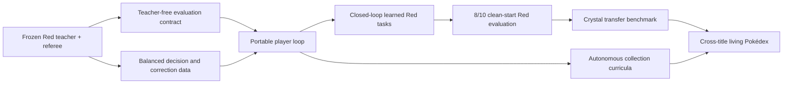

# Roadmap

> **Start with [HANDOFF.md](../HANDOFF.md).** This document is the long record: milestones, gates and
> results accumulated over the project. The handoff is what a new agent needs to be oriented today.

## Current focus (2026-08-09)

### Superseding battle-control checkpoint

The authenticated runtime seam is now implemented and the exact frozen target has been privately
published. The [sanitized artifact receipt](evidence/battle-switch-target-runtime-artifact-2026-08-09.json)
binds its `bd1ba4…` canonical payload and manifest `6ec25dd…` to the feature schema, three training
lineages, one validation lineage, and the separate
17/17 seed-990007 prospective test. Its loader rejects symlinks, undeclared files, noncanonical
JSONL, digest changes, overlapping lineage identities, and any test result below perfect. The clean
start harness can first shadow target choices, then conduct an explicitly uncounted isolated causal
trial in which the teacher still decides *when* to switch and the learned head decides only *which
living reserve* receives that request. Shadow and causal-trial authority are distinct from
deployment authority. Canonical shadow seed `990009` completed all 36 objectives with 13/13 target
agreement, 95.66% mean confidence, and no unavailable projection. Isolated causal seed `990010`
then completed Hall of Fame in the identical 45,819,749 frames with 13/13 target rebindings and no
target fallback. The [runtime qualification](evidence/battle-switch-target-canonical-runtime-qualification-2026-08-09.json)
closes target binding under that narrow authority; it does not claim teacher-free battle control.

The first six-role composition forbade all teacher battle queries and executed objective, training,
move, high-level control, and target models together. Seed `990011` failed closed at S.S. Anne after
158 battle decisions, seven learned HP recoveries, and two learned switches. The wrapper matched a
complete learned HP request, then mistakenly demanded the teacher-only request subclass. The
[failure receipt](evidence/portable-clean-start-six-role-rehearsal-01-failure-2026-08-09.json)
preserves the result. The repair accepts only an executable lead target and preserves the chapter's
bounded item, exact-heal, item-ledger, and MAIN-menu proofs. Fresh seed `990012` qualified that
boundary and advanced to the pre-Mart Route 11 supply Gambler, where a static intent advertised HP
and status cures that the live protected inventory could not spend. The
[second failure](evidence/portable-clean-start-six-role-rehearsal-02-failure-2026-08-09.json) is
preserved. Recovery capabilities now derive before every runtime dispatch from live inventory,
protected status-item floors, and remaining HP allowance. The immediate gate is full ROM-free
validation, clean push, and one fresh uncounted six-role replay; v95 remains 0/10.

Seed `990013` then qualified both boundaries and defeated Lorelei after 3,265 teacher-free battle
decisions. The target head rebound all 13 switches with zero fallback, training control owned
64,337 choices, and the trainee/venue model owned 125,800. The chapter verifier still rejected the
win because attacks occurred at 59 HP below Lorelei's existing 70-HP floor. The
[third failure](evidence/portable-clean-start-six-role-rehearsal-03-failure-2026-08-09.json) is
preserved. `BattleIntent` now exposes that floor, the action-class head ranks only live executable
affordances, and clean-start report v2 requires positive high-level, complete no-fallback
switch-target, and both training authorities.

Seed `990014` qualified the repair and defeated Lorelei, Bruno, and Agatha before entering Lance's
room. Its 3,286 battle decisions included 51 typed requests, zero teacher/safety/low-confidence
fallback, and 21/21 learned switch bindings; both training heads retained full execution authority.
The [fourth failure](evidence/portable-clean-start-six-role-rehearsal-04-failure-2026-08-09.json)
records why this still is not terminal evidence: Agatha's receipt misclassified one valid learned
pivot as a fixed teacher-role choice even though its independent specialist lesson already passed.
The receipt now verifies target-slot identity rather than teacher equality. The immediate gate is a
full clean validation, push, and fresh canonical seed `990015`.

That gate passed. Seed `990015` completed all 36 objectives and Hall of Fame with 3,315 battle
decisions, 21/21 learned target rebindings, 64,337 training-control choices, 125,800 trainee/venue
choices, and zero battle-teacher query or fallback. The
[canonical qualification](evidence/portable-clean-start-six-role-canonical-qualification-2026-08-09.json)
closes the combined canonical gate. Derived-timing seed `990016` then failed before model battle
authority at the lab rival. Direct reproduction showed battle result zero, the event set, and a
legal level-6 23/23 HP Squirtle; the verifier hard-coded the canonical 21-HP DV result and its old
dialogue cap stopped before script 18 released controls. The
[perturbation failure](evidence/portable-clean-start-six-role-perturbation-01-failure-2026-08-09.json)
is preserved. The repaired gate accepts only the legal 21–23 max-HP range while keeping the event,
result, map, script, species, level, live-HP, and control proofs, with a 96-pulse cap. A fresh
uncounted perturbation is now the immediate gate; v95 remains 0/10.

Seed `990017` passed the repaired lab-rival boundary and then encountered a normal wild Pokémon on
Route 1 northbound step 2. The deterministic corridor still required zero encounters and failed
before model battle authority. The
[second perturbation failure](evidence/portable-clean-start-six-role-perturbation-02-failure-2026-08-09.json)
is preserved. Route 1 now has a bounded eight-flee round-trip allowance with explicit opponent,
coordinate, HP, RUN-attempt, control, party, level, max-HP, PP, and status evidence. The next gate
remains one fresh complete uncounted perturbation; v95 remains 0/10.

Seed `990018` accepted two verified flees but then missed the exact Viridian entrance. Direct
reproduction localized the defect to the battle-exit handoff: the first ready observation still
preceded stable overworld input, so route actions could be swallowed without an immediate error.
Adding only a 120-frame stabilization reached the exact gate and then exposed Pewter's separate
zero-wild Route 1 corridor. The
[third perturbation failure](evidence/portable-clean-start-six-role-perturbation-03-failure-2026-08-09.json)
is preserved. One shared primitive now handles both chapters, rereads and verifies the protected
state after the stabilization interval, records that interval in each receipt, and retains the
eight-encounter and sixteen-RUN-attempt bounds. The 2,165-test ROM-free gate plus Ruff, mypy,
documentation, public-artifact, and registry checks passes. A clean push and fresh uncounted
perturbation remain the immediate gate; v95 remains 0/10.

Seed `990019` showed that time alone is not acknowledgement. Five stabilized flee receipts passed,
but one later MOVE was ignored and the fixed sequence stopped at Route 1 `(11,1)`, one tile short.
The [fourth perturbation failure](evidence/portable-clean-start-six-role-perturbation-04-failure-2026-08-09.json)
is preserved. A causal wrapper reached Viridian with one retry. The implementation now verifies
directional coordinate progress or a map transition after every requested step, retries only an
otherwise unchanged protected Route 1 boundary under an eight-attempt/24-frame bound, and publishes
the retry count. The 2,167-test ROM-free gate plus Ruff, mypy, documentation, public-artifact, and
registry checks passes. A clean push and another fresh perturbation are the immediate gate; v95
remains 0/10.

The same audit repaired the campaign layer needed for later living-Pokédex work. Generation I's
Red/Blue reciprocal version gaps now come from one canonical table and include the previously
omitted Pinsir and Scyther. Trading requires an explicit compatibility edge between saves; merely
running two vessels no longer invents trade evolutions. Encounter conditions now flow through
venue selection, candidate projection, and live binding, so a future Crystal day table cannot be
selected at night. These changes deliberately preceded artifact publication and any new emulator
evidence.

The reserve-aware lane has advanced beyond the single-lineage diagnostic described below. Three
complete feature-v3 lineages now exist. A replacement model trained on whole lineages 01 and 03 and
held out lineage 02 scores **98.2394% accuracy / 94.7537% balanced accuracy**, compared with
98.0154% / 90.3798% for the prior candidate. The newest teacher lineage independently completed
312/312 checkpoints, Hall of Fame, 1,800 development battles, and an observed-role-derived
seven-switch Agatha lesson.

The same frozen replacement candidate has progressed under causal high-level authority through five
successively preserved failures:

- checkpoint 109: switched before a declared lead-role move;
- checkpoint 300: attacked once while paralyzed at Lorelei; and
- checkpoint 306: defeated Agatha but let recovery satisfy a weak switch-residency check, producing
  zero specialist attacks and zero required setup boosts; and
- checkpoint 306 again: completed every specialist role and used the setup, but one statused attack
  preceded an extra Blastoise excursion, producing four switches for three role transitions; and
- checkpoint 306 again: passed setup, status safety, residency, and exactly three role transitions,
  but a hand-written target scorer bound Golbat to Blastoise instead of Jolteon after the model
  requested a switch.

The repairs are typed, title-neutral intent constraints rather than route exceptions: real
move-count residency, status clearance before dispatch, and a bounded pre-attack setup. The fifth
failure revealed a different ownership problem: switch timing was learned, while target binding was
still deterministic.

Commit `93faeed` adds an offline permutation-equivariant target head and whole-lineage audit. It
fits 28/28 explicit targets from lineages 01 and 03 and scores 11/13 on untouched lineage 02, up
from the deterministic resolver's 10/13. It still misses the held-out Agatha Golbat target, so its
summary deliberately says `deployment_authority: false`. The next dependency is additional
timing/RNG-varied full teacher lineages and an unopened target test split—not another full causal
replay and not a weight tweak to the old scorer. Counted v95 remains 0/10.

Fresh timing seed 990003 then reached checkpoint 275 before a third legal Drowzee sleep
reapplication exceeded team training's generic bound. The failed private artifact is retained with
469 labels excluded from fitting. Route 11 now carries its previously tested four-reapplication
bound through a venue-specific battle-timing field; the global default remains two. Fresh seed
990004 qualified that repair, completed the 51/52/52/55/51/51 development curriculum and Blaine,
then stopped at checkpoint 284 because legal opponent-inflicted poison violated an overstrict
Viridian trainer receipt despite exact party, move-policy, and survival evidence. Its 3,123 partial
labels are also excluded. The receipt now separates opponent status RNG from controlled choices,
while the immediate pre-Giovanni Center recovery remains explicit and fail-closed. Use fresh seed
990005 after the gate and push.

Seed 990005 completed 312/312 checkpoints and Hall of Fame with 3,166 labels, 13 explicit switch
targets, and a 60/55/55/55/55/55 final-form team after 1,808 development battles. The first frozen
target head scored 11/13 against this new lineage while the deterministic resolver scored 9/13;
both misses remained concentrated at Bruno and Agatha. The lineage was then opened as development
data. Equal-total battle-plan weighting plus L2 0.003 produced a two-unit candidate that scores
54/54 across the four opened leave-one-lineage-out folds and 13/13 on the existing validation
lineage. These are development metrics. Seed 990006 was opened once but stopped at checkpoint 275
after 1,500 safe training wins because the old 1,250-trip recovery cap expired with four members at
55 and two at 54. It emitted no Bruno/Agatha target test rows, so its partial labels are excluded
and the candidate remains untested. Commit `edfa676` preserves the 90% retreat rule while raising
the finite measured envelope to 2,000 trips. Fresh seed 990007 then crossed the old failure point,
completed training, and produced a task-complete target prefix through an Agatha win. The exact
frozen candidate passed 17/17 with 0.07965 cross-entropy versus 12/17 for the baseline, including
Bruno 2/2 and Agatha 7/7. The route stopped at 306/312 because the terminal receipt inferred only
five role changes from move turns while seven valid switches had executed between opponent changes.
Commit `a5e92f0` records and verifies those live switches directly. Runtime artifact and binding
code and exact private publication are complete; canonical shadow and isolated causal completion
have now passed. Seed `990014` qualified HP-floor/action-mask/report-v2 execution through an Agatha
win, then exposed the autonomous-switch receipt ambiguity. The active gate is the repaired
seed-`990015` canonical replay.

After the learned target passes offline and causal Red gates, then one canonical and one uncounted
perturbation result, begin Crystal's bounded battle adapter.
Do not build the complete Crystal route first. Compare frozen-Red zero-shot, preregistered few-shot,
and from-scratch learning on the same examples before deciding whether a full Gen II teacher is
worth the route cost.

The clean-start infrastructure gap is closed. One uncounted baseline selected 21 composite
objectives, verified 15 automatic cartridge effects, and reached Hall of Fame with no expected
objective label, fixed dispatch, or fallback. The source/model/root-bound ten-run registry and
independent 8-of-10 checker also exist. No counted v95 root has been opened.

The strict four-model rehearsal exposed the new bottleneck. It completed 16 composite objectives,
trained a healthy 63/55/55/55/55/55 party, and defeated Lorelei with 3,220 learned move decisions
and zero teacher query or fallback. It then failed the curriculum contract because all 19 Lorelei
attack turns came from slot 1 and the model made zero role switches. This is a correct rejection,
not a route regression. See the
[five-role rehearsal audit](evidence/portable-clean-start-five-role-rehearsal-2026-08-08.json).

Battle-control schema v2 cannot express the teacher's balanced-team lesson: it sees the active
Pokémon and aggregate reserve readiness, but not reserve types, moves, or candidate-relative
matchup advantage. Generic switch targeting also chooses a healthy high-level reserve without
semantic matchup scoring. The dependency-ordered work is now:

1. add portable reserve offensive and defensive matchup observations — **implemented as feature
   schema v3**;
2. make generic switch targeting rank safe reserves by matchup value — **implemented with a 50%
   HP floor and separate target metrics**;
3. collect fresh balanced-role demonstrations and train a new battle-control artifact — **three
   uncounted 312/312-checkpoint lineages are complete; the action-class candidate improved to
   98.2394% / 94.7537% held-out accuracy/balance, while a separate target head improved 10/13 to
   11/13 but remains unpromoted**;
4. pass held-out, counterfactual, and strict canonical five-role gates;
5. repair or bound the lab-rival, Diglett-capture, and Rocket-thief perturbation failures;
6. freeze and execute the ten counted roots sequentially; and
7. use the resulting stable Red benchmark for Crystal transfer and learned navigation.

Do not weaken the Lorelei verifier and do not spend counted roots on the old artifact. The updated
[readiness audit](evidence/clean-start-learned-stack-readiness-audit-2026-08-08.json) distinguishes
infrastructure readiness from model-stack readiness.

The bounded [Crystal transfer benchmark](crystal-transfer-benchmark.md) follows a qualified Red v3
artifact. It deliberately starts with one battle, one local navigation task, and one training
choice; a complete Crystal teacher is not a prerequisite for learning whether the abstractions
transfer.

Historical curriculum priorities were:

**A. Make the team participate.** The level floor is proven in a real clean-power budget. Lorelei,
Bruno, and Agatha now have qualified species- and matchup-aware roles. Agatha no longer uses
Blastoise at all: Jolteon handles Golbat and Dugtrio handles both Gengar opponents, Haunter, and
Arbok.
Whole-League participation is 4/6 with a 70.59% busiest-member share. Extend genuine roles rather
than adding switches for the metric.

**B. Make participation measurable, and embarrassing when absent.** Done across all five League
chapters. The first measurement exposed `[49, 0, 0, 0, 0, 0]`; the three qualified lessons now reach
`[24, 0, 4, 0, 5, 1]`. Lorelei, Bruno, and Agatha require their real switches and complete role
target sets as part of the chapter pass contracts.

**C. Start the living Pokédex.** `red_target(RedRunChoices(...))` and `plan_next_run()` exist and
have no schedule behind them. Two opposed Red runs reach 132 of 151. This is the constraint that
makes route tricks useless and transfer necessary, and it has not been started.

**D. Falsify the game-neutrality claim.** `party.py`, `team_training.py`, `capture.py` and
`pokedex.py` all claim to be game-neutral and nothing has ever tested that claim. Moving the battle
observation contract to one other title will teach more about transfer readiness than another ten
Red runs.

Milestone 6 remains the end state. A, B and C are what make it reachable rather than aspirational,
and D is the cheapest early evidence that it is possible at all.

### Architecture audit and dependency reset — 2026-08-08

The balanced-team work succeeded at improving the teacher, but the audit shows that more
teacher-only refinement is no longer on the critical path. Four boundaries now determine the
roadmap:

- the objective model authorizes the objective fixed code already intends to run; it does not yet
  own objective discovery and dispatch;
- the ordinary completion pass contract does not require a strict battle-policy result;
- most live navigation, recovery, resource planning, and chapter sequencing remain Red-specific;
  and
- the learned completion evidence predates the current balanced-team curriculum.

The work therefore follows dependencies rather than adding more route milestones:

**Gate 1 — make teacher-free mean teacher-free.** Add an explicit evaluation mode that counts
teacher queries, not only teacher fallbacks. Low-confidence predictions, unsupported action
classes, and execution failures must fail the evaluation instead of silently invoking the teacher.
Teacher-assisted collection, shadow comparison, and strict evaluation remain separate modes. A
strict run cannot pass if the battle policy queried the teacher. **Implemented in source and CLI;
full strict-ROM qualification remains pending.**

**Gate 2 — build the portable loop and current curriculum.** The learner must repeatedly observe,
choose an objective, dispatch a bounded skill, receive a structured result, and replan. Collect
decision spans and corrections from the current balanced teacher while moving revision-specific
memory reads and menu compilation behind the game adapter. **The game-neutral loop, model-selected
objective interface, composite-skill registry, and Red adapters through Saffron are implemented. The
current balanced decision corpus and broader Red adapter remain pending.** A bounded exhaustive diagnostic now
enumerates 166 reachable graph states. The historical model is location-sensitive in 73/129
branching states and picks the candidate-local target in 237/317 opportunities; the remaining 80
misses form a concrete correction curriculum rather than a vague request for more planner data.
The first real captured-state diagnostic now exposes three legal Celadon objectives; the model
selects `clear_rocket_hideout` at 99.70% confidence without an expected label. The published
dispatcher executes its registered 1,143-action Hideout skill and independently observes both the
Hideout-clear and Silph Scope facts. It then replans from fresh state, selects `rescue_fuji` at
99.08%, executes the 2,508-action Tower skill, and independently observes the Poké Flute at a healed
Lavender boundary. A third replan selects `reach_fuchsia`; 3,132 more actions capture Snorlax and
reach a healed Fuchsia Center boundary. The three-decision sequence totals 6,783 actions and 638,660
frames with no route labels, fallbacks, or replans. The added live skill-affordance mask then
extended that same run through Surf, Koga, Strength, Erika, Saffron, Silph Co., the Fighting Dojo,
Sabrina, Fly acquisition, Cinnabar, and the Mansion Secret Key. The final twelve-decision sequence
executed 25,254 bounded mechanic actions with no labels, fallbacks, or replans. It records eleven
singleton dispatches separately from the one true executable branch: Koga versus Strength,
where the model selected Koga at 96.41% confidence. This is model-owned objective selection over
teacher-owned mechanics, not learned full-game play. The Secret Key adapter deliberately stops
before Blaine, proving that one fixed skill cannot silently claim two graph objectives. The next
adapter is the separate post-Mansion training-and-Blaine chapter. See the
[twelve-decision receipt](evidence/affordance-masked-twelve-objective-sequence-2026-08-08.json).

The separate post-Mansion Blaine adapter is now source-bound and live-qualified. From the
authenticated Secret Key terminal it used 469,232 actions / 31,883,961 frames, trained the complete
final-form party to 60/55/55/55/55/55 through 1,716 battles and 885 healing trips, obtained TM38 and
the Volcano Badge, and independently opened Giovanni. The first rehearsal exceeded its declared
20,000,000-frame envelope and remains uncounted; the successful rerun changed only that bound. This
is a one-objective captured-state receipt, not a contiguous thirteen-step receipt. See the
[post-Mansion receipt](evidence/affordance-masked-post-mansion-blaine-2026-08-08.json).

The next captured-state slice now qualifies `defeat_giovanni`: 1,409 actions / 156,305 frames,
six exact Viridian Gym trainer lessons, two declared bypasses, TM27, both Earth Badge mirrors, and a
fully healed six-member terminal. Fresh observation opens Victory Road. The adapter is a bounded
one-objective receipt, not yet an uninterrupted fourteen-step sequence. See the
[Giovanni receipt](evidence/affordance-masked-post-blaine-giovanni-2026-08-08.json).

Victory Road now passes from the authenticated Viridian terminal in 3,857 actions / 453,733
frames, including the Route 22 rival, seven badge gates, all five boulder switches, exact League
supplies, and a healed Indigo terminal. Fresh observation exposes Lorelei. See the
[Victory Road receipt](evidence/affordance-masked-post-giovanni-victory-road-2026-08-08.json).

The captured-state League chain now passes through Lance: Lorelei 480 actions / 42,783 frames,
Bruno 328 / 32,538, Agatha 466 / 45,854, and Lance 582 / 51,905. Lorelei, Bruno, and Agatha preserve
two-member role evidence; Lance remains single-member. The current frontier is the Champion-room
authority split because the historical chapter also enters the Hall of Fame while the graph treats
those as two objectives.

The live split experiment found no stable boundary: the Champion event and Hall-of-Fame map become
observable together. The final contract declares Hall of Fame as a coupled side effect of the
single `defeat_champion` dispatch. Its rerun passed in 567 actions / 45,216 frames with the exact
Champion party and a 66/55/55/55/55/55 terminal. All post-Celadon adapters are individually
qualified. That integration gate has now passed: one process ran 20 model dispatches from the
authenticated Celadon capture through the Hall of Fame in 502,175 actions / 37,369,283 frames,
with zero labels, fallbacks, or replans. Nineteen dispatches were singletons and one was a genuine
ranking branch. The captured-state result is not a clean-start evaluation. See the
[twenty-decision receipt](evidence/affordance-masked-twenty-objective-hall-of-fame-2026-08-08.json).

**Historical implementation gate (completed):** extract the teacher's training decisions into a portable
seek/fight/flee/heal/stop dataset and replace that authority with a learned controller under the
same safety envelope. The 469,232-action development block accounts for 93.44% of the integrated
run, so it is both the largest scripted surface and the highest-leverage learning target.

- [x] Define phase-masked `seek` / `fight` / `flee` / `heal` / `stop` labels and a normalized
  cross-game feature schema with no Red map, species, move, or memory identifiers.
- [x] Instrument the live balanced-team teacher to emit those decisions before execution and let
  the captured-state replay atomically retain successful or failed streams.
- [ ] Collect complete disjoint v2 root lineages and publish class balance plus feature coverage.
  Diagnostic lineage 01 completed with 48,156 decisions and all five actions, but is deliberately
  unassigned because its v1 stream predates embedded source/partition provenance. It measured a
  93.2% seek majority, 47,370 unique feature vectors, zero phase violations, 1,716 battles, 885
  healing trips, zero faints, and a 55/55/55/55/55/55 terminal. See the
  [sanitized receipt](evidence/training-control-lineage-01-2026-08-08.json).
  Counted v2 train lineage 01 is now qualified: 46,687 decisions, all five classes, zero
  faints, all level 55, and 45,831 novel unique action-feature pairs versus the diagnostic
  lineage. Its retained distinct root and clean source passed the production loader. See the
  [v2 train receipt](evidence/training-control-v2-train-01-2026-08-08.json). At least one more
  training root and one validation root remain before fitting a real candidate. A proposed
  43-frame second root was correctly rejected: it matched the 17-frame root digest and reproduced
  all 46,687 decisions with zero novel pairs. See the
  [idle-equivalence receipt](evidence/training-control-idle-wait-equivalence-2026-08-08.json).
- [x] Add a v2 integrity loader and partition audit that bind source commit, dirty flag, root-state
  digest, and lineage partition; reject altered files, dirty successful sources, terminal drift,
  state overlap across train/validation, and validation classes absent from training.
- [ ] Replace idle-only root perturbation with reversible movement that proves the same semantic
  checkpoint, requires a different serialized digest, and fails closed before collection when
  either condition is false. The tool now enforces both checks. The first motion-derived root
  passed them, then exposed an in-battle health-gate failure after 11,122 decisions. Its 99.46%
  novel diagnostic pairs are excluded. The repaired replay of that exact root then qualified with
  60,192 decisions, zero faints, an all-55 terminal, and 99.89% novel pairs versus train lineage 01.
  Two training roots are now ready; one disjoint validation root remains before fitting.
  Validation root 01 was genuinely disjoint but failed after 725 progressing wins when 33 safe
  exits crossed a 32-flee anti-loop threshold. It remains immutable and excluded. The repair
  separates feature saturation from termination; validation root 02 must be fresh.
- [x] Train a candidate with lineage-held-out validation; require every validation class to exist
  in training and keep the sealed test partition closed.
- [x] The first real offline candidate used two training roots and one fresh validation root:
  75.62% raw / 76.91% balanced validation accuracy, zero root overlap, all five classes covered.
- [ ] Complete the promotion path: shadow on a fresh root, then grant bounded emulator control only
  under the unchanged teacher/referee safety envelope.
- [x] Implement exact-file authenticated model loading and live teacher-authority shadow auditing;
  failed and successful runs both retain their disagreement evidence atomically.
- [x] Collect the first fresh live shadow lineage and analyze per-class/phase failures before any
  model-controlled action is permitted.
- [x] Complete fresh-root live shadow: 55,904 decisions, 75.57% raw / 76.73% balanced agreement,
  zero faints, all level 55, with teacher-only execution authority.
- [x] Build a bounded control referee around the measured errors: conservative fight-to-flee and
  unnecessary seek-to-heal. Attempt a fresh model-controlled lineage without teacher fallback.
- [x] Implement battle-only model authority: execute safe model fight/flee choices, fail closed on
  unsafe fights, retain teacher overworld authority, and prohibit disagreement fallback.
- [x] Run the first fresh battle-controlled lineage and preserve its failure: after 479/480 matching
  decisions, an unsafe `fight` request failed closed with no fallback because the legal candidates
  did not reflect exhausted/disabled attacks.
- [x] Test the corrected battle affordance contract on a fresh root. Runtime safety removed
  impossible fights before ranking, while safe model-selected flees remained causal and exposed
  under-fighting rather than another safety-interface failure.
- [x] Preserve the corrected causal failure: 77,538 decisions, 1,963 safe fights changed to real
  flees, and the healing budget exhausted before readiness with zero fallback.
- [x] Apply candidate masks inside the fitting softmax so forced singleton decisions contribute no
  policy gradient; inference and training now optimize the same decision surface.
- [x] Collect two fresh teacher-authority training roots and one untouched validation root under
  the corrected candidate contract, fit a replacement, then repeat shadow and causal control.
  The 119,328-example training set and 58,117-example untouched validation lineage had zero root
  overlap; the unchanged 24-unit MLP reached 78.06% raw / 89.25% balanced validation accuracy.
- [x] Run the replacement candidate in shadow mode, then battle-controlled mode under the unchanged
  teacher referee and action/frame/faint bounds. The 57,342-decision shadow reached 100% battle
  agreement. A fresh 59,137-decision causal lesson then completed 1,743 battles with zero faints,
  all six at level 55, and no teacher fallback.
- [x] Redesign the overworld authority boundary before granting it control. Safe optional decisions
  advertise `seek` and `heal`; mandatory recovery advertises only `heal`, and verified readiness
  advertises only `stop`. The selected return is the mechanic's sole source of control, and receipts
  separate forced, genuine, operational-error, and causal-cost metrics.
- [x] Make overworld selections causal and audit whether their labels are observable. Optional model
  heals now execute and spend the real budget; skipped mandatory heals, premature continuation, and
  missed stop decisions fail closed. The first v4 collection was stopped before artifact creation
  because 356 required-heal labels depended on an unobserved safety escort. Feature schema v2 adds
  portable reserve health/status/PP signals; all three exposed roots are excluded.
- [x] Thread authenticated training-control inference through the portable Red loop's
  `defeat_blaine` objective skill. Battle and overworld authority are independently configurable,
  model decisions are audited in the objective receipt, and no disagreement fallback exists.
- [x] Finish the preregistered v5 lineages and open sealed validation only after training-only
  selection. Reject the candidate before shadow: it missed 26 mandatory heals, inserted 2,219
  unnecessary heals, reached only 20.72% heal precision and 95.97% genuine accuracy, and failed
  four offline gates despite perfect battle accuracy.
- [x] Collect fresh v6 lineages under safety-affordance masking, select without validation, and
  attempt shadow/full causal promotion only if every unchanged operational gate passes.
- [x] Audit v6 against a candidate-set-only held-out baseline. That baseline also reaches 100%:
  every `fight/flee` row is labeled `fight`, every `seek/heal` row is labeled `seek`, and every
  other set is a singleton. Treat causal qualification as a safe authority/integration result, not
  evidence that the 25 state features add predictive value. The next curriculum must contain
  state-dependent choices within at least one unchanged candidate set.
- [x] Make offline promotion mechanical: emit path-free lineage/root identities from fitting,
  authenticate the preregistration and candidate summary, evaluate all eight gates, and return a
  nonzero status that forbids shadow whenever one fails.
- [x] Add a cross-title falsification contract proving that different species, move, and venue
  identities project the same training-control observation when their semantic state is equal.
- [x] Make causal promotion mechanical: authenticate the plan, candidate, offline approval,
  no-authority shadow, controlled decisions, control audit, and terminal log as one chain; score
  authority, fallback, decision, battle, healing, faint, and final-party gates; and return nonzero
  before portable-loop integration when any requirement fails.
- [x] Complete the preregistered v6 shadow and full-authority causal lineages. The causal model owned
  all 57,644 exposed decisions across battle and overworld phases, completed 1,801 battles and 1,046
  healing trips with no fallback or faint, and reached the exact 55/55/55/55/55/55 terminal. All
  seven causal gates passed. This verifies the authority and safety integration, not state-feature
  value, because the candidate-set-only baseline remains perfect. See the
  [causal receipt](evidence/training-control-affordance-v6-causal-2026-08-08.json).
- [x] Add a final authenticated portable gate that binds the candidate, causal approval,
  choice-diversity audit, portable objective receipt, terminal emulator state, and progress envelope.
  It reports operational authority and state-dependent evidence as separate verdicts and always
  keeps clean-start, cross-title, and end-to-end claims closed at this captured-state stage.
- [x] Pass that portable gate from the authenticated post-Secret-Key state. The model controlled
  all 57,548 training decisions across both phases; the bounded skill completed 1,796 development
  battles and 1,074 healing trips, defeated Blaine, reached 60/55/55/55/55/55 fully healed, and
  fresh observation opened Giovanni. All ten authority-integration checks passed. State-dependent
  policy evidence remains rejected because the candidate-only baseline is still perfect. See the
  [portable receipt](evidence/training-control-affordance-v6-portable-2026-08-08.json).
- [x] Expose the next genuinely variable teacher choices as a shared, permutation-equivariant
  candidate-ranking interface: which viable below-floor member to train and which safe measured
  venue to use. Species, moves, slots, area names, maps, and memory identities are absent from the
  feature vectors; choices whose teacher label depends only on an unobservable identity tie are
  excluded rather than learned.
- [x] Add atomic candidate-decision replay output, a leakage-rejecting whole-lineage loader, a
  choice-shape baseline audit, a shared candidate-scoring MLP, training-only bidirectional selection,
  and sealed-validation fitting. The v1 curriculum and five historically disjoint roots are
  [preregistered](evidence/training-candidate-ranker-v1-promotion-plan-2026-08-08.json).
- [x] Collect both v1 training lineages, freeze selection without validation, and open the sealed
  validation lineage once. The shared scorer reached 99.9004% on 7,030 genuine held-out choices,
  versus 95.6615% for the choice-shape baseline, with 99.7727% trainee and 100% venue accuracy.
  All collection, identity, selection, and offline gates passed; see the
  [offline receipt](evidence/training-candidate-ranker-v1-offline-2026-08-08.json).
- [x] Pass the separately preregistered shadow gate: 119,353 genuine choices at 99.9941% agreement,
  both choice kinds, 1,802 battles, 1,098 heals, all six at level 55, and zero faints.
- [x] Pass causal authority. V1 is preserved as rejected: its reserved root exhausted the training
  healing budget after 15,449 controlled candidate decisions and ended at 51/32/32/31/31/31. The
  model had zero disagreements with the teacher before failure, so the required causal difference
  was absent. A same-root teacher control exposed the agreement-wrapper defect; the repaired,
  unchanged model passed a fresh preregistered root with 119,668 controlled choices, 191 executed
  disagreements, all six level 55, zero faints, and no fallback. See the
  preserved [runtime rejection](evidence/training-candidate-ranker-v1-runtime-rejection-2026-08-08.json)
  and the fresh [runtime qualification](evidence/training-candidate-ranker-v1-runtime-qualification-2026-08-08.json).
- [x] Pass portable strategic authority. The model controlled 114,831 choices, executed 400 teacher
  disagreements with no fallback, completed 1,803 development battles, defeated Blaine, and opened
  Giovanni from fresh observation. This remains a captured-state, singleton-objective proof.
- [x] Add exact-hash strategic-ranker injection and ownership accounting to the clean-power runner.
  Both Blaine development passes receive the model; the report fails closed when requested
  authority owns zero choices. ROM-free gates and one uncounted clean-power rehearsal pass. That
  rehearsal reached Hall of Fame with 114,831 controlled choices, 400 disagreements, and zero
  fallback, but it is non-promotional because the prospective ten-root envelope did not exist at
  launch.

**Gate 3 — prove Red, then test transfer.** Qualify frozen learned code and weights on at least
8/10 preregistered clean starts without teacher control or restore. Then measure the same interfaces
on a small Crystal battle-and-navigation benchmark under zero-shot, few-shot, and from-scratch
conditions. Collection expands only through those portable skills rather than a second fixed route.

The public explanation of why this pivot matters is outlined in
[the YouTube narrative](youtube-video-narrative.md).

### What changed on 2026-08-07

Routing works: a member too weak for where the run is gets sent to a venue that suits it, travels
there, and gains levels. That mechanism did not exist before and A depends entirely on it.

The complete curriculum now reaches its 60/55/55/55/55/55 readiness gate, and three League
participation increments are qualified from clean power through Hall of Fame. Hitmonlee attacks
Bruno's opening Onix. Jolteon attacks Lorelei's Water core. At Agatha, Jolteon attacks Golbat and
Dugtrio uses Earthquake against all four grounded targets. Shared field recovery selects the
actually damaged member rather than assuming party slot one. The latest run uses 539,957 actions,
322 fewer than the preceding qualification.

The session also produced a working practice worth keeping, described in the handoff: measure rather
than infer, predict before running, capture a mid-route state so iteration costs a second instead of
six minutes, and make every failure carry the readings that explain it. Fifteen evidence files from
that day are in `docs/evidence/`.

---

## End state

The final deliverable is a learned/hybrid policy that chooses objectives and bounded skills from
semantic observations, then adapts when timing, encounters, battle outcomes, status, or position
differs from its demonstrations. The qualified deterministic player is a disclosed teacher and
safety baseline for producing evidence and corrections. It is not the final model, and its results
must not be reported as learned-policy results.

The transferable full-battle controller has passed both shadow qualification and live typed-action
execution. It was selected from complete rollout lineages, reached **98.27%** on an untouched
693-decision test lineage, and then completed a fresh shadow run through all **312/312 checkpoints**
and **36/36 objectives** at **673/678 (99.26%)** agreement. Its subsequent clean execution rollout
again reached Champion and Hall of Fame. The controller made 704 high-level decisions, agreed on
**701 (99.57%)**, executed 35 typed non-move requests, suppressed four unnecessary teacher requests,
used three guarded target-unavailable safety fallbacks, and used zero ordinary teacher fallbacks.

This completes the high-level typed-execution gate, not autonomous full-game play. Portable target
resolution and executor capability masks now allow boosts, qualified HP/status recovery, and
role-aware party switching to run without a teacher callback. A clean 312/312 Hall-of-Fame run
executed all 31 typed non-move requests teacher-free. Learned objective/skill selection, navigation,
resource planning, and a sealed transfer evaluation in a second Pokémon title remain unfinished.

Target ownership is now partially promoted. A portable resolver covered **77/77** non-move actions
across three complete held-out lineages (34 recovery, 36 boost, and 7 switch targets), with no
explicit party-target disagreements. Boosts and qualified recovery actions now execute from the
learned controller without calling the teacher. The capability-gated source completed another clean
**312/312** Hall-of-Fame rollout: 27 typed requests were teacher-free, including 18 recovery
decisions. Role-aware switch execution subsequently promoted the remaining four requests and
completed another 312/312 Hall-of-Fame run with all 31 typed requests teacher-free. A fresh perturbed
diagnostic stopped earlier at the teacher's fixed Snorlax economy boundary; its immutable failed
artifact is retained for the learned resource-planning curriculum rather than triggering another
route-specific patch.

The first authenticated model-assisted clean run is now complete: **312/312 checkpoints**, **36/36
objectives**, Champion, and Hall of Fame. Across 707 live battle decisions, the learned ranker
handled 537 (75.95%) while the teacher supplied 81 low-confidence fallbacks and corrected 52
confident disagreements. This is a learner deployment milestone, not an autonomous completion
claim; the exact scope is frozen in the
[model-assisted Hall-of-Fame receipt](evidence/model-assisted-hall-of-fame-2026-08-05.json).

The next clean run published **126 authenticated live corrections across 36 battle groups**: 74
low-confidence choices and 52 confident disagreements. The private artifact contains the projected
semantic candidates and teacher labels needed for retraining, while the
[public correction-corpus receipt](evidence/model-assisted-correction-corpus-2026-08-05.json)
contains only aggregate identities and counts. The failed first publication attempt is retained
privately and excluded; only the complete manifest is admitted by the correction loader.

Correction training now has a verified closed loop. The selected v3 model improved unchanged
validation accuracy from **85.80% to 87.62%**, then completed a fresh 312/312 run at its
validation-selected threshold with **84 teacher interventions**, down from 126, and reported model
coverage of **81.90%**, up from 75.95%. A second correction round completed the game but regressed
to 92 interventions and 80.76% coverage, so it was rejected. The exact comparison is preserved in
the [correction-trained policy receipt](evidence/correction-trained-battle-policy-2026-08-05.json).

The selected model's zero-fallback battle rollout reproducibly reaches checkpoint 37, then loses
its active Pokémon during the Cerulean rival battle. A new shadow-teacher lane labels disagreements
without changing learner actions and retained the three counterfactual labels that precede this
failure. Failed rollout artifacts remain visibly failed but can now be authenticated as training
data; the [failure-correction receipt](evidence/autonomous-battle-failure-corrections-2026-08-05.json)
does not misstate the run as completion.

Preserving the teacher's non-move recovery and forced-switch signals established a fairer boundary
for the move specialist. With the selected model choosing every attack, the rollout cleared the
former Cerulean failure and reached checkpoint 102. It then arrived ₽1,549 short of the Rock Tunnel
supply budget after inefficient battles consumed recovery resources. The failed rollout retained
**69 disagreements across seven battle groups**; see the
[autonomous-move Rock Tunnel receipt](evidence/autonomous-move-rollout-rock-tunnel-2026-08-05.json).
Full battle autonomy still requires learned item and switch commands rather than hidden teacher
ownership of those action classes.

The next model family resolved the linear ranker's incompatible correction boundary. A shared
nonlinear scorer reached **98.66% validation accuracy**, **98.51% free-choice accuracy**, and
**98.68% novel-visible accuracy**, then completed **312/312 checkpoints**, **36/36 objectives**,
Champion, and Hall of Fame. It made 669 of 709 reported battle decisions (**94.36% coverage**) with
zero teacher move fallbacks and nine shadow-teacher disagreements. This completes the learned
battle-move milestone, not the end state: 67 decisions remained constrained by explicit planner
requirements, and navigation, objectives, items, switching, and recovery are still teacher-owned.
The exact hashes and claim boundary are preserved in the
[nonlinear completion receipt](evidence/nonlinear-battle-policy-hall-of-fame-2026-08-05.json).

The semantic objective model has now entered the live completion loop as well. An authenticated
linear ranker authorized **36/36 objective choices** from semantic observations, with **98.14% mean
confidence**, **79.83% minimum confidence**, and zero teacher objective fallbacks. The unchanged
fixed specialists then executed all **312/312 checkpoints**, defeated the Champion, and entered the
Hall of Fame. This is learned high-level objective selection, not learned navigation or unseen-state
generalization; the exact boundary is preserved in the
[model-authorized objective receipt](evidence/model-authorized-objective-hall-of-fame-2026-08-05.json).

## Milestone 0 — completion foundation

**Status: complete — July 2026**

- [x] Define the clean-run completion contract.
- [x] Separate training assistance from evaluation assistance.
- [x] Add exact ROM identity checks and public-artifact guards.
- [x] Add deterministic grid navigation.
- [x] Validate the semantic objective graph and specialist interfaces.
- [x] Add source-bound run manifests and the independent completion referee.

Exit gate: all foundation modules pass ROM-free CI and no document claims gameplay progress.

## Milestone 1 — verified clean-start chapters

**Status: complete — July 2026**

Current qualification: **299/299 bounded checkpoints** and **36/36 completion objectives**,
ending with concurrent Champion-defeated and Hall-of-Fame verification. Three clean-power-on,
no-restore runs reached the identical 4,796,436-frame / 41,316-action terminal. This is an exact
deterministic-teacher completion, not a learned-policy or timing/RNG-generalization result.

The later robustness lineage adds a reusable Mansion training block and has independently passed
two clean-power runs at **301/301 checkpoints** and **36/36 objectives**. Each replay trained the
lead from level 46 to 55 with 115 wild wins, five healing trips, and zero faints, then reached the
same Champion-plus-Hall-of-Fame terminal in 6,581,531 frames and 54,261 actions.

The newest balanced lineage adds the Celadon Eevee gift, Jolteon evolution, all five Fighting Dojo
battles, and the Hitmonlee gift. It passes **312/312 checkpoints** and **36/36 objectives** from
clean power with the declared six-member roster, zero training faints, a final level band of
82–87, and 516,338 teacher actions. The balancing block required 5,445 wild wins and 529 healing
trips before satisfying its five-level spread contract.

- [x] Build the no-save PyBoy bridge and read-only state adapter from pinned symbols.
- [x] Add controller timing and one authoritative action executor.
- [x] Qualify clean power-on through the input-ready bedroom and one-tile movement probe.
- [x] Qualify leaving home, Professor Oak's escort, and Squirtle selection through six closed-loop
  checkpoints.
- [x] Add an optional visible watch mode that leaves human input and saving disabled.
- [x] Qualify the lab rival, Oak's Parcel delivery, and Pokédex objective in one clean session.
- [x] Add a continuous `play --watch` command with visible semantic checkpoints and a safe,
  explicit bounded stop.
- [x] Qualify the route to Pewter City and defeat Brock.
- [x] Qualify Route 3, Mt. Moon's required battles and fossil choice, and Cerulean City.
- [x] Qualify the Cerulean rival, Nugget Bridge, selected Route 25 trainers, Bill, the mandatory
  Cerulean Gym trainer, and Misty.
- [x] Qualify the Cerulean Rocket thief, Route 5, the Underground Path, the required lower Route 6
  trainers, bounded wild-encounter recovery, and stable Vermilion arrival.
- [x] Qualify the Vermilion harbor, S.S. Anne corridors, required rival battle, Captain interaction,
  and four-field HM01 Cut evidence.
- [x] Qualify bounded Spearow and Diglett capture, the DUX trade, Cut and Dig preparation, the
  variable Gym switch puzzle, a Dig-only Lt. Surge win, TM24, and mirrored Thunder Badge evidence.
- [x] Qualify BubbleBeam preparation, exact tunnel supplies, Route 9, all mandatory Rock Tunnel
  trainers, bounded wild-flee recovery, the optional Route 10 trainer bypass, and stable Lavender
  Center arrival.
- [x] Qualify the single required Route 8 trainer, bypass all eight optional trainers, cross the
  west-east Underground Path and Route 7, and establish a stable Celadon Center boundary.
- [x] Qualify the Game Corner switch, spinner mazes, Lift Key and elevator, both boss-door guards,
  Giovanni, the Silph Scope, field Dig return, and a healed Celadon boundary.
- [x] Qualify the mandatory Pokémon Tower rival and Channelers, all three purified-zone heals,
  level-30 Marowak, the three final Rockets, Mr. Fuji's rescue, the Poké Flute, and the natural
  Wartortle-to-Blastoise evolution.
- [x] Qualify the level-30 Route 12 Snorlax, four mandatory Route 12/13 trainers, every optional
  Route 12–15 bypass, a resource-neutral Lavender recovery, and stable Fuchsia Center arrival.
- [x] Qualify one ₽500 Safari admission, the source-pinned Center/East/North/West route and
  elevation trap avoidance, six RUN-only encounters with 30 Balls retained, Gold Teeth and HM03,
  reusable-HM Surf teaching over slot-four Water Gun, and Time's Up cleanup.
- [x] Qualify the mandatory Fuchsia Gym route, Koga, Soul Badge, HM04 Strength, Erika, Rainbow
  Badge, the Fresh Water guard handoff, and stable Saffron access.
- [x] Qualify the Silph Card Key route, required trainers, rival and Giovanni battles, Master Ball,
  optional-Lapras bypass, and the permanent TM13 Ice Beam upgrade.
- [x] Qualify the trainer-free Saffron Gym warp route, Sabrina, TM46, Marsh Badge, and post-battle
  regular-trainer deactivation.
- [x] Qualify the bicycle-free Route 16 Cut lane, HM02 transfer, DUX Fly teaching, Pallet Fly
  destination, Route 21 wild-flee recovery, all nine trainer bypasses, and healed Cinnabar arrival.
- [x] Qualify the one-repel Pokémon Mansion route, all optional-trainer bypasses, Secret Key,
  six correct Gym quizzes, Blaine, TM38, Volcano Badge, and post-battle recovery.
- [x] Qualify Viridian Fly and inventory preparation, the spinner-floor route, six required Gym
  trainers, pre-leader recovery, Giovanni's exact party, TM27, Earth Badge, and Route 22 rival
  activation.
- [x] Qualify Toxic preparation, the final Route 22 rival with bounded live recovery, all Route 23
  badge checks, every Victory Road Strength switch and boulder drop, Indigo healing, and Elite Four
  supplies.
- [x] Qualify Lorelei's exact party, item-cursor recovery, status-aware healing, retained Toxic,
  and a fully healed Bruno-room boundary.
- [x] Qualify Bruno, Agatha, and Lance with exact trainer-party reconstruction, bounded recovery,
  PP-aware move selection, and fully healed room transitions.
- [x] Qualify the Champion with six verified X Special uses, exact six-member party
  reconstruction, bounded recovery, and concurrent Champion-event plus Hall-of-Fame proof.
- [x] Replay every qualified objective across three clean-power-on runs.

The qualified corridors and
semantic gates are pinned to pret/pokered commit
`1e96034092686d006e863cace09e87273051a3d8`. See the
[Hall-of-Fame three-run evidence receipt](evidence/qualified-play-hall-of-fame-2026-07-29.json).

Exit gate met: three intervention-free clean-power-on runs reached the Hall of Fame with identical
evidence.

## Milestone 2 — deterministic expert

**Status: complete — July 2026**

- [x] Complete the route graph through all eight badges, Victory Road, Elite Four, and Hall of Fame.
- [x] Add navigation transitions, menus, inventory, party management, HM/puzzle, battle, and recovery
  specialists.
- [x] Record failure categories, deterministic recovery behavior, and semantic action rationales.
- [ ] Generate clean demonstrations plus corrected trajectories for timing, encounter, battle,
  status, and nearby-position variations. This continues as Milestone 3 dataset work.

Exit gate met: the teacher completed three identical clean runs without save-state restoration.

## Milestone 3 — demonstration learner

**Status: in progress — July 2026**

- [x] Define the versioned, game-neutral semantic trajectory contract and Pokémon Red adapter.
- [x] Add fail-closed, path-free private episode storage for a separately mounted volume.
- [x] Record and integrity-audit the first private clean-start teacher control trajectory.
- [x] Add policy-safe battle move decision spans for the shared adaptive battle runtime.
- [x] Record and audit a clean-start trajectory containing adaptive battle decision labels.
- [x] Add an integrity-checked private episode reader and typed private model-artifact writer.
- [x] Add the pinned Red mechanics projector and slot-equivariant masked battle ranker.
- [x] Run and publish the aggregate first single-lineage battle diagnostic.
- [x] Record explicit physical battle instances, stable route-plan identities, planner goals,
  required-move semantics, and descriptive recovery markers at the policy boundary.
- [x] Add feature schema v2 with `constraint.matches_required_move` and separate free-choice,
  forced-choice, and unobserved-context metrics.
- [x] Preregister five train, two validation, and five test root lineages with immutable,
  single-attempt global and partition-local slots plus content-addressed 71-battle timing
  schedules.
- [x] Bind the registry to exact canonical roster, schedule, assignment, sidecar, executable
  source, teacher behavior, objective graph, and teacher execution identities.
- [x] Make planned recording verify exact battle order, apply each offset once before policy
  inference, emit per-battle and terminal schedule attestations, and fail closed on missing,
  extra, substituted, incomplete, or reordered battles.
- [x] Add a registry-declared, disjoint, unassigned, non-counted 71-battle schedule dry run.
- [x] Add a private campaign seal and immutable outcome ledger that counts complete, failed,
  interrupted, and invalid slot outcomes with durable reasons.
- [x] Pin the exact pushed source commit, live source bytes, CPython binary, and installed PyBoy
  inventory; authenticate schedule events against actual WAIT executions; and add safe campaign
  status/recovery reporting.
- [x] Require a re-audited immutable dry-run qualification before every counted slot and durably
  persist the one-shot episode claim before emulator execution.
- [x] Add a game-neutral six-member party observation contract, derived team metrics, and a
  reusable balanced-training policy, with a Red adapter binding the declared roster.
- [x] Integrate bounded switch-participation training for the route's existing party and replay it
  from clean power through the Hall of Fame.
- [x] Record all 36 whole-game objective choices at their verified execution boundaries while
  keeping teacher labels and legal candidate annotations outside policy input features.
- [x] Add an authenticated complete-episode planner loader and a game-neutral semantic objective
  ranker with an explicitly non-promotable single-lineage diagnostic lane.
- [x] Capture the first objective-labeled 312-checkpoint episode and publish its diagnostic model:
  36 decisions, 94.4% training accuracy, and an explicit non-promotion receipt.
- [x] Add portable target-region and downstream-unlock graph features, bind dataset loading to the
  exact objective-graph digest, and publish the v74 diagnostic at 36/36 training choices.
- [x] Authenticate the v75 model at every live objective boundary and require 36/36 model-selected
  choices with zero objective fallbacks through Hall of Fame.
- [x] Preregister five disjoint objective-planner validation schedules and five sealed test
  schedules with a frozen model identity and fail-closed completion criteria.
- [x] Retire held-out planner evaluation v1 honestly after one complete run and two fixed-specialist
  failures; reproduce and repair both exposed schedules without counting them as held-out evidence.
- [x] Preregister fresh v2 validation and sealed-test schedules after the exposed Route 25 PP,
  Snorlax live-budget, and Celadon collision-feedback repairs.
- [ ] Collect disjoint planner train/validation roots and evaluate objective selection under
  perturbed timing, encounter, damage, status, and position states.
- [x] Catch Route 12 Snorlax with bounded recovery and capture decisions, raise the live balance
  contract to four members, and qualify all 301 checkpoints through the Hall of Fame.
- [x] Add the Eevee/Thunder Stone/Jolteon acquisition and raise the live training contract to five.
- [x] Add the Hitmonlee acquisition and raise the live training contract from five members to six.
- [x] Replay the six-member balanced-team route from clean power-on and qualify it against the
  completion contract: 312/312 checkpoints, 36/36 objectives, a final-form party at
  60/55/55/55/55/55, Champion defeated, and Hall of Fame entered in one uninterrupted run.
- [x] Define the Red one-save/no-link collection contract: 124 obtainable Pokédex registrations,
  120 coexisting living targets, and 27 explicit version, trade, mutually exclusive gift, fossil,
  starter, evolution, or event exclusions.
- [x] Add game-neutral collection planning plus fail-closed Red readers for seen/owned Pokédex
  flags and the visible party/current PC box.
- [x] Add checksum-verified all-box inspection across the active Work-RAM box and both dedicated
  saved-box SRAM banks without exposing raw addresses to the planner.
- [x] Replay the full teacher and publish the first terminal census: 12/124 owned, 85/124 seen,
  7/120 living, and 0/120 at level 100, with all twelve boxes verified.
- [x] Add bounded, transition-verified Bill's PC deposit and withdraw controls, and replace the
  route's one hard-coded helper deposit with the reusable storage specialist.
- [x] Add bounded, verified switch-box control and exercise a reversible Box 1→2→1 cycle without
  losing a stored specimen.
- [x] Replay the corrected contract and storage cycle from clean power through Hall of Fame:
  312/312 checkpoints, 36/36 objectives, storage initialized, all boxes verified, and a terminal
  12/124 registered, 7/120 living, 0/120 level-100 census.
- [x] Add a pinned 124-target acquisition graph with 67 ordinary wild, 11 Safari, 7 fishing,
  17 gift/static/prize/fossil/trade, and 22 evolution methods; prove that its 120 root specimens
  incidentally register every target and derive all duplicate precursors and evolution items.
- [x] Add a bounded semantic source-survey executor that seeks, captures into a full-party PC,
  flees irrelevant encounters, rotates full boxes, verifies one-specimen progress, and stops only
  when the source's downstream quantity requirements are retained; qualify it in ROM-free Route 1
  simulation.
- [x] Bind the source-survey executor to live Route 1 movement, capture menus, Pokédex flags, and
  PC storage, then replay Pidgey/Rattata acquisition through all 312 checkpoints and the Hall of
  Fame from clean power.
- [x] Replace Route 1's chapter-local target loop with the reusable source-survey executor backed
  by global Pokédex, party, and all-box observations; add duplicate-aware source ranking and replay
  the exact 83,835,201-frame / 758,430-action lineage through the complete integration contract.
- [x] Bind the reusable wild-source controller to Viridian Forest; retain Caterpie, two Metapod,
  two Kakuna, and Pikachu; and reproduce the complete 83,619,428-frame / 765,088-action lineage
  twice through all 312 checkpoints and the Hall of Fame.
- [ ] Independently retain one living specimen for all 120 coexisting targets.
- [ ] Implement the remaining map-specific encounter, fishing, Safari, gift, static, prize,
  fossil, trade, evolution, and resource executors for all catalog methods.
- [ ] Qualify the 124-species Pokédex-registration gate, 120-species living-collection gate, and
  120-species level-100 gate as three separate uninterrupted-run claims.
- [ ] Add title profiles for later generations, then measure zero-shot and fine-tuned transfer on
  unseen seeds before claiming support for another game.
- [ ] Build a multi-save, multi-version portfolio contract for species that cannot coexist or be
  obtained in one lineage, with unavailable event/service requirements reported explicitly.
- [x] Add the authenticated five-train/two-validation battle fitting lane: require complete
  one-shot outcomes, leave all five test roots unopened, disclose visible-state overlap and
  novel-visible performance, select a validation-only confidence threshold, and publish a private
  canonical candidate that remains promotion-ineligible until test and rollout evaluation.
- [ ] Commit and push the v48 source/configuration state, then successfully complete the 71/71
  schedule dry run before slot `01`.
- [x] Collect every declared train and validation lineage without opening the test partition.
- [ ] Freeze the selected battle model and thresholds, then evaluate the five test roots once.
- [ ] Record perturbed teacher corrections and recovery trajectories.
- Publish schemas, aggregate statistics, and dataset cards without game assets.
- Train goal-conditioned navigation, interaction, battle, puzzle, and recovery specialists with
  behavioral cloning.
- Evaluate each specialist on held-out seeds and deliberately perturbed semantic states.

Exit gate: learned specialists meet preregistered local reliability thresholds.

The first private control trace contains 41,330 executions, 300 events, and 14,760 deduplicated
policy snapshots across all 299 checkpoints. Its manifest, references, state-hash chain,
provenance, terminal record, and privacy invariants passed audit. See the
[sanitized receipt](evidence/private-trajectory-foundation-2026-07-30.json). It contains no
specialist decision records yet and is not described as a finished behavioral-cloning dataset.

The second private trace adds 422 adaptive battle move decisions across 32 battle locations and
links them to 3,022 contiguous executor actions. Every decision begins at the same step and
policy-snapshot hash as its first execution. The
[sanitized battle-decision receipt](evidence/private-battle-decisions-2026-07-30.json) keeps this
lane explicitly incomplete: custom battle controllers, perturbed corrections, frozen splits, and
learned evaluation remain pending.

The first battle-imitation diagnostic trains a 100-feature shared move ranker on those 422
decisions, grouped into 63 encounter proxies. Five-fold agreement is 72.5% versus a 50.5%
fold-local majority-slot baseline and macro F1 is 0.683. A hard mask makes every prediction a
legal positive-PP choice by construction; that 100% rate is a safety invariant, not a learned
performance result. The
[sanitized diagnostic receipt](evidence/private-battle-imitation-diagnostic-2026-07-30.json) keeps
the claim narrow: this is one unassigned root lineage with inferred groups and incomplete
planner-goal context, not held-out evaluation or a learned gameplay rollout.

Future recordings now have explicit context and are governed by the
[committed collection protocol](collection-protocol.md). Its twelve prospective assignments and
timing schedules have not yet run. Their current v2 feature view distinguishes free move choices
from exact teacher-required choices; future receipts report both separately because forced-choice
accuracy is constraint compliance, not autonomous battle judgment. The recovery marker remains
descriptive only and does not yet define a recovery learner's inputs or budget.

Dataset quality now also depends on party composition. The historical recordings complete the game
with one overleveled lead, which makes most battle labels trivially correct and teaches nothing
about switching or matchup selection. The current branch adds a game-neutral six-member party
contract, derived team metrics, a reusable equal-level policy, and a completion-efficient developed
team policy. The active route catches Snorlax, obtains and evolves Jolteon, recruits Hitmonlee,
verifies that all six members are in their declared final available forms, and trains Blastoise as
the designated workhorse to level 60. An earlier three-member teacher entered Indigo at level 58
and the Hall of Fame at level 61, making 60 an evidence-backed speed target rather than an
assumption that lower levels cannot work. A clean-power six-member replay has now passed all
**312/312 checkpoints** and **36/36 objectives** in **87,020 actions**: 177 Mansion wins raised the
workhorse from 48 to 60, and 24 targeted battles completed the remaining evolution. The prior
levels-82–87 zero-faint proof remains historical route evidence; matching every non-workhorse to
the carry is no longer a collection prerequisite.
See the
[Project Narrative](project-narrative.md) for the reasoning and the outstanding route work.

The protocol also requires a successful, non-counted 71/71 schedule rehearsal before slot `01`,
and its one-shot ledger preserves failures and power interruptions as consumed outcomes. Exact
identity, manifest, assignment, schedule, and lineage reuse is hard leakage. Repeated
policy-visible semantic states are report-only because distinct hidden timing histories can
naturally converge on the same observation; novel-visible-state performance is reported
separately. Preregistration and runtime enforcement are infrastructure, not held-out evidence. The
first Forest-lineage rehearsal exposed a Route 24 moving-NPC collision at checkpoint 38/312. The
repaired crossing passed clean-power qualification and cleared that point under the same schedule;
the second rehearsal then exposed a trapping-move recovery gap at checkpoint 109/312. Neither run
consumed a declared slot. Clean diagnostics have since cleared the repaired tunnel, Tower, and
Sabrina policies, isolated two-turn Fly from the one-turn Mansion grinding contract, and recognized
level-up move replacement as a valid post-attack observation. The combined source passed a new
312/312 clean-power Hall-of-Fame replay and was published before rehearsal. All twelve
slots remain pending, and the test partition remains unopened until a model and its selection
rules are frozen.

The first rehearsal of the published combined source cleared Route 24 and Route 25, then exposed a
remaining Wrap lock at Rock Tunnel checkpoint 109/312. A later uncounted rehearsal exposed an
unsafe low-HP DUX finisher at the same chapter; neither attempt consumed a slot. The current repair
removes that finisher, proves the tunnel potion floor, chooses Bite against Slowpoke after required
move evidence, escapes status-locked DUX matchups, and preserves the legal natural-evolution path.
A surplus Tower Rare Candy now establishes the level-41 TM40 lesson boundary, moving Celadon NPCs
receive neutral retry windows, and the Silph rival receives type-aware Ice Beam plus bounded
whole-battle recovery. The next uncounted rehearsal then proved the DUX status escape but put its
replacement to sleep and exposed that battle healing targeted only party slot one. The current
teacher buys one additional Awakening in Vermilion, reserves one for Tower, and applies both status
and HP recovery to the actual active party index under a two-potion cap. This exact source completed
a clean-power **312/312-checkpoint**, **36/36-objective** Hall-of-Fame replay in **771,022 actions**.
Its six-member Mansion curriculum exceeded **4,000 wins**, retained a level-77 floor, and passed the
bounded spread contract. Registry freeze and the next uncounted 68-battle rehearsal are the current
gates. The following rehearsal cleared Rock Tunnel but exposed a $200 restock deficit from the
additional schedule-specific recovery. The teacher now sells the unused, already-proven TM28 for
$1,000 before restoring the full downstream reserve; no counted slot was consumed.
That repair moved the rehearsal to checkpoint 202/312, where Koga Gym Juggler 4 fainted the lead.
The current teacher pivots at the 50-HP floor to the healthiest living reserve and uses that active
party member's own legal moves. Another uncounted rehearsal is required before collection opens.
That change advanced the route to Sabrina at checkpoint 261/312, where the Hyper Potion verifier's
24-frame settle window expired during the opponent reply. The shared battle-item primitive now has
a bounded 720-frame cancel-safe window and richer failure evidence. Rehearsal remains the gate.
That repair passed Sabrina and carried the balanced curriculum beyond 1,250 battles, where live PP
exhaustion or Disable removed every preferred attack. The current adapter hands control to the safe
escort, flees without a faint, and lets the game-neutral planner request restoration. Another exact
uncounted rehearsal then completed **312/312 checkpoints** and entered the Hall of Fame, proving
the scheduled gameplay route. Its episode remained unpromoted because wild curriculum battles had
no explicit training intent and repeated progress events reused an identity. The lossless-data
repair labels each wild decision, closes externally fled battle instances, and keys progress to
the execution step. No counted slot was consumed; the repaired exact source must repeat the
uncounted rehearsal before collection opens. That replay again completed **312/312** and Hall of
Fame, with lifecycle and progress loss reduced to zero and 4,789 move labels accepted. The only
remaining 209 rejections were early switch-training choices: Blastoise was active, but the snapshot
still described the weak field lead. The adapter now projects the controlled battler during battle
and the field lead outside battle. A newly frozen exact-source rehearsal remains the gate.
The newest rehearsal cleared the former Route 9 continuation failure and reached Koga at checkpoint
205/312. When the workhorse fainted with a living opponent and a healthy party behind it, the boss
adapter still stopped as though the run used a single carry. Koga now selects the healthiest living
teammate through the observed forced-party menu, ranks that member's legal live-PP moves, caps KO
handoffs by party depth, and records the continuation separately from mutual-KO recovery. The
post-battle Center proof still requires the complete party restored. The run was uncounted; the
republished source must pass the full rehearsal before slot 01.
That continuation defeated Koga and the Center restored the complete party, but the Strength input
gate then found Skull Bash in Blastoise's first move slot. The recorded transition proved level 42
was reached while fighting Muk and the natural move prompt replaced Bite, which is reserved for the
later controlled TM40 lesson. Koga now assigns Muk to the healthiest living teammate before the
workhorse selects an attack, preserving both the staged lesson and the no-faint tactical objective.
The uncounted run stopped at 208/312; v10 remains unopened.
The next replay handed Muk to Snorlax, but that reserve later fainted and Blastoise returned to win
at 14 HP, leaving the same natural level-42 move branch possible. Strength and Erika now preserve
two exact legal lineages: Bite followed by the controlled TM40 lesson, or natural Skull Bash
followed by archival of the redundant TM40. Both must converge on the same post-Erika moves and PP,
and Koga's Center gate must restore every member after any recorded continuation. The rehearsal was
uncounted; v10 remains unopened.
The combined source subsequently qualified v10 at **312/312**, **36/36**, Hall of Fame, and
**68/68** scheduled battles. Its first fresh counted root failed at Misty with the one-member party:
Wartortle fainted at 0/64 before a finishing attack and Starmie retained 10/59 HP. That immutable
outcome is sealed and v10 is retired. V11 rehearses on exposed seed `20001`, uses entirely fresh
counted seeds, and lets Misty spend only the live Potion surplus above the four-Potion Rocket
reserve under exact low-HP, heal, inventory, and same-intent gates.
The exposed-seed v11 rehearsal cleared Misty, then found two later generalization boundaries while
remaining uncounted. Route 10 could report field input between the nurse's final text boxes; a
bounded CANCEL-only normalization now proves the exit stance without reopening the heal dialogue.
At Koga, Muk's Minimize/poison stall eventually exhausted all four available party members despite
legal forced-switch continuation. The revised lesson uses the carried Tower X Accuracy on
Blastoise when Muk appears, directly counters the accuracy mechanic, and replaces that single
consumable during the already-qualified Celadon battle-item purchase. The complete source must
still pass all 312 checkpoints and 68 scheduled battles before v11 collection opens.
V11 subsequently qualified all of those gates, but fresh counted seed `21001` stopped after the
Nugget Rocket when a moving Cerulean Mart customer held the repeat clerk approach at `(4, 5)`.
That one-shot failure is sealed and v11 is retired. V12 uses the exposed seed only for rehearsal,
waits for verified westward progress inside the safe Mart corridor, and assigns fresh train seeds
`22001`–`22005`, validation seeds `32001`–`32002`, and test seeds `42001`–`42005`.
The first v12 rehearsal passed that collision boundary and reached checkpoint 86, but the capture
settling loop crossed the battle MAIN menu between observations and selected a second Poké Ball.
Post-throw dialogue now uses CANCEL, which advances text while remaining inert on MAIN. The failed
artifact is uncounted, every v12 collection slot remains pending, and the exact repaired source
requires a new complete qualification.
The capture-safe replay proved checkpoints 87–91, then the later Route 1 semantic survey was
blocked below the source-defined horizontal youngster at `(14, 14)`. A 24-attempt maneuver now
steps east, waits, restores the exact approach, and retries only the northward crossing. Any map,
battle, or coordinate outside that bounded gate still fails closed. This second v12 artifact is
also uncounted and does not open collection.
The walker-safe replay reached checkpoint 102, where the live capture bill left a ₽2,109 Tunnel
supply shortfall but only five obsolete Potions. The route now earns ₽1,260 from the nearest
source-pinned Route 11 Gambler and liquidates unused TM24 for ₽1,000 before buying supplies. The
Gambler is a new scheduled battle, raising the exact roster from 68 to 69; its payout, identity,
event, return route, and no-item-recovery boundary are all verified. The fixed ten-Super-Potion,
three-Awakening, three-Parlyz-Heal, and four-Repel contract is unchanged.
That exact rehearsal subsequently validated every earlier repair through checkpoint **296/312**,
including the six-member balance gate, Blaine, Giovanni, the final rival, and Victory Road. It then
exposed a stale Indigo inventory assertion: the now-larger bounded capture curriculum may legally
consume all thirty Poké Balls, while cleanup required one leftover solely to enter a sale helper.
Zero is now an explicit valid remainder, the zero-quantity sale is skipped, and exact Elite Four
supplies remain the terminal proof. The run was uncounted; a fresh source-bound rehearsal remains
the collection gate.
The first replay of that correction accepted zero but selected the wrong shop item because the
zero-sale branch remained at field control while the positive-sale branch had returned through
SELL. Indigo preparation now uses an explicit two-state transition: INTERACT from the zero-remainder
field state, or CANCEL from a completed positive sale, followed by the same verified BUY selection.
That replay was also uncounted; the newly frozen source must qualify from clean power.
The corrected source subsequently passed **312/312**, **36/36**, Hall of Fame, and **68/68**
schedule audit, opening v2. Its first one-shot train root then failed at checkpoint 62 when the
Rocket thief's Drowzee knocked out Wartortle at 0/66 HP with 24/50 enemy HP remaining. The immutable
v2 ledger retains that failure, so v2 cannot provide five complete train roots. The next teacher
keeps a fifth Potion through Route 24, a fourth through Route 25, conditionally spends the third at
a bounded Rocket-thief recovery gate, and hands the original two-Potion reserve to Route 6. After the required
fresh Bite, it ranks Mega Punch before weaker cleanup attacks. A fresh-seed v3 campaign is now the
qualification target; v2 will not be retried.
The first uncounted v3 qualification attempt then reached checkpoint 44 with Wartortle at 2/56 HP
before the Nugget Rocket's Ekans trapped and fainted it. The route already reserved the needed
Potion but spent it after victory; that same recovery now occurs before the battle and preserves
the four-Potion Route 25 boundary. All counted v3 slots remain untouched pending a complete replay.
The next replay cleared that fight and survived checkpoint 62 without needing the in-battle Rocket
Potion, but the exact-one-use assertion rejected the safer outcome. Recovery is now conditional;
an unused allowance carries forward as bounded surplus instead of being wasted to normalize counts.
That repair passed both Rocket boundaries and reached checkpoint 69, where Route 6 repeated the
same mandatory-use mistake after a safe victory. Route 6 now shares the conditional rule and
protects a one-Potion minimum while preserving any surplus for S.S. Anne. The next replay reached
the S.S. Anne rival at checkpoint 79, where one Potion could not survive Ivysaur. That battle may
now spend the carried bounded surplus at recurring live low-HP gates under one stable intent.
The resulting replay cleared S.S. Anne and Surge and reached checkpoint 109, where a status-locked
DUX pivoted correctly but Wartortle used resisted BubbleBeam against Bulbasaur until its recovery
limit was exhausted. Bulbasaur now shares the Grass-matchup policy, selecting neutral Bite after
the role handoff instead of compensating for poor attacks with a larger heal cap.
That replay survived the prior fight but reached B1F trainer 4 still paralyzed; Wartortle selected
BubbleBeam, lost the turn, and the opponent self-destructed before PP could prove execution. The
route now cures status before the Hiker sequence and carries a second Parlyz Heal for the later
Grass contingency, retaining both the win contract and an executable curriculum label.
That replay cleared the complete tunnel and Pokémon Tower, then exhausted ten Great Balls and all
remaining Poké Balls at the one-time Route 12 Snorlax. The funded static-capture budget is now
twenty-five combined balls with a thirty-three-throw total bound; unused stock is sold afterward, and success no longer
depends on lucky leftovers from earlier species searches.
The first thirty-ball proposal failed closed at the Mart: ₽16,897 could not fund the ₽19,400
capture-plus-healing bill. Twenty-five balls plus both Super Potions cost ₽16,400, preserving
healing and future-use TMs while exceeding the previously exhausted eighteen-throw lineage.
The funded replay caught Snorlax in six throws and advanced through Koga to the Celadon Gym
trainers, where a Center NPC occupied the first exit tile beyond eight bounded waits. The existing
release-and-observe movement primitive now covers sixteen waits, preserving the route while
allowing a full longer NPC cycle to vacate the tile.
The replay proved that sixteen waits can still leave the NPC parked. The second Center exit now
uses the legal side corridor around that occupied tile and rejoins the same doorway below it,
removing NPC timing from this transition while retaining collision and destination checks.

The repaired v3 lineage ultimately completed **312/312 checkpoints**, **36/36 objectives**, Hall
of Fame, and **68/68** schedule attestations with a level-75–81 balanced party. Its first immutable
training root then exposed a different Route 24 failure at checkpoint 42: Sand-Attack reduced
accuracy, Nidoran poisoned Wartortle, and repeated Water Gun misses allowed the 4-HP opponent to
outlast the lead. V3 is retired with that one-shot failure preserved. V4 uses the exposed v3 seed
as its uncounted rehearsal, heals immediately before the accuracy battle, and permits one bounded
Potion recovery without reducing the four-Potion downstream reserve. V4 later qualified but its
first immutable training root failed at the final bridge trainer, so it is retired. V5 adds a
Center recovery before that fight and freezes twelve fresh counted seeds pending a complete
312/312 and 68/68 rehearsal.

## Milestone 4 — DAgger and selective RL

- Collect teacher corrections on learner-induced states.
- Use snapshot curriculum RL only for skills below their imitation gates.
- Freeze and promote specialists independently.
- Train a semantic planner to select objectives and specialists without raw-memory or
  demonstration-index inputs.
- Exercise recovery from displaced positions, unexpected encounters, damage, status, and shifted
  timing.

Exit gate: a learned skill stack completes a held-out clean-start run with teacher fallback
disabled and no save restoration.

## Milestone 5 — distilled completion

- Train a local goal-conditioned macro-policy from qualified demonstrations, perturbations, and
  learner corrections.
- Remove the deterministic router while retaining the objective graph, safe executor, and referee.
- Run a preregistered held-out multi-seed clean-start evaluation series with teacher fallback
  disabled.

Exit gate: at least one verified completion; reliability requires at least 8/10 preregistered runs.

## Milestone 6 — cross-game transfer

- Freeze a Pokémon-mainline semantic ontology that excludes revision-specific privileged state.
- Implement a second game adapter without changing the shared policy interfaces.
- Measure zero-shot behavior, few-shot adaptation, and training from scratch on the same tasks.
- Progress from a closely related title to a later-generation title only after the transfer
  protocol and leakage controls pass review.

Exit gate: a model reuses Pokémon Red training to reach preregistered objectives in a held-out
Pokémon title with less new data than the from-scratch baseline.

## Evidence lanes

Results remain separate throughout the project:

1. **Exact teacher repeat:** the frozen deterministic teacher repeats a clean route from power-on.
2. **Perturbed teacher coverage:** the teacher is measured across preregistered timing/RNG seeds
   and reports the encounter, damage, status, recovery, and position variation actually observed.
3. **Learned multi-seed policy:** the learned/hybrid actor receives semantic observations and runs
   held-out seeds with teacher/oracle fallback disabled.

All full-game evaluation lanes count every declared attempt and forbid save-state restoration.
Snapshot-based perturbation suites remain component-training evidence, not completion evidence.
Only the third lane supports a claim about learned generalization, and that result has not yet
been achieved.

Current collection gate: v12 completed its clean 312-checkpoint rehearsal, then its first counted
training schedule exposed the moving S.S. Anne waiter at `(8, 6)`. The failed root is sealed and
v12 is retired. V13 contains the bounded corridor-yield repair and entirely new rehearsal,
training, validation, and test schedules; its rehearsal must qualify before collection restarts.

V13 later qualified, but its first counted root exposed an exhausted-Full-Heal assumption after
Agatha. That root is also sealed. V14 carries the inventory-aware Full Restore fallback and fresh
rehearsal/training/validation/test schedules; no v14 formal slot opens before qualification.

V14's first rehearsal remained uncounted and stopped at checkpoint 112: three held-out sleep cures
exhausted Rock Tunnel's old three-Awakening plan. The reserve is now four, with exact funding and a
one-item Pokémon Tower carry-forward gate. Full qualification remains the current prerequisite.

The next replay reached checkpoint 309 after defeating Lance, then correctly rejected a zero-count
Champion Full Restore reserve. Indigo now overprovisions six Full Heals so status contingencies do
not consume the protected HP-recovery item. The v14 rehearsal must still prove the final three gates.

V14 did qualify all 312 checkpoints, but its first counted seed exposed an unavoidable fast-Dugtrio
knockout during the single-member pre-ship grind. That campaign is sealed. V15 relocated this one
development lesson to lower-level Route 11 grass and used wholly fresh schedules.

V15 then qualified all 312 checkpoints with the balanced party, but its first counted seed exposed
a missing disabled-move exclusion during the Route 11 lesson. The failed outcome is sealed. V16
adds that semantic action gate and receives a new rehearsal and entirely new counted schedules;
full qualification is again required before any v16 training slot opens.

V16 qualified **312/312 checkpoints**, **36/36 objectives**, and **69/69** scheduled battles. Its
first immutable training root reached the Champion's final Venusaur before failing at checkpoint
311. The controller had spent Blizzard against earlier neutral matchups; after the Champion used
Full Restore, Blastoise exhausted its effective Ice coverage and the lower-level final-form
reserves could not finish. V16 is sealed with one failed train root and eleven unopened roots. V17
uses that exposed schedule only for its uncounted rehearsal, assigns fresh counted schedules, and
teaches matchup-aware resource planning: physical damage for Alakazam and Gyarados, Surf for
Rhydon and Arcanine, and Blizzard reserved for Venusaur.

V17 passed the exposed v16 schedule and defeated the Champion, but fresh train root 01 lost one
step while approaching the Saffron Mart clerk and stopped at checkpoint 239 with the player at
`(2,6)` instead of `(2,5)`. The old three-step shop route observed only its final stance, so it
could not distinguish a swallowed upward input from a successful approach. V17 is sealed. V18
reuses that exact schedule only for rehearsal and requires every clerk-approach step to produce an
observed coordinate change before advancing; all v18 counted schedules are fresh.

V18 qualified the v17 Saffron schedule, but its first fresh training root reached Lt. Surge at
checkpoint 95 and exposed an unsafe item-settlement loop. HP and inventory updates became visible
on adjacent observations; pressing A while waiting could reopen the still-selected ITEM command
instead of safely observing the remaining effect. V18 is sealed. Surge recovery now advances text
with one-frame B pulses, which are inert on MAIN, and proves the joint HP, exact quantity, and menu
state under a shared 720-pulse bound. Before v19 is frozen, the new explicit uncounted diagnostic
schedule lane will run a multi-seed robustness battery so rare timing branches are found before,
not inside, the next immutable campaign.

The first v19 diagnostic did exactly that: seed `60001` reached checkpoint 75 and exposed an
immediate Route 11 sleep reapplication. The observer saw the final sleeping turn followed by a new
nonzero counter because wake-up and the opponent's next Hypnosis occurred between observations.
V19 is retired without an official rehearsal or any counted attempt. V20 accepts only this bounded
wake-boundary transition, caps consecutive reapplications at two, and retains PP, HP, and finite
recovery proofs. Five additional diagnostic schedules must pass before v20's official rehearsal.

The v20 replay passed Route 11 sleep recovery, then exposed a separate wild-escape accounting bug
after checkpoint 91: dialogue frames and opponent actions were incorrectly consuming the same bound
as actual RUN selections. V20 is retired with no official or counted run. V21 separates those
budgets, safely advances dialogue with B, and keeps sixteen semantic escape attempts under an
independent 128-transition ceiling before restarting the diagnostic battery.

V21 cleared sleep recovery and the long escape sequence, defeated Lt. Surge, and then identified an
over-strict chapter boundary: Wartortle's carried paralysis was rejected immediately before the
next chapter's mandatory full-party Center heal. V21 is retired without official or counted runs.
V22 accepts safe persistent status at the reward boundary and leaves the existing Center gate
responsible for proving every party member is fully healed and status-free.

V22 proved that handoff, then reached a fully healed Lavender Center after all mandatory Rock
Tunnel trainers. Four legitimate sleep recoveries consumed the complete four-Awakening reserve,
which would leave Pokémon Tower without its required cure. V22 is retired without official or
counted runs. V23 increases the same-stack reserve to five, updates the exact purchase ledger, and
requires at least one Awakening to survive the exposed four-use schedule.

V23 passed that resource gate and continued to checkpoint 230 before a Celadon Mart pedestrian
blocked the fixed return from an intentional yield step. V23 is retired without official or
counted runs. V24 treats the unchanged yield coordinate as a retryable pedestrian wait, with
separate finite approach and return budgets and fail-closed map and battle boundaries.

V36 later completed five fresh **312/312** diagnostic schedules and its official **69/69**
rehearsal. Counted training therefore began, but train slot 01 exposed a sixth Route 9 Super Potion
use and stopped at checkpoint 106 with four remaining, below the declared five-item tunnel floor.
That root is sealed and v36 is retired. V37 protects a six-item tunnel reserve across both
Route 9 recovery controllers, must first pass the exposed v36 schedule as an uncounted diagnostic,
and assigns wholly fresh counted seeds before collection resumes.

The exposed-seed resource replay then cleared Rock Tunnel and reached checkpoint 244 before a
swallowed post-rival elevator entry left the player in the hallway. Silph elevator entries now
prove the map transition with bounded unchanged-state retries before allowing floor selection.
The following replay localized a second swallowed input to the first-floor return route; that
embedded final step now delegates to the same verified elevator transition.
The next diagnostic localized the remaining loss to the preceding first-floor corridor at `(6,6)`;
both corridor traversals now use bounded step-by-step movement proofs.
That proof exposed a displaced Center-to-Silph city approach; returns now use collision-aware
Saffron navigation and prove both the exterior stance and 1F entrance warp before the corridor.
That replay defeated Bruno at checkpoint 303 but exposed an over-strict receipt rule after an
immediate status reapplication. Intermediate decisions may now carry valid Gen-I status bytes;
the terminal party must still be fully healed, status-free, and safely inside Agatha's room.
The subsequent replay reached the Champion's final Venusaur at checkpoint 311 with the level-67
workhorse and all five Blizzard PP, but the single protected Full Restore had already been spent;
the reserves stopped 28 HP short. V37 now buys seven Full Restores and protects two across Lance's
damage and status recovery branches. This preserves the faster level-60 training objective while
teaching cross-objective inventory budgeting; the Champion boundary must prove both items before
the next clean-power diagnostic can qualify.
The revised inventory contract passed the exposed schedule at 312/312. The official rehearsal then
found a fourth-floor Celadon Mart moving-customer deadlock at checkpoint 230, with the player at
`(5,2)` blocked from advancing through `(6,2)`. The controller now retreats to the west corridor
gate, yields for the customer, and replays only observed one-tile transitions. Qualification must
restart from clean power under this new source identity before any training slot opens.
That rehearsal passed the original `(5,2)` obstruction but encountered the same customer at
`(9,2)`, proving the first repair was too coordinate-specific. The retreat-and-replay policy now
covers every eastbound tile in the bounded fourth-floor aisle and has regressions for both exposed
positions. A new source-bound rehearsal remains required.
The generalized source subsequently qualified at 312/312 checkpoints, 36/36 objectives, and 69/69
battle attestations. Its first v37 training root then encountered a wild Pokémon during the Route
11 grass approach after checkpoint 85; that corridor still rejected battle state instead of using
the existing encounter-aware movement policy. V37 is sealed with one failed and eleven unopened
slots. V38 preserves pending grass steps across bounded wild flees, uses exposed seed `280001` only
for diagnosis, and assigns fresh `310001`/`320001`/`330001` partition ranges before collection can
resume.
The first v38 diagnostic cleared Route 11, then exposed a second poison contingency inside Rock
Tunnel after the two-item Cerulean stock had been split between earlier travel and the dungeon.
The teacher now buys three Antidotes and treats the extra cure as a protected downstream-role
reserve. The same exposed seed must restart uncounted before v38 rehearsal.
The extra Cerulean purchase input shifted pedestrian timing and exposed a blind rival-staging
trace, which ended at `(16,16)` instead of `(20,7)`. That route now proves each tile transition
with bounded unchanged-input retries. The diagnostic must restart again under the new source.
Because the pedestrian could remain head-on at `(16,16)`, retries alone were insufficient. Rival
staging now reuses the existing bounded Route 24 NPC crossing from `(16,16)` to `(8,16)` between
two verified route segments. The exposed diagnostic must restart once more.
The next replay cleared Cerulean and exposed the S.S. Anne waiter at `(5,6)` rather than the former
`(9,6)` gate. The step-aside recovery now covers the complete bounded first-floor corridor and
derives its yield/clear coordinates from live position. Another clean diagnostic remains required.
That diagnostic passed the repaired waiter, Route 11, and checkpoint 91, but the Forest curriculum
spent its 22 surviving Balls before the final Pikachu capture. Route 1's newly caught low-level
helpers had not been healed before the six-capture survey, reducing safe weakening capacity and
making later cocoon attempts inventory-expensive. V38 now performs and verifies a free Viridian
Center recovery, restores Pidgey and Rattata's 35-PP helper moves, and returns to the exact source
boundary before the Forest. The exposed diagnostic must restart; all counted slots remain sealed.
That source completed the Forest but then proved the Center visit had changed Dig's destination to
Viridian. V38 now verifies that new field-move anchor and legally returns through Route 2 and
Diglett's Cave before the existing Vermilion storage lesson. A first reverse DFS stopped because
its stack orientation belonged to the opposite entrance. The controller now records the successful
outbound cave path and replays its exact inverse under the same finite encounter/flee/inventory
proofs. Another clean exposed-seed replay is required before the official rehearsal.
The exact inverse-path replay passed every prior gate and reached Champion checkpoint 311. The
workhorse entered its first attack at 90 HP with five Blizzard PP, used Strength, left Pidgeot at
57 HP, and was knocked out by the reply; five Full Restores remained but could not revive it. The
Champion policy now spends one boosted, X-Accuracy-backed Blizzard on Pidgeot and retains four for
the historically two-hit Venusaur requirement. This reallocates existing PP without more grinding,
inventory, retries, or sacrifice. The exposed diagnostic must restart under the new identity.
The Blizzard-first replay swept the first five Champion opponents, then the old helper-pivot
recovery erased all six X Special stages at Venusaur and sacrificed two developed teammates.
Blizzard fell to 64–65 damage while Recover reset progress. Champion healing is now direct through
the existing bounded Full Restore action, preserving both stat stages and party members while the
one-attack-between-heals latch remains enforced. Another clean diagnostic is required.
That source passed the clean diagnostic and official qualification at 312/312, 36/36 objectives,
and 69/69 battle attestations. V38 train slot 01 then stopped at checkpoint 239 when the moving
Celadon fifth-floor customer blocked the X Special return from `(13,2)`. The immutable failed root
is sealed and v38 is retired. V39 adds the symmetric west-side bounded yield and uses fresh
`340001`–`340005`, `350001`–`350002`, and `360001`–`360005` partition seeds. It must reproduce the
exposed v38 schedule diagnostically, pass the official rehearsal, and only then reopen collection.
The first reproductions reached the same obstruction and entered the new branch, but proved the
proposed downward yield tile `(13,3)` was not traversable. The recovery now retreats west to the
known-open `(12,2)` aisle tile, verifies its west/east transitions, and then recrosses. The exposed
schedule must restart from clean power under the updated source identity.
The next reproduction crossed the customer and exited the Mart, then the blind Celadon return lost
its vertical alignment and ended at `(19,14)` instead of Route 7. Every step of that city crossing
now requires an observed coordinate or map transition before qualification restarts.
The next replay localized the obstruction to a moving pedestrian at the initial `(13,14)` staging
tile. A bounded westward yield to `(12,14)`, observed reentry, and proven crossing to `(14,14)` now
precede the verified Route 7 segment. The exposed schedule must restart again.
That route passed, and the replay reached Sabrina before Alakazam recovered and landed a measured
94-HP critical hit against the 94-HP lead. The Alakazam-specific Hyper Potion floor is now 95 HP;
the generic 70-HP floor and seven-item chapter cap remain unchanged. The same exposed schedule must
restart to prove the bounded recovery does not loop.
That source completed the exposed replay and v39 official rehearsal. Its first counted training
slot then exposed a second legal fourth-floor Celadon customer gate: the player reached `(2,2)` but
could not cross occupied `(1,2)` on the evolution-stone approach. The v39 failure is sealed. V40
generalizes the same bounded yield-and-recross proof across both observed gates and assigns fresh
`370001`–`370005`, `380001`–`380002`, and `390001`–`390005` partition seeds. Seed `340001` must
first complete as an uncounted diagnostic, followed by the exact-source rehearsal.
The exact `340001` replay has now completed 312/312 checkpoints and all 36 objectives. V40 remains
closed until the committed source passes its independent clean-power rehearsal and all 69 battle
offset attestations.
V40 passed that rehearsal, but its first counted schedule required 19 throws for Snorlax and
carried three Antidotes into Cinnabar. The bag controller could already sell and account for the
whole obsolete stack; only its legacy 0–2 input bound rejected the legal quantity. V40 is sealed and
retired. V41 expands the proof to the legal 0–99 range, reserves fresh `400001`/`410001`/`420001`
partition seeds, and uses retired v40 schedules only for uncounted stress before qualification.
The first stress schedule completed. The second left Diglett at 12/32 HP between Surge opponents;
the old one-third heal floor did not cover the next observed 20 damage. The same one-item recovery
now triggers at or below two-thirds HP, and that exact schedule must restart before qualification.
The first retry healed correctly, but the opponent replied before the delayed bag decrement became
visible. The proof now latches heal and exactly-one-item consumption independently and still
requires a living MAIN-menu return; the exact stress schedule must replay again.
That Surge replay completed. Retired schedule `370003` then exposed the fourth-floor customer on
the evolution-stone return: waiting at `(1,2)` blocked the customer's own crossing. V41 now steps
into the proven `(1,3)` alcove, verifies reentry, and retries east within the existing finite gate.
That repair passed. The same schedule then reached Bruno, where Mega Punch left level-55 Machoke at
8 HP and a critical Submission knocked out the workhorse. Bruno now prioritizes STAB Surf while PP
exceeds the existing one-use Lance reserve, without more grinding, recovery items, or sacrifice.
Retired schedules `370004`–`370005` and `380001`–`380002` have now passed the complete game after
hardening six additional transferable boundaries: liquidity-aware timing of an already-legal TM28
sale, a tunnel-only fourth paralysis cure, curriculum-specific bounded sleep persistence, Koga
terminal mutual-KO observation, reserve-safe Route 13 accuracy pressure, and verified Celadon Mart
door transitions. Each exact failing seed subsequently reached 312/312 checkpoints, 36/36
objectives, 69/69 battle attestations, Champion, and Hall of Fame. The next gate is to regenerate
the committed v41 source identity, pass the official clean-power rehearsal, and only then open
fresh train seed `400001`.

V41 passed the official rehearsal and its first three train slots, but train slot four exhausted
the bounded Snorlax ball inventory. The failed one-attempt outcome is retained in the private
ledger; v41 is retired rather than retried. The v42 source aligned purchased inventory with the
existing 33-throw policy and completed two train slots before seed `400003` exposed a fixed-cadence
Celadon Mart 2F shopper collision. That immutable outcome is retained and v42 is retired. V43
observes the shopper's live coordinates before crossing and expands the Silph rival's bounded
recovery budget from two to four Hyper Potions. The exact `400003` schedule subsequently completed
312/312 checkpoints, 36/36 objectives, and Hall of Fame. V43 passed its official rehearsal, all
five train slots, and validation slot one before seed `410002` exposed an adjacent random wild
encounter followed by the scripted Marowak encounter. The immutable failed outcome is retained and
v43 is retired. V44 recognizes the changed battle identity without consuming the scripted battle;
the exact `410002` schedule subsequently completed 312/312 checkpoints, 36/36 objectives, and Hall
of Fame. The immediate gate is v44's committed official rehearsal, followed by five fresh train and
two fresh validation episodes before the first fit.

V44 subsequently completed all five train and two validation episodes and produced the first
frozen battle candidate at 85.8% held-out validation accuracy. Its sealed test schedule then
exposed teacher-route defects before model evaluation, so no test metric was claimed. The current
v48 candidate replaces the late-game minimum-budget assumption with a transferable earn-and-train
lesson: it deliberately fights Cinnabar Gym Burglar sets 4 and 5, proves their exact parties and
₽6,930 combined payout, and expands the scheduled roster to 71 battles. The exact 24-throw Snorlax
lineage that previously reached Indigo with only ₽389 now completes 312/312 checkpoints, 36/36
objectives, 71/71 schedule attestations, Champion, and Hall of Fame. Remaining gates are to finish
the other uncounted stress seeds. Seeds `61003` and `61004` completed after conditional recovery;
seed `61005` then exposed and verified the live Celadon-walker repair before completing Hall of
Fame. V48 remains historical. V49's rehearsal exposed an overly strict late-corridor condition and
was retired without opening a counted slot; the corrected exact seed-62001 replay then completed
Hall of Fame. V50's rehearsal completed, but counted slot 01 exposed a lower-level-Diglett economy
branch and is preserved as a failed immutable attempt. V51 conditionally liquidates the qualified
Bide capacity token when live cash plus obsolete Potions cannot fund the fixed Tunnel reserve.
Its independent rehearsal is next, followed by five train and two validation
demonstrations before fitting the replacement candidate. Test remains sealed until after freeze.

The objective planner's V34 validation opened one seed and failed at Lt. Surge after a low-level
Diglett exhausted the complete two-item recovery reserve. The remaining four validation seeds and
all five test seeds stayed sealed. V35 replaces the minimum-level assumption with a reusable
readiness decision: acquire a natural level-21 or level-22 Diglett before the Gym. The exact V34
failure replay subsequently completed 312/312 checkpoints, 36/36 objectives, 74/74 scheduled
battles, Champion, and Hall of Fame with three Dig attacks and no Surge recovery item. V35 is
preregistered on fresh validation seeds `1810001`–`1810005`; sealed test seeds
`1820001`–`1820005` remain unopened until all five validations pass unchanged.
