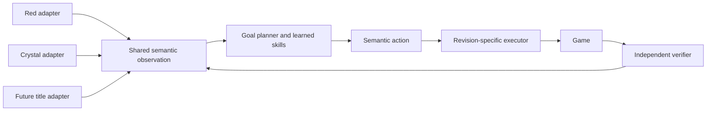

# Cross-game transfer plan

## What “understands how to play” means

Understanding is an evaluated capability, not a description of model internals. A player shows
reusable Pokémon knowledge when it can choose goals from semantic state, navigate and recover,
battle and capture for outcomes, manage resources and party development, build a living collection,
and need less new teaching in a held-out title than the same architecture starting from zero.

Completing a fixed Red route does not satisfy that definition. Red is the first curriculum; the
product is the shared hierarchy plus thin title/revision adapters.

## First prospective cross-title experiment

The active first test is Crystal V3:
[`crystal-goal-manager-transfer-v3.json`](../configs/crystal-goal-manager-transfer-v3.json), SHA-256
`1df5dcff58723e75788aa1f61a86d058fd2c2fd738618f072f470f28fb5bdd6a`.
It remains review-gated and authorizes no private context access.

V1 (Crystal 1.0) and V2 (Crystal 1.1) are preserved as retired zero-access designs. V2's ordinary
convex adaptation erased initialization in the Red calibration pilot, while its zero-loss
conjunction was badly underpowered. Reusing its identities would turn a design repair into
post-hoc selection, so V3 starts fresh.

V3 contains:

- 27 adaptation contexts: three per portable goal kind, assigned as nine three-label folds; and
- 54 independent sealed contexts: six per goal kind and six assigned to each fold.

The primary endpoint is zero-shot. Frozen authenticated Red weights and an all-zero control receive
the same 54 questions with identical architecture, normalization, masks and menus. Predictions are
committed before any sealed label. Discordant wins/losses are scored by a one-sided exact sign test
at `alpha = 0.05`. At the smallest useful win/loss/tie effect 0.50/0.20/0.30, the design has 82.3%
power. Missing predictions count as incorrect and optional stopping is impossible.

That paired test measures whether the frozen source weights contain signal; it is not by itself a
usefulness gate. The same prediction commitment therefore includes the title-neutral
`highest_pressure_goal_index` heuristic. Promotion additionally requires at least 27/54 absolute
accuracy and requires the Red model to match or beat that heuristic. The answer position is exactly
balanced in both partitions, and candidate position is never a model feature.

The assigned goal kind is only the expected label used to preregister balance. Any eventual teacher
label mismatch retires V3 without replacement, resampling, scoring or a transfer claim; its count
and partition must be published. No materializer may weaken this rule.

The mandatory secondary endpoint uses prior-preserving adaptation. Each Red-prior and zero-prior
candidate sees the same three examples in the same order with the same optimizer, normalizer and
prior strength; only the prior center differs. It is descriptive support, not a replacement primary
claim.

No Crystal context, label or prediction has been opened for V3. The next operation is external
review of the published code and plan, not cartridge execution.

## Transfer boundary

The shared model consumes a versioned Pokémon-mainline ontology. Each game supplies a thin adapter
around revision-specific state and actions:

The shared layer represents mode, party condition, battle affordances, resources, collection state,
capabilities, destination classes, goals and outcomes. Maps, coordinates, flags, NPCs, puzzles, raw
addresses and cartridge identifiers stay behind the adapter. High-level policies never consume a
teacher's expected label or a hidden completion flag.

Identity-free inputs are necessary but not sufficient. Candidate menus must contain genuine
reversals, and results are reported by candidate count. The current Red destination ranker is 19/19
on menus of at least three candidates but only 10/17 on binary menus; that is a warning that menu
shape can look like preference learning. Future transfer gates must beat a matched comparator on the
hard subset, not only report aggregate accuracy.

## Versioned evidence contract

Every private episode binds:

- trajectory and semantic-observation schemas;
- game, revision and source identities;
- root lineage and train/development/test partition;
- ordered and order-independent candidate-menu digests;
- action, intervention and independent outcome records; and
- model, comparator and adaptation configuration identities.

Descendants of one root inherit one partition. Test contexts never become learner-update inputs.
Failures and interruptions remain in fixed denominators. Teacher annotations may provide labels or
safety interventions, but they are not policy inputs.

## Promotion ladder

1. Run the battle scenario adapter first and produce one learner update plus an untouched-lineage
   outcome. The 600 retained disagreements guide coverage only; they are not outcome labels.
2. Add navigation and party-development adapters only after that loop works, then produce a learner
   update and unseen result in each before adding another family.
3. Promote bounded Red authority one skill at a time.
4. Connect the online goal loop and living-Pokédex dependency planner.
5. Measure zero-shot and prior-preserving Crystal transfer through reviewed protocols.
6. Compose learned Red skills only after bounded gates pass; full runs are final exams.
7. Add later titles by extending adapters and the mechanic vocabulary, not by copying walkthroughs.

For every transfer experiment, report frozen weights, from-scratch control, new labels, independent
context count, exact numerator/denominator, interventions, failures, power and authority boundary.
No cross-game claim is made until the target title was absent from source-game training.
