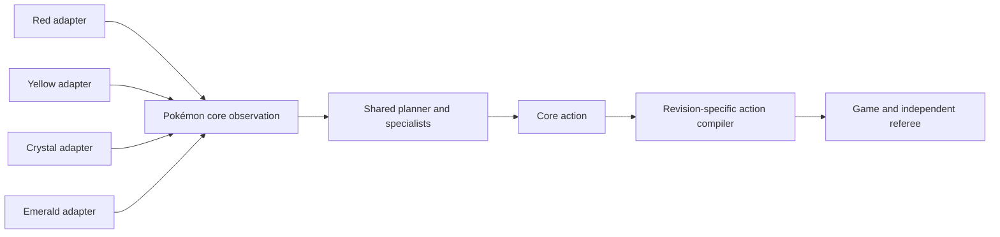

# Cross-game transfer plan

## What “understands how to play” means

This project will treat understanding as a measured capability rather than a description of the
model's internals. A policy demonstrates reusable Pokémon knowledge when it can:

- select sensible objectives from semantic progress rather than a memorized trace index;
- navigate, interact, battle, manage resources, and recover under held-out variation;
- explain its choice through a bounded objective, specialist, and action label;
- complete Pokémon Red with the teacher disabled; and
- reuse learned representations or policies in another Pokémon title with substantially less new
  data than training that title from scratch.

Completing an exact recorded route does not satisfy this definition.

## Transfer boundary

The learned policy consumes a versioned Pokémon-mainline ontology. Every supported game supplies a
thin adapter around its revision-specific emulator state:

The shared layer represents concepts such as:

- overworld, dialogue, menu, battle, transition, and terminal modes;
- routes, towns, interiors, gyms, caves, dungeons, and healing locations;
- party members, types, moves, HP, PP, status, items, money, and capabilities;
- navigation, interaction, menu, battle, recovery, and verification skills; and
- goals such as acquiring a capability, defeating a major trainer, traversing a dungeon, or
  completing the game.

Maps, coordinates, story flags, NPCs, trainer parties, puzzles, and raw numeric identifiers remain
namespaced to one game and revision. Raw RAM addresses, event bytes, screenshots, ROM data, and
teacher-only diagnostics are never policy inputs.

Every episode therefore has two authority lanes:

- the **policy observation** contains only semantic state the player could obtain from the game
  world, battle screen, menus, and ordinary status screens; and
- **teacher/referee annotations** may certify objectives and terminal evidence, but are stored as
  labels and are never concatenated into model input.

This prevents a policy from appearing competent by reading hidden story-event flags. During early
control-trace collection, uncertain interface phases are labeled conservatively rather than
advertising an incorrect action mask.

## Versioned data contract

Private training episodes use three independently pinned identities:

- trajectory schema, describing records and linkage;
- Pokémon core ontology, describing shared meanings; and
- game adapter, describing one title and ROM revision.

An episode contains a path-free manifest, action-aligned decision or execution records, and sparse
semantic events. Descendants of one clean run or training snapshot inherit the same split
partition, preventing nearby snapshot branches or DAgger corrections from leaking into held-out
evaluation.

The first recorder version captures executor-aligned control traces plus semantic state and
checkpoints. The second layer adds higher-level decision spans at the shared adaptive battle move
boundary: the model-facing snapshot contains only the Pokémon observation adapter's policy view,
while one zero-based move target links to every executor action used to carry out that turn.
Custom battle controllers and perturbed corrections remain separate follow-up coverage. Executor
traces alone are not described as a finished behavioral-cloning dataset because dialogue pulses
and waits would otherwise dominate it.

## Promotion ladder

1. **Red teacher recording:** reproduce the frozen teacher while validating state-hash chains.
2. **Red specialist learning:** train battle first, then navigation, interaction, inventory, and
   recovery policies.
3. **Red held-out completion:** complete clean runs across preregistered timing and perturbation
   schedules with teacher fallback disabled.
4. **Near-transfer title:** implement a second adapter and measure zero-shot and few-shot reuse.
   Pokémon Yellow is a useful first comparison because much of the generation-one mechanics and
   world vocabulary overlap while progression and encounters differ.
5. **Cross-generation transfer:** add a later-generation title, retrain only game-specific
   embeddings or adapters first, then measure how much shared policy knowledge survives.

For every transfer experiment, the repository will report the from-scratch baseline, reused
weights, frozen components, new training episodes, success denominator, and teacher interventions.
No cross-game claim is made until an entire title is held out from source-game training.
