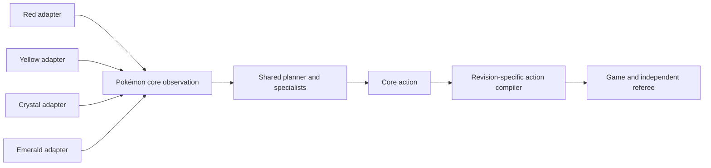

# Cross-game transfer plan

## What “understands how to play” means

This project will treat understanding as a measured capability rather than a description of the
model's internals. A policy demonstrates reusable Pokémon knowledge when it can:

- select sensible objectives from semantic progress rather than a memorized trace index;
- navigate, interact, battle, manage resources, and recover under held-out variation;
- explain its choice through a bounded objective, specialist, and action label;
- complete Pokémon Red with the teacher disabled; and
- reuse learned representations or policies in another Pokémon title with substantially less new
  data than training that title from scratch.

Completing an exact recorded route does not satisfy this definition.

## First prospective transfer experiment: Crystal

The first real cross-title test is frozen before a Crystal label or prediction exists. The
canonical plan is
[`crystal-goal-manager-transfer-v2.json`](../configs/crystal-goal-manager-transfer-v2.json), with
SHA-256 `e07ef52b1146f4c0ee05d003eea2f10f949e41a84398bb071def37f43ebd720b`.
It contains 72 disjoint semantic contexts:

- 18 zero-shot probes, two for each of the nine portable goal kinds;
- 27 adaptation examples, arranged as balanced prefixes of 9, 18 and 27; and
- 27 one-shot sealed test contexts, three for each goal kind.

The paired comparison holds the authenticated Red normalizer, Crystal rows, row order, optimizer
and update count fixed. One candidate starts from the promoted Red weights and the comparator
starts from zero weights. The primary endpoint is fixed at the nine-example adaptation budget over
all 27 sealed contexts: Red initialization must win at least six discordant pairs and lose none,
which gives an exact two-sided `p = 0.03125`. Missing predictions count as incorrect. All sealed
predictions must be committed before any test teacher action, and the experiment cannot stop early
or change its schema after seeing zero-shot behavior.

The ROM-free substrate is implemented: an identity-free nine-pressure projection, adapter-private
capability masks and bindings, bank-aware coherent party and Pokédex readers, and paired fitting
from Red and zero initialization. Canonical catalog, prediction-commitment and complete-outcome
artifacts bind every later result to the exact plan, source, cartridge, question and fitted-model
identities; partial sealed scoring is unavailable. The revision contract pins international
Crystal v1.1 and `pokecrystal11.sym` from `pret/pokecrystal`; the owner's ROM path, bytes and exact
SHA-256 remain private. The earlier v1.0 target was retired with every counter still zero and is
preserved only as a superseded preregistration. The v1.1 entry gate passes, while current counters
remain **0/18 zero-shot opened, 0/27 adaptation examples, 0/27 sealed test opened and 0
predictions**. A view-only loopback dashboard now combines rendered game frames with semantic
party, collection, goal, model and experiment status without exposing controller authority.

## Transfer boundary

The learned policy consumes a versioned Pokémon-mainline ontology. Every supported game supplies a
thin adapter around its revision-specific emulator state:

The shared layer represents concepts such as:

- overworld, dialogue, menu, battle, transition, and terminal modes;
- routes, towns, interiors, gyms, caves, dungeons, and healing locations;
- party members, types, moves, HP, PP, status, items, money, and capabilities;
- navigation, interaction, menu, battle, recovery, and verification skills; and
- goals such as acquiring a capability, defeating a major trainer, traversing a dungeon, or
  completing the game.

Maps, coordinates, story flags, NPCs, trainer parties, puzzles, and raw numeric identifiers remain
namespaced to one game and revision. Raw RAM addresses, event bytes, screenshots, ROM data, and
teacher-only diagnostics are never policy inputs.

The first training-control transfer invariant is executable rather than aspirational. A contract
test builds Red-like and Crystal-like parties with different species identifiers, move identifiers,
and venue names but identical semantic levels, health, PP, progress, and safety affordances. Both
adapters must project the exact same 25-feature training observation. This does not demonstrate
Crystal transfer; it prevents those title identities from becoming shortcuts before that benchmark
exists.

Identity-free inputs are necessary and not sufficient. The first affordance-masked Red training
candidate reached 100% held-out accuracy, but a baseline that saw only the candidate-action set
also reached 100%: every two-action set had the same label in every observed state. A later
transfer claim therefore requires at least one unchanged candidate set with multiple well-supported
labels, plus a held-out improvement over that candidate-only baseline. Otherwise the model may be
portable in format while learning no state-dependent Pokémon knowledge.

Every episode therefore has two authority lanes:

- the **policy observation** contains only semantic state the player could obtain from the game
  world, battle screen, menus, and ordinary status screens; and
- **teacher/referee annotations** may certify objectives and terminal evidence, but are stored as
  labels and are never concatenated into model input.

This prevents a policy from appearing competent by reading hidden story-event flags. During early
control-trace collection, uncertain interface phases are labeled conservatively rather than
advertising an incorrect action mask.

## Versioned data contract

Private training episodes use three independently pinned identities:

- trajectory schema, describing records and linkage;
- Pokémon core ontology, describing shared meanings; and
- game adapter, describing one title and ROM revision.

An episode contains a path-free manifest, action-aligned decision or execution records, and sparse
semantic events. Descendants of one clean run or training snapshot inherit the same split
partition, preventing nearby snapshot branches or DAgger corrections from leaking into held-out
evaluation.

The first recorder version captures executor-aligned control traces plus semantic state and
checkpoints. The second layer adds higher-level decision spans at the shared adaptive battle move
boundary: the model-facing snapshot contains only the Pokémon observation adapter's policy view,
while one zero-based move target links to every executor action used to carry out that turn.
Custom battle controllers and perturbed corrections remain separate follow-up coverage. Executor
traces alone are not described as a finished behavioral-cloning dataset because dialogue pulses
and waits would otherwise dominate it.

## Promotion ladder

1. **Red teacher recording:** reproduce the frozen teacher while validating state-hash chains.
2. **Red specialist learning:** train battle first, then navigation, interaction, inventory, and
   recovery policies.
3. **Red held-out completion:** complete clean runs across preregistered timing and perturbation
   schedules with teacher fallback disabled.
4. **Near-transfer title:** qualify the preregistered Crystal adapter and measure frozen-Red
   zero-shot reuse, fixed few-shot adaptation and an exactly matched from-scratch comparator.
5. **Cross-generation transfer:** add a later-generation title, retrain only game-specific
   embeddings or adapters first, then measure how much shared policy knowledge survives.

For every transfer experiment, the repository will report the from-scratch baseline, reused
weights, frozen components, new training episodes, success denominator, and teacher interventions.
No cross-game claim is made until an entire title is held out from source-game training.
